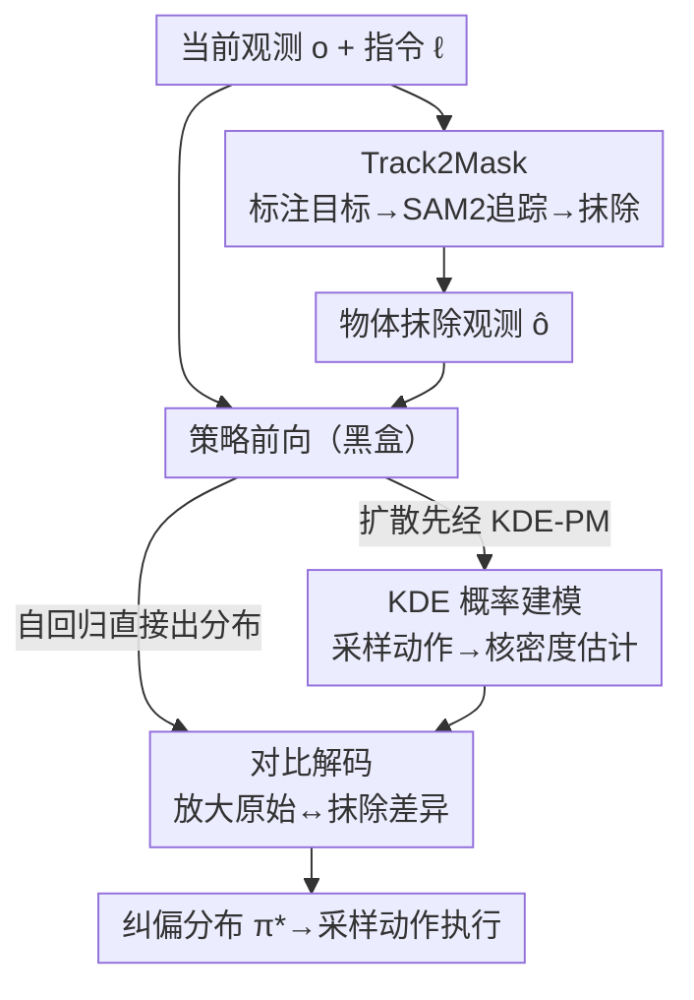

# Policy Contrastive Decoding for Robotic Foundation Models

**会议**: ICLR 2026  
**OpenReview**: [https://openreview.net/forum?id=P9PVdWyM3U](https://openreview.net/forum?id=P9PVdWyM3U)  
**项目页**: [https://koorye.github.io/PCD](https://koorye.github.io/PCD)  
**代码**: https://koorye.github.io/PCD （有）  
**领域**: 机器人 / 具身智能 / VLA  
**关键词**: 机器人基础模型, 虚假相关, 对比解码, 训练无关插件, 泛化

## 一句话总结
针对通用机器人策略容易把背景/纹理等无关特征和动作虚假绑定、导致换场景就掉点的问题，本文提出训练无关、即插即用的 Policy Contrastive Decoding（PCD）：用「原始观测」和「物体被抹掉的观测」两套动作分布做对比解码，把策略的注意力强行拉回到目标物体上，对自回归（OpenVLA）和扩散（Octo、$\pi_0$）两类策略都有效，仿真提升最高 50.6%、真机最高 108%。

## 研究背景与动机
**领域现状**：机器人基础模型（robotic foundation model，也叫 generalist robot policy）是当前做通用、灵活、灵巧机器人系统的主流路线。策略 $\pi_\theta(a_i \mid o_i, \ell)$ 吃进一帧视觉观测 $o_i$ 和一句语言指令 $\ell$，吐出一个机器人动作（如末端位移）。按动作生成方式分两类：自回归策略（OpenVLA，逐 token 生成动作维度）和扩散策略（Octo、$\pi_0$，从噪声并行去噪出整个动作向量）。

**现有痛点**：作者通过实验发现，这些策略在预训练轨迹上学到了大量**虚假相关（spurious correlation）**——它们其实是靠背景、光照、纹理这些任务无关特征来预测动作，而不是真正盯着目标物体。后果很直接：只要把背景稍微一改，比如挪一下打光区域或者抽屉把手位置，OpenVLA 的动作预测性能就分别掉了 36% 和 32%。一旦部署环境和训练分布有偏移（OOD），这种捷径就崩了。

**核心矛盾**：根本原因是训练分布下动作 $a$ 和任务无关因子 $v$ 之间存在统计依赖，即互信息 $I_{\text{train}}(a, v) > 0$。策略可以走捷径从 $v$ 推 $a$，但 $v$ 在测试时会独立于任务相关因子 $u$ 变化，捷径就失效。理想做法是「只用 $u$、滤掉 $v$」，但虚假特征跨任务跨场景变化太大、又和有用特征在特征空间里纠缠，直接识别并剔除它们非常困难。

**本文目标**：能不能搞一个**训练无关、即插即用**的方法，在推理阶段就把虚假相关的负面影响抵消掉，纠正现有策略的动作预测？而且要同时兼容自回归和扩散两类策略。

**切入角度**：作者从视觉语言模型里抑制幻觉的 **Visual Contrastive Decoding（VCD）** 得到启发——VCD 通过对比「原始输入」和「扰动输入」的输出分布来压制对语言先验的过度依赖。本文把这个思路迁移到机器人策略上，但对比的不是噪声扰动，而是「把目标物体抹掉」前后的动作分布。

**核心 idea**：用「原始观测」和「物体被遮挡的观测」两套动作概率分布做对比，放大二者的差异，从而把策略的注意力从虚假特征 $v$ 拉回到目标相关特征 $u$。

## 方法详解

### 整体框架
PCD 把每个预训练策略当成**黑盒**，不碰参数、不微调，只在推理时介入。给定当前观测 $o_i$ 和指令 $\ell$，整条 pipeline 是：先用 Track2Mask 自动生成一份「目标物体被抹掉」的观测 $\hat{o}_i$；策略分别在 $o_i$ 和 $\hat{o}_i$ 上前向，得到两套动作分布 $\pi_\theta(a_i \mid \ell, o_i)$ 和 $\pi_\theta(a_i \mid \ell, \hat{o}_i)$；对二者做对比解码，得到纠偏后的分布 $\pi_\theta^*$，从中采样动作执行。对于扩散策略拿不到显式分布的问题，中间插一道 KDE-PM 把采样动作转成概率分布。

### 关键设计

**1. Policy Contrastive Decoding：用「抹掉物体」前后的动作分布差异给预测纠偏**

这是方法的主干，直接针对「策略靠虚假特征预测动作」这个痛点。直觉是：如果一个特征是真正决定动作的目标相关特征 $u$，那把目标物体从画面里抹掉后，动作分布应该发生明显变化；反之，如果策略主要靠背景纹理 $v$ 做决策，抹不抹物体对输出影响不大。PCD 把这个差异**放大**，让最终分布偏向「依赖物体」的那部分预测。具体地，对比后的动作分布为

$$\pi_\theta^*(a_i \mid \ell, o_i) = \frac{1}{C} \cdot \pi_\theta(a_i \mid \ell, o_i) \left( \frac{\pi_\theta(a_i \mid \ell, o_i)}{\pi_\theta(a_i \mid \ell, \hat{o}_i)} \right)^{\alpha},$$

其中 $C$ 是归一化常数，$\alpha \ge 0$ 控制放大强度——$\alpha$ 越大，对两套分布的差异放大得越狠；特别地 $\alpha = 0$ 时退化回原始策略。比值 $\pi_\theta(a_i \mid \ell, o_i) / \pi_\theta(a_i \mid \ell, \hat{o}_i)$ 大于 1 的动作（即「有物体时更倾向、没物体时不倾向」的动作）被进一步加权，于是纠偏后的分布对 $u$ 里的物体相关特征更敏感、对 $v$ 里的虚假特征更迟钝。和原版 VCD 的区别在于：VCD 对比的是原始 vs. 噪声/去图输入、对抗的是语言先验，而 PCD 对比的是原始 vs. 物体遮挡输入、对抗的是机器人策略对无关场景特征的过度依赖。

**2. Tracking-to-Mask：低人力地把每帧轨迹里的目标物体自动抹掉**

PCD 需要 $\hat{o}_i$，但一条轨迹有几十上百帧，逐帧手动抠图不现实，这个设计就是解决「$\hat{o}_i$ 怎么自动来」。Track2Mask 分两步：第一步在轨迹的**初始**观测上标注目标物体，可以用人给的 Point / Box 提示（少量人力），也可以用现成的开放词表检测模型（如 Grounding DINO）做全自动标注；第二步用 SAM2 把这个物体在后续所有帧里**跟踪并分割**出来，再对分割区域做 inpainting（如 LaMa），得到物体被抹除的观测序列。这样只需在第一帧介入一次（甚至全自动），就能拿到整条轨迹的遮挡版本，保证了方法的「即插即用」和实用性。

**3. KDE-based Probabilistic Modeling：给拿不到显式分布的扩散策略补出动作分布**

自回归策略天然能输出每个动作维度的概率分布，可直接喂进 Eq.(2)；但扩散策略只会从噪声并行去噪出一个个动作样本，没有显式的 $\pi_\theta(a_i \mid \ell, o_i)$，PCD 用不了。KDE-PM 就是补这个缺口。它先用预训练扩散策略采样 $N$ 个候选动作 $\{a_i(j)\}_{j=1}^N$，假设各动作维度独立 $\pi_\theta(a_i \mid \ell, o_i) = \prod_{t=1}^M \pi_\theta(a_t \mid \ell, o_i)$，再对每一维用核密度估计还原概率分布：

$$\pi_\theta(a_t \mid \ell, o_i) \approx \frac{1}{C'} \sum_{j=1}^N K\!\left( \frac{a_t - a_t(j)}{b} \right), \quad t = 1, \dots, M,$$

其中 $K(\cdot)$ 是高斯核，$b$ 是控制平滑度的带宽参数。对遮挡观测 $\hat{o}_i$ 同样估一份 $\pi_\theta(a_t \mid \ell, \hat{o}_i)$，再借独立假设拼成联合分布，最后套 Eq.(2) 做对比。实验里 Octo 和 $\pi_0$ 都取 $N = 24$。有了 KDE-PM，PCD 就能统一覆盖自回归和扩散两类策略。

### 一个完整示例
以 OpenVLA 在「Move Right vs. Move Left」这种二维动作（只看 $\Delta x, \Delta y$）为例：原始观测 $o$ 下策略可能因为背景里某块光照而偏向「Move Left」，给出分布 $p$；把目标物体抹掉得到 $\hat{o}$，此时策略只能靠剩下的虚假特征，仍然倾向「Move Left」，给出分布 $\hat{p}$。对比解码看的是「有物体 vs. 没物体」哪个动作变化大——真正由物体驱动的「Move Right」在 $p$ 里相对 $\hat{p}$ 被抬高，于是放大后的 $p^*$ 把概率质量推向「Move Right」，纠正了原本被背景带偏的错误预测。整个过程不更新任何权重，只在推理时把两次前向的输出拿来重新加权。

## 实验关键数据

### 主实验
仿真在 SIMPLER（real-to-sim 评测环境）上，跨 Google Robot 和 WidowX 两个平台共 9 个任务，每个数字是 300 次试验的成功率（%）。三种标注方式：人工 Point、人工 Box、自动 GDINO。

| 策略 | Base 平均 | +PCD (Point) | +PCD (Box) | +PCD (GDINO) | 相对提升 |
|------|-----------|--------------|------------|--------------|----------|
| OpenVLA（自回归） | 16.8 | 24.4 | 22.9 | 25.3 | +45.2% / +36.3% / **+50.6%** |
| Octo（扩散） | 13.8 | 17.6 | 17.4 | 17.9 | +27.5% / +26.1% / **+29.7%** |
| $\pi_0$（扩散） | 63.9 | 68.1 | 68.6 | 69.6 | +6.6% / +7.4% / **+8.9%** |

真机用 AGILEX PIPER 6DOF 机械臂、6 个操作任务（每任务 10 条示范微调、20 次试验），以更强的 $\pi_0$ 为基线、GDINO 自动标注 + LaMa 修补：PCD 把平均成功率提升 **108%**，代价是平均推理时间增加 24%（作者认为这个 trade-off 在多数应用里可接受）。

### 消融实验
仿真 9 任务平均结果。

| 维度 | 配置 | 结论 |
|------|------|------|
| 放大系数 $\alpha$ | $\{0, 0.2, ..., 1.0\}$ | $\alpha > 0$ 时三策略一致提升；Octo / OpenVLA / $\pi_0$ 各自最优 $\alpha = 1.0 / 0.8 / 0.2$ |
| 检测模型 | GDINO / YOLO-World / SED | 三者都能提升，GDINO 总体最好，对检测器不敏感 |
| 修补策略 | Telea / Navier-Stokes / LaMa | 三者都能提升，LaMa 在三策略上均最优，对修补方式不敏感 |

### 关键发现
- **PCD 对扰动鲁棒**：在改变亮度的未见场景下，OpenVLA 和 $\pi_0$ 分别掉 48% 和 75%，PCD 能一致缓解各类虚假相关（空间关系、亮度、干扰物、桌面纹理）带来的退化；加上 PCD 后两策略甚至在 4/10 的未见场景里比原训练场景表现还好。
- **越强的基线提升越小**：$\pi_0$ 本身远强于 OpenVLA / Octo（如「Apple Drawer」任务后两者近乎 0%，$\pi_0$ 有 17%），它对虚假相关的依赖更轻，所以 PCD 的相对增益（8.9%）也更温和——但真机更复杂背景下 $\pi_0$ 反而拿到 108% 的大幅提升，说明场景越复杂、虚假相关越严重时 PCD 越值钱。
- **超参不需逐任务调**：仿真和真机全程用同一套 PCD 超参（不针对每个任务单独调 $\alpha$），仍稳定提升，作者认为逐任务调参还有进一步提升空间。

## 亮点与洞察
- **把 VLM 抗幻觉的对比解码迁到机器人动作空间**：原来 contrastive decoding 是 token 级抗幻觉，这里换成「物体遮挡 vs. 原始」的动作分布对比，本质是在推理时做了一次因果干预（移除目标物体看动作分布变不变），思路很干净且可解释。
- **黑盒 + 训练无关 + 双范式兼容**：不碰权重、不微调，仅靠两次前向就能用，且通过 KDE-PM 把扩散策略也纳进来——这意味着它能挂在几乎任何现成机器人策略上，工程落地门槛很低。
- **KDE-PM 这招可复用**：凡是「只输出样本、不输出显式分布」的生成式策略，想做分布级别的对比/加权时，都可以用核密度估计把样本还原成分布，再做后续操作。

## 局限与展望
- **推理时间增加 24%**：要跑两次前向（原始 + 遮挡），外加 Track2Mask 的检测/跟踪/修补开销，实时性敏感的场景需要权衡。
- **依赖目标物体可被检测/分割**：Track2Mask 建立在「能在初始帧标注并用 SAM2 跟踪目标」之上，对小物体、遮挡严重、目标定义模糊或多目标交互的任务可能失效，文中未深入讨论这类失败。
- **独立性假设较强**：KDE-PM 假设各动作维度相互独立来拼联合分布，对维度间强耦合的动作空间可能引入近似误差。
- **超参未逐任务优化**：作者也承认逐任务调 $\alpha$ 还有上升空间，当前结果是统一超参下的保守值。

## 相关工作与启发
- **vs Near On-policy Sampling (NOS) 等 query 采样方法**：那类工作改的是「训练时给哪些数据」，PCD 改的是「推理时怎么解码」，两者正交；PCD 不需要重新训练或采样新反馈。
- **vs VCD / ICD（VLM 对比解码）**：它们对比原始 vs. 噪声/去图输入来压制语言先验导致的幻觉，PCD 对比原始 vs. 物体遮挡输入来对抗机器人策略对无关场景特征的过度依赖；对比的「扰动方式」和「要纠正的偏差」都不同，且首次把这套机制用到机器人策略的虚假相关问题上。
- **vs 直接「识别并剔除虚假特征」的做法**：直接在特征空间里分离 $u$ 和 $v$ 很难（跨任务变化大、特征纠缠），PCD 绕过了显式分离，用「遮挡目标物体」这一可操作的代理来间接放大对 $u$ 的依赖。

## 评分
- 新颖性: ⭐⭐⭐⭐⭐ 首个用训练无关对比解码解决机器人策略虚假相关问题，迁移视角巧妙
- 实验充分度: ⭐⭐⭐⭐ 覆盖 3 策略 / 仿真+真机 / 15 任务、消融完整，但真机基线主要是 $\pi_0$ 单一策略
- 写作质量: ⭐⭐⭐⭐ 动机—方法—实验逻辑清晰，定义和公式给得到位
- 价值: ⭐⭐⭐⭐⭐ 即插即用、黑盒兼容两类策略，落地价值高

<!-- RELATED:START -->

## 相关论文

- [\[ICLR 2026\] Masked Generative Policy for Robotic Control](masked_generative_policy_for_robotic_control.md)
- [\[ICLR 2026\] From Seeing to Experiencing: Scaling Navigation Foundation Models with Reinforcement Learning](from_seeing_to_experiencing_scaling_navigation_foundation_models_with_reinforcem.md)
- [\[ICLR 2026\] Genie Envisioner: A Unified World Foundation Platform for Robotic Manipulation](genie_envisioner_a_unified_world_foundation_platform_for_robotic_manipulation.md)
- [\[ICML 2026\] Contrastive Representation Regularization for Vision-Language-Action Models](../../ICML2026/robotics/contrastive_representation_regularization_for_vision-language-action_models.md)
- [\[CVPR 2025\] Lift3D Foundation Policy: Lifting 2D Large-Scale Pretrained Models for Robust 3D Robotic Manipulation](../../CVPR2025/robotics/lift3d_policy_lifting_2d_foundation_models_for_robust_3d_robotic_manipulation.md)

<!-- RELATED:END -->
