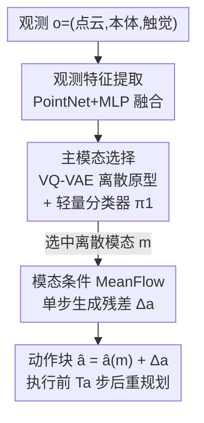

# Primary-Fine Decoupling for Action Generation in Robotic Imitation

**会议**: ICLR 2026  
**OpenReview**: [https://openreview.net/forum?id=wySMuWHmt4](https://openreview.net/forum?id=wySMuWHmt4)  
**项目页**: [https://xiaohanlei.github.io/projects/PF-DAG](https://xiaohanlei.github.io/projects/PF-DAG)  
**代码**: 无  
**领域**: 机器人 / 模仿学习 / 生成式策略  
**关键词**: 模仿学习, 多模态动作, 向量量化, MeanFlow, 闭环控制

## 一句话总结
PF-DAG 把机器人模仿学习的动作生成拆成「先用一个轻量分类器从离散原型里选一个粗模态、再用单步 MeanFlow 生成器补上模态内的连续细节」两阶段，既避免了离散化丢失精度、又消除了单阶段生成式策略在相邻时间步乱跳模态（mode bouncing）的问题，在 Adroit/DexArt/MetaWorld 共 56 个任务和真实带触觉的灵巧手任务上都超过扩散/流式基线。

## 研究背景与动机

**领域现状**：机器人操作的专家演示天然是**多模态**的——同一个观测下可能有多个同样合法的动作（比如末端前面有障碍物，演示者既可以从左绕也可以从右绕）。模仿学习要想稳健，就必须把这种多模态分布建模出来。目前主流有三条路：行为克隆（BC）做监督回归 $a=\pi(o)$；动作离散化（tokenization）把连续动作量化成离散符号后用序列模型预测；生成式策略引入隐变量 $a=\pi(o,z)$，靠采样不同的 $z$ 得到不同合法动作（如 ACT 的 CVAE、Diffusion Policy 的去噪）。

**现有痛点**：三条路各有硬伤。BC 会把多个合法动作**塌缩成一个均值**（mode collapse），输出一个谁都不像的"平均动作"。离散化策略虽然能表示多模态，但粗量化带来**重建误差和时间不连续性**，轨迹不光滑、对不上人类演示。生成式策略表达力强，但每一步独立重采样 $z$ 会导致相邻时间步在不同模态之间**随机乱跳**（mode bouncing），直接造成轨迹断裂和末端位姿抖动，拖垮任务成功率。

**核心矛盾**：离散化牺牲精度换稳定，单阶段连续生成保留精度却换来不稳定的模态切换——**"粗粒度的模态一致性"和"细粒度的连续变化"被耦合在同一个生成过程里，按下葫芦浮起瓢**。

**切入角度**：作者观察到，很多操作任务的动作天然可以分解成**少量离散、可解释的"主模态"**（粗原型，如"先抬后折""先抬后转"）加上**模态内的连续微调**（抓取偏移、轨迹小修正）。主模态负责粗的离散决策，模态内残差负责细粒度变化——这两件事本该分开做。

**核心 idea**：把动作生成显式拆成两阶段——第一阶段一致地选一个**离散主模态**，第二阶段在选定模态条件下生成**细粒度连续动作**。用离散选择锁住粗模态消除 bouncing，用连续生成器保住模态内精度。

## 方法详解

### 整体框架
PF-DAG（Primary-Fine Decoupling for Action Generation）是一个两阶段的闭环动作序列预测框架。任务被建模为 receding-horizon 闭环控制：在时刻 $t$ 给定观测 $o_t=(p_t, s_t, f_t)$（点云、本体感知、触觉），策略预测一个动作块 $\hat a_t\in\mathbb{R}^{T_p\times d_a}$，执行前 $T_a\le T_p$ 步后重新规划。

整条流水线分三个组件：① **观测特征提取**——PointNet 风格处理点云、MLP 处理本体/触觉，融合成共享观测嵌入；② **主模态阶段**——训练时用 VQ-VAE 把真值动作块压成 $K$ 个离散主模态作为监督，再训一个轻量分类器 $\pi_1(m\mid o)$ 从观测直接预测该选哪个模态（VQ-VAE 只在训练用，推理时不需要）；③ **模态条件 MeanFlow 阶段**——给定选中的模态 $m$ 和观测，单步生成器 $\pi_2$ 生成高保真连续动作。最终动作是模态的 VQ 重建 $\hat a(m)$ 加上生成器补的残差 $\Delta a$。

### 关键设计

**1. VQ-VAE 主模态词表 + 轻量分类器：把"选哪条路"变成离散决策**

这一步针对的是单阶段生成式策略的 mode bouncing。作者先用一个 VQ-VAE 把连续动作块 $a$ 压缩成**少量**离散主模态 $m\in\{1,\dots,K\}$：编码器 $E_\phi$ 得到 $z_e=E_\phi(a)$，量化到最近的码本向量 $k^*=\arg\min_k\|z_e-e_k\|^2$，令 $\tilde z=e_{k^*}$、$m:=k^*$，重建 $\hat a(m)=D_\psi(\tilde z)$。训练用标准 VQ 损失：
$$L_{VQ}(a)=\|a-D_\psi(\tilde z)\|_2^2+\|\mathrm{sg}[E_\phi(a)]-\tilde z\|_2^2+\beta\|E_\phi(a)-\mathrm{sg}[\tilde z]\|_2^2$$
其中 $\mathrm{sg}[\cdot]$ 是停止梯度、$\beta$ 是 commitment 权重。关键是**码本 $K$ 故意取小**，只捕捉粗的主原型、让主模态容易学。然后主模态策略 $\pi_1(m\mid o)$ 就是一个轻量 MLP 分类器，用交叉熵去匹配编码器分配的 VQ 索引；**推理时贪心选概率最高的模态**。把"选模态"显式做成一个分类问题、而不是混在连续采样里，就从根本上压住了粗模态的来回跳动。

**2. 模态条件单步 MeanFlow 生成器：在选定模态内补回连续细节**

选完模态后，光靠 VQ 重建 $\hat a(m)$ 是不够的（量化误差很大，消融里几乎完全失败）。所以第二阶段要在模态条件下恢复高保真连续动作，且要**实时**。作者借鉴 MeanFlow 用**单步**生成代替多步去噪：学一个平均速度场 $\bar v_\theta(z_r,\tau,r;o,m)$ 预测从噪声到目标残差的位移，一次函数评估就出结果。$z_r$ 是噪声与目标动作插值路径上的状态，$\tau\in[0,1]$ 是插值起点、$r\in(0,1]$ 是终点。速度场被训练去匹配任意区间 $[\tau,r]$ 上的真值平均速度：
$$\bar v^*(z_r,\tau,r)=\mathrm{sg}\Big[\frac{dz_r}{dr}-(r-\tau)\big(\frac{dz_r}{dr}\frac{\partial\bar v_\theta}{\partial z}+\frac{\partial\bar v_\theta}{\partial r}\big)\Big]$$
其中 $\frac{dz_r}{dr}$ 是 $z_r$ 在时刻 $r$ 的瞬时速度。生成器只负责产出条件残差 $\Delta a$，最终动作 $\hat a=\hat a(m)+\Delta a$。骨干用 DiT 风格 transformer，动作块表示成 token 序列；$\tau,r$ 用正弦嵌入加到观测嵌入上，再加一个离散模态 $m$ 的可学习嵌入。推理时取 $(\tau,r)=(0,1)$ 一步出动作块——既保住模态内精度又快到能做实时闭环。

**3. 两阶段分解的 MSE 下界证明：理论上严格优于单阶段生成**

这个设计点是给前两步背书的理论分析，回答"为什么粗到细的两阶段一定不会更差、通常更好"。对单阶段生成式策略，平方误差下最优点估计是条件期望，期望 MSE 分解为不可约的数据方差加模型偏差：
$$\mathbb{E}_{o,a}\big[\|a-\hat a_g^*(o)\|^2\big]=\mathbb{E}_o\big[\mathrm{Var}(a\mid o)\big]+\mathbb{E}_o\big[\|\mathbb{E}[a\mid o]-\hat a_g^*(o)\|^2\big]$$
无偏时第二项消失，最小误差等于 $\mathbb{E}_o[\mathrm{Var}(a\mid o)]$。两阶段方案里第一阶段先选离散模态，对固定 $(o,m)$ 的最优预测把 $z$ 的随机性收成条件期望，不可约残差变成 $\mathbb{E}_{o,m}[\mathrm{Var}(a\mid o,m)]$。由全方差定律：
$$\mathbb{E}_{o,m}\big[\mathrm{Var}(a\mid o,m)\big]=\mathbb{E}_o\big[\mathrm{Var}(a\mid o)\big]-\mathbb{E}_o\big[\mathrm{Var}_{m\mid o}\mathbb{E}[a\mid o,m]\big]$$
右边第二项非负，所以两阶段的 MSE 下界**不会高于**单阶段，且只要模态间方差 $\mathrm{Var}_{m\mid o}\mathbb{E}[a\mid o,m]>0$ 就**严格更低**。直觉是：离散化主模态把"模态间方差"从残差误差里剥离出去，剩给连续生成器的只是模态内方差，自然更好拟合。

### 损失函数 / 训练策略
分阶段训练：先单独预训练 VQ-VAE 学紧凑主原型，然后**冻结码本**，再联合训练主模态策略 $\pi_1$（交叉熵对齐 VQ 索引）和模态条件 MeanFlow 生成器 $\bar v_\theta$（在采样的 $(\tau,r)$ 区间上做平方误差监督）。优化器全用 AdamW，学习率短线性 warmup 后接 cosine 衰减。推理时 $(\tau,r)=(0,1)$ 单步生成。

## 实验关键数据

### 主实验
在 Adroit（高维 Shadow 手）、DexArt（Allegro 手）、MetaWorld（低维夹爪）三大仿真基准的代表性 18 个任务上对比（每任务 3 个 seed，取 top-5 成功率均值）：

| 任务/基准 | IBC | DP | DP3 | FlowPolicy | PF-DAG |
|-----------|-----|-----|-----|-----------|--------|
| Adroit-Pen | 0.10 | 0.25 | 0.43 | 0.53 | **0.65** |
| DexArt-Faucet | 0.07 | 0.23 | 0.63 | 0.42 | **0.72** |
| MetaWorld-Medium(6) | 0.11 | 0.20 | 0.45 | 0.47 | **0.68** |
| MetaWorld-Hard(5) | 0.09 | 0.19 | 0.35 | 0.37 | **0.72** |
| **整体 Success** | 0.08 | 0.30 | 0.51 | 0.51 | **0.72** |

整体成功率从次优的 0.51 提到 0.72，在最难的 MetaWorld-Hard 上从 0.37 翻到 0.72，提升最显著。真实世界 4 个任务（含带触觉的灵巧手 Wipe Table / Place Toy Into Bin）同样领先：

| 真实任务 | Vanilla BC | DP3 | PF-DAG |
|----------|-----------|-----|--------|
| Pick Cube（夹爪） | 0.20 | 0.60 | **0.70** |
| Place Baymax（夹爪） | 0.40 | 0.85 | **0.90** |
| Wipe Table（XHand+触觉） | 0.00 | 0.55 | **0.70** |
| Place Toy Into Bin（XHand+触觉） | 0.00 | 0.60 | **0.80** |

### 消融实验

| 配置 | Token. | #Modes | 加权成功率 | 说明 |
|------|--------|--------|-----------|------|
| Full（PM+MF） | VQ-VAE | 64 | **0.72** | 完整模型 |
| w/o MF（只 PM 解码） | VQ-VAE | 64 | 0.01 | 去掉生成器几乎全崩 |
| w/o PM（无模态条件） | VQ-VAE | 64 | 0.56 | 去掉主模态掉 0.16 |
| Full | VQ-VAE | 8 | 0.61 | 模态太少 |
| Full | VQ-VAE | 1024 | 0.58 | 模态太多反而难学 |
| Full | K-means | 64 | 0.70 | VQ-VAE 略优于 K-means |

### 关键发现
- **去掉 MeanFlow 生成器（只用 VQ 重建当最终动作）成功率从 0.72 暴跌到 0.01**：少量模态下的量化误差会产生巨大重建畸变，直接毁掉任务——证明连续生成器不可或缺。
- **去掉主模态策略掉 0.16 绝对成功率**：显式的离散模态选择确实大幅简化了下游连续生成、压住了粗模态 bouncing。
- **模态数 $K$ 有甜点**：$K=64$ 最好，$K=8$（0.61）太粗、$K=1024$（0.58）太细反而让分类器难学；VQ-VAE（0.72）略胜 K-means（0.70）。
- **速度-精度权衡**：单步 MeanFlow 解码 FPS（~40.9）和 1-NFE DP3（41.7）相当，但成功率（0.71 vs 0.47）显著更高，满足 30Hz 实时控制。
- **短动作块下的反应性**：动作块越短越接近高反应闭环，DP3 在短块下因 mode bouncing 急剧掉点，而 PF-DAG 靠模态一致性在短块下仍保持高成功率。

## 亮点与洞察
- **"选路"和"走路"解耦**是核心洞察：把多模态建模拆成离散的粗决策 + 连续的细微调，正好对症单阶段策略的两大病——离散丢精度、连续乱跳模态，一个设计同时治两病。
- **VQ-VAE 只在训练用、推理时丢掉**很巧妙：离散原型只是用来给主模态分类器造监督信号，部署时只剩一个轻 MLP 分类器 + 单步生成器，又快又轻。
- **理论与工程闭环**：全方差定律那一步把"离散化为什么有用"讲成了"剥离模态间方差"，给经验设计一个干净的统计解释，而且是严格下界，不是 hand-waving。
- **可迁移性**：这种"先量化选粗模态、再生成补细节"的两阶段范式，对任何多模态序列生成（如轨迹规划、运动合成）都可能套用，离散模态当作生成器的强条件。

## 局限与展望
- 主模态用贪心选概率最高的一个，**没有保留模态级的不确定性**——当观测真的处在两个模态边界时，硬选一个可能不是最优，缺少对模态切换时机的显式建模。
- 论文承认典型失败发生在**分布外物体摆放**或**触觉间歇性噪声**时，说明对 OOD 和传感器噪声的鲁棒性还依赖加演示/数据增强，没有内在机制。
- 模态数 $K$ 是需要调的关键超参（8/64/1024 差异明显），不同任务复杂度下最优 $K$ 可能不同，缺自适应选 $K$ 的办法。
- 理论分析建立在"无偏模型"等理想假设上，严格改进依赖模态间方差为正——对模态间差异很小的任务，两阶段的收益会趋于零。

## 相关工作与启发
- **vs Diffusion Policy / DP3（单阶段生成式）**：它们用多步去噪建连续多模态分布，但每步独立采样导致 mode bouncing 且推理慢；PF-DAG 用离散主模态锁住粗决策 + 单步 MeanFlow 补细节，既消除 bouncing 又把推理压到单步，理论上 MSE 下界还更低。
- **vs 离散化/Tokenization 策略（如 VQ tokenizer、FAST）**：它们把整个动作都量化成 token，重建精度被离散简洁性牺牲掉；PF-DAG 只把 tokenization 用于**高层主模态选择**，细粒度变化交给连续生成器，避免丢精度。
- **vs HDP 等层次化策略**：HDP 依赖任务特定的人工启发式（如接触点 waypoint）来定义层次；PF-DAG 的主模态是**端到端从动作块聚类里学出来**的，是更通用、不绑死预定义启发式的抽象。

## 评分
- 新颖性: ⭐⭐⭐⭐ 把离散 tokenization 与连续生成显式两阶段解耦并配上 MSE 下界证明，组合清晰且动机扎实
- 实验充分度: ⭐⭐⭐⭐⭐ 56 个仿真任务 + 真实灵巧手触觉任务，消融覆盖两大组件、模态数、tokenizer、速度与块长权衡
- 写作质量: ⭐⭐⭐⭐ 动机—方法—理论—实验链路顺畅，图 1 的四种失败模式对比直观
- 价值: ⭐⭐⭐⭐ 在实时闭环机器人操作上同时拿到稳定性、精度和速度，范式对多模态序列生成有迁移潜力

<!-- RELATED:START -->

## 相关论文

- [\[ICLR 2026\] Geometry-Aware Policy Imitation](geometry-aware_policy_imitation.md)
- [\[ICLR 2026\] Translating Flow to Policy via Hindsight Online Imitation](translating_flow_to_policy_via_hindsight_online_imitation.md)
- [\[ICML 2025\] Action-Constrained Imitation Learning](../../ICML2025/robotics/action-constrained_imitation_learning.md)
- [\[ICLR 2026\] Self-Improving Vision-Language-Action Models with Data Generation via Residual RL](self-improving_vision-language-action_models_with_data_generation_via_residual_r.md)
- [\[CVPR 2026\] Expanding Spatial and Temporal Context for Robotic Imitation Learning With Scene Graphs](../../CVPR2026/robotics/expanding_spatial_and_temporal_context_for_robotic_imitation_learning_with_scene.md)

<!-- RELATED:END -->
