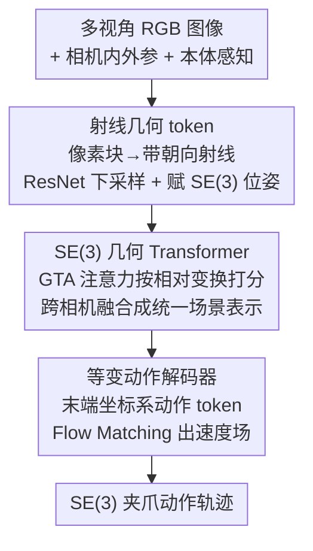

# RAVEN: End-to-end Equivariant Robot Learning with RGB Cameras

**会议**: ICLR 2026  
**OpenReview**: [https://openreview.net/forum?id=z8BN7KyaPl](https://openreview.net/forum?id=z8BN7KyaPl)  
**代码**: https://dmklee.github.io/raven (项目页，承诺录用后开源)  
**领域**: 机器人 / 具身智能  
**关键词**: 等变策略, SE(3)等变, 模仿学习, 射线表示, Flow Matching

## 一句话总结
RAVEN 把 RGB 图像的每个像素块看成一条带朝向的 3D 射线，从而在只有普通 RGB 相机（不需要点云、深度或俯视固定视角）的前提下构造出首个端到端 SE(3) 等变的机器人操作策略，在 MimicGen / DexMimicGen 仿真和真机上都大幅超过 Diffusion Policy 等强基线，且训练比已有等变方法还快 1.6×。

## 研究背景与动机

**领域现状**：模仿学习里 Diffusion Policy、大规模行为克隆这类视觉运动策略已经能在多样场景下学会操作，但要在传感器/场景变化下保持鲁棒，它们普遍需要大量演示数据。一条提升样本效率的成熟路线是把对称性（equivariance）显式编码进网络——如果策略对场景的空间变换（物体换个位姿、桌面换个布局）能一致地响应，那它就能从很少的演示里泛化出去。

**现有痛点**：可惜现有的等变操作方法都对输入模态提了苛刻要求——要么吃点云（EquiBot 需要 SIM(3) 等变 + 准确的物体分割），要么吃带已知对齐的俯视 RGB-D（EquiDiffPo 假设相机固定）。但真正流行的机器人学习装置（UMI、ALOHA、Mobile-ALOHA）用的是任意摆放的廉价 RGB 相机、拍出来就是原始 2D 图像，上面这些假设全都不成立。

**核心矛盾**：2D 像素只活在相机平面里，只支持 2D 平面变换；而 SE(3) 等变需要的是能被 3D 旋转+平移作用的量。图像与 3D 等变之间隔着一道「2D 像素 → 3D 几何」的鸿沟，过去要么靠点云绕过去（牺牲了「只用 RGB」），要么干脆不做 3D 等变。

**本文目标**：在**只有 RGB 图像、相机数目和摆放任意**的条件下，造出一个端到端的 SE(3) 等变策略网络。

**切入角度**：作者的关键观察是——一张图像不仅是「像素坐标 → RGB」的映射，更可以看成「从相机光心射向世界的一束射线」。给定相机内参 $K$ 和外参 $M=[R|t]$，像素 $u$ 对应的射线是 $r=(t,\,RK^{-1}u)$，origin 在相机位置、direction 是单位方向。射线天然定义在 3D 里：当场景被一个 $g\in SE(3)$ 变换时，**图像内容一点没变，但相机外参变了，于是射线被 SE(3) 作用了**。这就把图像悄悄接进了 3D 等变的世界。

**核心 idea**：用「带朝向的射线特征」代替「2D 像素」作为输入表示，让 RGB 观测变成可被 SE(3) 等变层处理的几何 token，从而端到端地把等变性贯穿编码器到动作解码器。

## 方法详解

### 整体框架

RAVEN 要解决的是：输入是若干任意摆放 RGB 相机的多视角图像 + 机器人本体感知（末端位姿、夹爪状态），输出是一段未来的 SE(3) 夹爪动作轨迹；整条管线要对场景的全局 SE(3) 变换保持等变。它分三步走：先把每张图像用预训练 ResNet 下采样成特征图，给每个网格格子按相机投影赋一个 SE(3) 位姿，打包成「几何 token」（特征被位姿规范化到局部坐标系）；再用 GTA 风格的 SE(3) 几何 Transformer 融合所有相机和本体的 token，得到一份统一的 3D 场景表示；最后用一个 Flow Matching 训练的等变动作解码器，把这份表示解码成相对末端坐标系的速度场、积分出动作轨迹。等变性靠的是「规范化（canonicalization）」而非昂贵的群卷积：特征默认存在局部规范帧里、用位姿硬编码地解规范化到全局帧，所以前馈层作用在规范化特征上不破坏等变、注意力只看 token 之间的相对变换。

### 关键设计

**1. 射线几何 token：把 2D 图像翻译成可被 SE(3) 作用的 3D 量**

这一步直击「2D 像素无法被 3D roto-translation 作用」这个根本障碍。作者不把像素当平面上的点，而是当一条 3D 射线：依据已知相机内外参，像素 $u$ 对应射线 $r=(t,\,RK^{-1}u)$。直接处理逐像素射线太贵，于是先用预训练 ResNet 把图像下采样成特征图——既快又强地抽特征，又减轻了后续 3D 运算负担。关键洞察在于：单条射线绕相机的 roll 轴是对称的、没有明确朝向，但**下采样后一个格子代表一小块射线（a patch of rays），这一小块就有了明确的朝向**——方向当作 z 轴、图像平面两轴当 x/y 轴，于是每个格子都能被赋上一个完整的 $SE(3)$ 元素（origin + orientation）。这样一张图就被表达成一组带位姿的几何 token，SE(3) 变换作用在相机外参上、连带把这些 token 的位姿一起转动，图像数据本身不变。

**2. 几何 token 与规范化：用一套统一表示承载多模态并保证等变高效**

一个几何 token 是二元组 $x=(z_x, g_x)$：特征向量 $z_x\in\mathbb{R}^d$ 加位姿 $g_x\in SE(3)$，约定特征是被位姿「规范化」过的——即 $z_x$ 表达的是局部帧里的信息，要看全局信息就用位姿解规范化 $\rho(g_x)z_x$。特征进一步拆成标量、向量、点三类分量，各自对应不同的群作用：$\rho(g_x)z_x=(\rho^s(g_x)z_x^s,\ \rho^v(g_x)z_x^v,\ \rho^p(g_x)z_x^p)$，其中标量分量不变（$\rho^s$ 为恒等）、向量分量只受 3D 旋转、点分量受旋转+平移。这套表示的好处是**模态无关**：图像 token 来自特征图格子；本体感知则每个机器人构造一个 token，特征由夹爪状态线性映射得到、位姿就设成末端位姿。规范化的价值在于绕开等变卷积的计算开销——它满足右补偿性质 $C(\rho_g x)=C(x)g^{-1}$，于是 $x\mapsto f(\rho_{C(x)}x)$ 是 $G$-不变的，再在输出端解规范化 $F(x)=\rho'_{C(x)^{-1}}f(\rho_{C(x)}x)$ 就恢复了等变。

**3. SE(3) 几何 Transformer + GTA 注意力：只认相对变换的等变融合**

把所有观测变成几何 token 后，用若干 Transformer block 处理。前馈层（两层 MLP）直接作用在 token 的规范化特征上、不动位姿——因为特征在局部帧里，所以前馈不破坏 SE(3) 等变。注意力层用 GTA（Geometric Transform Attention），核心是让相似度只取决于两个 token 间的**相对**变换 $\rho_{g_i}^{\top}\rho_{g_j}$：输出形如 $O_i=\rho(g_i)\,\mathrm{softmax}_j\big[(\rho(g_i)^{\top}Q_i)^{\top}(\rho(g_j)^{-1}K_j)\big]\,\rho(g_j)^{-1}V_j$。这样当所有 token 经历同一个全局变换 $g_i\mapsto hg_i$ 时，内部相似度不变、输出整体按 $\rho(h)$ 变换，等变自然成立。一个工程细节：点积相似度在 $G=SE(3)$ 下会破坏等变，作者在标量/向量分量上用点积（训练更稳），在点分量上改用负欧氏距离来保证**精确**的 SE(3) 等变——因为模型工作在低数据régime，宁可在需要处换成欧氏距离也要把等变做严。正是 GTA 让三台相机的信息能基于几何关系被真正融合，而非像 DiffPo/EquiDiffPo 那样简单拼接各图特征向量。

**4. 等变动作解码器：在末端坐标系里用 Flow Matching 生成轨迹**

编码器输出的几何 token 构成了场景的 3D 表示，解码器要把它变成 SE(3) 夹爪动作。作者利用「特征始终被规范化在某个已知参考帧」这一性质来输出任意参考帧下的轨迹：要预测相对末端坐标系的动作，就把动作 token 的位姿设成当前末端位姿——当这些 token 过 SE(3) 几何 Transformer 时，动作特征天然适合在全局帧里表达轨迹、同时保留局部帧的精度。训练上，动作 token 的特征从正态分布采样初始化、位姿全设成当前夹爪位姿，用 Flow Matching 损失 $L_{FM}=\mathbb{E}\big[\lVert v_\theta((1-t)a_0+ta_1,\,t)-(a_1-a_0)\rVert^2\big]$ 监督一个连续时间速度场（比 DDPM 的离散去噪采样更快更稳）。解码器结构对齐 DiffPo 的 transformer decoder：每个 block 是动作 token 间的因果自注意力 → 与编码器几何 token 的交叉注意力 → 前馈，共四个 block，最后投影成速度。整套编码器→解码器对机器人/传感器/物体的全局 SE(3) 变换端到端等变（注意：等变只覆盖整场景的统一变换，单台相机独立变动不在保证范围内，作者用实验单独测了这种泛化）。

### 损失函数 / 训练策略
核心训练目标是 Flow Matching 损失（式 4），只作用在预测的动作 token 特征上；预训练 ResNet 作为视觉骨干（与 DiffPo (Pre) 公平对齐）。仿真上 MimicGen 用 100 条演示、DexMimicGen 用 50/100 条演示，每任务 50 次 rollout、3 个随机种子。

## 实验关键数据

### 主实验

| 基准 | 配置 | RAVEN | 最强基线 | 提升 |
|------|------|------|----------|------|
| MimicGen（12 任务，100 demos） | agent-view + eye-in-hand | 66 | 54 (EquiDiffPo) | +12% |
| DexMimicGen（6 双臂任务，50 demos） | 双 eye-in-hand + 1 agent-view | 82 | 65 (DiffPo Pre) | +17% |
| 视角泛化（4 任务，扰动 agent-view） | ±20° pitch / ±40° yaw | 71 | 48 (EquiDiffPo) | +23% |
| 真机（4 任务，平均 progress / 成功率） | UR5 + RealSense + GoPro | 81 / 63 | 46 / 24 (DiffPo Pre) | 全面领先 |

在 MimicGen 上 RAVEN 在 12 个任务里 11 个取得最高，剩下一个只落后 4%；即使和同样用预训练编码器的 DiffPo (Pre) 比也平均高 14%，说明优势来自架构设计而非单纯预训练。训练效率上，Threading D2 任务里 DiffPo 用 3.3 小时、EquiDiffPo 用 7.3 小时，而 RAVEN 只要 2.8 小时——比已有等变方法 EquiDiffPo 快约 1.6×。

### 消融实验

| 配置 | 平均成功率 | 说明 |
|------|-----------|------|
| RAVEN（完整） | 76 | 完整模型 |
| w/o SE(3) 射线编码 | 72 | 射线块退化成 $\mathbb{R}^3\times S^2$ 方向向量，掉 4% |
| w/o 等变解码器 | 72 | GTA 换成普通点积注意力（保留绝对位置编码），掉 4% |
| w/o 等变编码器 & 解码器 | 58 | 同时去掉两边等变层，掉 18% |

### 关键发现
- **等变层是主要贡献来源**：去掉编码器+解码器等变层一次性掉 18%，远大于单去其一（各 4%），说明端到端等变的价值是协同的、不是局部的。
- **射线朝向有用但增量有限**：把「带朝向的射线块」退化成单纯方向向量只掉 4%，因为测试任务都是桌面操作、出平面运动很少；作者预期在更不结构化的场景里 SE(3) 等变收益会更大。
- **数据效率突出**：DexMimicGen 上 RAVEN 用 50 条演示就能追平甚至超过基线用 100 条，得益于 GTA 把三台相机按几何关系融合（基线只是拼接各图特征、不做 3D 推理）。
- **标定敏感性**：RAVEN 对相机标定噪声敏感（尤其测试时引入），但在相机参数上加数据增强后变得鲁棒，仅掉约 1%。

## 亮点与洞察
- **「图像即射线集合」这个再表示是全文的支点**：它把一个看似只能 2D 变换的输入，悄悄变成可被 SE(3) 作用的 3D 量，而且巧在「图像不变、外参变」——不需要深度、点云或任何 3D 传感，纯靠相机参数就接进了等变框架。
- **用 patch（而非单像素）拿到朝向**：单条射线绕 roll 轴对称、定义不出朝向，下采样成一小块射线后朝向就出来了——下采样既省算力又顺手解决了「射线没朝向」的几何缺陷，一举两得。
- **规范化代替群卷积**：用「特征存局部帧 + 位姿硬编码解规范化」实现等变，使得 RAVEN 比堆等变卷积的方法更轻、训练反而比非等变 DiffPo 还快，打破了「等变=慢」的刻板印象。
- **几何 token 的模态统一性可迁移**：图像、本体感知都被塞进同一种 $(z,g)$ 表示，原则上 depth、点云也能同法 token 化——这套接口让「多源异构观测的等变融合」有了一个干净的落点。

## 局限与展望
- 作者承认：策略虽能泛化到新相机视角，但要求所有相机相对世界坐标系**标定良好**；目前只在 RGB 输入上验证，depth/点云的整合留作未来工作。
- 等变性只覆盖**整场景的统一 SE(3) 变换**，对单台相机独立变动无理论保证（视角泛化实验正是这种破坏全局等变的设定，性能确有下降）。
- 消融显示射线朝向的增益在桌面任务里只有 4%，方法的核心价值要在出平面运动多、更不结构化的场景才充分体现——现有 benchmark 偏结构化，可能低估也可能高估了不同情境下的收益。
- 对相机标定噪声敏感，需靠数据增强兜底；真机里 Beans Scooping、Coffee Cleanup 这类高精度任务成功率仍只有 45% 左右，远未饱和。

## 相关工作与启发
- **vs EquiDiffPo (Wang et al., 2024)**: 它是 SO(2) 等变的图像扩散策略，但假设相机固定、等变群更小；RAVEN 做到 SE(3) 等变、相机数目和摆放任意，且训练快 1.6×。
- **vs EquiBot (Yang et al., 2024)**: 它靠 object-centric 点云实现 SIM(3) 等变，依赖准确物体分割；RAVEN 完全不需要分割或点云，只吃原始 RGB。
- **vs GTA (Miyato et al., 2023)**: RAVEN 的几何 Transformer 建立在 GTA 之上，但把图像 patch 表达成 ray-based SE(3) 表示（GTA 用的是相机位姿+像素坐标），更好地编码了场景里射线的展开、也能处理非图像数据。
- **vs Hu et al. (2025)**: 它做 SO(3) 等变但只用单台腕部相机的 RGB；RAVEN 是 SE(3) 等变且支持多相机融合。

## 评分
- 新颖性: ⭐⭐⭐⭐⭐ 首个纯 RGB 输入的端到端 SE(3) 等变操作策略，「图像即射线」的再表示既简洁又解决了真问题。
- 实验充分度: ⭐⭐⭐⭐⭐ 仿真（单臂/双臂/视角泛化/效率）+ 真机四任务 + 消融齐全，对比基线强。
- 写作质量: ⭐⭐⭐⭐ 背景到方法推导清晰，等变性分析严谨；部分细节散落在附录。
- 价值: ⭐⭐⭐⭐⭐ 让等变策略摆脱点云/固定视角束缚，直接适配 UMI/ALOHA 等廉价 RGB 装置，落地价值高。

<!-- RELATED:START -->

## 相关论文

- [\[ICLR 2026\] LeRobot: An Open-Source Library for End-to-End Robot Learning](lerobot_an_open-source_library_for_end-to-end_robot_learning.md)
- [\[ICLR 2026\] End-to-end Listen, Look, Speak and Act](end-to-end_listen_look_speak_and_act.md)
- [\[CVPR 2026\] RoboTAG: End-to-end Robot Pose Estimation via Topological Alignment Graph](../../CVPR2026/robotics/robotag_end-to-end_robot_pose_estimation_via_topological_alignment_graph.md)
- [\[CVPR 2026\] End-to-End Language-Action Model for Humanoid Whole Body Control](../../CVPR2026/robotics/end-to-end_language-action_model_for_humanoid_whole_body_control.md)
- [\[ICLR 2026\] Rodrigues Network for Learning Robot Actions](rodrigues_network_for_learning_robot_actions.md)

<!-- RELATED:END -->
