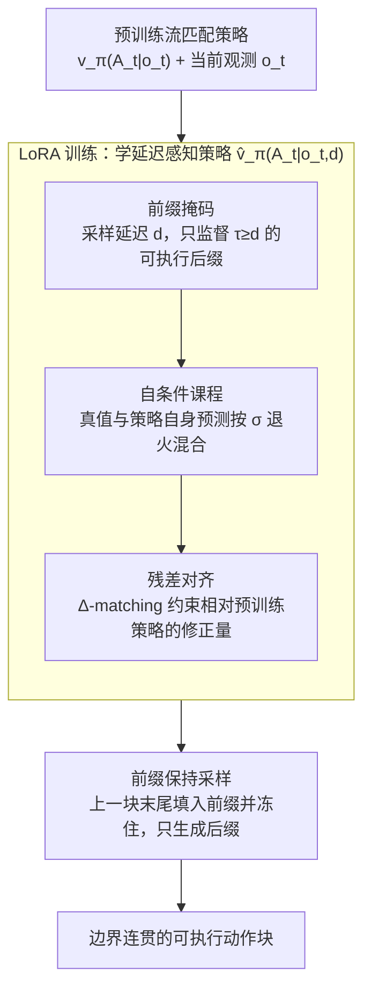

# Real-Time Robot Execution with Masked Action Chunking

**会议**: ICLR 2026  
**arXiv**: [2601.20130](https://arxiv.org/abs/2601.20130)  
**代码**: [项目页面](https://remac-robot.github.io)  
**领域**: 机器人学习  
**关键词**: 实时执行, 动作分块, 异步推理, VLA, 流匹配, LoRA

## 一句话总结

提出REMAC，通过掩码动作分块训练策略和前缀保持采样管线，系统性解决异步推理下的段内不一致（intra-chunk inconsistency）和段间不连续（inter-chunk discontinuity）两大问题，在不引入额外推理延迟的前提下实现更可靠的实时机器人控制。

## 研究背景与动机

**领域现状**：Vision-Language-Action (VLA) 模型通过动作分块（action chunking）预测一段动作序列用于机器人操作，已成为通用机器人策略的主流范式。实时性对机器人系统至关重要——延迟可能导致任务失败（如洒出液体），而非仅仅增加等待时间。

**异步推理的必要性**：同步推理要求推理延迟 $\delta < \Delta t$（控制周期），以50Hz控制频率为例需<20ms，但 $\pi_0$ 模型在RTX 4090上仅动作生成就需76ms，加上预处理和网络传输远超阈值。异步推理通过在执行当前块的同时预测下一块，确保动作始终可用，是唯一可行的实时方案。

**现有痛点——段间不连续**：连续的两个动作块 $\mathbf{A}_t^1$ 和 $\mathbf{A}_{t+h}^2$ 可能来自不同的专家模式（latent expert modes），在块边界处产生跳跃性动作，导致机器人运动不连贯。已有方法如时序集成TE、BID、RTC尝试解决，但要么不可靠（TE在多任务上甚至不如Naive Async），要么引入额外延迟（RTC需55-64ms梯度修正）。

**被忽视的痛点——段内不一致**：这是本文的核心洞察。在推理延迟 $d$ 下，当前执行块的前 $d$ 个动作实际来自上一块 $\mathbf{A}_{t-h}$（基于旧观测 $\mathbf{o}_{t-h}$），而非当前观测 $\mathbf{o}_t$ 的最优动作。这导致感知-动作不匹配，产生训练时和推理时的分布偏移。此前所有工作均未识别和解决此问题。

**切入角度**：将段内不一致建模为动作块中任意位置的部分掩码问题——训练时随机掩码前缀部分，让模型学习在观测与部分动作不对齐时做出修正；同时调整采样管线保持前缀连续性，一并处理段间不连续。

**技术路线选择**：采用训练时适应而非测试时修正——通过LoRA微调预训练策略（仅增加1.5%参数），将修正能力内化到模型中，推理时无需任何额外计算步骤，可与现有测试时方法正交叠加。

## 方法详解

### 整体框架

REMAC建立在流匹配（flow matching）策略之上：给定一个预训练策略 $\mathbf{v}_\pi(\mathbf{A}_t|\mathbf{o}_t)$，目标是学到一个把推理延迟 $d$ 显式作为条件的延迟感知策略 $\hat{\mathbf{v}}_\pi(\mathbf{A}_t|\mathbf{o}_t, d)$。整套方法分两段：训练时用LoRA微调，把"段内不一致"形式化为动作块前缀被旧块占据的部分掩码问题，再叠三个组件——**前缀掩码**让模型只对真正会执行的后缀负责、**自条件课程**把训练输入逐步切换成模型自己的预测以对齐测试条件、**残差对齐**显式约束相对预训练策略的修正量；推理时换上**前缀保持采样**，把上一块的末尾动作当作冻住的先验、只生成后缀，让相邻块在边界处自然衔接。整套适配仅增加约1.5%参数，推理时不引入任何额外计算。

### 关键设计

**1. 前缀掩码：让模型只为真正可执行的动作负责**

在延迟 $d$ 下，新块的前 $d$ 个动作其实早已被上一块占据、无法被执行，但它们仍基于旧观测生成，构成感知-动作错配的源头。REMAC对每个动作块采样一个延迟条件掩码 $\mathbf{m}_d = \{m_d^\tau\}_{\tau=0}^{P-1} = \mathbf{1}[\tau \geq d]$，仅在 $\tau \geq d$ 的可执行后缀上施加监督，掩码损失写为

$$\mathcal{L}_\mathrm{m} = \sum_d \frac{\sum_{\tau} m_d^\tau \|\hat{\mathbf{u}}_\tau - \mathbf{u}_\tau\|_2^2}{\max(1, \sum_{\tau} m_d^\tau)}.$$

训练时 $d \sim \mathcal{U}\{0,\dots,P-1\}$ 在全谱延迟上随机采样，模型因此被暴露在从无掩码（$d=0$）到极端掩码（$d=h$）的所有情形下，单个模型就能覆盖任意延迟设置，无需为不同延迟分别训练。

**2. 自条件课程：用模型自己的预测对齐测试条件**

光在真值上施加掩码监督还不够：推理时喂给模型的前缀是它自己生成的、而非真值，这造成训练-推理的曝光偏差；但若一上来就用自条件输入，训练早期又会不稳定。理想做法是在训练里复现"用已执行动作当先验"的测试条件，可逐样本把当前策略 rollout 一遍代价太高。REMAC转而用预训练策略的预测 $\tilde{\mathbf{A}}_t$ 近似，把它与真实动作 $\mathbf{A}_t$ 随机混合后再做流匹配插值：

$$\hat{\mathbf{A}}_t = \gamma \mathbf{A}_t + \text{sg}((1-\gamma)\tilde{\mathbf{A}}_t),\quad \gamma \sim \mathrm{Bernoulli}(\sigma),$$

其中 $\text{sg}(\cdot)$ 为梯度截断、混合系数 $\sigma$ 随训练进度从1线性退火到0。训练早期以真值为锚稳定收敛，后期逐渐切换到自身预测，迫使模型学会修正自己引入的偏差，把训练分布拉向真实的异步执行条件。

**3. 残差对齐：显式建模相对预训练策略的修正量**

REMAC的目标是在预训练策略上"学修正"而非重新学动作，所以除了逼近真值，还额外引入一个 $\Delta$-matching 项，专门约束"目标策略相对预训练策略改动了多少"。令 $\tilde{\mathbf{u}}$ 为关闭LoRA时预训练骨干的流估计、$\hat{\mathbf{u}}$ 为开启LoRA后的估计，残差对齐损失把"开LoRA带来的修正量"对齐到"真值相对预训练策略的残差"：

$$\mathcal{L}_\Delta = \sum_d \frac{\sum_{\tau} \|m_d^\tau(\mathbf{u}_\tau - \tilde{\mathbf{u}}_\tau) - m_d^\tau(\hat{\mathbf{u}}_\tau - \tilde{\mathbf{u}}_\tau)\|_2^2}{\max(1, \sum_{\tau} m_d^\tau)}.$$

总损失 $\mathcal{L} = \lambda_m \mathcal{L}_m + \lambda_\Delta \mathcal{L}_\Delta$（取 $\lambda_m = \lambda_\Delta = 0.01$）。它与 $\mathcal{L}_m$ 数学上相关，但强调点不同：$\mathcal{L}_m$ 直接逼近真值，$\mathcal{L}_\Delta$ 把学习目标聚焦在"在预训练策略基础上该补多少修正"，消融实验显示加入它能带来明显增益。

**4. 前缀保持采样：让相邻块在边界处不跳变**

前三项在训练侧解决段内不一致，这一项在推理侧收拾段间不连续，并与掩码训练的假设保持一致。推理时新块的初始状态 $\mathbf{A}_t^0$ 不再从高斯先验整段采样，而是用可执行先验 $\mathbf{A}_t^\mathrm{p}$ 初始化——把前 $P-h$ 维填入上一块的末尾动作、其余置零；流匹配积分时再把这段前缀冻住，每一步只更新可生成部分：

$$\mathbf{A}_t^{\tau+\frac{1}{n}} = \mathbf{m} \odot \Big(\mathbf{A}_t^\tau + \tfrac{1}{n}\hat{\mathbf{v}}_\pi(\mathbf{A}_t^\tau, \mathbf{o}_t, \tau)\Big) + (1-\mathbf{m}) \odot \mathbf{A}_t^\mathrm{p}.$$

已执行动作因此成为先验，新生成的后缀沿它自然续接，块边界的跳跃被直接消除。

## 实验关键数据

### Kinetix仿真实验（12个高动态任务，平均成功率）

| 方法 | $d=0$ | $d=1$ | $d=2$ | $d=3$ | $d=4$ |
|------|-------|-------|-------|-------|-------|
| Naive Async | 0.828 | 0.702 | 0.639 | 0.525 | 0.451 |
| BID | — | — | — | — | — |
| RTC | — | — | — | — | — |
| **REMAC (Ours)** | **0.888** | **0.879** | **0.859** | **0.817** | **0.779** |

### 消融实验（各组件贡献）

| 配置 | $d=0$ | $d=1$ | $d=2$ | $d=3$ | $d=4$ |
|------|-------|-------|-------|-------|-------|
| Naive | 0.828 | 0.702 | 0.639 | 0.525 | 0.451 |
| + LoRA（仅加参数） | 0.825 | 0.710 | 0.630 | 0.510 | 0.428 |
| + Prefix Masking | 0.863 | 0.825 | 0.752 | 0.729 | 0.636 |
| + Self-conditioned Curriculum | 0.848 | 0.837 | 0.805 | 0.762 | 0.710 |
| + $\mathcal{L}_\Delta$（完整REMAC） | **0.888** | **0.879** | **0.859** | **0.817** | **0.779** |

### 与测试时方法叠加

| 方法 | $d=0$ | $d=1$ | $d=2$ | $d=3$ | $d=4$ |
|------|-------|-------|-------|-------|-------|
| REMAC | 0.888 | 0.879 | 0.859 | 0.817 | 0.779 |
| REMAC + BID | 0.888 | 0.880 | 0.862 | 0.821 | 0.781 |
| REMAC + RTC | 0.888 | 0.879 | 0.864 | 0.826 | 0.791 |

### 真实机器人实验（Franka Research 3，平均完成进度）

| 方法 | Grasp-Easy | Grasp-Medium | Grasp-Hard |
|------|-----------|-------------|-----------|
| Synchronous | 0.805 | 0.718 | 0.670 |
| Naive Async | 0.825 | 0.825 | 0.460 |
| Temporal Ensembling | 0.825 | 0.868 | 0.717 |
| RTC | 0.823 | 0.848 | 0.753 |
| **REMAC (Ours)** | **0.903** | **0.943** | **0.812** |

## 关键发现

- **段内不一致是关键失败模式**：之前所有工作仅关注段间不连续，REMAC首次识别并解决段内不一致问题。消融实验表明仅加入前缀掩码即可在 $d=4$ 时将成功率从0.451提升至0.636（+41%）。

- **训练时适应优于测试时修正**：REMAC无额外推理延迟，而RTC引入55-64ms额外延迟。在真实实验中RTC在大延迟下反而性能下降，因为其测试时调整在更长执行horizon下可能产生负面效果。

- **各组件渐进互补**：从Naive→Prefix Masking→Self-conditioned Curriculum→Residual Alignment，每增加一个组件都带来稳定提升，完整方法在 $d=4$ 时成功率达0.779，比Naive高72.7%。

- **鲁棒性随延迟增加更明显**：REMAC在 $d=0$ 到 $d=4$ 的性能下降（0.888→0.779，-12.3%），远小于Naive Async（0.828→0.451，-45.5%），展现出对延迟变化的强鲁棒性。

- **单一模型处理全延迟谱**：通过随机采样训练延迟，无需为不同延迟训练单独模型，一个REMAC模型适用所有延迟设置。

## 亮点与洞察

- **问题识别的价值**：段内不一致的识别本身就是重要贡献。将其形式化为"部分感知-动作不匹配"并建模为掩码问题，是非常优雅的抽象。

- **训练时解决>推理时补丁**：将修正能力内化到模型权重中（通过LoRA），而非在推理时做额外计算，是更根本的解决方案。LoRA的选择也很合理——视为分布调整而非重新学习。

- **可组合性**：REMAC作为backbone改进可与BID/RTC等测试时方法正交叠加，具有良好的生态兼容性。

- **实践价值**：真实部署框架（gRPC通信、延迟估计、动作队列）的设计和验证，为VLA实时部署提供了完整参考。

## 局限性

- **仅验证于flow matching策略**：虽然附录提到了ACT上的实验，但主体实验限于flow matching策略框架，对其他动作生成范式（如扩散策略、自回归策略）的适用性需要更多验证。

- **延迟估计的简化**：将连续延迟离散化为 $d = \lfloor \delta / \Delta t \rfloor$ 并忽略观测延迟和亚时间步延迟，在延迟波动较大的真实场景中可能不够准确。

- **真实实验规模有限**：仅3个抓取放置任务、单臂设置、200条轨迹微调。更复杂的双臂操作、长horizon任务、多样化物体的验证尚缺。

- **训练需要预训练策略推理**：自条件课程需要在每个训练样本上运行预训练模型生成 $\tilde{\mathbf{A}}_t$，增加了训练计算成本。

## 相关工作与启发

### vs RTC (Black et al., 2025)

RTC同样针对异步推理下的实时执行，采用测试时inpainting策略——用已执行动作warm-start下一块并做梯度修正。**核心差异**：RTC引入55-64ms额外推理延迟（影响实时性），且仅处理段间不连续而忽略段内不一致。REMAC在训练时解决两个问题且零额外推理开销。在真实实验中，RTC在大延迟下性能反而下降，说明测试时修正在某些条件下可能适得其反。

### vs BID (Liu et al., 2025)

BID通过采样多个候选预测并做拒绝采样来平衡长期一致性与短期反应性。**核心差异**：BID计算量大（需多次前向传播和评估），不适合实时场景；且同样未解决段内不一致问题。REMAC通过训练时适应一次性解决，推理时单次前向传播即可。

### vs Temporal Ensembling (Zhao et al., 2023)

TE通过加权平均连续块的重叠部分来平滑边界。**核心差异**：TE是启发式方法，在高动态环境中表现甚至差于Naive Async。REMAC提供了原理性的解决方案，在所有测试条件下稳定优于基线。

## 评分

- **新颖性**: ⭐⭐⭐⭐ 段内不一致问题的识别是重要洞察，掩码训练+残差对齐+课程调度的组合设计合理且新颖。扣分点：各单独组件（掩码训练、LoRA、课程学习）并非全新。
- **实验充分度**: ⭐⭐⭐⭐⭐ 12个仿真任务+3个真实任务，覆盖5种延迟设置，详尽的消融实验，与3种基线对比，还展示了与测试时方法的可组合性。
- **写作质量**: ⭐⭐⭐⭐ 问题分析层次清晰（段间vs段内），方法推导完整，实验展示全面。段内不一致的可视化说明直观有效。
- **实用价值**: ⭐⭐⭐⭐⭐ 零额外推理延迟、仅1.5%参数开销、可与现有方法叠加、提供完整部署框架——对VLA实时部署有直接且高度实用的价值。

<!-- RELATED:START -->

## 相关论文

- [\[ICLR 2026\] Time Optimal Execution of Action Chunk Policies Beyond Demonstration Speed](time_optimal_execution_of_action_chunk_policies_beyond_demonstration_speed.md)
- [\[CVPR 2026\] Adaptive Action Chunking at Inference-time for Vision-Language-Action Models](../../CVPR2026/robotics/adaptive_action_chunking_at_inference-time_for_vision-language-action_models.md)
- [\[ICML 2026\] Mixture of Horizons in Action Chunking](../../ICML2026/robotics/mixture_of_horizons_in_action_chunking.md)
- [\[ICLR 2026\] Verifier-Free Test-Time Sampling for Vision-Language-Action Models](verifier-free_test-time_sampling_for_vision-language-action_models.md)
- [\[ICLR 2026\] Action Chunking and Exploratory Data Collection Yield Exponential Improvements in Behavior Cloning for Continuous Control](action_chunking_and_data_augmentation_yield_exponential_improvements_in_behavior.md)

<!-- RELATED:END -->
