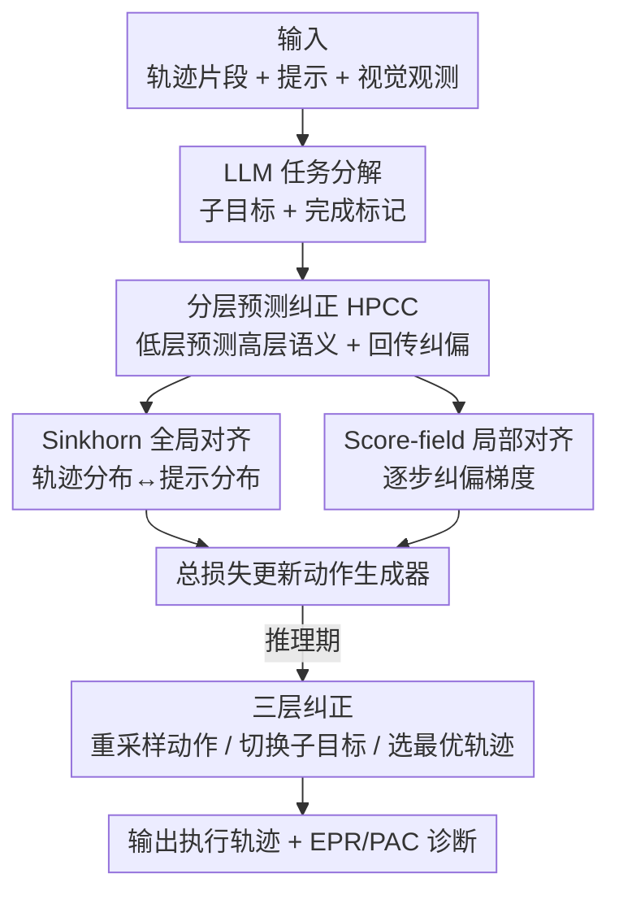

# ReCAPA: Hierarchical Predictive Correction to Mitigate Cascading Failures

**会议**: ICLR 2026  
**OpenReview**: [https://openreview.net/forum?id=WC6MJ5r5Bj](https://openreview.net/forum?id=WC6MJ5r5Bj)  
**代码**: 待确认（项目页 https://sunandreas0437-svg.github.io/recapa-project-page/）  
**领域**: 机器人 / 具身智能  
**关键词**: 具身智能体, VLA, 级联失败, 跨层预测, 轨迹对齐

## 一句话总结
ReCAPA 把具身智能体的长程轨迹拆成「动作—子目标—轨迹」三层，用低层预测高层语义再回传纠偏信号，配合 Sinkhorn 全局对齐与 Score-field 局部对齐，在训练阶段就把偏差扼杀在萌芽，从而抑制单步小错误滚雪球式累积成级联失败，在 AI2-THOR、MineDojo、VisualAgentBench 上成功率均超过强 LLM/LMM 基线。

## 研究背景与动机
**领域现状**：基于 LLM 的 VLA（Vision–Language–Action）智能体被广泛用于家务操作、室内导航、多轮人机对话等长程任务。主流做法要么把整体计划分解成可执行子计划逐段执行（如 LLaMAR、CityNavAgent），要么用语义匹配把指令和轨迹对齐（如 TrajPrompt、PRET）来增强执行一致性。

**现有痛点**：现有方法普遍依赖**事后纠正**（post-hoc correction，如 ReAct、Reflexion 在出错后才反思）或**固定分解 + 静态对齐**。问题是：一旦某个中间步骤被设定错了，局部错误会顺着后续步骤传播，最终累积成级联失败。论文引用的实验显示，在 VirtualHome、AI2-THOR 这类基准里，仅仅**一个子目标出错就能让后续步骤性能下降超过 60%**。

**核心矛盾**：错误传播发生在不同时间尺度——动作层的错误会在短期内快速复合，而策略/子目标层的错位则缓慢地扭曲整个计划。但已有方法往往只在**单一层级**反思，于是其他层级的传播无人看管。同时，只做局部对齐会让每一步被孤立优化，容易整体偏离任务意图。

**本文目标**：在错误传播开来之前就把它**提前暴露并纠正**，且要同时覆盖动作、子目标、轨迹三个层级；并提供能刻画错误如何扩散/消散的诊断指标，而不只看最终成功率。

**切入角度**：作者的关键观察是——长程一致性需要**跨层引导**：低层步骤应当能预测它将组合成的高层语义，一旦预测与实际不符就说明出现了偏差，可据此在训练期就把低层表示拉回正轨。这把「纠错」从推理期的被动反应，前移成了训练期的主动预测。

**核心 idea**：用「跨层预测 + 提示-轨迹分布对齐」替代「固定分解 + 事后纠正」，让偏差被提前预判并自上而下地纠正。

## 方法详解

### 整体框架
ReCAPA（Predictive Alignment and Planning Architecture）要解决的是：让智能体在执行长程任务时，每一步局部决策都和整体任务意图保持一致，从而不让小错误累积成级联失败。整体上，它把一条轨迹切成**动作层、子目标层、轨迹层**三个尺度，核心模块叫 **HPCC（Hierarchical Predictive Correction）**：从低层语义预测高层语义，再把预测和真实高层表示的差距回传成纠偏信号。与此并行，**提示-轨迹对齐**通过两个互补模块（Sinkhorn 全局对齐 + Score-field 局部对齐）把轨迹表示拉向提示语义。所有这些信号在**训练期**被组合成损失，反向传播去更新动作生成器；在**推理期**则变成一套三层纠正机制来逐步精化轨迹。

训练时输入是轨迹片段、提示嵌入和视觉观测；HPCC 把它们编码成三层表示，在每层把轨迹表示与提示嵌入比较得到跨层一致性信号，这些信号定义训练损失，反传去更新动作与对象的选择。推理时输入是环境观测、提示和历史轨迹，由 LLM（GPT-4o-mini）给出子目标分解与完成标记，执行网络生成轨迹，三层纠正机制通过**重采样动作、调整子任务、用 Sinkhorn 做提示对齐**来精化轨迹。

### 关键设计

**1. HPCC 跨层预测纠正：用低层预测高层，让偏差在训练期暴露**

这是 ReCAPA 的核心，针对的痛点是「单层反思看不住其他层级的错误传播」。HPCC 把轨迹组织成三层：动作（细粒度步骤如何组合成短期子目标，例如 `[GRAB]、[WALK]、[WIPE]→清洁`）、子目标（预测轨迹结果并强制因果顺序，例如「先洗后烘」）、轨迹（编码任务整体意图与结果）。在每个层级 $l\in\{\text{action},\text{subgoal}\}$，模型基于沿轨迹滑窗构造的片段集合 $T^l$（可选地拼接视觉嵌入）编码出状态表示 $z^l\in\mathbb{R}^d$，再用一个 Transformer 预测器产生**预测的高层表示** $\hat z^{l+1}$，然后和真实的目标表示 $z^{l+1}$ 比较，构造跨层对齐损失去正则化低层表示 $z^l$。

预测与目标的差距用一个 InfoNCE 形式的对比损失 $\mathcal L^l_{\text{pred}}$ 度量：

$$\mathcal L^l_{\text{pred}} = -\log \frac{\exp\big(\text{sim}(\hat z^{l+1}, z^{l+1})\big)}{\exp\big(\text{sim}(\hat z^{l+1}, z^{l+1})\big) + \sum_j \exp\big(\text{sim}(\hat z^{l+1}, z^{l+1}_{\text{neg},j})\big)}$$

其中正样本是真实高层表示 $z^{l+1}$，负样本 $\{z^{l+1}_{\text{neg},j}\}$ 由 LLM（GPT-4o-mini）生成——它们是「看似合理但因动作错序或子目标实现错误而语义错位」的轨迹片段，是逼近真实失败模式的难负例。优化时梯度反传穿过预测器和第 $l$ 层编码器，而高层目标 $z^{l+1}$ 被 detach 掉以防被污染。被监督正则化后的 $z^l$ 再喂给动作生成器，最新时间步的表示经 MLP 头产生离散动作 logits。这样「低层是否预测得出高层」就成了偏差的早期信号，把纠错从事后前移到了训练期。

**2. Sinkhorn 全局对齐：在分布层面把整条轨迹拉向提示语义**

该设计针对「只做局部对齐导致每步孤立优化、整体漂移」的痛点。它用最优传输（OT）在**分布层面**对齐轨迹与提示，不要求逐 token 精确匹配，因此梯度由整体语义一致性主导，能避免局部歧义或错序执行干扰对齐信号。具体用熵正则化的 OT 距离，把轨迹分布 $\mu$ 和提示分布 $\nu$ 作为输入，输出 Sinkhorn 散度：

$$\mathcal L_{\text{sinkhorn}}(\mu,\nu) = \text{OT}_\epsilon(\mu,\nu) - \tfrac12 \text{OT}_\epsilon(\mu,\mu) - \tfrac12 \text{OT}_\epsilon(\nu,\nu)$$

最小化它，就是逼着整条轨迹的潜空间分布在语义上贴合提示，提供了 HPCC 跨层预测之外的「全局锚点」，专门负责轨迹层的整体一致性。

**3. Score-field 局部对齐：用去噪向量场提供逐步纠偏梯度**

Sinkhorn 管全局，Score-field 则互补地提供**细粒度局部纠正**。它和 Sinkhorn 用的 $\nu$ 以及提示嵌入 $p$ 同源（来自同一提示编码器），输入状态嵌入 $z^l$ 和 $p$，输出局部纠偏梯度 $s_\psi(z^l,p)$（用 MLP 实现）。训练时给 $z^l$ 加高斯噪声 $\xi\sim\mathcal N(0,\sigma^2 I)$，让网络学着预测去噪分数 $-\xi/\sigma^2$：

$$\mathcal L_{\text{score}} = \mathbb E_{(z^l,p),\,\xi\sim\mathcal N(0,\sigma^2 I)}\Big[\big\| s_\psi(z^l+\xi, p) - (-\xi/\sigma^2) \big\|_2^2\Big]$$

这训练出一个**指向提示定义分布高密度区**的向量场：任何落在低密度区（即偏离提示语义意图）的轨迹状态 $z^l$ 都会收到一个把它推回高一致性配置的纠偏梯度。它作为辅助正则项进入总目标，与 Sinkhorn 形成「全局分布对齐 + 局部梯度纠偏」的双保险。

**4. EPR / PAC 诊断指标：量化错误如何扩散与消散**

针对「成功率（SR）等只看终点、掩盖了鲁棒性差异」的痛点——两个智能体可能终态成功率相同，但一个一路级联失败、另一个能从早期失误中恢复。作者引入两个诊断指标。**错误传播率 EPR** 用步级错误指示 $e_t\in\{0,1\}$（违反约束或偏离 oracle 轨迹为 1），度量滞后 $k$ 步时错误的复合程度：

$$\text{EPR}_k = \Pr(e_{t_0+k}=1\mid e_{t_0}=1) - \Pr(e_{t_0+k}=1\mid e_{t_0}=0)$$

例如 $\text{EPR}_3=0.4$ 表示「三步前有错」会让三步后再出错的概率比无初始错误时高 40%。**传播衰减系数 PAC** 度量错后风险的指数衰减率：

$$\text{PAC} = -\text{slope}\big(\Delta,\ \ln\Pr(e_{t_0+\Delta}=1\mid e_{t_0}=1)\big)$$

即对 $\ln\Pr(\cdot)$ 关于滞后 $\Delta$ 做最小二乘线性回归取斜率的相反数：PAC 越大恢复越快，越小说明系统持续暴露在错误累积下。低 EPR 反映「错误预防」、高 PAC 反映「错误恢复」，二者互补地刻画了标准 SR 指标看不到的鲁棒性维度。

### 损失函数 / 训练策略
训练分两阶段。先用对比目标**预训练** Transformer 编码器：把状态-动作轨迹片段的滑窗编码成定长嵌入，用 InfoNCE（式 1）优化，正样本来自同一 episode 轨迹、负样本由 LLM 生成，初始化出能捕捉局部片段合理性与时序依赖的结构化嵌入空间。然后**联合微调**分层编码器、预测器与对齐模块，端到端优化总损失：

$$\mathcal L_{\text{total}} = \sum_{l\in\{\text{action},\text{subgoal}\}} \big(\lambda^l_{\text{pred}}\mathcal L^l_{\text{pred}} + \lambda^l_{\text{score}}\mathcal L^l_{\text{score}}\big) + \lambda_{\text{sinkhorn}}\mathcal L_{\text{sinkhorn}}$$

其中 $\lambda^l_{\text{pred}}=0.5$、$\lambda^l_{\text{score}}=0.2$、$\lambda_{\text{sinkhorn}}=0.1$；预测目标 $z^{l+1}$ 始终 detach，不让梯度回流高层编码器。推理期则是三层串行纠正：动作层选 Top-K 候选并算与当前子目标的对齐相似度，超阈值才接受、否则逐步放松阈值重试，全失败就退化为选最高 logit 动作；子目标层用滑窗表示判断「与当前子目标对齐低于阈值且与下一子目标高出一个 margin」时触发切换；轨迹层把每个候选动作临时接到轨迹缓冲后用 Sinkhorn 算提示-轨迹一致性，选分数最高者，若仍低于阈值则回退到动作层首选。

## 实验关键数据

### 主实验
在 AI2-THOR（120 个交互场景）、MineDojo（3,142 个 Minecraft 任务）、VisualAgentBench（含 OmniGibson 家务 + Minecraft 导航/合成）三个基准上评测。VisualAgentBench/AI2-THOR 强调跨域迁移：在 ProcTHOR、Behavior1K 上预训练后**直接评测、不微调**。

AI2-THOR（SR=成功率，TR=运输率，Coverage=成功交互覆盖，Balance=子任务贡献均衡度）：

| 模型 | SR | TR | Coverage | Balance |
|------|------|------|----------|---------|
| ReAct | 0.34 | 0.72 | 0.92 | 0.67 |
| GPT-4o | 0.51 | 0.85 | 0.95 | 0.83 |
| GPT-4V | 0.66 | 0.91 | **0.97** | 0.82 |
| LLaMAR | 0.68 | 0.90 | 0.95 | 0.85 |
| **ReCAPA** | **0.75** | **0.93** | 0.95 | **0.93** |

VisualAgentBench（AVG=总平均分）：

| 模型 | AVG. | OmniGibson | Minecraft |
|------|------|-----------|-----------|
| InternVL-2 | 22.20 | 16.0 | 28.4 |
| GPT-4o | 48.30 | 41.4 | 55.2 |
| GPT-4o mini | 54.15 | 46.7 | 61.6 |
| Gemini 2.5 Flash | 53.00 | 43.9 | 62.1 |
| **ReCAPA** | **58.65** | **50.6** | **66.7** |

论文报告整体提升：VisualAgentBench +5.65%、MineDojo +7%、AI2-THOR +7%（相对强基线，⚠️ 摘要另处写 MineDojo +9%，以原文为准）。错误传播上，OmniGibson 在 $k=10$ 时 ReCAPA 的 $\text{EPR}_{10}=0.082$，而 GPT-4o-mini、Gemini-2.5 约 0.3，Claude-4-Sonnet 超过 0.453，残余错误在 ReCAPA 上消散最快（PAC 最高）。

### 消融实验
消融围绕 HPCC 与对齐两组件（数值为 SR，AI2-THOR 列为 0–1，其余为分数）：

| 配置 | Behavior | VirtualHome | AI2-THOR | 说明 |
|------|---------|-------------|----------|------|
| w/o-HPCC | 59.3 | 60.1 | 0.63 | 去掉分层预测，掉点最多 |
| PPO | 60.2 | 60.6 | 0.59 | 用 PPO 替代 HPCC 的扁平 RL 基线 |
| HIRO | 63.4 | 62.7 | 0.63 | 两层固定子目标 + 对齐 |
| HPCC-AS | 63.6 | 61.4 | 0.65 | 仅动作+子目标两层 |
| HPCC-AT | 65.1 | 70.9 | 0.73 | 动作+轨迹，含轨迹层增益明显 |
| HPCC-ST | 66.3 | 66.3 | 0.69 | 子目标+轨迹 |
| **HPCC-Full** | **72.2** | **70.5** | **0.75** | 三层全开 |
| w/o-Alignment | 65.8 | 67.2 | 0.69 | 去掉所有对齐损失 |
| Sinkhorn | 66.1 | 69.4 | 0.74 | 仅全局对齐 |
| Score-field | 64.4 | 67.9 | 0.72 | 仅局部对齐 |
| KL+Score-field | 70.3 | 68.1 | 0.74 | 用 KL 替 Sinkhorn |
| Alignment-Full | 72.2 | 70.5 | 0.75 | Sinkhorn+Score-field 全开 |

### 关键发现
- **HPCC 贡献最大**：去掉 HPCC 在 Behavior 上 SR 从 72.2 跌到 59.3，是掉点最多的组件，证实多层预测是核心。
- **轨迹层最关键**：含轨迹层的 HPCC-AT/ST 明显强于只有动作+子目标的 HPCC-AS——轨迹级表示充当全局语义参考，选择性地抑制与整体目标错位的局部更新。
- **两种对齐互补**：Sinkhorn 单用大多比 Score-field 好，二者一起最优；KL+Score-field 在 Minecraft（分布偏斜）上拿到该任务最高 67.0，因为 KL 对细微错配更敏感、能抓住罕见但决定性的事件，但也更易让信号失稳。
- **覆盖率换稳定性**：ReCAPA 的 Coverage（0.95）略低于 GPT-4V（0.97），因为分层结构偏好结构一致性与高置信交互、探索更保守；这反映了具身智能体「广探索提覆盖 vs 强一致提稳定」的根本权衡。

## 亮点与洞察
- **把纠错从推理期前移到训练期**：传统 ReAct/Reflexion 是「错了再反思」，ReCAPA 用「低层能否预测高层」当偏差的早期信号，在训练时就正则化低层表示，思路很值得迁移到任何长程决策的一致性问题。
- **detach 高层目标 + LLM 造难负例**的组合很巧：预测目标 detach 防止「自欺」式坍缩，而用 LLM 生成「错序/错实现」的语义难负例，让对比学习真正学到失败模式而非平凡区分。
- **EPR/PAC 两个诊断指标**填补了「SR 只看终点」的盲区，把「错误预防」和「错误恢复」拆成可量化的两维，这套评测视角本身就可能推动长程推理评估范式的改变。
- 全局（Sinkhorn 分布对齐）+ 局部（Score-field 去噪向量场）的双对齐设计，是「OT + score matching」在具身对齐上的一次有意思的组合。

## 局限与展望
- **保守探索导致覆盖率偏低**：作者自己承认分层结构在探索上更保守，Coverage 不如纯探索式的 GPT-4V，在需要广泛试错发现的任务里可能吃亏。
- **依赖外部 LLM**：推理期子目标分解、完成标记，以及训练期负样本生成都靠 GPT-4o-mini，方法性能与该 LLM 的分解质量强绑定，LLM 分解错时纠错机制能否兜底原文未充分讨论。
- **KL 对齐不稳**：KL+Score-field 虽在偏斜分布任务上更敏感，但也会destabilize 信号，对齐方式的选择需按任务分布特性调，缺乏自适应机制。
- **三层划分的粒度**（滑窗大小、层级边界）如何确定、对超参 $\lambda$ 的敏感性，原文给了固定值但未展开消融，可改进。

## 相关工作与启发
- **vs 分解类方法（LLaMAR / CityNavAgent / HIRO）**：它们走预定义多阶段子目标流水线，初始分解一旦有缺陷就难在动态环境中适应；ReCAPA 用跨层预测做自适应纠正，消融里 HIRO（固定间隔开环子目标）普遍弱于 HPCC 变体。
- **vs 纠错类方法（ReAct / Reflexion / AdaPlanner / R3V）**：它们提供步级或 episodic 的事后反馈，但只在单层反思、难以跨阶段保持一致；ReCAPA 强制跨层预测——低层预测高层、偏差触发自上而下纠正，把局部决策拉回全局目标。
- **vs 整合类方法（TrajPrompt / HiP / VistaWise）**：它们主攻子步对齐，可能「子目标对了但动作错了」；ReCAPA 同时在三层用提示-轨迹分布对齐维持整体意图与操作的一致。

## 评分
- 新颖性: ⭐⭐⭐⭐ 跨层预测纠错 + 双对齐 + 两个诊断指标的组合较新，但单个组件（InfoNCE、Sinkhorn、score matching）都是已有技术的拼装
- 实验充分度: ⭐⭐⭐⭐ 三基准 + 细致消融 + EPR/PAC 分析，但部分提升数字（+7%/+9%）口径不一致、跨基准 SR 量纲混用
- 写作质量: ⭐⭐⭐ 思路清晰、图示丰富，但缓存文本里公式重复、表述偶有语法错误，部分定义略显仓促
- 价值: ⭐⭐⭐⭐ 把级联失败的「预防 + 恢复」拆成可量化维度，对长程具身智能体评测与训练都有借鉴意义

<!-- RELATED:START -->

## 相关论文

- [\[ICLR 2026\] Experience-based Knowledge Correction for Robust Planning in Minecraft](experience-based_knowledge_correction_for_robust_planning_in_minecraft.md)
- [\[CVPR 2026\] Diagnose, Correct, and Learn from Manipulation Failures via Visual Symbols](../../CVPR2026/robotics/diagnose_correct_and_learn_from_manipulation_failures_via_visual_symbols.md)
- [\[ICLR 2026\] H$^3$DP: Triply-Hierarchical Diffusion Policy for Visuomotor Learning](h3dp_triplyhierarchical_diffusion_policy_for_visuomotor_learning.md)
- [\[CVPR 2026\] GeoPredict: Leveraging Predictive Kinematics and 3D Gaussian Geometry for Precise VLA Manipulation](../../CVPR2026/robotics/geopredict_leveraging_predictive_kinematics_and_3d_gaussian_geometry_for_precise.md)
- [\[ICLR 2026\] Hierarchical Value-Decomposed Offline Reinforcement Learning for Whole-Body Control](hierarchical_value-decomposed_offline_reinforcement_learning_for_whole-body_cont.md)

<!-- RELATED:END -->
