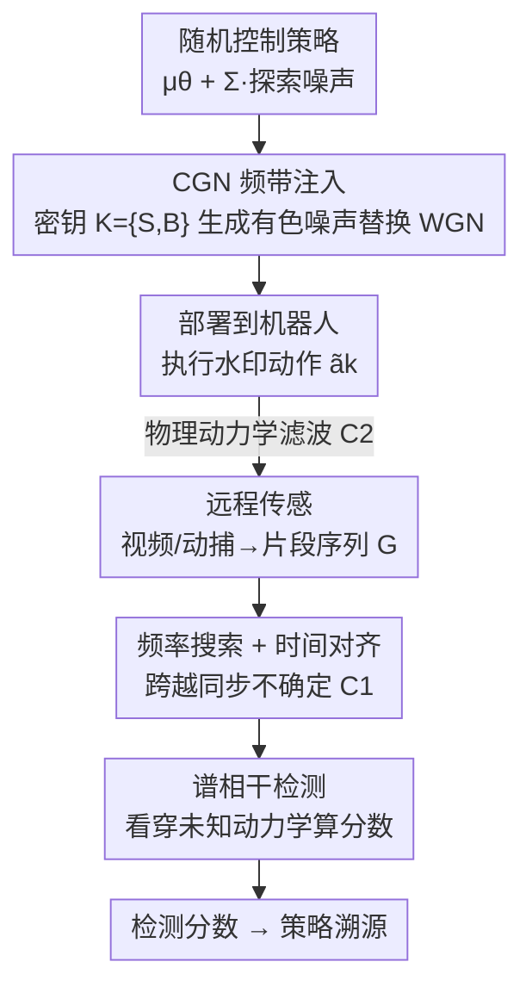

# Remotely Detectable Robot Policy Watermarking

**会议**: ICLR2026  
**OpenReview**: [https://openreview.net/forum?id=8s5jBVybhQ](https://openreview.net/forum?id=8s5jBVybhQ)  
**代码**: [https://github.com/proroklab/RobotPolicyWatermarking](https://github.com/proroklab/RobotPolicyWatermarking)  
**领域**: 机器人 / 强化学习 / AI 安全  
**关键词**: 策略水印, 远程检测, 频域水印, 谱相干性, 知识产权保护

## 一句话总结
针对"只能从视频/动捕等远程观测来验证机器人用的是谁的策略"这一现实场景，本文提出 CoNoCo——把强化学习策略原本用于探索的白噪声换成藏在秘密频带里的"有色噪声"，再用对系统动力学不敏感的谱相干性把它检测出来，在仿真和真实机器人上都能不损性能、不靠访问内部状态地完成策略溯源。

## 研究背景与动机
**领域现状**：机器学习训练出的机器人控制策略（运动、操作、导航）本身就是一笔重资产，是一种新型知识产权（IP）。和多媒体、大模型一样，人们希望给它打"水印"以验证归属、追溯来源。

**现有痛点**：已有的策略水印方法（如 Behzadan & Hsu 2019 要求在秘密"触发环境"里执行、Chen et al. 2021 在特定"安全状态"强制秘密动作）以及神经网络水印（嵌入权重、后门触发）全都假设**白盒访问**——必须能读到策略内部状态、动作日志或主动查询模型。

**核心矛盾**：真实审计场景里，审计方往往只能拿到**远程外部观测**（如交通监控视频），看不到策略输出的扭矩指令，只看得到它的物理后果（机器人怎么动）。作者把这道鸿沟称为 **Physical Observation Gap（物理观测鸿沟）**，它带来三重困难：(C1) 同步不确定——策略内部频率 $f_\pi$ 未知且会抖动，远程传感器采样率 $f_g$ 独立、还有未知时间偏移；(C2) 系统动力学——动作被机器人未知的物理（惯性、摩擦）滤波变形；(C3) 干扰与噪声——策略主行为 $\mu_k$ 本身远强于水印，加上环境扰动和传感器噪声。

**本文目标**：设计一种水印，(W1) 不改变动作的边际分布（不损策略性能），(W2) 在 C1–C3 的破坏下仍能从纯远程观测可靠检测。

**切入角度**：基于时序/精确对时的时域方法在这种失真下很脆弱。作者转向**频域**——频率成分对时间偏移、动力学滤波这类变换更稳健，而且连续控制策略本身就带高斯探索噪声，可以"借壳"嵌入信号而不引入额外扰动。

**核心 idea**：用频带受控的有色高斯噪声（CGN）替换策略的白噪声探索项来嵌水印，再用"能看穿未知线性动力学"的谱相干性来检测。

## 方法详解

### 整体框架
机器人策略 $\pi_\theta$ 把观测 $o_k$ 映射为动作 $a_k = \mu_\theta(o_k) + \Sigma_\theta(o_k)\epsilon_k$，其中 $\mu_\theta$ 是主行为均值、$\Sigma_\theta$ 是探索尺度、$\epsilon_k \sim \mathcal{N}(0, I)$ 是用于探索的白高斯噪声（WGN）。整个流程分三步走（对应论文 Figure 1）：① **策略拥有者**用秘密密钥 $K=\{S,B\}$ 生成水印并产出一个检测函数；② **策略使用者**把水印策略部署到自己的机器人上；③ **策略审计方**持有密钥 $K$，只能通过远程传感拿到机器人行为的"片段（glimpse）"，把这些片段喂进检测函数算出一个检测分数。

CoNoCo 的两大支柱：注入端把 WGN 换成归一化的 CGN（一种能量集中在目标频带 $B$ 的"成形噪声"）；检测端用**谱相干性**配合**频率搜索/时间对齐**来跨越物理观测鸿沟。

为形式化远程观测，作者定义 **Glimpse Sequence（片段序列）**：远程传感器在时刻 $\{t_i\}$ 采样得到 $G_i = G_{\text{map}}(s(t_i)) + \eta_i$，$G_{\text{map}}$ 把系统状态映射为远程观测（如从视频估计的速度），$\eta_i$ 是测量噪声。序列 $G=(G_i)$ 是检测唯一可用的数据。

### 关键设计

**1. 片段序列形式化：把"远程观测鸿沟"说成可分析的信号问题**

本文最先要解决的不是怎么检测，而是怎么把"只看得到视频"这件事写成数学。作者用 glimpse sequence 把策略执行（数字、时刻 $\{T_k\}$、内部频率 $f_\pi$）和远程观测（采样率 $f_g$、未知偏移、$G_{\text{map}}$ 映射 + 噪声 $\eta_i$）分别建模，并提炼出三重挑战 C1（同步不确定）、C2（系统动力学滤波）、C3（干扰与噪声）和两条需求 W1（边际分布保持）、W2（稳健可检测）。这一步的价值在于：它说清了为什么时域方法行不通——审计方观测的不是动作本身 $a_k$，而是经未知物理变换后的后果，传统依赖精确时序对齐的水印签名会被 C1+C2 直接摧毁，从而把后续设计逼向频域。

**2. CGN 频带注入：借探索噪声的"壳"嵌信号，且证明不改边际分布**

针对 W1（不能损性能）和 C3（主行为是强干扰），作者不另加扰动，而是**替换**策略本就存在的探索噪声。生成时以密钥 $K=\{S,B\}$ 为准（$S$ 是秘密种子，$B=[f_{\min},f_{\max}]$ 是秘密频带），从种子派生白噪声 $X$，过一个巴特沃斯带通滤波器 $H$，再归一化到单位方差得到 CGN 序列 $W_k$；水印策略执行 $\tilde a_k = \mu_\theta(o_k) + \Sigma_k \cdot W_k$。由于物理频率受未知策略频率 $f_\pi$ 影响（C1），数字滤波器频带特意取 $[f_{\min}/f_{\pi,ub},\, f_{\max}/f_{\pi,lb}]$，保证不管 $f_\pi$ 取多少，物理信号都能覆盖目标频带 $B$。把 $B$ 选在 $\mu_\theta$ 预期频谱之外，可大幅降低主行为干扰（C3）。关键的理论保证是 **Theorem 5.1**：把 WGN 过稳定 LTI 滤波再归一化得到的 $W_k$，其边际分布仍是 $\mathcal{N}(0,I)$，于是 $p_{\pi_\theta}(a|o)=p_{\tilde\pi_\theta}(a|o)$——单步动作统计与原策略完全一致，满足 W1。CGN 只引入时间自相关（相邻步噪声相关），而这反而常常让探索更平滑、对连续控制有益。

**3. 谱相干检测：用一个对未知动力学不变的量"看穿"物理滤波**

这是应对 C2 的核心。审计方看到的 $G$ 是水印经机器人未知动力学 $S_{\text{dyn}}$ 变换后的结果。作者用**复相干性** $C_{XY}(f)=\frac{S_{XY}(f)}{\sqrt{S_{XX}(f)S_{YY}(f)}}$ 作为检测量，其幅值 $|C_{XY}(f)|\in[0,1]$ 像某个频率上的相关系数。**Theorem 5.2** 给出关键不变性：若 $Y$ 是输入 $X$ 经线性时不变（LTI）系统 $H$ 的输出，则在无噪情况下 $|C_{XY}(f)|=1$，与 $H$ 的具体形式无关。这正好对上"机器人执行扭矩、我们只观测速度"这类由常系数 ODE 描述的 LTI 变换——它不影响相干性。**Theorem 5.3** 进一步把可检测性和信干噪比挂钩：$|C_{WG}(f)|^2 = \frac{\text{SINR}(f)}{\text{SINR}(f)+1}$，说明探索尺度 $\Sigma$ 越大、水印功率越强，相干性越接近 1、越好检测（W2）。实际系统多是线性时变（LTV）会带来"频谱涂抹"，CoNoCo 靠在多个观测维度上平均、把频带 $B$ 选在稳定频率上来缓解。

**4. 频率搜索 + 时间对齐：在不知道策略真实频率的前提下把信号对回去**

C1 的同步不确定让检测端不知道 $f_\pi$ 到底是多少、视频从哪一刻开始录。检测时（Algorithm 1）在候选频率网格 $F_{\text{search}}\subseteq[f_{\pi,lb},f_{\pi,ub}]$ 上搜索：对每个假设频率 $s$，重新生成水印 $W$ 并把它从假设频率 $s$ 重采样（时间拉伸）到已知片段率 $f_g$ 得到假设序列 $W'_s$，再用 Welch 方法分段估计 $W'_s$ 与 $G$ 各维的相干性，最终检测分数取所有假设里、秘密频带 $B$ 内平均相干幅值的最大值：$D(G)=\max_{s\in F_{\text{search}}}\big(\frac{1}{D}\sum_{d=1}^{D}\text{mean}_{f\in B}|C_{W'_d G_d}(f;s)|\big)$。多维动作各自生成独立 CGN 以提升检测。对于"录制起点有未知时间偏移"的情形，进一步用 GCC-PHAT（广义互相关相位变换）做对齐（附录 G.1）。

### 损失函数 / 训练策略
水印**不参与 RL 训练**，只在推理/部署阶段施加，因此所有策略可共用同一批预训练模型。实验中各环境的策略统一用 PPO 预训练。

## 实验关键数据

### 主实验
评测维度：仿真 + 真实机器人，任务含 VMAS 导航、RoboMaster 真实导航、Mujoco 倒立摆、HalfCheetah；远程模态含动捕（Motion Capture）、顶视/侧视摄像头。三项指标：可检测性（ROC AUC）、匿名性（用错误密钥时的 $1-\text{AUC}(k')$，越高越好）、奖励保持。由于原文以 ROC 曲线/分布图呈现而非数值表，下表为定性对比（⚠️ 具体数值以原文图表为准）。

| 水印策略 | 可检测性 | 匿名性 | 备注 |
|--------|------|------|------|
| **CoNoCo（本文）** | 高 | 高 | 唯一二者兼得；远程模态下近乎完美检测 |
| Multi-Sine Wave | 高 | 低 | 用错误密钥也能检出，匿名性失败 |
| Correlation-Based | 低 | 高 | 检测不可靠 |
| Tournament-Based（SynthID 改） | 低 | 高 | 不受 C1 影响但检测弱 |

各模态引入的挑战（论文 Table 1）：

| 观测模态 | C1 同步 | C2 动力学 | C3 干扰噪声 |
|--------|------|------|------|
| Ground Truth Action（理想基线） | – | – | – |
| Onboard Sensors（本体感知） | – | ✓ | ✓ |
| Remote Motion Capture | ✓ | ✓ | ✓ |
| Remote Camera Feed | ✓ | ✓ | ✓（更强） |

### 消融实验

| 配置 / 分析 | 关键结果 | 说明 |
|------|---------|------|
| 真实 RoboMaster + 远程动捕 | CoNoCo 检测最优，轨迹与未水印几乎重合 | 其他基线在真机上退化 |
| 力/扭矩控制 + 远程摄像头 | 近乎完美检测 | 仅 Multi-Sine 检测可比，但匿名性失败 |
| 片段序列长度敏感性 | 数据越长检测越好，最终收敛到 ROC AUC=1 | 量化检测所需数据量（附录 F） |
| 对抗攻击（白噪声/针对频带 B 的干扰） | 高度稳健 | 攻击要么损策略性能、要么无法显著伤检测 |

### 关键发现
- **可检测性和匿名性的兼得才是难点**：Multi-Sine 检测率很高却"谁都能检出"（匿名性差），其余基线匿名好但检测弱；只有 CoNoCo 两者俱佳，这正是谱相干 + 秘密频带 + 密钥派生种子共同作用的结果。
- **远程比本体更难但 CoNoCo 仍稳**：从顶视/侧视视频用模板匹配估速度作为片段，CoNoCo 依旧高检测率，验证了 Theorem 5.2 的 LTI 不变性在真实失真下也大体成立。
- **越简单的任务越严苛**：RoboMaster 导航行为冗余少、偏差立刻可见，留给"隐形改动"的空间小，CoNoCo 在此仍成功，说明它不只适用于复杂高维系统。

## 亮点与洞察
- **"借壳探索噪声"是最巧的一笔**：水印不是额外加的扰动，而是直接替换策略本来就有的探索噪声，配合 Theorem 5.1 的归一化保证，做到了"零边际分布改变"——这是它不损性能的根本原因。
- **用相干性的 LTI 不变性绕过未知物理**：把"扭矩→速度"这种未知动力学当成 LTI 滤波，借相干幅值对滤波器不变的性质直接消掉它，这个思路可迁移到任何"注入端和观测端被未知线性系统隔开"的水印/信号检测问题。
- **频带是设计变量**：把秘密频带 $B$ 选在主行为频谱之外，同时承担了降干扰（C3）、控隐蔽、定密钥三重作用，是一个很经济的设计杠杆。

## 局限与展望
- 理论保证（Thm 5.2/5.3）建立在 LTI + 恒定探索尺度的理想假设上；真实系统是 LTV，时变 $\Sigma_k$ 会引起频谱涂抹、降低 SINR，论文只能靠多维平均和选频带经验性缓解。
- 需要策略本身有足够探索随机性（$\Sigma$ 较大）才好检测，对近乎确定性的策略可能力不从心。
- 蒸馏作为对抗攻击只在附录里讨论、未做实验；若攻击者用远程观测重新蒸馏一个无水印策略，能否抹掉签名仍是开放问题。
- 远程摄像头依赖模板匹配把视频转成速度估计，估计质量本身会影响检测，复杂视觉场景下的鲁棒性待考。

## 相关工作与启发
- **vs 触发式策略水印（Behzadan & Hsu 2019 / Chen et al. 2021）**：它们在秘密触发环境或安全状态下强制特定动作，必须白盒访问内部状态；CoNoCo 把签名编进探索噪声的频谱，只靠远程观测就能检测，且不改边际动作分布。
- **vs 神经网络权重/后门水印（DeepSigns、backdooring）**：那些要么改权重、要么主动查询模型；本文针对的是"部署后的物理策略"，连模型都拿不到。
- **vs CPS 动态水印（Satchidanandan & Kumar 2016）**：同样往控制输入叠信号，但目标是实时完整性/防传感攻击且假设可访问内部控制信号，本文目标是 IP 溯源且只用外部数据。
- **vs 多媒体扩频水印（Cox et al. 1997）/ 生成模型水印（SynthID）**：本文把频域水印原理延伸到"被未知物理动力学滤波过的远程信号"这一更恶劣的设定，并以 Tournament-Based 作为 SynthID 的连续动作改编基线做对照。

## 评分
- 新颖性: ⭐⭐⭐⭐⭐ 首个面向纯远程检测的机器人策略水印，问题形式化（glimpse/物理观测鸿沟）和方法（CGN+谱相干）都是新的。
- 实验充分度: ⭐⭐⭐⭐ 覆盖仿真+真机、多模态、多控制方式与对抗攻击；但以 ROC 图为主、缺直接基线（首创）、复杂动力学下仅经验缓解。
- 写作质量: ⭐⭐⭐⭐⭐ 挑战拆解（C1–C3 / W1–W2）清晰，理论与直觉穿插，方法可读性强。
- 价值: ⭐⭐⭐⭐⭐ 为机器人 IP 保护与安全合规（监管溯源、事故问责）提供了首个非侵入式手段，落地场景明确。

<!-- RELATED:START -->

## 相关论文

- [\[AAAI 2026\] Sim-to-Real: An Unsupervised Noise Layer for Screen-Camera Watermarking Robustness](../../AAAI2026/robotics/sim-to-real_an_unsupervised_noise_layer_for_screen-camera_watermarking_robustnes.md)
- [\[AAAI 2026\] Coordinated Humanoid Robot Locomotion with Symmetry Equivariant Reinforcement Learning Policy](../../AAAI2026/robotics/coordinated_humanoid_robot_locomotion_with_symmetry_equivariant_reinforcement_le.md)
- [\[ICLR 2026\] Rethinking Policy Diversity in Ensemble Policy Gradient in Large-Scale Reinforcement Learning](rethinking_policy_diversity_in_ensemble_policy_gradient_in_large-scale_reinforce.md)
- [\[NeurIPS 2025\] Opinion: Towards Unified Expressive Policy Optimization for Robust Robot Learning](../../NeurIPS2025/robotics/opinion_towards_unified_expressive_policy_optimization_for_robust_robot_learning.md)
- [\[ICLR 2026\] Geometry-Aware Policy Imitation](geometry-aware_policy_imitation.md)

<!-- RELATED:END -->
