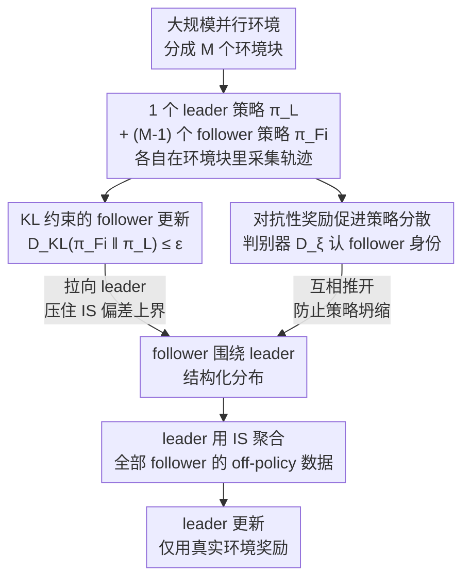

# Rethinking Policy Diversity in Ensemble Policy Gradient in Large-Scale Reinforcement Learning

**会议**: ICLR 2026  
**arXiv**: [2603.01741](https://arxiv.org/abs/2603.01741)  
**代码**: [项目页面](https://naoki04.github.io/paper-cpo/)  
**领域**: 强化学习  
**关键词**: 策略集成, 大规模并行RL, 策略多样性, KL约束, 灵巧操作

## 一句话总结

从理论上分析了集成策略梯度方法中策略间多样性对学习效率的影响，提出通过KL散度约束调控多样性的Coupled Policy Optimization（CPO），在大规模并行环境中实现高效稳定的探索。

## 研究背景与动机

GPU基并行物理模拟器（如Isaac Gym、Genesis）使得同时在数万个环境中收集数据成为可能，但**简单增加并行环境数量并不提升学习效率**（Singla et al., 2024）——单一策略在大量并行环境中产生高度相似的轨迹，探索多样性不足。

为此，SAPG方法提出了leader-follower框架：一个leader策略和多个follower策略分别在不同环境块中收集数据，leader通过重要性采样（IS）聚合所有follower数据。然而，**过度的策略多样性反而有害**：当follower策略与leader策略差距过大时，IS比率偏离1，导致有效样本量（ESS）下降和PPO裁剪偏差增大，损害训练稳定性和样本效率。

核心矛盾在于：探索多样性需要策略差异，但过大的差异降低off-policy数据的利用效率。本文提出调控这种"适度多样性"的方法。

## 方法详解

### 整体框架

CPO要解决的问题是：在 SAPG 的 leader-follower 集成里，follower 探索得越散，leader 通过重要性采样回收这些 off-policy 数据时偏差就越大，多样性反而拖垮了样本效率。CPO 沿用 SAPG 的架构——一个 leader 策略 $\pi_L$ 和若干 follower 策略 $\pi_{F_i}$ 各自在不同环境块里采数据，leader 再用 IS 把所有 follower 的轨迹聚合进自己的更新——但在 follower 这一侧动了两处手脚来调控"适度多样性"：一处把 follower 往 leader 身上拉（KL 约束的 follower 更新，控制 IS 偏差的上界），一处又把各个 follower 互相推开（对抗性奖励促进策略分散，防止它们全部坍缩到一起）。两股力一拉一推，让 follower 既不偏离 leader 太远、又彼此分散，形成围绕 leader 的结构化探索。

### 关键设计

**1. KL 约束的 follower 更新：把"多样性"关进可控的箱子里**

针对的正是"follower 偏离 leader 太远 → IS 比率失真"这个痛点。CPO 把 follower 的更新写成一个带约束的优化问题：在最大化自身优势 $A_{F_i}(\mathbf{s},\mathbf{a})$ 的同时，要求它与 leader 的 KL 散度不超过阈值 $\varepsilon_{KL}$：

$$\pi_{F_i}^* = \arg\max_{\pi_{F_i}} A_{F_i}(\mathbf{s},\mathbf{a}) \quad \text{s.t.} \quad D_{KL}(\pi_{F_i}(\cdot|\mathbf{s}) \| \pi_L(\cdot|\mathbf{s})) \leq \varepsilon_{KL}$$

这个约束优化用 AWAC 式的闭合解来近似，落到可训练的参数化目标上就是一项加权对数似然加上原 SAPG 损失：

$$L_{\text{CPO},F_i}(\theta) = -\mathbb{E}_{\mathbf{a},\mathbf{s} \sim \pi_L}\Big[\log \pi_{F_i,\theta}(\mathbf{a}|\mathbf{s}) \exp\big(\tfrac{1}{\lambda_f} A^{F_i}\big)\Big] + L_{\text{SAPG},F_i}$$

之所以这么做有效，关键在 Pinsker 不等式给出的理论保证：KL 约束直接压住了 IS 比率偏差的上界 $\mathbb{E}[|1-\frac{\pi_L}{\pi_F}|] \leq \sqrt{2D_{KL}}$。换句话说，只要 KL 受控，leader 回收 follower 数据时的有效样本量（ESS）就不会塌、PPO 裁剪偏差也不会爆——多样性被关进了一个偏差可量化的箱子里。

**2. 对抗性奖励促进策略分散：给被拉拢的 follower 一个反向推力**

KL 约束有个副作用：它在把每个 follower 拉向 leader 的同时，也隐式地把 follower 们彼此拉近，容易让它们坍缩成几乎一样的策略，多样性又没了。对抗性奖励就是来抵消这个副作用的。CPO 训练一个判别器 $D_\xi(y|\mathbf{s}_t,\mathbf{a}_t)$，让它根据状态-动作去预测这条轨迹来自哪个 follower（身份 $y$），并把判别器的对数置信度当成额外奖励发给对应 follower：

$$r_t^{adv} = \lambda_{adv} \log D_\xi(y|\mathbf{s}_t,\mathbf{a}_t)$$

于是每个 follower 都被激励去探索"能被认出来是自己"的独特区域。KL 约束负责拉拢、对抗性奖励负责推开，两者合起来把 follower 维持在围绕 leader 的一圈结构化分布上，而不是全挤在一处或四散失控。

### 损失函数 / 训练策略

总目标把 SAPG 损失和所有 follower 的 CPO 正则项加在一起：

$$L_{\text{CPO}}(\theta) = L_{\text{SAPG}}(\theta,j) + \beta \sum_{i} L_{\text{CPO},F_i,f}(\theta,\lambda_f)$$

其中 $\beta$ 用来平衡 PPO 目标与 KL 正则项之间的尺度，$\lambda_f$ 控制 KL 约束的强度。对抗性奖励只发给 follower；leader 更新时只用真实环境奖励，不掺判别器信号，以免污染最终要部署的那个策略。

## 实验关键数据

### 主实验（灵巧操作任务，$2\times10^{10}$环境步后）

| 任务 | PPO | PBT | SAPG | **CPO** |
|------|-----|-----|------|---------|
| ShadowHand | 10661±1050 | 10294±1728 | 12882±343 | **13762±414** |
| AllegroHand | 10439±1282 | 13239±239 | 11989±817 | **14421±885** |
| Reorientation | 1.04±0.98 | 2.92±4.27 | 38.79±1.66 | **43.75±0.65** |
| Two-Arms | 1.41±0.80 | 26.43±11.12 | 5.11±3.41 | **35.30±2.77** |

### 消融实验（IS比率偏差与ESS，$5\times10^9$步时）

| 方法 | 平均IS比率偏差↓ | ESS率↑ |
|------|----------------|--------|
| SAPG | 0.889 | 0.0223 |
| CPO($\lambda_f$=0.5) | 更低 | 更高 |

### 关键发现
- CPO在多数任务中以约一半环境步数达到SAPG的最终性能
- SAPG在Two-Arms Reorientation任务中完全失败（5.11），CPO成功学习（35.30）
- KL约束使IS比率更接近1，验证了理论分析
- follower策略自然形成围绕leader的结构化分布，展现"涌现的探索行为"

## 亮点与洞察

- **理论分析有力**：从IS比率偏差和PPO裁剪偏差两个角度证明过度多样性的危害
- **方法简洁实用**：仅在SAPG基础上添加KL约束和对抗奖励，实现显著改进
- **对比分析深入**：揭示SAPG的策略错位问题——部分follower策略严重偏离leader

## 局限与展望

- KL约束强度 $\lambda_f$ 虽然鲁棒但仍需设定，自适应调节方案值得探索
- 简单任务（如Locomotion）中改进幅度有限
- 当前使用一维条件向量区分策略，更丰富的条件化方案可能进一步提升多样性

## 相关工作与启发

- SAPG（Singla et al., 2024）是直接的前辈工作，CPO在其基础上解决了策略错位问题
- DIAYN（Eysenbach et al., 2018）的判别器思路被巧妙应用于促进策略间分散
- 启示：在大规模分布式RL中，"有组织的多样性"比"无约束的多样性"更有效

## 评分
- 新颖性: ⭐⭐⭐⭐ 理论驱动的设计，但个别组件（KL约束、判别器）已有先例
- 实验充分度: ⭐⭐⭐⭐⭐ 10个任务、详细消融、ISS/KL分析、5个随机种子
- 写作质量: ⭐⭐⭐⭐ 从问题发现到理论分析到方法设计逻辑连贯
- 价值: ⭐⭐⭐⭐ 为大规模并行RL中的探索策略提供了实用指导

<!-- RELATED:START -->

## 相关论文

- [\[ICLR 2026\] Emergent Dexterity via Diverse Resets and Large-Scale Reinforcement Learning](emergent_dexterity_via_diverse_resets_and_large-scale_reinforcement_learning.md)
- [\[ICLR 2026\] H$^3$DP: Triply-Hierarchical Diffusion Policy for Visuomotor Learning](h3dp_triplyhierarchical_diffusion_policy_for_visuomotor_learning.md)
- [\[ICLR 2026\] RoboCasa365: A Large-Scale Simulation Framework for Training and Benchmarking Generalist Robots](robocasa365_a_large-scale_simulation_framework_for_training_and_benchmarking_gen.md)
- [\[ICLR 2026\] Geometry-Aware Policy Imitation](geometry-aware_policy_imitation.md)
- [\[ICLR 2026\] Towards Bridging the Gap between Large-Scale Pretraining and Efficient Finetuning for Humanoid Control](towards_bridging_the_gap_between_large-scale_pretraining_and_efficient_finetunin.md)

<!-- RELATED:END -->
