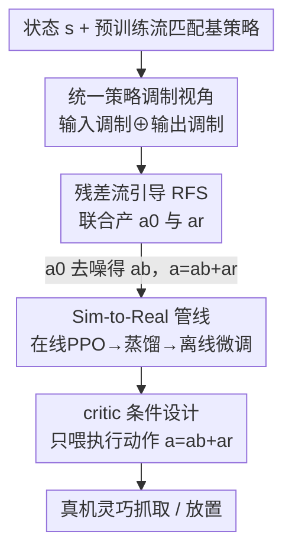

# RFS: Reinforcement Learning with Residual Flow Steering for Dexterous Manipulation

**会议**: ICLR 2026  
**OpenReview**: [https://openreview.net/forum?id=Kt9tJeOwjy](https://openreview.net/forum?id=Kt9tJeOwjy)  
**论文**: [Project Website](https://weirdlabuw.github.io/rfs/)  
**代码**: 见项目主页  
**领域**: 机器人 / 灵巧操作 / 强化学习  
**关键词**: 残差强化学习, 流匹配策略, 噪声引导, 灵巧抓取, Sim-to-Real

## 一句话总结
RFS 把"残差强化学习"和"扩散/流引导"统一进同一个策略调制框架——对一个预训练的流匹配策略，同时学习一个隐空间噪声分布（做全局探索）和一个残差动作修正（做局部精修），不动基策略参数就能高效微调，在仿真与真机灵巧操作上把平均成功率从基策略的 0.25 提到 0.87。

## 研究背景与动机

**领域现状**：灵巧操作（多指手抓取、放置、倒水、堆叠等高自由度任务）现在主流是用模仿学习（behavior cloning）从人类示教里 bootstrap 出策略，并且越来越多地用扩散模型、流匹配（flow matching）这类强表达力的生成模型来刻画人类动作的多模态分布，从而在高维动作空间上拿到不错的初始表现。

**现有痛点**：纯模仿学的策略泛化能力有限，部署时几乎一定要再做一轮微调才能达到可用水平。但微调本身两头为难——监督微调（SFT）依赖高质量专家数据，成本高；而想用 RL 微调时，传统 RL 方法（DDPG/重参数化那套）依赖动作分布的闭式似然和可微采样，跟扩散、流匹配这种迭代去噪的生成式架构根本不兼容。

**核心矛盾**：微调既要保住预训练带来的全局探索能力（别把学到的多模态行为忘掉），又要能快速纠正局部执行误差（off-distribution 状态下的精细修正）。而现有两条调制路线各占一头：残差策略学习（residual RL）在基策略输出上加修正，擅长局部精修但诱导不出全局行为变化；扩散引导（diffusion steering，如 DSRL）改隐空间噪声，能做全局调制但被约束在示教流形上，离开分布就既探索不动也修不细。

**本文目标**：设计一个数据高效的 RL 微调框架，能同时拿到全局探索和局部精修两种能力，且原生兼容流匹配这类生成式策略、不改基策略参数。

**切入角度**：作者把 residual RL 和 diffusion steering 都看成"策略调制（policy modulation）"这一更大类方法的特例——前者调制**输出**，后者调制**输入**。既然两者互补，那就把输入调制和输出调制拼到一个策略里联合优化。

**核心 idea**：用一个调制策略 $\pi_{\text{RFS}}(a_0, a_r \mid s)$ 同时吐出隐噪声 $a_0$（全局换模式）和残差动作 $a_r$（局部精修），让最终动作 $a = a_b + a_r$（$a_b$ 是基策略在 $a_0$ 下去噪出来的动作）既能跳出示教流形又能贴合真实动力学。

## 方法详解

### 整体框架

RFS 要解决的是：给定一个预训练好的流匹配基策略 $v_\theta(a_t, t, s)$，怎么在不改它参数的前提下，用 RL 把它的表现往上推。整体思路是"双通道调制"——在基策略的**输入端**插一个可学的隐噪声分布、在**输出端**叠一个可学的残差修正，两者由同一个调制策略联合产生、用同一个 RL 目标联合优化。

具体到灵巧操作，作者把它落成一条 sim-to-real 管线：先在仿真里用 VR 遥操采约 400 条/任务的示教训出流匹配基策略；再用在线 PPO 学 RFS 调制策略把成功率拉上去；然后把带特权状态信息的 RFS 策略蒸馏成点云条件的视觉运动策略以便迁到真机；真机上零样本部署时由人给纠正动作，把这些纠正数据拿去做离线 RFS（TD3+BC）微调。

### 关键设计

**1. 统一策略调制视角：把残差 RL 和噪声引导看成一枚硬币的两面**

这一步是全文的概念地基，针对的痛点是"局部精修"和"全局探索"被两类方法各自垄断、互相够不着。作者先把两者写成同构的 RL 目标摆在一起看：残差 RL 是输出调制——基策略正常采样 $a_b = \mathrm{Des}(s, a_0, v_\theta)$（$a_0 \sim \mathcal{N}(0, I)$ 固定），再学一个残差策略 $\pi_r$ 给出 $a_r$，执行 $a = a_b + a_r$；而 DSRL 是输入调制——动作生成仍走流匹配去噪 $a = \mathrm{Des}(s, a_0, v_\theta)$，但把初始噪声 $a_0$ 从固定高斯换成可学策略 $\pi_{\text{DS}}(a_0 \mid s)$ 来引导整条去噪轨迹的语义走向。两者都是在不动 $\theta$ 的前提下调制生成式基策略，只是一个动输入、一个动输出。作者由此抽象出通式：策略调制就是对 $v_\theta(a_t, t, s)$ 学输入变换 $g$ 或输出变换 $f$。这个视角的价值在于，它直接揭示"为什么该把两者合起来"——隐噪声负责换抓取模式（全局），残差负责贴真实接触动力学（局部），二者是互补而非竞争。

**2. RFS：联合优化隐噪声与残差，全局换模式叠局部精修**

有了统一视角，RFS 就把 $f$ 和 $g$ 同时实例化进一个调制策略 $\pi_{\text{RFS}}(a_0, a_r \mid s)$。给定状态 $s$，它一次产出两样东西：隐流变量 $a_0$ 用于塑造生成模型的整体行为（比如换一种抓取姿态、改一种运动模式），残差动作 $a_r$ 用于补偿 off-manifold 需求或基策略本身的不完美。最终动作是

$$a_b \sim \mathrm{Des}(s, a_0, v_\theta), \qquad a = a_b + a_r$$

整个目标 $\max_{\pi_{\text{RFS}}} \mathbb{E}\big[\sum_t \gamma^t r(s_t, a_t)\big]$ 跟标准 RL 算法兼容，因为对 RL 而言它只是在一个 $(a_0, a_r)$ 的动作空间上做优化，绕开了对去噪轨迹反传、对生成模型求似然这些麻烦。和只动输出的残差 RL 比，它多了换全局模式的能力，能跳出示教流形；和只动输入的 DSRL 比，它多了 off-distribution 状态下的精细修正能力。实验里这种"1+1>2"很明显：DSRL 在堆叠、倒水上只有 0.15/0.27，残差类方法在长程任务上塌掉，而 RFS 在六个任务上全面占优。

**3. Sim-to-Real 管线：在线 PPO 探索 → 蒸馏 → 离线纠正微调**

光有调制公式还落不了地，真机数据太贵。作者设计了一条三段式管线把 RFS 用起来。第一段在仿真里：VR 遥操采少量示教训出流匹配基策略（虽然单独用成功率只有中等，但提供了强运动先验），再用在线 PPO 训 RFS 策略去优化抓取成功率和稳定性。第二段是蒸馏：用训好的、带特权低层状态（物体位姿/速度）的 RFS 策略生成更多仿真示教，通过标准 student–teacher 框架蒸成点云条件的视觉运动策略 $v_\phi(a_t, o_{pc}, s_{pro}, t)$，为迁到真机做准备。第三段在真机：蒸馏策略零样本部署常因新物体/新初始条件失败，于是收集 50 条人类纠正示教（SpaceMouse），把人给的纠正动作定义成残差 $a_r = a_{\text{human}} - a_b$，组装出 RFS-ready 数据集 $D_{\text{RFS}} = \{((o,s), (a_0, a_r), (o',s'), r)\}$，再用离线 RL（TD3+BC）做 actor–critic 更新、对残差加 BC 正则。奖励则用 SAM2 分割追踪物体质心程序化算出。这条管线让真机微调只靠 50 条纠正数据就能显著提升，关键在于仿真预训练已经覆盖了广谱的抓取/姿态/扰动，这是纯真机数据学不出来的。

**4. Critic 条件设计：只喂执行动作 $a=a_b+a_r$，别拆开喂**

离线 RFS 里一个不起眼但极关键的选择，是 critic 该看什么。直觉上动作由 $(a_0, a_r)$ 两部分解耦组成，似乎该把分量喂给 critic；但作者发现这么做不行。他们对比三种 critic 输入：$Q(a_r, o)$ 只看残差、$Q([a_r, a_b], o)$ 看残差加基动作、$Q(a_b + a_r, o)$ 只看最终执行动作。前两者在真机上压根产不出一致的抓取姿态和精确放置，成功率为零；只有把 critic 条件在**合成后的执行动作** $a = a_b + a_r$ 上，才拿到稳定有效的离线 RL 适配。背后的道理是：残差和基动作是耦合的，环境真正响应的是合成动作，把它们拆开喂会让 critic 学到一个与实际执行不一致的价值面，导致训练发散。这条经验对所有"基动作+残差"型离线 RL 都有借鉴意义。

### 损失函数 / 训练策略

仿真阶段用流匹配目标训基策略：采 $(s, a) \sim D$、$t \sim U[0,1]$、$a_0 \sim p_0$，插值 $a_t = (1-t)a_0 + ta$，回归速度场 $\|v_\theta(a_t, t, s) - (a - a_0)\|^2$；RFS 调制策略用在线 PPO 优化回报。真机阶段用 TD3+BC：critic 做标准 TD 更新 $\min_\phi \mathbb{E}\,\|Q_\phi(o,s,a) - r - \gamma \bar{Q}_{\bar\phi}(o',s',a')\|^2$（其中 $a = a_b + a_r$ 为合成执行动作）；actor 在最大化 critic 的同时对残差加 BC 正则 $\max_{\pi_{\text{RFS}}} \mathbb{E}\big[Q(o,s,\hat a) - \lambda_{\text{BC}} \|\hat a_r - a_r\|^2\big]$，用模仿正则把残差拴在人类纠正附近、防止离线分布外发散。

## 实验关键数据

### 主实验（仿真六任务成功率）

| 方法 | 抓取 | 放置 | 装箱 | 推抓 | 堆叠 | 倒水 | 平均 |
|------|------|------|------|------|------|------|------|
| Base Policy (Flow Matching) | 0.495 | 0.367 | 0.30 | 0.131 | 0.06 | 0.15 | 0.250 |
| DPPO | 0.41 | 0.433 | 0.186 | 0.04 | 0.00 | 0.00 | 0.178 |
| ReinFlow | 0.584 | 0.462 | 0.100 | 0.398 | 0.59 | 0.32 | 0.409 |
| IQL | 0.690 | 0.560 | 0.203 | 0.267 | 0.625 | 0.583 | 0.488 |
| ResiP (残差 SOTA) | 0.65 | 0.57 | 0.302 | 0.165 | 0.67 | 0.24 | 0.433 |
| DSRL (噪声引导) | 0.732 | 0.692 | 0.639 | 0.430 | 0.135 | 0.268 | 0.483 |
| **RFS (本文)** | **0.899** | **0.939** | **0.781** | **0.721** | **0.951** | **0.873** | **0.861** |

RFS 在全部六个任务上都是最高，平均 0.861，比最强基线 DSRL（0.483）高出近一倍，且把基策略 0.25 直接抬到 0.86。值得注意的是 DSRL 在堆叠/倒水这类高精度任务上塌到 0.13/0.27，正暴露了"只动输入、被约束在示教流形"的短板；残差类方法则在长程装箱、推抓上掉得厉害。

### 真机离线微调（已见物体成功率 %）

| 方法 | 放置 | 抓取 |
|------|------|------|
| 零样本 | 50.0 | 43.3 |
| Co-training | 60.0 | 83.3 |
| BC 微调 | 40.0 | 73.3 |
| 仅残差 (Residual RL) | 50.0 | 80.0 |
| 仅噪声 (DSRL) | 80.0 | 70.0 |
| **RFS (本文)** | **90.0** | 80.0 |

### 消融与关键发现

- **两个分量缺一不可**：在未见物体上，只用残差或只用 DSRL 都弱于完整 $\pi(a_0, a_r \mid o)$。隐噪声负责全局探索、残差负责局部精修，组合显著优于任一单独项——这正是统一调制视角想验证的假设。
- **critic 必须看执行动作**：$Q(a_r, o)$ 和 $Q([a_r, a_b], o)$ 在真机上抓取/放置成功率为零，只有 $Q(a_b + a_r, o)$ 才稳定有效。耦合的残差+基动作不能拆开喂 critic。
- **仿真预训练 > 纯真机数据**：在只用真机示教训的策略上做 RFS 微调，抓取仅 70%→73%（已见）、35%→50%（未见），增益有限；而仿真预训练覆盖广谱抓取/姿态/扰动，少量真机纠正就能撬动大幅提升和更强泛化。
- **限 RL 更新到噪声+残差更稳**：相比对整条去噪轨迹做 RL（DPPO 等），RFS 把更新限制在初始噪声和残差项上，各任务成功率至少高 0.35，训练更稳。

## 亮点与洞察
- **"输入调制 ⊕ 输出调制"的统一视角**很漂亮：它不是简单堆两个 trick，而是先证明 residual RL 和 diffusion steering 是同一通式的两个特例，再说明它们在能力上正好互补（全局 vs 局部），于是合并有理论动机而非工程拍脑袋。
- **把人类纠正动作直接当残差** $a_r = a_{\text{human}} - a_b$ 是个轻巧的数据工程：不需要重新训基策略，人随手纠正几下就变成离线 RL 的监督信号，配 50 条数据就能微调。
- **critic 条件这条负面结果很有迁移价值**：凡是"基动作+学习残差"的离线 RL（装配、精密操作等），都应该把 critic 喂合成执行动作而非分量，否则价值面与实际执行错位、直接训崩。
- 绕开"对生成式策略求似然/反传去噪轨迹"的思路——把可学量收缩到噪声和残差这两个低维控制点上——对所有想用 RL 微调扩散/流策略的人都是可借鉴的稳训练范式。

## 局限与展望
- **观测受限于点云**：当前实现主要靠点云观测，缺乏语义和上下文理解，在杂乱或语义丰富、需要高层推理的场景里会退化。
- **真机只能离线微调**：框架在真机端目前只支持离线微调，策略无法在线响应动态变化的条件，部署时的响应性和鲁棒性受限。
- **任务集中在抓取/放置**：六个仿真任务虽覆盖了堆叠/倒水/装箱，但真机评测主要是抓取和 pick-and-place，更复杂的双手协同、工具使用等还未验证。
- 改进方向：引入视觉-语言语义观测以应对杂乱场景；把离线 RFS 扩成在线/持续微调以适应动态环境。

## 相关工作与启发
- **vs DSRL（扩散引导 / 输入调制）**：DSRL 只学初始噪声做全局调制，但被约束在示教流形上，off-manifold 既探不动也修不细，在堆叠/倒水上塌到 0.13/0.27。RFS 在它基础上叠了残差输出修正，补齐局部精修能力。
- **vs ResiP / Policy Decorator（残差 RL / 输出调制）**：它们在基动作上加残差，局部修正有效但诱导不出全局行为变化，长程/高精度任务掉点严重。RFS 多了隐噪声这条全局换模式通道。
- **vs DPPO / ReinFlow（对去噪轨迹做 RL）**：直接对整条迭代去噪轨迹做 RL，高维且不稳定。RFS 把可学量收缩到噪声+残差两个控制点，训练更稳、各任务至少高 0.35。
- **vs IQL / AWAC / RLPD（offline-to-online RL）**：它们直接在动作空间操作，缺乏定向探索、受分布漂移困扰；RFS 借基策略预训练拿到一致更高的成功率。

## 评分
- 新颖性: ⭐⭐⭐⭐⭐ 把残差 RL 与扩散引导统一成输入/输出调制并联合优化，视角与方法都干净有力
- 实验充分度: ⭐⭐⭐⭐ 仿真六任务对比八类基线 + 真机已见/未见物体 + critic 设计消融，扎实；但真机任务种类偏窄
- 写作质量: ⭐⭐⭐⭐⭐ 从统一视角推导到方法、再到 sim-to-real 落地，逻辑链清晰
- 价值: ⭐⭐⭐⭐⭐ 给"用 RL 微调生成式机器人策略"提供了稳且数据高效的范式，critic 条件等经验可直接迁移

<!-- RELATED:START -->

## 相关论文

- [\[ICLR 2026\] DemoGrasp: Universal Dexterous Grasping from a Single Demonstration](demograsp_universal_dexterous_grasping_from_a_single_demonstration.md)
- [\[ICLR 2026\] DexMove: Learning Tactile-Guided Non-Prehensile Manipulation with Dexterous Hands](dexmove_learning_tactile-guided_non-prehensile_manipulation_with_dexterous_hands.md)
- [\[CVPR 2025\] ManipTrans: Efficient Dexterous Bimanual Manipulation Transfer via Residual Learning](../../CVPR2025/robotics/maniptrans_efficient_dexterous_bimanual_manipulation_transfer_via_residual_learn.md)
- [\[ICLR 2026\] Self-Improving Vision-Language-Action Models with Data Generation via Residual RL](self-improving_vision-language-action_models_with_data_generation_via_residual_r.md)
- [\[ICLR 2026\] D-REX: Differentiable Real-to-Sim-to-Real Engine for Learning Dexterous Grasping](d-rex_differentiable_real-to-sim-to-real_engine_for_learning_dexterous_grasping.md)

<!-- RELATED:END -->
