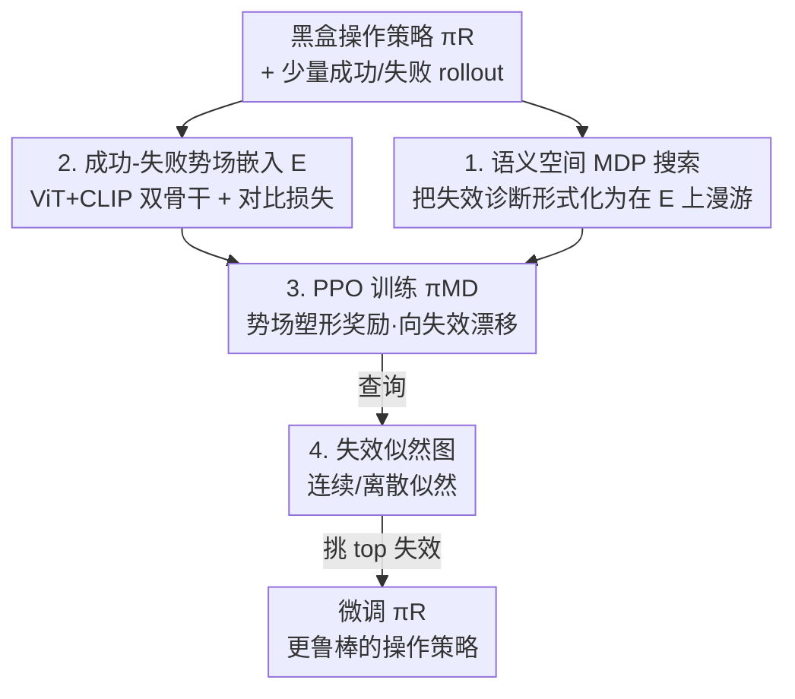

# RoboMD: Uncovering Robot Vulnerabilities through Semantic Potential Fields

**会议**: ICLR 2026  
**OpenReview**: [https://openreview.net/forum?id=Gsrw1vxq1G](https://openreview.net/forum?id=Gsrw1vxq1G)  
**代码**: https://github.com/somsagar07/RoboMD (有)  
**领域**: 机器人 / 具身智能 / AI安全  
**关键词**: 失效诊断, 操作策略鲁棒性, 视觉-语言嵌入, 势场, 深度强化学习

## 一句话总结
为预训练的机器人操作策略训练一个独立的深度 RL「诊断策略」πMD，让它在一个由少量成功/失败数据学出来的连续视觉-语言嵌入空间里搜索，把这个空间当作「势场」朝失效区漂移、远离成功区，从而不用大量真机试验就能预测出操作策略会在哪些环境变化下失效——比 SOTA 的视觉-语言基线多挖出最多 23% 的独特漏洞。

## 研究背景与动机
**领域现状**：机器人操作策略（抓瓶子、码积木等）被视为具身 AI 的基础问题，业界主要靠课程学习、域随机化、视觉-语言-动作大模型等「训练侧」方法来提升鲁棒性。但无论模型多通用，部署时总会遇到没预料到的环境变化，因此还需要一个「诊断侧」工具，在部署前系统地找出策略到底会在哪里栽跟头。

**现有痛点**：在感知/语言任务里找漏洞很便宜——查个大数据集或 benchmark 就行；但在操作任务里找漏洞极难，因为它需要真机试验，慢、贵、还可能伤到机器人、环境甚至人。于是朴素的启发式测试或试错既不现实又昂贵。

**核心矛盾**：诊断操作策略漏洞被两件事卡住——(i) **该测什么是未知的**：操作策略要扛住颜色、形状、材质、光照、背景、布局等无数变化，硬编码一小撮已知变化去搜，会漏掉只在新条件下才暴露的关键失效模式；(ii) **直接真机测试代价高且不安全**。

**本文目标**：构造一个既能廉价/安全地搜索、又能从有限已知变化泛化到全新变化的失效诊断框架。

**切入角度**：作者把失效搜索重新表述成「在一个学出来的连续视觉-语言嵌入空间里探索」，而不是在离散的、人手指定的变化上探索。这个嵌入空间富含语义与视觉结构，可以被当成一个「势场」来引导探索朝失效、避开成功。

**核心 idea**：训练一个**与 πR 架构无关、只需要 πR 的 rollout** 的独立深度 RL 策略 πMD，在「成功-失败势场」嵌入空间里做虚拟漫游来预测漏洞——把昂贵的物理试验换成几乎零成本的嵌入空间跳转。

## 方法详解

### 整体框架
RoboMD 要做的事是：给定一个黑盒的预训练操作策略 πR，产出一张「失效似然图」，告诉工程师 πR 在各种环境变化（含没见过的变化）下大概率会怎么失败。整条管线分四步串起来：先用少量带成功/失败标签的 rollout 训一个视觉-语言嵌入空间 E，并刻意把它结构化成一个「势场」；再把诊断问题形式化成在 E 上漫游的 MDP，用 PPO 训出诊断策略 πMD，让它被失效区吸引、被成功区排斥；训好后查询 πMD 得到失效似然图；最后用图上排名最高的失效模式去针对性微调 πR。关键在于 πMD 的每一步「动作」只是在嵌入空间里跳到另一个假想的环境变化，不需要真改物理环境跑 rollout，所以搜索极其廉价。

### 关键设计

**1. 失效诊断 = 语义空间里的 MDP 搜索**

要在「未知该测什么」的前提下系统找漏洞，作者先把问题形式化成一个马尔可夫决策过程 $\langle S, A, P, R, \gamma \rangle$，但状态和动作都不绑物理含义，而是直接活在连续语义嵌入空间 $E$ 上。状态 $s_t \in S \equiv E$ 是一个 512 维向量，代表一个「假想的环境变化」——注意这里包含物理上可能实现也可能不可实现的变化，所以 $S$ 是「通过嵌入可达的全部假想变化」的集合；动作 $a_t \in A \equiv E$ 也是 512 维向量，作用是给当前状态引入一个变化，让 πMD 从一个假想环境跳到另一个。πMD 把操作策略 πR 和环境整体当黑盒，目标是找一串动作（环境变化）让 πR 失败的概率最大，奖励则鼓励「尽快」找到失效。这样做的好处是：探索空间从离散、人手指定的几个变化，变成了一个连续、语义连贯的空间，πMD 能自然地发现变化之间的关系并外推到没见过的条件。

**2. 把嵌入空间训成「成功-失败势场」**

要预测没见过环境的漏洞，需要两样东西：一份「漏洞大概在哪」的先验，以及把这个先验泛化到新条件的能力。作者从有限的带标签 rollout 数据集 $D=\{(x^{vision}_i, x^{lang}_i), y_i\}_{i=1}^M$（$y\in\{$失败, 成功$\}$，文本描述可由已知的环境变化自动生成）出发，训一个**双骨干**多模态嵌入：ViT 处理原始图像（借 ImageNet 预训练带来的语义先验，让 πMD 能从相似环境推断没见过的环境），CLIP 编码任务的自然语言描述（实验发现语言能帮助聚焦视觉里的关键特征）。两路输出投影拼接后过一个 512 维 MLP + 分类头，得到嵌入 $e_i$。训练用二元交叉熵（分类成功/失败）加一个对比损失 $L$ 的联合目标：

$$L = \sum_{i,j\in D}\left[\mathbb{1}_{y_i=y_j}\,d_{ij} + \mathbb{1}_{y_i\neq y_j}\max(0, m-d_{ij})\right],\quad d_{ij}=\|e_i-e_j\|_2$$

它把同结果（都成功或都失败）的 rollout 拉近、不同结果的推开，从而让 $E$ 在局部变得平滑：邻近 = 结果相似。这个平滑结构正是「势场」$\Phi$ 的来源——后面理论部分证明，基于势差 $F(s_t,a,s_{t+1})=\gamma\Phi(s_{t+1})-\Phi(s_t)$ 的奖励塑形既能保证最优策略不变，又给收敛提供稠密信号。换句话说，对比损失不是随便加的正则，它把嵌入空间「掰」成了一个能引导 RL 朝失效区滚下去的地形。

**3. PPO 在连续语义空间里向失效区漂移**

有了势场，πMD 就能在 $E$ 里漫游，用一批预计算的已知嵌入 $E_{known}=\{e_i; i\in D\}$ 当参考锚点。具体地（见算法 1），πMD 从嵌入空间采样一个动作 $a^*_{t+1}$，再在 $E_{known}$ 里找最近的嵌入作为实际动作 $a$——于是「执行动作」就隐式地给环境施加了一个变化，但根本不用真改物理环境，所以代价远低于真机 rollout。优化用 PPO，因为它训练稳定且熵正则在连续空间里尤其关键：能防止智能体塌缩到少数几个模式、鼓励覆盖更广的空间（实验里 PPO 的动作熵 2.88 高于 A2C、SAC）。奖励函数设计成既奖励发现失效、又惩罚偏离 $E_{known}$ 太远（远了进入不确定区）和重复动作（重复说明搜索卡住）：

$$R(s,a)=\begin{cases}\dfrac{K_{failure}}{penalty+1}-k\cdot N(a), & \text{失败}\\[2mm]-\dfrac{K_{success}}{horizon\times(penalty+1)}, & \text{成功}\end{cases}$$

其中分母的距离 penalty 随 $\|a-e\|$ 增大，可关联到势场 $\|a-e\|^2=\|\Phi(s_a)-\Phi(s_e)\|^2$；频率惩罚 $N(a)$ 数连续重复次数，系数 $k=5$，把智能体推向不确定区。这套奖励呼应了 Theorem 2：把探索集中在成功/失败的决策边界附近，能更高效地识别漏洞。当候选变化是**已知**的（如历史失效或专家知识给出），还有一个特例：πMD 只需在离散的 $E_{known}$ 上搜，依次施加预定义动作序列（如「桌面变黑 → 光照调到 50% → 桌子设为尺寸 X」）直到诱发失败。

**4. 从失效似然图到针对性微调 πR**

πMD 训好后输出的是变化（动作）上的概率分布，可直接读成一张失效似然图。在连续空间里 πMD$(a|s)$ 建模为 $\mathbb{R}^{512}$ 上的高斯密度，虽然任意精确动作的概率为 0，但似然比 $\frac{p_{MD}(a_{t1}|s)}{p_{MD}(a_{t2}|s)}$ 良定义，能判断哪个变化更容易致失效；似然估计的置信度由当前状态嵌入到最近已知嵌入的距离 $\min_{e\in E}\|e-e_s\|$ 衡量。限制到有限候选集 $E_{known}$ 时，就退化成 $E_{known}$ 上的 softmax 类别分布 $\pi_{MD}(a|s)=\frac{\exp(f_a(s))}{\sum_{a'}\exp(f_{a'}(s))}$，质量逐渐集中到致失效的变化上。这张排好序的失效模式清单让工程师不必再盲目收集大量无重点的 rollout，而是**只针对似然最高的失效**（如特定光照或物体变化）定向采集一小批数据微调 πR，用很小的数据量就系统地「打补丁」。

### 损失函数 / 训练策略
嵌入空间用 BCE（成功/失败分类）+ 对比损失 $L$（margin $m$）联合训练，把 $E$ 结构化成势场；πMD 用 PPO 在 $E$ 上训练，奖励见上式（失效奖励、偏离惩罚、频率惩罚 $k=5$，折扣 $\gamma=0.99$）。理论上有三条保证：Theorem 1 用势能塑形理论证明 advantage 不变、最优策略保持；Theorem 2 证明嵌入 Lipschitz 连续 → 奖励平滑、梯度稳定，且探索集中在决策边界、以多项式于 $1/\epsilon$ 的 rollout 达到精度 $\epsilon$；Theorem 3 证明势场塑形让 critic 初始/近似误差更小，PPO 收敛更快。

## 实验关键数据

### 主实验
仿真在 RoboSuite + RoboMimic/MimicGen 上，覆盖 lift / stack / threading / pick&place 四个任务，对多种操作策略（BC、HBC、BC-Transformer、BCQ、Diffusion）做诊断；用 500 对成功-失败样本构造排序一致性的 ground truth。πMD（PPO）在排序准确率上全面超过其它 RL、VLM 和轻量模型基线。

| 模型类别 | 模型 | Lift | Square | Pick&Place | 平均 |
|--------|------|------|--------|-----------|------|
| RL | **PPO (πMD)** | **82.3%** | **84.0%** | **76.0%** | **80.7** |
| RL | A2C | 74.2% | 79.0% | 72.0% | 75.0 |
| RL | SAC | 51.2% | 54.6% | 50.8% | 52.2 |
| VLM | GPT-4o-ICL (5-shot) | 57.4% | 48.6% | 57.0% | 54.3 |
| VLM | Gemini 1.5 Pro | 59.0% | 36.4% | 37.4% | 44.3 |
| VLM | Qwen2-VL | 32.0% | 24.6% | 57.4% | 38.0 |
| 小模型 | ResNet | 49.0% | 52.0% | 44.0% | 48.3 |

VLM 整体准确率普遍低于 60%，说明它们不与机器人策略迭代交互、也难给出可靠的量化概率预测。πMD 在不同任务/不同架构策略上的失效检测准确率也保持稳定（Table 2：Lift 82.5%、Stack 88.0%、Threading 68–82%）。

### 消融实验

| 配置 | 关键指标 | 说明 |
|------|---------|------|
| Image+Text，BCE+对比损失（Full） | MSE 0.1801 / Frobenius 7.64（最低） | 混淆矩阵对角性最强，动作可分性最高 |
| 仅 BCE 损失 | 较差 | 去掉对比损失，嵌入局部一致性下降 |
| 仅图像骨干 | 较差 | 去掉语言，无法聚焦关键视觉特征 |
| 微调 πR：Pre-trained | 准确率 67.91% | 微调前 |
| 微调 πR：FT with RoboMD | **准确率 92.83%**，误差 0.033 | 用 πMD 的 top 失效定向微调 |
| 微调 πR：FT with all failures | 准确率 85.48% | 用全部失效微调，反而不如定向 |

### 关键发现
- **多模态 + 对比损失是嵌入质量的关键**：去掉任一个，嵌入空间的可分性和局部平滑性都明显下降；Full 模型在分组指标上分离比最高 22.99、轮廓系数 0.91、Davies-Bouldin 仅 0.15。
- **泛化到没见过的变化**：在真实 UR5e 和仿真上，πMD 对训练时从没见过的变化（如真实的「面包」、仿真的「黑色桌子」）的失效似然排序与 ground truth 一致，21 个未见变化上准确率 61%–80%。
- **定向微调 > 全量微调**：用 πMD 排名最高的失效做针对性微调把 BC-lift 策略从 67.91% 提到 92.83%，比「用全部失效微调」（85.48%）还好，说明诊断信号能用更少数据换更大鲁棒性提升。
- **语义连续性**：在受控的光照强度扫描下，嵌入累计距离随光照减弱单调增大（Kendall's $\tau=1.000$、Pearson's $r=0.982$），证明 $E$ 适合当连续势场用。
- 比 SOTA 视觉-语言基线多挖出最多 23% 的独特漏洞，且抓到了启发式测试漏掉的细微失效。

## 亮点与洞察
- **把「找漏洞」变成「在势场里滚下坡」**：用对比损失把嵌入空间掰成势场，再用势能塑形奖励引导 PPO——既保证最优策略不变（advantage invariance），又给探索提供稠密、平滑的信号，理论和工程都自洽，这是最漂亮的一笔。
- **动作不绑物理含义反而是优势**：动作是 512 维向量、隐式映射到最近已知嵌入，于是「执行一次环境变化」几乎零成本，把昂贵真机试验换成嵌入空间跳转，这是整套方法可扩展的根。
- **诊断信号可直接驱动改进**：失效似然图不止是报告，它给出排好序的失效清单，让微调从「广撒网」变成「精准打补丁」，用更少数据系统地修漏洞——这个「诊断→改进」闭环可迁移到任何黑盒策略。
- **架构无关**：πMD 只需要 πR 的 rollout，无论 πR 是 BC、RL、还是 VLA 大模型都能诊断，作为部署前的诊断工具与现有训练侧鲁棒化方法互补。

## 局限与展望
- **依赖初始有限标注数据的覆盖**：势场先验来自人按「常暴露漏洞的条件」挑出来的变化（物体颜色、光照等），如果初始数据完全没触及某类失效方向，泛化是否依然成立存疑。
- **状态空间含物理不可实现的变化**：$S$ 包含物理上不可达的假想变化，πMD 找到的部分「漏洞」可能对应现实里造不出来的环境，落地时需要额外的可实现性过滤。
- **理论保证依赖嵌入 Lipschitz 连续等假设**：Theorem 2/3 的样本效率与收敛加速依赖嵌入平滑、势场良结构等前提，真实多模态嵌入是否严格满足、不满足时退化多少，正文主要给的是 sketch（⚠️ 完整证明在附录，以原文为准）。
- **改进思路**：把可实现性约束直接编进动作空间或奖励；探索把 πMD 在线挂到部署中持续诊断；研究跨任务/跨机器人迁移诊断策略。

## 相关工作与启发
- **vs 直接查询 VLM 找失效（Agia / Duan 等）**：VLM 不与机器人策略迭代交互、也难给可靠的量化概率，本文实验里 VLM 准确率普遍 <60%；πMD 通过 RL 主动搜索 + 概率输出，量化预测更准。
- **vs 用 RL/MDP 在分类/生成或恶劣天气里找错误（Sagar / Delecki / Hong 等）**：那些工作既没在操作这类复杂物理系统上验证过，也无法泛化到固定已知失效集之外；本文两点都解决了。
- **vs OOD 检测 / 不确定性量化**：失效检测与 OOD 是不同问题——不是所有 OOD 都会失效，分布内也会失效；本文刻画分布内外的失效，而非仅标记 OOD。
- **vs 训练侧鲁棒化（域随机化、课程学习、VLA）**：那些是「让策略更强」，本文是「诊断策略哪里弱」，互补——再通用的模型也会遇到没预料的条件，诊断工具不可或缺。

## 评分
- 新颖性: ⭐⭐⭐⭐⭐ 把失效诊断重构为「连续语义势场上的 RL 搜索」，并用对比损失 + 势能塑形把理论和工程串成闭环，角度新颖。
- 实验充分度: ⭐⭐⭐⭐ 覆盖四任务、多策略架构、仿真+真机、VLM/RL/小模型多类基线，还做了泛化、消融与微调闭环；理论部分以 sketch 为主。
- 写作质量: ⭐⭐⭐⭐ 形式化清晰、图示直观，但核心指标（FSI/NFM 等）与多个定理细节散落在附录。
- 价值: ⭐⭐⭐⭐⭐ 部署前安全廉价地诊断黑盒操作策略漏洞，且诊断信号能直接换成更鲁棒的策略，实用价值高。

<!-- RELATED:START -->

## 相关论文

- [\[ICML 2026\] Dual Advantage Fields](../../ICML2026/robotics/dual_advantage_fields.md)
- [\[CVPR 2026\] DynBridge: Bridging Imagination and Control through Interaction Dynamics for Robot Manipulation](../../CVPR2026/robotics/dynbridge_bridging_imagination_and_control_through_interaction_dynamics_for_robo.md)
- [\[CVPR 2026\] AtomicVLA: Unlocking the Potential of Atomic Skill Learning in Robots](../../CVPR2026/robotics/atomicvla_unlocking_the_potential_of_atomic_skill_learning_in_robots.md)
- [\[ICLR 2026\] Embodied Agents Meet Personalization: Investigating Challenges and Solutions Through the Lens of Memory Utilization](embodied_agents_meet_personalization_investigating_challenges_and_solutions_thro.md)
- [\[ICLR 2026\] Theory of Space: Can Foundation Models Construct Spatial Beliefs through Active Exploration?](theory_of_space_can_foundation_models_construct_spatial_beliefs_through_active_e.md)

<!-- RELATED:END -->
