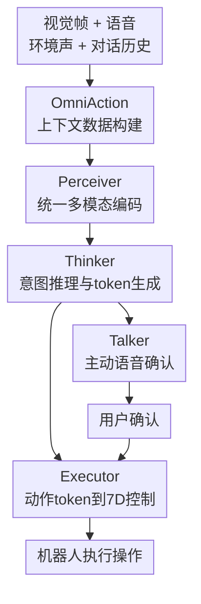

# RoboOmni: Proactive Robot Manipulation in Omni-modal Context

**会议**: ICLR2026  
**OpenReview**: [https://openreview.net/forum?id=OJh7oBCYhL](https://openreview.net/forum?id=OJh7oBCYhL)  
**代码**: https://github.com/OpenMOSS/RoboOmni  
**领域**: 机器人操作 / Omni-modal VLA / 主动人机交互  
**关键词**: 主动机器人操作, 跨模态上下文指令, 语音视觉动作模型, 环境声音, 人机确认  

## 一句话总结
RoboOmni 把语音、环境声音、视觉观察和机器人动作放进统一的 omni-modal LLM 框架中，让机器人能从没有显式命令的家庭上下文里主动推断用户意图、先用语音确认，再执行 7-DoF 操作动作。

## 研究背景与动机
**领域现状**：机器人操作里的 VLA 模型已经能把视觉观察和语言命令映射到动作，例如 OpenVLA、π0、NORA 这类模型都假设用户会给出相对清楚的文本或语音指令。
这类设置在基准里很自然：用户说“把可乐放到桌上”，机器人看图、理解语言、输出末端执行器动作。
但真实家庭协作里，人并不总是像给机器人下任务一样说话。
更多时候，意图藏在对话、语气、环境声音和物体状态里。

**现有痛点**：第一类痛点是指令类型过于显式。
已有 VLA 主要处理 direct instruction 或稍复杂但仍明确的 instruction，少量工作开始研究 inferential text instruction，但仍然偏文本推理。
第二类痛点是输入源过窄。
很多系统把语音先交给 ASR，再把转写文本喂给 VLA，这会丢掉语气、重音、情绪、说话人身份、重叠发言和非语言声音。
例如“嗯……这个橙汁……”如果带着明显负面语气，真实含义可能是“不想要橙汁”，但 ASR 文本很难稳定保留这种信号。

**核心矛盾**：主动机器人协作需要“听懂场景”，而不是只“读懂命令”。
语音语义给出人说了什么，副语言线索给出人怎么说，环境声音提示发生了什么，视觉观察决定哪些物体和动作可行。
这些信号彼此互补，但级联系统会在 ASR、planner、controller 等接口处逐步丢信息。

**本文目标**：作者要定义一个新的机器人操作设置：cross-modal contextual instruction。
在这个设置里，机器人接收视觉帧、自然语音、环境声和对话历史，从中恢复潜在任务意图。
如果意图还不够确定，机器人应该主动发问确认，而不是直接执行或等待显式命令。
确认后，系统还要输出真实可执行的机器人动作。

**切入角度**：论文的观察是，omni-modal LLM 已经能在语音、视觉和文本之间建立统一表示，但它们通常停在语言或语音输出，没有进入 embodied action。
反过来，VLA 模型能输出动作，却很少直接处理真实音频上下文。
因此作者把二者接起来：用 omni-modal LLM 做端到端感知、思考、说话和执行。

**核心 idea**：用统一的 Perceiver-Thinker-Talker-Executor 框架替代 ASR+VLA 级联管线，让机器人直接从原始音频和视觉上下文中推断隐含意图，并把确认话语与动作 token 一起自回归生成。

## 方法详解
### 整体框架
RoboOmni 的输入不是一条干净的文本命令，而是随时间变化的视觉观察 $V_{1:T}$、音频信号 $S_{1:T}$ 和对话历史 $C$。
音频里既有人的语音，也可能有说话人身份、情绪、重叠发言、门铃、厨具声和背景噪声。
模型先把这些异构输入编码到统一 token 空间，再由 LLM 主干推理用户意图，必要时生成确认语音，最后把动作 token 解码成机器人 7 维控制量。

从训练数据看，作者先构建 OmniAction，把 Open-X 中的原子操作轨迹扩展成带上下文的多模态 episode。
每个样本可看成 $(C,V,A)$：对话上下文 $C$、视觉序列 $V$ 和专家动作轨迹 $A=\{a_t\}_{t=1}^{T}$，其中动作 $a_t\in\mathbb{R}^7$ 表示末端执行器的位移、旋转和夹爪控制。
OmniAction 覆盖 141,162 个 episode、112 种技能、748 个物体、5,096 个说话人音色、2,482 类非语言事件声音和 640 种环境背景。

从模型看，RoboOmni 由四个角色组成。
Perceiver 负责把视觉、音频和对话历史编码成统一表示。
Thinker 是 omni-modal LLM 主干，负责在统一 token 空间中推理和生成。
Talker 把 Thinker 的语义表示和文本 token 转成自然语音，用于确认或回应。
Executor 则把动作 token 还原成机器人控制指令。
这个框架的关键不只是“多接了一个音频输入”，而是把听觉、视觉、语言交互和动作输出都纳入同一个自回归建模问题。

### 关键设计
**1. 跨模态上下文指令：把“没说出口的需求”变成机器人操作任务**

论文首先把任务定义从显式命令扩展到 cross-modal contextual instruction。
在传统 VLA 里，任务通常是“用户明确说出目标”，模型只需把语言和视觉对齐到动作。
RoboOmni 面对的是另一种交互：用户可能只是说“我有点渴”，旁边有人补充“冰箱里有橙汁和可乐”，又传来榨汁机声音和对橙汁的负面语气。
机器人需要综合这些线索，推断“用户可能更想要可乐”，再问“要不要我拿可乐？”

这个设置有三个具体要求。
第一，模型必须保留原始音频中的副语言信息，因为情绪、身份和重叠发言往往决定真实意图。
第二，模型必须把声音和视觉落到同一场景里，否则听见“门铃”或“锅”的声音也不知道对应哪个动作。
第三，模型必须能在不确定时发起确认，而不是把推理结果直接当命令执行。
因此，这个任务自然要求一个闭环：意图识别、交互确认、动作执行。

**2. OmniAction 数据构建：用六类上下文现象补齐主动意图推理监督**

这篇论文的一个核心贡献不是单纯换模型，而是补上训练数据。
作者从 Open-X 的操作轨迹出发，过滤掉视觉状态信息量低的样本，再用 GPT-4o 把原始原子指令改写成家庭多轮对话，并扩展出机器人确认与用户回复。
随后，文本对话被转换成真实音频：不同 TTS 引擎和 voice cloning 生成多说话人语音，重叠发言按时间轴插入，非语言事件声放在语义锚点上，环境背景按不同 SNR 混入。
最后再通过 GPT 校验和人工抽样验证保证意图可恢复，人工验证中任务意图可恢复的一致率达到 98.7%。

OmniAction 的六类上下文指令很贴近真实家庭交互。
Sentiment Cues 用语气和情绪排除错误选择；Overlapping Voices 让模型从重叠发言中判断谁的偏好更关键；Non-Verbal Cues 让门铃、闹钟、锅具声等事件决定动作；Identity Cues 要求模型根据年龄、性别或家庭角色判断该满足谁；Dyadic Dialogue 和 Triadic Dialogue 则把意图埋在两人或三人的对话流中。
这使模型学到的不是“语音转文本后照着做”，而是“从有噪声、有角色、有情绪、有物体状态的生活片段中恢复可执行任务”。

**3. Perceiver-Thinker-Talker-Executor：把理解、确认和执行放进同一个 token 空间**

RoboOmni 的结构借鉴 Qwen2.5-Omni 的多模态处理方式。
在时间步 $t$，视觉编码器得到 $v_t=f_v(V_t)$，音频编码器得到 $s_t=f_s(S_t)$，对话历史编码得到 $c_t=f_c(C_t)$，然后拼成统一输入 $X_t=[v_t;s_t;c_t]$。
Thinker 在这个表示上生成文本 token、语音相关表示和动作 token。
这种统一建模避免了 ASR 管线的两个问题：转写错误会改变下游动作，且转写文本天然丢失说话方式。

动作生成通过 FAST+ 风格的离散动作 token 实现。
连续动作 $a_t\in\mathbb{R}^7$ 不被逐维回归，而是表示成短的离散符号序列 $r_t\subset A$，其中动作词表 $A$ 有 2048 个 token。
于是 Thinker 可以在文本词表 $V$ 和动作词表 $A$ 的并集 $V\cup A$ 上自回归生成。
Executor 再把动作 token 解码回末端执行器的连续控制。
这让语言、语音交互和机器人控制共享同一套生成机制，也让“先问一句，再执行动作”成为模型内部连续生成过程的一部分。

**4. 端到端音频动作学习：避免 planner-controller 接口里的语义漂移和延迟**

作者特别比较了 RoboOmni 与 cascaded planner-controller 管线。
级联系统可以用 Qwen2.5-Omni 先听懂上下文，再把高层命令交给 OpenVLA、OpenVLA-OFT、NORA 或 π0 控制器。
问题是 planner 并没有和 controller 联合训练，它可能生成控制器不擅长执行的命令，或者把带身份、情绪、环境声的细粒度意图压缩成一句模糊文本。
论文把这种现象称为语义漂移，Identity Cues 上尤其明显。

端到端建模还带来推理速度优势。
ASR+VLA 的延迟主要被 ASR 阶段拖住，不同控制器之间差别不大。
在单张 RTX 4090 上，以 ASR+OpenVLA 为 $1.00\times$，ASR+π0 是 $0.96\times$，ASR+NORA 是 $1.02\times$，而 RoboOmni 只有 $0.49\times$。
也就是说，RoboOmni 不只是更“懂语音”，还通过去掉中间转写瓶颈把每次推理时间约减半。

### 一个完整示例
假设桌上有鱼丸、蛋饺和牛肉丸，一家人在吃火锅。
女儿说“夏令营认识了 Judy，她像妈妈一样不喜欢鱼丸，但很喜欢蛋饺”，妈妈随后说“那就加一点我喜欢的吧”。
如果只看最后一句，机器人很难知道“我喜欢的”是什么；如果只看转写文本，也可能把爸爸前面提到的鱼丸当成目标。
RoboOmni 需要把说话人身份、对话指代和视觉中的可操作物体连起来，推断妈妈喜欢的是蛋饺。
因此它不会直接夹取，而是先问：“Would you like me to put the egg dumpling into the hot pot?”
用户确认后，Executor 才生成把蛋饺放进火锅的动作 token。

另一个非语言例子是门铃场景。
对话里父亲说“如果门铃响，就把鱼丸放进锅里”，随后真实音频中出现门铃。
ASR+VLA 可能只看到转写文本里出现“门铃”和“鱼丸”，但不能稳定判断事件是否真的发生。
RoboOmni 直接处理原始音频，因此能把环境声作为触发条件，问“我刚听到门铃了，要不要把鱼丸放进锅里？”
这类例子说明，本文的“主动”并不是凭空猜测用户需要什么，而是在多模态证据足够时提出可撤回的确认。

### 损失函数 / 训练策略
训练目标被统一成自回归最大似然。
对话回复使用文本生成损失：

$$
L_{chat}(\theta)=-\mathbb{E}\sum_{\ell=1}^{L}\log p_\theta(y_\ell\mid X_t,y_{<\ell}).
$$

动作生成使用动作 token 损失：

$$
L_{act}(\theta)=-\mathbb{E}\sum_{i=0}^{N}\log p_\theta(r_{t+i}\mid X_t,r_{t:t+i-1}).
$$

完整目标把二者 batch interleaving 到同一个 token 序列上：

$$
L(\theta)=L_{chat}(\theta)+L_{act}(\theta)
=-\mathbb{E}\sum_{k=1}^{K}\log p_\theta(z_k\mid X_t,z_{<k}),\quad z_k\in V\cup A.
$$

实现上，模型使用 $224\times224$ 图像分辨率、16 kHz 音频采样率和动作 chunk size 6。
大规模预训练使用 64 张 A100 训练 10 天，总计约 15,360 A100-hours，batch size 512，训练 10 epoch，学习率 $5\times10^{-5}$，前 1k step warm-up。
下游 SFT 使用 8 张 A100，训练 10k 到 30k steps，学习率同为 $5\times10^{-5}$。

## 实验关键数据

### 主实验
论文先在 OmniAction-LIBERO-TTS 上比较四个任务套件和六类上下文指令。
RoboOmni 的总体成功率为 85.6%，而最强基线 NORA 在 ASR 文本设置下为 25.9%。
特别是在 Goal 和 Object 这种目标选择更模糊的套件上，文本和 ASR 系统明显崩溃，而 RoboOmni 仍保持 85% 左右。

| Benchmark / 设置 | 指标 | RoboOmni | 最强基线 | 提升 |
|--------|------|------|----------|------|
| OmniAction-LIBERO-TTS Overall | Success Rate | 85.6% | 25.9% (ASR+NORA) | +59.7 pts |
| Spatial Avg | Success Rate | 93.0% | 56.5% (ASR+NORA) | +36.5 pts |
| Goal Avg | Success Rate | 85.8% | 16.3% (ASR+NORA) | +69.5 pts |
| Object Avg | Success Rate | 84.0% | 13.8% (ASR+NORA) | +70.2 pts |
| Long-Horizon Avg | Success Rate | 79.5% | 51.0% (ASR+NORA) | +28.5 pts |

在真实人类语音的 OmniAction-LIBERO-Real 上，RoboOmni 平均为 76.6%，高于 π0 的 73.8%、OpenVLA 的 40.1% 和 NORA 的 17.4%。
在真实 WidowX 250S 机械臂实验中，RoboOmni 达到 73.9% 成功率，优于最佳 ASR+VLA 基线 52.2%。
这说明它的优势不只来自合成 TTS 数据，也能迁移到真实口音、连读、背景噪声和真实执行误差下。

| 场景 | 指标 | RoboOmni | 对比方法 | 结论 |
|------|------|---------|----------|------|
| OmniAction-LIBERO-Real Avg | Success Rate | 76.6% | π0 73.8% | 真实语音下仍最高 |
| OmniAction-LIBERO-Real Spatial | Success Rate | 89.0% | π0 86.0% | 空间任务保持优势 |
| OmniAction-LIBERO-Real Goal | Success Rate | 71.6% | π0 60.0% | 模糊目标更受益于音频上下文 |
| OmniAction-LIBERO-Real Object | Success Rate | 75.1% | π0 70.0% | 目标物体选择更稳 |
| 真实 WidowX 250S | Success Rate | 73.9% | 最强 ASR+VLA 52.2% | 真实机器人上 +21.7 pts |

### 消融实验
输入消融表明，RoboOmni 的增益确实来自音频、视觉和副语言信号的互补，而不是单一模态。
完整输入的意图识别准确率为 88.89%。
去掉音频后只剩 11.11%，说明可操作语义主要来自音频。
去掉视觉后为 58.89%，说明很多意图必须落到场景物体和空间关系。
把音频重录成单一中性说话人、去掉情绪和非语言事件后为 50.56%，说明副语言线索不是装饰，而是解歧核心。

| 配置 | 意图识别准确率 | 说明 |
|------|---------|------|
| Full Input | 88.89% | 视觉、语音语义、副语言和环境声完整保留 |
| w/o vision | 58.89% | 能听懂大意，但难以 grounding 到物体和空间关系 |
| w/o audio | 11.11% | 失去主要任务语义，几乎无法主动推断 |
| w/o paralinguistics | 50.56% | 情绪、身份、非语言声被抹平后歧义显著增加 |

主动辅助评估里，RoboOmni 的 intent recognition 为 88.89%，高于 Qwen2.5-Omni-3B 的 27.78%、Qwen2.5-Omni-7B 的 50.00% 和 ASR+GPT-4o 的 55.56%。
这点很重要：更强的通用推理模型能部分弥补 ASR 损失，但不能完全替代端到端 speech-action 训练。
训练效率实验也显示，OmniAction 预训练后的模型在约 2k step 内就接近 90% accuracy，而从零 SFT 到 20k step 也只有约 30%，30k step 还可能退化。

| 分析项 | RoboOmni | 对照 | 含义 |
|------|---------|------|------|
| Intent Recognition | 88.89% | ASR+GPT-4o 55.56% | 端到端音频动作学习强于转写后推理 |
| 预训练 + SFT | 约 2k step 接近 90% | 从零 SFT 20k step 约 30% | OmniAction 提供可迁移先验 |
| 推理延迟 | 0.49× | ASR+OpenVLA 1.00× | 去掉 ASR 后速度约提升一倍 |
| 真实失败来源 | 42.6% 意图错误 / 57.4% 执行错误 | 抓取失败、位姿漂移、可达性限制突出 | 低层控制仍是主要瓶颈之一 |

### 关键发现
- 直接处理原始音频是核心优势：ASR 既会引入识别错误，也会抹掉情绪、身份、重叠语音和环境声这些对意图推断很关键的线索。
- 视觉不是辅助背景，而是 grounding 的必要条件：没有视觉时，模型即使听懂了“那个”“锅”“门铃后要做的事”，也难以确定场景中哪个物体和动作可执行。
- 非语言线索是最难的一类：论文报告端到端模型在 dyadic 和 overlapping 场景平均约 88%，non-verbal 约 82%，说明环境事件声与视觉/语音融合仍有难度。
- 真实机器人失败更多来自执行端：失败分析中 57.4% 是执行错误，主要包括 grasp failure、pose estimation drift 和 reachability constraints，说明意图层进步还需要更稳的低层控制配合。

## 亮点与洞察
- RoboOmni 把“主动”具体化成可训练闭环：不是让机器人自由猜测，而是让它从上下文推断候选意图，并通过 Talker 发起确认，确认后再执行。
- OmniAction 的价值很大：它把家庭对话、说话人身份、情绪、重叠语音、事件声和背景噪声系统性注入操作轨迹，给 proactive manipulation 提供了可复现实验土壤。
- 统一 token 空间的设计很自然：文本回复和动作控制都可以写成 $z_k\in V\cup A$ 的自回归预测，使“说话”和“行动”不再是两个割裂模块。
- 论文很好地说明了 ASR 不是语音机器人交互的充分接口：一旦任务依赖怎么说、谁在说、是否有环境事件发生，转写文本就天然信息不足。
- 对机器人系统的启发是，未来家用机器人不能只优化 command following，还要优化 context following 和 confirmation policy。

## 局限与展望
- OmniAction 依赖 GPT 改写、TTS、voice cloning 和事件声混合，虽然规模大且有人工验证，但合成对话与真实家庭互动仍可能存在分布差异。
- 论文展示了真实机器人实验，但场景仍相对受控，主要集中在桌面/火锅/家庭物体操作，距离开放家庭长期运行还有距离。
- 端到端模型对低层执行误差仍敏感，真实失败中执行类错误占 57.4%，说明抓取、位姿估计和可达性规划仍需要更强的机器人基础能力。
- 主动确认虽然能降低误执行风险，但论文没有系统讨论过度提问、打扰用户和确认策略代价；实际部署中需要平衡主动性与用户负担。
- 隐私和伦理是重要问题：系统处理家庭语音、身份和情绪信号，未来需要更明确的数据授权、端侧处理和安全存储机制。

## 相关工作与启发
- **vs OpenVLA / OpenVLA-OFT / NORA / π0**: 这些 VLA 主要从视觉和文本指令生成动作，RoboOmni 则直接处理原始音频、环境声音和视觉上下文，并能生成确认语音；优势是上下文意图更强，代价是训练数据和多模态建模成本更高。
- **vs ASR+VLA pipeline**: ASR 管线工程上简单，也能复用现有文本 VLA，但会丢副语言线索并增加延迟；RoboOmni 证明在情绪、身份、重叠语音和非语言事件场景下，端到端音频动作建模更合适。
- **vs Qwen2.5-Omni / GPT-4o 类 omni-modal LLM**: 通用 omni-modal 模型能听、看、说，但通常不输出 embodied action；RoboOmni 把动作 token 接入同一生成空间，让 omni-modal reasoning 真正落到机器人控制。
- **vs 层级 Brain-Cerebellum 机器人系统**: 层级系统显式可解释、易替换模块，但 planner 和 controller 的接口容易语义漂移；RoboOmni 更像一个联合训练的感知-交互-控制模型，适合需要细粒度上下文保真的任务。

## 评分
- 新颖性: ⭐⭐⭐⭐⭐ 新问题定义和端到端 omni-modal VLA 结合得很紧，尤其把主动确认纳入机器人操作闭环很有辨识度。
- 实验充分度: ⭐⭐⭐⭐⭐ 覆盖合成基准、真实语音、真实机械臂、输入消融、训练效率、级联对比和延迟分析，证据链比较完整。
- 写作质量: ⭐⭐⭐⭐ 论文结构清楚、图表信息充分，但方法细节有些依赖已有 Qwen2.5-Omni/FAST+ 组件，部分实现细节需要看附录和代码。
- 价值: ⭐⭐⭐⭐⭐ 对家庭服务机器人和语音交互式操作很有参考价值，也给后续研究提供了数据集、任务定义和系统基线。

<!-- RELATED:START -->

## 相关论文

- [\[ICLR 2026\] Abstracting Robot Manipulation Skills via Mixture-of-Experts Diffusion Policies](abstracting_robot_manipulation_skills_via_mixture-of-experts_diffusion_policies.md)
- [\[CVPR 2026\] ProFocus: Proactive Perception and Focused Reasoning in Vision-and-Language Navigation](../../CVPR2026/robotics/profocus_proactive_perception_and_focused_reasoning_in_vision-and-language_navig.md)
- [\[ICLR 2026\] Ctrl-World: A Controllable Generative World Model for Robot Manipulation](ctrl-world_a_controllable_generative_world_model_for_robot_manipulation.md)
- [\[NeurIPS 2025\] HiMaCon: Discovering Hierarchical Manipulation Concepts from Unlabeled Multi-Modal Data](../../NeurIPS2025/robotics/himacon_discovering_hierarchical_manipulation_concepts_from_unlabeled_multi-moda.md)
- [\[ICLR 2026\] SARM: Stage-Aware Reward Modeling for Long Horizon Robot Manipulation](sarm_stage-aware_reward_modeling_for_long_horizon_robot_manipulation.md)

<!-- RELATED:END -->
