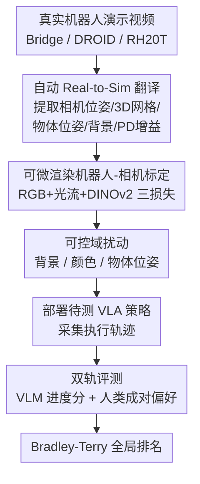

# RobotArena ∞: Scalable Robot Benchmarking via Real-to-Sim Translation

**会议**: ICLR 2026  
**OpenReview**: [https://openreview.net/forum?id=OutljIofvS](https://openreview.net/forum?id=OutljIofvS)  
**代码**: https://robotarenainf.github.io (项目页，环境与评测代码将开源)  
**领域**: 机器人 / 具身智能  
**关键词**: 机器人评测, real-to-sim, VLA 策略, 人类偏好排名, 可微渲染

## 一句话总结
本文提出 RobotArena ∞，一个把真实机器人演示视频**自动翻译成仿真数字孪生**、再在其中部署 VLA 策略并用「VLM 进度分 + 众包人类成对偏好」双轨打分的可扩展评测框架，用 8500+ 对偏好比较了来自全球实验室的 6 个 VLA，揭示了当前策略跨数据集泛化弱、对扰动敏感的现实。

## 研究背景与动机

**领域现状**：随着机器人通用策略（generalist policy，尤其是 VLA 视觉-语言-动作模型）能力快速增长，如何**公平、可复现、可扩展**地评测它们成了卡脖子的问题。NLP/CV 靠 ImageNet、LMArena 这类标准 benchmark 高速迭代，而机器人领域至今没有对应物。

**现有痛点**：真实世界评测本质上不可扩展——需要人工搭场景、复位物体、监督安全、人工判定成功，慢、贵、不安全、难复现。论文举例：有工作为评一个策略要把 T 形物体**手动摆回 20 个预设初始位姿**，每个 baseline 都重复一遍，这个复位步骤无法并行，是巨大瓶颈。集中式物理评测（如 Amazon Picking Challenge）虽是金标准，但成本高到一年最多办一次。

**核心矛盾**：机器人「成功」的定义往往依赖对执行质量的**细腻人类判断**，无法像分类任务那样用一个标量 metric 自动算出；但人类深度介入又恰恰是不可扩展的根源。评测既需要人类判断，又被人类介入拖累——这是根本张力。

**本文目标**：把人类的角色从「繁琐的搭场景、复位、安全监督」转变为「轻量的偏好比较」，并把评测整体搬进可大规模并行的仿真里。具体拆为两个子问题：(1) 如何**自动**从单视角真实视频造出物理一致的仿真孪生；(2) 如何在仿真里**可扩展地**给执行轨迹打分。

**切入角度**：作者受 LMArena 启发——LMArena 靠众包人类对同一 prompt 下两个模型回复的成对比较，聚合出 Elo 排名。作者问：机器人版的 LMArena 应该长什么样？答案是：用 real-to-sim 把视频变仿真当「同一道题」，再让人对两段执行视频投偏好票。

**核心 idea**：用「real-to-sim 自动翻译 + 仿真内 VLM/人类成对评测」替代「真实世界手工评测」，把一次性、不可复现的物理测试变成持续演化、可复现、可扩展的 benchmark。

## 方法详解

### 整体框架

RobotArena ∞ 要解决的是「怎么自动把真实视频变成能跑策略、能打分的仿真考场」。整条管线分两大块：**前半段把单帧真实视频翻译成仿真环境**（提取相机位姿、物体网格与位姿、干净背景、控制器增益五要素），并对环境施加可控扰动；**后半段把待测 VLA 部署进去、对执行轨迹双轨打分**（VLM 自动进度分 + 人类成对偏好），最后用 Bradley-Terry 模型聚合出全局排名。整个流程除了演示视频自带的机器人关节轨迹标注外，**不需要任何额外人工监督**，且模块化设计使每个组件都能随 real-to-sim 技术进步被替换升级。

### 关键设计

**1. 全自动 Real-to-Sim 翻译流水线：从单张 RGB 还原可跑仿真的数字孪生**

这一步直击「真实评测要人工搭场景」的痛点。给定一段带语言任务描述和逐帧关节角的演示视频，方法从中自动提取**五个要素**：相机相对机器人本体的 6-DoF 位姿、任务相关物体的 3D 网格重建、物体的朝向/尺寸/材质、一张干净背景图、以及比例-微分（PD）控制增益。物体重建链路是：用 Gemini 分割机器人和相关物体 → InvSR 超分每个 crop → Hunyuan-3D 把图生成有纹理的 3D 网格（在 canonical 坐标系下）。为恢复物体真实 3D 位姿，把重建网格渲染成多个 2D 视图，用 MINIMA 做对应点匹配挑出匹配最多的视图，再用 MoGE 单目深度（并以机器臂的相对深度对齐仿真真值深度算出**度量尺度因子**）把掩码像素反投影成度量尺度点云，最后对 3D–3D 对应做 SVD 求出位姿。背景用 LaMa 把机器人和物体区域 inpaint 掉得到干净底图，再用系统辨识对齐仿真末端轨迹与真实视频来标 PD 增益。

与现有 real-to-sim（如 Phone2Proc、Re3Sim）相比，它们普遍依赖**多视角拍摄、精选物体库或 fiducial marker**，对典型单视角机器人数据集不实用；RobotArena ∞ 只需静态相机的**单张 RGB**，也不像 RialTo 那样要人在回路分割或机器人专门跑标定轨迹，因而能扩展到 Bridge/DROID/RH20T 这类既有大规模数据集。

**2. 可微渲染的机器人-相机自动标定：用三项对齐损失解开未知外参**

机器人演示视频通常是「未标定」的——相机相对机器人的位姿未知，而这恰恰是把仿真摆对的前提。方法先按 URDF 用可微渲染构建一个**关节角条件化的 3D 高斯机器人模型**（沿用 DR-Robot）；给定逐帧关节角的视频，渲染该高斯模型并优化相机的 3D 平移与旋转，最小化一个三项组合对齐损失：(i) RGB 损失惩罚像素级外观差异；(ii) 光流损失强制渲染运动场与视频光流一致；(iii) 特征损失对齐渲染帧与观测帧的 DINOv2 嵌入。当有标定元数据（如 DROID）时用作初始化，否则像 BridgeV2 那样先粗网格搜索给一个鲁棒起点。三项损失从外观、运动、语义特征三个互补角度约束，使得只靠单视角视频就能解出可靠外参。

**3. 可控域扰动：沿多个轴系统性压力测试泛化与鲁棒性**

光在「原始环境」里打分还不够，作者要测策略在分布漂移下到底有多脆。于是对生成的环境施加三类受控扰动：**背景变化（∆BG）**用多样背景数据集里的不同 inpaint 纹理替换原场景背景，隔离策略对上下文外观线索的依赖；**颜色偏移（∆Color）**改 RGB 通道配置（如 RGB→BGR），以约 33% 为步长从 0% 到 100% 施加，测低层颜色鲁棒性；**物体位姿变化（∆ObjPose）**随机置换场景中物体位置。因为这些扰动都建在仿真里，可以在严格受控、其他变量不变的条件下逐轴单独施加——这是真实世界几乎做不到的事，也是仿真评测的独特价值。

**4. 双轨评测：VLM 自动进度分与人类成对偏好互补，BT 模型聚合排名**

评测分绝对与相对两条轨。**绝对评测（VLM 进度分）**：把有序视频帧连同特权仿真状态（物体状态、机器人状态，初始态作为零进度参考）喂给 Gemini 2.5 Pro，让它对每帧打一个进度分；轨迹级分数取**最后 30% 帧的平均**，因为终末阶段最能体现成功或失败，作者发现该 metric 与人工进度分高度吻合。**相对评测（人类偏好）**：对同一仿真环境、同样初始条件和指令下的两段策略执行视频做**双盲成对比较**，标注者给出偏好标签（A 好 / 平局 / B 好）和一段自由文本理由——要求写理由能提升标注者投入度与准确率。最后用 Bradley–Terry 模型聚合：给每个策略一个潜在能力分 $\theta_i > 0$，定义 $P(\pi_i \succ \pi_j) = \frac{\theta_i}{\theta_i + \theta_j}$，仅用非平局比较做最大似然估计（log 参数化下目标凹，可梯度上升高效求解），排序 $\theta$ 即得全局排名 $R$，并用稳健（sandwich）方差估计给出置信区间。两轨互补：VLM 提供可扩展的标量信号，人类偏好捕捉数值 metric 漏掉的细腻执行质量。

## 实验关键数据

初版 benchmark 在 100 个名义环境 + 数百个扰动上聚合了 **8500+ 对偏好**（BridgeSim 上为 8,749 对人类成对比较），对比来自全球独立实验室的 **6 个 VLA**：Octo、RoboVLM、SpatialVLA、CogAct、X-VLA、π0。环境分三套：BridgeSim（70 个环境，源自常用于预训练的 BridgeV2）、DROIDSim（DROID，噪声较高、常被排除在预训练外）、RH20TSim（RH20T，仅 SpatialVLA 的 backbone 在此预训练过），从而覆盖 in-distribution 与 out-of-distribution。

### 主实验

| 维度 | 现象 | 含义 |
|------|------|------|
| 人类 vs VLM 排名 | 两者排名**完全一致**（π0、X-VLA 优于 CogAct/RoboVLM/Octo/SpatialVLA） | 自动 VLM 评测与人类判断高度一致，可放心用 VLM 扩展 |
| 跨数据集泛化 | 在非训练数据集（DROID/RH20T）派生的环境上性能大幅下降 | 当前 VLA 不是真正的 generalist，只擅长训练分布内 |
| 与 SIMPLER 对比 | 所有 VLA 在 SIMPLER（仅 4 个环境）上分数都显著**高于** BridgeSim（70 个环境） | SIMPLER 因环境少、场景选择有偏而**高估**了策略性能 |

### 扰动鲁棒性 / 关键发现

| 扰动轴 | 观察 | 解读 |
|--------|------|------|
| 颜色偏移 ∆Color | backbone 更强的策略更抗色变 | 强 backbone 依赖不变的结构线索而非表层外观，Octo 这类较弱模型易被干扰 |
| 背景变化 ∆BG | 所有策略普遍掉点 | 策略重度依赖固定环境线索，存在对训练视觉布置的过拟合 |
| 物体位姿 ∆ObjPose | 显式 3D 建模带来一定抗性但仍下降 | 3D 结构有帮助但不足以实现真正语义泛化 |

### 关键发现
- **「空间悖论」**：π0 和 X-VLA 没有 SpatialVLA 那种显式 3D 归纳偏置，反而更鲁棒。作者推测因其预训练含腕部相机多视角数据，从原始多视角中学到的跨视角一致性可能比显式 3D 先验提供了更强的空间表征。
- **模型选择确实有区分度**：BridgeSim 及其扰动变体清晰把 π0、X-VLA 区分为最强；但优势并非普适——在 RH20TSim 上 RoboVLM 达 19.05%、远超其他，而 X-VLA 直接 0.00%，说明排名随分布而变。
- **排名跨条件稳定**：尽管绝对性能随分布漂移和扰动下降，模型间排名在各条件下保持一致，说明架构与数据设计差异带来的是可测、可复现的性能差。
- **真实-仿真一致性初步验证**：在「Put the carrot in the plate」任务上同时跑真实与仿真，RoboVLM/SpatialVLA 两边都成功、Octo 两边都失败（始终抓不起胡萝卜），结论一致。

## 亮点与洞察
- **把人类从「搭场景的劳力」变成「投偏好票的裁判」**：这是整篇最聪明的视角转换——既保留了机器人评测离不开的人类细腻判断，又把不可扩展的体力活（复位、监督）从评测回路里彻底剔除。
- **VLM 进度分取「末 30% 帧均值」是个朴素但有效的 trick**：把「是否成功」这个本来要看整段轨迹的判断，收敛到最能体现成败的终末阶段，且实测与人工高度对齐，可直接迁移到任何需要自动判定 episode 成败的具身任务。
- **「benchmark 太小会系统性高估」的实证**：用同源数据（Bridge V2）造 70 个环境 vs SIMPLER 的 4 个环境，直接量化出小 benchmark 的乐观偏差，对整个领域如何设计评测有警示意义。
- **模块化 real-to-sim 的可升级性**：每个子模块（分割/3D 生成/深度/inpaint）都能被更强模型替换，benchmark 保真度随技术进步持续提升，而非一次性冻结。

## 局限与展望
- 作者承认：当前被评策略**不用腕部相机**，限制了部分精细操作的保真度；正在扩展管线以生成支持多视角观测的完整 3D 交互环境。
- 仿真器对**细粒度接触动力学**（如把充电器插进插座）仍难以忠实建模，是物理引擎与资产生成的公开难题。
- 自己发现的局限：与真实世界排名的相关性只在**单个任务**上验证过（精确复刻真实场景结构/纹理/相机布置本身极难且易引入人为偏差），跨任务的 sim-to-real 排名一致性尚缺大规模证据；VLM 打分依赖特权仿真状态，迁移到无状态场景时可靠性待考。
- 评测者是普通终端用户而非机器人专家，这既贴近「机器人最终服务对象」的初衷，也可能在涉及专业执行质量判断时引入噪声。

## 相关工作与启发
- **vs SIMPLER**: SIMPLER 靠人工高保真复刻 4 个真实 Bridge 场景并手工设计 reward，sim-to-real 相关性强但环境极少；RobotArena ∞ 把场景生成和任务评测都**自动化**，覆盖远更多任务与环境，并通过系统扰动测鲁棒性，实证显示 SIMPLER 会高估性能。
- **vs BEHAVIOR**: BEHAVIOR 靠大量人工创建资产与环境；本文用 real-to-sim + 生成模型把这部分自动化，换取可扩展与可持续演化。
- **vs RoboArena / AutoEval（真实世界自动评测）**: 它们仍在真实世界里评（RoboArena 靠人复位场景跑 DROID 策略，AutoEval 只支持 3 个静态真实场景 5 个任务），受限于物理逻辑；RobotArena ∞ 把评测整体搬进仿真，规模与可复现性上限更高。
- **vs LMArena**: 直接借鉴其众包成对偏好 + Elo/BT 排名思想，但把「同一 prompt」替换为「同一 real-to-sim 仿真环境」，是该范式向机器人领域的迁移。

## 评分
- 新颖性: ⭐⭐⭐⭐⭐ 「real-to-sim 自动翻译 + 仿真内成对人类偏好」首次组合成可扩展机器人 benchmark，是 LMArena 范式的机器人化迁移。
- 实验充分度: ⭐⭐⭐⭐⭐ 6 个独立 VLA、三套数据集、数百扰动、8500+ 偏好对，迄今最大规模机器人评测，还与 SIMPLER 和真实世界做了对照。
- 写作质量: ⭐⭐⭐⭐ 动机与管线讲得清晰，五要素提取链路完整；个别评测细节（置信区间、扰动强度）需查附录。
- 价值: ⭐⭐⭐⭐⭐ 直击机器人领域缺标准 benchmark 的痛点，开源且承诺持续维护，有望成为社区基础设施。

<!-- RELATED:START -->

## 相关论文

- [\[ICLR 2026\] D-REX: Differentiable Real-to-Sim-to-Real Engine for Learning Dexterous Grasping](d-rex_differentiable_real-to-sim-to-real_engine_for_learning_dexterous_grasping.md)
- [\[ICLR 2026\] Latent Adaptation of Foundation Policies for Sim-to-Real Transfer](latent_adaptation_of_foundation_policies_for_sim-to-real_transfer.md)
- [\[ICLR 2026\] Real-Time Robot Execution with Masked Action Chunking](real-time_robot_execution_with_masked_action_chunking.md)
- [\[CVPR 2026\] VIRAL: Visual Sim-to-Real at Scale for Humanoid Loco-Manipulation](../../CVPR2026/robotics/viral_visual_sim-to-real_at_scale_for_humanoid_loco-manipulation.md)
- [\[CVPR 2026\] Opening the Sim-to-Real Door for Humanoid Pixel-to-Action Policy Transfer](../../CVPR2026/robotics/opening_the_sim-to-real_door_for_humanoid_pixel-to-action_policy_transfer.md)

<!-- RELATED:END -->
