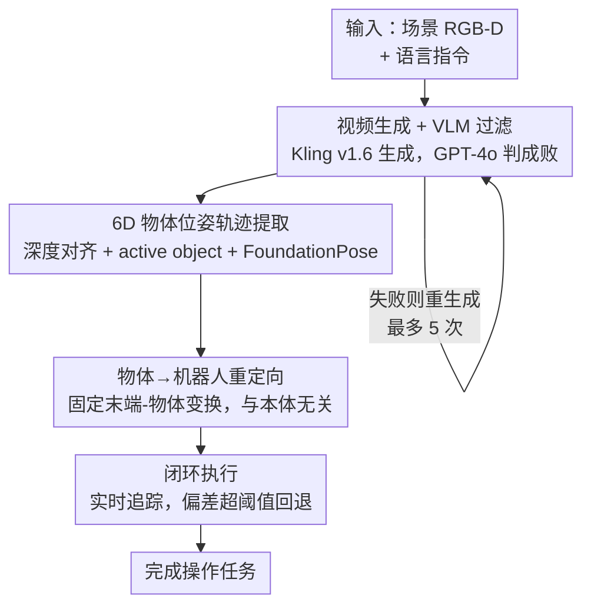

# Robotic Manipulation by Imitating Generated Videos Without Physical Demonstrations

**会议**: ICLR 2026  
**OpenReview**: [https://openreview.net/forum?id=tv0Sz8A9Tc](https://openreview.net/forum?id=tv0Sz8A9Tc)  
**论文**: [项目页 rigvid-robot.github.io](https://rigvid-robot.github.io/)  
**代码**: 见项目页  
**领域**: 机器人 / 具身智能  
**关键词**: 机器人操作, 视频生成, 模仿学习, 6D 位姿追踪, 零示范

## 一句话总结
RIGVid 让机器人仅靠"AI 生成的视频"完成倒水、扫垃圾等操作任务——给定语言指令和场景图，用视频扩散模型生成示范视频、用 VLM 过滤失败生成、再从视频里追踪物体的 6D 位姿轨迹并重定向到机械臂执行，全程不需要任何真实示范或机器人训练数据，效果与真人示范视频持平。

## 研究背景与动机

**领域现状**：用视频监督机器人操作主要有两条路——一是从大规模真实视频数据集里学 affordance（接触点、运动轨迹），二是模仿在受控条件下采集的、与执行环境高度对齐的特定示范视频。

**现有痛点**：大规模数据集存在 domain gap，且要针对具体机器人本体和任务做适配；而专门采集示范视频则需要繁琐的数据收集，必须保证视角、形态、交互方式都和目标任务严格匹配。两条路都依赖"真实数据"这个瓶颈，难以大规模部署。

**核心矛盾**：视频生成模型（SORA、Kling）已经能从语言+图像生成逼真视频，理论上可以"按需生成"恰好匹配当前场景和任务的示范——但生成视频常有几何畸变、物理不合理的交互、不真实的场景动态，使得"生成的视频能不能真的当监督用"始终没被令人信服地证明。先前把视频生成引入机器人的工作也都还依赖额外监督（任务特定训练、或在离线机器人轨迹上微调）。

**本文目标**：能否让单个生成视频——生成时就精确匹配输入环境和任务描述——成为机器人操作的**唯一**监督来源，不需要任何额外监督或任务特定训练？

**切入角度**：作者观察到生成视频的不可靠是可以"事后筛掉"的——VLM 能高精度判断一段生成视频是否成功执行了指令；同时，与其去预测稀疏的高层抽象（如关键点约束），不如保留视频的稠密像素信息，再用强 6D 位姿追踪把物体运动精确抽出来。

**核心 idea**：生成视频 → VLM 过滤 → 追踪物体 6D 位姿轨迹 → 以"物体为中心、与本体无关"的方式重定向到机械臂，把"生成视频"直接变成"可执行轨迹"。

## 方法详解

### 整体框架

RIGVid（Robots Imitating Generated Videos）输入是初始场景的 RGB 图、对应深度图、一条自由形式的语言指令（如"pour water on the plant"），输出是机器人末端执行器的 6DoF 轨迹。整条流水线把"语言+图像"逐级转化为"可执行轨迹"：先用视频扩散模型生成候选示范视频并用 VLM 把不跟随指令的生成筛掉；再对通过的视频逐帧估计深度、定位被操作物体、用 6D 位姿追踪器抽出物体的位姿轨迹；最后把物体轨迹重定向成末端执行器轨迹，抓取物体后闭环执行——执行过程中实时追踪物体位姿、遇到扰动会回退重试。

### 关键设计

**1. 视频生成 + VLM 自动过滤：把"不可靠的生成"变成"可用的监督"**

直接拿生成视频当监督的最大障碍是：生成视频经常不跟随指令（物体没动、水从壶顶而非壶嘴倒出、甚至换了物体或视角）。作者的解法是用 GPT-4o 做自动过滤——把视频里均匀采样的 4 帧竖直拼成一张"视频摘要图"喂给 VLM，让它判断指令描述的动作是否被一只可见的手成功执行；若判为失败就重新生成，最多重试 5 次，全失败则用最后一次。这个过滤之所以关键，是因为它把"生成质量不稳定"这个根本问题转化成了"事后筛选"，而 VLM 的错误几乎都是 false negative（偶尔丢掉本可用的视频），几乎从不把错误视频放行。作者还验证了用 GPT o1 查询与人工判断的 Pearson 相关系数高达 $0.84$（平均），远超 VBench++ 里的 video-text consistency（$0.34$）和 I2V subject consistency（$0.37$）这类自动指标，说明现成的视频质量度量不适合做过滤、必须用 VLM 的语义判断。生成器本身选 Kling v1.6（指令跟随和物理合理性最好），Sora 因频繁改变布局/物体而几乎不可用。

**2. 6D 物体位姿轨迹提取：用稠密追踪而非稀疏抽象保住执行所需的细节**

通过过滤的视频要被转成精确的物体运动。这一步先用 Ke et al. 的单目深度估计器逐帧预测深度，但预测深度只有 scale-shift 意义下的相对值（存在尺度-偏移歧义），作者用首帧预测深度与真实深度图在活动物体附近对齐，求一个仿射 scale-and-shift 变换，再施加到整段视频上，把深度锚定到真实世界单位。接着定位 active object：用 GPT-4o 从初始图+指令里推断最可能被操作的物体类别，用 Grounding DINO 框出来、再用 SAM-2 细化成分割掩码。有了掩码和带尺度的深度，就用 FoundationPose 追踪器在整段视频上追物体的 6D 位姿（追踪器需要物体网格，用 BundleSDF 从一段绕物体旋转拍摄的 RGBD 短视频预先重建；附录也验证了 mesh-free 方案可行但当前推理速度无法实时）。之所以坚持抽 6D 位姿而非更紧凑的表示，是因为后文实验证明：相比 VLM 预测关键点约束、或稀疏点追踪/光流这类抽象，稠密追踪出的结构化 6D 轨迹在物体旋转、遮挡、深度剧变时鲁棒得多。

**3. 物体→机器人重定向：抓住"物体-末端固定变换"实现跨本体迁移**

拿到物体轨迹后先抓取——用现成的 AnyGrasp 在物体掩码附近选最高分抓取并执行。抓住后做重定向：因为物体被牢牢抓住，可假设末端执行器与物体之间是固定刚体变换。这个变换由两个刚体变换复合得到——抓取瞬间物体相对夹爪的位姿、以及夹爪相对末端执行器的偏移。把这个固定的"末端→物体"变换施加到物体轨迹的每个位姿上，就得到末端执行器轨迹，保证机器人末端跟随物体运动同时维持稳定抓取。这个设计的妙处在于它天然 robot-agnostic：换一台机器人或夹爪，只需更新"末端→物体"这一个变换来反映新的末端配置，物体轨迹本身完全不用动，因而方法可以轻松跨平台迁移。

**4. 闭环执行：实时追踪 + 偏差回退保证抗扰动**

把轨迹一次性开环执行很脆弱。RIGVid 在部署时用 FoundationPose 持续实时追踪物体 6D 位姿来更新末端轨迹：若物体因外部扰动（人推机器人、抓取后滑动）偏离了预计算轨迹，系统通过比较当前物体位姿与预计算轨迹检测出偏差；一旦偏差超过位置 $3\text{cm}$ 或姿态 $20°$ 的阈值，机器人就回退到上一个成功执行的轨迹点、从那里重新执行。这个恢复机制让方法在扰动下仍能重新对齐并完成任务，是把"静态生成轨迹"用到真实物理世界里的关键补丁。

## 实验关键数据

在 xArm7 机械臂 + Orbbec Femto Bolt 相机上，评测四个日常操作任务：倒水、掀锅盖、放锅铲、扫垃圾（涵盖深度变化、细长/部分遮挡物体等多样挑战）。

### 主实验

| 对比维度 | 配置 | 平均成功率 | 说明 |
|--------|------|-----------|------|
| vs VLM 抽象 | RIGVid | **85%** | 四任务平均 |
| vs VLM 抽象 | ReKep（VLM 关键点约束） | 50% | 关键点预测不准导致失败 |
| 轨迹提取方式 | RIGVid（6D 物体位姿） | **85.0%** | 本文 |
| 轨迹提取方式 | Gen2Act（生成目标+点追踪） | 67.5% | 大遮挡/旋转时追踪点丢失 |
| 轨迹提取方式 | 4D-DPM（特征场） | 35.0% | 追踪不稳定 |
| 轨迹提取方式 | AVDC（光流） | 32.5% | 光流误差跨帧累积 |
| 轨迹提取方式 | Track2Act（点追踪） | 7.5% | 追踪网络泛化差 |

### 消融实验

| 配置 | 关键发现 | 说明 |
|------|---------|------|
| 过滤前→过滤后（Kling v1.6） | 倒水 80→100，掀盖 60→80，放铲 50→90，扫垃圾 20→70 | VLM 过滤大幅提升可靠性 |
| 生成质量递增 | Sora 0% → Kling v1.5 → Kling v1.6 最高 | 视频质量与成功率正相关 |
| 过滤后 Kling v1.6 vs 真人视频 | 基本持平 | 生成视频已可替代真实示范 |
| 过滤指标对比 | GPT o1 相关 0.84 > video-text 0.34 / I2V 0.37 | 只有 VLM 语义判断可靠 |

### 关键发现
- **过滤是性能放大器**：未过滤时 Sora 视频导致 0% 成功率；用 GPT-4o 过滤后 Kling v1.6 在最难的扫垃圾任务上从 20% 跃升到 70%，说明"生成+过滤"比单纯提升生成质量更划算。
- **6D 位姿追踪是鲁棒性来源**：任务越难（细长物体、严重遮挡、深度剧变），RIGVid 相对其他轨迹提取方法的优势越大——放铲和扫垃圾上比次优 baseline 高 20–25%；稠密 6D 轨迹比稀疏点/光流在遮挡下更稳。
- **失败几乎都来自深度估计**：用过滤后 Kling v1.6 时，除一次物体滑出夹爪外，所有失败都归因于深度估计误差导致的轨迹不准——而真人视频也有同样问题，说明瓶颈在深度模型本身而非生成视频。

## 亮点与洞察
- **"生成不可靠"被转化为"事后可筛"**：核心洞察是不去强求生成视频每次都对，而是承认它不可靠、用 VLM 高精度过滤，把问题从"提升生成质量"解耦成"筛选 + 追踪"，工程上立刻可落地。
- **保留稠密信息 vs 压缩成抽象**：作者反直觉地论证"生成完整视频像素"不是浪费——VLM 生成的紧凑抽象（关键点/约束）缺少执行所需的丰富细节，宁可付出更高计算代价换更可靠监督。
- **物体为中心 + 固定变换 = 跨本体**：把轨迹定义在物体上、机器人只需一个"末端→物体"变换，这个解耦让方法换机器人零成本迁移，是可复用到其他从视频学操作工作的设计。
- **生成模型进步直接转化为操作能力**：成功率随生成质量单调上升，意味着上游视频生成的每次进步都会自动提升机器人能力，是一个很有吸引力的"搭便车"趋势。

## 局限与展望
- **计算开销大**：视频生成本身计算成本高，是该范式最主要的缺点。
- **依赖预重建网格**：FoundationPose 需要预先用 BundleSDF 重建物体网格（要绕物体拍一段视频），限制在能预计算网格的场景；mesh-free 方案虽可行但当前推理速度无法实时。
- **受限于深度模型**：主要失败来自单目深度估计误差，方法精度被深度模型的天花板锁死。
- **任务/场景规模有限**：仅在四个桌面任务、固定初始配置下评测，更复杂的长程任务、多物体交互尚未验证。

## 相关工作与启发
- **vs ReKep（VLM 关键点约束）**: 它用 VLM 生成关系关键点约束再解 6D 轨迹，本文直接生成完整视频再抽 6D 位姿；区别在于稠密视频保留了执行所需细节，85% vs 50% 说明压缩成稀疏抽象会丢关键信息。
- **vs Gen2Act（生成目标+点追踪）**: 同样用生成视频，但它靠稀疏点追踪、遮挡/大旋转时点丢失导致追踪失败；本文用 6D 物体位姿追踪，在难任务上高 17.5%。
- **vs Liang et al.（追踪末端工具）**: 最相近的工作靠追踪机器人末端工具执行，但需要 1822 条真人采集的机器人示范、且只能做工具类任务；本文追踪物体、无需任何机器人数据，任务范围更广。
- **vs 大规模视频 affordance 学习（Bahl et al.）**: 它们从互联网视频学接触图/轨迹路点但有 domain gap；本文不预测 affordance，而是按需生成任务+场景特定的视频做模仿，绕开了 domain gap。

## 评分
- 新颖性: ⭐⭐⭐⭐⭐ 首次证明纯生成视频可作为机器人操作的唯一监督，范式清晰。
- 实验充分度: ⭐⭐⭐⭐ 真机四任务 + 多 baseline 横评充分，但任务数偏少、缺长程任务。
- 写作质量: ⭐⭐⭐⭐⭐ 动机、流水线、对比逻辑清楚，失败分析诚实。
- 价值: ⭐⭐⭐⭐⭐ 把"视频生成进步"直接接到"机器人能力"，无需数据收集，实用价值高。

<!-- RELATED:START -->

## 相关论文

- [\[CVPR 2026\] Spatial-Aware VLA Pretraining through Visual-Physical Alignment from Human Videos](../../CVPR2026/robotics/spatial-aware_vla_pretraining_through_visual-physical_alignment_from_human_video.md)
- [\[ICLR 2026\] MoMaGen: Generating Demonstrations under Soft and Hard Constraints for Multi-Step Bimanual Mobile Manipulation](momagen_generating_demonstrations_under_soft_and_hard_constraints_for_multi-step.md)
- [\[ICLR 2026\] When would Vision-Proprioception Policies Fail in Robotic Manipulation?](when_would_vision-proprioception_policies_fail_in_robotic_manipulation.md)
- [\[CVPR 2026\] AffordGen: Generating Diverse Demonstrations for Generalizable Object Manipulation with Affordance Correspondence](../../CVPR2026/robotics/affordgen_generating_diverse_demonstrations_for_generalizable_object_manipulatio.md)
- [\[ICLR 2026\] Actions as Language: Fine-Tuning VLMs into VLAs Without Catastrophic Forgetting](actions_as_language_fine-tuning_vlms_into_vlas_without_catastrophic_forgetting.md)

<!-- RELATED:END -->
