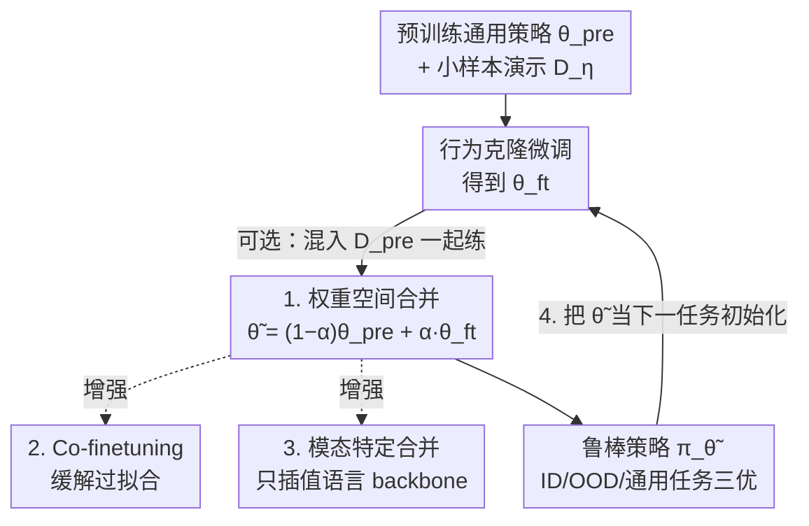

# Robust Finetuning of Vision-Language-Action Robot Policies via Parameter Merging

**会议**: ICLR 2026  
**OpenReview**: [https://openreview.net/forum?id=uWJwQ5SZoM](https://openreview.net/forum?id=uWJwQ5SZoM)  
**论文**: [Project Page](https://retain.yajatyadav.com)  
**代码**: 待开源（作者承诺评审期分享并公开）  
**领域**: 机器人 / 具身智能 / VLA / 模型合并  
**关键词**: VLA策略, 鲁棒微调, 权重插值, 模型合并, 持续学习

## 一句话总结
针对通用机器人策略在小样本微调时既丢失泛化能力又过拟合的问题，本文提出 RETAIN——直接在**权重空间**对微调前后的策略做线性插值，无需额外训练或推理开销，就能让单个策略既稳健完成新技能的各种变体（OOD），又保留预训练通用能力，真机 OOD 平均成功率比此前最好方法高约 40%。

## 研究背景与动机
**领域现状**：在大规模多样化机器人数据上训练出的通用策略（generalist policy，如 π0、π0-FAST-DROID）已经展现出跨场景、跨视角、跨物体、跨语言指令的强泛化能力。但要落到某个具体下游任务上，标准做法仍是用一小批该任务的示范数据（通常 < 100 条演示、几小时数据）对通用策略做行为克隆微调。

**现有痛点**：在这种「小数据微调」场景下，现有方法会严重过拟合到那一小撮演示——不仅丢掉了预训练得到的通用本领（在非目标任务上越练越差），而且连目标任务本身都泛化不了：演示里见过的布置能做到 70–80% 成功率（ID），但只要换个物体实例、挪个位置、改个背景或视角（OOD），成功率就掉到 30–50%。更糟的是练太久连 ID 都开始下降。

**核心矛盾**：通用能力与目标任务专精之间存在 trade-off。梯度下降微调会把权重整体拖向小数据集的拟合方向，而预训练模型里本就蕴含着完成 OOD 变体所需的泛化知识，却在微调中被覆盖掉了——问题不在于「没有泛化知识」，而在于「微调把已有的泛化知识洗掉了」。

**本文目标**：得到单个策略，既能把新技能稳健泛化到各种未见变体，又能保住预训练的广博本领；并进一步支持终身学习式地把多个技能依次「合并」进同一个 backbone。

**切入角度**：视觉/语言领域已有研究表明，对预训练和微调模型的权重做插值（model souping、task arithmetic）能提升对分布漂移的鲁棒性。作者把这个思路第一次搬到机器人 VLA 策略上，并针对机器人「多模态」「需要持续学习」的特性做适配。

**核心 idea**：不直接用微调后的策略，而是把**微调前的通用策略权重**与**微调后的策略权重**做线性插值，用一个合并系数 $\alpha$ 在「保留通用性」和「学会新任务」之间滑动取最优点。

## 方法详解

### 整体框架
RETAIN（Robust finE-tuning wiTh pArameter mergINg）的输入是一个预训练通用策略 $\pi_{\theta_{\text{pre}}}$ 和一小批目标任务演示 $D_\eta$，输出是一个合并后的策略 $\pi_{\tilde\theta}$。整条流程极其朴素：先用行为克隆把通用策略微调到目标任务得到 $\theta_{\text{ft}}$，再把 $\theta_{\text{pre}}$ 和 $\theta_{\text{ft}}$ 在权重空间按系数 $\alpha$ 线性插值，得到最终权重 $\tilde\theta$。在这条主干上，本文叠了三个可选增强：微调时混入预训练数据（co-finetuning）、按模态用不同系数合并（只动语言 backbone 即可）、以及把合并迭代起来实现多技能持续接入。

### 关键设计

**1. 权重空间线性插值：用一根滑杆调和通用性与专精**

这是 RETAIN 的全部核心，针对的就是「微调把预训练泛化知识洗掉」这个痛点。给定预训练权重 $\theta_{\text{pre}}$ 和微调后权重 $\theta_{\text{ft}}$，直接做线性插值得到最终权重：

$$\tilde\theta = (1-\alpha)\cdot\theta_{\text{pre}} + \alpha\cdot\theta_{\text{ft}}$$

其中 $\alpha\in[0,1]$ 是可调的合并系数：$\alpha=0$ 退化为预训练模型，$\alpha=1$ 退化为微调模型。妙处在于这一步不需要任何额外训练或推理开销——只是两组权重做一次加权平均。作者的分析（Fig.10）显示，OOD 性能关于 $\alpha$ 是个倒 U 形：合并模型只要别太偏向预训练端（否则缺乏任务知识、成功率近 0），在一个中间区间里就能同时拿到接近微调模型的 ID 表现、显著更好的 OOD 表现、以及几乎不掉的通用任务表现。换句话说，微调模型里「学会新任务」的方向和预训练模型里「会泛化」的方向在权重空间里可以靠插值同时保留，而不是非此即彼。$\alpha$ 的选法很轻量：用一个 OOD 场景当验证集挑系数（DROID 上只在 $\{0.25,0.5,0.75\}$ 里选），其余 OOD 场景直接套用、不再调参。

**2. Co-finetuning：让被插值的微调端本身先别过拟合**

光做合并已经有效，但插值的一端 $\theta_{\text{ft}}$ 如果是纯目标数据 task-FT 出来的，它已经重度过拟合，合并时即便拉回一部分预训练权重，也较难保住通用能力。针对这点，当预训练数据 $D_{\text{pre}}$（或其子集）可得时，作者在微调阶段就把 $D_\eta$ 和 $D_{\text{pre}}$ 混着练，记为 RETAIN-co-FT。作者的解释很到位：co-finetuning 和 model merging 在正则化里扮演**互补**角色——co-finetuning 靠持续在预训练数据上训练，防止微调端过度拟合小目标集，但它并不主动「调用」预训练知识来帮新任务泛化；而权重合并恰恰是显式地把预训练知识在参数空间里拉回来和微调知识融合。两者叠加后，RETAIN-co-FT 在通用评测上几乎总优于 RETAIN-task-FT，OOD 上多数任务也更好。

**3. 模态特定合并：其实只需要合并语言 backbone**

机器人 VLA 是天然多模态的：视觉编码器 $v$、语言模型 backbone $l$、动作专家 $a$ 三部分。本文把单一 $\alpha$ 拆成按模态各自的系数：

$$\begin{bmatrix}\tilde\theta_v\\ \tilde\theta_l\\ \tilde\theta_a\end{bmatrix} = \left(1-\begin{bmatrix}\alpha_v\\ \alpha_l\\ \alpha_a\end{bmatrix}\right)\odot\begin{bmatrix}\theta_{\text{pre},v}\\ \theta_{\text{pre},l}\\ \theta_{\text{pre},a}\end{bmatrix} + \begin{bmatrix}\alpha_v\\ \alpha_l\\ \alpha_a\end{bmatrix}\odot\begin{bmatrix}\theta_{\text{ft},v}\\ \theta_{\text{ft},l}\\ \theta_{\text{ft},a}\end{bmatrix}$$

对 $\alpha_v,\alpha_l,\alpha_a$ 做网格搜索后有个相当反直觉的发现：OOD 性能对 $\alpha_l$（语言）最敏感（在该方向色彩梯度最大，最优在 $\alpha_l=0.8$），而 $\alpha_v$ 和 $\alpha_a$ 越靠近 1（即直接用微调权重）越好，最优是 $\alpha_v=\alpha_a=1$。这意味着合并时**只需要插值语言模型 backbone**（$\alpha_l<1$），视觉编码器和动作专家直接保留微调后的值即可。对照实验证实「只合并语言参数」与「合并全部参数」性能几乎一致，说明泛化与鲁棒性的「来源」主要落在语言 backbone 上。

**4. 持续合并：把合并迭代起来，依次接入多技能**

既然 RETAIN 能保住预训练分布上的通用能力，那它天然适合做持续学习：把上一阶段的合并结果当作下一任务微调的初始化，迭代地把新技能「焊」进同一个 backbone：

$$\tilde\theta_n = (1-\alpha)\cdot\tilde\theta_{n-1} + \alpha\cdot\theta_{\text{ft},n},\quad n\in\{1,\dots,N\}$$

其中 $\theta_{\text{ft},n}$ 是在第 $n$ 个任务上微调得到的权重。与传统持续学习「主要防遗忘旧技能」不同，本文的诉求是把预训练模型的**泛化能力**继承并传递下去、从而稳健地学新任务。实验里依次学 plates→whiteboard，最终策略在两个任务的 ID/OOD 上都优于最强基线 co-FT。

### 损失函数 / 训练策略
微调端用标准行为克隆目标，对策略 $\pi_\theta$ 和演示集 $D$：

$$\mathcal{L}_{\text{BC}}(\theta;D) = -\frac{1}{|D|}\sum_{(s_t,a_t,T)\in D}\log\pi_\theta(a_t\mid s_t,T)$$

两种微调设定：task-FT（只在目标数据 $D_\eta$ 上练，适用于预训练数据不可得）与 co-FT（在 $D_\eta$ 与 $D_{\text{pre}}$ 混合数据上练）。合并系数 $\alpha$ 不参与训练，用一个 OOD 验证场景挑选后固定。预训练策略用 π0（flow-based 动作专家，用于 LIBERO）和 π0-FAST-DROID（自回归 next-token，用于真机 DROID）。

## 实验关键数据

### 主实验
评测在 5 个微调任务上展开：真机 DROID 两个（whiteboard 擦白板、plates 摆盘到沥水架，分别约 50/100 条演示），仿真 LIBERO 三个（pot-on-stove、mugs-on-plates、items-into-basket，每任务约 45 条演示）。每个任务在三类场景上评测：ID（演示同分布）、OOD（换物体/位置/背景/光照/视角）、Generalist（预训练分布下的其他任务，DROID 用 44 个真机任务、LIBERO 用 20 个任务）。

| 设定 | 评测场景 | 基线微调方法 | RETAIN | 说明 |
|------|----------|--------------|--------|------|
| DROID 真机 | OOD (test) | 30–50% | plates >60% / whiteboard 近 80% | OOD 平均比最优基线高约 40% |
| DROID 真机 | ID | 70–80% | 与基线相当 | 不牺牲 ID 拟合 |
| DROID 真机 | Generalist | 显著下降 | 与预训练模型持平 | 几乎不丢通用能力 |
| LIBERO 仿真 | ID | 近满分 | 近满分 | 仿真任务较易 |
| LIBERO 仿真 | OOD | 较低 | 优于基线（增益小于 DROID） | 增益小归因于 base 通用性弱 |

对比的基线包括：Task-FT、Co-FT、LoRA、Freeze-FT（冻结语言 backbone 只更新视觉编码器/动作头）、Scratch（从零训练）。RETAIN-task-FT 与 RETAIN-co-FT 在 OOD 上均大幅领先，其中 whiteboard 上 OOD 几乎追平 ID，说明合并后的新技能「无视场景变化都能完成」。

### 消融实验

| 配置 | 关键发现 | 说明 |
|------|---------|------|
| 合并系数 $\alpha$ 扫描 | OOD 关于 $\alpha$ 呈倒 U 形 | 太偏预训练端 → 缺任务知识、成功率近 0 |
| RETAIN-co-FT vs RETAIN-task-FT | co-FT 在 Generalist 几乎总更好，OOD 多数更好 | 合并与 co-FT 正则化互补 |
| 模态系数网格 ($\alpha_v,\alpha_l,\alpha_a$) | $\alpha_l$ 影响最大，最优 $\alpha_l=0.8$；$\alpha_v=\alpha_a=1$ 最好 | 只需合并语言 backbone |
| 只合并语言参数 vs 全部参数 | 性能几乎一致 | 泛化来源集中在语言 backbone |
| 预训练数据量（20k / 76k / 全量+PI） | 数据越多 OOD 增益越大 | RETAIN 随预训练数据扩展 |
| 持续学习 plates→whiteboard | 两任务 ID/OOD 均优于 co-FT | 顺序合并不丢前序技能 |

### 关键发现
- **泛化「来源」可定位到语言 backbone**：模态网格搜索揭示 OOD 性能对 $\alpha_l$ 最敏感，视觉/动作直接用微调权重最好——这把「合并为何有效」收窄到了语言模型参数上，也大幅简化了实际使用（只调一个 $\alpha_l$）。
- **预训练越通用，合并收益越大**：用三种不同数据量的 DROID 预训练策略做对照，OOD 增益随预训练数据单调上升；LIBERO 上增益小于 DROID，作者明确归因于 LIBERO base 模型本身缺乏通用能力——合并是「搬运」预训练泛化知识，base 越强搬得越多。
- **合并与 co-finetuning 不是替代而是叠加**：co-FT 防过拟合但不主动调用预训练知识，合并显式把预训练知识拉回参数空间，二者机制互补，叠加后通用评测几乎总更好。

## 亮点与洞察
- **零额外开销的鲁棒微调**：核心方法就是两组权重做一次加权平均，无需改训练流程、无推理代价，却能把真机 OOD 成功率平均拉高约 40%——「简单到令人意外」却扎实有效，是非常容易复现和落地的 trick。
- **把「泛化能力」当作可在权重空间搬运的资产**：本文最「啊哈」之处是揭示预训练策略的泛化本领是可以靠插值「继承并传递」的，而不是微调必然要牺牲的代价；这把 vision/language 的 model souping 直觉首次系统验证到了机器人 VLA 上。
- **模态特定合并的可迁移性**：「只合并语言 backbone」这一发现可迁移到任何 VLA 微调场景——把昂贵的多模态合并调参缩成调一个语言系数，对工程实践极友好。
- **合并即持续学习**：把合并迭代起来就成了终身学习接口，依次「焊」入新技能而不丢旧能力，思路可迁移到其他需要增量接入技能的 foundation policy。

## 局限与展望
- **缺乏机制解释**：作者坦承并不完全理解「为什么权重合并能带来如此强的泛化」，只在附录给了一些假设，理论层面是开放问题。
- **仍需调一个超参 $\alpha$**：虽然真机上对 $\alpha$ 较鲁棒，但仍需轻量调参；如何给出一个无需验证场景的启发式选系数规则，是明确的未来方向。
- **依赖强通用 base 模型**：实验已显示 base 通用性弱（如 LIBERO）时增益明显变小，方法本质是「搬运」预训练泛化，对底座质量有依赖；在通用性差的预训练模型上收益有限。
- **OOD 评测范围**：合并系数用一个 OOD 场景调、其余 OOD 场景套用，泛化结论建立在所测的几类变体（物体/位置/背景/光照/视角）上，对更剧烈的分布漂移是否成立有待验证。

## 相关工作与启发
- **vs 标准 Task-FT / Co-FT**: 它们直接用微调后权重，在小数据下重度过拟合、OOD 掉到 30–50%；RETAIN 在它们之上加一步权重插值，把预训练泛化知识拉回来，OOD 大幅提升且不牺牲 ID。
- **vs LoRA / Freeze-FT**: 这些靠限制可训练参数来「保留」预训练能力，但约束过强反而难以充分适应新任务（whiteboard 上 ID 略差）；RETAIN 不限制微调、而是在事后于权重空间调和，灵活性更高。
- **vs 视觉/语言的 model merging（model soups、task arithmetic）**: 那些工作在单模态 vision/language 上插值预训练与微调模型以提升鲁棒性；本文首次把它用到多模态 VLA 机器人策略，并发现「只需合并语言 backbone」、且把它扩展为持续技能合并。
- **vs 传统持续学习（EWC 等防遗忘方法）**: 传统方法聚焦「不忘旧技能」；RETAIN 的目标是继承并传递预训练模型的**泛化能力**来稳健学新任务，出发点不同，且实现上只靠迭代权重插值，无需复杂正则。

## 评分
- 新颖性: ⭐⭐⭐⭐ 方法本身是 vision/language 已知技巧的迁移，但首次系统验证到 VLA 机器人策略、并给出「只合并语言 backbone」「随预训练数据扩展」「迭代即持续学习」等有价值的新洞察。
- 实验充分度: ⭐⭐⭐⭐⭐ 真机 DROID + 仿真 LIBERO 共 5 任务、三类评测、5 个基线，外加 $\alpha$ 扫描、模态网格、数据规模、持续学习等完整消融。
- 写作质量: ⭐⭐⭐⭐ 问题动机清晰、机制分析（互补正则化、泛化来源定位）讲得透彻；个别公式排版有 OCR 残留。
- 价值: ⭐⭐⭐⭐⭐ 零额外开销、极易复现、真机 OOD 平均 +40%，对通用机器人策略的实际部署有直接价值。

<!-- RELATED:START -->

## 相关论文

- [\[CVPR 2026\] Boosting Vision-Language-Action Finetuning with Feasible Action Neighborhood Prior](../../CVPR2026/robotics/boosting_vision-language-action_finetuning_with_feasible_action_neighborhood_pri.md)
- [\[CVPR 2026\] MergeVLA: Cross-Skill Model Merging Toward a Generalist Vision-Language-Action Agent](../../CVPR2026/robotics/mergevla_cross-skill_model_merging_toward_a_generalist_vision-language-action_ag.md)
- [\[ICLR 2026\] VLM4VLA: Revisiting Vision-Language-Models in Vision-Language-Action Models](vlm4vla_revisiting_vision-language-models_in_vision-language-action_models.md)
- [\[ICLR 2026\] UniVLA: Unified Vision-Language-Action Model](unified_vision-language-action_model.md)
- [\[ICLR 2026\] Hybrid Training for Vision-Language-Action Models](hybrid_training_for_vision-language-action_models.md)

<!-- RELATED:END -->
