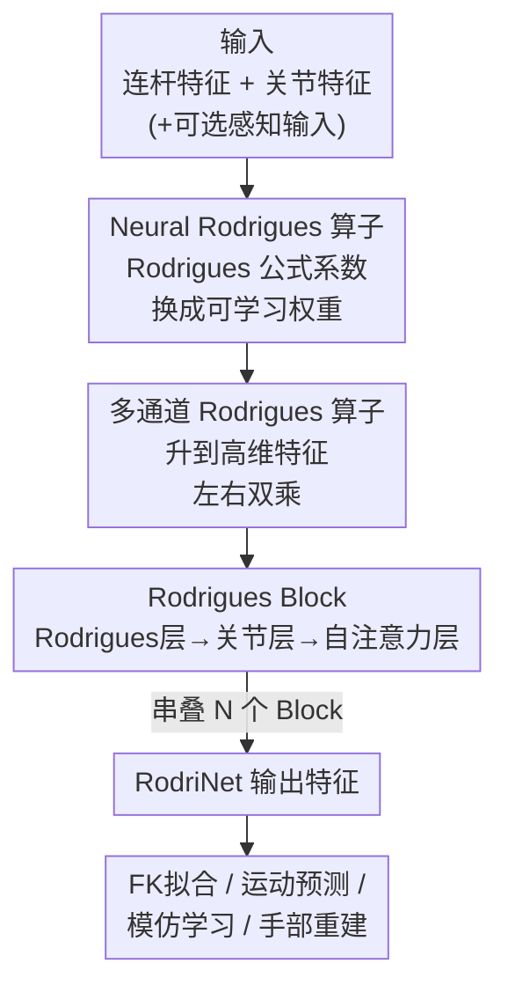

# Rodrigues Network for Learning Robot Actions

**会议**: ICLR 2026  
**OpenReview**: [https://openreview.net/forum?id=IZHk6BXBST](https://openreview.net/forum?id=IZHk6BXBST)  
**代码**: 无  
**领域**: 机器人 / 具身智能 / 神经网络架构  
**关键词**: 关节式机器人, 正向运动学, 归纳偏置, Rodrigues 旋转公式, 模仿学习

## 一句话总结
本文把经典控制里的 Rodrigues 旋转公式改造成可学习算子（Neural Rodrigues Operator），再以它为核心搭出一套显式编码关节运动学结构的网络 RodriNet，在正向运动学拟合、运动预测、机械臂模仿学习和单图手部重建四类任务上都明显超过 MLP / GCN / Transformer 等通用骨干。

## 研究背景与动机
**领域现状**：关节式系统（机械臂、灵巧手、四足、人形机器人，乃至动画角色、人手）的"动作"——位姿、运动、控制指令——本质上都是挂在各个关节上的一组数值，天然带有运动学树结构。但现在主流的动作学习网络大多直接搬运视觉/语言领域的 MLP 和 Transformer，把动作当成一堆无结构的 token 来处理。

**现有痛点**：MLP 和 Transformer 完全不知道关节之间的运动学关系，缺少反映关节结构的归纳偏置。一些工作尝试用图卷积（按机器人连杆的连通性）或带掩码的注意力来引入结构先验，但这些做法只刻画了"哪些连杆相邻"这种拓扑连通性，并没有把"关节角度如何通过旋转驱动子连杆运动"这一**运动学计算模式**本身嵌进网络。

**核心矛盾**：把解析正向运动学（FK）直接当成可微层插进网络（如 Villegas 等）虽然引入了运动学感知，但会把模型死死约束在固定的 FK 计算上，丧失了学习高层特征的灵活性；而只在网络输出后加 Cartesian-space 损失的做法又不改架构、与本文目标正交。如何既保留运动学结构先验、又不牺牲表达灵活性，是个尚未解决的矛盾。

**本文目标**：设计一种网络架构，把关节运动学作为归纳偏置嵌进神经计算本身，同时保持表达能力。

**切入角度**：作者类比了 CNN 之于图像。低层图像特征局部且平移等变，经典视觉用手工滤波器（Canny 边缘、Harris 角点）来利用这种结构；CNN 则把滤波器变成可学习、加非线性、上高维通道，从而既保留经典滤波器的结构性质又能学语义特征。作者认为，运动学里也存在这样一个"基础滤波器"——Rodrigues 旋转公式正是关节式 FK 的核心算子。

**核心 idea**：把 Rodrigues 旋转公式中只依赖结构的固定系数松弛成可学习权重、把关节角度泛化成抽象特征，得到一个"可学习的 FK 算子"，再用它像搭 CNN 一样搭出一个运动学感知的深度网络。

## 方法详解

### 整体框架
RodriNet 解决的问题是：给定挂在各关节/连杆上的动作特征（外加可选的感知输入），如何在显式利用关节运动学树结构的前提下做编码、理解与预测。整条管线的核心是一步步把"经典 Rodrigues 公式"升级成"深度网络模块"：先把单关节的 Rodrigues 旋转公式改成可学习的单通道算子，再扩展成多通道算子；以这个算子为零件构造 Rodrigues Block（含三层：连杆更新、关节更新、全局注意力）；最后把多个 Block 串叠成完整网络，下游接四类不同任务的头。

### 关键设计

**1. Neural Rodrigues 算子：把固定系数松弛成可学习权重**

痛点是直接把解析 FK 插进网络会锁死模型。作者的突破口在于对 Rodrigues 公式 $R(\hat\omega, \theta) = I_3 + \sin\theta\,[\hat\omega] + (1-\cos\theta)\,[\hat\omega]^2$ 的一个观察：它每个元素都是 $1$、$\cos\theta$、$\sin\theta$ 的线性组合，系数只由旋转轴 $\hat\omega$ 这种**与状态无关**的结构量决定。于是父连杆到子连杆的位姿变换 $P_{c_j} = P_{p_j}(T_j\tilde R(\hat\omega_j,\theta_j))$ 可以重写成

$$P_{c_j} = P_{p_j}(A_j + B_j\cos\theta_j + C_j\sin\theta_j)$$

其中 $A_j, B_j, C_j \in \mathbb{R}^{4\times4}$ 只依赖机器人结构。关键一步是把这三组固定系数矩阵换成可学习权重 $W^{bias}, W^{cos}, W^{sin}$，把标量关节角泛化成抽象关节特征 $\Theta$，得到

$$F^{out} = F^{in}(W^{bias} + W^{cos}\cos\Theta + W^{sin}\sin\Theta)$$

这样设计之所以有效，在于它有"双重身份"：当 $\Theta=\theta_j$ 且权重恰好取真实系数时，算子退化成精确的 FK；而权重一旦可学，它就张成一个比 FK 更大的函数空间，能编码超越关节角/连杆位姿的高层特征。既保住了运动学归纳偏置，又拿回了表达灵活性，正好化解前面那个矛盾。

**2. 多通道算子：从 1 维关节角升到高维特征并加入左右双乘**

单关节算子只作用在 1 维关节特征和 $4\times4$ 连杆特征上，表达力受限。作者把连杆特征扩成 $F\in\mathbb{R}^{C_L\times4\times4}$、关节特征扩成 $\Theta\in\mathbb{R}^{C_J}$，权重相应升成多通道张量，于是单关节的变换核变为

$$U[i,j] = W^{bias}[i,j] + \sum_{c=1}^{C_J}\Big(W^{cos}[i,j,c]\cos(\Theta[c]) + W^{sin}[i,j,c]\sin(\Theta[c])\Big)$$

输出再对输入通道求和聚合。为进一步增强表达力，作者又学一个共轭核 $\bar U$，让输入连杆特征同时被左乘和右乘：

$$F^{out}[j] = \sum_{i=1}^{C_L}\Big(F^{in}[i]\,U[i,j] + \bar U[i,j]\,F^{in}[i]\Big)$$

之所以要左右双乘，是因为旋转矩阵在齐次变换里既可能作为左作用（改变后续坐标系）也可能携带右侧上下文，单边乘法只覆盖一种作用形式；引入共轭核后算子能表达更对称、更丰富的变换组合。这个完整算子记为 $F^{out}=\text{Rodrigues}(F^{in}, W^*, \Theta)$，是后续所有层的基础零件。

**3. Rodrigues Block：连杆层、关节层、自注意力层三件套**

光有算子还不够，需要把它组织成在整棵运动学树上传播信息的模块。一个 Rodrigues Block 顺序跑三层。**Rodrigues 层**把多通道算子铺到整棵树：每个关节 $J_j$ 持有自己的 Rodrigues 核 $W^*_j$，用它把父连杆特征 $F^{in}_{p_j}$ 沿关节变换后加到子连杆上并归一化——$F^{out}_{c_j}=\text{LayerNorm}(F^{in}_{c_j}+\text{Rodrigues}(F^{in}_{p_j}, W^*_j, \Theta^{in}_j))$，本质是"关节→连杆"方向、沿运动学树的层级消息传递，只更新连杆特征。**关节层**反向走"连杆→关节"：每个关节取其子连杆特征，过一个关节专属的线性变换再加回自身——$\Theta^{out}_j=\text{Linear}_j(\text{Flatten}(F^{in}_{c_j}))+\Theta^{in}_j$，只更新关节特征。前两层都只利用相邻连杆/关节的空间局部性，信息流被限制在树上相邻节点，于是再加一层**自注意力层**：把每个连杆特征投影成 token，经多头自注意力让所有连杆（无视树上距离）直接交互，再投影回连杆空间。此外可选地引入一个**全局 token** $G$，只参与自注意力、用来承载与具体关节/连杆无关的任务级信息（如自由漂浮底座的位姿预测、夹爪开合输出）。把若干 Block 串叠就得到完整的 RodriNet，实现对关节结构的深层级推理。

### 一个完整示例
以 LEAP 灵巧手（16 关节、17 连杆、自由漂浮底座）拟合正向运动学为例：网络输入是配置 $(T, R, \theta)$，目标是预测全部 17 个连杆的位姿矩阵。信息先在 Rodrigues 层里从手掌根连杆沿运动学树一路传到指尖——每经过一个关节，就用该关节的可学习 Rodrigues 核结合当前关节角把父连杆特征旋转、累加到子连杆；关节层再把连杆侧累积的信息回灌到关节特征；自注意力层让远端的指尖连杆和掌根直接通信，修正长链累积误差。叠几个 Block 后，指尖位姿的预测误差比 MLP/GCN 显著更小——后者在指尖处误差累积明显，正是因为它们不懂"误差沿运动学链逐关节传播"这件事。

## 实验关键数据

### 主实验

正向运动学拟合（LEAP Hand，MSE↓）：仅用 Rodrigues 层堆出的网络精度远超所有通用骨干，且收敛更快、数据效率更高。

| 骨干 | MSE |
|------|------|
| MLP | 6.32e-04 |
| GCN | 5.07e-04 |
| BoT | 5.37e-06 |
| Transformer | 5.26e-06 |
| **Rodrigues (仅 Rodrigues 层)** | **2.82e-07** |

Cartesian 空间运动预测（UR5，trainset=$10^5$）：本文在所有指标上最优，其**测试 MSE 甚至低于所有基线的训练 MSE**，说明拟合更好且泛化更强、不过拟合。

| 骨干 | ErrorT (mm) | ErrorR (°) | Errorθ (°) | MSE (1e−6) |
|------|------|------|------|------|
| MLP | 3.49 | 0.46 | 0.17 | 22.52 |
| GCN | 3.55 | 0.48 | 0.17 | 18.52 |
| BoT | 2.92 | 0.46 | 0.15 | 15.72 |
| Transformer | 2.89 | 0.41 | 0.14 | 12.86 |
| **Rodrigues** | **1.21** | **0.16** | **0.06** | **2.56** |

### 模仿学习与手部重建

把 RodriNet 当 Diffusion Policy 的去噪骨干（约 17M 参数对齐），在 ManiSkill 5 个 Franka 操作任务上（成功率，5 seeds）：

| 方法 | PushCube | PickCube | StackCube | PegInsertion | PlugCharger | 平均 |
|------|------|------|------|------|------|------|
| Transformer-DP | 0.98 | 0.63 | 0.38 | 0.18 | 0.04 | 0.44 |
| UNet-DP | 1.00 | 0.85 | 0.37 | 0.56 | 0.13 | 0.58 |
| **Rodrigues-DP** | 1.00 | **0.94** | **0.44** | **0.58** | 0.10 | **0.61** |

单图 3D 手部重建（FreiHAND，基于 HaMeR 替换其 transformer）：在大幅减参（39.5M→10.7M）的同时超过 SOTA。

| 方法 | PA-MPJPE↓ | PA-MPVPE↓ | F@5↑ | F@15↑ |
|------|------|------|------|------|
| HaMeR | 6.0 | 5.7 | 0.785 | 0.990 |
| HaMeR (复现) | 6.2 | 5.9 | 0.774 | 0.989 |
| **Ours** | **5.9** | **5.6** | **0.793** | **0.991** |

### 关键发现
- **运动学归纳偏置在"网络是瓶颈"时收益最大**：PickCube/StackCube 这类纯几何控制任务提升明显（PickCube 0.85→0.94）；而 PegInsertionSide/PlugCharger 涉及复杂接触动力学、真正缺的是触觉/力反馈输入，换骨干提升有限——说明收益是任务相关的。
- **正向运动学拟合并非平凡任务**：MLP/GCN 在指尖处误差累积、产生可见伪影，印证了"运动学映射带空间和层级依赖"这一结构需要被显式建模。
- **结构先验同时带来数据效率**：在各种训练集规模下 Rodrigues 网络都稳定领先，且测试误差能压到基线训练误差之下，泛化优势明显。

## 亮点与洞察
- **把经典控制公式当"可学习滤波器"**：最漂亮的一步是认出 Rodrigues 公式里"状态相关项（$\cos\theta,\sin\theta$）× 结构相关系数"的线性结构，只把后者松弛成可学习权重。这套"识别经典算子→保留其结构骨架→放开系数学习"的思路，几乎是把 CNN 之于手工滤波器的故事在运动学领域重讲了一遍，迁移性很强。
- **退化保证给了它一个理论锚点**：算子在特定权重下能精确退化为真实 FK，意味着它的假设空间是 FK 的严格超集——网络"至少不会比解析 FK 差"，这比纯黑箱骨干更让人放心。
- **跨域通用性**：同一架构既能当机器人 Diffusion Policy 的去噪器，又能接到 MANO 手部重建上并大幅减参，说明它抓住的是"关节式系统"的共性而非某个机器人的特例，对动画/图形任务同样适用。

## 局限与展望
- **不建模连杆几何**：当前算子只编码关节运动学，没利用单个连杆的形状信息，在需要精细接触推理的任务上会吃亏。
- **只支持旋转关节**：Neural Rodrigues 算子目前限定在 1-DoF 旋转关节，平移（prismatic）关节还没纳入，限制了适用平台范围。
- **只验证了模仿学习**：机器人实验都在模仿学习设定下，没测强化学习等闭环场景，网络在闭环控制下的通用性还有待检验。
- 自己的观察：实验骨干对比里 Transformer 基线在接触密集任务（PlugCharger）上反而被本文小幅超过但绝对成功率都很低，更多反映环境缺传感输入，这类任务上换骨干的意义有限，结论需带 caveat。

## 相关工作与启发
- **vs 图卷积（GCN / ST-GCN / 动画骨架方法）**：它们用连杆连通性建图、捕捉拓扑邻接和空间局部性，但不显式包含关节运动学这一核心计算模式；本文直接从 FK 推导算子，把"旋转如何驱动子连杆"嵌进网络。
- **vs 带结构偏置的 Transformer（图位置编码 / 掩码注意力）**：这些只是给注意力加结构提示，没从根本上把自注意力改成适配运动学；本文保留标准自注意力只为网络容量，运动学归纳偏置全交给 Rodrigues 算子，分工更清晰。
- **vs 把解析 FK 插成可微层 / Cartesian 损失**：前者引入运动学感知却锁死灵活性，后者只改损失不改架构、与本文正交；本文的可学习算子在"运动学感知"和"学高层特征"之间取得了前两类方法都没拿到的平衡。

## 评分
- 新颖性: ⭐⭐⭐⭐⭐ 把经典 Rodrigues 公式系统地改造成可学习神经算子，是真正面向"动作"的架构创新而非又一个通用骨干的微调。
- 实验充分度: ⭐⭐⭐⭐ 覆盖合成 FK/运动、模仿学习、手部重建三大类四任务，跨域说服力强；但缺 RL 闭环和更大规模真机验证。
- 写作质量: ⭐⭐⭐⭐⭐ 用 CNN 类比把动机讲得极其顺，公式推导从经典 FK 到神经算子层层递进，可读性很高。
- 价值: ⭐⭐⭐⭐⭐ 提供了一类可复用的"运动学感知"模块，对机器人学习和图形手部/人体重建都有直接落地价值。

<!-- RELATED:START -->

## 相关论文

- [\[ICLR 2026\] ViPRA: Video Prediction for Robot Actions](vipra_video_prediction_for_robot_actions.md)
- [\[ICML 2026\] From Imagined Futures to Executable Actions: Mixture of Latent Actions for Robot Manipulation](../../ICML2026/robotics/from_imagined_futures_to_executable_actions_mixture_of_latent_actions_for_robot_.md)
- [\[ICLR 2026\] RAVEN: End-to-end Equivariant Robot Learning with RGB Cameras](raven_end-to-end_equivariant_robot_learning_with_rgb_cameras.md)
- [\[ICLR 2026\] DataMIL: Selecting Data for Robot Imitation Learning with Datamodels](datamil_selecting_data_for_robot_imitation_learning_with_datamodels.md)
- [\[ICLR 2026\] Cross-Embodiment Offline Reinforcement Learning for Heterogeneous Robot Datasets](cross-embodiment_offline_reinforcement_learning_for_heterogeneous_robot_datasets.md)

<!-- RELATED:END -->
