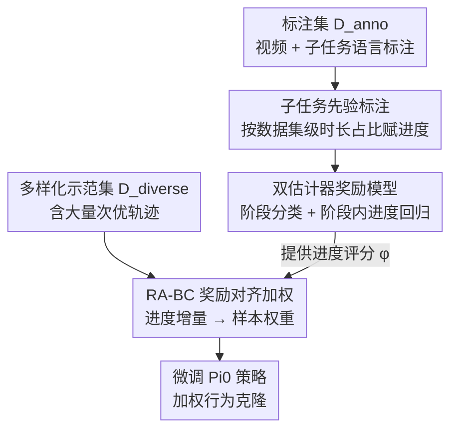

# SARM: Stage-Aware Reward Modeling for Long Horizon Robot Manipulation

**会议**: ICLR 2026  
**OpenReview**: [https://openreview.net/forum?id=aemqAxScl9](https://openreview.net/forum?id=aemqAxScl9)  
**论文**: [Project Website](https://qianzhong-chen.github.io/sarm.github.io/)  
**代码**: 无（仅项目主页）  
**领域**: 机器人 / 模仿学习 / 奖励建模  
**关键词**: 阶段感知奖励模型, 长程操作, 可变形物体, 模仿学习, 行为克隆

## 一句话总结
针对长程、接触密集的可变形物体操作（以叠 T 恤为例），本文提出 SARM——用自然语言子任务标注把"帧索引进度标签"换成"语义对齐的进度标签"，训练一个"阶段估计 + 子任务进度估计"的双估计器奖励模型，再用它驱动奖励对齐的行为克隆（RA-BC）对示范做软筛选与重加权，最终在真实机器人上把叠 T 恤成功率从香草 BC 的 8%/0% 提到 83%/67%。

## 研究背景与动机
**领域现状**：机器人行为模型（RBM，如 Diffusion Policy、ACT、Pi0）把视觉、动作、语言塞进一个框架，已经能完成不少复杂操作任务。主流提升路线是"堆数据"——把示范数据集做大。

**现有痛点**：在长程、接触密集、尤其涉及可变形物体（T 恤）的任务上，这些模型依然脆弱：几何随时间变化、遮挡严重、布料形态各异、多步规划不能出错。而堆数据的策略忽略了一个关键事实——**示范质量**比数据量更要命。专家示范昂贵稀少，大数据集里混着大量新手操作员产生的次优、噪声轨迹，且"质量"本身极难量化（它取决于动作连贯性、接触稳定性等隐藏因素，只能用任务时长这种粗糙代理来估）。

**核心矛盾**：要用奖励模型来衡量进度/质量，就得有可靠的进度标签；但长程可变形任务里，**用帧索引当进度标签会引入严重噪声**。同一个"已完全摊平的 T 恤"状态，因为前面摊平阶段花的动作数不同，帧索引算出来的进度可能从 0.2 到 0.8 乱跳——标签自相矛盾，奖励模型根本学不稳。而现有 VLM 类奖励模型又往往需要从初始帧处理整条轨迹来解时序依赖，计算/数据开销大、难扩展；纯目标距离类奖励在多阶段任务里又无法刻画中间进度。

**本文目标**：(1) 造一个对示范变异鲁棒、能泛化到分布外、对下游策略有用的进度奖励模型；(2) 用它把次优示范筛掉/降权，提升策略训练效果。

**切入角度**：人类天然会把"叠 T 恤"拆成抓取→摊平→对折→归位这样的**语义子任务**。如果按子任务的平均时长占比来分配进度，而不是按绝对帧索引，那么"摊平完成"这个语义状态在不同长度的轨迹里都会落到接近的进度值，标签就一致了。

**核心 idea**：用"语义子任务标注 + 数据集级时长先验"代替"帧索引"来生成一致的进度标签，并把奖励模型拆成"阶段分类 + 阶段内进度回归"两级，从而在变长示范上得到稳定奖励，再用这个奖励对行为克隆做软重加权。

## 方法详解

### 整体框架
SARM 的整条管线分三段：**(a) 数据处理**——把人工的子任务语言标注转成一致的逐帧进度标签；**(b) 奖励模型训练**——用这些标签训练一个"阶段估计器 + 子任务估计器"的双头奖励模型，输入任意一段 RGB 帧（加关节状态）就输出当前阶段和阶段内细粒度进度；**(c) 策略训练**——用学到的奖励模型给一个无标注的多样化示范集 $D_{\text{diverse}}$ 算"进度增量"，据此对行为克隆的每个样本软加权（RA-BC），微调 Pi0 策略。其中只有标注集 $D_{\text{anno}}$ 用来训奖励模型，海量带次优轨迹的 $D_{\text{diverse}}$ 用来训策略、不需要标注。

### 关键设计

**1. 子任务先验标注：用语义时长占比代替帧索引，消灭进度标签噪声**

这一步直接针对"帧索引标签自相矛盾"的痛点。标注者只看顶视视频，把每条轨迹按预先设计的协议切成 $K$ 个语义子任务，记下每段的起止帧（含严重失误段，含失误的轨迹直接剔除）。关键不是逐帧标，而是**用整个数据集统计每个子任务的平均时长占比作为先验**：对子任务 $k$，先验占比

$$\bar{\alpha}_k = \frac{1}{M}\sum_{i=1}^{M}\frac{L_{i,k}}{T_i}, \qquad \bar{\alpha}_k \ge 0,\ \sum_{k=1}^{K}\bar{\alpha}_k = 1,$$

其中 $M$ 是轨迹数、$L_{i,k}$ 是第 $i$ 条轨迹中子任务 $k$ 的长度、$T_i$ 是总长度。然后对落在子任务 $k$（局部起止 $[s_k,e_k]$）内的某帧 $t$，定义阶段内归一化时间 $\tau_t = \frac{t-s_k}{e_k-s_k}\in[0,1]$ 与累积先验 $P_k = \sum_{j=1}^{k}\bar{\alpha}_j$，逐帧进度目标为

$$y_t = P_{k-1} + \bar{\alpha}_k\,\tau_t \in [0,1],$$

满足 $y_{s_k}=P_{k-1}$、$y_{e_k}=P_k$。这样一来，"摊平完成"这个语义边界在任何长度的轨迹里都被钉死在同一个进度值 $P_k$ 上，阶段内再线性插值。相比直接拿帧索引归一化，它把"进度"绑定到语义里程碑而非流逝时间，从源头上让标签在变长示范间保持一致——这是整套方法稳定的根基。

**2. 双估计器架构：先粗分阶段、再在阶段内回归细粒度进度**

奖励模型不是一个回归头硬拟合 $[0,1]$，而是拆成共享骨干 + 两个任务头：**阶段模型**输出离散阶段上的概率分布（粗定位机器人到了哪一大步），**子任务模型**以阶段预测为条件、回归阶段内连续进度。两者串行：子任务头拿阶段嵌入当先验上下文来细化进度估计。输入管线为——(1) $N$ 帧图像过冻结的 CLIP 编码器得视觉嵌入；(2) 视觉嵌入与关节状态投影到 $d_{\text{model}}$ 维公共空间，**只给第一帧加显式位置偏置**以防绝对时间泄漏（沿用 ReWiND）；(3) Transformer 编码器聚合时序与跨模态交互；(4) 轻量 MLP 头融合后输出阶段 logits $\hat{\Psi}_{1:N}\in\mathbb{R}^{N\times k}$ 或标量进度 $\hat{\tau}_{1:N}\in[0,1]^N$。阶段经 softmax 得 $\Pi_{1:N}$，阶段预测 $\hat{S}_t=\arg\max_i \Pi_{1:N,i}$，最终进度按和标注同构的公式 $\hat{y}_{1:N}=\hat{P}_{k-1}+\bar{\alpha}_k\hat{\tau}_{1:N}$ 还原。这种"分类定阶段 + 回归补细节"的设计，比纯相似度判阶段（REDS 在子任务描述语义相近时会失灵）或纯目标距离（无法刻画中间进度）更可靠，也比一次性回归连续进度更抗变速轨迹。

**3. RA-BC 奖励对齐行为克隆：把进度增量翻译成示范样本的软权重**

有了可靠奖励，下一步是怎么用它来挑数据。标准 BC 对所有 $(o_i,a_i)$ 样本均匀加权 $L_{\text{BC}}=\frac{1}{N}\sum_i \ell(\pi_\theta(o_i),a_i)$，对次优轨迹一视同仁。RA-BC 把均匀先验换成**奖励对齐权重**：对每个样本取当前窗口和前进一个动作块后的下一窗口，用奖励模型的进度评分 $\phi(\cdot)\in[0,1]$ 算进度增量

$$\hat{r}_i = \phi(o_i^{t+\Delta}) - \phi(o_i^{t}),$$

它是"这一步预计推进多少"的标量信号。再把 $\hat{r}_i$ 映成权重 $w_i\in[0,1]$，最小化归一化加权目标

$$L_{\text{RA-BC}}(\theta) = \frac{\sum_i w_i\,\ell(\pi_\theta(o_i),a_i)}{\sum_i w_i + \varepsilon}.$$

权重不是拍脑袋设的：用 Welford 在线维护进度增量的均值 $\mu$、标准差 $\sigma$（并把 $\mu$ 截断到非负，避免早期把权重中心定在负进度上），用 $(\mu-2\sigma)$ 到 $(\mu+2\sigma)$ 的线性斜坡软映射 $\tilde{w}_i=\mathrm{clip}\!\big(\frac{\hat{r}_i-(\mu-2\sigma)}{4\sigma+\epsilon},0,1\big)$；再加一个阈值 $\kappa$ 做硬先验覆盖，让明显好/坏的样本权重果断：$w_i=\mathbb{1}_{\{\hat{r}_i>\kappa\}}+\mathbb{1}_{\{0\le\hat{r}_i\le\kappa\}}\tilde{w}_i$。它是 BC 损失的即插即用替换，软筛掉"不推进/倒退"的脏数据，又靠分母归一化维持训练稳定。和靠完整状态 + critic 的离线 RL 加权 BC 不同，RA-BC 只需一个预训练的视觉奖励模型就能在真实长程任务上给出稳健的 $K$ 步优势估计。

### 损失函数 / 训练策略
- 奖励模型：阶段头用分类损失（softmax over $k$ 个阶段），子任务头用进度回归损失（单步 MSE）；输入序列用"倒带帧增强"（rewind augmentation）提升对失败/倒退情形的鲁棒性。
- 策略：从开源 Pi0 微调，用 RA-BC 替换标准 BC 目标；权重统计在线更新（Welford），$\varepsilon,\epsilon>0$ 防除零、$\kappa$ 为硬先验阈值。

## 实验关键数据

### 主实验
奖励模型评测（叠 T 恤任务，70 条轨迹，进度归一到 $[0,1]$；Demo L 为验证集单步 MSE，Rollout ρ 为真实策略 rollout 上的分类得分 $\rho=\frac{\#\text{对}-\#\text{错}}{36}$）：

| 方法 | Demo L ↓ | Rollout ρ ↑ | 说明 |
|--------|---------|------------|------|
| GVL | 0.064 | -0.39 | VLM 打乱帧预测进度，过度悲观 |
| VLC | 0.083 | -0.33 | 单调排序微调，过度乐观 |
| LIV | 0.021 | 0.33 | EpicKitchens 预训练特征距离 |
| REDS | 0.036 | 0.16 | 阶段感知但半稀疏阶梯奖励 |
| VICtoR | 0.019 | 0.00 | 视觉-文本相似度判阶段，过度悲观 |
| ReWiND | 0.019 | 0.50 | 最强基线（倒带增强） |
| **SARM（完整双方案）** | **0.009** | **0.94** | 人类示范 >50%、rollout >80% 相对提升 |

⚠️ 表格各列与方法的对应关系据原文 Table 1 重排，个别数值以原文为准；核心结论（SARM rollout ρ 0.94 远超最强基线 ReWiND 0.50）文中明确支持。

策略学习（叠 T 恤成功率，每任务 12 次试验，越难越能看出差距）：

| 步数 | 难度 | BC-All ($D_{\text{all}}$) | BC-2min ($D_{\text{2min}}$) | RA-BC-ReWiND | RA-BC-SARM |
|------|------|------|------|------|------|
| 20K | Medium | 0/12 | 4/12 | 1/12 | **7/12** |
| 20K | Hard | 0/12 | 1/12 | 1/12 | **6/12** |
| 40K | Medium | 1/12 | 7/12 | 6/12 | **10/12 (83%)** |
| 40K | Hard | 0/12 | 0/12 | 3/12 | **8/12 (67%)** |

简单任务（抓取放置）所有方法都 12/12；难度一上来差距就拉开：香草 BC 在 hard 上基本 0，仅按时长过滤的 $D_{\text{2min}}$ 在 hard 上也归零（说明"按时长筛"无法强调"判断是否摊平到位"这种需要感知决策的示范）。

### 消融实验

| 配置 | Demo L ↓ | Rollout ρ ↑ | 说明 |
|------|---------|------------|------|
| SARM（完整） | 0.009 | 0.94 | 双方案（dense+sparse）联合训练 |
| 仅 Dense | 0.027 | 0.11 | 单方案，数据小不多样，分布外差 |
| 仅 Sparse | 0.013 | 0.78 | 单方案，覆盖广但标注粗 |
| w/o R（去倒带增强） | 0.008 | 0.67 | 人类示范几乎不受影响，rollout 大跌 |
| SARM (VB)（亮度扰动 ±0.3） | 0.015 | 0.78 | 验证对光照变化的鲁棒性 |

### 关键发现
- **奖励标签一致性是命门**：帧索引标签让"摊平完成"进度在 0.2–0.8 间乱跳，SARM 的子任务先验标注把它钉在固定值，是整套方法稳定的根。
- **倒带增强对真实 rollout 不可或缺**：去掉它后，人类示范评测几乎不变（示范本身单调、无故意失败），但真实 rollout 上模型变得"过度乐观"、识别不出倒退/失败，$\rho$ 从 0.94 掉到 0.67。
- **奖励模型质量直接决定 RA-BC 上限**：把 SARM 换成 ReWiND 奖励模型后，medium 从 83% 掉到 50%（退回到香草 BC + 时长过滤的水平）、hard 从 67% 掉到 25%——弱奖励会误判进度、误加权数据，使筛选失效。
- **双方案 > 单方案**：联合 dense（200 条，细标注）+ sparse（500 条，覆盖广）异构协议优于任一单方案，dense 单独训在分布外 rollout 上尤其差。

## 亮点与洞察
- **把"语言标注 → 时长占比先验 → 逐帧进度"做成可计算的标注流水线**：用极少的语义切分（只标子任务起止帧）撬动整条轨迹的一致进度标签，标注效率高且天然对变长鲁棒，这个"语义里程碑代替绝对时间"的思路可迁移到任何多阶段任务的进度估计。
- **奖励模型的"分类定阶段 + 回归补进度"两级结构**：比纯相似度/纯距离更能在子任务描述相近、轨迹变速时保持可靠，是把"粗定位 + 细估计"解耦的范例。
- **RA-BC 是 BC 的即插即用替换**：只改加权、不改架构，用在线 Welford 统计 + 线性斜坡 + 硬阈值把"预计推进多少"翻译成软权重，既软筛脏数据又靠归一化保稳，工程上很轻。
- **数据质量 > 数据量的实证**：200 小时大数据集香草 BC 在 hard 上 0%，按时长粗筛也 0%，唯有奖励对齐筛选能上 67%，给"堆数据"路线敲了警钟。

## 局限与展望
- **依赖人工子任务标注与协议设计**：每个任务都要先设计语义子任务划分协议、人工标注起止帧并剔除含失误轨迹，跨任务迁移仍需人介入。
- **主要在叠 T 恤 + 卸盘子两个真实任务上验证**，且策略实验集中在叠 T 恤；任务类别和本体（YAM 双臂 + GELLO 遥操）较窄，更广泛的可变形/接触任务上的普适性待验证。
- **时长占比先验假设子任务顺序固定**：协议要求轨迹包含完整子任务序列、否则丢弃，对乱序/可跳过子任务的任务不够灵活。
- **奖励模型质量是瓶颈**：实验已显示弱奖励会让 RA-BC 退化，如何在没有充分标注的新任务上快速得到足够好的奖励模型，是落地的关键缺口。
- RL 方向（用 SARM 奖励训 DiffQL）仅在 MuJoCo 仿真 pick-and-place 上初探（附录 A.8），真实 RL 尚未展开。

## 相关工作与启发
- **vs ReWiND**：都用倒带增强提升对失败的鲁棒性、都只给首帧位置偏置防时间泄漏；区别是 ReWiND 仍用帧索引类标签、单一进度回归，SARM 改用子任务先验标签 + 阶段/子任务双估计器，在人类示范上 >50%、真实 rollout 上 >80% 相对提升，且是本文 RA-BC 对照里最强的奖励模型基线。
- **vs REDS**：同为阶段感知奖励模型，但 REDS 学的是带单调正则的半稀疏阶梯奖励、靠图像-子任务嵌入相似度判阶段，轨迹变速或子任务描述相近时失灵；SARM 用专门的阶段估计网络 + 连续逐帧进度曲线，更稠密更准。
- **vs DrS**：DrS 纯状态、依赖完整模拟器状态当阶段指示、每阶段要单独训判别器，难扩展；SARM 是纯视觉的，无需特权状态。
- **vs 离线 RL 加权 BC（BAIL/CRR 等）**：它们用优势函数加权但假设有完整状态反馈和训好的 critic、未在真实视觉长程任务验证；RA-BC 只靠预训练视觉奖励模型给 $K$ 步优势估计，更贴近真实部署。

## 评分
- 新颖性: ⭐⭐⭐⭐ "子任务时长先验标注 + 阶段/子任务双估计器"组合解决了帧索引标签噪声这个具体痛点，切入点扎实。
- 实验充分度: ⭐⭐⭐⭐ 真实机器人 rollout + 人类验证 + 多基线 + 完整消融，但任务种类偏窄、策略实验集中在叠 T 恤。
- 写作质量: ⭐⭐⭐⭐ 动机链条清晰、公式完整；个别表格列序在 PDF 抽取下略乱。
- 价值: ⭐⭐⭐⭐ 给"数据质量 > 数据量"提供了可操作的奖励建模 + 软筛选范式，对长程可变形操作有实际意义。

<!-- RELATED:START -->

## 相关论文

- [\[ICLR 2026\] Compositional Diffusion with Guided Search for Long-Horizon Planning](compositional_diffusion_with_guided_search_for_long-horizon_planning.md)
- [\[AAAI 2026\] ManiLong-Shot: Interaction-Aware One-Shot Imitation Learning for Long-Horizon Manipulation](../../AAAI2026/robotics/manilong-shot_interaction-aware_one-shot_imitation_learning_for_long-horizon_man.md)
- [\[ICLR 2026\] CoNavBench: Collaborative Long-Horizon Vision-Language Navigation Benchmark](conavbench_collaborative_long-horizon_vision-language_navigation_benchmark.md)
- [\[AAAI 2026\] Actor-Critic for Continuous Action Chunks: A Reinforcement Learning Framework for Long-Horizon Robotic Manipulation with Sparse Reward](../../AAAI2026/robotics/actor-critic_for_continuous_action_chunks_a_reinforcement_le.md)
- [\[CVPR 2026\] AGiLe: Learning Robust Long-Horizon Manipulation via Affordance-Grounded Bidirectional Latent Planning](../../CVPR2026/robotics/agile_learning_robust_long-horizon_manipulation_via_affordance-grounded_bidirect.md)

<!-- RELATED:END -->
