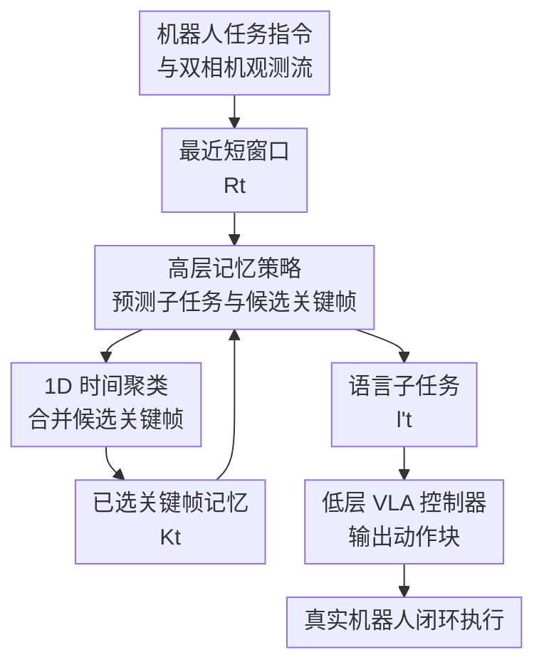

# Scaling up Memory for Robotic Control via Experience Retrieval

**会议**: ICLR 2026  
**OpenReview**: [https://openreview.net/forum?id=1dH4ARGdwD](https://openreview.net/forum?id=1dH4ARGdwD)  
**论文**: [Project Page](https://jen-pan.github.io/memer/)  
**代码**: 见项目页  
**领域**: 机器人控制 / 记忆检索  
**关键词**: 长程机器人操控、视觉记忆、关键帧检索、层级策略、VLA  

## 一句话总结
MemER 把长程机器人任务里的“记住过去”拆给一个高层 VLM 来做：它从最近观测中提名任务相关关键帧、用轻量时间聚类压成稳定视觉记忆，再把当前子任务交给低层 VLA 执行，从而在三类真实长程操控任务上接近人类高层策略表现。

## 研究背景与动机
**领域现状**：近两年的通用机器人策略越来越依赖 VLA 或层级 VLA：底层模型根据当前图像、语言指令和关节状态输出动作块，高层模型把复杂指令拆成更短的语言子任务。这类方法已经能处理不少开放指令和长程任务，但大多仍把“最近看见什么”当作全部上下文。

**现有痛点**：真实长程操控经常是部分可观测的。机器人找过哪个箱子、哪个物体原来放在哪层架子、已经舀了几勺，这些信息可能在几十秒甚至几分钟后才再次有用。如果只看当前帧，机器人会反复搜索或忘记进度；如果粗暴塞入很长的视频历史，VLM 推理会变慢，训练也更容易依赖专家轨迹中的偶然关联。

**核心矛盾**：机器人既需要跨分钟的视觉记忆，又不能把所有历史帧都放进上下文。全历史上下文带来计算和显存压力，简单均匀采样又会把大量无关视角、运动模糊和重复帧放进模型，真正有用的“看清某个箱子”“完成一次舀取”“物体原位置”反而可能被淹没。

**本文目标**：作者希望给现有 VLA 加一个可扩展的记忆层，让机器人能在闭环控制中持续决定哪些过去画面值得保留，并在后续规划子任务时重新取用这些经验，而底层动作控制仍沿用成熟的通用机器人策略。

**切入角度**：论文观察到，开源视频 VLM 已经有较强的视频理解先验，但未必会天然理解机器人任务里“什么帧值得记住”。因此，与其训练一个端到端长上下文动作模型，不如让高层 VLM 专门学习两个输出：当前低层子任务，以及最近上下文中应该进入记忆的候选关键帧。

**核心 idea**：用“高层 VLM 选择任务相关关键帧 + 轻量在线聚类合并重复提名”的方式，把长视频历史压缩成少量视觉经验记忆，再驱动低层 VLA 完成需要分钟级回忆的机器人控制。

## 方法详解

### 整体框架
MemER 是一个层级机器人控制框架。低层策略 $\pi_l$ 只负责根据当前图像、关节状态和高层给出的语言子任务输出动作块；高层策略 $\pi_h$ 则在较低频率上同时做两件事：根据最近 $N$ 帧和已保存关键帧预测当前子任务 $l'_t$，并从最近帧中提名候选关键帧 $J_t$ 作为未来记忆。

与“长历史直接拼进上下文”不同，MemER 不保留全部视频流，而是把高层策略反复提名的候选帧按时间位置聚类，每个簇只取一个代表帧，得到紧凑的选中关键帧集合 $K_t$。这样，高层模型每次推理看到的是“最近短窗口 + 少量跨长程关键记忆”，既能回忆远处状态，又不会让推理延迟随任务长度线性增长。

形式上，普通语言条件机器人策略常写成 $\pi_l(A_t\mid I_t,q_t,l'_t)$，其中 $A_t$ 是未来一小段动作块，$I_t$ 是多相机图像，$q_t$ 是本体感知状态，$l'_t$ 是当前子任务。MemER 的高层策略建模为 $\pi_h(l'_t,J_t\mid R_t,K_t)$，其中 $R_t=I_{t-N+1:t}$ 是最近短窗口，$K_t\subseteq I_{0:t-N+1}$ 是历史选中关键帧。

部署时，高层策略约 $1$ Hz 推理，低层策略约 $2$ Hz 推理，两者异步运行。低层在高层还没给出新子任务时继续使用最近一次子任务执行，避免高层 VLM 的推理延迟直接卡住动作控制。

### 关键设计
**1. 层级记忆策略：把“回忆什么”从低层动作控制里分离出来**

长程记忆最难的不是让机器人多看几帧，而是知道哪些过去观测会影响未来决策。MemER 因此让高层 VLM 处理语义层面的记忆与规划：它输入任务指令、最近双相机帧和已保存关键帧，输出低层可执行的语言子任务，同时提名最近帧中值得保存的候选关键帧。低层 $\pi_l$ 不需要理解几分钟前的历史，只需要执行“查看左侧箱子”“把花生舀到蓝碗”“擦拭上层架子”这类当前子任务。

这种分工利用了两个预训练模型的长处：Qwen2.5-VL-7B-Instruct 有视频理解和多模态语言推理先验，适合判断“这个画面是否值得记住”；$\pi0.5$ 在 DROID 机器人环境上有动作先验，适合做高频连续控制。论文也尝试过统一模型，但 $\pi0.5$ 缺少视频记忆推理能力，Qwen2.5-VL 同时学动作和记忆又不稳定，因此模块化层级设计是一个务实选择。

**2. 经验检索式视觉记忆：用关键帧保存任务相关过去而不是保存整段历史**

MemER 的记忆不是文本摘要，也不是固定频率视频采样，而是一组由高层策略选出来的视觉关键帧。每个时间步，高层只从最近 $N$ 帧里提名候选关键帧 $J_t$；后续推理会一直把已选关键帧 $K_t$ 重新喂给高层模型。这样，模型可以在寻找番茄时记住之前哪个箱子里出现过番茄，也可以在擦架子任务中记住物体原位置和哪层架子已经擦过。

关键在于这些帧由机器人任务监督出来，而不是由像素变化或视频压缩启发式选出。训练标注也没有逐帧人工打标签：作者取相邻子任务的边界帧，再为每个子任务制定一个简单规则，例如“查看某个箱子”的最后一帧、“完成一次舀取”的最后一帧、“擦完某层架子”的最后一帧是否保存。规则确定后自动应用到所有示范轨迹，所以标注成本接近一次性配置。

**3. 1D 时间聚类：把重复提名合并成稳定、低延迟的记忆集合**

如果高层每次提名的候选帧都直接保存，记忆仍会随着时间膨胀，而且同一事件附近会出现很多相似帧。MemER 的过滤器只看候选帧的时间索引，把所有候选索引汇总成有序列表 $G_{0:t}$，保留重复索引，然后用单链接规则把距离不超过 $d$ 的索引合成一个簇 $C_i$。每个簇选中位数索引作为代表帧，得到最终关键帧集合 $K_t$。

这个做法的好处是非常轻。它不需要额外多模态模型逐帧打分，也不需要对每帧做昂贵相似度计算；重复提名反而会通过中位数选择让代表帧更稳。比如候选索引为 $\{1,3,3,4,10\}$ 且 $d=5$ 时，前四个索引会被看成同一事件簇，另一个索引形成第二个簇，最终只保存两个代表帧。对闭环机器人而言，这种简单性很重要，因为高层策略必须维持接近 $1$ Hz 的节奏。

**4. 视觉记忆优先：避免文本子任务记忆盖过当前图像证据**

一个直觉替代方案是把已经执行过的子任务转成文本记忆，例如“刚才找过左箱子”“已经舀过一勺花生”。论文专门比较后发现，纯文本记忆和图文混合记忆都不如只用视觉关键帧稳定。原因是文本子任务往往不包含完整环境信息：在 Object Search 中，文本可以说明机器人正在找哪个目标，却不一定记录它顺路看见的其他物体；在 Counting 中，如果低层策略卡住或重试，文本进度很容易和真实环境不同步。

更微妙的是，给高层模型同时喂文本和图像记忆时，它可能过度依赖文本 token，从而忽略视觉关键帧里的细节。MemER 选择视觉关键帧作为主要记忆形式，是因为机器人任务里的“是否已经完成”“物体原来在哪”“箱子里还看见了什么”往往需要重新看画面来判断，而不是只读一个历史动作标签。

### 一个完整示例
以 Object Search 为例，机器人先被要求找 ketchup，但最开始不知道三个不透明箱子里分别有什么。MemER 的高层策略按照约定顺序让低层查看左箱、中心箱、右箱；每当腕部相机和外部相机看清一个箱子内部，高层会把该查看动作末尾的清晰画面提名为关键帧。过滤器把同一箱子查看过程中的多个候选帧合成一个代表帧，记忆里逐渐形成“左箱看到哪些物体、中心箱看到哪些物体、右箱看到哪些物体”的视觉经验。

当下一条指令变成寻找 tomato 时，机器人不需要重新从左箱开始。如果 tomato 已经在某个保存关键帧中出现，高层可以直接输出“从对应箱子取出 tomato 并放入白箱”的子任务；如果没出现，则继续探索尚未查看的箱子。这个流程的关键不是记住“我执行过查看左箱”这句话，而是保留能让模型重新识别箱内物体的视觉证据。

Counting Scoops 的记忆形态不同。每完成一次舀取，代表帧记录的是一次已经落入碗中的动作结果。后续高层根据这些关键帧判断已经完成了几勺，避免少舀或多舀。Dust & Replace 又需要同时记住两类信息：物体原来位于哪层架子，以及哪层架子已经擦过。MemER 用同一套关键帧机制处理这些不同记忆需求，说明它学到的是“什么时刻值得保留”，而不是某个任务专用状态机。

### 损失函数 / 训练策略
低层策略使用 $\pi0.5$ 的 DROID 预训练检查点，在三类任务的长程轨迹上微调，输入为当前图像 $I_t$、关节与夹爪状态 $q_t$、以及高层子任务 $l'_t$，输出动作块 $A_t$。作者只用约 50 条长程示范就能训练出较强低层策略，并额外加入 10-15 条 intervention demonstration，让机器人从常见失败状态回到训练分布。

高层策略微调 Qwen2.5-VL-7B-Instruct，监督目标同时包含当前子任务和候选关键帧位置。训练时冻结视觉编码器和投影层，只训练 LLM backbone，以保留视觉先验并降低训练成本。论文给出的高层训练配置包括学习率 $6\times10^{-5}$、AdamW、batch size 256、4500 个梯度步、约 96 H200 GPU 小时；低层策略学习率为 $2.5\times10^{-5}$、batch size 128、18000 步、约 48 H200 GPU 小时。

部署前，作者还把高层微调权重与基础 Qwen2.5-VL 权重线性插值：$\theta=(1-\alpha)\theta_{pre}+\alpha\theta_{ft}$，其中 $\alpha=0.8$。这个参数合并用于缓解高层模型只见过专家示范后的脆弱性，让它在低层策略冻结、重试、动作不够顺滑时仍保留基础模型的视频理解鲁棒性。

## 实验关键数据

### 主实验
论文在真实 Franka 机械臂平台上评估三类长程操控任务：Object Search、Counting Scoops、Dust & Replace。所有方法使用同一个低层策略，差异只在高层策略看到的历史上下文：No History 只看当前帧，Short History 看最近 8 帧，Long History 看最近 32 帧，MemER 看最近 8 帧加检索出来的关键帧，Human HL 由人类给高层子任务。

| 方法 | Object Search 进度 | Counting 进度 | Dust & Replace 进度 | 平均进度 |
|------|------------------:|--------------:|---------------------:|---------:|
| No History | 48% | 10% | 26% | 28% |
| Short History | 58% | 35% | 64% | 52% |
| Long History | 73% | 55% | 58% | 62% |
| MemER | 97% | 95% | 96% | 96% |
| Human HL | 97% | 100% | 91% | 96% |

更细的任务指标能看出 MemER 的优势来自真实记忆，而不是某个单一动作模块变强。Object Search 中，MemER 在 20 次试验里检索物体 59 次、最优路径 57 次，几乎等同人类高层的 58/58；Counting 中错误舀取数只有 1，而 Long History 仍有 12；Dust & Replace 中各子目标也接近满分。

| 方法 | 物体取回 ↑ | 最优路径 ↑ | 错误舀取 ↓ | 擦底层 ↑ | 擦顶层 ↑ | 复原底层物体 ↑ | 复原顶层物体 ↑ |
|------|----------:|-----------:|-----------:|---------:|---------:|---------------:|---------------:|
| MemER | 59 | 57 | 1 | 20 | 19 | 18 | 20 |
| No History | 32 | 25 | 61 | 5 | 4 | 5 | 7 |
| Short History | 38 | 31 | 26 | 14 | 14 | 11 | 12 |
| Long History | 47 | 41 | 12 | 11 | 11 | 12 | 12 |
| Human HL | 58 | 58 | 0 | 19 | 19 | 18 | 17 |

### 消融实验
论文重点比较了专有 API VLM、不同记忆模态、单任务/多任务训练以及推理成本。API VLM 部分是离线评估，因为 GPT-5 和 Gemini Robotics-ER 1.5 的高层延迟约 10-15 秒，无法按同样闭环部署。

| 对比项 | 结果 | 说明 |
|--------|------|------|
| GPT-5 高层离线轨迹准确率 | Object 0.15 / Counting 0.43 / Dust 0.67 | 强通用多模态模型仍不擅长机器人特定关键帧选择 |
| Gemini Robotics-ER 1.5 高层离线轨迹准确率 | Object 0.21 / Counting 0.13 / Dust 0.19 | 机器人专用 API 模型也无法零样本替代微调高层 |
| Short History + Text | Object 取回 40、最优路径 28、错误舀取 10 | 只存文本子任务会漏掉环境里顺路看到的物体和真实完成状态 |
| MemER + Text | Object 取回 59、最优路径 49、错误舀取 13 | 图文混合没有收益，Counting 明显退化 |
| 多任务 MemER 跨任务物体泛化 | 平均 82% | 高于单任务版本的 59%，说明它学到较通用的“记忆选择”能力 |
| MemER 推理成本 | 高层 0.787s、15.93GB VRAM | 8 最近帧 + 8 关键帧仍低于约 1Hz 部署阈值 |

### 关键发现
- MemER 的平均任务进度达到 96%，比 Long History 高 34 个百分点左右，说明“选关键帧”比“把最近上下文加长到 32 帧”更有效。
- 长上下文 baseline 有一定帮助，但 32 帧已经接近 1 秒高层推理延迟；继续扩大最近帧窗口时推理成本会快速超过闭环控制可接受范围。
- API VLM 不是简单替代方案。即使能看图和读任务，它们在机器人轨迹中的关键帧提名过多、过杂，导致子任务预测不准，且延迟过高。
- 视觉记忆优于文本记忆。机器人执行中会出现重试、冻结和非专家轨迹状态，文本子任务容易误导高层，而关键帧保留了可重新判断的环境证据。
- 多任务训练让高层更像在学习“什么状态值得保存”，而不是死记某个任务的物体集合或固定子任务顺序。

## 亮点与洞察
- MemER 的聪明之处在于不试图让 VLA 一口吃下全部长视频，而是把记忆变成一个高层可学习的选择问题。这个抽象非常适合机器人：真正长期有用的往往是少数状态转折帧，而不是连续视频本身。
- 1D 时间聚类看起来朴素，但很贴合闭环部署。它把语义选择交给 VLM，把冗余压缩交给简单算法，因此不会引入额外逐帧模型或复杂检索系统。
- 论文对文本记忆的负结果很有价值。很多 embodied agent 工作天然想把历史转成语言摘要，但这里显示，在需要重新识别物体、计数或判断完成状态时，视觉证据本身可能比文字更可靠。
- 层级设计也给现有 VLA 提供了一个可迁移接口：只要低层能执行语言子任务，高层记忆模块就可以接在不同 VLA 上，而不必重新训练一个巨大的长上下文动作模型。

## 局限与展望
- 记忆只会不断积累和聚合，尚没有显式遗忘机制。当前实验最多保存约 8 个关键帧，适合分钟级任务；如果扩展到小时级、多房间或多目标任务，就需要学习哪些记忆该删除或压缩。
- 高层关键帧标注仍依赖任务子任务规则。虽然成本低，但新增任务时需要人工判断哪些子任务边界值得保存，未来可以探索更自动化的记忆监督或强化学习式记忆管理。
- 实验集中在一个 Franka + 双相机场景，尚未验证跨机器人形态、移动操作、多房间空间导航与操作结合的泛化。
- 记忆模态目前只用视觉图像，没有触觉、音频或显式空间地图。对遮挡、接触状态、容器内部状态等任务，纯视觉关键帧可能仍不够。
- 高层和低层分开训练带来系统工程复杂度，需要两台 GPU 服务器异步运行。统一模型失败是合理发现，但更大规模 VLA 预训练也许能把关键帧预测和动作控制合并起来。

## 相关工作与启发
- **vs 长上下文机器人策略**: Torne et al. 和 Long-VLA 类方法尝试扩大策略历史上下文，本文则保存被高层认为任务相关的关键帧。区别在于 MemER 的推理成本主要随关键事件数量增长，而不是随视频长度直接增长。
- **vs SAM2Act / 带记忆视觉基础模型**: 这类方法把视觉记忆用于操控感知或短程历史扩展，MemER 更强调长程任务进度、物体位置和已完成动作的经验检索，且可接入语言子任务层级控制。
- **vs 视频 VQA 关键帧选择**: 视频理解里常用额外模型或 MLLM 调用为帧打分，但机器人闭环控制不能承受高 per-frame 成本。MemER 让高层策略在产生子任务时顺手提名关键帧，避免了额外检索模型。
- **vs 文本 episodic memory**: 文本记忆更紧凑也更可解释，但在机器人场景里可能丢失视觉细节或把失败轨迹写成错误进度。本文提示，具身记忆不一定应该先语言化，尤其当未来还需要重新观察证据时。

## 评分
- 新颖性: ⭐⭐⭐⭐☆ 把 VLM 关键帧选择、时间聚类和层级 VLA 控制组合得很自然，核心创新不复杂但击中了长程机器人记忆的真实瓶颈。
- 实验充分度: ⭐⭐⭐⭐☆ 三个真实机器人任务、多个强 baseline、模态和延迟分析都比较扎实；不足是机器人形态和任务场景仍偏集中。
- 写作质量: ⭐⭐⭐⭐☆ 论文结构清楚，任务设计能直接说明为什么需要记忆；附录也给出了训练配置、标注规则和失败尝试。
- 价值: ⭐⭐⭐⭐⭐ 对想把 VLA 推向真实长程任务的人很有参考价值，尤其是“视觉关键帧记忆优先于文本摘要”这个结论值得后续系统设计认真吸收。

<!-- RELATED:START -->

## 相关论文

- [\[ICLR 2026\] MemoryVLA: Perceptual-Cognitive Memory in Vision-Language-Action Models for Robotic Manipulation](memoryvla_perceptual-cognitive_memory_in_vision-language-action_models_for_robot.md)
- [\[ICML 2026\] Scaling by Diversified Experience for Vision-Language-Action Models](../../ICML2026/robotics/scaling_by_diversified_experience_for_vision-language-action_models.md)
- [\[ICLR 2026\] Masked Generative Policy for Robotic Control](masked_generative_policy_for_robotic_control.md)
- [\[ICLR 2026\] Experience-based Knowledge Correction for Robust Planning in Minecraft](experience-based_knowledge_correction_for_robust_planning_in_minecraft.md)
- [\[ICML 2026\] RoboMME: Benchmarking and Understanding Memory for Robotic Generalist Policies](../../ICML2026/robotics/robomme_benchmarking_and_understanding_memory_for_robotic_generalist_policies.md)

<!-- RELATED:END -->
