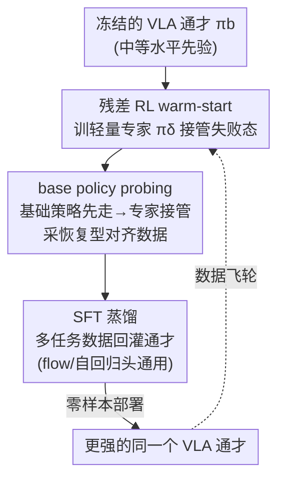

# Self-Improving Vision-Language-Action Models with Data Generation via Residual RL

**会议**: ICLR 2026  
**OpenReview**: [https://openreview.net/forum?id=eUGoqrZ6Ea](https://openreview.net/forum?id=eUGoqrZ6Ea)  
**代码**: 项目页 https://www.wenlixiao.com/self-improve-VLA-PLD  
**领域**: 机器人 / 具身智能 / VLA / 强化学习  
**关键词**: 视觉-语言-动作模型, 残差强化学习, 自改进, 数据生成, 监督微调

## 一句话总结
本文提出 **PLD（Probe-Learn-Distill）** 三阶段后训练框架：冻结 VLA 主干、用轻量残差 RL 在基础策略失败的状态上"接管"练出专家，再用"先让基础策略走几步、再让残差专家接管"的混合 rollout 自动采集与部署分布对齐的恢复数据，最后用标准 SFT 蒸馏回基础模型；无需任何额外人类示教，就在 LIBERO 上逼近 99% 成功率、SimplerEnv 提升 50%+，真机 Franka/YAM 任务 100% 成功并连续自主运行 1 小时。

## 研究背景与动机

**领域现状**：监督微调（SFT）已成为大型视觉-语言-动作（VLA）模型事实上的后训练范式——先在海量异构机器人/视觉-语言数据上预训练，再用少量针对目标任务的高质量遥操作示教 SFT，把通才模型特化到具体任务与本体上。这套从大语言模型借来的"预训练 + SFT"配方在 OpenVLA、π0 等模型上被广泛采用。

**现有痛点**：把语言领域的配方搬到机器人上有一个独特困难——高质量机器人示教既昂贵又费人力，难以规模化。更关键的是，遥操作采集管线与最终部署的 VLA 策略是**解耦**的：人类操作员凭经验去预判并纠正失败模式，但他们的示教很少能反映策略在部署时真正会遇到的状态分布。结果就是 SFT 能可靠提升训练任务上的表现，却说不清这些增益能否迁移到新任务、新环境。

**核心矛盾**：数据采集不应该"无视基础策略"。采数据的策略和被改进的通才必须交互，这样探索才能利用通才已有的先验知识、采到的数据才能与它的轨迹分布对齐。一个自然的实现思路是用 RL 训出任务专家来引导采数据，但直接上 RL 又撞上两道墙：① 语言条件操作任务**奖励稀疏**，RL 训练既不稳定又样本低效；② 脱离通才单独训专家会引入**分布失配**，且专家收敛后行为往往过于单一，缺乏 SFT 所需的状态覆盖多样性。

**本文目标**：让 VLA 用 RL 自动整理的数据自我改进，把人力降到最低，并且这种自整理训练在分布内、分布外都能匹配甚至超过基于人类专家（oracle）遥操作数据的微调。

**核心 idea**：用一个**冻结的 VLA 通才**当先验来 warm-start 探索，只训练一个轻量**残差高斯策略**去"接管"失败状态（既好训又不偏离基础行为太远）；采数据时刻意让基础策略先走、专家后接管，把数据钉在通才的部署分布附近并捕捉恢复行为；最后用普通 SFT 蒸馏回去——RL 生成的、与策略对齐的数据，能胜过只靠遥操作的示教。

## 方法详解

### 整体框架

PLD 是一个即插即用的三阶段后训练管线，输入是一个**已有的中等水平 VLA 通才** $\pi_b$（如 π0 或 OpenVLA），输出是一个在目标任务上显著更强、且保留泛化能力的同一个通才。三个阶段环环相扣：**Probe（探查）→ Learn（学专家）→ Distill（蒸馏）**。

第一阶段冻结 VLA 主干，为每个任务训练一个轻量残差动作策略 $\pi_\delta$，用样本高效的离线策略（off-policy）RL，让它能在任意状态"接管"基础策略并把成功率推到 99% 以上——这一步本质是在用专家**探查 VLA 通才的失败区域**。第二阶段用混合 rollout 自动采数据：先让基础策略走随机步数（"base policy probing"），再让残差专家接管完成任务，从而把残差干预**偏置到基础策略常访问的状态**上，既缓解分布漂移又捕捉到从次优区域恢复的行为。第三阶段把这些为多任务整理好的轨迹用标准 SFT 蒸馏回基础模型，这一步与动作头架构无关，flow-matching 头和自回归 token 头都适用。最后把微调后的通才零样本部署到各种操作任务上。

### 关键设计

**1. 残差 RL + 策略先验 warm-start：把"难训的基础策略"换成"好训的残差高斯策略"**

直接对表达力强的基础策略（如 flow 动作头）做 RL 微调来最大化 Q 值极其困难，而且资源消耗巨大——OpenVLA-OFT 在 LIBERO 上 batch size 8 单卡就要约 62.5 GB 显存。本文因此采取**解耦**方案：冻结基础策略 $\pi_b$，只训练一个轻量残差动作模块 $\pi_\delta(\cdot\,|\,s, a_b)$，它以基础动作 $a_b\sim\pi_b$ 为条件，输出一个增量动作，组合策略为 $\bar\pi(\cdot|s)=\pi_b(\cdot|s)\,\pi_\delta(\cdot|s,a_b)$，最终执行 $\bar a = a_b + a_\delta$。残差是个简单的高斯策略，可以用任何现成 off-policy RL 算法轻松训练。

为了在稀疏奖励下做到样本高效，作者沿用"带先验数据的 off-policy actor-critic"思路，维护离线、在线两个 replay buffer：先用基础策略的**成功** rollout $\mathcal{B}_{\text{offline}}=\{\tau_1,\tau_2,\dots\}$ 填满离线 buffer（相当于一次重要性采样，只保留成功尝试），训练时两个 buffer 对称回放（mini-batch 各取一半），保证价值函数持续在高价值状态-动作对上训练。Q 函数按 TD-learning 更新：$Q_{\bar\pi}(s_t,\bar a_t)\leftarrow r(s,a)+\gamma\,\mathbb{E}_{s_{t+1}}[Q^{\text{target}}_{\bar\pi}(s_{t+1},\bar a_{t+1})]$。为了一开始别偏离 $\pi_b$ 太远，增量动作幅度被一个调度器缩放到 $[-\xi,\xi]$（$\xi\in[0,1]$）；同时用纯 $\pi_b$ 采数据做 warm-up，Q 函数用 Cal-QL 这类保守目标初始化以缓解遗忘。值得注意的是，作者**不**在策略损失里显式加行为约束，从而让最终专家 $\bar\pi$ 较少受数据质量或基础策略水平的拖累。这套设计让一个本身泛化不完美、但能做出"合理尝试"的基础策略，成为探索的有效起点。

**2. base policy probing 混合 rollout：让采到的数据钉在部署分布上并带恢复行为**

如果直接拿训好的 RL 专家去采数据，问题在于专家数据"过于最优"——动作果断、几乎不犹豫、用最短路径完成任务，但这种**单峰窄分布**会把分布外状态和失败状态严重欠采样。纯粹堆这种专家数据非但不涨点，反而让通才在上面过拟合，损害鲁棒性和泛化。

本文的解法是**混合采集方案**：先让基础策略 rollout 随机步数，再让学到的残差 RL 专家接管，得到的轨迹形如 $\tau_{\text{demo}}=\{(s_1,a_{b,1}),\dots,(s_{t-1},a_{b,t-1})\}\cup\{(s_t,a_{b,t}+\bar a_t),\dots\}$——前半段是基础策略真实会走的轨迹，后半段是专家**从潜在次优区域恢复**的行为。这一步被称作 base policy probing。更进一步，作者还用这种"基础策略探查"给出的初始状态分布 $s_0\sim p_0^{\pi_b}$ 去训练 RL 专家，提升其鲁棒性；探查步只作状态初始化、不进 replay buffer。探查时长（probing horizon）越长，episode 越长、成功轨迹间多样性越大，微调表现随之提升并最终饱和。直观地说，专家数据聚集在基础策略的尝试附近、又包含各种恢复行为，蒸馏时**遗忘更少**——这呼应了 LLM 微调里"KL 散度可作遗忘指标"的观察，PLD 数据天然偏向基础策略、KL 小。

**3. 架构无关的 SFT 蒸馏：把 RL 专家技能回灌成同一个通才**

第三阶段把为多任务整理好的混合轨迹用**标准 SFT**蒸馏回基础模型，关键在于这一步与动作头架构解耦：对自回归/token 头，用动作 token 序列的 NLL 损失 $\mathcal{L}_{\text{AR}}(\theta)=-\mathbb{E}_{k}\,[\log p_\theta(u_k\,|\,u_{<k},x)]$；对 diffusion 头用 score-matching MSE；对 flow-matching 头用 L2 flow-matching 损失。也就是说，OpenVLA（自回归）和 π0（flow-matching）都能直接套用，不需要为不同架构改采集或蒸馏流程。蒸馏后的通才不仅吸收了专家的任务能力，还因为数据带有恢复样本而**超过了单个专家的平均水平**，把任务特定能力有效转移进了基础 VLA，并在更大的 PLD 数据集上单调提升分布内成功率。三阶段闭环后，这个更强的通才又能作为新一轮 probing 的起点，形成自改进的"数据飞轮"。

## 实验关键数据

### 主实验

**LIBERO 分布内微调**（Table 1，50 episodes/任务评测，π0 与 OpenVLA 两种架构）：

| 基础模型 | 配置 | Spatial | Object | Goal | Avg |
|----------|------|---------|--------|------|-----|
| π0 (flow) | Baseline SFT | 95.2 | 97.6 | 87.4 | 93.4 |
| π0 (flow) | **w/ PLD** | 97.7 | 98.5 | 95.3 | **97.2** (+3.8) |
| OpenVLA (AR) | Baseline OFT | 92.9 | 99.1 | 83.25 | 91.8 |
| OpenVLA (AR) | **w/ PLD** | 99.5 | 99.1 | 98.9 | **99.2** (+7.4) |

两种架构、所有 suite 上 PLD 都带来一致的绝对增益，且**不需要任何额外人类示教**。Goal suite 提升最大（π0 +7.9、OpenVLA +15.7），说明 PLD 在更依赖恢复行为的任务上收益更明显。配合 SimplerEnv，PLD 整体带来 50%+ 的性能增益。

### 消融实验

| 对比维度 | 配置 | 关键发现 |
|----------|------|---------|
| RL 算法 | PLD vs RLPD（无基础策略引导）/ WSRL（仅离线初始化） | LIBERO-90 的 8 个任务上 PLD 大幅领先，低交互预算下样本效率显著；250k 步内每个任务渐近性能 >95%（120+ 任务） |
| 数据来源（泛化） | PLD vs Human vs base-policy rollout（0-1 REINFORCE） | 仅 10% 任务覆盖时 PLD 仍有 24.4% 未见任务零样本成功率；human-only 分布外相近但分布内更弱；base-policy rollout 分布内弱且无法泛化 |
| probing 机制 | 有 probing vs 无 probing（RL Rollout）vs Human | 真机抓方块：+DPLD 30/30，+DRLPD 16/30，+DHuman 10/30 |

### 关键发现

- **probing 是泛化的关键**：人类示教和 RL rollout 都没访问过"方块被推到左上角卡住"这类角落状态，只有 PLD 显式探查基础策略、生成覆盖这些情况的多样轨迹，因此真机抓方块能稳定从失败中恢复（30/30），而其他数据训练的策略会把方块推进角落卡死。
- **专家数据并非越多越好**：纯 RL 专家数据虽最优但分布窄，单纯堆量会让通才过拟合、反而损害鲁棒性；混合 probing 数据兼顾最优性与覆盖度。
- **PLD 数据 > 遥操作数据**：在相同数据量、训练预算下，RL 生成的策略对齐数据在分布内、分布外都能匹配甚至超过人类 oracle 遥操作数据，且零人工。
- **真机长程自主**：YAM 双臂 GPU 插拔任务用奖励分类器驱动的四阶段状态机协调，蒸馏后系统可**连续 1 小时无人干预**运行完整循环——单阶段并非 100% 成功，但系统能从失败恢复，让数据飞轮自主转起来。

## 亮点与洞察
- **"残差接管"把难问题降维**：直接 RL 微调表达力强的 flow/AR 通才又贵又不稳，PLD 改成只训一个轻量高斯残差去修正基础动作，既能用任意现成 off-policy 算法、又天然不偏离基础行为太远——这是"用小模块撬动大模型"的可复用范式。
- **数据采集与部署分布对齐是核心洞见**：把"先让基础策略走、再让专家接管"这一招拆开看，本质是强制让训练数据的状态分布覆盖部署时真会遇到的状态，并补上人类/纯专家都不会去的恢复样本，直接对症"遥操作与部署解耦"的痛点。
- **架构无关让框架真正即插即用**：蒸馏只用标准 SFT，flow-matching 与自回归头共用同一套采集/蒸馏流程，意味着 PLD 可以挂到几乎任何现有 VLA 上。
- **自改进飞轮**：RL 生成的对齐数据胜过遥操作，且更强的通才又能成为下一轮 probing 的起点，给出了一条"少人力、可规模化"的 VLA 后训练路径。

## 局限与展望
- **依赖一个能做出"合理尝试"的基础策略**：warm-start 探索的前提是 $\pi_b$ 在目标任务上能拿到非零成功率，对完全陌生、基础策略 0 成功率的任务，残差接管的起点可能不成立。
- **奖励工程仍存在**：真机长程任务需要训练奖励分类器来驱动状态机协调多阶段，这部分仍需任务特定设计，并非完全自动。
- **probing horizon 等超参需调**：探查时长与增量幅度 $\xi$ 由调度器控制，论文显示性能随 horizon 增大饱和，但最优区间需经验确定。
- **多本体迁移、持续在机学习、安全约束采集**被作者列为未来方向——当前主要在单本体、单批任务集上验证。

## 相关工作与启发
- **vs ResiP / EXPO（残差 RL）**: ResiP 用 PPO 学残差、EXPO 用 off-policy 并联合训练基础策略；本文同样做残差接管，但目的不在于单任务精修，而是**用残差专家去采可蒸馏回通才的对齐数据**，且不需要 oracle 示教或人类干预。
- **vs RLPD / WSRL（样本高效 RL）**: RLPD 靠离线数据回放保证高价值状态访问、WSRL 仅做离线初始化；本文额外引入**基础策略先验引导探索**，在稀疏奖励操作任务上样本效率大幅领先。
- **vs ConRFT / 单任务 RL 微调**: 这类工作直接对 VLA 做 on-policy RL 后训练或单任务精修，常以牺牲泛化为代价；PLD 通过 probing 让数据偏向基础策略分布，蒸馏时遗忘更少、保住跨任务泛化。
- **vs 纯 SFT（π0 等）**: 纯 SFT 受制于遥操作数据稀缺和覆盖不足，多样性只能靠预训练混合；PLD 用 RL 自动生成与部署对齐的数据补上覆盖缺口。

## 评分
- 新颖性: ⭐⭐⭐⭐ "残差接管 + base policy probing 采对齐恢复数据"组合清晰且切中遥操作-部署解耦的真痛点。
- 实验充分度: ⭐⭐⭐⭐⭐ 覆盖 LIBERO/SimplerEnv 两种 benchmark、π0/OpenVLA 两种架构、Franka/YAM 两套真机，并有大规模消融与泛化分析。
- 写作质量: ⭐⭐⭐⭐ 三阶段叙事清楚，图示与失败模式可视化到位；部分公式与超参细节散落附录。
- 价值: ⭐⭐⭐⭐⭐ 给出零额外人力、架构无关、可规模化的 VLA 自改进后训练配方，真机 1 小时自主运行很有说服力。

<!-- RELATED:START -->

## 相关论文

- [\[NeurIPS 2025\] DexFlyWheel: A Scalable Self-Improving Data Generation Framework for Dexterous Manipulation](../../NeurIPS2025/robotics/dexflywheel_a_scalable_and_self-improving_data_generation_framework_for_dexterou.md)
- [\[ICLR 2026\] VLM4VLA: Revisiting Vision-Language-Models in Vision-Language-Action Models](vlm4vla_revisiting_vision-language-models_in_vision-language-action_models.md)
- [\[ICLR 2026\] TwinVLA: Data-Efficient Bimanual Manipulation with Twin Single-Arm Vision-Language-Action Models](twinvla_data-efficient_bimanual_manipulation_with_twin_single-arm_vision-languag.md)
- [\[ICLR 2026\] Hybrid Training for Vision-Language-Action Models](hybrid_training_for_vision-language-action_models.md)
- [\[ICLR 2026\] RFS: Reinforcement Learning with Residual Flow Steering for Dexterous Manipulation](rfs_reinforcement_learning_with_residual_flow_steering_for_dexterous_manipulatio.md)

<!-- RELATED:END -->
