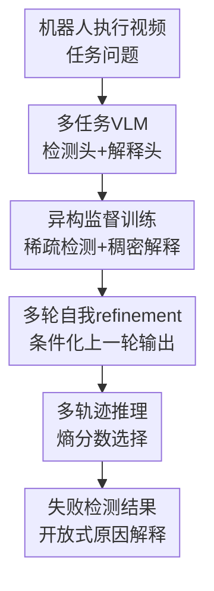

# Self-Refining Vision Language Model for Robotic Failure Detection and Reasoning

**会议**: ICLR 2026  
**OpenReview**: [https://openreview.net/forum?id=jr9hGWQioP](https://openreview.net/forum?id=jr9hGWQioP)  
**论文**: [OpenReview](https://openreview.net/forum?id=jr9hGWQioP)  
**代码**: 未在缓存中提供  
**领域**: 机器人 / VLM推理  
**关键词**: 机器人失败检测, 视觉语言模型, 自我 refinement, 异构监督, 开放式失败解释

## 一句话总结
ARMOR把机器人失败理解拆成二分类检测和自然语言解释两个协同任务，用多轮自我 refinement、稀疏/稠密标签混合训练和基于熵的轨迹选择，在模拟和真实仓储机器人数据上同时提升失败检测准确率与解释质量。

## 研究背景与动机
**领域现状**：机器人执行监控通常要回答两个问题：任务是否成功，以及如果失败到底发生了什么。传统方法多把它做成闭集失败模式分类，例如判断是否“抓取不稳”“物体洒落”或“末端执行器偏移”；近期 VLM 方法开始直接看图像或视频，让模型输出一段解释和一个成功/失败答案。

**现有痛点**：真实机器人失败很少规整地落在固定标签里。一个仓储机械臂搬运物品时，失败可能来自抓取姿态、物体破损、放置位置、遮挡、容器壁碰撞，甚至几个因素叠在一起。只做闭集分类会漏掉新失败模式；只让 VLM 生成一段自由文本又会把“检测”和“解释”混在同一个语言建模目标里，容易出现解释说成功、答案却写失败这类不一致输出。

**核心矛盾**：数据也不均衡。成功/失败二值标签可以从系统日志或传感器里大规模获得，但“为什么失败”的自然语言解释需要人工看视频标注，成本高很多。已有方法如果假设每个样本都有完整解释标签，就难以扩展到真实部署；如果简单把稀疏标签和稠密标签混在一起做 SFT，又会让模型过度学习二值标签格式，解释能力反而崩掉。

**本文目标**：作者希望训练一个既能准确做失败检测、又能给出开放式失败理由的 VLM；它要能利用大量只有二值标签的稀疏数据，也要用少量带解释的稠密数据学习人类式原因描述；同时在推理时能够逐轮修正检测和解释之间的不一致。

**切入角度**：论文把失败检测与失败解释看成一个多任务序列决策过程，而不是一次性文本生成。每一轮模型都看到视频、上一轮检测结果、上一轮解释和任务提示，再输出新的检测与解释。这样，检测头可以利用更多二值监督保持可靠，解释头则可以参考检测结果逐步对齐。

**核心 idea**：用“多任务头 + 多轮自我 refinement + 异构监督 imitation learning”代替单轮自由文本 SFT，让机器人失败检测的强监督信号牵引开放式解释生成。

## 方法详解

### 整体框架
ARMOR的输入是机器人执行视频 $x$ 和任务问题，输出是二值检测结果 $l$（success/failure 或 Yes/No）以及自然语言失败解释 $e$。方法先在 Qwen2.5-VL 这类生成式 VLM 上加一个轻量检测分类头，同时保留原语言解码头生成解释；训练时先做离线 imitation warm-up，再用模型自己的多轮 rollout 做在线 refinement；推理时采样多条 refinement 轨迹，用检测熵和解释 token 熵组成的 self-certainty 分数选最可信结果。

更形式化地，论文把状态写成 $s_t=[x,l_{t-1},e_{t-1},p_t]$，动作是当前轮输出 $a_t=(l_t,e_t)$。初始状态没有历史输出，之后每一轮把上一轮检测和解释放回 prompt 中，形成 $(l_t,e_t)\sim \pi_\theta(\cdot\mid[x,l_{t-1},e_{t-1},p_t])$。这个建模让“检测是否失败”和“解释为什么失败”不再互相挤在一个字符串里，而是两个头共享视觉和语言表示、再通过历史输出互相校正。

### 关键设计
**1. 多任务预测头：把二值检测从自由文本解析里解耦出来**

AHA等先前方法常让模型一次性生成 `<think>...</think><answer>Yes/No</answer>`，训练上用 next-token prediction，评估时再靠正则表达式抽取答案。这对失败检测很别扭：二分类本来应该优化清晰的判别边界，却被压进语言建模损失；一旦模型格式没跟上，检测就会被判错，解释与答案也可能互相矛盾。

ARMOR在 VLM backbone 上保留语言模型头生成解释，同时额外接一个轻量二分类头做检测。实现上，它从 LM decoder 前四层的中间表示取 mean-pooled features，经投影后与可学习 `[CLS]` token 做 cross-attention，再用 MLP 输出二分类 logits。检测用 BCE 损失，解释用 NTP 损失。这样，稀疏数据即使没有解释，也能继续监督检测头；稠密数据则同时训练检测和解释，让两个任务共享视觉语义基础但各自用合适的目标优化。

**2. 异构监督路径：让稀疏标签不吞掉解释能力**

这篇论文真正面对的是“检测标签多、解释标签少”的机器人部署现实。记稀疏数据为 $D_{sparse}=\{(x_i,l_i)\}$，稠密数据为 $D_{dense}=\{(x_i,l_i,e_i)\}$。训练目标不是强行给所有样本都补空解释，而是在每一轮只对可用标签计算损失：检测在两类数据上都监督，解释只在稠密数据上监督。

这种设计避免了简单 SFT-S+D 的常见坏结果：如果稀疏样本的解释字段都是空串或模板占位，模型会学到“给出很短、无意义、甚至空的解释”才是高频行为。ARMOR虽然在稀疏数据上也会生成解释作为下一轮上下文，但不对解释施加错误监督；稠密样本则提供真正的自然语言失败原因，把解释头拉向人工标注的语义空间。

**3. 离线 imitation 与在线 refinement：同时学习正确状态和自己会犯错的状态**

训练分两段。第一段是离线 imitation：模型先在无历史输出的初始状态上学习第一轮预测，再在稠密数据上学习“给定专家检测/解释之后还要保持正确”的条件转移。为了防止模型直接复制 prompt 中的 ground truth，作者会随机选择一个任务并 mask 掉该任务的真值输入，例如预测解释时遮掉真值解释但保留检测输入，让模型学习跨任务信息和视觉证据。

第二段是在线 refinement：模型从空历史开始，用当前策略 rollout $T$ 轮，每一轮都把自己的上一轮输出喂回去，再对可用标签计算损失。核心好处是缓解 imitation learning 中的分布偏移：离线专家状态太干净，真实推理时模型看到的是自己先前生成的、有时错误或含混的检测/解释。在线阶段让模型练习在这些自生成状态里纠错，因此更像测试时的行为分布。

**4. 基于 self-certainty 的多轨迹推理：不用外部奖励模型也能选答案**

推理阶段 ARMOR不是只跑一条确定轨迹，而是采样 $M$ 条 refinement 轨迹。每条轨迹每轮都会得到检测输出和解释输出，并计算一个不确定性分数：检测熵 $H_{det}$ 衡量分类头对成功/失败的摇摆程度，解释熵 $H_{reason}$ 衡量生成 token 的平均不确定性，二者组合为 $C^{(m)}=H^{(m)}_{det}+\lambda H^{(m)}_{reason}$。

当最优轨迹的分数不再比历史最小值降低超过容忍阈值 $\epsilon$ 时，refinement提前停止；最终选择 $C$ 最低的轨迹作为输出。这个机制很适合本文设定，因为作者没有训练或调用外部 oracle reward model。模型用自己的概率分布做“自信度”估计，既决定何时停止，也决定多条候选里选哪一条。论文中 $\lambda=0.1$，意味着检测熵权重更高，因为检测头有更多稀疏标签监督，可靠性通常高于解释头。

### 一个完整示例
假设输入是一段仓储机械臂从源箱搬运物体到目标箱的视频。第一轮模型的检测头可能已经判断为 failure，但解释头还停留在泛化描述：“机器人成功抓起物体并放入目标箱。”这时第二轮 prompt 会显式带上上一轮检测为 failure 和上一轮解释，模型需要在同一视频证据下重新生成解释。它可能改成“抓取时施力过大导致物品形变”。第三轮再结合视频细节，进一步修正为“机器人从底部抓起袋装物，导致内部物品洒出，因此运输失败”。

这个例子体现了 ARMOR 的核心假设：失败检测通常受益于大量二值标签，先变得相对稳定；解释生成则可以把检测结果当作约束，逐轮从模糊或矛盾描述变成更具体的失败原因。论文也展示了反例：在 ARMBench 的书本封面脱落案例中，检测保持正确的 No，但解释从碰撞漂移到放错位置，最后仍没捕捉“物品损坏”。这说明 refinement能提高一致性，但不能保证语义必然收敛到真实原因。

### 损失函数 / 训练策略
检测头用 binary cross-entropy，解释头用 next-token prediction。在线阶段每轮累计损失可以概括为：

$$
\mathcal{L}=\sum_{t=1}^{T}\left[\mathrm{BCE}(l_t,l)+\mathbf{1}[x\in D_{dense}]\,\mathrm{NTP}(e_t,e)\right]
$$

论文使用 Qwen2.5-VL 7B 作为默认 backbone，也报告了 32B 扩展实验。训练设置中，视频数据全局 batch size 为 16，拼图式多视角图像数据 batch size 为 64；离线阶段 3 个 epoch，在线阶段 10 个 epoch；refinement horizon $T=3$，推理最大 refinement 轮数 $T_{refine}=4$，采样轨迹数 $M=3$。学习率方面，LM decoder 和分类头为 $1\times10^{-5}$，vision encoder 为 $2\times10^{-6}$，使用 AdamW、0.1 weight decay、cosine schedule 和 0.03 warmup ratio。

## 实验关键数据

### 主实验
论文在四个数据集上评估：RLBench-Fail、Maniskill-Fail、Sparrow-Fail 和 ARMBench。前两者来自模拟桌面操作，后两者来自真实仓储机器人；Maniskill和ARMBench还分别构造了跨环境迁移设置 $R\rightarrow M$ 与 $S\rightarrow A$。

| 数据集 | 指标 | ARMOR | 最强对比方法 | 提升 |
|--------|------|-------|--------------|------|
| RLBench | Detect Acc. | 0.917 | SFT-S+D 0.726 | +0.191 |
| RLBench | LLM Fuzzy | 0.718 | Claude-3.7 3-shot 0.473 / SFT-S+D 0.550 | +0.168 vs SFT-S+D |
| Sparrow | Detect Acc. | 0.733 | Claude-3.7 3-shot 0.650 | +0.083 |
| Sparrow | LLM Fuzzy | 0.503 | Claude-3.7 3-shot 0.407 | +0.096 |
| Maniskill ($R\rightarrow M$) | Detect Acc. | 0.990 | SFT-D 0.788 | +0.202 |
| Maniskill ($R\rightarrow M$) | LLM Fuzzy | 0.673 | SFT-D 0.644 | +0.029 |
| ARMBench ($S\rightarrow A$) | Detect Acc. | 0.725 | Claude-3.7 3-shot 0.650 / SFT-D 0.640 | +0.075 vs Claude |
| ARMBench ($S\rightarrow A$) | LLM Fuzzy | 0.698 | Claude-3.7 3-shot 0.685 | +0.013 |

一个关键信号是：通用开源 VLM 在这些失败检测任务上接近随机，例如 Qwen2.5-VL 在 RLBench 的检测准确率只有 0.376，在 Sparrow 为 0.453。Claude-3.7 few-shot更强，但多数设置仍低于 ARMOR。SFT-D在有稠密标签的设置中有一定效果，SFT-S+D在跨域时尤其容易让解释质量坍塌，例如 Maniskill $R\rightarrow M$ 的 LLM Fuzzy 从 SFT-D 的 0.644 掉到 0.177。

### 消融实验
| 配置 | 训练 / 推理组件 | Detection / Reasoning | 说明 |
|------|----------------|-----------------------|------|
| Multitask Prediction | 离线 warmup + 多任务头，无 refinement | 0.897 / 0.460 | 检测已经很强，但解释明显不足 |
| Refinement Only | warmup + 推理 refinement | 0.803 / 0.488 | 仅测试时自我修正会改善解释，却损伤检测 |
| Offline Imitation Only | warmup + expert-conditioned + 推理 refinement | 0.853 / 0.658 | 条件化专家状态显著改善解释一致性 |
| Online Imitation Only | 在线 rollout + 推理 refinement | 0.850 / 0.683 | 学会处理自身预测状态，对解释更有帮助 |
| ARMOR | 所有组件 | 0.917 / 0.718 | 检测和解释同时最好 |

### 关键发现
- 多任务头主要解决检测可靠性。只用 Multitask Prediction 就能在 RLBench 达到 0.897 检测准确率，但 reasoning 只有 0.460，说明“分头预测”不能自动带来好解释。
- refinement 的收益需要训练时见过 refinement 状态。仅在推理时做 refinement 会让 reasoning 从 0.460 到 0.488，但检测降到 0.803；加入离线或在线 imitation 后，解释提升到 0.658 / 0.683。
- 多轮 refinement 的收益集中在前几轮。Reasoning LLM Fuzzy 从 Round 0 的 $0.475\pm0.016$ 到 Round 1 的 $0.676\pm0.025$，Round 2 为 $0.703\pm0.013$，Round 3 为 $0.717\pm0.002$，提升逐步变小但方差也下降。
- 推理开销相对温和。单问题在 8×A100 上，Round 0 为 7.95 秒、3.48GB/GPU；Round 3 为 10.95 秒、6.31GB/GPU，大约每轮多 1 秒。
- 数据比例实验显示，ARMOR能承受一定稀疏/稠密不平衡。在 Sparrow→ARMBench 中，稀疏/稠密比为 10 时 Detection / Reasoning 为 0.640 / 0.609；当比例改善到 2 时达到 0.813 / 0.831；比例恶化到 30 时 reasoning 降到 0.427。

## 亮点与洞察
- **把检测当分类、把解释当生成**：这听起来朴素，但对机器人失败理解很关键。失败检测的“对/错”需要稳定判别边界，解释则需要开放式语言表达；用不同 head 和不同 loss 处理，比把所有内容塞进 `<answer>` 字符串更贴合任务结构。
- **异构监督处理得很现实**：论文没有假设每个失败都有人工解释，而是承认二值日志便宜、原因标注昂贵。这个设定比“全量稠密标注”更像真实机器人系统，也解释了为什么简单 SFT-S+D 会失败。
- **refinement不是纯 prompt trick，而是训练分布的一部分**：很多自我修正方法只在推理时让模型反思，但 ARMOR让模型训练时就经历自己的上一轮输出。这个细节决定了它不只是“多问几遍”，而是在学习如何从自身错误状态恢复。
- **self-certainty 选择适合无奖励场景**：机器人失败原因很难在线打 reward，尤其是开放式文本解释。用检测熵和解释熵做候选选择虽然不完美，但避免了训练外部 reward model 的额外负担。
- **可迁移到其他机器人诊断任务**：同一范式可以扩展到安全违规识别、恢复策略建议、异常根因分析等任务。只要存在“一个相对便宜的离散标签 + 一个昂贵的自然语言解释/计划标签”，多任务 refinement 都有用武之地。

## 局限与展望
- 解释仍可能跑偏。论文自己的 ARMBench例子显示，模型能保持二值检测正确，却把真实的“书本封面脱落/物品损坏”解释成碰撞或放错位置，说明低熵不一定等于语义正确。
- 监督模态仍主要来自视觉视频。真实机器人失败常需要力矩、关节状态、吸盘压力、系统日志等信号；仅靠视频可能看不出抓取力过大、吸附失败或微小接触异常。
- 评估解释质量仍依赖 LLM fuzzy matching 和 ROUGE-L。LLM语义评分比正则更合理，但仍可能偏向流畅解释，而不是严格验证因果链是否与视频一致。
- 训练成本不低。论文在线阶段要多轮 rollout，并使用 8×H100 训练；虽然推理开销可控，但复现实验对普通实验室仍有门槛。
- 后续可以引入结构化中间属性，例如“碰撞、错放、损坏、漏抓、洒落”等作为软监督或 reward 信号。这样既保留开放式解释，又能限制 refinement 在关键失败因子上漂移。

## 相关工作与启发
- **vs AHA**: AHA把机器人失败检测与解释放进单一文本生成格式，且更依赖完整失败模式标注。ARMOR把检测和解释解耦为两个任务，并专门处理稀疏二值标签与少量解释标签的混合训练，因此在跨域和标签不均衡时更稳。
- **vs off-the-shelf VLM**: Qwen2.5-VL、Cosmos-Reasoning、LLaVA-NeXT等通用模型有视觉常识，但没有对机器人失败边界做过对齐，检测常接近随机。ARMOR说明在安全/诊断类机器人任务中，面向任务的 fine-tuning 仍很必要。
- **vs RISE / Self-Refine类方法**: RISE关注 LLM agent 的递归自我改进，并常假设有外部奖励或更明确的反馈。ARMOR把类似思想搬到视频 VLM 和机器人失败推理中，用 imitation learning 与内部熵信号替代 oracle reward。
- **vs Success Detector / closed-set failure classifier**: 闭集成功检测器能在固定任务中工作，但无法解释新型组合失败。ARMOR保留二值检测的可评估性，同时让解释以自然语言开放生成，更适合真实部署中的人机协作调试。

## 评分
- 新颖性: ⭐⭐⭐⭐☆ 把多任务头、异构监督和自我 refinement结合到机器人失败推理中，问题设定和训练流程都有清晰新意。
- 实验充分度: ⭐⭐⭐⭐☆ 覆盖模拟与真实仓储数据、跨域迁移、组件消融、轮数与成本分析；如果能加入更多真实机器人平台会更强。
- 写作质量: ⭐⭐⭐⭐☆ 主线清楚，算法图和消融解释到位；少量公式/图表排版在缓存文本中略显混乱，但不影响理解。
- 价值: ⭐⭐⭐⭐⭐ 面向机器人部署中非常实际的失败诊断问题，尤其是“稀疏日志多、人工解释少”的设定，对可靠自治系统很有参考价值。

<!-- RELATED:START -->

## 相关论文

- [\[ICLR 2026\] OneTwoVLA: A Unified Vision-Language-Action Model with Adaptive Reasoning](onetwovla_a_unified_vision-language-action_model_with_adaptive_reasoning.md)
- [\[ICLR 2026\] Vlaser: Vision-Language-Action Model with Synergistic Embodied Reasoning](vlaser_vision-language-action_model_with_synergistic_embodied_reasoning.md)
- [\[NeurIPS 2025\] SAFE: Multitask Failure Detection for Vision-Language-Action Models](../../NeurIPS2025/robotics/safe_multitask_failure_detection_for_vision-language-action_models.md)
- [\[ICLR 2026\] Embodied-R1: Reinforced Embodied Reasoning for General Robotic Manipulation](embodied-r1_reinforced_embodied_reasoning_for_general_robotic_manipulation.md)
- [\[CVPR 2026\] AwareVLN: Reasoning with Self-awareness for Vision-Language Navigation](../../CVPR2026/robotics/awarevln_reasoning_with_self-awareness_for_vision-language_navigation.md)

<!-- RELATED:END -->
