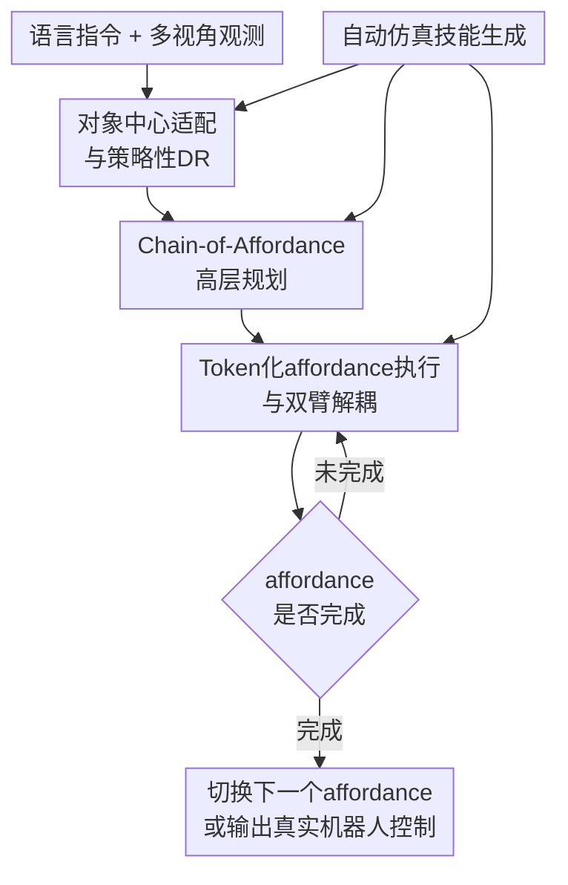

# Sim2Real VLA: Zero-Shot Generalization of Synthesized Skills to Realistic Manipulation

**会议**: ICLR 2026  
**OpenReview**: [https://openreview.net/forum?id=H4SyKHjd4c](https://openreview.net/forum?id=H4SyKHjd4c)  
**代码**: https://github.com/DexForce/EmbodiChain  
**领域**: 机器人 / VLA 操控  
**关键词**: Sim2Real、Vision-Language-Action、机器人操控、affordance、仿真数据

## 一句话总结
Sim2Real-VLA 用“高层 affordance 链规划 + 低层 token 化动作执行”的双系统 VLA 架构，把纯仿真生成的操控技能零样本迁移到真实机器人上，在双臂、灵巧和长时程任务中显著缩小 Sim2Real gap。

## 研究背景与动机
**领域现状**：VLA（Vision-Language-Action）模型已经成为通用机器人控制的主流路线之一，它把视觉观测、语言指令和机器人动作放进同一个策略学习框架里，希望让机器人不再为每个任务单独写控制程序。OpenVLA、RDT、$\pi_0$、GR00T 等模型展示了这条路线的潜力，但它们通常仍依赖大量真实机器人数据，或者至少需要在目标机器人和目标任务上再微调一轮。

**现有痛点**：真实机器人数据贵、慢、难扩展，所以很多工作转向高性能仿真和自动技能生成。问题在于，仿真里学到的策略一旦直接部署到真实环境，就会遇到 Sim2Real gap：光照、背景、物体材质、相机视角、接触动力学、机器人初始状态都可能和训练分布不同。传统方案常常试图把仿真做得更逼真，或者做大规模 domain randomization，但长时程操控里的失败并不总是来自“图像不像真实世界”，而是来自策略把注意力放在了与操控无关的视觉细节上。

**核心矛盾**：机器人操控真正需要的是与对象、接触和末端执行器运动相关的结构信息；而普通端到端 VLA 会同时看到大量无关域差异，例如桌面纹理、背景、光照和非目标物体。仿真越复杂，未必越能迁移；如果模型架构仍然把所有视觉变化都当成同等重要的输入，合成数据规模再大也可能学到脆弱的相关性。

**本文目标**：作者要解决的不是“如何收集更多真实数据”，而是“如何只用仿真数据训练一个能零样本部署到真实操控场景的 VLA”。具体来说，系统需要在真实机器人上完成单臂倒水、双臂倒水、餐具整理、空中交接、篮子取放、开锅盖取放等多步任务，并且要能承受背景、物体外观、桌面纹理等域变化。

**切入角度**：作者的观察是，长时程操控可以被抽象成一串 affordance：每一步并不需要完整复刻真实世界的所有像素和动力学，只需要知道“当前应当作用在哪个对象/部位、末端执行器该朝哪个关键姿态移动、这一步是否完成”。如果 VLA 的推理和执行都围绕 affordance 展开，模型就更容易过滤掉操控无关因素，把仿真里可获得的对象几何、掩码、关键姿态变成跨域稳定的监督信号。

**核心 idea**：用对象中心的 affordance 链作为高层计划，再用 token 化动作空间执行和验证每个 affordance，从模型结构上把“看懂场景”和“生成控制”锚定到操控关键动态，而不是依赖仿真图像逼真度来硬追真实世界。

## 方法详解

### 整体框架
Sim2Real-VLA 的整体流程可以概括为三步：先在仿真里把真实任务投影成可扩展的场景和技能轨迹，再训练一个对象中心的高层 planning system 来预测 affordance 链，最后由低层 acting system 把每个 affordance 转成机器人动作并实时检查是否完成。训练阶段只使用仿真渲染观测、对象掩码、关键姿态和动作轨迹；部署阶段直接接收真实机器人传感器观测和语言指令，不再用真实演示做微调。

这套设计的关键不是把仿真做成照片级真实，而是把策略学习过程改造成“先找操控相关对象与关键姿态，再生成动作”的结构化过程。对象掩码、affordance 关键点、左右臂分离控制和动作 token 化共同形成一个过滤器：背景和纹理可以变化，但任务关键的对象、接触部位和末端执行器运动应当保持稳定。

图里四个贡献节点正好对应下面四个关键设计：对象中心适配与策略性 DR 提供跨域视觉表示；Chain-of-Affordance 高层规划把语言任务拆成可执行的关键姿态序列；Token 化 affordance 执行与双臂解耦把计划落到低层控制；自动仿真技能生成为前三者提供掩码、affordance 和动作监督。

### 关键设计
**1. 对象中心适配与策略性DR：先恢复操控对象，再随机化无关外观**

Sim2Real-VLA 不直接让策略在原始 RGB 上学习所有变化，而是先把视觉观测改写成对象中心表示。仿真环境知道每个对象的空间、物理、语义和形态属性，所以可以渲染对象掩码 $m_t^i$，并训练一个恢复模型 $p^R_\theta(m_t^i \mid o_t^\xi, \ldots, o_{t-H}^\xi)$ 从观测历史里预测目标对象掩码。论文把这个过程写成最小化对象恢复的负对数似然：

$$
L(\theta)=\mathbb{E}\left[-\sum_{t=0}^{T}\sum_{i=0}^{I}\log\left(p^R_\theta(m_t^i\mid o_t^\xi,\ldots,o_{t-H}^\xi)\cdot p_d(o_t^\xi\mid \hat{o}_t,\xi)\right)\right].
$$

这里的 $p_d$ 不是普通的数据增强，而是带有任务意识的 domain randomization。作者把 DR 特征分成场景级和机器人级：光照、桌面纹理、背景、干扰物、物体位置/朝向/纹理/形状，以及相机位置、相机朝向、视场角、初始末端执行器姿态等。系统还借助大视觉语言模型为当前任务选择更值得随机化的特征和采样范围。例如倒水任务里，杯子和瓶子的相对位置、形状、可见性明显比背景纹理更关键；而背景和光照可以高频重采样，让模型尽早学会忽略这些动作不变因素。

这个设计的价值在于，它没有把 Sim2Real gap 简化成“仿真图像不够像真实图像”。对操控来说，机器人需要的是目标对象在哪里、该接触哪里、当前关键动作是否完成。对象中心适配把这部分信息提出来，策略性 DR 则刻意打散那些容易造成伪相关的外观因素，使后续规划和控制更依赖操控本身。

**2. Chain-of-Affordance高层规划：用关键姿态序列替代语言式空泛推理**

高层规划器的输出不是一段自然语言 Chain-of-Thought，而是一串 affordance $q=[q_0,\ldots,q_K]$。每个 $q_k$ 对应一组几何结构化关键点，可理解为某个原子操控步骤的末端执行器目标姿态或对象交互关键位置。例如倒水任务可以拆成“抓住瓶子”“移动到杯子上方”“旋转瓶子”“放回瓶子”，这些步骤都能用对象和末端执行器之间的关键姿态来表达。

论文把 affordance 预测建模为条件分布 $p^A_\phi(q_{k,t},\ldots,q_{K,t}\mid \hat{m}_t,o_t^\xi,\ldots,o_{t-H}^\xi,l)$，实际训练时分解成逐步条件预测：

$$
L(\phi)=\mathbb{E}\left[-\sum_{t=0}^{T}\sum_{k=1}^{K}\log p^A_\phi(q_{k,t}\mid q_{k-1,t},\hat{m}_t,o_t^\xi,\ldots,o_{t-H}^\xi,l)\cdot p_d(o_t^\xi\mid \hat{o},\xi)\right].
$$

这一步很重要，因为它把“任务理解”从纯语义层拉回到机器人能执行的几何层。语言推理可能说“把水倒进杯子”，但机器人需要知道瓶口应当移动到杯子上方、旋转角度如何变化、什么时候该进入下一步。affordance 链把这些中间状态显式化，使高层规划既能表达长时程任务的顺序，又能为低层 actor 提供可跟踪的目标。

**3. Token化affordance执行与双臂解耦：让低层控制只追踪当前可执行目标**

低层 acting system 接收当前 affordance $q_k$、目标对象掩码 $\hat{m}_t$ 和观测历史，输出未来一段动作 $a_t,\ldots,a_{t+M}$。它不是一次性把整条任务做完，而是反复执行当前 affordance，并用验证模型判断是否已经完成；如果没完成，就继续围绕同一个 affordance 生成动作；如果完成，再切换到下一个 affordance。这个闭环对长时程任务尤其关键，因为前一步失败会直接污染后续步骤，不能像离线轨迹回放一样假设每个中间状态都准确抵达。

动作表示上，作者没有直接在高维连续关节空间里回归控制量，而是先对归一化动作片段做 DCT（Discrete Cosine Transform），把时序动作转到频域并压缩成系数，再量化并用 BPE 压成紧凑的动作 token 序列 $a^{DCT}$。附录里还说明 action model 使用类似 tokenize-then-concatenate 的方式，把 FAST tokenizer 得到的动作嵌入和 affordance 输出拼接，再由条件自回归 transformer 预测动作 token 或 `<EOS>`。

对双臂任务，Sim2Real-VLA 进一步把策略拆成左臂 $\pi^l_\omega$ 和右臂 $\pi^r_\omega$ 两个独立组件。它们共同训练、协同完成任务，但每个控制器只看与自己相关的相机视角和 affordance 目标。这样做不是为了结构美观，而是为了减少跨臂干扰：右臂抓杯子时不该被左臂瓶子的目标姿态牵走注意力，左臂倒水时也不该把右臂保持杯子稳定的状态误当成自己的动作目标。附录的消融显示，双臂交接任务中 arm decouple 的真实成功率从 joint learning 的 $0.15$ 提升到 $0.40$，说明这种拆分确实缓解了多臂控制里的注意力混淆。

**4. 自动仿真技能生成：让纯仿真训练拥有可规模化监督**

只靠模型结构还不够，Sim2Real-VLA 还需要大规模仿真数据来提供对象掩码、affordance 和动作监督。作者的自动数据生成管线先做 Real2Sim projection：从真实任务描述、遥操作数据或人类演示视频里提取静态场景信息和动态轨迹，把物体位置、朝向、形态、空间布局以及动作轨迹投影到仿真环境中。论文强调这里的真实轨迹只是用来构建任务实例和仿真先验，不作为策略网络的真实机器人监督；策略训练仍然只使用仿真渲染观测和仿真生成的动作。

接着，Generative Scene Scaling 在仿真中采样多种场景级和机器人级配置。附录补充了一个很实用的细节：作者会用 workspace analyzer 预计算机器人末端执行器的可达空间，只在可达空间和对象分布范围的交集中采样物体姿态，避免生成一堆逆运动学根本不可行的轨迹。相机位置和视场角也会根据视锥与机器人工作空间的交叠比例来约束，以保证视觉观测覆盖任务关键区域。

最后，自动技能获取管线用 action bank、task agent 和 code agent 生成可执行轨迹。Task agent 根据语言和视觉上下文把任务拆成子目标，code agent 选择抓取、抬起、旋转等原子动作并设置参数，再通过广义 IK 求解关键姿态对应的关节角，轨迹规划器在关键姿态之间插值。每个原子动作末尾的关键姿态会成为 affordance 监督，关节角成为动作监督，渲染图像和对象掩码成为视觉监督。这样一来，训练数据不是人工逐条标注出来的，而是由仿真引擎和多模态 agent 自动合成，正好支撑论文“只用仿真数据训练”的主张。

### 一个完整示例
以 Dual-Arm Water Pour 为例，语言指令可以是“请把瓶子里的水倒进纸杯”。系统首先从多视角图像里恢复瓶子和杯子的对象掩码，并在训练时不断随机化背景、桌面纹理、物体纹理和相机相关参数。高层规划器不会只输出“倒水”这个语义计划，而会预测一串 affordance：左臂抓住瓶子，右臂抓住杯子，左臂把瓶子移动到杯子上方，右臂把杯子移动到接水位置，左臂旋转瓶子完成倾倒，然后两只手分别把杯子和瓶子放回安全位置。

执行阶段，左臂控制器只跟踪瓶子相关 affordance，右臂控制器只跟踪杯子相关 affordance。假设左臂已经抓住瓶子但尚未到达杯子上方，验证模型会判定当前 affordance 未完成，acting system 继续生成围绕“移动瓶子到杯子上方”的动作 token；一旦验证通过，系统才切换到“旋转瓶子”的下一个 affordance。这样即使真实世界中的杯子位置、桌面纹理或背景与仿真不同，只要对象掩码和关键姿态仍然可靠，策略就能围绕当前可执行目标持续调整。

### 损失函数 / 训练策略
训练目标由三个层次组成。第一层是对象中心适配的掩码恢复损失 $L(\theta)$，用仿真可得的对象掩码监督视觉模块学会从随机化观测中恢复目标对象。第二层是 affordance 预测损失 $L(\phi)$，用自动技能生成管线得到的关键姿态序列监督高层 planner。第三层是低层动作模型训练，它将 masked visual observations、语言指令、proprioception 和 affordance 输出融合，预测 token 化后的动作 chunk。

附录给出的实现细节包括：视觉编码器使用 DINOv2，语言编码器使用 T5-XXL；action expert 约 200M 参数，由 8 层 transformer backbone 构成，hidden dimension 为 256，attention heads 为 8；还额外使用两个相同配置的 transformer block 做 affordance inference 和 guidance，并用多个 MLP adapter 对齐动作、观测和 affordance 维度。训练采用 cosine annealing 学习率，最大学习率 $1\times 10^{-5}$，训练 40,000 epochs，batch size 为 8，并用 EMA 稳定训练，大约需要 36 GPU 小时。

需要注意的是，论文所谓 zero-shot Sim2Real 指的是策略网络没有用真实机器人数据做梯度更新。Real2Sim 模块会读取少量真实遥操作或人类视频来重建任务实例、初始化状态和目标姿态，但这些信息只是仿真环境构建的先验；最终策略仍然只从仿真 rollouts、仿真奖励、仿真图像和仿真生成的动作中学习。

## 实验关键数据

### 主实验
论文在 Agilex CobotMagic 机器人上评估六个长时程操控任务，包括单臂倒水、双臂倒水、餐具整理、物体空中交接、篮子取放和开锅盖取放。所有 baseline 都用同一套自动数据生成管线得到的仿真数据微调，再零样本部署到真实环境。评价指标包括仿真成功次数、真实成功次数，以及真实环境中完成任务所需的平均步数；失败试验按任务最大步数计入。

| 任务 | 指标 | Sim2Real-VLA | 最强基线 | 提升 |
|------|------|--------------|----------|------|
| Single-Arm Water Pouring | Real 成功 | 17/20 | 11/20（$\pi_0$-FAST） | +6 次成功 |
| Dual-Arm Water Pouring | Real 成功 | 16/20 | 8/20（$\pi_0$-FAST） | +8 次成功 |
| Table Rearrangement | Real 成功 | 16/20 | 7/20（$\pi_0$-FAST） | +9 次成功 |
| Items Hand-Over and Place | Real 成功 | 8/20 | 4/20（$\pi_0$） | +4 次成功 |
| Basket Pick-and-Place | Real 成功 | 9/20 | 3/20（$\pi_0$-FAST） | +6 次成功 |
| Pan Open and Place | Real 成功 | 7/20 | 3/20（$\pi_0$-FAST） | +4 次成功 |

从整体平均看，Sim2Real-VLA 的真实环境成功率为 $60.8\%$，论文称比最强 baseline 绝对提升超过 $35\%$。这个差距在长时程任务里最明显：ACT 和 Diffusion Policy 在后三个复杂任务上几乎全部失败，RDT、$\pi_0$、GR00T 虽然在仿真中有一定成功率，但真实部署时容易卡在中间步骤或发生跨域失效。Sim2Real-VLA 的平均步数也更少，例如双臂倒水为 $195.15\pm16.05$ 步，而 $\pi_0$-FAST 为 $223.95\pm15.50$ 步，说明它不仅更常成功，也更少在失败或迟疑动作中消耗步数。

| 任务 | Original | Background | Object | Table | Multiple Gaps |
|------|----------|------------|--------|-------|---------------|
| Single-Arm Water Pour | 17/20 | 17/20 | 16/20 | 17/20 | 16/20（Table + Object） |
| Dual-Arm Water Pour | 16/20 | 16/20 | 16/20 | 17/20 | 17/20（Table + Object） |
| Table Rearrangement | 16/20 | 15/20 | 14/20 | 16/20 | 15/20（Table + Object） |
| Item Hand-Over and Place | 8/20 | 9/20 | 8/20 | 6/20 | 8/20（Table + Object） |
| Basket Pick-and-Place | 9/20 | 9/20 | 10/20 | 9/20 | 7/20（Table + Background + Object） |
| Pan Open Pick-and-Place | 7/20 | 6/20 | 7/20 | 7/20 | 8/20（Table + Background + Object） |

这张 domain gap 表说明，模型在背景、物体外观/位置、桌面纹理以及多种 gap 叠加时基本保持稳定。部分变化下成功率还会略有上升，作者的解释是域变化可能削弱原始环境中的伪相关，或者偶然让某些试验更接近训练中见过的可行配置。这个结果和方法动机是吻合的：如果策略主要依赖对象和 affordance，而不是依赖背景纹理，那么真实环境里的外观变化就不该让性能大幅崩溃。

### 消融实验
论文和附录给了几组对方法机制很有解释力的分析。第一组是 affordance chain length $K$：作者比较 $K=1,2,3$，发现 $K=1$ 在六个任务上最好。这个结果有点反直觉，因为更长的链看起来应该包含更多上下文，但在这些操控任务中，过长的 affordance 链反而引入冗余和额外预测误差。也就是说，系统需要结构化关键目标，但不需要把未来过多步骤一次性塞进当前控制。

| 配置 | 代表任务真实成功率 | 说明 |
|------|------------------|------|
| Affordance chain $K=1$ | 单臂倒水 17/20；双臂倒水 16/20；餐具整理 16/20 | 六个任务整体最佳，当前目标足以指导控制 |
| Affordance chain $K=2$ | 单臂倒水 10/20；双臂倒水 11/20；餐具整理 12/20 | 引入更多上下文，但真实执行更不稳定 |
| Affordance chain $K=3$ | 单臂倒水 11/20；双臂倒水 8/20；餐具整理 13/20 | 更长链没有带来收益，反而增加冗余 |
| Joint learning | 单臂倒水 0.75；物体交接 0.15 | 单个控制模块同时预测双臂动作，双臂任务干扰明显 |
| Arm decouple | 单臂倒水 0.85；物体交接 0.40 | 左右臂控制分离，双臂任务收益更大 |

第二组是 perception gap 分析。作者用仿真和真实机器人在匹配状态下生成掩码，并与 SAM 伪真值比较，六个任务 real vs. SAM 的 mean IoU 分别为 0.78、0.81、0.70、0.75、0.82、0.69；在不同相机配置下的单臂倒水 real vs. SAM IoU 仍为 0.78。说明对象掩码模块虽然只在仿真随机化数据上训练，但对真实图像有一定跨域稳定性。

第三组是 few-shot real-world adaptation。Sim2Real-VLA 的 Sim Only 已经在 Rearrangement 和 Basket 上达到 0.85 和 0.50；用 10 条真实 demo 做 Sim-then-Real 后可到 0.90 和 0.60。但 5 条真实 demo 时反而降到 0.60 和 0.35，作者认为极少量真实数据会暂时破坏强仿真先验，10 条数据才足以恢复并进一步适配。这个现象提醒读者：这篇论文的强点是零样本仿真迁移，不是“真实数据越少越一定更好”的单调 few-shot 故事。

### 关键发现
- affordance 驱动的双系统结构是主要收益来源。主实验里，所有 baseline 都见过同样的仿真数据，但端到端或弱层级模型仍难以真实部署，说明问题不只是数据规模，而是模型是否把仿真监督组织成跨域稳定的对象和动作结构。
- 长时程、双臂任务最能拉开差距。单臂倒水里强 baseline 已有一定真实成功率，但物体交接、篮子取放、开锅盖取放这类任务需要连续验证中间状态，普通策略一旦某一步偏离就很难恢复。
- 域随机化不是越粗暴越好。论文通过 VLM 选择 DR 特征、通过 flow 高频随机化动作不变特征，并用对象掩码过滤背景变化，使随机化服务于操控关键因素，而不是把所有视觉因素都一锅乱抖。
- 更长的 affordance 链没有带来更强性能。对于本文任务，当前可执行 affordance 与验证闭环比一次预测更长未来链更重要，这个结论对做层级机器人规划的人很有参考价值。

## 亮点与洞察
- 最有意思的技术选择是“从模型侧缩小 Sim2Real gap”。很多机器人论文默认仿真越逼真越好，但本文强调操控迁移的关键可能是表示和控制结构：把对象、affordance、动作执行拆开以后，真实世界的很多外观变化就被降权了。
- Affordance 在这篇论文里不是一个可视化解释词，而是贯穿数据生成、planner 监督、actor 条件输入和 motion validation 的接口。这样的接口设计让高层推理和低层控制能共享同一种中间语言，比纯语言计划更贴近机器人动作。
- 动作 token 化与 arm-decoupling 的组合比较务实。DCT+BPE 降低连续动作建模难度，左右臂分离减少多臂控制里的注意力错配；这两个点都不是宏大概念，但确实针对了 VLA 部署时的工程痛点。
- 自动数据生成管线把 Real2Sim、场景扩展、任务 agent、code agent、IK 和轨迹规划串成闭环，使“纯仿真训练”不只是口号。尤其是 workspace-aware scene scaling，避免生成不可达对象姿态，是很多仿真自动化管线容易忽略的细节。
- 对其他任务的启发是：如果任务里存在跨域稳定的中间结构，就不一定要让大模型直接吃完整观测到完整动作。把中间结构设计好，可能比继续扩大端到端模型和仿真资产更有效。

## 局限与展望
- 论文的任务仍集中在桌面操控和受控实验室环境。虽然包括双臂和长时程任务，但还没有覆盖移动机器人、开放场景、人机共处环境或需要复杂接触力反馈的任务。
- Real2Sim prior 的“zero-shot”定义需要仔细理解。策略网络没有用真实机器人数据训练，但任务实例构建会读取少量真实遥操作或人类视频来配置仿真，这和完全不接触目标真实任务信息的零样本设定不是同一回事。
- Affordance 的质量高度依赖仿真可获取的对象几何、掩码和关键姿态。如果仿真资产缺失、物体形态复杂、遮挡严重，或者任务中的关键接触难以用 2D keypoints / key poses 表达，系统可能需要更强的 3D 表示和触觉反馈。
- 主结果虽然相对提升明显，但绝对成功率仍有提升空间。复杂任务如 Pan Open Pick-and-Place 的真实成功率为 7/20，Items Hand-Over and Place 为 8/20，还不能算可靠生产级部署。
- 未来可以把强化学习或在线安全适配接进验证闭环，让模型在不破坏零样本能力的前提下，从真实失败中学习更好的 affordance 切换和恢复策略。

## 相关工作与启发
- **vs OpenVLA / RDT / $\pi_0$ / GR00T**: 这些方法代表通用 VLA 或机器人 foundation policy 路线，优势是模型容量和预训练数据强，但部署到目标机器人时通常还依赖真实数据微调。Sim2Real-VLA 的区别是把 affordance 作为规划和执行接口，强调纯仿真训练后的零样本真实部署。
- **vs Domain Randomization**: 传统 DR 往往把光照、纹理、相机、物体位置等因素一起随机化，希望真实分布落在训练分布里。本文没有否定 DR，而是把 DR 放在对象中心适配里，并强调动作不变特征的高频随机化，使模型更有针对性地忽略操控无关视觉因素。
- **vs Domain Adaptation / Real2Sim-to-Real**: 域适配方法常通过图像、点云或动力学特征对齐来缩小仿真和真实差异；Real2Sim 方法则把真实场景重建到仿真里。Sim2Real-VLA 借用了 Real2Sim 作为任务配置先验，但核心贡献在于 VLA 架构本身如何使用对象掩码、affordance 和动作 token 来迁移。
- **vs Embodied Chain-of-Thought**: 语言式 embodied CoT 可以提升任务分解和推理可解释性，但机器人最终需要的是几何目标和控制信号。本文的 chain-of-affordance 更像是机器人可执行的 CoT，把“下一步做什么”直接绑定到对象和末端执行器关键姿态。

## 评分
- 新颖性: ⭐⭐⭐⭐☆ 把 affordance 作为 Sim2Real VLA 的规划-执行接口很有辨识度，虽然组件本身来自已有路线，但组合目标清晰。
- 实验充分度: ⭐⭐⭐⭐☆ 六个真实机器人长时程任务、域变化测试和多组消融较扎实；不过场景仍偏实验室桌面。
- 写作质量: ⭐⭐⭐⭐☆ 主线明确，图表支撑充分，附录实现细节较多；部分表述如 zero-shot 与 Real2Sim prior 的边界需要读附录才完全清楚。
- 价值: ⭐⭐⭐⭐⭐ 对用仿真数据训练机器人 foundation policy 很有参考价值，尤其提醒研究者不要只追求仿真逼真度，也要重设计模型的中间结构。

<!-- RELATED:START -->

## 相关论文

- [\[ICLR 2026\] VITA: Zero-Shot Value Functions via Test-Time Adaptation of Vision–Language Models](vita_zero-shot_value_functions_via_test-time_adaptation_of_visionlanguage_models.md)
- [\[NeurIPS 2025\] Zero-Shot Context Generalization in Reinforcement Learning from Few Training Contexts](../../NeurIPS2025/robotics/zero-shot_context_generalization_in_reinforcement_learning_from_few_training_con.md)
- [\[ICLR 2026\] From Seeing to Doing: Bridging Reasoning and Decision for Robotic Manipulation](from_seeing_to_doing_bridging_reasoning_and_decision_for_robotic_manipulation.md)
- [\[ICLR 2026\] Abstracting Robot Manipulation Skills via Mixture-of-Experts Diffusion Policies](abstracting_robot_manipulation_skills_via_mixture-of-experts_diffusion_policies.md)
- [\[ICLR 2026\] VLBiMan: Vision-Language Anchored One-Shot Demonstration Enables Generalizable Bimanual Robotic Manipulation](vlbiman_vision-language_anchored_one-shot_demonstration_enables_generalizable_bi.md)

<!-- RELATED:END -->
