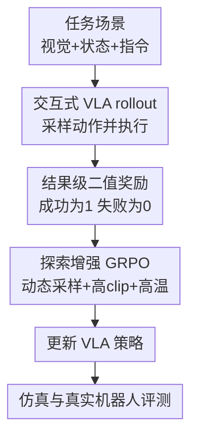

# SimpleVLA-RL: Scaling VLA Training via Reinforcement Learning

**会议**: ICLR2026  
**OpenReview**: [https://openreview.net/forum?id=TQhSodCM4r](https://openreview.net/forum?id=TQhSodCM4r)  
**代码**: [https://github.com/PRIME-RL/SimpleVLA-RL](https://github.com/PRIME-RL/SimpleVLA-RL)  
**领域**: 机器人 / VLA 强化学习  
**关键词**: VLA、机器人操作、在线强化学习、GRPO、稀疏奖励  

## 一句话总结
SimpleVLA-RL 把 LLM 领域的 outcome-driven online RL 改造成适合 Vision-Language-Action 模型的闭环机器人训练框架，用交互式轨迹采样、二值成功奖励和探索增强的 GRPO，在 LIBERO、RoboTwin 与真实机器人任务上显著提升数据效率、泛化和长程操作成功率。

## 研究背景与动机
**领域现状**：Vision-Language-Action (VLA) 模型已经成为通用机器人操作的重要路线。主流范式通常是先在图文、视频和大规模机器人数据上预训练，再用高质量机器人轨迹做 supervised fine-tuning (SFT)，让模型把视觉观察、语言指令和动作输出接到同一个策略里。OpenVLA、π0、RDT、OpenVLA-OFT 等工作都沿着这条路线推进，核心假设是“更多、更好的示范轨迹会带来更强的操作能力”。

**现有痛点**：问题在于机器人轨迹不像文本或图像那样容易规模化收集。每条高质量示范都要有真实或仿真的场景、物体、机械臂、操作者和安全约束，成本高且覆盖面有限。结果是 SFT 很容易学到特定场景里的固定操作模式：训练时见过“抓起罐子再放到锅边”，模型就倾向于复现这条示范路径；一旦目标、物体位置、任务组合或视觉背景发生变化，长程任务中的小错误会不断累积，最终失败。

**核心矛盾**：机器人 VLA 需要从有限示范中学到可泛化的技能，但纯 SFT 只能模仿离线轨迹，缺少“试错后发现新策略”的机制；传统机器人 RL 虽然能交互探索，却经常依赖任务专属 dense reward，奖励工程很难扩展到大量开放式操作任务。换句话说，SFT 被数据卡住，传统 RL 被奖励设计卡住。

**本文目标**：作者想验证一个更轻量的问题：能否像 DeepSeek-R1 等 reasoning LLM 一样，只用结果级别的 rule-based reward，让 VLA 模型通过在线 RL 改善一步步动作规划？如果成功，就可以在不额外收集大量示范轨迹的前提下，用仿真环境交互去提升机器人策略。

**切入角度**：论文选择了 token-based VLA 作为落点，因为这种模型会输出动作 token 的概率分布，天然能接 PPO/GRPO 这类需要 action log-prob 的策略梯度算法。作者基于 veRL 框架，把原本面向 LLM 文本 rollout 的训练-推理基础设施扩展为“训练、VLA 推理、环境渲染”一体的闭环系统，并专门处理机器人交互、并行仿真和稀疏奖励下探索不足的问题。

**核心 idea**：用“多条交互式机器人轨迹 + 任务是否成功的二值 outcome reward + 探索增强 GRPO”替代“更多离线示范轨迹”，让 VLA 在环境反馈中学会更稳、更泛化甚至示范里没有的新操作策略。

## 方法详解

### 整体框架
SimpleVLA-RL 的输入是一批机器人任务场景：当前视觉观察、机器人本体状态和语言指令；输出是更新后的 VLA 策略。整体流程不是像 LLM 那样一次性生成文本，而是让 VLA 在仿真环境中反复观察、采样动作 token、执行动作、刷新状态，直到成功或达到最大步数，得到一组完整轨迹；再根据每条轨迹是否完成任务给 0/1 奖励，用组内相对优势计算 GRPO 损失更新策略。

框架中真正的贡献点有三个：第一，把 rollout 改成面向 VLA 的闭环交互式采样；第二，把复杂的机器人 reward 压成可扩展的结果级二值奖励；第三，在稀疏奖励和高维动作空间下加入探索增强策略，让 GRPO 不会被同质轨迹和低概率动作限制住。训练基础设施层面，作者把 veRL 扩成多环境渲染、并行推理和分布式训练的统一系统，使在线 VLA RL 能在 LIBERO 与 RoboTwin 这类多任务仿真环境中跑起来。

### 关键设计
**1. 交互式 VLA rollout：把文本生成式 RL 改成闭环机器人交互**

LLM 的 rollout 只需要给定 prompt 后自回归采样 token，状态基本是“prompt + 已生成 token”。VLA 完全不同：每个动作都会改变桌面、物体和机械臂姿态，下一步动作必须基于新的相机图像和本体状态来决定。因此 SimpleVLA-RL 把 veRL 的 rollout 改造成环境闭环：对同一个任务输入重复采样 $G$ 条轨迹，每一步用当前状态 $s_t=(o_t^{vis}, o_t^{prop}, l_{task})$ 让策略输出动作 token 分布，随机采样动作 $a_t$，交给环境执行并得到新状态 $s_{t+1}$。

这个设计的关键不是“把 RL 接上 VLA”这么简单，而是承认机器人动作序列的因果结构：动作不是离线序列里的一个标签，而是会改变后续观测的干预。只有闭环 rollout 才能暴露长程任务里的 compounding error，也才能让模型在失败路径和成功路径之间学到真正与任务完成相关的动作偏好。作者选择 OpenVLA-OFT 这类 token-based VLA，也是因为动作 token 的概率 $\pi_\theta(a_{i,t}\mid s_{i,t})$ 可以直接进入 GRPO 的 importance ratio，避免 diffusion/MLP 动作头在策略梯度计算上的额外困难。

**2. 结果级二值奖励：让机器人 RL 摆脱任务专属 reward 工程**

传统机器人 RL 常常要设计距离目标、接触状态、姿态误差、抓取稳定性等 dense reward，不同任务换一套公式，既脆弱又难迁移。SimpleVLA-RL 反过来只问一个问题：这条轨迹最后有没有完成任务。成功轨迹得到 $R=1$，失败轨迹得到 $R=0$，并把这个轨迹级奖励均匀传播到该轨迹中的动作 token：

$$
R(a_{i,t}\mid s_{i,t}) =
\begin{cases}
1, & \text{trajectory } i \text{ succeeds},\\
0, & \text{otherwise}.
\end{cases}
$$

这会牺牲过程级信用分配的精细度，但换来很强的可扩展性：只要环境能判断任务完成，框架就能训练，不需要为“把杯子放进碗里”“双臂递麦克风”“按铃”等任务逐个手写奖励。更重要的是，结果奖励不会强行规定过程，所以模型可以发现示范里没有的路径。论文里的 “pushcut” 就是典型例子：SFT 示范是抓起物体再移动，RL 后模型发现直接推到目标位置也能成功；由于 reward 只看结果，推动这个新策略不会被过程奖励惩罚。

**3. 探索增强 GRPO：专门处理稀疏奖励下 VLA 轨迹太同质的问题**

VLA 的在线 RL 比 LLM reasoning 更容易卡在探索上。机器人动作空间高维、任务奖励稀疏，而且 SFT 轨迹通常同质，模型会反复采样类似的抓取-移动-放置路径。若同一组 $G$ 条轨迹全成功或全失败，GRPO 的组内标准化优势会变成零，梯度也随之消失。SimpleVLA-RL 因此引入 dynamic sampling：只保留组内同时包含成功和失败的样本组，即要求 $0 < |\{\tau_i:\text{success}(\tau_i)\}| < G$，这样每组都能产生非零相对优势。

另外两项探索增强分别作用在策略更新和轨迹采样上。作者把 GRPO 的上界 clipping 从常见的 $1.2$ 提高到 $1.28$，对应 $\epsilon_L=0.2, \epsilon_H=0.28$，让原本低概率但可能有效的动作 token 在正优势下可以更快增加概率；同时把 rollout temperature 从 $1.0$ 提到 $1.6$，主动扩大采样轨迹的多样性。这三项不是孤立 trick，而是在同一个瓶颈上配合：温度让模型试出更多轨迹，dynamic sampling 保证这些轨迹能形成可学习的胜负对比，高上界 clipping 允许成功但少见的动作模式被策略吸收。

**4. 训练-推理-渲染一体化：让在线 VLA RL 在多环境中可扩展**

在线 VLA RL 的成本主要不在单次 loss 计算，而在不断跑环境、渲染图像、调用大 VLA 推理和同步多条轨迹。SimpleVLA-RL 基于 veRL 做的工程扩展正是为了解决这个瓶颈：并行初始化多个环境，对每个任务重复采样多条轨迹，在环境进程池中同步 step 和渲染，再把 action log-prob、奖励和轨迹长度组织成 GRPO 训练批次。

论文还去掉了 KL regularization，因此训练时不需要额外加载 reference model，也不用计算参考策略概率。作者报告这让训练时间约减少 10%，同时在 LIBERO-Long 上性能和稳定性没有变差。这个选择与探索目标是一致的：KL 会把策略拉回固定参考模型，可能抑制新动作模式；在 VLA 任务中，只要初始模型有一定成功率，结果奖励和 clipping 已经能提供足够约束。

### 一个完整示例
以 RoboTwin2.0 的 “Move Can Pot” 为例，SFT 模型从示范里学到的通常是“抓住罐子、抬起、移动到锅附近、放下”的完整模仿路径。SimpleVLA-RL 训练时，同一个任务会被并行展开成多条轨迹：有的轨迹抓取失败，有的轨迹碰到了罐子但没到目标，有的轨迹通过推动把罐子推到了锅边。环境只根据最终任务是否完成给 $0/1$ 奖励。

在一个 rollout group 中，假设 8 条轨迹里 3 条成功、5 条失败，成功轨迹的相对优势为正，失败轨迹为负。若某条成功轨迹包含“推罐子”这种 SFT 中低概率的动作 token，高温采样让它有机会出现，dynamic sampling 让它与失败轨迹形成对比，高上界 clipping 又允许这些低概率 token 的概率上升。多轮更新后，模型不只是更熟练地复现抓取路径，而是把“推到目标位置”也纳入可用策略库，这就是论文称为 pushcut 的新模式发现。

### 损失函数 / 训练策略
SimpleVLA-RL 使用改造后的 GRPO 目标。对同一初始状态采样 $G$ 条轨迹，轨迹奖励为 $R_i\in\{0,1\}$，组内标准化得到优势

$$
\hat A_i = \frac{R_i - \mathrm{mean}(\{R_i\}_{i=1}^G)}{\mathrm{std}(\{R_i\}_{i=1}^G)}.
$$

每个动作 token 的 importance ratio 为

$$
r_{i,t}(\theta)=\frac{\pi_\theta(a_{i,t}\mid s_{i,t})}{\pi_{\theta_{old}}(a_{i,t}\mid s_{i,t})}.
$$

优化目标采用 PPO-style clipping，但上下界不对称：

$$
J(\theta)=\mathbb{E}\left[\frac{1}{G}\sum_{i=1}^{G}\frac{1}{|a_i|}\sum_{t=1}^{|a_i|}\min\left(r_{i,t}(\theta)\hat A_i,\mathrm{clip}(r_{i,t}(\theta),1-\epsilon_L,1+\epsilon_H)\hat A_i\right)\right],
$$

其中论文使用 $\epsilon_L=0.2$、$\epsilon_H=0.28$。实现上采用 8 张 A800 80GB 做 full-parameter training，学习率 $5\times10^{-6}$，训练 batch size 64，sampling count 8，mini-batch size 128，rollout temperature $T=1.6$。LIBERO 的 action chunk 数为 8，RoboTwin1.0/2.0 为 25；最大交互步数在 LIBERO 为 512，在 RoboTwin 中按任务设为 200、400 或 800。

## 实验关键数据

### 主实验
论文在 LIBERO、RoboTwin1.0、RoboTwin2.0 和真实机器人任务上验证 SimpleVLA-RL。主线都是先用 OpenVLA-OFT 做 SFT，再接 SimpleVLA-RL；对比基线包括 Octo、OpenVLA、Nora、π0、UniVLA、RDT、DP/DP3 等。下面表格摘出最能说明结论的整体成功率。

| 数据集 / 设置 | 指标 | OpenVLA-OFT SFT | SimpleVLA-RL | 强基线 | 提升 |
|--------|------|------:|------:|------:|------:|
| LIBERO 平均 | Success Rate | 91.0 | 99.1 | UniVLA 95.2 / π0 94.2 | +8.1 |
| LIBERO-Long | Success Rate | 86.5 | 98.5 | π0 85.2 | +12.0 |
| RoboTwin1.0 平均 | Success Rate | 39.8 | 70.4 | DP3 58.1 | +30.6 |
| RoboTwin2.0 平均 | Success Rate | 38.3 | 68.8 | π0 52.7 / RDT 33.3 | +30.5 |
| Real-world 平均 | Success Rate | 17.5 | 38.5 | RDT 23.5 | +21.0 |

LIBERO 上最亮眼的是整体接近满分：Spatial/Object/Goal/Long 分别达到 99.4、99.1、99.2、98.5，平均 99.1，超过 π0 和 UniVLA。RoboTwin 更能体现长程双臂操作难度：RoboTwin2.0 短程任务平均从 21.3 升到 64.9，中程从 47.1 升到 72.5，长/超长任务也从 46.5 升到 69.0，说明 RL 增益不是只发生在短 horizon 或简单抓取上。

真实机器人实验只用仿真数据训练，没有真实世界示范。四个任务平均成功率从 OpenVLA-OFT 的 17.5 提到 38.5，并超过 RDT 的 23.5。Stack Bowls 从 38.0 升到 70.0，Click Bell 从 30.0 升到 60.0；Pick Bottle 对动作精度要求高，SFT 为 0.0，RL 后达到 14.0，显示仿真中的在线 RL 对 sim-to-real 也有实际帮助。

### 消融实验
| 配置 | 关键指标 | 说明 |
|------|---------:|------|
| Full-Trajectory SFT on LIBERO | 91.0 | 每个 suite 用完整示范轨迹做 SFT |
| Full-Trajectory SFT + RL | 99.1 | 在强 SFT 起点上继续显著提升 |
| One-Trajectory SFT on LIBERO | 48.9 | 每个任务只用 1 条示范，Long 只有 17.3 |
| One-Trajectory SFT + RL | 96.9 | 平均 +48.0，Long 从 17.3 到 91.7 |
| w/ Dynamic Sampling | LIBERO-Long 曲线约 +15 | 过滤全成功/全失败 group，避免零优势 |
| w/ Clip Higher | LIBERO-Long 曲线约 +10 | 允许正优势低概率动作更快增大概率 |
| w/ Higher Temperature | LIBERO-Long 曲线约 +15 | rollout 更容易采到不同操作路径 |
| w/o KL constraint | 性能相当或略好，训练约快 10% | 不加载 reference model，也减少对新行为的束缚 |

更细的失败模式实验说明，SimpleVLA-RL 不是从零造能力。RoboTwin2.0 五个任务中，0-trajectory SFT 的初始成功率全为 0，接 RL 后仍全为 0；100 条示范 SFT 平均 7.3，RL 后到 25.4；1000 条示范 SFT 平均 28.2，RL 后到 50.4。也就是说，结果奖励 RL 需要初始模型偶尔能成功，成功轨迹一条都采不到时，二值奖励没有学习信号。

### 关键发现
- **RL 大幅缓解数据稀缺**：One-Trajectory SFT 平均只有 48.9，SimpleVLA-RL 后达到 96.9，甚至超过 Full-Trajectory SFT 的 91.0；这直接支持“用交互试错扩展 VLA 训练”这个核心论点。
- **泛化比 SFT 更稳**：在 LIBERO 的 unseen goal/object/spatial 任务分析中，SFT 往往在 seen task 成功率升高时把 unseen task 忘到 0；RL 则能在 seen task 变好时保持或提升 unseen task，说明它不是单纯背示范轨迹。
- **探索增强是必要组件**：dynamic sampling、clip higher 和 higher temperature 分别在 LIBERO-Long 训练曲线上带来约 10-15 个点级别的改进，说明 VLA RL 的主要瓶颈确实是稀疏奖励下的轨迹多样性与非零优势。
- **初始策略能力存在门槛**：若模型完全不会做任务，outcome reward 全是 0，GRPO 学不到东西；这限制了 SimpleVLA-RL 作为“后训练/扩展训练”方法的适用范围。

## 亮点与洞察
- **把 LLM RL 的简洁奖励范式搬到机器人，但没有忽略形态差异**：论文没有简单说“VLA 也用 GRPO”，而是把 rollout、环境交互、并行渲染和动作 token 概率都重新适配了一遍。这个工程层面的闭环改造，是方法能成立的基础。
- **二值 outcome reward 反而释放了策略空间**：传统 dense reward 会把过程写死，SFT 会把示范路径写死；SimpleVLA-RL 只奖励成功，让 pushing 这类未示范策略也能被强化。这解释了 pushcut 为什么不是偶发现象，而是 reward design 带来的自然结果。
- **数据效率结果很有冲击力**：每个任务只有 1 条示范时，LIBERO-Long 从 17.3 到 91.7，这比“满数据 SFT 再涨几个点”更能说明 RL 的价值。对机器人来说，减少高质量人工示范需求可能比单纯刷榜更重要。
- **可迁移到其他 VLA 后训练系统**：dynamic sampling、高温 rollout、不对称 clipping、去 KL reference model 都是相对通用的训练策略。只要底座 VLA 能提供动作概率并接入仿真环境，这套 recipe 有机会迁移到更多机器人平台。
- **真实机器人验证增加说服力**：虽然真实任务规模不大，但“只用仿真训练、真实桌面测试还能涨”说明方法不只是 benchmark overfit，对 sim-to-real 策略训练也有实际价值。

## 局限与展望
- **依赖非零初始能力**：SimpleVLA-RL 需要 SFT 后的模型能偶尔完成任务，否则 outcome reward 全为 0。未来可以引入自动课程学习、弱 dense reward、视频预测 reward 或 value model，帮助低成功率任务跨过冷启动门槛。
- **只适合能判定成功的任务**：二值 reward 的前提是环境能可靠判断任务完成。对于开放式家务、长时间协作或语义目标模糊的任务，success detector 本身可能很难定义。
- **token-based VLA 适配最好**：论文明确选择动作 token 输出以便计算 log-prob 和 GRPO ratio。对 diffusion policy 或连续 MLP 回归式 VLA，需要额外设计概率建模或策略梯度接口。
- **真实机器人实验规模仍有限**：真实世界只测了 4 个任务、干净桌面和固定硬件，尚不能证明复杂家庭环境、多物体遮挡、人机共处场景下同样稳定。
- **pushcut 既是亮点也是安全问题**：发现未示范快捷路径说明 RL 有创造性，但真实机器人中“为了成功而推、撞、绕过预期过程”可能带来安全和可控性风险，需要加入约束、碰撞检测或人类偏好评估。

## 相关工作与启发
- **vs OpenVLA / OpenVLA-OFT**: OpenVLA 系列主要靠预训练和 SFT 学动作，OpenVLA-OFT 进一步提升推理效率；SimpleVLA-RL 把 OpenVLA-OFT 当作初始策略，通过在线 RL 提升长程成功率和泛化，区别在于从“模仿轨迹”转向“环境反馈优化”。
- **vs π0 / RDT / UniVLA**: 这些强 VLA/机器人策略多强调模型结构、动作表示或大规模数据；本文的优势是后训练框架，能在相同或更少示范数据下继续提升成功率，并在 RoboTwin2.0 平均超过 π0。
- **vs 传统机器人 RL**: 传统方法常依赖 dense reward 或任务专属 shaping；SimpleVLA-RL 用成功/失败 outcome reward 减少奖励工程，但代价是需要初始策略能产生成功轨迹。
- **vs DeepSeek-R1 / GRPO for LLM**: 两者都利用 rule-based outcome reward 和组内相对优势。不同点在于 LLM rollout 是开放式文本生成，而 VLA rollout 必须闭环执行动作、更新视觉状态，因此 SimpleVLA-RL 的核心贡献在于把 GRPO 接到机器人交互系统里。
- **vs ConRFT / VLA-RL / TGRPO / RFTF 等 VLA RL 工作**: 这些工作分别探索 alternating RL+SFT、PPO、LLM/Claude 评估轨迹或 dense/value reward。SimpleVLA-RL 更强调简单二值奖励、可扩展基础设施、数据稀缺分析、泛化分析和真实机器人验证。

## 评分
- 新颖性: ⭐⭐⭐⭐ —— 核心算法来自 GRPO/DAPO/veRL，但把 outcome-driven online RL 系统性适配到 VLA 闭环交互，并观察到 pushcut 现象，有清晰领域贡献。
- 实验充分度: ⭐⭐⭐⭐⭐ —— 覆盖 LIBERO、RoboTwin1.0/2.0、数据稀缺、泛化、真实机器人、失败模式和训练稳定性，证据链很完整。
- 写作质量: ⭐⭐⭐⭐ —— 动机、方法和实验结论清楚，图表组织直观；不足是工程实现细节分散在附录，部分训练成本和环境并行细节还可以更具体。
- 价值: ⭐⭐⭐⭐⭐ —— 对 VLA/机器人后训练非常实用，尤其是用仿真在线 RL 减少示范依赖、提升泛化和 sim-to-real 的方向，值得后续系统继续扩展。

<!-- RELATED:START -->

## 相关论文

- [\[ICLR 2026\] From Seeing to Experiencing: Scaling Navigation Foundation Models with Reinforcement Learning](from_seeing_to_experiencing_scaling_navigation_foundation_models_with_reinforcem.md)
- [\[ICLR 2026\] Spatially Guided Training for Vision-Language-Action Model](spatially_guided_training_for_vision-language-action_model.md)
- [\[NeurIPS 2025\] The Impact of Scaling Training Data on Adversarial Robustness](../../NeurIPS2025/robotics/the_impact_of_scaling_training_data_on_adversarial_robustness.md)
- [\[ICLR 2026\] On Entropy Control in LLM-RL Algorithms](on_entropy_control_in_llm-rl_algorithms.md)
- [\[CVPR 2026\] Training One Model to Master Cross-Level Agentic Actions via Reinforcement Learning](../../CVPR2026/robotics/training_one_model_to_master_cross-level_agentic_actions_via_reinforcement_learn.md)

<!-- RELATED:END -->
