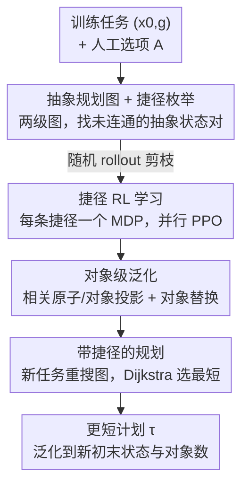

# SLAP: Shortcut Learning for Abstract Planning

**会议**: ICLR 2026  
**OpenReview**: [https://openreview.net/forum?id=enprG5H9aD](https://openreview.net/forum?id=enprG5H9aD)  
**代码**: https://github.com/isabelliu0/SLAP  
**领域**: 机器人 / 任务与运动规划 / 强化学习  
**关键词**: 抽象规划, TAMP, 选项发现, 强化学习, 长程操作  

## 一句话总结
SLAP 在已有 TAMP 技能（pick/place/move）诱导出的抽象规划图上，用无模型 RL 自动学一批"捷径选项"（如把障碍塔一掌拍开的 slap），让规划器在评测时把这些捷径当成新边来搜更短的路径，在四个仿真机器人环境中把执行长度砍掉 50% 以上，同时成功率全面超过纯规划与纯 RL。

## 研究背景与动机
**领域现状**：长程、稀疏奖励、连续状态与动作的机器人决策一直是难题。任务与运动规划（TAMP）是经典的基于模型方案，它把问题在抽象层（符号状态）和底层（连续运动）两级上分层规划，靠人手工定义的"选项/技能"（option，如 pick、place、move）把一个抽象状态带到另一个抽象状态。

**现有痛点**：这些技能全是人工编程的，agent 只能做工程师知道怎么写的事。更关键的是 TAMP 的底层假设——机器人只用指尖接触物体、每个技能只影响预先指定的一小撮物体（STRIPS 假设）——把很多又快又"野"的解法挡在门外。比如要把一摞障碍块清开再放目标块，TAMP 只会老老实实一个个 unstack，解法满足约束却又长又笨。

**核心矛盾**：纯规划（TAMP）有长程推理和泛化能力但受限于人工技能、解法冗长；纯 RL / 分层 RL 灵活、能即兴发挥，但在长程稀疏奖励的操作任务上几乎学不出来（奖励只在任务完成时才给）。两边各有一半优点，没人把它们接上。

**本文目标**：在"已有一小撮人工技能可用"这个实用设定下，自动发现一批新技能，让整体规划的执行时间（=步数）更短，同时不牺牲成功率，也不需要用户额外输入。

**切入角度**：作者的关键观察是——已有技能本身就在抽象状态空间里诱导出一张"抽象规划图"，图里两个抽象状态之间如果没有现成的选项直连，那中间就藏着一条潜在"捷径"。与其从零学技能（tabula rasa HRL 在长程操作上一直不灵），不如让 RL 专门去学这些捷径，用规划图的高层结构来引导底层学习。

**核心 idea**：用无模型 RL 在抽象规划图里学"捷径选项"，把学到的捷径加回选项集合让规划器自由选用——SLAP 由此在"纯规划"和"纯 RL"之间自动滑动：捷径太难学就退化成纯规划，任务足够简单则整条计划坍缩成一条捷径变成纯 RL。

## 方法详解

### 整体框架
SLAP 要解决的是"给定一组人工选项，怎么自动学出更短的执行计划"。整体分两段：**离线训练**先在训练任务上构建抽象规划图、枚举候选捷径、剪枝后为每条存活捷径单独跑 RL 学一个策略；**在线评测**时把这些学到的捷径策略并入原选项集合，对新任务重新搜图，规划器会在捷径能缩短计划时自动选用它们，失败的捷径边则被剪掉。整条管线对用户是即插即用的——想提升某个抽象规划器的执行效率，挂上 SLAP 就行。

形式化设定上，环境是全观测、确定性的，状态 $x \in X$ 与动作 $u \in U$ 连续，转移函数 $f: X \times U \to X$ 已知（如物理仿真器）。任务是目标式的 $(x_0, g)$，解是一条到达目标的轨迹 $\tau$，目标是最小化 $|\tau|$（步数，固定频率下等价于执行时间）。agent 还能访问一个把状态空间分块得到的抽象状态空间 $S$，选项 $a$ 由初始抽象状态 $s^a_{\text{init}}$、终止抽象状态 $s^a_{\text{term}}$ 和策略 $\pi_a$ 三元组刻画，假设给定的有限选项集 $A$ 足以解出任务分布里的目标（但解往往在执行时间上很次优）。

### 关键设计

**1. 抽象规划图与最短路求解：把"执行时间最优"变成可搜索的图问题**

要找执行时间最短的解，SLAP 先把规划组织成一张两级图。顶层节点是抽象状态 $s$、边是选项 $a$；底层节点是环境状态 $x$、边是环境动作 $u$；两级耦合在于底层一段边序列对应顶层一次选项执行。建图从根节点 $x_0$ 和 $\text{abstract}(x_0)$ 出发，用已知转移函数 $f$ 模拟各选项、广度优先扩展，直到出现满足目标的节点。建好后在底层跑任意最短路算法（如 Dijkstra）就能拿到执行时间最小的解。这张双级图沿用了此前 bilevel 规划工作的构造方式，意义在于：它把"哪段路更省时间"显式化为图上的边权，为后面"插入捷径边"提供了统一载体——捷径无非就是给这张图加一条原本不存在的近路。

**2. 捷径的 RL 学习与随机 rollout 剪枝：让 RL 只啃有希望的近路**

一条捷径定义为选项 $\hat{a} = \langle s_{\text{init}}, \pi_\theta, s_{\text{term}} \rangle$，其中 $(s_{\text{init}}, s_{\text{term}})$ 是一对**尚未被任何现成选项连通**的抽象状态，$\pi_\theta$ 是待学策略。图 1 里的 slap 就是这样一条捷径：从"手里拿着目标块"直接到"目标区域被清空"，绕过了逐个搬障碍的冗长路径。每条捷径对应一个无定界 MDP：状态/动作/转移沿用环境，奖励恒为 $R(x) = -1$（每多走一步多扣一分，从而最小化步数），终止于 $s_{\text{term}}$。初始状态分布不假设能直接从 $s_{\text{init}}$ 采样，而是从训练任务的抽象规划图中遇到过的状态里采，然后用 PPO 学策略，多条捷径的 MDP 并行训练。

问题在于潜在捷径数是 $O(|S|^2)$，规模可能巨大、全学一遍不现实。作者提出一个朴素但有效的剪枝：对每条捷径 MDP，先从初始态跑 $N_{\text{rollout}}$ 条最长 $T_{\text{rollout}}$ 的随机 rollout，如果在少于 $K_{\text{rollout}}$ 条 rollout 里都到不了 $s_{\text{term}}$，就把这条捷径剪掉、根本不跑 RL。直觉是 RL 需要一点初始成功来 bootstrap，连随机都偶尔撞不到终点的捷径基本没戏。正是这个剪枝把候选从平方级压到可训练的量级（如 Obstacle Tower 剪后剩 92 条）。

**3. 带捷径规划与"规划↔学习"光谱：失败捷径自动剔除，难度自适应**

评测拿到新任务时，跑和训练时一样的抽象规划器，只是把学到的捷径策略并入原选项集 $A \cup \hat{A}$ 一起搜图。因为捷径策略可能失败，规划时检查它能否在 $T_{\text{eval}}$ 步内到达目标抽象状态，失败就把这条边剪掉；成功且能缩短计划的捷径会被规划器自动选中。这套机制让 SLAP 在"纯规划"和"纯 RL"之间自适应滑动：给定选项已最优或捷径太难学时，SLAP 退化为纯规划；环境简单到能直接从初始态 RL 到目标时，整条计划坍缩成一条捷径、SLAP 退化为纯 RL；多数情况落在中间，自动找到规划与学习的折中。泛化上，状态泛化由捷径策略本身提供（不要求完美，部分捷径在部分任务有效就已优于纯规划），目标泛化由规划器对每个新目标重新搜索来保证。

**4. 对象级泛化：用相关原子投影 + 对象替换迁移捷径**

TAMP 通常假设状态由对象和关系定义，SLAP 借同样的归纳偏置实现对象数泛化。每个状态 $x$ 由对象集 $O$ 和每个对象的特征向量 $\alpha(o, x)$ 定义，抽象状态由原子（对象间的离散关系，如 $\text{on}(B,C)$、$\text{holding}(A)$）刻画。对一条捷径 $\hat{a}$，定义 $\text{add}(\hat{a})$ 为 $s_{\text{term}}$ 有而 $s_{\text{init}}$ 没有的原子、$\text{del}(\hat{a})$ 反之，二者涉及的对象构成相关对象集 $\text{rel}(\hat{a})$。训练时用状态投影 $\text{proj}_{\hat{a}}(x) = \alpha(o_1, x) \circ \cdots \circ \alpha(o_k, x)$（只拼接相关对象的特征）作为观测，于是往环境里加无关对象对策略毫无影响。评测遇到新对象时，agent 找一个保类型的单射对象映射 $\sigma$，使训练捷径的 add/del 原子在替换后被新捷径的 add/del 覆盖，匹配上就把对应学到的策略用替换后的对象部署。这正是 slap 策略只把一部分障碍判为"相关"、却物理上把整摞塔都拍开的来源——它学的是关系层面的捷径，对象数变了也能套。

### 损失函数 / 训练策略
捷径 MDP 的奖励是每步 $-1$ 的稠密时间惩罚，等价于最小化步数；所有 PPO 策略（捷径学习、纯 RL、分层 RL）共享同一网络结构与超参，仅给 RL baseline 更长训练步数和更高熵系数以利探索。每个策略训 500,000 步，用 stable-baselines3 实现，结果对 5 个随机种子取平均。

## 实验关键数据

在 Obstacle 2D、Obstacle Tower、Cluttered Drawer、Cleanup Table 四个长程稀疏奖励仿真机器人环境上评测（后三者为 PyBullet 中 7-DoF Franka Panda 机械臂，含 Objaverse 真实 3D 物体）。每环境采 10 个训练任务、10 个held-out 评测任务，指标为成功率与计划长度（=执行步数）。

### 主实验

| 环境 | 方法 | 成功率 | 计划长度 | 相对路径长度 |
|------|------|--------|---------|------|
| Obstacle 2D | SLAP（本文） | 100% | 17.6 | ↓32% |
| Obstacle 2D | Pure Planning | 100% | 25.9 | 0% |
| Obstacle 2D | PPO / SAC+HER | 0% | 100（封顶） | N/A |
| Obstacle Tower | SLAP（本文） | 100% | 79.2 | ↓68% |
| Obstacle Tower | Pure Planning | 100% | 245.8 | 0% |
| Obstacle Tower | 分层 RL / SOL | 0% | 500（封顶） | N/A |
| Cluttered Drawer | SLAP（本文） | 100% | 165.8 | ↓53% |
| Cluttered Drawer | Pure Planning | 100% | 352.1 | 0% |
| Cleanup Table | SLAP（本文） | 100% | 115.2 | ↓73% |
| Cleanup Table | Pure Planning | 100% | 431.8 | 0% |

SLAP 在四个环境都保持 100% 成功率，把计划长度相对纯规划最多砍掉 73%。纯 RL（PPO、SAC+HER）在所有环境成功率都是 0%（稀疏奖励学不出来）；分层 RL 和 SOL 虽然能用上预定义技能，但抓地技能数太多（Obstacle Tower 有 216 个 grounded skill，而 SOL 原论文的 NetHack 只有 2-3 个），高层控制器学不会选择序列，除最简单的 Obstacle 2D 外几乎全军覆没。

### 消融实验

| 配置 | 现象 | 说明 |
|------|------|------|
| 训练步数分析（Q3） | 步数↑ → 学成的捷径数↑、计划长度↓ | 剪枝后候选数 11/92/74/54，500k 步内计划长度持续下降 |
| Independent（默认） | 计划最短 | 每条捷径单独学一个策略 |
| Abstract Subgoals | 比 Independent 长 | 共享单一策略 + 抽象终止态 multi-hot 编码 |
| Abstract HER | 比 Independent 长 | 在 Abstract Subgoals 基础上加 hindsight 目标重标 |
| 对象泛化（Q4） | 物体数增加时计划长度仍短 | 训练 3 障碍塔，测试不同障碍/干扰物数 + 2× 质量摩擦 |

### 关键发现
- **剪枝是规模可行的关键**：把 $O(|S|^2)$ 的候选捷径压到几十~上百条才让并行 RL 训得动；随机 rollout 撞不到终点的捷径直接放弃，省下算力给有希望的近路。
- **独立学习反超共享策略**：直觉上共享表示该更省样本，但 Independent 一致优于 Abstract Subgoals/HER，作者推测共享策略会把资源浪费在学不会的不可行捷径上，而独立学习对这些捷径"直接学不出来"反而不拖累其它。
- **对象级泛化真实有效**：在 Obstacle Tower 上训 3 障碍塔，测试时换障碍数、加干扰物、翻倍质量摩擦，SLAP 计划长度几乎不涨，而纯规划随障碍数线性变长——因为 slap/wiggle/wipe 这类多物体技能突破了 TAMP 的单物体接触假设。

## 亮点与洞察
- **"在已有结构里挖近路"而非"从零造技能"**：把 HRL 的选项发现问题，重构成"抽象规划图上的最短路 + 补边"，既复用了 TAMP 的长程推理与泛化，又让 RL 只负责它擅长的局部即兴动作，绕开了 tabula rasa HRL 在长程操作上的老大难。
- **规划↔RL 的连续光谱**：同一套方法在两个极端自动退化为纯规划或纯 RL，中间自适应折中——这个"即插即用、难度自适应"的定位很优雅，用户无需调档位。
- **关系归纳偏置直接拿来做技能迁移**：用 add/del 原子 + 对象替换把捷径策略迁移到新对象，这套从 TAMP 借来的符号机制让一个学到的 slap 能套到不同数量的障碍上，是连续 RL 策略少有的强组合泛化。
- 用每步 $-1$ 的稠密时间惩罚把"最小化执行时间"直接编进捷径 MDP 奖励，简单但正中目标。

## 局限与展望
- **无法偏离用户选项给的问题分解**：SLAP 只在已有选项诱导的图上补近路，改不了高层分解本身；未来可让选项提供"软"分解再由 HRL 进一步优化。
- **规划器从 TAMP 角度看很简单**：刻意不加启发式/连续技能优化以隔离捷径学习的效果，扩到超大抽象空间需要更高级的规划技术。
- **依赖"给定选项足以解任务"假设 + 需要仿真器**：去掉前者 SLAP 仍可用但失去成功率保证；学到的捷径行为超出人工选项集合，执行可能不如传统 TAMP 可预测（未来可加安全约束）。另一方向是用 real-to-sim-to-real 重建近似仿真器再学捷径，摆脱对仿真器的依赖。

## 相关工作与启发
- **vs 纯 TAMP / 学习加速 TAMP**：以往工作要么学状态/动作抽象让 TAMP 可行，要么学启发式/编译策略加速规划过程本身；SLAP 假设抽象已给定，专注学**新的底层行为**来缩短执行时间，是正交的提升。
- **vs 学恢复策略的工作**：那类工作用 RL 在执行偏离抽象计划时把机器人拉回抽象状态；SLAP 假设给定技能足够鲁棒、不需恢复，转而提升解的效率。
- **vs 分层 RL（MAPLE / SOL 等）**：HRL 通常假设高层先验已知、学底层技能，但高层控制器在 grounded skill 数巨大时学不会选择序列；SLAP 不学高层选择，而是把高层决策交给规划器搜索，RL 只即兴底层捷径，因此在长程操作上成功率碾压 HRL。

## 评分
- 新颖性: ⭐⭐⭐⭐⭐ 首个学底层技能以提升抽象规划器执行时间的方法，"图上补捷径"的框架统一了规划与 RL。
- 实验充分度: ⭐⭐⭐⭐ 四个环境 + 多 baseline + 训练动态/对象泛化/策略学习多角度消融，但环境均为仿真、规划器刻意从简。
- 写作质量: ⭐⭐⭐⭐⭐ 动机用"小孩一掌拍开障碍"讲得极清楚，形式化与算法伪码完整。
- 价值: ⭐⭐⭐⭐⭐ 即插即用、难度自适应，给 TAMP 系统提效提供了通用且可泛化的新范式。

<!-- RELATED:START -->

## 相关论文

- [\[ICLR 2026\] ExoPredicator: Learning Abstract Models of Dynamic Worlds for Robot Planning](exopredicator_learning_abstract_models_of_dynamic_worlds_for_robot_planning.md)
- [\[ICLR 2026\] Planning with an Embodied Learnable Memory](planning_with_an_embodied_learnable_memory.md)
- [\[ICLR 2026\] Compositional Diffusion with Guided Search for Long-Horizon Planning](compositional_diffusion_with_guided_search_for_long-horizon_planning.md)
- [\[ICLR 2026\] MomaGraph: State-Aware Unified Scene Graphs with Vision-Language Models for Embodied Task Planning](momagraph_state-aware_unified_scene_graphs_with_vision-language_models_for_embod.md)
- [\[ICLR 2026\] Experience-based Knowledge Correction for Robust Planning in Minecraft](experience-based_knowledge_correction_for_robust_planning_in_minecraft.md)

<!-- RELATED:END -->
