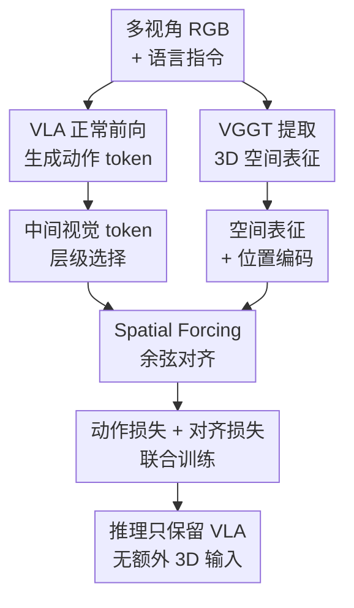

# Spatial Forcing: Implicit Spatial Representation Alignment for Vision-language-action Model

**会议**: ICLR2026  
**OpenReview**: [https://openreview.net/forum?id=euMVC1DO4k](https://openreview.net/forum?id=euMVC1DO4k)  
**论文**: [https://spatial-forcing.github.io/](https://spatial-forcing.github.io/)  
**代码**: 无公开仓库  
**领域**: 机器人 / VLA / 空间表征对齐  
**关键词**: VLA, 空间感知, 机器人操作, 表征对齐, 3D基础模型  

## 一句话总结
Spatial Forcing 用预训练 3D 基础模型 VGGT 的几何 latent 来监督 VLA 的中间视觉 token，使机器人策略在推理时不额外输入深度图或点云，也能学到更强的空间理解，并在 LIBERO、RoboTwin 和真实机器人任务上提升成功率、收敛速度和数据效率。

## 研究背景与动机
**领域现状**：近年的 vision-language-action（VLA）模型通常从 VLM 继承图像和语言理解能力，再通过 action tokenization、action expert 或 flow matching head 输出机器人动作。这样的路线能把大规模 2D 视觉语言预训练迁移到机器人控制，但它的视觉骨干大多只在 2D 图像上训练，看到的是语义丰富但几何不够可靠的图像表征。

**现有痛点**：机器人操作恰恰依赖 3D 世界里的相对位置、高度、遮挡和接触关系。已有 3D VLA 往往把深度图、点云或估计出的 3D cue 显式塞进输入端，但真实机器人里的深度传感器会受噪声、反光、遮挡和标定影响，不同平台的传感器配置也不统一；更麻烦的是，大量已有机器人数据集本身没有深度信息，显式 3D 输入会限制可扩展性。

**核心矛盾**：VLA 的动作 token 是条件在前面的视觉 token 和语言 token 上生成的，所以真正影响动作精度的不是模型最终能否“看懂一句话”，而是中间视觉 token 是否已经携带足够可靠的空间结构。显式加 3D 传感器可以补几何信息，却牺牲了硬件通用性；只靠 2D 预训练又无法保证视觉 token 里有可用于控制的 3D cue。

**本文目标**：作者希望找到一种更通用的训练范式：训练时借助外部 3D 先验把 VLA 的视觉表征往空间结构上拉，推理时仍然只用常规多视角 RGB 图像和语言指令，不增加深度输入、点云分支或额外推理开销。

**切入角度**：论文先做了一个 lightweight depth probing：冻结普通 VLA，只训练一个 DPT head 从 VLA 视觉 embedding 预测深度。结果显示未对齐的视觉 embedding 很难恢复出有意义的空间结构，而经过空间监督后的 embedding 能生成更接近真实深度的结果。这说明 VLA 中间层确实是一个可以被“塑形”的位置。

**核心 idea**：Spatial Forcing 的核心是“训练时用 VGGT 的 3D 几何表征对齐 VLA 中间视觉 token，推理时丢掉 3D teacher，只保留被迫学会空间感知的 VLA”。

## 方法详解

### 整体框架
Spatial Forcing（SF）不是给 VLA 新增一个显式 3D 输入分支，而是在训练期间把 VLA 的中间视觉 token 当作可监督的场景表示。给定机器人多视角图像和语言指令，VLA 正常生成动作；与此同时，同一组图像被送入预训练 3D 基础模型 VGGT，VGGT 产生的 pixel-level spatial representation 作为 teacher signal，监督 VLA 某一层的视觉 token 对齐到更几何化的表征空间。推理阶段只运行 VLA 本身，VGGT 和对齐损失都不参与，因此没有额外传感器依赖和推理开销。

从 VLA 的形式看，模型先把多视角图像编码成视觉 token ${x_i^V}_{i=1}^N$，把语言指令编码成语言 token ${x_j^L}_{j=1}^M$，再自回归地产生动作 token：$x_t^A \sim p_\theta(x_t^A \mid \{x_i^V\}_{i=1}^N, \{x_j^L\}_{j=1}^M, x_{<t}^A)$。这条公式决定了为什么作者监督的是中间视觉 token，而不是只在输出动作上加约束：动作专家能否预测正确的轨迹，很大程度取决于它从前面的视觉 token 里读到的空间结构是否可靠。

### 关键设计
**1. 用 VGGT latent 做隐式 3D teacher：绕开深度传感器依赖**

SF 选择 VGGT（Visual Geometry Grounded Transformer）作为外部空间表征来源。VGGT 可以从一组 2D 图像直接预测相机参数、点图、深度图和点轨迹等 3D 属性；本文并不把这些显式 3D 输出喂给 VLA，而是使用 VGGT transformer backbone 的 latent representation 作为监督信号。这样做的好处是，VLA 不需要在输入端接收深度图或点云，也不需要依赖某个单独深度估计器的输出质量，但训练信号仍然来自一个已经学到多视角几何结构的模型。

这里的“隐式”很关键：SF 不要求机器人部署时也带着 VGGT 运行。VGGT 只在训练时提供表征方向，迫使 VLA 的视觉 token 逐渐包含深度、相对位置和视角一致性等信息；一旦训练完成，VLA 本身就承担空间理解。相比显式 3D VLA，这更适合传感器配置差异很大的机器人数据，也能利用那些只有 RGB 图像的大规模 demonstration 数据。

**2. 对齐中间视觉 token：把空间信息放到动作生成真正会读取的位置**

作者不是对最终 hidden state 或动作输出做几何约束，而是选取 VLA 某个 causal attention layer 之后的视觉 token $x_i^V$，先经过 batch normalization $\Gamma$ 和两层 MLP 做维度适配，再与 VGGT 对应位置的空间表征做 cosine alignment。核心损失可以写成 $L_{align}=-\frac{1}{N}\sum_{i=1}^{N}S(MLP(\Gamma(x_i^V)), f_i^{3D}(I)+E)$，其中 $f_i^{3D}(I)$ 是 VGGT 在对应像素位置的空间 representation，$E$ 是额外的位置编码。

这一步解决的是 VLA 里一个容易被忽略的问题：视觉 token 在自回归生成中不仅是“输入”，也是动作 token 逐步查询的中间场景记忆。如果这些 token 本身缺少 3D 结构，动作 expert 再强也只能在贫弱的空间表示上拟合；把监督加在 token 层，就等于在动作生成前把场景表征校准到几何更合理的状态。

**3. 位置编码与层级选择：既保留 token 顺序，也避免过深层丢掉视觉性**

论文发现，在 VGGT target representation 上加入 positional embedding 对长时序任务尤其有帮助。原因在于 VLA 的视觉 token 会在 causal attention 里以特定顺序参与动作生成，相同的几何特征如果失去位置顺序，就很难表达“左侧碗”“右侧蔬菜”“高处方块”这类操作约束。位置编码 $E$ 让 teacher signal 不只是一个抽象 3D feature，还保留了 token 在图像和自回归序列中的相对位置。

对齐层也不是越深越好。作者在 32 层 VLM backbone 中比较了第 1、8、16、24、32 层，发现相对深但非最深的第 24 层效果最好。直觉上，太浅的层还没有形成足够全局的任务相关表示，约束它可能在后续层被冲淡；太深的层又已经更接近语言-动作融合后的 modality-agnostic space，视觉专属性下降，不适合直接对齐 3D teacher。第 24 层处在两者之间，既能影响后续动作生成，又仍保留足够视觉结构。

**4. 联合动作训练与无开销推理：让空间监督服务于控制目标**

SF 最终的目标函数是 $L_{SF}=L_{action}+\alpha L_{align}$。其中 $L_{action}$ 仍然是原 VLA 的动作学习损失，例如 $L1$、$L2$、cross-entropy 或 flow matching 相关损失；$L_{align}$ 只是给视觉表征提供空间方向。附录的权重实验显示，$\alpha$ 太小约束不足，太大会扰乱 VLA 原有视觉模态和动作预测，默认 $\alpha=0.5$ 在对应设置下取得最好结果。

这个设计的价值在部署端尤其明显。训练时 SF 像一个空间老师，推理时老师退场，模型的输入输出接口与原始 VLA 完全一致。对于真实机器人系统来说，这意味着不需要额外标定深度传感器，不需要引入点云处理链路，也不会因为 3D 分支增加推理延迟；收益来自训练期间被重塑过的视觉 token。

### 一个完整示例
假设机器人收到指令“拿起 ramekin 上的黑色碗并放置到目标位置”，输入包括主视角和腕部相机的 RGB 图像。普通 2D VLA 可能能识别“黑色碗”和“ramekin”，但它的中间视觉 token 未必能稳定表达碗在 ramekin 上方、夹爪与碗的相对深度、以及抓取路径中的高度变化。

使用 SF 训练时，这组多视角图像会同时进入 VGGT。VGGT 的 latent 会编码多视角一致的几何结构，例如桌面、碗、容器和夹爪之间的空间关系；VLA 在第 24 层附近的视觉 token 则被 MLP 映射后与这些 latent 做余弦对齐。动作损失继续要求模型输出正确的抓取和放置轨迹，对齐损失则迫使模型在生成动作前就把“哪个物体在上面、哪里有可抓取边缘、夹爪应该从哪个空间方向接近”这类信息写入视觉 token。等到推理时，VGGT 不再出现，但 VLA 的视觉 token 已经更接近空间化表征，因此面对光照变化、目标替换或高度变化时更不容易只依赖颜色和背景捷径。

### 损失函数 / 训练策略
训练目标由动作预测损失和表征对齐损失组成。对 OpenVLA-OFT 的 LIBERO 实验，作者基于 OpenVLA-OFT 训练 150k iterations，并在 8 张 H100 上进行主要 SOTA 对比；组件分析受算力限制使用单张 H100。对 RoboTwin，作者基于 $\pi_0$ 并使用 LoRA 在单张 H100 上训练 30k iterations。不同 base model 的动作头可以不同，SF 不依赖具体 action expert，只需要能取到中间视觉 token。

对齐 target 默认使用 VGGT latent，并添加 positional embedding。主实验中作者固定对齐相对深层的视觉 token；附录还给出一个 adaptive layer selection 策略，用类似 soft gating 的方式对多层视觉 token 加权混合，再计算对齐损失。这个自适应版本在 LIBERO 平均成功率上进一步从固定第 24 层的 96.9% 提升到 98.1%，说明“对齐哪一层”本身也是一个值得优化的空间。

## 实验关键数据

### 主实验
LIBERO 是本文最清楚展示方法定位的主实验：SF 不额外使用深度图或点云，却超过了强 2D VLA baseline，也接近甚至超过一些显式 3D VLA。尤其是在 Long 任务上，空间表征质量会影响长时序执行的每一步误差积累，因此平均 98.5% 的结果说明这种中间表征监督不是只改善短程定位。

| 方法类别 | 方法 | Spatial SR | Object SR | Goal SR | Long SR | Average SR |
|----------|------|------------|-----------|---------|---------|------------|
| 2D VLA | $\pi_0$ | 96.8 | 98.8 | 95.8 | 85.2 | 94.2 |
| 2D VLA | UniVLA | 96.5 | 96.8 | 95.6 | 92.0 | 95.2 |
| 2D VLA | OpenVLA-OFT | 97.6 | 98.4 | 97.9 | 94.5 | 97.1 |
| 显式 3D VLA | GeoVLA | 98.4 | 99.0 | 96.6 | 96.6 | 97.7 |
| 显式 3D VLA | 3D-CAVLA | 98.2 | 99.8 | 98.2 | 96.1 | 98.1 |
| 隐式 3D VLA | Spatial Forcing | 99.4 | 99.6 | 98.8 | 96.0 | 98.5 |

RoboTwin 实验使用 $\pi_0$ 作为 base model，在 easy 和 hard 两类双臂操作任务上评估。论文图中给出的结论是 SF 在平均成功率上最高，并在 hard setting 中提升更明显；这类 hard setting 包含场景杂乱、背景纹理、光照变化和桌面高度变化，更能检验模型是否真正捕捉目标相对空间关系，而不是记住环境捷径。

| 基准 | Base model | 评估设置 | 主要结论 |
|------|------------|----------|----------|
| LIBERO | OpenVLA-OFT | 四个任务 suite，每任务 500 trials | SF 平均 98.5%，超过 OpenVLA-OFT 97.1% 和显式 3D baseline 3D-CAVLA 98.1% |
| RoboTwin 2.0 | $\pi_0$ | easy 每任务 100 trials，hard 每任务 300 trials | SF 获得最高平均成功率，hard tasks 上增益更明显 |
| 真实机器人 | AgileX 双臂平台 | 单臂每任务 40 trials，双臂任务 20 trials | SF 在光照、目标、高度和双臂平衡变化下均优于无 SF baseline |

### 消融实验
组件分析显示，SF 的收益既来自“对齐中间表征”这个范式，也来自 VGGT target 中的 3D 几何质量。把 target 换成 SigLIP 或 DINOv2 也能比 baseline 更好，说明表征监督本身有效；VGGT + positional embedding 最强，说明机器人控制真正缺的是与空间结构相关的视觉 token。

| 配置 | Spatial SR | Object SR | Goal SR | Long SR | Average SR | 说明 |
|------|------------|-----------|---------|---------|------------|------|
| Baseline，无对齐 | 96.8 | 94.8 | 92.8 | 86.2 | 92.7 | 单张 H100 组件分析的基线 |
| SigLIP target | 95.2 | 94.8 | 94.0 | 91.8 | 94.0 | 2D 图文对齐表征也能带来一定监督 |
| DINOv2 target | 93.4 | 95.2 | 93.8 | 93.8 | 94.1 | 细粒度 2D grounding 有帮助，但不如 3D teacher |
| VGGT w/o PE | 97.8 | 100.0 | 96.6 | 84.4 | 94.7 | 空间 latent 有效，但长程任务受位置顺序影响 |
| VGGT + PE | 97.2 | 99.2 | 96.8 | 94.2 | 96.9 | 最强 target 设置，Long 任务明显改善 |

对齐层的实验进一步说明，SF 不是简单“哪层都拉向 VGGT”即可。第 24 层平均 96.9% 最好，第 32 层虽然 Spatial 和 Object 很高，但 Long 只有 84.8%；这支持作者关于深层视觉专属性逐渐减弱的解释。

| 对齐层 | Spatial SR | Object SR | Goal SR | Long SR | Average SR |
|--------|------------|-----------|---------|---------|------------|
| 第 1 层 | 96.8 | 99.4 | 99.0 | 83.0 | 94.6 |
| 第 8 层 | 96.2 | 98.4 | 95.6 | 92.4 | 95.7 |
| 第 16 层 | 97.4 | 98.8 | 95.8 | 83.2 | 93.8 |
| 第 24 层 | 97.2 | 99.2 | 96.8 | 94.2 | 96.9 |
| 第 32 层 | 98.8 | 99.4 | 96.2 | 84.8 | 94.8 |
| Adaptive | 98.6 | 99.4 | 98.8 | 95.4 | 98.1 |

训练效率和数据效率是本文比较实用的结果。SF 在相同成功率下最高实现 3.8× 更快收敛；在相同数据量下也更强，并能用 5% 数据达到 75.8% 平均成功率。对真实机器人尤其重要，因为真实 demonstration 成本远高于仿真数据。

| 实验维度 | 设置 | Average SR | 说明 |
|----------|------|------------|------|
| 训练 2k iterations | VGGT + PE | 72.7 | 早期训练已经可用 |
| 训练 5k iterations | VGGT + PE | 87.5 | 相比普通训练收敛更快 |
| 训练 20k iterations | VGGT + PE | 93.7 | 接近高性能区间 |
| 训练 50k iterations | VGGT + PE | 96.5 | 接近 150k 的最终结果 |
| 训练 150k iterations | VGGT + PE | 96.9 | 组件分析固定设置 |
| 1% 数据 | VGGT + PE | 42.3 | 极低数据下仍可学习部分空间 cue |
| 5% 数据 | VGGT + PE | 75.8 | 论文报告约 5.9× 数据效率收益 |
| 100% 数据 | VGGT + PE | 96.9 | 完整数据设置 |

### 关键发现
- VGGT target 明显优于 SigLIP 和 DINOv2 target，说明 VLA 操作缺的不是普通视觉语义，而是能服务于控制的几何结构。
- positional embedding 对 Long 任务特别关键：VGGT w/o PE 的 Long SR 只有 84.4%，加入 PE 后到 94.2%，说明 token 顺序和空间位置不能被当成可有可无的细节。
- 对齐第 24 层比第 32 层更稳，说明最深层可能已经过度融合语言和动作信息，直接施加 3D 视觉监督反而不合适。
- 真实机器人结果显示，SF 在 stack glass cups、grasp right-side vegetable、place green block 和 lift pot 中都提升成功率；其中 place green block 达到 85.0%，反映出对高度变化的空间估计能力。
- 论文的 probing 和 t-SNE 分析都支持一个解释：SF 让 VLA feature 的相对结构更接近 3D teacher，但没有把 VLA feature 完全塌缩成 VGGT feature，仍保留了自身模态身份。

## 亮点与洞察
- 最巧妙的地方是把 3D 信息从“输入模态”改成“训练监督”。这让方法避开了深度传感器质量、硬件异构和数据集缺深度三重问题，同时又没有放弃 3D 基础模型已经学到的几何先验。
- SF 选中的是动作生成会直接依赖的中间视觉 token，而不是只在外部加一个辅助任务。这个位置很自然：如果视觉 token 已经空间化，后续 action expert 就能用更好的场景记忆预测动作。
- depth probing 是一个很有解释力的诊断工具。它不直接证明机器人动作一定更好，但能揭示普通 VLA embedding 里缺少可恢复的空间结构，为为什么要做表征对齐提供了直观证据。
- 对齐目标不必是显式深度图。VGGT latent 这种更高维的几何表征可能比单一 depth map 更适合作为 teacher，因为它同时吸收了多视角一致性、点图和相机几何等信息。
- 这个思路可以迁移到其他 embodied AI 任务：例如导航、移动操作、3D 场景问答都可以尝试用 3D foundation model 的 latent 监督中间视觉 token，而不是在推理时强行引入额外传感器。

## 局限与展望
- SF 依赖 VGGT 这样的 3D foundation model 作为 teacher；如果 VGGT 在机器人视角、透明物体、强反光或动态遮挡场景中产生偏差，对齐信号也可能把偏差传给 VLA。
- 论文主要展示了 LIBERO、RoboTwin 和若干真实机器人任务，虽然覆盖仿真和真实平台，但真实任务数量、场景复杂度和长期连续部署仍然有限，还不能说明所有机器人形态都能直接受益。
- 对齐层和权重 $\alpha$ 对结果很敏感。固定第 24 层和 $\alpha=0.5$ 在本文设置下有效，但换成其他 VLA backbone、动作头或相机配置时，可能需要重新搜索或使用 adaptive layer selection。
- SF 训练时需要额外跑 VGGT 生成 teacher representation，这会增加训练成本和工程复杂度。虽然推理无开销，但大规模机器人数据训练时仍需要考虑 teacher 预计算、存储和吞吐。
- 一个有价值的后续方向是把 SF 与显式 3D 输入结合：当深度传感器可靠时使用显式几何，当深度缺失或噪声大时使用隐式对齐，形成更鲁棒的 hybrid VLA。

## 相关工作与启发
- **vs SpatialVLA**: SpatialVLA 通过 depth-derived Ego3D position encoding 和 adaptive action grids 显式注入空间信息；SF 不在推理输入中加入深度，而是在训练时对齐中间视觉 token，因此部署接口更轻，也更适合只有 RGB 的数据。
- **vs GeoVLA / 3D-CAVLA**: GeoVLA 和 3D-CAVLA 都利用点云、深度或 3D context 来增强动作预测，优势是几何输入直接；SF 的优势是不用额外传感器也能逼近甚至超过这些方法，劣势是几何能力来自 teacher 监督，无法在推理时显式纠正 teacher 未覆盖的空间误差。
- **vs ReconVLA / reconstruction supervision**: 重建式监督要求模型复原图像或关注区域，可能保留大量与控制无关的纹理细节；SF 用 alignment-based supervision 直接对齐几何表征，更强调空间结构而不是像素复原。
- **vs REPA / representation alignment for generation**: REPA 证明对齐中间 hidden states 能让生成模型更易训练；SF 把类似思想迁移到 VLA，并把 target 从通用视觉 encoder 换成 3D foundation model，从而让表征对齐服务于机器人空间控制。
- **vs depth estimator 辅助方法**: 深度估计方法通常先从 RGB 估出 depth，再把 depth 作为显式观察或辅助输入；SF 不依赖估计深度图的像素精度，而是使用更抽象的 VGGT latent 作为训练约束，减少了推理阶段的误差传播链条。

## 评分
- 新颖性: ⭐⭐⭐⭐☆ 把 3D foundation model latent 用作 VLA 中间 token 的隐式空间监督，思路简洁但切入位置很准。
- 实验充分度: ⭐⭐⭐⭐☆ 仿真、组件、效率、真实机器人和附录扩展都比较完整，但真实任务规模仍可继续扩大。
- 写作质量: ⭐⭐⭐⭐☆ 论文逻辑清楚，depth probing 和消融解释有说服力；部分 RoboTwin 数字主要在图中呈现，表格化程度略不足。
- 价值: ⭐⭐⭐⭐⭐ 对 VLA/机器人领域很实用，因为它在不增加推理传感器依赖的前提下补强空间能力，适合大规模 RGB demonstration 数据。

<!-- RELATED:START -->

## 相关论文

- [\[ICLR 2026\] From Spatial to Actions: Grounding Vision-Language-Action Model in Spatial Foundation Priors](from_spatial_to_actions_grounding_vision-language-action_model_in_spatial_founda.md)
- [\[ICLR 2026\] UniVLA: Unified Vision-Language-Action Model](unified_vision-language-action_model.md)
- [\[CVPR 2026\] Spatial-Aware VLA Pretraining through Visual-Physical Alignment from Human Videos](../../CVPR2026/robotics/spatial-aware_vla_pretraining_through_visual-physical_alignment_from_human_video.md)
- [\[ICLR 2026\] Spatially Guided Training for Vision-Language-Action Model](spatially_guided_training_for_vision-language-action_model.md)
- [\[ICML 2026\] Spatial Memory for Out-of-Vision Manipulation in Vision-Language-Action](../../ICML2026/robotics/spatial_memory_for_out-of-vision_manipulation_in_vision-language-action.md)

<!-- RELATED:END -->
