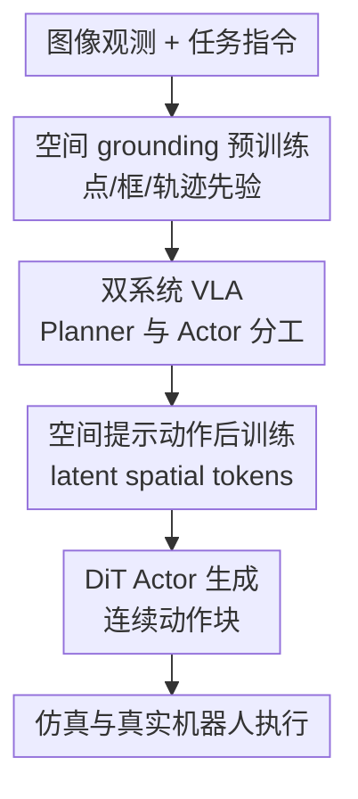

# Spatially Guided Training for Vision-Language-Action Model

**会议**: ICLR2026  
**OpenReview**: [https://openreview.net/forum?id=eKhOrQWAVJ](https://openreview.net/forum?id=eKhOrQWAVJ)  
**代码**: https://internrobotics.github.io/internvla-m1.github.io  
**领域**: 机器人 / VLA 训练  
**关键词**: 视觉语言动作模型, 空间 grounding, 机器人操作, spatial prompting, 双系统策略  

## 一句话总结

ST4VLA 通过先让 VLM 学会点、框、轨迹等空间先验，再在动作后训练阶段用空间提示把这些先验作为隐式规划条件注入 DiT 动作专家，显著缓解 VLA 训练中“会看但不会动”或“会动后忘了怎么看”的问题，并在 SimplerEnv、LIBERO、仿真大规模 pick-and-place 与真实机器人长程任务上取得更强泛化。

## 研究背景与动机

**领域现状**：当前通用机器人策略大致有两条路线。一条是层级式机器人系统：先用 VLM、检测器、分割器或 3D scene graph 做任务分解和空间定位，再把中间结果交给低层控制器执行。另一条是数据驱动的 VLA：把图像、语言和机器人轨迹放到同一个模型里端到端训练，让模型直接从指令预测动作。

**现有痛点**：层级式系统的优点是空间结构清楚，例如知道要抓哪个物体、放到哪个容器、轨迹大致怎么走；但它常依赖人工规则、手写规划器或固定任务模板，扩展到复杂桌面场景和长程任务时成本很高。端到端 VLA 更容易规模化，却容易把预训练 VLM 里原本有用的空间理解能力“洗掉”：动作数据的监督主要来自低层控制轨迹，文本指令相对稀疏，模型为了拟合动作模式会牺牲目标定位、可供性理解和轨迹推理。

**核心矛盾**：机器人控制既需要连续动作，又高度依赖离散而可迁移的空间先验。VLM 预训练已经学到大量视觉-语言知识，但普通 VLA 微调把这些知识直接暴露在动作损失下，容易出现空间 grounding 退化；简单把 grounding 数据和动作数据混在一起共同训练，又会产生两个目标的梯度冲突，导致感知和动作都不稳定。

**本文目标**：作者想解决的不是单个控制器结构问题，而是 VLA 的训练范式问题：如何在学习机器人动作时保留 VLM 的空间能力，如何让空间 grounding 目标和动作策略目标朝同一个方向优化，以及如何让这种空间先验真正服务于真实机器人操作和长程任务。

**切入角度**：论文的观察很直接：机器人任务里，“在哪里行动”和“怎样行动”不应该完全绑死。点、框、轨迹、物体关系等空间信息更接近跨任务、跨 embodiment 的通用知识；关节增量、末端执行器轨迹、夹爪开合则更接近 embodiment-specific 的控制知识。把二者拆开学习，再在动作训练时通过轻量条件连接起来，比让一个模型同时硬扛所有目标更合理。

**核心 idea**：用“空间 grounding 预训练 + 空间提示引导的动作后训练”代替普通 VLA 微调，让 VLM Planner 持续产生可迁移的空间隐式规划，DiT Actor 再把这些规划转成具体机器人动作。

## 方法详解

### 整体框架

ST4VLA 是一个双系统 VLA 框架：System 2 是较慢但更可靠的 VLM Planner，负责从图像和指令中提取语义与空间先验；System 1 是动作专家 DiT Actor，负责把这些先验和机器人观测转成连续控制动作。训练上分两步：第一步只强化 VLM 的空间 grounding 能力，第二步在动作后训练中用 spatial prompt 激活这些能力，并通过查询变换器把 VLM 的 latent spatial embeddings 送给动作专家。

这个框架最关键的地方是：空间信息没有被强制输出成显式框或点再交给规则控制器，而是作为 latent planning tokens 进入动作专家。这样既保留了端到端 VLA 的可训练性，又让动作模型在生成控制信号时始终能“看见”目标物体、空间关系和潜在轨迹。

### 关键设计

**1. 空间 grounding 预训练：先把机器人需要的空间常识刻进 VLM**

普通 VLM 的图文预训练不缺语义知识，但机器人需要的空间信号更具体：目标物体在哪里、空位在哪里、可抓取区域在哪里、末端执行器大概应沿什么轨迹运动。ST4VLA 的第一阶段把 web-scale 多模态 grounding 数据和机器人相关数据统一成问答格式，让 Qwen2.5-VL 风格的 Planner 在 supervised fine-tuning 中学习 box、point、trajectory 等输出。数据来源包括 RefCOCO、LLaVA-OneVision、RoboRefIt、A0、MolmoAct 以及作者构建的 ST4VLA manipulation 数据。

这一步的价值在于，它把“空间先验”从具体机器人 embodiment 里剥离出来。比如 bounding box QA 让模型学会按语言找物体，point QA 让模型学会指向目标或空位，trajectory QA 让模型学会用 2D 轨迹描述操作趋势。这些能力不直接等同于关节控制，但它们决定了动作专家应该围绕哪个物体、哪个容器、哪条路径生成动作。实验里也能看到，只有一般 grounding 数据会带来一定提升，而加入机器人 grounding 数据后 Where2Place、RoboRefit、A0 ManiSkill 以及 SimplerEnv 指标都明显上升，说明空间先验必须贴近操作场景才真正有用。

**2. 双系统 VLA：让 Planner 管“在哪里与做什么”，Actor 管“怎么动”**

ST4VLA 没有把 VLM 直接改造成一个单体动作模型，而是采用双系统结构。VLM Planner 作为 System 2，读取图像和语言，提供语义、目标和空间关系的 latent 表示；动作专家作为 System 1，用紧凑的 diffusion transformer 和 DINOv2 visual encoder 预测 embodiment-specific 动作。二者之间用一个只有 8.7 MB 的 querying transformer 连接，它把 VLM 中可变长度的 token 表示映射成固定数量的 learnable query tokens，再作为动作专家的条件。

这个设计避免了两个极端：如果完全显式规划，系统可能退回到手写规则和 brittle task decomposition；如果完全端到端，动作损失又会强烈改写 VLM 的空间表示。querying transformer 相当于一个轻量接口，只抽取动作专家需要的空间 latent，而不是让动作专家任意读写整个 VLM。论文还在这个接口里加入梯度衰减，例如把从 Action Expert 回传到 VLM 的梯度乘以 $0.5$，使 VLM 能参与联合优化，但不至于被动作目标拖到遗忘原有多模态知识。

**3. 空间提示动作后训练：用 prompt 激活空间先验，而不是硬性要求坐标输出**

第二阶段的核心不是简单 co-training，而是在动作数据上追加空间提示。比如原指令是“store all toys into the toy box”，训练时会扩展成类似“Identify all relevant toys and their spatial relationships to the container”的形式；默认统一 prompt 是“Figure out how to execute it, then locate the key object needed.”。这个提示不要求模型必须输出 box、point 或 trace，而是诱导 Planner 在 latent 表示中关注目标物体、容器和空间关系，再把这些 token 作为 DiT Actor 的条件。

为什么不强制输出坐标？作者的消融很有意思：Random Padding 只有 58.5 平均成功率，说明提升不是因为多了 token 长度；Box/Point/Trace prompting 分别能到 76.6、74.9、73.9，但默认 Unified Prompting 达到 77.9，反而最好。这说明对动作策略来说，空间语义要被激活，但不一定要被压成固定格式。过强的格式约束可能限制 Planner 的隐式推理空间，而宽松的 spatial prompt 能让模型按任务需要自动选择“关注框、点、轨迹还是关系”。

**4. 梯度对齐诊断：用 PSS 证明空间目标和动作目标是否同向**

论文不只报告最终成功率，还分析了空间 grounding 和动作学习在优化层面是否一致。作者定义 Projection-Space Similarity（PSS）来比较两类损失在共享 VLM 参数上的梯度子空间。给定空间 grounding batch 和动作 batch，分别得到梯度矩阵 $G_{spat}$ 与 $G_{act}$，再构造投影矩阵 $P_{spat}=G_{spat}G_{spat}^{+}$、$P_{act}=G_{act}G_{act}^{+}$，相似度为 $PSS(G_{spat},G_{act})=\frac{tr(P_{spat}P_{act})}{min(r_{spat},r_{act})}$。值越高，说明两个目标更新共享参数时越不互相拧巴。

这个指标解释了为什么普通 co-training 不够。Vanilla co-training 的 PSS 只有 0.25，空间数据和动作数据虽然同时存在，但优化方向并不一致；ST4VLA 通过空间预训练、spatial prompt 和受控梯度回传把 PSS 提到 0.42。对应到训练曲线，Vanilla VLA 的 RefCOCO-g 感知性能很快跌到接近随机，普通 co-training 虽保留了一点感知但指标震荡，而 ST4VLA 同时保留约 70% 原始 RefCOCO-g 能力，并在 WidowX 上更快达到 60% 成功率。

### 一个完整示例

假设机器人看到一张桌面图像，用户说“把葡萄放到篮子里”。普通 VLA 只接收图像和这句话，动作专家需要从有限轨迹数据里同时学会识别葡萄、找到篮子、决定抓取点和生成关节增量；一旦训练数据分布变化，比如篮子换颜色或桌面背景改变，就容易靠低层模式误判。

ST4VLA 的处理会更分层。第一阶段中，Planner 已经通过 box QA 学过“根据语言定位葡萄和篮子”，通过 point QA 学过“指出可抓取点或空位”，通过 trajectory QA 学过“从目标物体到容器的大致移动轨迹”。第二阶段接到“put the grapes on the basket”时，spatial prompt 会让 Planner 在 latent token 里激活“关键物体是葡萄、目标容器是篮子、动作趋势是抓取后移动到篮内”这类空间信息。querying transformer 把这些表示压成固定条件，DiT Actor 再结合当前 RGB 观测生成长度为 16 的连续动作块，例如接近、闭合夹爪、抬起、移动、放置。

如果执行中环境发生扰动，例如目标被轻微移动，Planner 的空间 token 会重新反映新的目标位置，Actor 接收的条件也会变化。这就是论文在真实长程任务里强调的点：模型不是只记住一段动作，而是在每个子任务上持续把空间关系转成可执行控制。

### 损失函数 / 训练策略

第一阶段使用标准 SFT 风格的 next-token prediction 训练 VLM Planner，数据被整理成统一 QA 格式，覆盖一般 VQA、box QA、point QA 和 trajectory QA。这个阶段的重点是让模型建立空间表示，不训练具体机器人动作头。

第二阶段把动作数据和多模态 spatial grounding 数据共同用于后训练。动作专家预测连续动作块，论文在 SimplerEnv 设置里使用 action chunk size 16；VLM 输入主视角图像、任务指令和辅助 spatial prompt，动作专家根据 Planner 的 latent tokens 预测机器人动作。多模态数据仍按问答格式训练，动作数据则通过机器人动作损失训练，整体优化是两类损失求和或按比例混合。

损失比例很关键。作者消融 grounding vs. action loss weight，发现 $1:1$ 和 $1:5$ 会让模型过分偏向 grounding，动作成功率明显下降；$1:15$ 和 $1:20$ 又会削弱空间能力。最佳比例约为 $1:10$，在 Google Robot VM/VA 和 WidowX 上达到 80.7/76.0 与 71.7，说明空间监督需要持续存在，但权重必须让动作学习占主导。

## 实验关键数据

### 主实验

论文的主实验覆盖四类场景：公开仿真 benchmark（SimplerEnv、LIBERO）、大规模 Isaac-Sim pick-and-place、真实 Franka pick-and-place、真实长程操作。最直接的结果是 SimplerEnv 上 ST4VLA 相比 vanilla VLA 和强 VLA baseline 都有大幅提升。

| 基准 / Track | 指标 | 本文 ST4VLA | 之前较强结果 | 提升 |
|--------|------|------|----------|------|
| SimplerEnv Google Robot Visual Matching | 平均成功率 | 84.6 | SpatialVLA 75.1 | +9.5 |
| SimplerEnv Google Robot Variant Aggregation | 平均成功率 | 75.9 | SpatialVLA 70.7 | +5.2 |
| SimplerEnv WidowX Visual Matching | 平均成功率 | 73.2 | GR00T N1.5 61.9 | +11.3 |
| LIBERO 平均 | 平均成功率 | 95.9 | π0.5-KI 94.3 | +1.6 |
| 真实 pick-and-place | 平均成功率 | 65 | GR00T N1.5 48 | +17 |

在 SimplerEnv 的具体任务上，Google Robot Visual Matching 中 ST4VLA 在 Pick Coke Can、Move Near、Open/Close Drawer、Open Top Drawer and Place Apple 四项分别为 97.3、98.0、65.3、77.8，平均 84.6；Vanilla VLA 平均只有 66.1，Vanilla Co-training VLA 为 70.2。这说明收益不只是来自共同训练，而来自空间预训练和 spatial prompt 的组合。

| 训练策略 | MME | RefCOCO-g IoU@0.5 | Where2Place point-Acc | Google Robot VM/VA | WidowX VM |
|------|---------|------|------|------|------|
| Vanilla VLA | - | - | - | 66.1 / 63.5 | 54.7 |
| Vanilla co-train | 1106 | 47.1 | 21.4 | 70.2 / 66.5 | 61.1 |
| + Spatially Guided | 1374 | 68.1 | 25.5 | 78.8 / 70.0 | 67.4 |
| + Spatially Pretrained | 1411 | 71.2 | 25.5 | 84.6 / 75.9 | 73.2 |

### 消融实验

| 配置 | 关键指标 | 说明 |
|------|---------|------|
| No Additional Pretraining | Google VM/VA 66.1/63.5，WidowX 54.9 | 只靠原始 Qwen2.5-VL 空间能力，动作表现尚可但上限有限 |
| + General Grounding Data | Google VM/VA 72.6/70.3，WidowX 65.2 | 一般视觉 grounding 能改善目标识别与定位 |
| + Robotic Grounding Data | Google VM/VA 84.3/75.9，WidowX 73.1 | 机器人相关点/框/轨迹数据带来最大提升 |
| Random Padding prompt | 平均 58.5 | 说明不是 token 变长带来收益 |
| Unified Spatial Prompt | 平均 77.9 | 默认空间提示最稳 |
| Box / Point / Trace Prompt | 平均 76.6 / 74.9 / 73.9 | 显式格式约束有帮助但略限制策略灵活性 |

| Grounding:Action 损失权重 | Where2Place | A0 ManiSkill MAE Dist. | Google Robot VM/VA | WidowX VM |
|------|------|------|------|------|
| 1:1 | 50.3 | 3.5 | 52.4 / 42.4 | 47.2 |
| 1:5 | 48.3 | 4.0 | 63.8 / 52.5 | 58.3 |
| 1:10 | 42.3 | 5.5 | 80.7 / 76.0 | 71.7 |
| 1:15 | 38.5 | 5.6 | 80.7 / 70.2 | 71.8 |
| 1:20 | 31.3 | 6.0 | 78.3 / 65.2 | 68.3 |

### 关键发现

- 空间预训练对机器人任务不是锦上添花，而是决定 VLA 上限的关键因素。空间数据规模从 0M 增到 3.0M 后，Google Robot VM/VA 与 WidowX 平均从 61.4 提到 77.9；低于 1M 时收益有限，超过 2M 后才出现明显加速。
- 简单 co-training 不能自动解决感知-动作冲突。Vanilla co-training 比 Vanilla VLA 稍强，但梯度 PSS 低、训练曲线震荡；ST4VLA 的 PSS 从 0.25 提到 0.42，说明 spatial prompt 和梯度控制让两个目标更同向。
- 真实机器人泛化提升最明显。真实 pick-and-place 平均成功率 ST4VLA 为 65，高于 GR00T N1.5 的 48 和 π0 的 31；在 unseen instruction by spatial relation 上达到 61，说明空间关系理解确实转化成了执行能力。
- 长程任务中，ST4VLA 在 desktop sorting、drawer sorting、sandwich making 等任务上持续领先，尤其在 physical interference 和 task replanning 条件下掉点更少，说明 Planner-Actor 分工有利于重新规划和动态适应。

## 亮点与洞察

- ST4VLA 的聪明之处在于没有把空间 grounding 变成一个外部模块，而是把它作为 VLM Planner 的训练目标和动作专家的 latent 条件。这样保留了端到端训练的伸缩性，也避免把系统绑死在固定 detector 或规则 planner 上。
- 论文把“空间能力会在 VLA 微调中坍塌”这件事做成了可观测现象，而不是只给最终成功率。RefCOCO-g 曲线、WidowX 曲线和 PSS 梯度相似度共同说明：问题根源在优化目标冲突，而不是某个 benchmark 调参。
- Unified spatial prompt 的结果很有启发。机器人策略不一定需要显式输出完整中间推理；有时只要用自然语言提示激活正确 latent space，低层控制器就能吃到足够信息。这对未来设计轻量 VLA reasoning token、latent plan 或 affordance prompt 都很有参考价值。
- 数据设计也值得复用。作者把 synthetic rendering、box、point、trajectory、QA 统一起来，不只是扩充动作轨迹，而是同时制造“可解释的空间监督”。这类数据管线可能比单纯堆 teleoperation 更适合提升跨物体、跨背景、跨指令泛化。

## 局限与展望

- ST4VLA 的训练流程比较重，需要超过 3M 的空间 grounding 数据、244K 仿真 pick-and-place demonstrations，以及真实机器人数据。对没有大规模数据引擎和机器人平台的团队来说，复现门槛不低。
- 论文展示了强泛化，但模型仍主要围绕桌面操作、pick-and-place、抽屉、三明治、按钮和购买场景展开。更复杂的接触-rich manipulation、柔性物体、工具使用或移动机器人导航，还需要额外验证。
- failure case 表明，模型有时能定位目标和容器，却在抓取姿态或转移阶段失败。这说明空间 grounding 解决了“看哪里”的大问题，但“怎么稳定接触、抓住、放好”仍受传感、动作表示和低层控制精度限制。
- spatial prompt 当前主要是文本提示和 latent token 条件，缺少更细粒度的可解释接口。未来可以探索把 depth、proprioception、3D affordance map 或 uncertainty 一起纳入 Planner-Actor 连接，让动作专家知道哪些空间判断可靠、哪些需要重新观察。
- PSS 只在 Qwen 最后一层 self-attention 的 q projection 上计算，是一个局部诊断。它能解释趋势，但不能完整代表整个 VLM backbone 与动作专家之间的优化关系；后续可以扩展到多层、多模块甚至时间维度的梯度分析。

## 相关工作与启发

- **vs OpenVLA / RT-2 类单体 VLA**: 这些方法直接从图像语言输入映射到动作，优势是形式简单、易规模化；ST4VLA 则强调动作学习前必须先建立空间 grounding，并在后训练中显式激活这些先验，因此在 unseen object、背景变化和长程任务上更稳。
- **vs π0 / π0-FAST**: π0 系列用 flow/action tokenization 强化通用机器人控制，训练数据规模和动作建模很强；ST4VLA 的区别在于把 VLM 的空间推理作为独立训练目标和动作条件，实验中在 SimplerEnv WidowX 与真实 pick-and-place 上明显超过 π0。
- **vs GR00T N1.5**: GR00T 是强 generalist robot foundation model，依靠大规模 action pretraining 和机器人数据；ST4VLA 证明即便 backbone 或动作数据不是唯一优势，通过空间 grounding 训练范式也能带来额外增益，Florence-2 弱 backbone 实验尤其说明收益不只是模型更大。
- **vs SpatialVLA / Magma**: 这些工作也强调空间表示或多模态 agent 能力，但 ST4VLA 更系统地把空间预训练、spatial prompt、梯度衰减和 PSS 诊断组合成训练 recipe，并用真实机器人长程任务验证闭环效果。
- **对后续研究的启发**: 对 VLA 来说，中间表示不一定要是显式文本 chain-of-thought，也不一定要是规则 planner 的符号结构。更可扩展的方向可能是“可训练的 latent spatial plan”：足够约束动作专家，又不过度限制 VLM 的内部推理。

## 评分

- 新颖性: ⭐⭐⭐⭐☆ 把空间 grounding 预训练、spatial prompt 和双系统 VLA 连接起来很完整，单个组件不全新，但训练范式和诊断组合有明显贡献。
- 实验充分度: ⭐⭐⭐⭐⭐ 覆盖 SimplerEnv、LIBERO、大规模仿真、真实 pick-and-place、真实长程任务和多组消融，证据链很扎实。
- 写作质量: ⭐⭐⭐⭐☆ 主线清楚，图表充分，但部分实验设置和数据管线细节分散在 appendix，读者需要来回对照。
- 价值: ⭐⭐⭐⭐⭐ 对 VLA 训练很有参考价值，尤其是“保留空间先验而不是让动作损失冲掉它”这个结论，对通用机器人策略训练很实用。

<!-- RELATED:START -->

## 相关论文

- [\[ICLR 2026\] UniVLA: Unified Vision-Language-Action Model](unified_vision-language-action_model.md)
- [\[ICLR 2026\] Spatial Forcing: Implicit Spatial Representation Alignment for Vision-language-action Model](spatial_forcing_implicit_spatial_representation_alignment_for_vision-language-ac.md)
- [\[ICLR 2026\] Hybrid Training for Vision-Language-Action Models](hybrid_training_for_vision-language-action_models.md)
- [\[ICLR 2026\] X-VLA: Soft-Prompted Transformer as Scalable Cross-Embodiment Vision-Language-Action Model](x-vla_soft-prompted_transformer_as_scalable_cross-embodiment_vision-language-act.md)
- [\[ICLR 2026\] OneTwoVLA: A Unified Vision-Language-Action Model with Adaptive Reasoning](onetwovla_a_unified_vision-language-action_model_with_adaptive_reasoning.md)

<!-- RELATED:END -->
