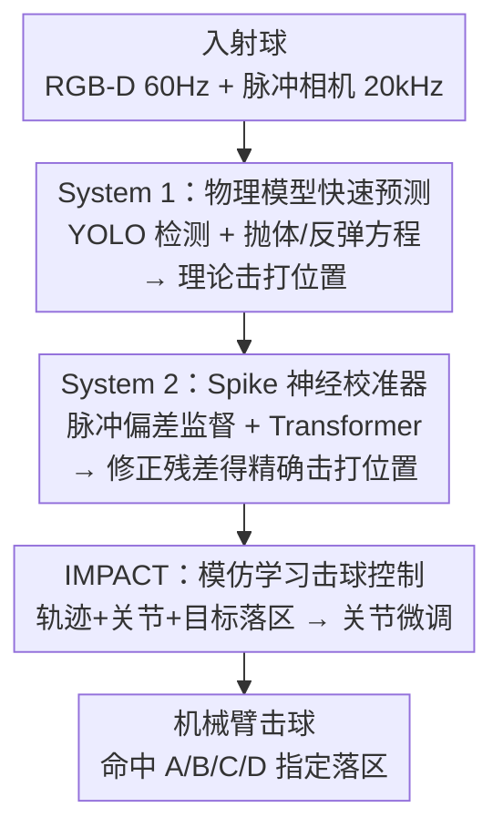

# SpikePingpong: Spike Vision-based Fast-Slow Pingpong Robot System

**会议**: ICLR 2026  
**OpenReview**: [https://openreview.net/forum?id=d08yOXs1Dl](https://openreview.net/forum?id=d08yOXs1Dl)  
**代码**: 暂未公开（论文承诺录用后开源）  
**领域**: 机器人 / 具身智能  
**关键词**: 脉冲相机, 快慢双系统, 乒乓球机器人, 模仿学习, 高速操控

## 一句话总结
SpikePingpong 把脉冲相机（spike camera）的高频视觉接入「快慢双系统」感知框架——System 1 用普通 RGB-D 相机 + 物理模型快速预测落点、System 2 用脉冲相机训练一个神经校准器修正物理误差，再配合模仿学习的 IMPACT 模块控制击球落区，最终在真实 ABB 机械臂上实现 30cm 区域 92%、20cm 区域 70% 的回球命中率，远超人类平均水平。

## 研究背景与动机

**领域现状**：机器人操控研究大多停留在静态或慢速物体上，桌面抓取、慢速放置这类任务动力学简单、物体行为可预测。乒乓球被公认为高速动态操控的理想试验台——它把毫秒级感知、毫秒级预测、精确电机控制和实时战术规划压缩进一个看似简单的小游戏里，是 Moravec 悖论的典型体现。

**现有痛点**：现有乒乓球机器人分两类，各有死穴。控制类方法（perception-prediction-control 流水线）依赖精确物理建模和预先标定，数学严谨但无法自适应应对球旋转、空气阻力这类真实扰动；学习类方法（强化学习 / 模仿学习）理论上更灵活，但深受 sim-to-real gap 之苦，仿真里训出来的策略一上真机就掉链子，尤其是球旋转、接触动力学这些细微因素在仿真里很难还原。更要命的是，两类方法通常都需要昂贵的高精度硬件视觉系统，而普通 RGB 相机面对高速球会产生严重运动模糊，导致位置估计和轨迹预测失准。

**核心矛盾**：高速场景下「速度」和「精度」存在根本 trade-off——纯物理模型够快但不准（无法建模真实扰动），纯神经网络够准但要么慢、要么依赖仿真而 sim-to-real 失败。单一系统很难同时兼顾毫秒级响应和高精度。

**本文目标**：在不依赖昂贵高速运动捕捉硬件、不依赖仿真的前提下，做一个能在真机上达到高命中率、还能打出战术落区的乒乓球机器人。

**切入角度**：作者借鉴 Kahneman 的双系统认知理论（System 1 快速直觉 + System 2 慢速审慎推理），把感知拆成快慢两层——快系统负责实时粗预测，慢系统负责精校准；同时引入脉冲相机（20 kHz 高频、无运动模糊）作为慢系统的「高保真信息源」，但只在训练时用，部署时不依赖它，从而兼顾精度和效率。

**核心 idea**：用「物理模型快速预测 + 脉冲视觉训练的神经校准器修正残差」替代「单一感知系统」，再用真实数据的模仿学习替代仿真，端到端在真机上学击球策略。

## 方法详解

### 整体框架
SpikePingpong 把乒乓球任务原则性地拆成两个阶段：**拦截（Interception）** 和 **击球（Striking）**。拦截阶段负责回答「球会到哪、我该把拍子放哪」，由快慢双系统感知框架完成；击球阶段负责回答「拍子该怎么挥才能把球打到指定落区」，由 IMPACT 模仿学习模块完成。

拦截阶段内部又是两层：System 1 用 RGB-D 相机（60 Hz）做实时球检测，并用经典抛体物理模型预测可击打位置（hittable position），毫秒级响应；但物理模型忽略了空气阻力、球旋转、传感器噪声等真实偏差，于是 System 2 作为「Spike 导向神经改进校准器」（Spike-Oriented Neural Improvement Calibrator）登场——它用脉冲相机在接触瞬间观测到的「球心与拍心的像素偏差」作为监督信号，学习预测 System 1 理论落点与真实最优拦截点之间的系统性残差。关键是 System 2 训练时才用脉冲相机，一旦训好，部署时只是个轻量神经预测器，从轨迹特征直接回归偏差向量，不再需要脉冲相机反馈。

拿到精校后的击打位置后，IMPACT 模块接手：它把入射球轨迹、机器人关节配置、目标落区三种模态编码成 token，过 Transformer 输出关节角微调量，从而把球战术性地打到 A/B/C/D 四个目标区域。

### 关键设计

**1. System 1 物理模型快速预测：用经典抛体方程做毫秒级粗预测**

这一层针对的是「必须先有快速响应才谈得上后续精度」的前提。它用 YOLOv4-tiny（轻量、检测频率可达 150 Hz）从 RGB-D 流里提取球的像素位置，再用标定的相机参数把图像坐标转成世界坐标的 3D 球位。拿到球的 3D 位置后，先用指数滑动平均（EMA）滤波得到稳定的位置 $(x,y,z)$ 和速度 $(v_x,v_y,v_z)$，再喂进物理模型预测可击打位置。具体地，球到达预定击球平面 $y_{hit}$ 所需时间 $t = \frac{y_{hit}-y}{v_y}$，则 x 坐标 $x_{hit} = x + v_x \cdot t$（若 $x_{hit}$ 落在机械臂工作空间外则判为不可击）。

z 坐标分两种情形：若球在到达 $y_{hit}$ 前不触桌（直接轨迹），$z_{hit} = z + v_z\cdot t + \frac{1}{2}g t^2$；若触桌反弹，先解 $z + v_z\cdot t_{rb} + \frac{1}{2}g t_{rb}^2 = h_{table}$ 求反弹时刻，再用恢复系数 $e$ 算反弹前后速度 $v_{z,in} = -\sqrt{-2g(z-h_{table})+v_z^2}$、$v_{z,out} = -e\cdot v_{z,in}$，并进一步评估二次反弹。这套纯物理推导计算极廉价、响应极快，是整个系统的实时骨架，但它默认理想抛体、忽略空气阻力和球旋转，所以单用它误差很大（消融里 System 1 Only 的整体 MAE 高达 44.13）。

**2. System 2 Spike 神经校准器：用脉冲视觉学物理模型的残差**

这是全文最核心的创新，针对的正是 System 1「快但不准」的痛点。作者没有去重写一个更复杂的物理模型，而是直接学「理论落点和真实落点之间的系统性偏差」。训练数据的妙处在于监督信号怎么来：每次试验先按 System 1 的预测，通过逆运动学算关节角、驱动机械臂把拍心摆到理论最优击打位置，然后用脉冲相机（20 kHz、无运动模糊）拍下球-拍接触瞬间的图像，**球心与拍心在图像里的像素距离**就是空间偏差的量化真值。普通 RGB 相机在这一瞬间会糊成一团，根本测不准——这正是脉冲相机不可替代的地方。

网络结构上，System 2 吃三种模态：前 $K$ 帧的历史位置 $p_i \in \mathbb{R}^{K\times 3}$、速度 $v_i \in \mathbb{R}^{K\times 3}$，以及物理模型预测的击打位置 $h_i \in \mathbb{R}^3$。每个模态先过带 ReLU 和 dropout 的 MLP 抽特征，拼接后送进 Transformer 编码器捕捉轨迹段内的时序依赖，最后回归头输出预测偏差向量 $\hat{D}_i \in \mathbb{R}^2$，用 MSE 训练：$L_{MSE}(\theta) = \frac{1}{N}\sum_{i=1}^N \|\hat{D}_i - D_i\|^2$，其中 $\hat{D}_i = f_\theta([p_i, v_i, h_i])$。最关键的工程价值是：脉冲相机只在采集训练数据时用，训好后 System 2 就是个轻量预测器，从轨迹特征直接出偏差，**部署时完全不需要脉冲相机反馈**——既吃到了高保真训练信号，又保持了实时和低成本。这一层把整体 MAE 从 44.13 压到 12.34。

**3. IMPACT 模仿学习击球控制：从真实演示学战术落区**

拦截只解决「把拍子放对位置」，但要打出战术（指定落到对方半场的某个区域）还得控制怎么挥拍，这就是 IMPACT（Imitation-based Motion Planning And Control Technology）的职责。它针对的是「学习类方法被 sim-to-real gap 拖累」的痛点——作者干脆完全不用仿真，全靠真机数据做模仿学习。数据采集很巧：先用快慢系统预测最优击打位置、逆运动学把机械臂摆好，然后对三个关键关节施加随机角度扰动再执行挥拍，只保留「球成功回到对方半场」的成功试验，记录扰动后的关节角和实际落区，并按落区给每条样本打标签。相比遥操作，这种「自动摆位 + 随机扰动」的方式采集效率高、数据质量稳定。

网络同样是 Transformer 架构，输入球轨迹序列、机器人关节配置、期望落区（one-hot），各模态独立编码成 token 后拼接，过自注意力捕捉跨模态依赖，输出关节角调整量。训练目标 $L_{MSE}(\theta') = \frac{1}{N}\sum_{i=1}^N \|\hat{J}_i - J_i\|^2$，其中 $\hat{J}_i = f_{\theta'}([p_i, v_i, j_i, c_i])$，$j_i \in \mathbb{R}^6$ 是 6 自由度关节配置、$c_i \in \mathbb{R}^4$ 是目标落区的 one-hot 控制信号、$J_i \in \mathbb{R}^3$ 是真值调整向量。这让机器人能根据来球动态调整击球策略、精确瞄准指定落区，把系统从「只会接球」升级成「会打战术」。

### 损失函数 / 训练策略
System 2 和 IMPACT 都用 MSE 回归损失（分别监督偏差向量和关节调整量）。System 1 无需训练（纯物理 + 一个两阶段训练的 YOLOv4-tiny 检测器：先在公开数据集预训练，再域内微调）。整个控制系统多频率协同：快慢系统在 60 Hz 处理轨迹、20 kHz 经逆运动学转关节配置，IMPACT 以 2.4 kHz 做击球调整，命令以 250 Hz 发给 EGM 控制器。硬件为 ABB IRB-120 机械臂 + 标准球拍，单卡 RTX 4090。数据集含 1k 条轨迹-偏差样本（RGB-D 60 Hz + 脉冲相机 20 kHz 同步采集）和 2k 条专家回球演示。

## 实验关键数据

### 主实验
击打位置预测误差（越低越好），脉冲神经校准把误差压到 RNN 基线的约一半：

| 方法 | Y轴 MAE | Z轴 MAE | 整体 MAE | 整体 RMSE |
|------|---------|---------|----------|-----------|
| System 1 Only | 53.65 | 34.62 | 44.13 | 50.62 |
| RNN-based | 24.10 | 21.50 | 22.80 | 23.73 |
| System 1 + System 2（本文） | 9.87 | 14.82 | **12.34** | **13.85** |

单目标回球命中率（四区平均，越高越好）与推理耗时：

| 方法 | 30cm 命中率 | 20cm 命中率 | 推理耗时 (ms) |
|------|------------|------------|--------------|
| 人类平均 | 53% | 33% | — |
| Diffusion Policy (w/o vision) | 6% | 2% | 25.18 |
| ACT (w/o vision) | 19% | 7% | 7.15 |
| SpikePingpong | **92%** | **70%** | **0.407** |

SpikePingpong 不仅命中率碾压基线和人类，推理耗时仅 0.407 ms，比 ACT 快约 17 倍、比 Diffusion Policy 快约 60 倍，为机械臂物理执行留足时间。一个有趣细节：ACT 去掉视觉输入反而从 12% 涨到 19%，说明原始图像引入了延迟。

### 消融实验
轨迹预测组件消融（30cm 阈值，四区平均）：

| 配置 | 单目标命中 | 序列击球命中 | 说明 |
|------|-----------|-------------|------|
| System 1 + IMPACT | 23% | 15% | 只用物理模型，误差大 |
| RNN + IMPACT | 67% | 52% | RNN 替代脉冲校准 |
| SpikePingpong（Full） | **92%** | **78%** | 完整快慢系统 |

### 关键发现
- **脉冲神经校准是命中率的胜负手**：把 System 2 换成 System 1 Only，单目标命中率从 92% 崩到 23%；换成 RNN 也只有 67%。完整系统比 RNN 高 25 个百分点，原因是它能刻画「球-拍接触敏感性」——相同挥拍动作因接触位置细微差异会产生截然不同的轨迹，脉冲相机的高保真接触观测正好捕捉到这点。
- **序列战术能力超越人类**：100 连续回球的序列任务里，SpikePingpong 达到 78% 整体命中（人类 45%），说明它不是「只会接一板」而是能维持长程战术。
- **泛化性扎实**：把发球机移到两个训练时没见过的偏心位置（彻底改变来球分布），30cm 命中率仍保持 74%（in-distribution 是 92%），说明学到的是球动力学的内在模型而非死记轨迹模式。
- **能迁移到人类对手**：在单个人类玩家的 100 条演示上微调后，对同一玩家命中 47%；对完全没见过的新玩家做零样本测试仍有 31%，显示它捕捉到了人类风格的可泛化特征，而非过拟合个人习惯。

## 亮点与洞察
- **「脉冲相机只在训练时用」是最聪明的设计**：脉冲相机贵且工程复杂，作者用它做高保真接触监督，但把知识蒸馏进一个轻量神经校准器，部署时完全甩掉它——既吃到精度红利又保住成本和实时性，是个非常可复用的「训练用强信号、部署用弱依赖」范式。
- **物理 + 神经残差学习的组合拳**：不去和真实世界的复杂动力学硬刚（重写物理模型），而是让物理模型管「大头」、神经网络管「残差」，把任务难度拆解到各自擅长的范围，这种「物理打底 + 学习纠偏」的思路可迁移到任何「有近似物理模型但不够准」的高速操控场景。
- **Kahneman 双系统理论落地得很贴切**：System 1 快而粗、System 2 慢而精，不是生搬概念，而是真的对应了「物理快预测 + 神经精校准」的实际分工。
- **全真机、零仿真**：靠「自动摆位 + 随机扰动 + 只留成功样本」高效采集真实演示，彻底绕开 sim-to-real gap，这对桌面乒乓这种接触动力学难仿真的任务尤其关键。

## 局限与展望
- **代码与数据集尚未公开**（承诺录用后开源），脉冲相机 + ABB 机械臂的硬件门槛高，复现成本不低。
- **目标落区只有 A/B/C/D 四个离散区域**，是粗粒度战术控制；面对真正的对抗性人类对手、需要连续落点和实时策略博弈时能力如何，论文未充分验证。
- **对人类来球的泛化仍有限**：未见过的新玩家零样本只有 31%，离实用对打还有距离；旋转球、削球等复杂球路的处理论文着墨不多。
- **缺少公开硬件基线对比**：作者也承认无公开硬件 baseline，只能与 ACT/Diffusion Policy 等学习方法和人类对比，横向定位有一定局限。
- 改进方向：把离散落区换成连续落点回归、引入对手意图预测做主动博弈、用脉冲相机的高频信息进一步建模球旋转。

## 相关工作与启发
- **vs 控制类方法（Acosta / Mülling 等的物理建模流水线）**：他们靠精确物理建模和预定义控制，数学严谨但需精确标定、无法自适应扰动；本文保留物理模型做快速骨架，但用神经校准器吸收物理模型管不了的真实偏差，兼顾效率和适应性。
- **vs 学习类方法（i-Sim2Real / GoalsEye 等 RL/IL）**：它们大多依赖仿真、受 sim-to-real gap 拖累，GoalsEye 虽用模仿学习但仍依赖 sim2real；本文完全在真机数据上做模仿学习，无需仿真也无需复杂人工辅助，部署更实在。
- **vs ACT / Diffusion Policy（通用模仿学习策略）**：本文 IMPACT 在状态输入下推理仅 0.407 ms，命中率 92% vs 它们的 19%/6%，证明针对高速任务做轨迹/关节/落区的专门 token 化设计远优于直接套通用策略网络。

## 评分
- 新颖性: ⭐⭐⭐⭐⭐ 首次把脉冲相机引入快慢双系统做乒乓球拦截，「训练用脉冲、部署不依赖」的蒸馏式设计很巧
- 实验充分度: ⭐⭐⭐⭐⭐ 真机评测覆盖单目标/序列/OOD/人类对手多维度，消融清晰，命中率和耗时数据扎实
- 写作质量: ⭐⭐⭐⭐ 结构清晰、公式完整；部分动机叙述偏宏大，落区粒度等局限可更坦诚
- 价值: ⭐⭐⭐⭐⭐ 在真机上达到超人类命中率且毫秒级响应，对高速时序操控任务有很强示范意义

<!-- RELATED:START -->

## 相关论文

- [\[ICLR 2026\] Ground Slow, Move Fast: A Dual-System Foundation Model for Generalizable Vision-Language Navigation](ground_slow_move_fast_a_dual-system_foundation_model_for_generalizable_vision-la.md)
- [\[CVPR 2026\] Towards Open Environments and Instructions: General Vision-Language Navigation via Fast-Slow Interactive Reasoning](../../CVPR2026/robotics/towards_open_environments_and_instructions_general_vision-language_navigation_vi.md)
- [\[ICLR 2026\] Rodrigues Network for Learning Robot Actions](rodrigues_network_for_learning_robot_actions.md)
- [\[ICLR 2026\] RAVEN: End-to-end Equivariant Robot Learning with RGB Cameras](raven_end-to-end_equivariant_robot_learning_with_rgb_cameras.md)
- [\[ICLR 2026\] SARM: Stage-Aware Reward Modeling for Long Horizon Robot Manipulation](sarm_stage-aware_reward_modeling_for_long_horizon_robot_manipulation.md)

<!-- RELATED:END -->
