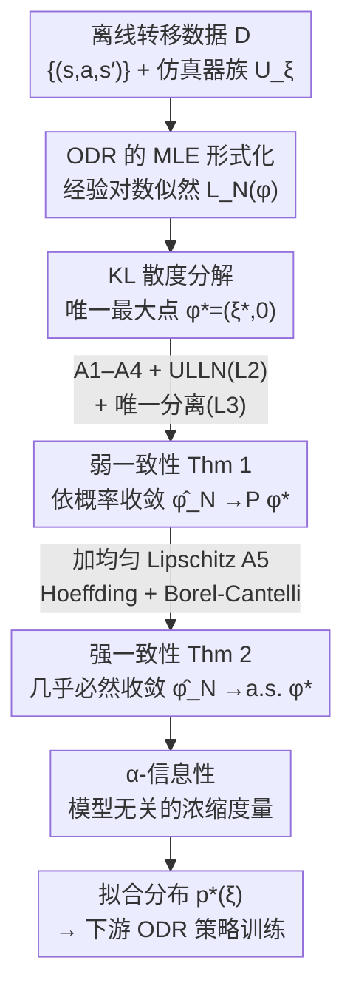

# Statistical Guarantees for Offline Domain Randomization

**会议**: ICLR 2026  
**arXiv**: [2506.10133](https://arxiv.org/abs/2506.10133)  
**代码**: 无  
**领域**: 机器人  
**关键词**: 域随机化, sim-to-real迁移, 最大似然估计, 一致性, 离线RL

## 一句话总结

将离线域随机化(ODR)形式化为参数化仿真器族上的最大似然估计问题，在温和的正则性和可辨识性假设下证明了弱一致性（依概率收敛），进一步添加均匀Lipschitz连续假设后证明了强一致性（几乎必然收敛），为ODR在sim-to-real迁移中的经验成功提供了首个理论基础。

## 研究背景与动机

**领域现状**：强化学习智能体在从仿真到真实世界部署时常遇到性能下降，即所谓的"sim-to-real gap"。域随机化(Domain Randomization, DR)是解决该问题的主流方法——在训练时随机采样物理参数（质量、摩擦系数、传感器噪声等）构建多样化仿真器族，使策略对环境变化具有鲁棒性。DR已在四旋翼飞行、灵巧操作、腿式机器人等任务上实现了零样本迁移。

**现有痛点**：
   - **均匀DR(UDR)效率低**：标准做法是对物理参数施加宽泛的均匀先验，但Chen et al. (2022)的理论分析表明UDR的sim-to-real gap与候选仿真器数$M$的关系为$O(M^3 \log(MH))$——随仿真器数增加，性能保证迅速恶化
   - **忽视已有真实数据**：UDR完全不利用已从真实系统收集的离线数据来指导参数分布的选择
   - **缺乏理论基础**：虽然ODR方法（如DROPO、DROID、BayesSim）在实验上显示了显著优势，但理论上不知道(i)拟合的分布是否随数据增长收敛到真实动力学，(ii)相比UDR有多少改善

**核心矛盾**：经验上ODR表现优越，但缺乏统计保证——不清楚在什么条件下离线数据能可靠地指导域随机化分布的选择。

**本文目标**
   - 证明ODR估计器的弱一致性（依概率收敛到真实参数）
   - 证明ODR估计器的强一致性（几乎必然收敛）
   - 分析各假设的可实践性，并提供松弛条件

**切入角度**：将ODR视为参数化仿真器族上的最大似然估计(MLE)，利用经典统计学工具（Glivenko-Cantelli类的一致大数定律、Borel-Cantelli引理等）建立严格的收敛性证明。

**核心 idea**：ODR本质上是一个参数化MLE问题，在温和假设下具有可证明的统计一致性，这为其经验成功提供了坚实的理论支撑。

## 方法详解

### 整体框架

这篇论文不提新算法，而是为已经在用的 ODR 范式补一份"它为什么会收敛"的证明。要论证的对象其实很朴素：手上有一批从真实环境$\mathcal{M}^*$采来的离线转移三元组$\mathcal{D} = \{(s_i, a_i, s_i')\}_{i=1}^N$（假定 i.i.d.），有一族共享状态/动作空间、但转移概率被物理参数$\xi$控制的仿真器$\mathcal{U} = \{\mathcal{M}_\xi : \xi \in \Xi \subset \mathbb{R}^d\}$，我们想用这批数据去拟合一个参数分布$p_\phi(\xi) = \mathcal{N}(\mu, \Sigma)$，让仿真器族尽量贴近真实动力学。

拟合的方式是最大化混合似然$\phi^* = \arg\max_\phi \sum_i \log \mathbb{E}_{\xi \sim p_\phi}[P_\xi(s_i' \mid s_i, a_i)]$，再把学到的分布$p^*(\xi)$喂给下游策略训练$\pi_{\text{ODR}}^* = \arg\max_\pi \mathbb{E}_{\xi \sim p^*}[V_{\mathcal{M}_\xi}^\pi(s_1)]$。整套理论要回答的就是：随着数据$N$增长，这个$\phi^*$是不是真的会收敛到真实参数？下面的关键设计，本质上是把这个问题翻译成 MLE，然后顺着一条「形式化 → 弱一致性 → 强一致性 → 信息性度量」的证明链一步步把收敛性证出来。

### 关键设计

**1. ODR 的 MLE 形式化：先把"拟合分布"翻译成标准的最大似然问题**

ODR 在实验里有效，但理论上一直没说清"拟合的分布"到底在优化什么。本文先把它写成经验对数似然$L_N(\phi) = \frac{1}{N}\sum_{i=1}^N \log q_\phi(s_i' \mid s_i, a_i)$，其中$q_\phi(s'\mid s,a) = \int p_\xi(s'\mid s,a)\, p_\phi(\xi)\, d\xi$是把整个仿真器族按$p_\phi$混合后的转移核。关键的一步是对总体对数似然$L(\phi)$做 KL 散度分解，证明它的唯一最大化点就是$\phi^* = (\xi^*, 0)$——即分布退化到真实参数$\xi^*$、方差归零。这一步的意义在于：一旦 ODR 被装进经典 MLE 框架，后面所有的一致性论证就都能直接借用统计学里现成的工具，而不用从零造轮子。

**2. 弱一致性（Theorem 1）：证明拟合出的参数依概率收敛到真值**

形式化之后的第一个目标，是证明任意可测的最大化点$\hat{\phi}_N$依概率收敛到$\phi^*$。证明分三步走：先用 Glivenko-Cantelli 类的一致大数定律（ULLN）说明经验似然一致逼近总体似然，即$\sup_\phi |L_N(\phi) - L(\phi)| \to 0$（Lemma 2）；再利用"唯一最大化点"的分离性质，证明任何偏离$\phi^*$超过$\epsilon$的参数都会付出一个均匀的似然损失下界$\eta(\epsilon)$（Lemma 3）；最后把两者合起来——$\hat{\phi}_N$落到$\phi^*$的$\epsilon$-邻域之外这件事，只可能发生在经验似然偏离总体似然$\eta/3$以上时，于是这个坏概率被$P(\sup |L_N - L| \geq \eta/3)$压住、随$N$趋零。这套论证依赖四条假设：Assumption 1（仿真器正则性，密度有界且连续）、Assumption 2（参数空间紧致）、Assumption 3（混合正性$q_\phi \geq c > 0$）、Assumption 4（可辨识性）。

**3. 强一致性（Theorem 2）：再加一条 Lipschitz 假设，把"依概率"升级成"几乎必然"**

弱一致性只保证"收敛的概率趋于 1"，但实际部署往往关心单条数据轨迹是否几乎必然收敛。要把结论升一级，需要的不再是收敛本身、而是坏概率的可和性。为此本文加入均匀 Lipschitz 假设（Assumption 5）$|a(x,\phi) - a(x,\psi)| \leq L\|\phi - \psi\|$：靠它在紧致参数空间上铺一张$\epsilon/L$-网，对每个网点用 Hoeffding 不等式给出指数级的偏差界$P(|L_N(\phi_i) - L(\phi_i)| > \epsilon) \leq 2\exp(-N\epsilon^2 / 2\tilde{M}^2)$，再由 Borel-Cantelli 引理推出$\sum_N P(\sup|L_N - L| > 2\epsilon) < \infty$，从而得到$\hat{\phi}_N \xrightarrow{a.s.} \phi^*$。这里 Lipschitz 条件扮演的角色，正是把"有限个网点上的逐点控制"扩展成"整个参数空间上的全局控制"——这恰好是从弱一致性跨到强一致性所缺的那块拼图。

**4. $\alpha$-信息性：给"分布到底有多集中在真值附近"一个模型无关的刻度**

有了收敛性，还需要一个不依赖具体参数族的指标来度量 ODR 算法"把信息浓缩到真值附近"的能力。本文定义：若存在$N_0$使得$N \geq N_0$时学到的分布$\hat{\phi}_N$把至少$\alpha$的概率质量分配在真实参数$\xi^*$的$\epsilon$-球内，就称算法$\mathcal{A}$是$(\alpha, \epsilon)$-informative。由强一致性立刻可知，高斯 ODR 对任意$\alpha < 1$都满足这个性质。这个定义的价值在于它和参数分布的具体选择无关（高斯只是一个实例），因而可以拿来横向比较不同 ODR 变体的浓缩能力。

最后，本文逐条检查了上述五条假设在实践中是否可达，并给出可松弛的版本，说明这套理论并非建立在过强的前提之上：

| 假设 | 原始形式 | 松弛方案 | 适用性 |
|------|----------|----------|--------|
| A1 仿真器正则性 | 密度有界连续 | 无需松弛 | 有限状态空间和高斯转移均满足 |
| A2 参数空间紧致 | $\Phi$紧 | 无需松弛 | 物理参数总有先验边界 |
| A3 混合正性 | $q_\phi \geq c > 0$ | 改为对数尾条件$P(\inf_\phi q_\phi(X) \leq \epsilon) \leq 1/\log(1/\epsilon)^2$ | 覆盖高斯等轻尾族 |
| A4 可辨识性 | 唯一恢复$\xi^*$ | 放宽为收敛到辨识集$\mathcal{Q}_\mu^*$ | 部分覆盖下自然退化 |
| A5 均匀Lipschitz | $|a(x,\phi)-a(x,\psi)| \leq L\|\phi-\psi\|$ | 转移核二阶可微+梯度有界即可（Lemma 7） | 光滑物理仿真器满足 |

## 实验关键数据

### 理论结果对比

本文是纯理论工作，核心贡献是统计保证而非实验性能。以下对比ODR理论结果与现有UDR理论：

| 方法 | 收敛类型 | Sim-to-real gap | 数据需求 | 仿真器数$M$依赖 |
|------|----------|-----------------|----------|-----------------|
| UDR (Chen et al., 2022) | 非自适应 | $O(M^3 \log(MH))$ | 无离线数据 | 三次方增长 |
| UDR (本文改进界) | 非自适应 | $O(M^3 \log(MH))$ (改进log因子) | 无离线数据 | 三次方增长 |
| ODR 弱一致性 (Thm 1) | 依概率$\to \phi^*$ | 随$N$收敛到0 | i.i.d.或遍历 | 与$\xi^*$的辨识有关 |
| ODR 强一致性 (Thm 2) | 几乎必然$\to \phi^*$ | 随$N$收敛到0 | i.i.d. + Lipschitz | 额外Lipschitz控制 |

### 假设与保证的层级关系

| 假设组合 | 保证级别 | 收敛模式 | 关键工具 |
|----------|----------|----------|----------|
| A1+A2+A3+A4 | 弱一致性 | $\hat{\phi}_N \xrightarrow{P} \phi^*$ | ULLN (Glivenko-Cantelli) |
| A1+A2+A3+A4+A5 | 强一致性 | $\hat{\phi}_N \xrightarrow{a.s.} \phi^*$ | Hoeffding + Borel-Cantelli |
| A1+A2+A3 (无A4) | 集合一致性 | $\text{dist}(\hat{\phi}_N, \mathcal{Q}_\mu^*) \xrightarrow{P} 0$ | Berge极大值定理 |
| A1+A2+松弛A3 | 弱一致性 | $\hat{\phi}_N \xrightarrow{P} \phi^*$ | 可积包络条件 |

### 关键发现

- **UDR gap界改进**：附录A中将Chen et al.的$O(M^3 \log^3(MH))$收紧到$O(M^3 \log(MH))$（对数因子从三次降为一次），通过更精细的参数选择实现
- **ODR的自适应优势**：ODR利用离线数据集中分布在真实参数附近，避免了UDR对整个仿真器族均匀覆盖导致的$M^3$放大效应
- **Lipschitz条件的充分条件**：转移核$p_\xi$关于$\xi$二阶可微且梯度有界（$|\nabla_\xi p_\xi| \leq G_1$, $|\nabla_\xi^2 p_\xi| \leq G_2$）即可保证Assumption 5，常数$L = (G_1 + G_2/2)/c$

## 亮点与洞察

- **KL散度分解的巧妙使用**：通过将总体对数似然$L(\phi)$分解为$-D_{KL}(p_{\xi^*} \| q_\phi) + H(\xi^*)$，直接利用KL散度的非负性和当且仅当条件证明$\phi^* = (\xi^*, 0)$是唯一极大值——优雅且自然，将MLE问题与信息论无缝对接
- **从弱到强的渐进升级策略**：先证弱一致性（只需ULLN），再加一个Lipschitz假设升级为强一致性（需Borel-Cantelli），最后分析每个假设的可松弛性——这种层次化的理论构建方式适合迁移到其他统计估计问题
- **$\alpha$-信息性的模型无关定义**：提出了评估ODR算法质量的度量标准，独立于参数分布的选择（高斯只是一个实例），可用于比较不同ODR变体
- **辨识集的概念**：当数据覆盖不完整时，不追求点收敛而是集合收敛$\text{dist}(\hat{\phi}_N, \mathcal{Q}_\mu^*) \to 0$——这是信息论上最优的，因为没有方法能区分在数据分布上观测等价的参数

## 局限与展望

- **缺乏有限样本界**：本文只证明了渐近一致性（$N \to \infty$），没有给出具体的收敛速率或有限样本误差界——对实际应用中"需要多少数据"的问题无法回答
- **无实验验证**：纯理论工作，没有在任何仿真或机器人平台上验证理论预测与实际表现的对应关系
- **高斯参数化限制**：虽然作者声称可替换为其他参数族，但所有证明都基于高斯$\mathcal{N}(\mu, \Sigma)$的性质（如Lévy连续性定理证明弱收敛），其他参数族需重新验证
- **可辨识性假设的验证困难**：Assumption 4要求从观测中唯一恢复$\xi^*$，但在实际中难以先验验证某个仿真器族是否满足此条件
- **未讨论优化景观**：证明了全局最大化点的一致性，但实际中MLE通过梯度优化求解，可能陷入局部极值——本文未分析目标函数的非凸性
- **i.i.d.假设仍然强**：虽然讨论了松弛为遍历序列的可能性，但具体的收敛性证明仍依赖i.i.d.

## 相关工作与启发

- **vs UDR (Chen et al., 2022)**：UDR在均匀先验下训练，gap为$O(M^3 \log(MH))$；ODR利用离线数据拟合集中分布，渐近消除gap——ODR在数据充足时严格优于UDR
- **vs DROPO (Tiboni et al., 2023)**：DROPO是ODR的具体算法实现（高斯MLE + 无梯度优化器），本文为包括DROPO在内的MLE-ODR范式提供统计保证——是理论与实践的桥梁
- **vs BayesSim (Ramos et al., 2019)**：BayesSim用条件密度估计器预测参数后验，是贝叶斯方法；本文的频率学派MLE分析与之互补，可能启发ODR的贝叶斯一致性研究
- **vs DROID (Tsai et al., 2021)**：DROID用CMA-ES优化L2距离进行系统辨识，本文的MLE目标在理论上更有依据（因为直接优化数据似然）

## 评分

- 新颖性: ⭐⭐⭐⭐ 首个为ODR提供统计一致性保证的理论工作，填补了重要空白
- 实验充分度: ⭐⭐ 纯理论工作无实验验证，缺乏有限样本界和实际benchmark
- 写作质量: ⭐⭐⭐⭐⭐ 证明结构清晰、假设逐条分析且提供松弛，理论写作典范
- 价值: ⭐⭐⭐⭐ 为sim-to-real领域的ODR方法提供理论基础，但缺乏实验和有限样本分析限制了直接的实践指导价值

<!-- RELATED:START -->

## 相关论文

- [\[ICLR 2026\] Cross-Embodiment Offline Reinforcement Learning for Heterogeneous Robot Datasets](cross-embodiment_offline_reinforcement_learning_for_heterogeneous_robot_datasets.md)
- [\[ICML 2026\] Dual Quaternion SE(3) Synchronization with Recovery Guarantees](../../ICML2026/robotics/dual_quaternion_se3_synchronization_with_recovery_guarantees.md)
- [\[ICLR 2026\] Hierarchical Value-Decomposed Offline Reinforcement Learning for Whole-Body Control](hierarchical_value-decomposed_offline_reinforcement_learning_for_whole-body_cont.md)
- [\[ICLR 2026\] One Demo Is All It Takes: Planning Domain Derivation with LLMs from A Single Demonstration](one_demo_is_all_it_takes_planning_domain_derivation_with_llms_from_a_single_demo.md)
- [\[ICML 2026\] Towards Efficient and Expressive Offline RL via Flow-Anchored Noise-conditioned Q-Learning](../../ICML2026/robotics/towards_efficient_and_expressive_offline_rl_via_flow-anchored_noise-conditioned_.md)

<!-- RELATED:END -->
