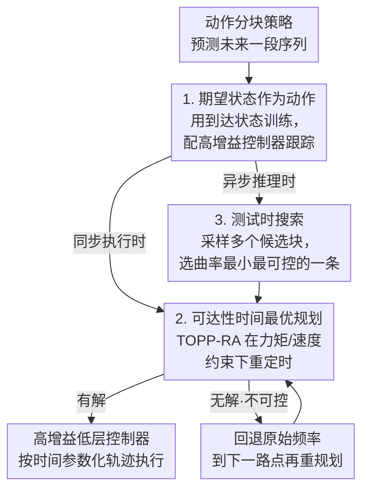

# Time Optimal Execution of Action Chunk Policies Beyond Demonstration Speed

**会议**: ICLR 2026  
**OpenReview**: [https://openreview.net/forum?id=INsLvSCJ4z](https://openreview.net/forum?id=INsLvSCJ4z)  
**项目页**: [https://clvrai.github.io/RACE/](https://clvrai.github.io/RACE/)  
**代码**: 待开源（论文承诺发布完整代码与配置）  
**领域**: 机器人 / 模仿学习 / 动作分块策略加速  
**关键词**: 模仿学习, 动作分块, 时间最优路径参数化, 异步推理, 测试时搜索

## 一句话总结
针对模仿学习（含 VLA）策略执行速度被演示速度死死卡住的问题，本文提出 RACE：把"动作"重定义为期望状态、对每个动作块做可达性感知的时间最优重定时、再用测试时搜索挑选最平滑可控的未来块，在不掉成功率的前提下把执行速度提到演示的 2 倍、原策略的 4 倍。

## 研究背景与动机

**领域现状**：现代机器人操作主要靠模仿学习——transformer / diffusion 策略（如 ACT、Diffusion Policy）和大规模预训练的视觉-语言-动作（VLA）模型。它们普遍采用**动作分块（action chunking）**：策略一次预测未来一段动作序列，然后开环执行若干步再重新推理，这样能稳定时序、缩短有效决策视野、提升精度与泛化。

**现有痛点**：这类方法在**速度**这一维度上有结构性缺陷。因为它们模仿的是演示数据的行为，执行速度也就被演示速度锁死；而遥操作（teleoperation）界面本身不直观，采集到的演示往往很慢，尤其是高精度任务（如插孔、家具装配），导致策略落地时执行得又慢又拖。在工业吞吐场景里，速度和精度、泛化同等重要。

**核心矛盾**：直觉上"提高动作执行频率"就能加速，但天真地提频会立刻崩。第一，**改频改变了底层转移动态**：低层控制器（如 PD 控制器）按当前状态与指令的差值施力，每个动作分到的执行时间被压短后，控制器还没把机器人推到目标状态就切到下一条指令，于是产生作者所谓的"状态误差（state error）"，并在开环执行的动作块里**逐步累积**；同时高速运动可能超出关节力矩 / 速度上限，物理上根本够不着。第二，为了消除推理停顿而上**异步推理**时，新动作块是在"过时的机器人状态"上算出来的——推理期间机器人已经动了，新计划和实际状态对不上，可控性下降、误差被进一步放大。

**本文目标**：在不牺牲精度和通用性的前提下，把任意预测动作块的模仿策略加速到**超过演示速度**，并且要同时解决"改频导致的状态误差"和"异步推理导致的错位"两件事。

**切入角度**：作者不走强化学习重新 rollout 改进策略那条重路，而是坚持纯模仿学习的简单路线——不改变策略学到的动作序列内容，只改变"怎么以更高速度去跟随这条序列"。关键观察是：误差的根源在于"动作指令 + 固定执行时序"这套接口，而把模仿目标换成**期望状态**、把时序交给**最优控制**去自适应安排，就能让转移动态对执行时序变得鲁棒。

**核心 idea**：用"期望状态"替代"动作指令"作为模仿目标，再用时间最优路径参数化（TOPP-RA）在物理约束下给每个状态块**自适应重定时**，最后用测试时 Best-of-N 搜索挑出最平滑、最可控的未来块来对抗异步错位——三者合起来即 RACE（Reachability-aware Accelerated Chunk Execution）。

## 方法详解

### 整体框架
RACE 要解决的是"如何让一条已经训练好的模仿策略跑得比演示更快、又不掉成功率"。它不重新学习动作内容，而是在**模仿目标、执行时序、块选择**三处分别动手术，组成一条串行流水线：训练阶段把策略学成预测"期望状态轨迹"而非动作指令；推理阶段先把当前动作块插值成几何路径，用 TOPP-RA 在力矩 / 速度约束下求最快的时间参数化；当用异步推理消除停顿时，再用测试时搜索从策略采样的多个候选块里挑出曲率最小、最可控的一条交给 TOPP 求解执行。三个组件依次对应"改频崩→不可达→异步错位"这三道坎。

### 关键设计

**1. 期望状态作为动作：让转移动态对执行时序鲁棒**

这一步针对的是"提频改变转移动态、产生并累积状态误差"的痛点。问题根源在于：常规模仿学习把"动作指令"作为模仿目标，而动作指令是喂给低层控制器的输入，控制器需要足够的执行时间才能把机器人推到指令对应的状态；一旦提频、每个指令分到的时间变短，PD 控制器施力时间不够，机器人停在了一个**不同于期望的状态**，误差在开环动作块里越滚越大。RACE 的做法是直接模仿演示中**实际到达的状态（reached state）**——用 (状态, 下一状态) 对而非 (状态, 动作) 对来训练 / 微调策略，并把预测出的期望状态当作低层控制器的指令。这样带来一个关键自由度：执行时可以**换用与遥操作不同的、更高增益的控制器**来精确跟踪期望状态，因为高增益施加更大的力，能在更短时间内把机器人拉到目标位姿。注意这在遥操作阶段是行不通的——遥操作时调高增益会让机器人过度反应、更难操控——但在自主执行阶段恰好可以放开手脚。本质上，"期望状态 + 高跟踪控制器"把转移动态从"对时序敏感"变成"对时序鲁棒"，这是后续加速的地基。（下文"动作"一词默认指期望状态，除非显式写"动作指令"。）

**2. 可达性时间最优规划：在物理约束下榨干每个块的速度**

光把动作换成期望状态还不够——当加速率上去、期望状态离当前状态越来越远时，高增益控制器会施加越来越大的力，迟早撞上力矩约束，物理上不可达。所以需要**自适应地**决定每一步加速多少。RACE 对策略生成的状态块（一串状态路点）用三次样条插值出几何路径 $q(s) \in \mathbb{R}^n$（$s$ 是标量路径参数，以当前速度作边界条件），再对它跑 TOPP-RA（基于可达性分析的时间最优路径参数化）。TOPP-RA 把广义二阶约束 $A(q)\ddot{q} + \dot{q}^\top B(q)\dot{q} + f(q) \in \mathcal{C}$ 投影到相空间，用平方速度 $x=\dot{s}^2$ 和伪加速度 $u=\ddot{s}$ 写成路径约束：

$$a(s)u + b(s)x + c(s) \in \mathcal{C}(s),\quad a=Aq',\ b=Aq''+q'^\top Bq',\ c=f$$

算法把路径离散为 $s_0,\dots,s_N$，先做**反向传播**递归求出每个点的"可控集 $\mathcal{K}_i$"（能到达 $\mathcal{K}_{i+1}$ 的状态区间），再从 $\mathcal{K}_0$ 出发**正向传播**贪心地选下一可控集里能取到的最高 $x$，从而得到在力矩、速度约束下跟随该路径的**最快**时间参数化。边界条件取 $\dot{s}_0^2=1$、$\dot{s}_{N,\min}^2=0$、$\dot{s}_{N,\max}^2=1$，给末状态留自由度。这样每个动作块都被重定时成一条"物理可行、自适应快慢"的轨迹——直道飙速、弯道减速，而不是死板地整体放大频率。当初始状态不在 $\mathcal{K}_0$（即无可行解）时，RACE **回退到原始控制频率不加速**，并在到达下一路点后持续重规划，直到出现可行解，保证不会因强行加速而失控。

**3. 测试时搜索：用 Best-of-N 选最平滑的块对抗异步错位**

异步推理能消除推理停顿，但会带来"为不确定的未来状态预测动作"的难题。推理窗口里机器人已经漂移，新块到手时实际状态 $x_{\text{current}}$ 可能**对新轨迹不可控**（并入新路径所需的瞬时力矩超限）；而且生成式策略是概率的，状态或噪声的微小变化会让新块与正在执行的块**拓扑不一致**，在交接点形成高速下根本跟不住的尖锐不连续。两种现象殊途同归，都让 TOPP **求不出可行的时间参数化**。RACE 的洞察是：交接点处的**路径曲率 $q''$** 才是决定可解性的主导项。它用 Best-of-N 采样多个候选块，按平滑度目标打分选最优：

$$J(q(s)) = \frac{s_{\text{end}}}{\int_0^{s_{\text{end}}} \|q''\|^2 \, ds}$$

（分子的 $s_{\text{end}}$ 做长度归一化；$q(s_{\text{end}})$ 可取块中的中间动作而非末动作，其索引是超参。）为什么挑曲率最小的有效？回看约束系数，唯一含 $q''$ 的是 $\dot{s}^2$ 的系数 $b(s)$；多个候选都以共同的初始状态 $(q(0), q'(0))$ 为条件，在短规划视野内位置 $q$ 变化很小、切向 $q'$ 的显著变化必然要求很大的 $q''$，于是 $q''$ 成了区分候选的最敏感主导项。曲率越小 → $|b(s)|$ 越小 → 每个 $\dot{s}^2$ 允许的可行控制集越大 → 可控集 $\mathcal{K}_0$ 的体积越大，从而机器人漂移后的当前状态更可能仍在可控集内、TOPP 更容易求出高速解。与 MPC 的相似之处是都用基于视野的优化，但 RACE **用模仿策略本身当生成式采样器**（保留人类演示的自然性），且优化目标是"可控性体积"而非随机 / 梯度采样，专门针对异步执行的错位问题。

### 损失函数 / 训练策略
训练侧的唯一改动是把模仿目标从"动作指令"换成"到达状态"，即在 (状态, 下一状态) 对上训练或微调扩散策略 / VLA，损失沿用原策略的模仿目标，不引入额外的强化学习 rollout。推理侧（TOPP-RA 重定时 + Best-of-N 测试时搜索）全部无需训练，可直接套到任意预测动作块的现成策略上，体现其"策略无关、任务无关"的定位。此外为公平对比，加速执行时对本文及所有 baseline 都统一提高了夹爪速度（避免因夹取慢而漏抓）。

## 实验关键数据

### 主实验
仿真用 Robomimic 的 Lift / Can / Square / Tool Hang（后两者需高精度插入），策略为预测视野 $T_p=32$ 的 Diffusion Policy，在 200 条 PH 演示上训练；评测以"相对演示的加速比（成功 episode 平均时长 / 演示平均时长）"对"成功率"画 Pareto 曲线。结论：无论有无推理延迟，RACE 都取得 Pareto 最优，最高 2× 加速且成功率不降，在精密任务（Square、Tool Hang）上优势尤其明显；天真的 Action / State Fast-forward 在提频时成功率随状态误差显著下滑。下表为与同类加速方法 SAIL 的直接对比（Robomimic，开启力矩约束）：

| 任务 | SAIL 成功率 | SAIL 加速比 | RACE 成功率 | RACE 加速比 |
|------|------------|------------|------------|------------|
| Lift | 0.930 | 2.520 | 0.995 | 2.068 |
| Can | 0.890 | 1.970 | 0.965 | 1.805 |
| Square | 0.750 | 1.620 | **0.805** | **1.819** |
| Tool Hang | 0.610 | 0.940 | **0.715** | **2.053** |

RACE 在全部任务上成功率高于 SAIL，且在精密任务上加速比也更高（Tool Hang 从 0.94× 提到 2.05×）——SAIL 需为每个任务调加速率并训练条件模型，RACE 则用 TOPP 在推理时任务无关地自适应选加速率，并用测试时搜索绕过条件模型。

真实机实验进一步验证：高精度 Door Insertion（FurnitureBench）上 RACE 的任务完成速度**超过包括 8× 提频在内的所有 baseline**，成功率仍与原策略相当；吞吐密集的 Fruit Packaging / Trash Cleaning（基于 π0.5 微调）上 RACE 在相同时间内累计成功数最高，约**翻倍 VLA 吞吐**；半动态的传送带抓取任务（2.5× 未见过速度）上 baseline 全部失败（成功率 0），RACE 仍保持成功率 0.53、加速比 2.02×。

### 消融实验

| 配置 | 关键现象 | 说明 |
|------|---------|------|
| Action Fast-forward | 关节误差最高、随块累积 | 仅提频，状态误差开环累积 |
| State Fast-forward | 误差略降但 Pareto 改善有限 | 仅换期望状态，缺时间最优规划 |
| RACE（含 TOPP） | 关节误差最低、成功率/速度最高 | 可达性重定时是精密任务关键 |
| RACE w/o TTS | 平滑度/可控性低、关节误差高 | 高推理延迟下吞吐下降 |
| RACE（含 TTS） | 平滑度↑可控性↑一致性↑误差↓吞吐↑ | 测试时搜索对抗异步错位 |

### 关键发现
- **时间最优规划是精密任务的胜负手**：仅把动作换成期望状态（State Fast-forward）对 Pareto 曲线改善有限，必须叠加考虑可达性的 TOPP 重定时才能把误差压到最低、把精密任务加速上去——证明"状态误差"主要来自物理可达性约束而非单纯的目标表示。
- **TTS 通过"平滑→可控"链路提鲁棒**：测试时搜索同时提升平滑度和可控性（$\mathcal{K}_0$ 体积），可控性变大让轨迹跟踪更准、关节误差更低，并**隐式**促进块间一致性（无需 inpainting 这类显式目标），在 0.2s 人为延迟的压力测试下仍维持吞吐。
- **越精密越受益**：RACE 在 Square、Tool Hang、Door Insertion 等高精度任务上的相对增益最大，作者推测是因为它把机器人牢牢约束在分布内状态、避免进入 OOD，从而既减少失败又减少拖慢完成的失误。

## 亮点与洞察
- **把"加速"问题翻译成"控制可行性"问题**：别人在提频 / 蒸馏 / 并行解码上做文章，本文洞察到真正的瓶颈是"短时域下的转移动态改变 + 物理可达性"，于是用经典最优控制（TOPP-RA）而非更多数据来解，思路清奇且可迁移。
- **测试时搜索的目标设计极巧**：把"最大化可控集体积"这一抽象目标，通过约束系数 $b(s)$ 与曲率 $q''$ 的关系，化简成一个可直接计算的路径平滑度积分 $J$，让 Best-of-N 有了物理意义明确的打分函数，而不是拍脑袋选目标。
- **策略无关、任务无关、训练侧改动极小**：唯一训练改动是把模仿目标换成到达状态，推理侧组件全部即插即用，可叠加在 Diffusion Policy、π0.5 等任意动作块策略上，落地成本低。
- **可迁移 trick**："用生成式策略本身当采样器 + 物理目标打分"这套测试时对齐范式，可推广到其他需要在物理约束下从概率策略里挑动作的场景。

## 局限与展望
- 方法依赖**力矩 / 速度等物理约束的可建模性**与 TOPP-RA 的可解性；当初始状态频繁不可控时会回退到原频率，加速收益打折，论文未充分量化回退发生的频率。
- TTS 引入 Best-of-N 采样，需要多次前向，**自身带来额外推理开销**；虽然论文把推理加速方法视为互补，但在延迟敏感场景下 N 的选取与总延迟的权衡未深入讨论。
- 期望状态作为模仿目标依赖**能换用高增益、高跟踪精度的低层控制器**，对控制器质量和机器人本体的力矩裕度有隐含要求，柔顺 / 欠驱动机器人上的适用性存疑。
- 评测主要在 Robomimic 与若干真实操作任务上；面对强外部动态、接触富集（rich-contact）或需要力控的任务，"跟随期望状态轨迹"的范式是否仍成立有待验证。

## 相关工作与启发
- **vs SAIL**：同样用"状态作为动作"缓解转移动态改变，但 SAIL 靠几何复杂度分析训练一个"是否加速"的条件模型、需按任务调加速率；RACE 用 TOPP 在推理时任务无关地自适应选加速率，并用测试时搜索替代条件模型，实验中全任务成功率与精密任务加速比均更优。
- **vs Real-Time Chunking / inpainting（RTC, Black et al. 2025）**：它们用动作 inpainting 鼓励块间一致性，但不显式保证物理可行性；RACE 通过最小化曲率显式扩大可控集，从"可解性"层面保证高速下的可跟随，且一致性是平滑搜索的副产品。
- **vs DemoSpeedup**：通过基于熵的下采样在训练时加速，与 RACE 互补，可在训练阶段叠加获得额外加速。
- **vs 推理加速类（扩散少步 / 并行解码）**：那些方法降的是推理延迟，而"推理快"不等于"执行快"；RACE 直接攻执行速度，二者正交可组合。

## 评分
- 新颖性: ⭐⭐⭐⭐⭐ 把模仿策略加速重构为"状态表示 + 最优控制重定时 + 物理目标测试时搜索"，视角与同行明显不同。
- 实验充分度: ⭐⭐⭐⭐ 仿真 + 真实机覆盖精密 / 吞吐 / 半动态任务，含 SAIL 直接对比与分组件消融，缺对回退频率与 N 的系统分析。
- 写作质量: ⭐⭐⭐⭐ 问题分解清晰、每个组件对应一道坎，公式推导（曲率→可控集）讲透；个别句子有笔误。
- 价值: ⭐⭐⭐⭐⭐ 策略 / 任务无关、训练改动极小、可叠加现成 VLA，直击模仿学习落地的速度瓶颈，工业吞吐场景实用性强。

<!-- RELATED:START -->

## 相关论文

- [\[ICLR 2026\] Real-Time Robot Execution with Masked Action Chunking](real-time_robot_execution_with_masked_action_chunking.md)
- [\[ICLR 2026\] Verifier-Free Test-Time Sampling for Vision-Language-Action Models](verifier-free_test-time_sampling_for_vision-language-action_models.md)
- [\[ICLR 2026\] Robust Finetuning of Vision-Language-Action Robot Policies via Parameter Merging](robust_fine-tuning_of_vision-language-action_robot_policies_via_parameter_mergin.md)
- [\[ICLR 2026\] Action Chunking and Exploratory Data Collection Yield Exponential Improvements in Behavior Cloning for Continuous Control](action_chunking_and_data_augmentation_yield_exponential_improvements_in_behavior.md)
- [\[ICLR 2026\] Contractive Diffusion Policies](contractive_diffusion_policies.md)

<!-- RELATED:END -->
