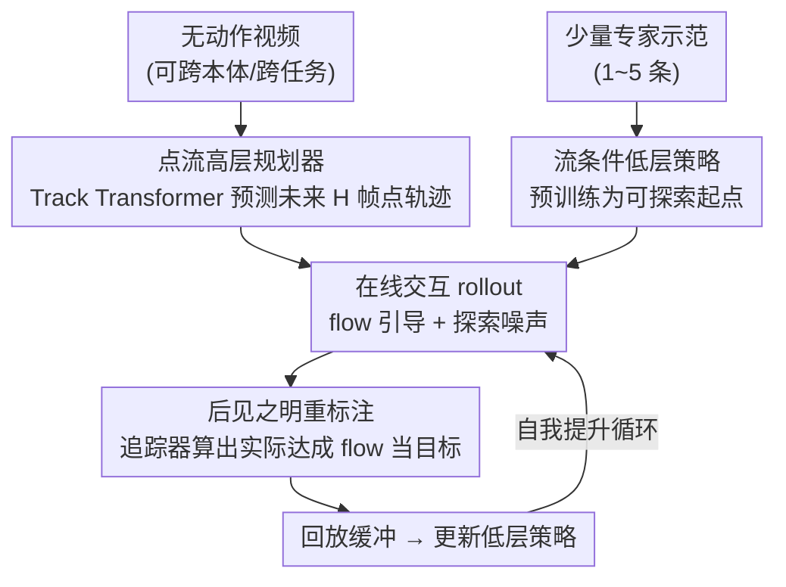

# Translating Flow to Policy via Hindsight Online Imitation

**会议**: ICLR 2026  
**OpenReview**: [https://openreview.net/forum?id=dQ6d5bgXtM](https://openreview.net/forum?id=dQ6d5bgXtM)  
**项目页**: [https://dwjshift.github.io/HinFlow](https://dwjshift.github.io/HinFlow)  
**领域**: 机器人 / 具身智能  
**关键词**: 分层机器人、点流规划、模仿学习、后见之明重标注、在线自我提升

## 一句话总结
HinFlow 让机器人在点流（point flow）高层规划器的引导下自己跟环境交互，把每条 rollout 里**实际走出来的 flow** 反过来当成目标重新标注，喂给目标条件模仿策略做在线训练，从而在仅有 1~5 条专家示范的情况下把成功率拉到 84%，比最强基线高 1.45×。

## 研究背景与动机

**领域现状**：为了绕开机器人端到端学习对海量真机数据的依赖，分层机器人系统把控制问题拆成两层——高层规划器把抽象任务分解成子目标，低层控制器负责执行。高层规划器因为不碰具体动作，可以在大量无动作的视频（甚至跨本体、跨任务的视频）上训练；其中**点流**（一组关键点未来若干帧的 2D 轨迹）是一种很受欢迎的子目标表示，因为它显式编码物理运动、对外观/光照变化鲁棒，又比图像目标紧凑得多。

**现有痛点**：高层规划器好训，但**把 flow 落地成可执行动作（flow-to-policy）这一步很难**。一类做法用解析/优化方法直接从 flow 反解动作，但严重依赖刚体假设，碰到遮挡或非刚体就崩；另一类做法学一个数据驱动的目标条件策略，更通用，却需要采集大量高质量的领域内真机数据——又贵又费人力，等于把"可扩展技能获取"的初衷打回原形。

**核心矛盾**：高层规划能力可以靠廉价视频无限扩展，低层执行能力却卡在昂贵的真机动作数据上，整个分层系统的瓶颈被压在低层执行。已有的在线方法（如用视频预测构造奖励再上 RL）又面临视觉奖励下探索低效、长程奖励难优化的老问题。

**本文目标**：在**几乎没有专家动作数据**的前提下，让低层策略自己把高层 flow 计划学会执行。

**切入角度**：作者的关键观察是——机器人交互时即使没达到规划器给的精确目标，这段经历本身仍然"走出了某条 flow"。只要把这条**实际达成的 flow 当作本来就想要的目标**，失败的探索就摇身一变成了合法的监督信号。这正是 hindsight relabeling（后见之明重标注）的思路，但用在 flow 这个紧凑表示上。

**核心 idea**：用"达成即目标"的后见之明重标注，把机器人自己不完美的在线 rollout 变成目标条件模仿的训练数据，从而把 flow 规划稳定地翻译成可执行策略——监督学习目标简单、好优化，不需要堆专家数据。

## 方法详解

### 整体框架
HinFlow 由两半组成：**左边是分层策略**（高层 flow 规划器 + 低层 flow 条件策略），**右边是后见之明重标注的回放缓冲**。先在无动作视频上训出 flow 规划器、用极少量专家示范预训练出一个能动的低层策略当起点；然后进入自我提升循环——机器人在规划器引导下交互采样，用现成视频追踪器算出这段 rollout 里**实际达成的 flow**，把"观测-动作-达成 flow"三元组塞进回放缓冲并更新策略。失败经历经此重标注后也成了有效监督，越练越稳，形成良性循环。

### 关键设计

**1. 点流高层规划器：用任务相关的运动当通用子目标**

低层策略需要一个既通用又抗视觉扰动的引导信号，图像目标太冗余、解析反解又依赖刚体假设。HinFlow 选用点流：在第一帧相机画面里选一组初始点 $p_0=\{(x_{0,k},y_{0,k})\}$，用现成视频追踪器（CoTracker3）跟出它们未来的 2D 轨迹当训练标签，规划器在时刻 $t$ 预测子目标 $G_t=\{\hat p_i\}_{i=t}^{t+H}$（即未来 $H$ 帧的点位置）。为了让引导信号真正承载操作信息，作者不是随便撒点，而是用**任务中心采样器**：第三人称相机下先分割出末端执行器和关键物体，只在这些区域内随机采点；腕部相机因为任务物体不一定常驻视野，就退化为固定的 $32$ 点网格。规划器沿用 ATM 的 Track Transformer，把图像和查询点 token 化后送进多模态 transformer，用 flow 预测损失 $\min_\xi \mathbb{E}[L_{\text{flow}}(F_{\text{flow}}(o_t,p_t;\xi),\,p^{t+H}_{t+1})]$ 训练。点流这一表示把外观、光照这类与控制无关的因素过滤掉，让后续策略对视觉变化天然鲁棒。

**2. 后见之明重标注：把"做砸了的探索"变成合法监督**

这是 HinFlow 的核心。低层策略受限于动作数据稀缺，常常达不到规划器给的精确 flow 目标——但作者指出，机器人这段 rollout **客观上走出了某条 flow**，只要把这条实际达成的 flow 反过来认作"本来就想要的目标"，这段失败经历对那个目标而言就是一次成功示范。具体做法：跑完一整段 $\{(o_t,a_t)\}_{t=1}^T$ 后，用视频追踪器 $\Phi$ 处理采到的画面、算出每个时刻实际达成的 flow $\{p_i\}_{i=t}^{t+H}$，组成 $(o_t,a_t,\{p_i\}_{i=t}^{t+H})$ 三元组放进回放缓冲。这样监督信号直接从机器人自己不完美的经历里"无中生有"，不再依赖大量专家示范。相比之下，Online VPT 那类靠逆动力学模型给视频伪标动作的做法，会在无动作视频上引入大量伪标误差；HinFlow 用点流这个紧凑鲁棒的目标绕开了这个坑。

**3. 流条件低层策略 + 在线自模仿循环：边交互边收敛**

低层策略 $\pi(o_t, F_{\text{flow}}(o_t,p_t))$ 是个 transformer：当前帧的视觉与本体感觉先编码进空间 transformer 得到空间 token，再和 flow token 拼起来融合引导信息，最后过若干 MLP 输出动作（并引入 action chunking）。训练时关键的一点是——**flow 直接取自回放缓冲里重标注的达成 flow，而不是推理时规划器给的预测 flow**，优化目标 $\min_\theta \mathbb{E}_{(o_t,a_t,\{p_i\})\sim D_r}[L(\pi(o_t,\{p_i\};\theta),a_t)]$。整个过程是交互与优化同时进行：先用少量专家示范把策略预训练成一个"能走出有意义 rollout"的起点（否则全凭噪声探索什么也学不到），然后不断采样-重标注-更新，让策略从环境反馈里持续自我提升。由于监督目标本质是 MSE 模仿、条件良好、好优化，它避开了 RL 在视觉长程奖励下探索低效的难题。

### 损失函数 / 训练策略
- **高层**：flow 预测损失（式 2），在标注后的视频集 $\bar D_h$ 上训练 Track Transformer。
- **低层**：模仿损失（式 3，通常 MSE），数据来自后见之明重标注的回放缓冲 $D_r$；初始化阶段用少量专家示范 $D_a$ 以相同目标预训练。
- 在线阶段每段 rollout 注入适度探索噪声以鼓励访问新状态；交互全程**环境不提供任何奖励或成功信号**，纯靠自模仿驱动。

## 实验关键数据

### 主实验
七个操作任务（LIBERO 四个 + ManiSkill3 三个），所有结果 5 个随机种子平均，在线方法均交互 80K 步（约 300~400 episode）。

| 设置 | 平均成功率 | 说明 |
|------|-----------|------|
| HinFlow（本文） | **84.0%** | 比最强基线高 **1.45×** |
| BC | 受限于动作示范数 | 仅靠少量专家示范，泛化差 |
| ATM (grid) / ATM (seg) | 受限于动作示范数 | 离线 flow 条件策略，无在线提升 |
| Online VPT | 个别任务略升 | IDM 伪标动作误差大，多数任务挣扎 |

在 Hide Chocolate、Pull Cube Tool 等难任务上，HinFlow 把策略从接近 0 拉到平均 75%。真机实验（抓鼠标放到垫子）进一步验证：

| 方法 | 成功率（20 次） |
|------|----------------|
| BC | 4/20 |
| ATM (seg) | 8/20 |
| HinFlow | 8/20 → **19/20** |

仅用 100 条无动作视频 + 2 条专家示范，10000 步（86 episode、约 1 小时）在线交互后，成功率从 40% 升到 95%。

### 迁移与泛化实验

| 实验 | 设置 | 本文 | 对照 |
|------|------|------|------|
| 跨本体（Place Book，Franka→Kinova） | 用跨本体视频 / 不用 | 48.1% / 0.6% | — |
| 跨本体（Poke Cube，Franka→xArm） | 用跨本体视频 / 不用 | 61.3% / 24.4% | — |
| 零样本泛化（Place Butter，额外干扰物） | 直接评测 | 92.8% | BC 0.0% |
| 零样本泛化（Place Butter，未见目标物） | 直接评测 | 96.2% | BC 6.5% |

跨本体视频带来 40+ 个百分点的成功率增益；低层策略对加干扰物、换目标物这类视觉扰动几乎不掉点，而 BC 直接崩盘（从 67.5% 跌到 10% 以下）。

### 消融实验

| 消融维度 | 配置 | 关键发现 |
|----------|------|---------|
| 预训练示范数 | LIBERO 0/1/3，ManiSkill 0/2/5/10 | 0 条时策略探索不出有意义轨迹、成功率近 0；≥1 条后初始成功率随示范数升高，但在线模仿后**最终性能趋于一致**——对初始策略质量不敏感 |
| flow 长度 | 4 / 8 / 12 / 16（默认 8） | 8/12/16 都稳定鲁棒；长度 4 显著掉点，因为过短的预测视野提供的引导不足 |

### 关键发现
- **后见之明重标注是性能跃升的根本来源**：去掉在线自模仿（退化为离线 ATM）就回到了被示范数卡死的水平。
- **只要有一条示范就够起步**：在线提升能抹平初始策略质量的差距，意味着真机部署对人工示范的需求极低。
- **点流目标的紧凑性带来鲁棒性**：跨本体、加干扰物、换目标物都不崩，关键在于 flow 抽掉了任务无关的视觉因素。

## 亮点与洞察
- **把"失败的探索"重新定义成"成功的另一个目标"**：hindsight relabeling 本身不新（HER 系传统），但作者把它接到点流这个紧凑表示上，恰好规避了图像目标/IDM 伪标的高维误差，是个干净漂亮的组合创新。
- **用短程 flow 而非长程 flow**：让规划器只预测未来一小段，既降低了高层预测难度，又恰好把问题变成"复刻已达成 flow"的自模仿——一个细节差异撬动了整套监督形式。
- **无奖励纯自监督的在线提升**：环境不给任何成功/奖励信号，全靠重标注产生密集监督，绕开 RL 在视觉长程奖励下的优化噩梦，这个"把 RL 问题降维成监督模仿"的思路可迁移到其它目标条件控制任务。

## 局限与展望
- **仍需少量领域内动作示范当探索起点**：0 示范时学不动。作者展望用开放世界 VLA 模型（π0、OpenVLA 等）提供初始探索轨迹，从而彻底去掉动作标注需求。
- **绑死 2D 点流**：对复杂 3D 运动天然有歧义，作者建议扩展到 3D motion field 等更强的目标表示。
- **自模仿可能放大初始偏差**：重标注把策略自己走出来的 flow 当目标，若早期探索分布过窄，是否会陷入次优自洽（论文未深入讨论），是值得关注的隐患。

## 相关工作与启发
- **vs ATM (Wen et al., 2023)**：ATM 同样用 Track Transformer 预测点流，但低层是纯离线模仿、被领域内真机数据量卡死；HinFlow 在它之上加了在线自模仿循环，把成功率从被示范数限制拉到 84%，本文还贡献了任务中心采样（ATM seg 变体）。
- **vs Online VPT (Baker et al., 2022 改)**：VPT 用逆动力学模型给视频伪标动作再学 BC，HinFlow 指出 IDM 在无动作视频上伪标误差大；改用点流当目标，避开动作伪标这一步，目标更紧凑鲁棒。
- **vs 基于 flow 的 RL（Guzey/Yu et al., 2025）**：他们把人类视频/生成 flow 当稠密奖励上 RL，需要预测长程完整 flow 且面临 RL 优化难题；HinFlow 用短程 flow + 自模仿，把问题重构成条件良好的监督学习。
- **vs 图像目标的 hindsight 方法（Luo & Du、Zhou et al., 2025）**：他们用视频扩散/VLM 生成图像目标做 hindsight，HinFlow 换成点流——低维、滤掉视觉噪声，得到更鲁棒的控制策略。

## 评分
- 新颖性: ⭐⭐⭐⭐ flow + hindsight 的组合干净有效，但两件零件各有渊源
- 实验充分度: ⭐⭐⭐⭐⭐ 仿真七任务 + 真机 + 跨本体 + 零样本泛化 + 消融，覆盖全面、均 5 种子
- 写作质量: ⭐⭐⭐⭐ 动机清晰、算法简洁；部分实现细节推到附录
- 价值: ⭐⭐⭐⭐⭐ 用极少示范 + 无奖励在线提升把 flow 落地成策略，对可扩展真机学习很实用

<!-- RELATED:START -->

## 相关论文

- [\[ICLR 2026\] VITA: Vision-to-Action Flow Matching Policy](vita_vision-to-action_flow_matching_policy.md)
- [\[ICLR 2026\] Geometry-Aware Policy Imitation](geometry-aware_policy_imitation.md)
- [\[ICLR 2026\] Primary-Fine Decoupling for Action Generation in Robotic Imitation](primary-fine_decoupling_for_action_generation_in_robotic_imitation.md)
- [\[ICLR 2026\] Masked Generative Policy for Robotic Control](masked_generative_policy_for_robotic_control.md)
- [\[ICLR 2026\] RFS: Reinforcement Learning with Residual Flow Steering for Dexterous Manipulation](rfs_reinforcement_learning_with_residual_flow_steering_for_dexterous_manipulatio.md)

<!-- RELATED:END -->
