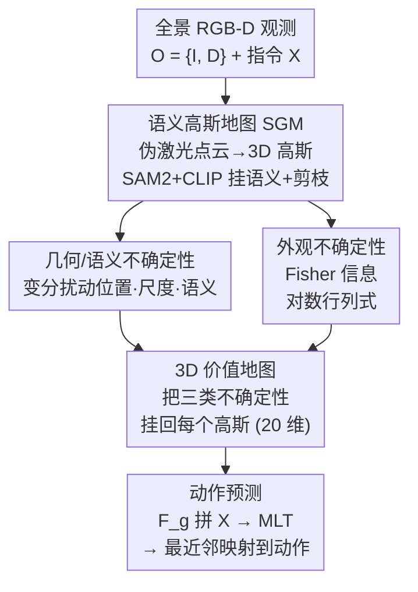

# Uncertainty-Aware Gaussian Map for Vision-Language Navigation

**会议**: ICLR 2026  
**OpenReview**: [https://openreview.net/forum?id=LPv59noPAy](https://openreview.net/forum?id=LPv59noPAy)  
**代码**: https://github.com/Gaozzzz/Uncertainty-Aware-VLN  
**领域**: 视觉语言导航 / 具身智能 / 3D Gaussian  
**关键词**: 视觉语言导航, 感知不确定性, 语义高斯地图, Fisher 信息, 3D 价值地图

## 一句话总结
这篇论文给视觉语言导航（VLN）智能体显式建模"看不清"这件事：在一张可微的语义高斯地图（SGM）上估计几何、语义、外观三类感知不确定性，把它们打包成一张统一的 3D 价值地图喂给决策网络，让 agent 在证据不足时不再硬猜，从而在 R2R / RxR / REVERIE 三个基准上稳定超过 SOTA。

## 研究背景与动机

**领域现状**：VLN 要求具身 agent 按自然语言指令在 3D 场景里导航。主流路线从早期的 seq2seq 直接把语言+视觉映射成动作，演进到地图式范式——用拓扑图编码连通性、用栅格/体素表示捕捉 3D 结构，再到近期用 3D Gaussian Splatting 作为场景表示；策略学习也从纯模仿学习走向模仿+强化的混合方案，甚至引入世界模型做前瞻规划。

**现有痛点**：几乎所有现有 agent 在决策时都"忽略感知里的不确定性"。它们的训练配方恰恰鼓励 agent 无论置信度高低都给出动作，不允许表达"我看不清"。结果就是：两扇长得一样的门、门后线索又不足时，agent 会自信地认错目标；前方被遮挡、可通行性其实存疑时，agent 也会照走不误，撞上桌子或走进危险路径。

**核心矛盾**：感知本身是有可靠度差异的——有些区域几何结构清楚、有些区域反光/重复纹理/遮挡导致语义和外观都很模糊。但现有方法把所有观测一视同仁地塞进决策，没有一个机制告诉策略"哪块证据可信、哪块该打折扣"。不确定性这个本可以救命的信号，被整个丢掉了。

**本文目标**：把感知不确定性显式地建模出来、并落到 agent 的观测空间里，让它直接参与动作预测。具体拆成三个子问题——用什么表示能让不确定性"挂得上去"、怎么估计不同形态的不确定性、怎么把估计结果变成可被策略消费的信号。

**切入角度**：作者选择 3D Gaussian 作为载体。相比隐式 latent 表示把特征全局纠缠在一起、难以做区域级的不确定性推理，3D Gaussian 的显式结构天然把位置、尺度、语义这些有物理含义的属性绑在每个 primitive 上——这意味着可以逐高斯地扰动、逐高斯地度量"这块靠不靠谱"。

**核心 idea**：在一张语义高斯地图上估计几何/语义/外观三类不确定性，把它们作为 affordance 与 constraint 注入每个高斯，扩展成统一的 3D 价值地图来驱动可靠决策。

## 方法详解

### 整体框架
每走到一个 waypoint，agent 先从全景 RGB-D 观测 $O=\{I, D\}$ 构造一张语义高斯地图 SGM（§3.1）；然后在 SGM 之上估计三类感知不确定性——几何 $U^g$、语义 $U^s$、外观 $U^a$（§3.2）；接着把三类不确定性挂回每个高斯，把 SGM 扩展成统一的 3D 价值地图（§3.3）；最后从价值地图导出的高斯表示 $F^g$ 与指令嵌入 $X$ 拼接，送进多层 transformer $F_{\text{MLT}}$，对候选 waypoint 打分预测下一步动作。整条管线在每步重复，并配一个拓扑记忆累积跨步上下文。

### 关键设计

**1. 语义高斯地图：给不确定性找一个挂得上去的显式载体**

要逐区域地谈"可不可靠"，得先有一个每块都带物理属性的场景表示，这正是隐式特征做不到的。SGM 在每个 waypoint 把多视角 RGB-D 转成一堆可微 3D 高斯：先用深度和相机内参把每个像素反投影回 3D，公式为 $z = D(u,v)$、$x=(u-c_u)z/f_x$、$y=(v-c_v)z/f_y$，得到稀疏伪激光点云，每个点初始化一个高斯，参数包括均值 $\mu_i\in\mathbb{R}^3$、协方差 $\Sigma_i = RE E^\top R^\top$、不透明度 $\alpha_i$、颜色球谐系数 $c_i$ 和语义属性 $s_i$。语义属性的来源是把全景图用 SAM2 切成连贯区域、再抽 CLIP 嵌入挂到对应高斯上。地图通过可微渲染（颜色 $\hat I$、深度 $\hat D$、语义 $\hat S$ 都按深度排序 $\alpha$-blending 得到）与当前观测对齐来优化。优化几轮后再做一次剪枝，只保留满足 $\|e_i\|_2 > \tau_e \wedge \alpha_i > \tau_\alpha$ 的高斯——小尺度高斯往往是表面噪声、低透明度的是背景杂波，留着反而误导决策。这张精炼后的 SGM 就成了后续所有不确定性建模的底座。

**2. 几何与语义不确定性：用变分扰动量化"结构和语义有多不稳"**

几何不确定性回答"这块空间结构靠不靠谱"，语义不确定性回答"这块的物体/区域含义是否歧义"，两者共用同一套变分推断机制。做法是把每个高斯的位置和尺度看成带可学习扰动的随机变量 $\mu_i' = \mu_i + \chi_i^\mu$、$e_i' = e_i + \chi_i^e$，扰动代表了该高斯的"另一种结构假设"。扰动的真实后验 $p(\chi|O)$ 在高维连续空间上不可解，于是引入变分分布 $q_\phi(\chi)$，通过最小化它与真后验的 KL 散度来优化——由于 $\log p(O)$ 对 $\chi$ 是常数，最小化 KL 等价于最大化证据下界 ELBO。位置扰动的先验取零均值高斯 $\mathcal{N}(0,\delta^2 I)$，尺度扰动取依赖尺度的均匀分布 $\mathcal{U}(-\eta e, \eta e)$。学到 $q_\phi$ 后，几何不确定性就是位置和尺度扰动标准差的聚合：$U_i^g = \|F_{\text{std}}(q_{\phi_i^\mu})\|_2 + \|F_{\text{std}}(q_{\phi_i^e})\|_2$。语义不确定性照搬这套框架，只扰动语义属性 $s_i$（固定几何以保持空间一致），先验 $\mathcal{N}(0,\epsilon^2 I)$，得到 $U_i^s = \|F_{\text{std}}(q_{\phi^s})\|_2$。扰动方差大，就说明这个高斯的结构/语义解释本身不稳，决策时应当对它打折。

**3. 外观不确定性：用 Fisher 信息度量"渲染对扰动有多敏感"**

外观不确定性刻画的是观测里那些不可控的视觉模糊——遮挡、纹理不一致、反光等。作者把它定义为重建损失 $L_r = \frac{1}{2}\|\hat I - I\|_2^2$ 对 SGM 变化的敏感度，原则上由 Hessian $\nabla_G^2 L_r$ 刻画，但直接算不可行。注意到 Hessian 可分解为 Fisher 信息项 $\nabla_G \hat I\, \nabla_G \hat I^\top$ 加上残差项 $(\hat I - I)\nabla_G^2 \hat I$，而在精炼后的 SGM 里残差项 $(\hat I - I)$ 趋近于零，于是 Hessian 退化成 Fisher 信息，成为敏感度的可解代理。Fisher 信息矩阵维度仍然和 Hessian 一样大 $((|G|\cdot d_g)\times(|G|\cdot d_g))$，作者把每个高斯的参数分组，取对角块 $\mathbb{R}^{d_g\times d_g}$ 隔离单个高斯的敏感度，外观不确定性定义为该块的对数行列式 $U_i^a = \log|\nabla_{g_i}\hat I\,\nabla_{g_i}\hat I^\top|$——对数行列式量化了参数空间里不确定性椭球的体积。Fisher 信息高，意味着即使高斯轻微移动也会让渲染观测剧烈变化，这种地方的场景理解和动作预测都不稳。

**4. 3D 价值地图与动作预测：把不确定性变成策略能直接消费的信号**

光估出三个标量还不够，得让策略真正用上。作者把 $U_i^g, U_i^s, U_i^a$ 直接挂回每个高斯，把它扩成 20 维表示 $g_i = \{\mu_i, e_i, r_i, \alpha_i, c_i, s_i, U_i^g, U_i^s, U_i^a\}\in\mathbb{R}^{20}$，这就是 3D 价值地图——它在保留几何语义的同时把可靠度作为 affordance 与 constraint 落进观测空间。动作预测时，每个 $g_i$ 经非线性投影成特征 $F_{g_i}\in\mathbb{R}^{768}$，聚合成全局表示 $F^g$（保留几何与不确定性的细粒度耦合），再与指令嵌入 $X$ 拼接送进多层 transformer：$p = \text{Softmax}(F_{\text{MLT}}[F^g, X])$，得到候选 waypoint 概率，最后经最近邻映射 $\tilde p = \mathcal{N}(p, V)$ 对齐到可执行动作空间。这样策略就能同时推理几何结构和感知置信度，在证据不足时倾向于不确定性更低的选择。

### 损失函数 / 训练策略
SGM 用逐像素渲染损失监督：颜色用 L1 + SSIM（$L_{rgb}=\|\hat I - I\|_1 + L_{\text{SSIM}}$），深度和语义各用 L1（$L_{depth}, L_{sem}$）。导航部分沿用两阶段训练：先用掩码语言建模（MLM）、单步动作预测（SAP）等辅助目标预训练强化多模态表示（REVERIE 额外加 Object Grounding），再用行为克隆 + 伪专家指导（DAgger）微调策略。预训练 100k 步、batch 64、lr 1e-4；微调 25k 步、batch 8、lr 1e-5。另维护一个动态拓扑记忆图，节点存 2D 全景嵌入与 3D 价值地图表示、边存可通行性，支持回溯与跨步一致性。

## 实验关键数据

### 主实验
在 Matterport3D 模拟器上的三个基准、五次运行取平均。

| 数据集 | 指标 | 本文 | 之前 SOTA | 提升 |
|--------|------|------|----------|------|
| R2R val unseen | SR / SPL | 78 / 66 | 76 / 65 (VER) | +2 / +1 |
| REVERIE val unseen | RGS / RGSPL | 37.65 / 27.01 | 34.71 / 24.44 (BEVBert) | +2.94 / +2.57 |
| RxR val unseen | SR / nDTW | 65.2 / 65.6 | 64.1 / 63.9 (BEVBert) | +1.1 / +1.7 |

RxR 上 SDTW 53.5 vs 52.6，基本持平；REVERIE 在 RGS/RGSPL 这两个"远程物体定位"指标上提升最显著，说明价值地图对精确 grounding 帮助最大。

### 消融实验

核心组件（R2R / REVERIE val unseen，Table 4）：

| 配置 | R2R SR | REVERIE RGS | 说明 |
|------|--------|-------------|------|
| DUET 基线 | 72.22 | 32.15 | 不带 SGM 也不带不确定性 |
| + SGM | 76.21 | 35.48 | 只用语义高斯地图作场景表示 |
| + 3DVM | 74.20 | 34.02 | 只用三类不确定性、丢掉原始高斯参数 |
| Full | 78.32 | 37.65 | SGM + 3D 价值地图 |

三类不确定性贡献（Table 6，基线为只用 SGM）：

| 配置 | R2R SR | REVERIE RGS | 说明 |
|------|--------|-------------|------|
| 仅 SGM | 76.21 | 35.48 | 无不确定性 |
| + $U^g$ + $U^s$ | 77.05 | 36.96 | 几何+语义 |
| + $U^a$ | 76.86 | 35.68 | 仅外观 |
| 全部 | 78.32 | 37.65 | 三类齐全 |

### 关键发现
- SGM 和不确定性各自都能涨点：单加 SGM 把 REVERIE RGS 从 32.15 拉到 35.48；单用不确定性（丢掉原始高斯参数）也能把 R2R SR 从 72.22 提到 74.20，说明感知不确定性本身就携带有用的决策线索。两者结合（Full）增益最大。
- 显式 3D 结构比"只剩不确定性"更顶用：行 #2 vs #3 上 SGM（含上下文）整体强于纯不确定性，说明不确定性是补充信号而非替代场景表示。
- 几何+语义不确定性比外观更有价值：识别"空间结构/语义解释不稳"对导航的帮助大于"渲染对视觉变化敏感"，但三者互补、全开最好。
- 剪枝阈值有甜点（Table 5）：$\tau_e{=}0.015, \tau_\alpha{=}0.005$ 时高斯数从 5 万降到 4.2 万、FPS 从 11.2 升到 15.5，且精度最高；剪太狠（行 #4，降到 3.5 万）则 R2R SR 掉到 74.80、REVERIE RGS 掉到 32.30，明显退化。

## 亮点与洞察
- 把"感知不确定性"从被丢弃的副产品提升为一等观测信号，且不是抽象地谈，而是落到每个 3D 高斯上、最终拼成可被 transformer 直接消费的 20 维表示——这种"显式结构 + 逐 primitive 不确定性"的组合很难在隐式 latent 表示上实现。
- 三类不确定性用了两套互补机制：几何/语义共享变分扰动（看分布有多散），外观走 Fisher 信息（看损失曲面有多陡）。尤其外观这条，借"精炼 SGM 下残差项趋零"这个观察把 Hessian 优雅退化成 Fisher 信息、再用对角块降维，是个可复用的工程 trick。
- "价值地图"这个抽象很迁移友好：任何带显式 primitive 的场景表示（点云、体素、高斯）都可以把可靠度作为 affordance/constraint 挂上去，驱动机器人导航、抓取等需要"知道自己哪里看不清"的任务。

## 局限与展望
- 主要开销在构造 3D 价值地图，尤其是 SGM 里的语义属性抽取（SAM2 分割）和不确定性估计；作者靠离线预训练和把 SAM2 换成轻量变体来缓解推理成本，但这本质上是质量-速度的权衡，实时部署时仍需取舍。
- 不确定性建模依赖可微渲染重建质量：在精炼 SGM 假设下外观不确定性才约等于 Fisher 信息，若场景重建本身差（残差项不小），这个近似的可靠性存疑。
- 评测都在 Matterport3D 的离散全景 waypoint 设定下，连续环境（continuous VLN）和真实机器人本体上的表现未验证；提升幅度在各指标上多为 1–3 个百分点，属于稳定但非颠覆性的增益。
- 三类不确定性如何加权融合进 $F^g$ 是隐式学的，缺少对"agent 在什么情形下真的靠不确定性翻盘"的更系统量化（目前主要靠 case study 展示）。

## 相关工作与启发
- **vs 3DGS-VLN（同作者，ICCV'25）**：3DGS-VLN 用 3D 高斯+开集语义分组做场景表示但不建模不确定性；本文在同样的高斯底座上加了三类感知不确定性，REVERIE val unseen RGS 从 36.73 提到 37.65、R2R SR 从 77 提到 78。
- **vs VER（CVPR'24）**：VER 用体素环境表示捕捉 3D 结构，本文用可微高斯且显式编码可靠度；定性上 VER 在视觉相似的"窗户/桌子"场景会误判或撞障停下，本文靠不确定性消歧、绕障完成指令。
- **vs VLN-Copilot**：它估计的是决策级不确定性（从动作分布判断何时求助外部 LLM），本文聚焦感知级不确定性（几何/语义/外观），是观测端而非决策端的可靠度建模。
- **vs 隐式不确定性估计（MC Dropout / 深度集成）**：传统方法在全局纠缠的 latent 上估不确定性、难做区域级推理；本文借 3D Gaussian 的显式物理属性实现逐 primitive、可解释的不确定性。

## 评分
- 新颖性: ⭐⭐⭐⭐ 把感知不确定性显式落到 3D 高斯并融成价值地图，角度清晰且在 VLN 里少见。
- 实验充分度: ⭐⭐⭐⭐ 三基准 + 五次运行带方差 + 组件/不确定性/剪枝多组消融，较扎实；但缺连续环境与真机验证。
- 写作质量: ⭐⭐⭐⭐ 动机由图示驱动、公式推导（ELBO、Fisher 近似）交代清楚。
- 价值: ⭐⭐⭐⭐ "让 agent 知道自己哪里看不清"的思路对具身导航与机器人有较好迁移性。

<!-- RELATED:START -->

## 相关论文

- [\[CVPR 2026\] Bridging the 2D-3D Gap: A Hierarchical Semantic-Geometric Map for Vision Language Navigation](../../CVPR2026/robotics/bridging_the_2d-3d_gap_a_hierarchical_semantic-geometric_map_for_vision_language.md)
- [\[ICLR 2026\] CoNavBench: Collaborative Long-Horizon Vision-Language Navigation Benchmark](conavbench_collaborative_long-horizon_vision-language_navigation_benchmark.md)
- [\[CVPR 2026\] GA-VLN: Geometry-Aware BEV Representation for Efficient Vision-Language Navigation](../../CVPR2026/robotics/ga-vln_geometry-aware_bev_representation_for_efficient_vision-language_navigatio.md)
- [\[ACL 2026\] VLN-NF: Feasibility-Aware Vision-and-Language Navigation with False-Premise Instructions](../../ACL2026/robotics/vln-nf_feasibility-aware_vision-and-language_navigation_with_false-premise_instr.md)
- [\[ICLR 2026\] Action-aware Dynamic Pruning for Efficient Vision-Language-Action Manipulation](action-aware_dynamic_pruning_for_efficient_vision-language-action_manipulation.md)

<!-- RELATED:END -->
