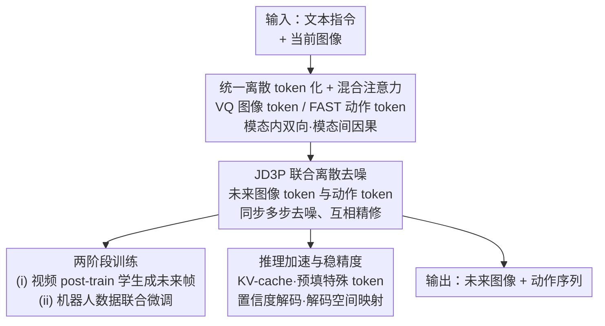

# Unified Diffusion VLA: Vision-Language-Action Model via Joint Discrete Denoising Diffusion Process

**会议**: ICLR 2026  
**OpenReview**: [https://openreview.net/forum?id=UvQOcw2oCD](https://openreview.net/forum?id=UvQOcw2oCD)  
**代码**: 有（项目页，论文中以链接给出）  
**领域**: 机器人 / 具身智能 / 视觉-语言-动作模型 / 离散扩散  
**关键词**: VLA、统一离散扩散、联合去噪、未来帧预测、混合注意力

## 一句话总结
UD-VLA 把"看图读指令 → 生成未来画面 → 推断动作"三件事压进**同一条离散去噪轨迹**（JD3P），让动作 token 在每一步去噪时都能反复"盯着"逐渐清晰的未来图像 token 来精修自己，在 CALVIN / LIBERO / SimplerEnv 上拿到 SOTA 的同时把推理速度提到自回归方法的 4 倍。

## 研究背景与动机

**领域现状**：视觉-语言-动作（VLA）模型要做的事是——读懂自然语言指令和当前视觉观测，作为一个具身智能体输出对应动作。近来一类"统一 VLA"把**预测未来图像**塞进了"理解-执行"回路：先想象未来画面，再据此推动作，相当于把抽象的"该怎么动"转化成更可解的逆运动学（inverse kinematics）问题，给策略带来了规划与前瞻能力。

**现有痛点**：要做到这种统一，已有两条路线都不够好。第一条用**外部专家**（如 CLIP/ViT 编码器 + 扩散解码器）来对齐模态，VLA 只吐中间 token 当条件，再交给独立的图像生成模型和动作生成模型去出未来帧和动作——这种模块拼接带来对齐误差、系统复杂、图像生成与动作预测**耦合很弱**。第二条把输入输出都 token 化进同一空间（视觉 tokenizer + 动作 tokenizer），省了额外编解码器，但图像生成和动作预测**仍是两个分离的过程**；更有甚者只在训练时把图像当辅助任务预测，推理时根本不生成未来图像，白白丢掉了"用未来画面显式指导动作"的价值。

**核心矛盾**：真正的"理解-生成-执行"统一，要求三者**内在协同**——动作应当被表述为"通往期望未来观测的隐式映射"。但无论是用自回归一个个吐 image/action token，还是把图像扩散和动作扩散分开跑，动作 token 都只在"单次计算"里吸收了一回上下文，图像信息对动作的指导是**一锤子买卖**，没法被反复利用。

**本文目标**：让视觉生成和动作预测在**一个同步的去噪过程**里被联合优化，使得每一步去噪时所有动作 token 都能因果地关注所有未来图像 token，并且这套计算沿去噪轨迹**重复多次**。

**切入角度**：作者押注"由粗到精的迭代精修"——动作从初始化出发，伴随未来图像一起去噪，在充分的视觉指导下逐步演化，最后在基于置信度的准则下收敛成精确动作。这等于把潜在视觉表征**转译成时序结构化的动作**。

**核心 idea**：用一条**联合离散去噪扩散过程（JD3P）**把多模态统一进单一去噪轨迹，让"理解、生成、执行"在每一步互相强化，而不是分阶段、分模型地各算各的。

## 方法详解

### 整体框架
UD-VLA 以一个预训练 VLM 为骨干，在**单个 Transformer** 里同时打通"视觉-语言理解 → 未来图像生成 → 动作预测"。它做三件事：(1) 把语言、图像、动作全部量化成离散 token 拼成一条序列，统一多模态空间；(2) 用混合注意力让模态内充分交互、模态间保持因果，把端到端动作预测拆成"前瞻预测未来帧 + 逆运动学推动作"两个耦合子过程；(3) 用 JD3P 让未来图像 token 与动作 token 在**同一步去噪**里并行精修，最后靠置信度解码收敛。

完整序列排成 `[文本 token ; 当前图像 token ; 未来图像 token ; 动作 token]`，其中前两段是输入、后两段是要去噪生成的输出。图像用 VQ tokenizer 量化成**定长**序列、动作用 FAST tokenizer 量化成**变长**序列，并用 `<BOI>/<EOI>`、`<BOA>/<EOA>` 等特殊 token 标记各模态边界。训练分两阶段（先在大规模视频上 post-train 出"生成未来图像"的能力，再在机器人动作数据上用 JD3P 联合微调），推理则靠 KV-cache、置信度解码、解码空间映射来提速保精度。

### 关键设计

**1. 统一离散 token 空间 + 混合注意力：把三模态塞进一条序列又不让信息倒灌**

针对"外部专家拼接导致弱耦合"这个痛点，UD-VLA 不再用任何外部编解码器，而是把一切都量化成离散 token：语言沿用 Emu3 的设计，视觉观测用 VQ tokenizer 离散成词表里的 $V_v$ 个 token，动作用 FAST 离散成 $V_a$ 个 token，全部拼进同一条多模态序列，于是"理解-生成-执行"天然共享一个表示空间。但光拼起来还不够——如果让所有 token 互相自由关注，会出问题。作者据此设计**混合注意力**：输入侧的文本走因果、当前图像走双向；输出侧切成"生成块（未来图像）"和"执行块（动作）"，**块内双向**（让一张图的各 token 彼此关注保证全局一致，让位置/旋转等不同维度的动作打破严格时序依赖、避免捷径学习），**块间因果**（生成块只看输入、执行块同时看输入和生成块，信息绝不往回流）。

这个"块内双向、块间因果"的关键在于**显式禁止"动作 → 视觉"的通路**：它把原本难训的端到端动作预测重构成两个耦合过程——(i) 预测下一视觉状态的前瞻过程，(ii) 在该视觉预测条件下推断动作的逆运动学过程。这样既消除了粗糙动作信息泄漏与随之而来的误差累积，又保证下游控制是真正"被预测出来的视觉后果"所支撑，而非虚假相关。消融里把跨模态全改成双向注意力会因信息泄漏掉 0.3 平均长度，正说明这层因果约束不可少。

**2. 联合离散去噪扩散过程 JD3P：动作在每一步去噪都"盯着"逐渐清晰的未来图像**

这是全文核心，直接回应"图像与动作分离、指导只发生一次"的矛盾。JD3P 把定长未来图像 token $v_0$ 和变长动作 token $a_0$ 拼成 $v_0,a_0=(v_{0,1},\dots,v_{0,L_v},a_{0,1},\dots,a_{0,L_a})$，并在词表里加一个特殊掩码 token $M$（`<MASK>`）。加噪是一条马尔可夫链 $\{v_t,a_t\}_{t=0}^T$：每一步以概率 $\beta_t$ 把某个 token 替换成 $M$、以 $1-\beta_t$ 保持不变，转移矩阵 $Q_t e_{t,r}=(1-\beta_t)e_{t,r}+\beta_t e_M$ 逐位置独立作用。去噪则把联合条件分布因式分解为

$$p_\theta(v_{t-1},a_{t-1}\mid v_t,a_t,c)=p_\theta(v_{t-1}\mid v_t,c)\,p_\theta(a_{t-1}\mid v_t,a_t,c),$$

注意第二项里动作条件同时依赖 $v_t$ 和 $a_t$——**动作的去噪显式吃当前这一步的（尚未完全清晰的）未来图像**。整个反向过程从全 `<MASK>` 出发，每步只重构一部分被掩位置、把掩码率从高退到低，直到恢复原始 $v_0,a_0$。

为什么有效：自回归方式下每个动作 token 只在单次计算里整合上下文，图像对动作的指导被限死成一次；而 JD3P 沿去噪轨迹**重复多轮**让动作因果关注未来图像，相当于把"图像信息→动作"做了**计算量上的 scaling**，动作得以利用中间去噪步里的图像信息不断精修预测。消融表 7 直接印证：自回归 4.18、独立扩散 4.35、JD3P 4.64，且速度 4.3×。训练上作者把显式扩散链丢掉，改成**单步 mask-predict** 目标：每次采一个掩码率 $\rho_t\in(0,1]$ 打掩，只在被掩位置算交叉熵恢复原 token：

$$L_{CE}(\theta)=-\omega\sum_j \log p_\theta^{(v)}(v_{0,j}\mid v_t,c)\,\mathbb{1}\{v_{t,j}{=}M\}-\sum_i \log p_\theta^{(a)}(a_{0,i}\mid v_t,a_t,c)\,\mathbb{1}\{a_{t,i}{=}M\},$$

其中 $\omega$ 下调视觉 token 权重防止它们主导损失，从而促进更强的视觉-动作交互。

**3. 两阶段训练：先把"会想象未来帧"的能力灌进 VLM，再联合微调动作**

骨干 VLM 原本是自回归 + 因果注意力训练出来的，不会生成未来图像。直接上 JD3P 联合训练会因为缺乏世界动态建模而不稳。作者据此分两步走：阶段 (i) 在大规模视频数据上 post-train，序列只排 `[文本 ; 当前图像 ; 未来图像]`，让模型先学会"理解并建模未来状态"——把图像生成/世界模型能力注入 VLA；阶段 (ii) 才在下游机器人动作数据上按完整序列联合优化图像与动作生成。关键的工程细节是：阶段 (ii) 把自回归解码**重构成 JD3P 扩散过程**时，没有用标准扩散"预测掩码位置"，而是借鉴 shift-operation 策略去**预测下一个 token**，这样既保留了 next-token 预训练学到的能力，又能享受双向上下文和并行解码——相当于在不丢预训练知识的前提下平滑切到扩散范式。

**4. 推理期三件套：在保精度的同时把速度拉到 4×**

联合去噪若朴素实现，会重复编码前缀、容易跨模态产错 token、且收敛慢。作者用三招治理。其一**前缀 KV-cache + 预填特殊 token**：缓存当前视觉和提示 token 的 K/V；又因图像 token 定长、动作 token 变长，提前在对应位置填好 `<BOI>/<EOI>/<BOA>`，引导两类 token 的去噪，实测显著降延迟、提速度。其二**置信度引导解码**：从 $t=T$ 全噪声出发按余弦掩码表 $\rho_t=\cos\!\big(\frac{\pi}{2}\frac{T+1-t}{T+1}\big)$ 迭代回 $t=0$，每步对当前被掩位置算置信度 $q_{t-1,r}=\max_\ell p_\theta(\ell\mid\cdot)$，只更新置信度最高的前 $(1-\rho_t)|M_t|$ 个位置（TopK），被选中位置用带温度的 Gumbel-max 采样定值——让最有把握的先确定、由粗到精地平滑精修。其三**解码空间映射**：图像/动作 token 来自很小的码本、只占模型词表的一个子集，推理时把每个模态的分类空间**限制在其专属区间**，防止产出错模态 token、稳住生成；并且一旦在某位置预测出 `<EOA>` 就固定动作长度、把后续 token 确定性地置回 `<MASK>`，避免它们污染动作预测。

### 损失函数 / 训练策略
核心训练目标即上文的单步 mask-predict 交叉熵 $L_{CE}$，只在被掩位置计算、并用 $\omega$ 给视觉 token 降权。整体训练遵循"阶段 (i) 视频 post-train 学未来帧生成 → 阶段 (ii) 机器人数据 JD3P 联合微调"两段式，阶段 (ii) 用 shift-operation 把自回归解码改写为扩散解码以保留 next-token 预训练能力。

## 实验关键数据

### 主实验

CALVIN ABCD→D（连续 5 子任务平均完成长度，越高越好）：

| 方法 | Avg. Len ↑ |
|------|------|
| UP-VLA | 4.42 |
| MDT | 4.52 |
| UniVLA* | 4.26 |
| **UD-VLA** | **4.64** |

LIBERO 四套件成功率：

| 方法 | Spatial | Object | Goal | Long | 平均 |
|------|---------|--------|------|------|------|
| OpenVLA-OFT | 96.2% | 98.3% | 96.2% | 90.7% | 95.3% |
| UniVLA | 95.4% | 98.8% | 93.6% | 94.0% | 95.5% |
| F1 | 98.2% | 97.8% | 95.4% | 91.3% | 95.7% |
| **UD-VLA** | 96.2% | **98.8%** | 94.2% | **95.2%** | **96.1%** |

SimplerEnv-WidowX 平均成功率：UD-VLA **76.0%**，显著超过 UniVLA 69.8%、F1 59.4%、SpatialVLA 42.7%；其中需要精确操作的 Stack Block 达 66.7%，比带 3D 感知的 SpatialVLA（29.2%）高出 37.5 个百分点。

### 消融实验

| 配置 | 关键指标 | 说明 |
|------|---------|------|
| Hybrid 注意力（完整） | 4.64 | 块内双向 + 块间因果 |
| Causal | 4.04 | 纯因果，掉 0.60 |
| Bidirectional | 4.32 | 全双向，跨模态泄漏掉 0.3+ |
| 生成目标 = 未来帧（本文） | 4.64 (+0.43) | 提供时序线索 |
| 生成目标 = 当前帧重建 | 4.39 (+0.18) | 只学静态场景，受限 |
| 生成目标 = Null（不生成视觉） | 4.21 | 无视觉前瞻 |
| JD3P（本文） | 4.64 / 219.3 tok·s⁻¹ (×4.3) | 联合去噪 |
| 独立扩散 ID | 4.35 / 144.4 (×2.9) | 图像、动作分开扩散 |
| Jacobi 并行 | 4.16 / 101.6 (×2.0) | 仍受自回归限制 |
| AR 自回归 | 4.18 / 50.2 (×1.0) | 慢且图像建模差 |

### 关键发现
- **联合去噪是性能与速度双赢的关键**：JD3P 相比独立扩散（4.35）和自回归（4.18），既把平均长度提到 4.64，又把解码速度从 ×1.0 拉到 ×4.3——证明动作能利用中间去噪步的图像信息持续精修，可视作一种"计算量 scaling"。
- **"生成未来帧"比"重建当前帧"更有用**：未来帧 +0.43、当前帧仅 +0.18，说明真正起作用的是时序前瞻线索而非静态感知增强。
- **混合注意力里的"块间因果"不可去**：改成全双向会因动作信息向视觉泄漏掉 0.3+ 平均长度，纯因果更是掉到 4.04。
- **真实世界泛化**：三类任务（叠碗、放积木、翻塔）上 UD-VLA 成功率均 >80%，在 unseen 场景/物体上明显强于 GR00T N1 和 UniVLA——靠的是"能生成含未见目标的未来图像 → 进而导出正确动作"的显式视觉推理。

## 亮点与洞察
- **把"视觉链式思考"做成可被多次利用的去噪轨迹**：未来图像不是用一次就丢的中间条件，而是和动作在同一条去噪轨迹上反复互相精修，这是相对"图像扩散 + 动作扩散分离"范式最巧妙的一跃。
- **混合注意力把端到端难题拆成"前瞻 + 逆运动学"两个耦合过程**：通过显式禁止动作→视觉的通路，既防信息泄漏又提升可解释性，这个"用注意力 mask 编码因果结构"的思路可迁移到其他需要"先想象后决策"的具身任务。
- **shift-operation 让扩散范式继承 next-token 预训练能力**：在不抛弃自回归 VLM 知识的前提下切换到并行扩散解码，是一个很实用的"范式平滑迁移"trick。
- **解码空间映射 + EOA 截断**是稳住离散多模态生成的小而关键的工程手段，值得复用到任何"多码本共享一个大词表"的离散生成场景。

## 局限与展望
- **生成图像保真度不足**：作者自承未来帧在机械臂、背景等细粒度细节上画质差，源于缺乏大规模生成式预训练 + 为效率用了压缩、少 token 的图像表示；虽然帧足以传达任务进展、对控制仍有用，但像素级精度难保证。
- **依赖两阶段训练**：必须先用大规模视频 post-train 才能注入未来帧生成能力，对数据和算力有要求；阶段划分本身也是个需要调的超参。
- **自定义指标解读需谨慎**：CALVIN 的 Avg. Len.、不同 benchmark 的成功率不可直接横向比大小（任务难度/协议不同），跨表结论应带 caveat。
- **改进方向**：引入更强的生成式预训练或更高分辨率的视觉 token 有望提升画质与细粒度操作；将 JD3P 推广到更长 horizon、多视角或更高频控制也是自然延伸。

## 相关工作与启发
- **vs 外部专家路线（GR-1 / SEER / DreamVLA / F1）**：它们用 CLIP/ViT 编码器 + 扩散解码器拼出未来帧与动作，模块分离、耦合弱；UD-VLA 全程离散 token + 单 Transformer，端到端联合去噪，耦合更紧、对齐误差更小。
- **vs 统一 token 但分离解码（CoT-VLA / WorldVLA / UniVLA）**：它们虽共享 token 空间，但图像生成和动作预测仍是两个过程，甚至推理时不生成图像；UD-VLA 在同一步去噪里联合生成两者，把未来图像当显式动作指导而非辅助任务。
- **vs 连续扩散联合生成（PAD / UVA）**：它们在 diffusion transformer 上用连续扩散统一图像与动作；UD-VLA 在大 VLM 骨干上用**离散**扩散实现统一，从而能继承预训练 VLM 的知识，为"复用 VLM 做具身生成"这条路提供了范式。
- **vs 离散扩散 VLA（PD-VLA / Discrete Diffusion VLA / LLaDA-VLA / CEED-VLA）**：它们只对动作做离散扩散、忽略视觉-动作 token 的相互作用；UD-VLA 把视觉与动作纳入同一联合离散去噪，显式利用跨模态表示学习的红利。

## 评分
- 新颖性: ⭐⭐⭐⭐⭐ 首个在大 VLM 骨干上用联合离散去噪统一"理解-生成-执行"的 VLA，JD3P 概念清晰且自洽。
- 实验充分度: ⭐⭐⭐⭐ 三大仿真 benchmark + 真机，消融覆盖注意力/生成目标/解码机制，但生成画质等局限的定量分析偏少。
- 写作质量: ⭐⭐⭐⭐⭐ 理论推导（转移矩阵、因式分解、损失）与工程技巧交代清楚，图表完整。
- 价值: ⭐⭐⭐⭐⭐ 同时拿下 SOTA 与 4× 提速，"联合去噪 + 复用 VLM"对后续统一 VLA 研究有明确启发。

<!-- RELATED:START -->

## 相关论文

- [\[ICML 2026\] Discrete Diffusion VLA: Bringing Discrete Diffusion to Action Decoding in Vision-Language-Action Policies](../../ICML2026/robotics/discrete_diffusion_vla_bringing_discrete_diffusion_to_action_decoding_in_vision-.md)
- [\[ICLR 2026\] HybridVLA: Collaborative Diffusion and Autoregression in a Unified Vision-Language-Action Model](hybridvla_collaborative_diffusion_and_autoregression_in_a_unified_vision-languag.md)
- [\[ICLR 2026\] UniVLA: Unified Vision-Language-Action Model](unified_vision-language-action_model.md)
- [\[ICML 2026\] Dual-Stream Diffusion for World-Model Augmented Vision-Language-Action Model](../../ICML2026/robotics/dual-stream_diffusion_for_world-model_augmented_vision-language-action_model.md)
- [\[ICLR 2026\] AutoFly: Vision-Language-Action Model for UAV Autonomous Navigation in the Wild](autofly_vision-language-action_model_for_uav_autonomous_navigation_in_the_wild.md)

<!-- RELATED:END -->
