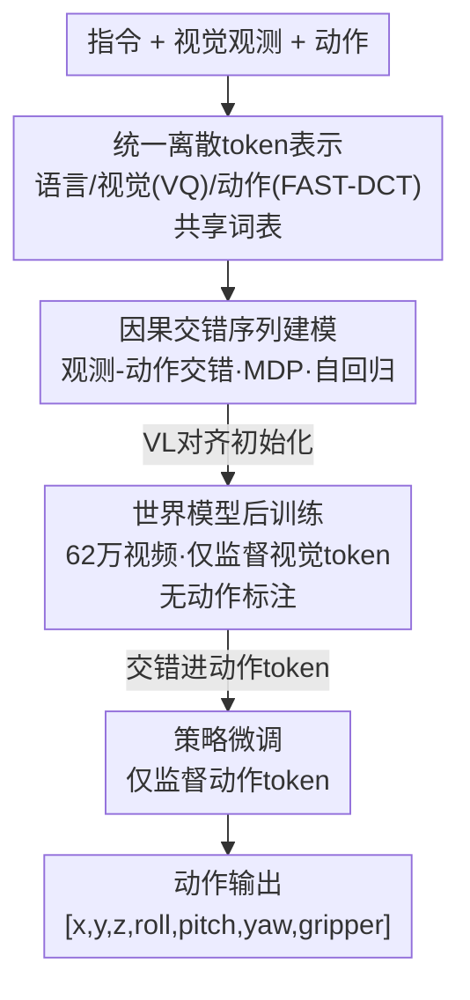

# UniVLA: Unified Vision-Language-Action Model

**会议**: ICLR 2026  
**OpenReview**: [https://openreview.net/forum?id=PklMD8PwUy](https://openreview.net/forum?id=PklMD8PwUy)  
**项目页**: [https://robertwyq.github.io/univla.github.io](https://robertwyq.github.io/univla.github.io)  
**领域**: 机器人 / 具身智能 / 视觉-语言-动作（VLA）  
**关键词**: VLA、统一离散token、世界模型、自回归、机器人操作

## 一句话总结
UniVLA 把视觉、语言、动作全部离散化成共享词表里的 token，用单个自回归 Transformer 交错建模观测-动作序列，并在微调前先用"世界模型"目标在 62 万条机器人视频上做无动作标注的后训练，从而在 CALVIN、LIBERO、SimplerEnv-Bridge 上全面刷新 SOTA（LIBERO 平均 95.5%，超过 π0-FAST 的 85.5%）。

## 研究背景与动机
**领域现状**：当前主流 VLA 模型（OpenVLA、π0 等）几乎都建立在预训练 VLM 之上，沿用一条"语言中心"的流水线——先用一个独立的视觉编码器（ViT）把图像投影到语义空间，再基于这些语义表示解码出动作。视觉只是被当成"理解输入"，最终模型只输出动作。

**现有痛点**：这种 late-fusion（晚融合）范式有两个硬伤。其一，视觉特征和动作之间是松耦合的，模型学不到深度交织的跨模态表示，也学不到感知-动作回路里的时序与因果依赖。其二，它把任务建模成"静态图像 → 动作"的映射，忽略了真实交互本质上是动态、因果的过程，因而无法利用海量视频里蕴含的时序信息来训练。

**核心矛盾**：视觉、语言、动作三种模态天然异构——视觉是高维连续的空间信号、语言是抽象离散的语义、动作是带因果依赖的时序序列。要把它们塞进一个统一表示空间本就困难；而感知到动作的链条又是动态因果的，现有静态范式根本表达不出来。

**本文目标**：能不能把视觉、语言、动作放进**同一个表示空间**联合建模，让跨模态融合更紧密、让模型能从大规模视频里学到环境动态，进而提升策略学习？

**切入角度**：作者放弃独立视觉编码器，走 encoder-free 路线——既然语言已经是 token，那就把视觉用 VQ 离散成 token、把动作用频域 DCT 离散成 token，三者共用一套词表。这样所有模态都退化成"下一个 token 预测"问题，天然支持多模态多任务，也能像语言模型那样吃下大规模视频。

**核心 idea**：用统一离散 token + 自回归交错序列替代"VLM 编码 + 动作头"，并在微调前插入一个**世界模型后训练**阶段，从无动作标注的视频中学环境动态，再迁移到下游策略学习。

## 方法详解

### 整体框架
UniVLA 的核心是一个 8.5B 参数的纯自回归 Transformer（架构与 Emu3 一致），它不区分模态地把一切都当 token 序列处理。输入端，语言、视觉、动作各自被对应的 tokenizer 离散化：语言/视觉沿用 Emu3 的设计、视觉用 VQ 编码器（8× 空间压缩）、动作用 FAST 把连续动作经 DCT 变换到频域再离散。这些 token 按时间步**交错**拼成一条因果多模态序列，用特殊标记（boi/eoi 包视觉、boa/eoa 包动作）划清模态边界，然后统一做 next-token 预测。

训练分两阶段：模型先以 VL 对齐的 Emu3 权重初始化（具备基本视觉-语言能力）；**后训练阶段**用"世界模型"目标在 62.2 万条机器人视频上学习，只监督视觉 token、不需要任何动作标注；**微调阶段**再把动作 token 交错进序列、只监督动作 token，完成下游策略学习。推理时模型只生成动作 token、不预测未来帧，遇到 eoa 即停。

### 关键设计

**1. 统一离散 token 表示：抛弃独立视觉编码器，三模态共用一套词表**

针对"独立 ViT 编码器导致视觉-动作松耦合"的痛点，UniVLA 走 encoder-free 路线，把三种异构模态全部映射成离散 token。视觉观测用 VQ tokenizer 离散化（8× 空间压缩），动作沿用 FAST：先把一个时间窗 $A_{1:H}=\{a_1,\dots,a_H\}$（每个 $a_t$ 是 $d$ 维向量）做离散余弦变换 DCT 到频域，再量化成变长的 token 序列 $[T_1,\dots,T_n]$，其 1024 个动作 token 直接替换语言词表最后 1024 个 ID。语言、视觉、动作 token 都来自同一个共享词表，于是整个模型只需一个标准的交叉熵 next-token loss，按任务需要选择性地把某些 token 纳入 loss 计算即可。这样视觉和动作不再是两套被强行对齐的表示，而是同一序列里彼此可见的 token，跨模态融合发生在每一层注意力中。

**2. 因果交错序列建模：把感知-动作回路写成可自回归的马尔可夫序列**

针对"静态图像→动作映射学不到时序因果"的痛点，UniVLA 把具身规划形式化为马尔可夫决策过程（MDP），并用模态交错来天然编码因果。以"捡胡萝卜"为例：指令和当前观测决定动作，动作改变环境产生新观测，新观测又引导下一个动作——这正是一条交错的马尔可夫链。策略学习的序列写成
$$S_a = \{L_t^1, L_v^1, L_a^1, L_v^2, L_a^2, \dots, L_v^t, L_a^t\}$$
其中 $L_t$、$L_v$、$L_a$ 分别是语言、视觉、动作 token，上标是时间步。由于是自回归建模，每个动作 token 在生成时都能"看到"之前所有观测和动作，因果依赖被结构本身保证，而不是靠外接的循环模块。这种交错格式同时让视频生成、视觉 grounding、动作学习等任务能无缝拼进同一框架。

**3. 世界模型后训练：用无动作标注的视频先学环境动态，再迁移到策略**

这是全文最关键的发现。针对"动作标注稀缺、跨机器人动作空间不统一难以迁移"的痛点，作者在微调前插入一个世界模型后训练阶段：在 MDP 框架下，世界模型要学的是转移函数 $P(s_{t+1}\mid s_t, a_t)$。具体做法是把语言指令当成一种"广义动作"，给定当前观测 $L_v^1$ 和指令 $L_t^1$，让模型预测未来视觉内容，loss **只来自视觉 token**：
$$S_v = \{L_t^1, L_v^1, L_v^2, \dots, L_v^t\}$$
这样模型无需任何动作标签就能从 62 万条机器人视频里学到环境动态，可规模化。消融表明（见下）：纯动作后训练因动作空间异构反而掉点，而世界模型后训练在 LIBERO-Long 上把成功率从 17.4 拉到 89.2、在 CALVIN 平均长度从 1.46 拉到 4.61，远超 text-to-image 和纯视频预测——前者说明时序动态重要、后者说明文本指令对状态转移的引导重要，世界模型恰好两者都占。

### 损失函数 / 训练策略
全程都是标准的 next-token 交叉熵，靠"对哪些 token 算 loss"来切换任务：世界模型后训练只在视觉 token 上算 loss（30K 步，batch 64，62.2 万视频）；策略微调只在动作 token 上算 loss，用两帧交错的视觉-动作序列、动作 chunk 大小 10、余弦退火学习率从 $8\times10^{-5}$ 起步。各 benchmark 微调配置不同：CALVIN 用第三人称（200×200）+腕部（80×80）双视角、A100 上 batch 192 训 8k 步；LIBERO 双视角均 200×200、batch 192 训 8k 步、单模型评四个 suite；SimplerEnv 单视角 256×256、batch 128 训 20k 步、chunk 5。

## 实验关键数据

### 主实验
UniVLA 在三大仿真 benchmark 上全面 SOTA。

| 数据集 | 指标 | UniVLA | 之前 SOTA | 提升 |
|--------|------|--------|-----------|------|
| CALVIN ABCD→D | Avg. Len | 4.63 | 4.49 (RoboVLMs) | +0.14 |
| CALVIN ABC→D | Avg. Len | 4.41 | 4.28 (Seer-Large) | +0.13 |
| LIBERO | 平均成功率 | 95.5% | 85.5% (π0-FAST) | +10.0 |
| LIBERO-Long | 成功率 | 94.0% | 69.0% (CoT-VLA) | +25.0 |
| SimplerEnv-Bridge | 平均成功率 | 69.8% | 42.7% (SpatialVLA) | +27.1 |

LIBERO-Long 这种长程组合任务上的 +25 个点提升尤其突出，验证了世界模型对长程规划的价值；SimplerEnv 上在 stack block、put carrot、put spoon 这些过去最难的任务上改善明显。

### 消融实验
后训练策略对比（微调时只用动作预测），数字为 LIBERO / SimplerEnv-WidowX / LIBERO-Long / CALVIN：

| 后训练策略 | 监督序列 | LIBERO | SimplerEnv | LIBERO-Long | CALVIN |
|------------|----------|--------|-----------|-------------|--------|
| 无后训练 | — | 48.5 | 0.0 | 17.4 | 1.46 |
| 纯动作预测 | T,I,A | 43.9 (-4.6) | 0.0 | 10.6 (-6.8) | 0.52 (-0.94) |
| text-to-image | T,I | 69.8 (+21.3) | 6.3 | 55.8 | 3.79 |
| 视频预测 | I₁..Iₜ | 78.9 (+30.4) | 17.7 | 80.8 | 3.59 |
| **世界模型** | T,I₁..Iₜ | **94.2 (+45.7)** | **64.6** | **89.2** | **4.61 (+3.15)** |

数据效率与历史上下文消融：

| 配置 | 关键指标 | 说明 |
|------|---------|------|
| 仅 10% 微调数据 + 后训练 | CALVIN 3.19 | 超过 RoboVLMs 全量级别（2.52），无后训练仅 0.15 |
| 训练 2k 步 w/ 后训练 | CALVIN 4.21 | 无后训练同步数仅 0.37，收敛极快 |
| 历史窗口 1+0 | CALVIN 4.26 | 无历史 |
| 历史窗口 1+1 | CALVIN 4.61 | 最佳 |
| 历史窗口 1+2 | CALVIN 4.43–4.47 | 再加长边际收益递减 |

### 关键发现
- **世界模型后训练是性能跃升的最大功臣**：纯动作后训练因跨机器人动作空间异构（具身、控制频率、归一化都不同）反而**掉点**，而所有基于视觉的后训练都涨；其中世界模型涨幅最大，LIBERO-Long 上比无后训练 +71.8。
- **文本指令 + 时序视频缺一不可**：text-to-image（有文本无时序）和纯视频预测（有时序无文本）都不如世界模型，说明两者结合才能完整建模"指令驱动的状态转移"。
- **即便不做后训练，微调时加视觉预测 loss 仍有效**：自回归结构让视觉损失天然把世界模型学习融进策略学习（CALVIN 4.42 vs 无视觉预测的某基线）。
- **历史窗口符合马尔可夫性**：加一帧历史显著涨点（4.26→4.61），再加则边际递减，说明近期观测信息量最大。

## 亮点与洞察
- **"动作也是 token"把 VLA 彻底统一进语言模型范式**：动作经 FAST/DCT 离散后占用语言词表末尾 1024 个 ID，整个模型回到纯 next-token 预测，工程上极简，且天然能吃视频、做多模态输出（空间推理、视频预测）。
- **世界模型后训练 = VLA 版的"自监督预训练"**：它不需要昂贵的动作标注，只用海量机器人视频就能学环境动态，把"数据效率"和"训练效率"同时拉满（10% 数据反超全量基线），这条思路可直接迁移到任何缺动作标注的具身场景。
- **把语言指令当"广义动作"**喂进世界模型，是个巧妙的形式化技巧——它让"指令条件下的未来预测"和 MDP 的转移函数自然对齐，避免了为世界模型单独设计接口。

## 局限与展望
- **动作离散化牺牲了低层控制精度**：作者承认相比连续动作头（如 π0.5），把动作 token 化会在精细操控上有边际损失；真实 ALOHA 倒水任务里精确倾倒对 UniVLA 和 π0 都仍是难点。文中提到框架可扩展，在微调阶段接入"动作专家"应对高精度场景，但本文未充分展开。
- **模型规模大（8.5B）**：纯自回归 + 视频 token 序列长，推理与训练成本不低，论文未报告推理延迟，实际部署到实时机器人控制的代价存疑。
- **后训练数据偏机器人视频**：62 万视频虽大但仍局限于机器人域，能否像 LLM 那样从更通用的互联网视频获益、以及跨域（如驾驶）后训练的统一性，仍需更多验证。

## 相关工作与启发
- **vs OpenVLA / π0（纯动作预测派）**: 它们用预训练 VLM 把视觉编码进语义空间再输出离散/流匹配动作，缺乏空间推理和视觉预测能力；UniVLA 去掉独立编码器、统一 token 化，既能输出动作也能做视觉预测与 grounding，且能吃视频做后训练。
- **vs SuSIE / UniPi / GR 系列（视觉引导派）**: 它们用 policy-as-video 思路——先预测未来帧再用逆动力学/解码出动作，但生成模型和动作预测模型是分离的，限制了统一多模态学习；UniVLA 在单一自回归框架内同时建视觉与动作，无需拆成两套模型。
- **vs LAPA / AdaWorld（latent-action 世界模型）**: 它们从无动作视频里学潜在动作再建世界模型；UniVLA 的世界模型不引入潜在动作、直接预测视觉 token，范式更简单却迁移性更好。

## 评分
- 新颖性: ⭐⭐⭐⭐⭐ 首个把视觉/语言/动作统一为共享词表离散 token 的原生多模态 VLA，encoder-free + 世界模型后训练的组合很干净。
- 实验充分度: ⭐⭐⭐⭐⭐ 三大仿真 benchmark 全 SOTA，后训练策略/数据效率/历史窗口消融完整，还扩展到真实 ALOHA 与自动驾驶。
- 写作质量: ⭐⭐⭐⭐ 动机与方法叙述清晰、图表到位，部分附录细节（动作专家、驾驶实验）未在正文展开。
- 价值: ⭐⭐⭐⭐⭐ 提供了一条可规模化、吃视频、无需动作标注后训练的开源 VLA 路线，对通用具身智能有明确借鉴意义。

<!-- RELATED:START -->

## 相关论文

- [\[ICLR 2026\] HybridVLA: Collaborative Diffusion and Autoregression in a Unified Vision-Language-Action Model](hybridvla_collaborative_diffusion_and_autoregression_in_a_unified_vision-languag.md)
- [\[ICLR 2026\] WMPO: World Model-based Policy Optimization for Vision-Language-Action Models](wmpo_world_model-based_policy_optimization_for_vision-language-action_models.md)
- [\[ICLR 2026\] Unified Diffusion VLA: Vision-Language-Action Model via Joint Discrete Denoising Diffusion Process](unified_diffusion_vla_vision-language-action_model_via_joint_discrete_denosing_d.md)
- [\[ICLR 2026\] AutoFly: Vision-Language-Action Model for UAV Autonomous Navigation in the Wild](autofly_vision-language-action_model_for_uav_autonomous_navigation_in_the_wild.md)
- [\[ICLR 2026\] On Robustness of Vision-Language-Action Model against Multi-Modal Perturbations](on_robustness_of_vision-language-action_model_against_multi-modal_perturbations.md)

<!-- RELATED:END -->
