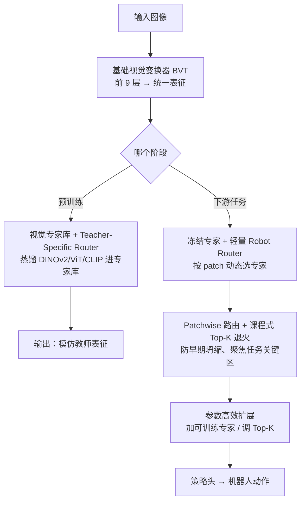

# VER: Vision Expert Transformer for Robot Learning via Foundation Distillation and Dynamic Routing

**会议**: ICLR 2026  
**OpenReview**: [https://openreview.net/forum?id=aoorNQFpM6](https://openreview.net/forum?id=aoorNQFpM6)  
**代码**: https://yixiaowang7.github.io/ver_page/  
**领域**: 机器人 / 具身智能  
**关键词**: 视觉基础模型蒸馏, 混合专家 (MoE), 动态路由, 视觉运动策略, 课程式 Top-K 退火

## 一句话总结
VER 把多个视觉基础模型（DINOv2 / ViT / CLIP）蒸馏进一个 MoE 式的"视觉专家库"，下游机器人任务只微调一个不到 0.4% 参数的轻量路由器来按 patch 动态挑选任务相关专家，配合课程式 Top-K 退火避免路由早期坍缩，在 17 个机器人任务、多种策略头上达到 SOTA。

## 研究背景与动机
**领域现状**：视觉运动机器人策略（visuomotor policy）学习直接把图像观测映射到控制动作，普遍依赖预训练视觉基础模型（VFM）如 DINOv2、CLIP、ViT 提供可迁移的视觉表征。但单个 VFM 往往只在特定领域强（DINOv2 强在几何/分割，CLIP 强在语义），单靠一个 VFM 无法覆盖机器人任务需要的多种隐式视觉能力。

**现有痛点**：直接堆叠多个 VFM 会让计算和工程复杂度爆炸；主流做法（RADIO、Theia）是把多个 VFM 蒸馏成**一个统一表征**，但留下三个问题——（1）异构 VFM 特征本身不对齐，硬融成统一表征会稀释甚至丢掉各模型的专长；（2）统一表征是固定权重，下游策略头要自己从里面"捞"任务相关信息，无法灵活地按任务挑最相关的 VFM，结果次优；（3）要把机器人领域知识灌进去得**全量重训**，且没法按任务难度伸缩算力（简单任务想省、复杂任务想加都做不到）。

**核心矛盾**：把多个 VFM 压成一个静态统一表征，本质上是用"早绑定 + 固定权重"去服务"任务多样、需求各异"的下游——表征压缩的那一刻就丢了灵活性，再想找回来只能靠下游策略头硬抠或全量重训。

**本文目标**：（1）蒸馏时保住各 VFM 的专长而不是混成一锅；（2）下游能按任务、甚至按图像局部内容动态挑选表征；（3）能低成本地加入机器人专属知识并按需伸缩算力。

**切入角度**：把蒸馏目标从"一个统一表征"换成"一个专家库"——借鉴混合专家（MoE）思想，让不同专家分别捕获不同 VFM 的视觉知识，下游再用一个可学习的路由器去稀疏激活最相关的专家。

**核心 idea**：用"蒸馏成 MoE 专家库 + 下游只训轻量路由器动态选专家"代替"蒸馏成固定统一表征"，把表征选择的灵活性从训练期延后到任务期。

## 方法详解

### 整体框架
VER 把一个标准 ViT 改造成两段：前 9 层保持普通 transformer，叫**基础视觉变换器（BVT）**，负责把图像编码成统一表征；后 3 层把前馈网络（FFN）换成 MoE 模块，构成**视觉专家库（VEL）**，每层放 $L=6$ 个 MLP 专家、激活 $K=2$ 个。整个系统分两个阶段跑：

- **预训练（蒸馏阶段）**：用大规模图像（ImageNet-1K）把 DINOv2、ViT、CLIP 三个教师 VFM 蒸馏进 VEL。关键是每个教师配一个**Teacher-Specific Router（TS Router）**，在 MoE 层里动态挑专家去模仿对应教师，并用互信息正则鼓励不同教师激活不相交的专家子集，避免梯度互相干扰、避免专家坍缩。
- **下游机器人策略（部署阶段）**：冻结整个 BVT + VEL，只新训一个**轻量 Robot Router（< 0.4% 参数）**，让它按任务动态选专家，专家输出送进策略头（diffusion / flow-matching / ViLT 等）产生动作。Robot Router 的最佳模式是**按 patch 选专家（PER）**，再叠加**课程式 Top-K 退火（CTA）**防止路由早期坍缩。最后还可通过参数高效微调（加可训练专家、调 Top-K）注入机器人领域知识、伸缩算力。

### 关键设计

**1. 视觉专家库 + Teacher-Specific Router：蒸馏时保住每个 VFM 的专长而不混成一锅**

针对"统一表征会稀释各 VFM 专长"的痛点，VER 不再把多个教师压成单一向量，而是把 ViT 最后 $N=3$ 层的 FFN 换成 MoE，每层放 $L$ 个 MLP 专家组成专家库。蒸馏时每个教师 $i$ 独享一个 TS Router $R^n_i$，它对输入特征打分、加噪后取 Top-K 激活：MoE 输出 $y = \sum_{l=1}^{L} R^n_i(x,l)\cdot E^n_l(x)$，其中 $R^n_i(x,l)=m_l\cdot p_l$，$p=\mathrm{Softmax}(z)$，$z=s_1+\epsilon$，噪声 $\epsilon\sim\mathcal{N}(0,\mathrm{SoftPlus}(s_2))$，$m_l\in\{0,1\}$ 是 Top-K 指示。蒸馏损失沿用 Theia 的 cosine + smooth-L1 加权组合 $L_{\text{distill}}$。这样每个教师由它自己的路由器去挑专家来模仿，不同 VFM 的知识被分散存到不同专家里、各自保真，而不是被平均掉。

**2. 教师级互信息正则：逼专家分工，避免坍缩到只用少数几个专家**

光有 TS Router 还不够——多教师同时蒸馏容易优化冲突、专家利用失衡。VER 引入**教师级互信息损失**，显式最大化教师变量 $I$ 和被路由专家 $E^n$ 之间的互信息：$L_{mi}=-\sum_n I(I,E^n)$。其妙处在熵分解 $I(I,E^n)=H(E^n)-H(E^n\mid I)$ 同时管两件事——最大化边缘熵 $H(E^n)$ 充当**全局负载均衡**，从信息论上防止路由坍缩到少数专家；最小化条件熵 $H(E^n\mid I)$ 则**逼出教师专属分工**，让给定某教师时专家分配确定、不同 VFM 激活不相交的专家子集，从而减少共享 MoE 池里的梯度干扰、保住各教师细粒度语义。预训练总目标 $L_{\text{pretrain}}=L_{\text{distill}}+\gamma L_{mi}$，$\gamma=0.0005$。实测里 ViT 易模仿（激活少量专家、cosine loss 低），DINOv2/CLIP 更难（自动分到更多专家），说明路由是自适应按教师难度分配容量，而非人工硬指派。

**3. Patchwise Expert Routing + 课程式 Top-K 退火：按局部内容选专家，并解决路由早期坍缩**

下游部署时专家全冻结，只训 Robot Router。作者比较了三类路由模式：选单个冻结 TS Router、按帧/按层选教师（FTR/LTR）、以及**按 patch token 选专家（PER）**。PER 适配性最强、额外参数 < 0.4%，但裸训会遇到一个理论问题——**早期坍缩**。命题 1 给出路由 logit 的梯度 $\frac{\partial L}{\partial z_l}=p_l(m_l q_l-q)$，其中对任何**未激活专家**（$m_l=0$）梯度退化为 $-p_l q$，与该专家自身的输出或潜在贡献 $q_l$ **完全无关**；由于浅层路由器收敛快于下游策略，初始随机扰动会把某些专家永久锁死在未激活态、再也拿不到有效梯度，路由分布过早坍缩到次优、且依赖随机种子。为此 VER 提出**课程式 Top-K 退火（CTA）**：训练初期激活全部专家（$K_0=L$），再用 $K(s)=\max(K_{\min}, \lfloor L+1-(L+1-K_{\min})\,s/S\rfloor)$ 在 $S$ 步内线性退火到目标 $K_{\min}$。早期全开保证充分探索、每个专家都拿到梯度，后期收紧到稀疏路由、保住推理效率。注意 PER 阶段去掉了互信息正则——这里路由器是"任务相关专家的规划选择器"，不需要再强求均衡利用。

**4. 参数高效扩展：低成本注入机器人领域知识、按需伸缩算力**

蒸馏来的专家编码的是通用视觉知识，可能缺机器人任务的关键信息。VER 允许在冻结的专家库旁**加入可训练专家（Train-from-Scratch, TFS）**与蒸馏专家（Distilled-Foundation-Model, DFM）混用，只训这部分就能把机器人领域知识灌进去，无需全量重训。同时通过只微调轻量 Robot Router 调节每个 patch 选几个专家（Top-K），就能在精度和算力间做可控权衡——简单任务调小省算力、复杂任务调大提精度。这正面回应了开头第三个痛点：领域知识整合与算力伸缩都变成轻量操作。

### 损失函数 / 训练策略
预训练目标为 $L_{\text{pretrain}}=L_{\text{distill}}+\gamma L_{mi}$（$\gamma=0.0005$，$\beta=0.9$，$\alpha_i=1/I$）。下游策略训练冻结 BVT+VEL，只优化 Robot Router 与策略头；Teacher Routing 用 Gumbel-Softmax + 直通估计器优化离散教师选择，推理时取 $\arg\max$。网络上 VER-T/S/B 分别基于 DeiT-Tiny / DeiT-Small / ViT-Base，12 层里只把最后 3 层换成 VEL，$L=6$、$K=2$。

## 实验关键数据

### 主实验
17 个机器人任务、多种策略头。Table 1 在 Franka Kitchen + Meta-World + Adroit 共 11 个任务上、用与 Theia 相同策略头公平比较视觉编码器：

| 模型 | 平均成功率(%) |
|------|------|
| VC-1 | 42.6 |
| MVP | 48.7 |
| RADIO | 61.3 |
| VIP | 62.8 |
| R3M | 67.6 |
| Theia-B | 67.1 |
| **VER-B (本文)** | **74.7** |

Table 2 显示 VER 在 ViLT / Flow-Matching / Diffusion 三种策略头、仿真与真实世界都超过 Theia（如 Robomimic cross→bin 0.65→0.95、真实世界倒水 0.45→0.90、LIBERO-OOD 0.58→0.71）。VER 还超过了微调后的 VLA 模型 GR00T N1.5。

### 消融实验
Table 3 路由策略消融（10 seeds，pen / relocate 任务）：

| 配置 | relocate | pen | 说明 |
|------|---------|-----|------|
| 单一 DINOv2 Router | 38.4 | 78.0 | 靠单个 VFM，relocate 差 |
| FTR (按帧选教师) | 41.2 | 81.2 | 帧级教师路由 |
| LTR (按层选教师) | 36.4 | 79.2 | 层级教师路由 |
| PER (按 patch 选专家) | 47.6 | 78.0 | patch 级，已优于单一 VFM |
| **PER + CTA** | **56.4** | **80.8** | 加退火，relocate 大涨 |

| 配置 | relocate | pen | avg |
|------|---------|-----|-----|
| 6 DFM + 0 TFS, K=2 | 64.0 | 80.0 | 72.0 |
| 0 DFM + 2 TFS, K=2 | 69.3 | 74.7 | 72.0 |
| **6 DFM + 1 TFS, K=2** | **74.7** | **82.7** | **78.7** |

### 关键发现
- **CTA 贡献最大、且专挑难任务救场**：relocate 从 PER 的 47.6 提到 PER+CTA 的 56.4，pen 这种本就不难的任务提升有限——印证早期坍缩主要伤害需要精细局部选择的复杂任务。
- **不同 VFM 适配不同任务**：单用 DINOv2/ViT/CLIP 各有长短，PER 动态路由才能跨任务都好，证明"统一表征"确实丢了灵活性。
- **特征分析揭示机制**：CTA 减少了背景区域的大范数离群点（high-norm outliers），把注意力集中到任务关键区；专家选择后互信息分析显示背景 patch 信息被抑制、任务相关区（如 pen 的目标位姿）信息被保留，特征更紧凑判别。
- **DFM+TFS 互补**：通用蒸馏专家 + 任务专属可训练专家混用（6+1）比纯蒸馏或纯从头训都好（78.7 vs 72.0），且 Top-K 越大成功率越高但算力越高，可控权衡。
- **几乎零开销**：diffusion 策略推理时间 VER 与 Theia 都是 0.105s（RTX 4090），VER 用更少的激活/总参数拿到更好性能。

## 亮点与洞察
- **把"蒸馏成什么"重新定义**：从"蒸馏成一个统一表征"改成"蒸馏成一个专家库"，等于把表征选择的自由度从训练期延后到任务期——这个视角转换可迁移到任何多教师蒸馏场景。
- **early collapse 的梯度级诊断很漂亮**：命题 1 直接点明未激活专家的梯度与自身贡献无关，从数学上解释了为什么裸训 MoE 路由会种子依赖地坍缩，CTA 的"先全开后退火"正是对症下药，比凭经验加正则更有说服力。
- **互信息正则的熵分解一举两得**：$H(E)$ 当负载均衡、$H(E\mid I)$ 当专家分工，一个目标同时管"别坍缩"和"别混淆"，思路干净。
- **路由器即隐式规划器**：作者把 Robot Router 解读为"任务相关专家的规划选择器"而非负载均衡器，所以下游故意去掉互信息正则——这个对路由器角色的重新理解值得借鉴。

## 局限与展望
- 蒸馏只在 ImageNet-1K 上、固定 DINOv2/ViT/CLIP 三个教师，换更多/更异构的 VFM（如 SAM、深度估计模型）能否同样保持分工没有充分验证。
- 真实世界实验规模有限（单个倒水任务），大规模真机泛化、长程任务上的表现仍待考察。
- CTA 的退火步数 $S$、目标 $K_{\min}$ 等课程超参对结果有影响，论文给了 $(K,L)=(2,6)$ 的最优配置，但跨任务自适应选这些超参仍是开放问题。
- 专家库放在最后 3 层是经验权衡（更深 MoE 蒸馏 loss 更低但下游策略反而更难导航），这个"深度—可用性"trade-off 的机理还可进一步挖。

## 相关工作与启发
- **vs Theia / RADIO（统一表征蒸馏）**：他们把多 VFM 融成一个固定权重的统一表征，下游策略头自己抠信息；VER 蒸馏成专家库 + 下游训轻量路由器动态选，保住各 VFM 专长且能按任务/按 patch 灵活选择，同等甚至更低算力下显著更强。
- **vs 传统 MoE（Switch Transformer / Sparse MoE Router）**：传统 MoE 路由追求负载均衡、多用于 NLP 与通用视觉；VER 把 MoE 引入机器人视觉策略，路由器被当作"任务相关专家的规划选择器"，下游刻意不做均衡，还专门处理了机器人小数据下的早期坍缩问题。
- **vs 固定视觉编码器的 VLA / 策略学习**：多数方法用固定视觉编码器，无法按任务挑最优表征；VER 提供动态视觉表征选择，并能低成本注入机器人领域知识、伸缩算力，甚至超过微调后的 GR00T N1.5。

## 评分
- 新颖性: ⭐⭐⭐⭐⭐ 把多教师蒸馏从"统一表征"重构成"专家库 + 动态路由"，并给出 early collapse 的梯度级诊断与 CTA 解法，视角新且自洽
- 实验充分度: ⭐⭐⭐⭐ 17 任务 × 多策略头 + 仿真/真机 + 丰富消融与特征分析，唯真机规模偏小
- 写作质量: ⭐⭐⭐⭐⭐ 动机三痛点清晰、方法与命题/熵分解推导严谨、可视化分析到位
- 价值: ⭐⭐⭐⭐⭐ 给机器人视觉表征"通用 + 可扩展 + 可伸缩"提供了一条工程友好且 SOTA 的路线

<!-- RELATED:START -->

## 相关论文

- [\[ICLR 2026\] ExoPredicator: Learning Abstract Models of Dynamic Worlds for Robot Planning](exopredicator_learning_abstract_models_of_dynamic_worlds_for_robot_planning.md)
- [\[ICLR 2026\] BOLT: Decision‑Aligned Distillation and Budget-Aware Routing for Constrained Multimodal QA on Robots](bolt_decisionaligned_distillation_and_budget-aware_routing_for_constrained_multi.md)
- [\[ACL 2025\] DRAE: Dynamic Retrieval-Augmented Expert Networks for Lifelong Learning and Task Adaptation in Robotics](../../ACL2025/robotics/drae_dynamic_retrieval-augmented_expert_networks_for_lifelong_learning_and_task_.md)
- [\[ICLR 2026\] RRNCO: Towards Real-World Routing with Neural Combinatorial Optimization](rrnco_towards_real-world_routing_with_neural_combinatorial_optimization.md)
- [\[ICLR 2026\] Action-aware Dynamic Pruning for Efficient Vision-Language-Action Manipulation](action-aware_dynamic_pruning_for_efficient_vision-language-action_manipulation.md)

<!-- RELATED:END -->
