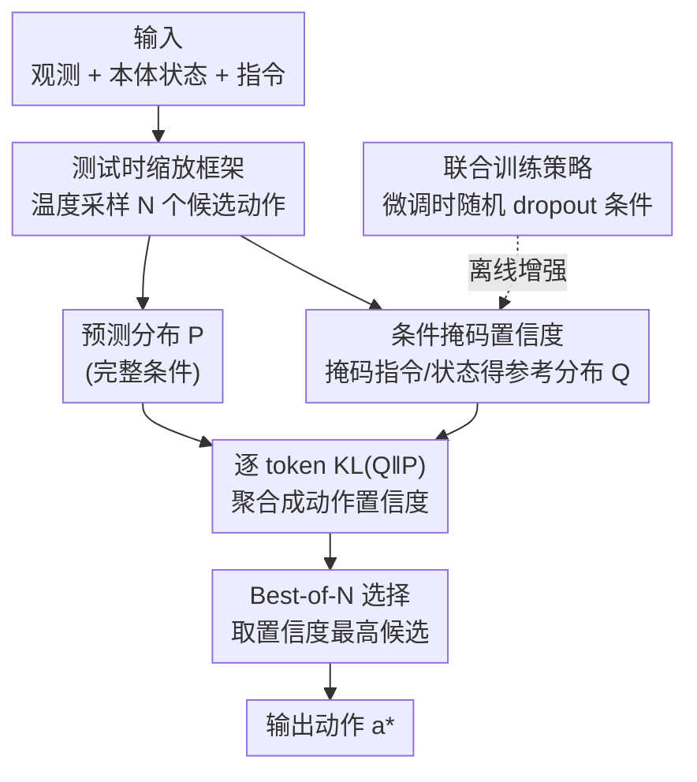

# Verifier-Free Test-Time Sampling for Vision-Language-Action Models

**会议**: ICLR 2026  
**OpenReview**: [https://openreview.net/forum?id=UD4Rw8MOEK](https://openreview.net/forum?id=UD4Rw8MOEK)  
**领域**: 机器人 / 具身智能  
**关键词**: VLA、测试时缩放、Best-of-N、KL散度置信度、条件掩码

## 一句话总结
本文提出 MG-Select：一个**无需外部验证器、无需额外训练模块**的 VLA 测试时缩放框架——并行采样 $N$ 个候选动作，用「模型自己在掩码掉部分输入条件后产生的参考分布」与正常预测分布之间的 KL 散度作为置信度来做 Best-of-N 选择，在仿真与真机抓取放置任务上把基座 VLA 的成功率显著拉高（RoboCasa 30 演示样本下相对提升 168%）。

## 研究背景与动机

**领域现状**：视觉-语言-动作模型（VLA）已经在机器人控制上表现亮眼，其中自回归 VLA（如 OpenVLA、$\pi_0$-FAST）直接复用语言模型的 next-token 预测目标把连续动作 token 化后逐 token 生成，不改架构就能达到与复杂架构相当的性能，是当前主流路线之一。

**现有痛点**：VLA 在**高精度任务**上仍然吃力——抓取、放置这类毫米级操作经常失败，而这种精度恰恰决定真实机器人任务的成败。根因之一是单次推理范式：模型每步都贪心解码（永远取概率最高的动作 token），即使这个动作并非最优。

**核心矛盾**：受 LLM 推理里 Test-Time Scaling（重复采样 + 验证器）成功的启发，已有工作给 VLA 配了一个**外部验证器**（用强化学习训练的价值函数）来做 Best-of-N。但这条路有两个硬伤：① 验证器需要在推理前额外训练，部署管线变复杂、算力开销大；② 这些验证器的奖励建模绑死在特定数据集上，对没见过的任务提示词/物体**泛化不了**。于是问题变成：能不能不训练任何外部模块，只靠 VLA 自身的内部信号来挑出更精确的动作？

**切入角度**：作者先试了最朴素的「按 likelihood 选最高概率的候选」——确实在某些情况下有效，但通常不管用，因为 VLA 在目标任务上微调后会**记住专家轨迹**，动作 token 分布过度集中，多次采样几乎收敛到同一个结果，likelihood 区分不出好坏。这提示：与其看「绝对概率」，不如看「相对于一个不确定参考分布的偏离程度」——偏离不确定参考最远的动作，往往才是模型最有把握、最精确的那个。

**核心 idea**：用「同一个 VLA 在**随机掩码掉部分输入条件**（指令文本 / 本体状态）后产生的分布」当参考分布 $Q$，用预测分布 $P$ 相对 $Q$ 的 KL 散度当置信度，KL 最大的候选即最自信的动作——验证器免训练、模块免新增。

## 方法详解

### 整体框架
MG-Select 把「单次贪心」换成「采样—打分—选择」三步循环，全程只用 VLA 自身的内部信号。给定当前观测 $o_t$、本体状态 $q_t$、指令 $I$：**(1)** 自回归 VLA $\pi_\theta$ 以温度 $\tau>0$ **并行采样** $N$ 个候选动作序列；**(2)** 对每个候选，一边算正常条件下的预测分布 $P_i=\pi_\theta(\cdot\mid o_t,q_t,I,a_{<i})$，一边算「掩码掉某些条件」后的**参考分布** $Q_i$，逐 token 求 $\mathrm{KL}(Q_i\|P_i)$ 并聚合成动作级置信度 $C_{\tilde a}$；**(3)** 取置信度最高的候选作为最终动作 $a^*=\arg\max_{\tilde a^{(n)}} C_{\tilde a^{(n)}}$（Best-of-N）。此外，为了让 VLA 在被掩码输入时仍产生有意义的分布，作者用一个**联合训练策略**在微调阶段顺带学会条件掩码分布（得到增强版 MG-Select\*）。

### 关键设计

**1. 测试时缩放框架：把单次贪心换成并行采样 + Best-of-N**

针对「每步贪心解码会在高精度任务上卡壳」的痛点，框架把推理拆成两段：先**并行随机采样**得到 $N$ 个候选，再用一个准则 $M$ 选最优。采样时用温度 $\tau$ 控制分布锐度与多样性，$\tilde a^{(n)}_j \sim \pi_\theta(\cdot\mid o_t,q_t,I,\tilde a^{(n)}_{<j};\tau)$，其中 $\pi_\theta(\cdot;\tau)=\mathrm{softmax}(\ell/\tau)$，$\tau\to 0$ 时退化为贪心。最终动作按 $a^*=\arg\max_{\tilde a^{(n)}\in\tilde A} M_{\tilde a^{(n)}}$ 选出。这个框架本身是通用骨架，关键在于准则 $M$ 怎么定——直接用 likelihood 不行（分布过度集中，候选都一样），于是引出下面的条件掩码置信度。实验上 $N=4$ 就能拿到大部分收益，再往上提升边际很小，故作为实用默认值。

**2. 条件掩码置信度：用 KL 偏离一个"半失明"参考分布来衡量自信度**

这是全文核心。作者的假设是：一个**既不确定、又不偏离目标动作分布太远**的参考分布，才能给出有意义的置信信号。怎么造这样的参考？让**同一个 VLA 掩码掉部分输入条件**——把指令文本、本体状态、或两者一起置空（$\varnothing$），相当于人为制造「忽略了任务关键信息」的失败模式。具体三种变体：

$$\text{KL}_{\text{text}}=\mathrm{KL}\big(\pi_\theta(\cdot\mid o_t,q_t,\varnothing,a_{<i})\,\big\|\,\pi_\theta(\cdot\mid o_t,q_t,I,a_{<i})\big)$$

State-masking 把 $q_t$ 置空、Text&State-masking 把两者都置空，形式同理。token 级置信度 $C_i=\mathrm{KL}(Q_i\|P_i)$，再在序列上聚合 $C_a=\sum_{i\in\mathcal I}\mathrm{KL}(Q_i\|P_i)$ 得到动作级分数用于排名。直觉是：如果某个候选动作即使在「半失明」参考下也能被正常条件分布显著拉开（KL 大），说明完整条件提供的信息对它真的起了作用、模型对它最有把握。哪种掩码最好取决于任务——SIMPLER-WidowX 全是抓取放置、模型不靠指令也会做，故 state-masking 最好；RoboCasa 任务类型多、没指令做不对，故 text-masking / text&state-masking 更有效。注意聚合集合 $\mathcal I$ 不是全序列：实验发现只取 **FAST tokenizer 的前 5 个 token**（从低频到高频对齐）效果最好，朴素求和反而最差。

**3. 联合训练策略：让 VLA 在微调时顺便学会"被掩码"的分布**

痛点是现成 VLA 从没在条件掩码设定下训练过，直接掩码输入往往产生**乱来的动作**，参考分布质量差。作者的解法是在微调目标数据集时**随机 dropout 条件**：对本体状态 $q_t$ 和指令 $I$ 构造四种掩码变体 $\mathcal M=\{(q_t,I),(q_t,\varnothing),(\varnothing,I),(\varnothing,\varnothing)\}$（全条件 / 文本掩码 / 状态掩码 / 双掩码），用增广数据集训练：

$$\mathcal L_{\text{Joint-IL}}(\theta;D)=-\mathbb E_{((o_t,q_t),a_{t:t+H},I)\sim D}\Big[\mathbb E_{(q^{(m)}_t,I^{(m)})\in\mathcal M}\big[\log\pi_\theta(a_t\mid o_t,q^{(m)}_t,I^{(m)})\big]\Big]$$

这样模型既保住标准微调的性能，又**意识到**条件掩码分布的存在，让参考分布更可靠。有意思的是，联合训练单独使用就已经超过 vanilla 模仿学习（消融里 PnP 从 17.0 升到 28.5），作者推测是条件掩码起到了防过拟合的正则作用；再叠加 MG-Select 选择则进一步涨点（得到 MG-Select\*）。另外参考分布不能直接用 $\tau=1.0$，因为掩码分布可能在某些 token 上「过于尖锐」，破坏分布式置信度的本意，需要给参考分布加一个偏高的正则温度（如 $\tau=4.0$）来平滑。

### 损失函数 / 训练策略
训练目标即上面的 $\mathcal L_{\text{Joint-IL}}$——在标准模仿学习（imitation learning，最大化专家动作对数似然）基础上，对每个样本在四种条件掩码变体上取期望。推理侧无需任何训练：候选数 $N=4$、采样温度 $\tau=0.5$、参考分布正则温度 $\tau=4.0$、聚合取前 5 个 token。为缓解「重复 $N$ 次 prefill」的延迟，作者还设计了**单次 prefill 部署**：$N$ 个候选共享一次 prefill 再各自解码，$N=4$ 时相比朴素实现降低 45% 延迟，使总推理时间与单动作推理相当。

## 实验关键数据

### 主实验

| 数据集 | 设置 / 指标 | 基座 $\pi_0$-FAST | + MG-Select\* | 相对提升 |
|--------|------|------|----------|------|
| RoboCasa | 30 演示，Pick&Place 成功率% | 5.3 | 14.2 | +168% |
| RoboCasa | 100 演示，Pick&Place% | 17.0 | 31.0 | +82% |
| SIMPLER-WidowX | 4 任务平均% | 46.9 | 50.3 | +7% |
| LIBERO | 4 套件平均% | 92.0 | 93.1 | +1.2% |
| 真机 ID（Franka）| 60 演示，平均成功率% | 37.5 | 47.9 | +28% |
| 真机 OOD（Franka）| 未见物体，平均% | 53.1 | 71.9 | +35% |

> 注：RoboCasa 低数据区（30 演示）增益最大，说明 MG-Select 能有效补偿数据稀缺下的性能；LIBERO 基座已接近饱和（92%）故提升空间小，但在最难的 LIBERO-Object（95.4→98.0）、LIBERO-Long（79.6→82.7）上仍稳定涨点。换到 OpenVLA 基座（LIBERO 平均 69.1→71.7）也有效，验证与架构无关。

### 消融实验（RoboCasa，100 演示，PnP / All 成功率%）

| 配置 | PnP | All | 说明 |
|------|-----|-----|------|
| Greedy | 28.5 | 42.7 | 贪心解码基线 |
| Likelihood（$N{=}4$）| 30.5 | 46.8 | 按似然选，已优于贪心 |
| Uniform KL（$N{=}4$）| 30.0 | 46.5 | 对均匀参考的 KL |
| **MG-Select**（$N{=}4$）| **31.0** | **48.1** | 条件掩码参考 KL，最优 |
| w/o Joint-IL（仅 MG-Select）| 22.6 | 43.7 | 不联合训练掉到 22.6 |
| w/o MG-Select（仅 Joint-IL）| 28.5 | 42.7 | 不做选择掉到 28.5 |

### 关键发现
- **联合训练 + MG-Select 缺一不可**：两者都用 PnP=31.0，只用其一分别掉到 28.5 / 22.6，二者协同效应明显（消融表 d）。
- **条件掩码参考优于均匀/似然参考**：MG-Select（31.0）> Likelihood（30.5）> Uniform KL（30.0），证明「半失明」参考比无信息的均匀分布提供更有效的不确定性信号。
- **聚合策略很关键且反直觉**：朴素求和最差（26.1），只取前 5 个 token 最好（31.0），作者推测与 FAST tokenizer 把动作按低频到高频对齐的结构有关。
- **参考分布要"调钝"**：直接用 $\tau{=}1.0$ 的掩码分布效果差，加高温 $\tau{=}4.0$ 平滑后才超过均匀基线（消融表 e）。
- **候选数 $N{=}4$ 够用**：$N$ 升到 64 才有进一步收益但边际很小，权衡算力取 4。

## 亮点与洞察
- **把"掩码输入"变成不确定性探针**：用同一个模型掩码掉部分条件来造参考分布，既零额外参数又自动对齐目标任务分布，比 LLM 里常用的均匀/自洽参考更贴合 VLA 场景——这是最"啊哈"的点。
- **诊断出 likelihood 失效的真因**：VLA 微调后分布过度集中导致多次采样收敛，因此绝对概率没区分度，必须看「相对偏离」。这个观察对任何在窄分布上做 Best-of-N 的任务都有借鉴意义。
- **单次 prefill 共享**：把 Best-of-N 的主要延迟来源（重复 prefill）摊成一次，让测试时缩放在实时机器人控制里真正可用，是很实在的工程 trick。
- **思路可迁移**：「用条件 dropout 自造参考分布 + KL 选择」可推广到其他自回归生成的择优场景（如条件文本生成、需要免验证器打分的任务）。

## 局限与展望
- **掩码变体需按任务挑选**：text / state / both 哪种最好依赖任务特性（单任务用 state、多任务用 text），缺乏自动选择机制，部署时仍需经验或调参。
- **聚合超参与 tokenizer 强耦合**：「取前 5 个 token」是针对 FAST tokenizer 的经验值，换 tokenizer 或动作表示可能需要重调，泛化性存疑。
- **收益受基座饱和度限制**：在 LIBERO 这类基座已接近天花板的 benchmark 上提升很小，方法主要在低数据 / 高难度精度任务上价值突出。
- **仅验证自回归 VLA**：方法依赖动作 token 分布与条件掩码，对扩散/流匹配类连续动作 VLA 是否适用未探讨，是自然的延伸方向。

## 相关工作与启发
- **vs 外部验证器 TTS（Nakamoto et al. / Kwok et al.）**：他们训练 RL 价值函数当验证器，需额外训练且对未见条件泛化差；本文用模型内部 KL 信号免训练、免新增模块，OOD 任务还能涨 35%。
- **vs Likelihood / Uniform-KL 自certainty（Kang et al.）**：LLM 里用均匀参考的自洽度量在 VLA 上因分布过度集中而效果有限；本文用条件掩码参考替代均匀参考，提供任务相关的不确定性，消融中稳定胜出。
- **vs 贪心解码基座 VLA**：本文不改架构、不改训练（或仅加轻量联合训练），即插即用地把成功率拉高，是对现有 VLA 的纯增益式增强。

## 评分
- 新颖性: ⭐⭐⭐⭐⭐ 「掩码输入自造参考分布 + KL 选择」的 verifier-free 思路在 VLA 测试时缩放里很新颖
- 实验充分度: ⭐⭐⭐⭐⭐ 覆盖 RoboCasa/SIMPLER/LIBERO 三仿真 + 真机 ID/OOD，含 6 组消融与延迟分析
- 写作质量: ⭐⭐⭐⭐ 动机推导清晰，但掩码变体选择与聚合超参的经验性较强
- 价值: ⭐⭐⭐⭐⭐ 免训练、免模块、与架构无关，对低数据高精度机器人任务实用价值高

<!-- RELATED:START -->

## 相关论文

- [\[ICLR 2026\] VITA: Zero-Shot Value Functions via Test-Time Adaptation of Vision–Language Models](vita_zero-shot_value_functions_via_test-time_adaptation_of_visionlanguage_models.md)
- [\[ICLR 2026\] VLM4VLA: Revisiting Vision-Language-Models in Vision-Language-Action Models](vlm4vla_revisiting_vision-language-models_in_vision-language-action_models.md)
- [\[ICML 2026\] Test-Time Training for Visual Foresight Vision-Language-Action Models](../../ICML2026/robotics/test-time_training_for_visual_foresight_vision-language-action_models.md)
- [\[CVPR 2026\] Test-Time Perturbation Tuning with Delayed Feedback for Vision-Language-Action Models](../../CVPR2026/robotics/test-time_perturbation_tuning_with_delayed_feedback_for_vision-language-action_m.md)
- [\[ICML 2026\] TapSampling: Inference-Time Sampling with a Task-Progress-Understanding Verifier for Robotic Manipulation](../../ICML2026/robotics/tapsampling_inference-time_sampling_with_a_task-progress-understanding_verifier_.md)

<!-- RELATED:END -->
