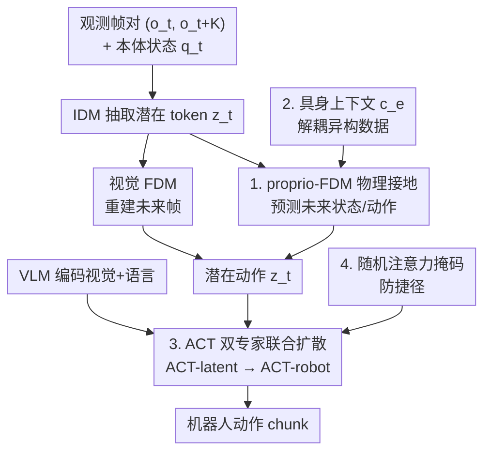

# villa-X: Enhancing Latent Action Modeling in Vision-Language-Action Models

**会议**: ICLR 2026  
**OpenReview**: [https://openreview.net/forum?id=y5CaJb17Fn](https://openreview.net/forum?id=y5CaJb17Fn)  
**代码**: 无（补充材料含源码）  
**领域**: 机器人 / 具身智能 / Vision-Language-Action  
**关键词**: 潜在动作, VLA 预训练, 本体接地, 联合扩散, 跨具身泛化

## 一句话总结
villa-X 给"潜在动作"建模做了两处升级——用一个本体前向动力学模型（proprio-FDM）把潜在动作接地到机器人物理状态，再用"潜在专家 + 机器人专家"的联合扩散把潜在动作真正喂给低层控制，让模型在 SIMPLER 仿真和两套真机（夹爪 + 灵巧手）上都拿到 SOTA，并能零样本迁移到没见过的具身与开放词汇符号。

## 研究背景与动机

**领域现状**：VLA（Vision-Language-Action）模型是当前机器人操作策略的主流范式，靠预训练 VLM 把视觉 + 语言映射成动作。一条重要的扩展路线是引入"潜在动作"（latent action）——把相邻两帧之间的运动语义压成紧凑的隐 token，当作伪动作标签，这样就能把海量无动作标注的人类视频也纳入模仿学习。核心组件是一个潜在动作模型（LAM）。

**现有痛点**：现有 LAM 几乎都只靠视觉信号来压潜在动作（IDM 抽 token、视觉 FDM 重建未来帧）。但视觉变化和机器人物理动力学并不总对齐：末端执行器的旋转、夹爪开合这类动作在像素上变化很微弱，却对控制至关重要。纯视觉模型容易忽略它们，学出来的潜在动作"物理上不接地"，迁移到真实控制时打折扣。另一方面，就算潜在动作质量够好，怎么把它有效地注入 VLA 预训练也没解决——像 LAPA 只是拿潜在动作预训练的权重做初始化，并没有在推理时真正条件化地用上它们。

**核心矛盾**：潜在动作要同时满足两个目标——既要捕捉视觉可见的运动，又要保留对控制有用的细微物理动态；而纯视觉重建目标只优化前者，丢了后者。整合层面则是"潜在动作 vs 机器人动作"如何耦合：耦合太松（只做初始化）信息传不下去，耦合太紧策略又会学到走捷径、过度依赖潜在动作。

**本文目标**：拆成两个子问题——(1) 怎么学到更接地的潜在动作；(2) 怎么把潜在动作更有效地整合进 VLA 预训练。

**切入角度**：作者的观察是"潜在动作应当是连接视觉与控制的桥梁"。要让桥梁稳，一端得锚到物理状态（本体感觉），另一端得用一个显式的层级策略把它结构化地传给低层动作，而不是隐式地揉在一起。

**核心 idea**：在 LAM 里加一个 proprio-FDM 用机器人本体状态/动作做辅助监督，把潜在动作"接地"；在策略侧用联合扩散同时建模潜在动作与机器人动作，让机器人动作的生成显式条件于潜在动作。

## 方法详解

### 整体框架

villa-X 是一个 Vision-Language-Latent-Action（ViLLA）框架，由两大组件串成，训练分三阶段（LAM 预训练 → ACT 预训练 → 具身专属微调）：

1. **LAM（潜在动作模型）**：输入一对观测帧 $(o_t, o_{t+K})$，IDM 先抽出离散潜在 token $z_t$；除了传统的视觉 FDM 重建未来帧，本文额外挂一个 proprio-FDM，根据当前本体状态 $q_t$、潜在 $z_t$ 和具身上下文 $c_e$ 去预测未来 $K$ 步的机器人状态与动作。视觉 + 本体两路前向预测共同优化，逼着潜在 token 既对齐画面又对齐物理动态。最终取 VQ codebook 中心的连续向量当潜在动作。

2. **ACT（ACTor 模块）**：在预训练 VLM 骨干上，用一个联合扩散过程同时建模潜在动作序列和机器人动作序列。VLM 编码视觉+语言后，ACT-latent 专家先生成中层的潜在动作计划，ACT-robot 专家再条件于这些潜在动作（外加本体状态、具身上下文、可选腕部相机）生成低层动作 chunk。三个专家共享一个分块因果注意力掩码，并用随机掩码防止机器人分支走捷径。

### 关键设计

**1. proprio-FDM 物理接地：给纯视觉的潜在动作补上一条物理监督**

传统 LAM 只有 $z_t = \text{IDM}(o_t, o_{t+K})$、$\hat o_{t+K} = \text{FDM}(o_t, z_t)$ 这一对视觉一致性约束，旋转、夹爪开合这类像素变化微弱但控制关键的动作就被忽略了。本文额外加一个本体前向动力学模型，给定当前状态 $q_t$、潜在 $z_t$ 与具身上下文 $c_e$，预测未来 $K$ 步的状态与动作：

$$(\hat q_{t+1}, \dots, \hat q_{t+K}, \hat a_{t+1}, \dots, \hat a_{t+K}) = \text{proprio-FDM}(q_t, z_t, c_e)$$

视觉重建损失、本体预测损失、VQ commitment 三者联合优化（人类视频缺本体标签时本体项省略）。这样潜在 token 被迫在"对齐画面"之外也"对齐物理动态"，成为视觉与控制之间更有效的桥梁。Probing 实验直接验证了这点：冻结 LAM、训一个 3 层 MLP 从潜在动作回归机器人动作，加了 proprio-FDM 的版本在低 L1 误差区间样本数明显更多。这个框架是通用的——本体状态原则上可以换成末端关键点、人手姿态等其他结构线索。

**2. 具身上下文 $c_e$：让一个 proprio-FDM 吃下异构具身而不串味**

大规模数据混着不同形态、不同控制频率的机器人，如果直接把 proprio-FDM 条件在 $(q_t, z_t)$ 上，模型会把"具身专属特征"也偷偷编进潜在动作里，污染潜在空间的通用性。本文引入一个上下文向量

$$c_e = f(\text{dataset ID}, \text{control frequency})$$

其中 dataset ID 映射到可学习 embedding，控制频率用正弦特征过 MLP，二者与 $q_t$ 拼接后送入 proprio-FDM。它的作用是把"具身相关的动力学差异"交给 $c_e$ 去解释，从而让潜在动作本身在不同数据集间保持一致——这正是跨具身泛化（包括后面零样本迁到 Realman 新机械臂）能成立的前提。

**3. ACT 双专家联合扩散：把潜在动作显式地、结构化地传给低层控制**

LAPA 之类方法只把潜在动作当成预训练初始化，推理时并不真正条件化使用。villa-X 把策略显式因子分解成两个条件分布：

$$\pi(a_{t:t+m-1}, z^K_{t:t+(n-1)K} \mid o_t, l, q_t, c_e) = \underbrace{\pi_{\text{robot}}}_{\text{ACT-robot}} \cdot \underbrace{\pi_{\text{latent}}}_{\text{ACT-latent}}$$

ACT-latent 先条件于 VLM 特征预测中层潜在动作计划，ACT-robot 再条件于"VLM 特征 + 预测出的潜在动作 + 本体/具身上下文"产出低层动作 chunk。整个联合分布用条件流匹配（flow matching）训练：把两类动作打包成 $x_t$、条件打包成 $O_t$，构造带噪目标 $x^\tau_t = \tau x_t + (1-\tau)\epsilon$，网络去拟合去噪向量场 $u(x^\tau_t \mid x_t) = \epsilon - x_t$，损失为

$$L_\tau(\theta) = \mathbb{E}\,\big\|v^\theta_\tau(x^\tau_t, O_t) - u(x^\tau_t \mid x_t)\big\|^2$$

式 (4) 的显式因子分解靠分块因果注意力实现，让信息从潜在动作"结构化地"流向机器人动作，比隐式耦合更可控。

**4. 随机注意力掩码：逼策略真用潜在动作，而不是学到捷径**

显式条件化有个副作用：机器人分支可能过度依赖潜在动作、学出平凡捷径，反而损失鲁棒性。借鉴 Moto 和 RDT，训练时对"机器人动作→潜在动作"的注意力做随机掩码——50% 情况下把全部 robot-to-latent 注意力 mask 掉，另外 50% 随机 mask 一半潜在 token。这样既保留了对潜在 token 的稳健依赖，又不让它变成唯一的捷径。作者强调这个设计"在实践中至关重要"。

### 损失函数 / 训练策略
- **LAM 预训练**：视觉重建损失 + 本体预测损失 + VQ commitment 联合优化；人类视频无本体标签时只留视觉项。
- **ACT 预训练**：潜在动作 + 机器人动作的联合条件流匹配损失（式 5），$\tau$ 从 beta 分布采样，因子分解靠分块因果注意力 + 随机掩码实现。
- **具身专属微调**：在目标机器人数据上微调，低层策略可选接入腕部相机。

## 实验关键数据

### 主实验（SIMPLER 仿真，平均成功率 %）

| 平台 | 指标 | villa-X | 最强基线 | 说明 |
|------|------|---------|----------|------|
| Google Robot | Avg. | **77.7** | OpenVLA-OFT 63.0 / Magma 62.3 | 全面领先 VLA / 视觉 trace / 潜在动作类方法 |
| WidowX Robot | Avg. | **62.5** | GR00T-N1.5 62.0 / LAPA 57.3 | 与最强 world-model 法持平略胜 |

带 ∗ 的方法为预训练后直接评测，其余为两阶段预训练+微调。Ours w/o latent 在 Google 仅 36.5、WidowX 49.0，证明潜在专家是涨点关键。

### 消融实验（LAM 与整合方式，SIMPLER 平均成功率）

| 配置 | Google Avg. | WidowX Avg. | 说明 |
|------|-------------|-------------|------|
| Ours (w/pp) | **58.5** | **40.8** | 完整 LAM（含 proprio-FDM） |
| wo/pp | 57.4 | 32.3 | 去掉 proprio-FDM，WidowX 掉 8.5 |
| wo/LAM | 35.0 | 33.1 | 不用潜在动作，Google 大幅崩塌 |
| LAPA-style | 43.8 | 1.0 | 仅靠权重初始化整合，WidowX 近乎失效 |
| Go-1-style | 43.9 | 36.5 | 自回归潜在 planner，整体弱于联合扩散 |

### 真机实验
- **Realman 夹爪臂**（5 任务，表 4）：在任务内与泛化（换积木/桌布颜色）两种设定下，villa-X 均超过 π0 / GR00T / OpenVLA-OFT，如 Pick-out 100、换桌布 60。
- **XArm + XHand 灵巧手**（12-DoF，预训练未用任何灵巧手数据，表 3）：seen/unseen 全面优于 GR-1、GR00T，Pick&Place 达 84/68，验证强具身迁移。
- **零样本计划可视化**：ACT-latent 在没见过的 Realman 臂和开放词汇符号卡上都能生成符合指令的潜在计划（再由独立 world model 渲染成视频验证）。

### 关键发现
- proprio-FDM 的增益在 WidowX 上尤为明显（消融掉 32.3 vs 40.8），说明本体接地对像素变化微弱的精细操作帮助最大。
- LAPA-style 在 WidowX 几乎归零（1.0），说明"只拿潜在动作做初始化"的松耦合整合方式在难平台上完全失效，联合扩散的紧耦合才是涨点来源。
- 潜在专家学到的知识是"具身无关"的——零样本迁到全新机械臂和灵巧手仍有效，印证了 $c_e$ 解耦设计的价值。

## 亮点与洞察
- **用本体感觉给潜在动作"补物理"**：把潜在动作的监督从"重建未来帧"扩到"预测未来状态/动作"，一个辅助解码器就解决了纯视觉潜在动作"物理不接地"的老问题，思路干净且可推广（可换末端关键点、人手姿态）。
- **具身上下文 $c_e$ 是跨具身泛化的隐形功臣**：把数据集 ID + 控制频率显式拎出来当条件，让潜在空间保持通用，这是零样本迁到新具身能成立的关键，值得迁移到任何混合多机器人数据的潜在表示学习。
- **联合扩散 + 随机掩码的组合拳**：显式条件化把信息真正传下去，随机掩码又防止策略偷懒，二者缺一不可——这是"既要紧耦合又要防捷径"这对张力的一个漂亮折中。

## 局限与展望
- 作者承认潜在专家虽能做视觉 + 本体的未来规划，但其规划能力"尚未被充分挖掘"；未来可学一个借助基础 VLM 先验的 critic，对潜在专家多次采样、拒绝不符合语言指令的轨迹。
- 本文的物理接地只用了机器人本体状态；更通用的结构线索（末端关键点、人手姿态）留作未来工作，目前未验证。
- 真机评测每任务试验次数有限（多为 10 次/任务），成功率方差可能较大；不同平台的绝对数值不宜直接横比。

## 相关工作与启发
- **vs LAPA**：LAPA 只用潜在动作做预训练权重初始化，推理时不显式条件化；villa-X 用联合扩散显式建模潜在+机器人动作，整合更紧——消融里 LAPA-style 在 WidowX 几乎失效正是证据。
- **vs GR00T**：GR00T 把潜在动作当成一种"独立具身"对齐未来 embedding；villa-X 则把潜在动作当作连接高层视觉语言与低层动作的中层桥梁，并补上本体物理接地。
- **vs Moto-GPT / Go-1**：Moto-GPT 缺即时视觉上下文、Go-1 有 teacher-forcing 不一致问题；villa-X 通过联合扩散 + 分块因果注意力同时规避这两点，测试时推理更稳健。

## 评分
- 新颖性: ⭐⭐⭐⭐ proprio-FDM 物理接地 + 联合扩散整合两处都对症下药，但单看各部件均有前作影子。
- 实验充分度: ⭐⭐⭐⭐⭐ 仿真 + 两套真机（夹爪/灵巧手）+ 零样本可视化 + probing/消融齐全。
- 写作质量: ⭐⭐⭐⭐ 动机—方法—验证逻辑清晰，公式与图配套。
- 价值: ⭐⭐⭐⭐⭐ 给潜在动作 VLA 提供了一个可扩展、能跨具身的范式，工程与研究价值都高。

<!-- RELATED:START -->

## 相关论文

- [\[ICLR 2026\] VLM4VLA: Revisiting Vision-Language-Models in Vision-Language-Action Models](vlm4vla_revisiting_vision-language-models_in_vision-language-action_models.md)
- [\[ICLR 2026\] Hybrid Training for Vision-Language-Action Models](hybrid_training_for_vision-language-action_models.md)
- [\[ICML 2026\] LangForce: Bayesian Decomposition of Vision-Language-Action Models via Latent Action Queries](../../ICML2026/robotics/langforce_bayesian_decomposition_of_vision_language_action_models_via_latent_act.md)
- [\[ICML 2026\] Latent Reasoning VLA: Latent Thinking and Prediction for Vision-Language-Action Models](../../ICML2026/robotics/latent_reasoning_vla_latent_thinking_and_prediction_for_vision-language-action_m.md)
- [\[CVPR 2026\] Cross-Hand Latent Representation for Vision-Language-Action Models](../../CVPR2026/robotics/cross-hand_latent_representation_for_vision-language-action_models.md)

<!-- RELATED:END -->
