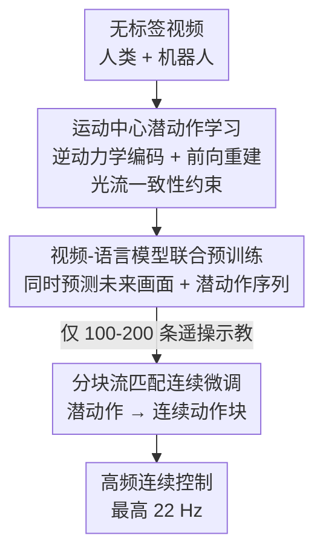

# ViPRA: Video Prediction for Robot Actions

**会议**: ICLR 2026  
**OpenReview**: [https://openreview.net/forum?id=w3Ik8HUyTT](https://openreview.net/forum?id=w3Ik8HUyTT)  
**论文**: [vipra-project.github.io](https://vipra-project.github.io)  
**代码**: https://vipra-project.github.io (有)  
**领域**: 机器人 / 具身智能 / 视频预测  
**关键词**: 潜动作, 视频预测, 流匹配, 跨本体, 机器人策略

## 一句话总结
ViPRA 把一个视频预测模型改造成机器人策略：先从大量"无动作标签"的人类/机器人视频里自监督学出运动中心的离散潜动作，再用视频-语言模型联合预测"未来画面 + 潜动作序列"做预训练，最后用一个分块流匹配解码器把潜动作映射成具体机器人的连续动作，仅靠 100–200 条遥操作示教就能实现最高 22 Hz 的平滑高频控制，SIMPLER 上比最强基线高 16%、真实任务高 13%。

## 研究背景与动机

**领域现状**：当下主流的机器人策略是 VLA（Vision-Language-Action）模型，做法是在带动作标签的机器人示教上做模仿学习——把视觉-语言模型接上一个动作头，端到端预测控制指令。

**现有痛点**：VLA 的命门是"动作标签"。带标签的机器人轨迹采集极其昂贵（OpenX 量级是上万小时的预训练 + 几十上百小时的微调），而且受限于本体形态，难以规模化。与此同时网络上有海量视频——人做任务的 YouTube 片段、遥操作机器人的日志——它们蕴含丰富的物理交互、物体动力学和长时序行为，但**绝大多数没有动作标签**，VLA 用不上。

**核心矛盾**：视频里"看得见运动"，却"读不出动作"。已有的潜动作方法（LAPA、UniVLA 等）虽然能从无标签视频里学潜动作，但它们把预训练单纯当成"在潜空间里做自回归策略学习"，既不预测未来画面、也不显式建模状态转移，而且学到的是时间上粗粒度、任务中心的潜动作（1 步、3–6 Hz 都不到），丢掉了对控制至关重要的高频动力学。

**本文目标**：把一个强大的视频预测模型转化为能在真实机器人上跑的控制策略，具体拆为三件事——(1) 从无标签视频里抽出细粒度、运动中心的潜动作；(2) 让视频-语言模型同时学"会发生什么（画面）"和"怎么变（潜动作）"；(3) 用极少示教把潜动作落地成平滑的高频连续控制。

**切入角度**：作者的观察是——视频生成模型天然擅长"预测未来状态"，这一能力既包含细粒度物理交互、又包含任务语义。所以与其像旧方法那样只在潜空间做策略学习，不如让模型**同时建模"变了什么"(what)和"怎么变"(how)**，把视频预测当作显式的状态转移监督。

**核心 idea**：用"视频预测 + 运动中心潜动作"联合预训练替代"纯潜空间策略学习"，再用分块流匹配把潜动作解码成连续动作——既保住视频模型的物理先验，又拿到真实控制需要的精度和频率。

## 方法详解

### 整体框架
ViPRA 是一个三阶段的"预训练-微调"流水线。输入是大规模无动作标签视频（人类 + 机器人）加少量带动作的遥操作示教，输出是一个能在真实机器人上跑、最高 22 Hz 的连续控制策略。三个阶段层层递进：先把视频压成"潜动作"这一中间表示，再让视频-语言模型在这个表示上做联合预测预训练，最后把潜动作落地成具体本体的连续动作。

### 关键设计

**1. 运动中心潜动作学习：把无标签视频压成"会动的"中间表示**

要从没有动作标签的视频里学控制，第一步得有个能代替"动作"的中间量。ViPRA 训练一个 VQ 量化瓶颈，给定长度 $L+1$ 的观测序列 $o_{t:t+L}$，抽出潜动作序列 $z_{t:t+L-1}$，每个时刻用 $N_{latent}$ 个离散 token 表示，token 取自一个**很小**的共享码本（$|C|=8$）——这个强信息瓶颈逼着潜动作只编码解释局部转移所需的"最小充分信息"。它由两部分对偶训练：逆动力学编码器 $I_\beta(z_{t:t+L-1}\mid o_{t:t+L})$ 是**非因果**的，看整段 clip（含过去和未来）来推每个 $z_k$，这样它能区分"拿起"和"放下"这种靠上下文才分得清的运动意图；前向解码器 $F_\alpha(\hat o_{t+k+1}\mid o_{t:t+k}, z_{t:t+k})$ 则用历史观测和潜动作重建下一帧，保证潜动作真的"含足够的动力学信息"。

光把帧重建好不等于运动学对——所以训练目标在像素级 $L_1$ 重建 $\mathcal{L}_{rec}$ 之外，额外加了感知损失 $\mathcal{L}_{LPIPS}$ 抓高层结构、以及**光流一致性损失** $\mathcal{L}_{flow}$ 强制预测帧的运动模式贴合真值：

$$\mathcal{L}_{flow} = \frac{1}{L}\sum_{k=t+1}^{t+L}\lVert OF(\hat o_k,\hat o_{k-1}) - OF(o_k,o_{k-1})\rVert_1 + \frac{1}{L}\sum_{k=t}^{t+L-1}\lVert OF(\hat o_k,\hat o_{k+1}) - OF(o_k,o_{k+1})\rVert_1$$

其中 $OF$ 用 RAFT 估计前向/后向光流。总损失 $\mathcal{L}_{latent}=\mathcal{L}_{rec}+\lambda_{LPIPS}\mathcal{L}_{LPIPS}+\mathbb{I}(\text{step}>\alpha_{flow})\lambda_{flow}\mathcal{L}_{flow}$，其中光流项要等 $\alpha_{flow}$ 步热身后才开启——早期重建太差时上光流约束会让训练不稳。正是光流一致性让潜动作"运动中心、物理可信"，区别于旧方法那种纯重建、运动语义模糊的潜表示。

**2. 视频-语言模型联合预测：同时学"会发生什么"和"怎么变"**

有了潜动作，第二阶段要把它和视频模型的语义先验对齐。ViPRA 以指令微调过的 LWM-Chat-1M 视频-语言模型 $G_\theta$ 为底座，用它自带的 VQ-VAE 把每帧编码成视觉 token，再扩两个模块来处理潜动作：潜动作嵌入头 $E_\phi$ 把离散潜 token 映到模型 token 空间，潜动作解码器 $H_\psi$（一个 MLP）以自回归方式逐个预测下一个潜 token。这样潜动作就和语言、视频 token 一样在同一个多模态自回归空间里被生成。

关键在于**联合目标**：给定最近两帧 $(o_{t-1}, o_t)$ 和任务描述 $c$，模型既要预测 $H$ 步之后的未来画面 $o_{t+H}$，又要预测中间这段潜动作序列 $z_{t:t+H-1}$。预训练损失就是两者交叉熵之和：

$$\mathcal{L}_{pretrain}=\underbrace{\sum_i CE(\hat x^i_{t+H}, x^i_{t+H})}_{\mathcal{L}_{img}}+\underbrace{\sum_{k=t}^{t+H-1}\sum_i CE(\hat z^i_k, z^i_k)}_{\mathcal{L}_{act}}$$

这正是 ViPRA 和旧潜动作方法（LAPA/UniVLA）最本质的分野：旧方法把预训练当纯策略学习，只预测潜动作、不管未来状态；ViPRA 显式地**同时建模 what changes（视频预测）和 how（潜动作）**，多步时序预测又逼模型产生有意义、有区分度的场景变化，给下游动作推断提供更稳的条件。

**3. 分块流匹配连续微调：把潜动作落地成平滑高频控制**

潜动作虽有丰富的物理/语义先验，却没有低级控制所需的精度。第三阶段在 $G_\theta$ 上再接两个动作专用模块：动作编码器 $E_\gamma$ 把带噪连续动作嵌入 token 空间，流解码器 $H_\eta$ 在整个动作块上预测流场。训练用流匹配：采样目标动作序列 $a_{t:t+H-1}$、噪声 $u_0\sim\mathcal{N}(0,I)$，按 $u_s=s\cdot u_0+(1-s)\cdot a_{t:t+H-1}$（$s\sim\text{Beta}(1.5,1)$）插值，模型预测流场 $\hat g=H_\eta(G_\theta(c,x_{t-1},x_t,f_s))$，损失为 $\mathcal{L}_{FM}=\lVert a_{t:t+H-1}-u_0-(1-s)\cdot\hat g\rVert_2^2$。推理时从 $s=0$ 到 $s=1$ 做 10 步前向欧拉积分，一次解出整块连续动作。

这里的两个要点是"流匹配"和"分块"。流匹配给离散潜 token 注入了平滑性和动力学一致性；而**动作分块**（一次前向产出多个低级动作，如长度 $H=14$、执行前 7 步后再重规划）把推理延迟摊薄，让策略能跑到最高 22 Hz——这是真实灵巧操作必须的高频。同时这一步天然支持跨本体：同一套潜动作通过为具体机器人训练的流解码器，对齐到该本体的电机行为，所以仅用一两百条示教就能适配新机器人，而不必像 VLA 那样攒上千小时标注。

### 损失函数 / 训练策略
- **潜动作学习**：$\mathcal{L}_{latent}=\mathcal{L}_{rec}+\lambda_{LPIPS}\mathcal{L}_{LPIPS}+\mathbb{I}(\text{step}>\alpha_{flow})\lambda_{flow}\mathcal{L}_{flow}$，光流项热身后再开。
- **预训练**：$\mathcal{L}_{pretrain}=\mathcal{L}_{img}+\mathcal{L}_{act}$（视觉 token 与潜动作 token 双交叉熵，teacher forcing）。
- **微调**：$\mathcal{L}_{finetune}=\mathcal{L}_{FM}$（流匹配回归）。
- **数据**：预训练用 198k 条 Something-Something v2 人类视频 + OpenX 机器人无标签视频（Fractal 87k、BridgeV2 25.4k、Kuka 85.6k）；微调每个真实任务约 180 条 GELLO 遥操示教，SIMPLER 上仅 100 条多任务轨迹。

## 实验关键数据

### 主实验（SIMPLER 四个 Bridge 任务，成功率 %）

| 设置 | 方法 | 平均成功率 | 说明 |
|------|------|-----------|------|
| 离散 | OpenVLA | 38.6 | 用 970k 带标签 OpenX 轨迹 |
| 离散 | LAPA | 53.1 | 1 步粗粒度潜动作 |
| 离散 | **ViPRA-AR** | **69.8** | 比 LAPA +16.7 |
| 连续 | π0 | 27.1 | 流匹配 VLA，含私有数据 |
| 连续 | UniVLA | 42.7 | 任务中心潜动作 |
| 连续 | Scratch-FM | 41.7 | 无预训练 |
| 连续 | **ViPRA-FM** | **62.5** | 比 UniVLA +19.8、比 π0 +35.4 |

真实世界三个操作任务：ViPRA-FM 平均成功率 54.1%，超过 π0（40.1%）和 Scratch-FM（23.8%），且用的标注示教远少于 VLA；失败抓取后还能重试，Cover-Obj 任务里布料能稳定抓住。

### 消融实验（SIMPLER 平均成功率）

| 配置 | 预训练 | 微调 | 成功率 | 说明 |
|------|--------|------|--------|------|
| LAPA | 1 步潜动作 | 1 步动作 | 53.1 | 基线 |
| ViPRA-AC | 未来状态 + 1 步潜 | 1 步动作 | 59.2 | 加未来状态预测就涨 |
| ViPRA-SP2 | 仅 H 步潜动作 | H 步动作 | 59.4 | 去掉未来状态，从 69.8 掉到 59.4 |
| ViPRA-LA | 仅未来状态 | H 步动作 | 60.7 | 只有状态预测也不够 |
| ViPRA+SP3 | H 步潜动作 | 微调期加状态 | 53.1 | 微调期再加状态反而掉点 |
| **ViPRA-AR** | 未来状态 + H 步潜 | H 步动作 | **69.8** | 完整模型 |

数据组成消融（LIBERO-10）：人机共训成功率 0.79 > 仅机器人 0.72 > 仅人类 0.69，说明人类视频与机器人视频互补。

### 关键发现
- **未来状态预测是主贡献**：去掉它（SP2）AR 从 69.8 掉到 59.4、FM 从 62.5 掉到 53.2；但"只有状态、没有 H 步潜动作"（LA，60.7）也不够——两者缺一不可。
- **未来状态预测要放在预训练、不能放微调**：SP3 在微调期补状态预测反而把 FM 砸到 31.3，说明这是"预训练阶段塑造先验"的活。
- **细粒度潜动作利于接触敏感任务**：ViPRA-AR 在 StackG2Y 这类精度要求高的任务上提升尤其明显。
- **离散动作不适合真机**：基于 bin 的离散动作在物理噪声下会出现不稳定尖刺、触发 Franka 安全停机，所以真实评测只跑连续策略。
- **跨本体迁移**：预训练语料只有单臂机器人 + 人类视频，但模型能迁到协同双臂任务，印证潜动作的"本体无关"先验。

## 亮点与洞察
- **"what + how"双目标是点睛之笔**：旧潜动作方法只学"怎么动"，ViPRA 坚持同时预测"未来画面"，消融证明这一项贡献最大——它把视频生成模型的物理先验真正接进了控制。
- **极小码本（$|C|=8$）当强瓶颈**：用一个非常小的离散码本逼潜动作只留"解释局部转移的最小充分信息"，是个可迁移的表示学习 trick。
- **非因果逆动力学编码**：让潜动作看整段 clip 来消歧"拿起 vs 放下"，比因果式编码更能抓住运动意图。
- **光流一致性把"会重建"变成"会运动"**：用 RAFT 光流当额外监督，并加热身门控避免早期不稳——可迁移到任何"想让生成帧运动学正确"的视频任务。
- **分块流匹配解锁高频**：动作分块摊薄延迟到 22 Hz，把"视频模型太慢做不了高频控制"这个老问题绕了过去。

## 局限与展望
- **依赖一个强视频-语言底座**（LWM-Chat-1M），方法的上限和成本都被底座绑定，换更小的模型能否保住高频控制未充分验证。
- 真实评测时为安全把闭环控制率压到 3.5 Hz，22 Hz 是能力上限而非实际部署常态，高频下的真机稳健性证据相对有限。
- 离散策略在真机上直接被排除（会触发安全停机），说明潜动作到连续控制这步是刚需而非可选，离散分支的实用性受限。
- 预训练语料仍偏操作类（人手 + 桌面机器人），对移动、长时序、强动态场景的泛化未展开。
- 潜动作码本极小（8），表达能力是否在更复杂多样的行为上成为瓶颈，值得进一步分析。

## 相关工作与启发
- **vs LAPA / UniVLA（潜动作派）**：它们把预训练当纯潜空间策略学习、用 1 步粗粒度任务中心潜动作；ViPRA 显式预测未来状态 + 多步细粒度运动中心潜动作，SIMPLER 上分别领先约 16.7 和 19.8 个点。
- **vs OpenVLA / π0（VLA 派）**：VLA 靠上万小时带标签轨迹做模仿学习；ViPRA 用无标签视频预训练 + 一两百条示教微调，既省标注又把真实成功率从 π0 的 40.1% 提到 54.1%。
- **vs UniPI / VPT（视频学习派）**：UniPI 用视频扩散 + 逆动力学恢复动作但长时序易偏离指令、推理慢；VPT 的 IDM 伪标签对环境漂移敏感；ViPRA 靠"潜动作预测 + 未来状态建模"联合，跨环境迁移更稳、且支持高频控制。

## 评分
- 新颖性: ⭐⭐⭐⭐⭐ "视频预测 + 运动中心潜动作"联合预训练，加上分块流匹配落地，把视频模型真正变成高频机器人策略，思路清晰且少见。
- 实验充分度: ⭐⭐⭐⭐ 仿真 + 真机 + 双臂 + 多组消融较全面，但真机闭环只到 3.5 Hz，22 Hz 上限缺更硬的真机证据。
- 写作质量: ⭐⭐⭐⭐⭐ 三阶段结构清楚，公式与图配合到位，动机推导有说服力。
- 价值: ⭐⭐⭐⭐⭐ 用无标签视频 + 极少示教做高频连续控制，直击机器人数据瓶颈，工程与研究价值都高。

<!-- RELATED:START -->

## 相关论文

- [\[ICLR 2026\] Rodrigues Network for Learning Robot Actions](rodrigues_network_for_learning_robot_actions.md)
- [\[ICML 2026\] From Imagined Futures to Executable Actions: Mixture of Latent Actions for Robot Manipulation](../../ICML2026/robotics/from_imagined_futures_to_executable_actions_mixture_of_latent_actions_for_robot_.md)
- [\[CVPR 2026\] ORV: 4D Occupancy-centric Robot Video Generation](../../CVPR2026/robotics/orv_4d_occupancy-centric_robot_video_generation.md)
- [\[ICLR 2026\] MVR: Multi-view Video Reward Shaping for Reinforcement Learning](mvr_multi-view_video_reward_shaping_for_reinforcement_learning.md)
- [\[CVPR 2026\] Video2Robo: 3DGS-based Synthetic Data from One Video Enables Scalable Robot Learning](../../CVPR2026/robotics/video2robo_3dgs-based_synthetic_data_from_one_video_enables_scalable_robot_learn.md)

<!-- RELATED:END -->
