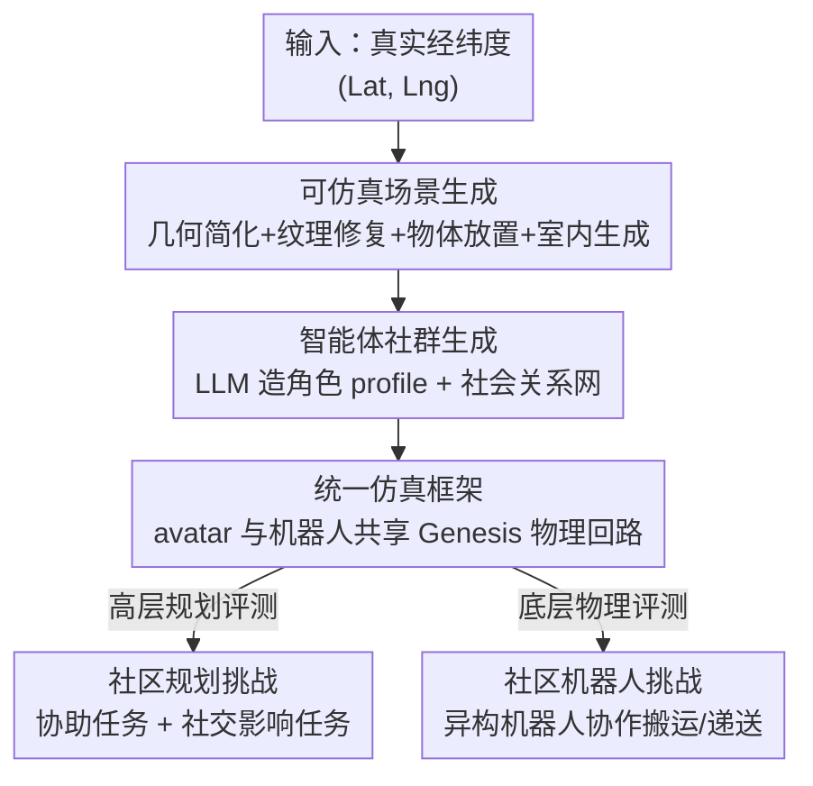

# Virtual Community: An Open World for Humans, Robots, and Society

**会议**: ICLR 2026  
**OpenReview**: [https://openreview.net/forum?id=Qo0OZZoTLh](https://openreview.net/forum?id=Qo0OZZoTLh)  
**论文**: [Project Page](https://virtual-community-ai.github.io/)  
**代码**: 已开源（见项目页）  
**领域**: 机器人 / 具身智能 / 多智能体仿真  
**关键词**: 开放世界仿真, 具身多智能体, 人机共存, 物理引擎, 场景生成

## 一句话总结
本文构建了 Virtual Community——一个基于 Genesis 物理引擎、用真实地理空间数据自动生成开放世界场景与智能体社群的具身多智能体仿真平台，让人形 avatar 与多种机器人在同一物理世界里共存交互，并配套提出"社区规划挑战"和"社区机器人挑战"两套基准来检验高层多智能体规划与底层物理协作能力。

## 研究背景与动机

**领域现状**：具身智能依赖虚拟仿真器训练与评测，过去十年涌现了 Habitat、AI2-THOR、iGibson、ManiSkill、CARLA 等大量平台。但它们各有侧重——要么专注机器人操作，要么专注室内家务，要么只支持少量 agent 的简单交互。

**现有痛点**：现有平台几乎没有一个能在**可扩展的开放世界**里同时支持**大规模、异构（人 + 多种机器人）社群**。具体来说有两个硬约束：一是物理仿真层面，多数多智能体平台只能处理小群体或提供受限的物理交互，撑不起社区级别的真实行为；二是世界生成层面，现有方法分两派——程序化/手工设计交互性好但多样性和真实感差，3D 重建真实但交互性低且需要海量视觉输入，二者都难以低成本铺出可交互、可扩展的城市级开放世界。

**核心矛盾**：研究"人机共存社会"需要的三个属性——**物理真实、世界可扩展、社群异构**——在已有平台里互相掣肘，没有一个统一框架能同时拿下。室内+室外的非线性大场景、自由探索而非固定路径，这种开放世界恰恰是复杂多智能体行为最该被研究的舞台，却最缺工具支撑。

**本文目标**：搭一个统一仿真框架，让人形 avatar 和多类机器人在**自动生成的、对齐真实世界的大尺度开放世界**里共存，并提供配套的观测/动作接口与评测挑战。

**切入角度**：作者押注于"通用物理引擎 + 真实地理空间数据 + 生成模型"的组合——用 Genesis 提供统一物理底座，把 Google 3D Tiles / OSM / Google Maps 的真实地理数据作为骨架保证规模与真实性，再用扩散模型、LLM 等生成模型填补交互性与社群内容。

**核心 idea**：把"真实地理数据的规模"和"生成模型的可控交互性"缝在一个统一物理引擎上，自动产出可仿真的开放世界 + 有血有肉的智能体社群，从而第一次在大规模、异构、开放世界尺度上研究具身社会智能。

## 方法详解

### 整体框架

Virtual Community 的核心是一条**全自动的"开放世界生成 + 统一仿真"流水线**：给定一个真实经纬度坐标，系统先把噪声很大的 3D 地理空间数据清洗、增强成可仿真的城市场景（含室内房间），再用 LLM 在这个场景上"种"出一群有 profile、有社会关系网的智能体，最后把人形 avatar 和机器人统一塞进 Genesis 物理引擎里跑社区仿真。生成侧保证"世界够大够真"，仿真侧保证"人和机器人能真的在物理世界里动起来、撞得到、抓得起"。

整条管线可拆成三大块：**(A) 场景生成**（地理数据 → 可仿真场景）、**(B) 智能体社群生成**（场景 → 角色 + 社会关系网）、**(C) 统一仿真**（avatar + 机器人在 Genesis 里共存）。最终平台之上再挂两套挑战基准。

### 关键设计

**1. 可仿真场景生成：把噪声地理数据洗成具身可用的开放世界**

痛点很直接——Google 3D Tiles 等地理空间数据虽然量大、覆盖全球，但拓扑不可靠、含瞬态物体、地形崎岖失真，而且是航拍重建的，地面视角细节差，根本不能直接喂给物理引擎。本文用一条四步在线流水线把它"修"成可仿真场景。**几何重建与简化**先把场景拆成地形、建筑、装饰屋顶三类分别处理：地形由稀疏高程参考点经双线性插值程序化生成，建筑则用 OpenStreetMap (OSM) 数据推出拓扑正确的简化网格，并自动对齐 Google 3D Tiles 几何与地形高度，借此把航拍重建产生的扭曲面、不规则形状这些 artifact 去掉，既降噪又提升物理仿真和渲染效率。**纹理增强**用 Stable Diffusion 3 的 inpainting 修复烘焙到新几何上时出现的缺失/扭曲纹理，再用街景图像细化细节，让地面视角更逼真。**交互物体放置**结合生成与检索：简单物体（如帐篷）用 OSM 文本标注驱动 Stable Diffusion 出图、再过 One-2-3-45 生成 3D 网格，复杂物体（如树）则从预收集资产库按 OSM 类别随机检索。**地点/交通标注与室内生成**用 Google Maps Places + OSM 给地点、建筑、公交线路打上语义标注（支撑导航、交通模拟、基于位置的决策），室内场景则优先从 GRUTopia 检索布局、未覆盖的类型用 Architect 生成。靠这套流程，作者自动产出了 35 个全球城市的标注场景。

**2. 场景接地的智能体社群生成：让 agent 不是凭空捏造而是长在场景里**

光有空场景不够，社会智能研究需要一群"住在这个城市里"的人。本文用 GPT-4o 做角色与社会关系网生成，关键在于**接地（grounding）**：LLM 的输入被结构化成两部分——一部分是场景信息（场景名、各地点的名称/类型/功能），另一部分是 agent 外观（姓名、年龄，保证 profile 与视觉属性一致），输出则是带基本属性（职业、性格、爱好）的角色 profile 以及以"群组"形式组织的社会关系（每个群组含一批 agent、一段文字描述、一个群体活动地点），把零散个体织成有机社区。为了防止 LLM 幻觉出场景里不存在的地点，作者加了一个**grounding validator**：校验生成 profile 里引用的地点是否真实存在，验证失败就把反馈喂回 LLM 让它修正，形成"生成—校验—修正"的闭环。这一步直接解决了"LLM 社群和 3D 场景对不上"这个接地难题。avatar 外观则来自 20 个 Mixamo skin，外加用 Avatar SDK 从 FaceSynthetics 合成人脸生成的高保真人体网格。

**3. 人机统一仿真：avatar 与机器人共享同一套物理回路**

平台的物理底座是 Genesis 这个通用物理引擎，机器人仿真基本直接继承自 Genesis，难点在于把**人形 avatar 也纳入同一物理世界**并和机器人共用仿真循环。avatar 用 SMPL-X 骨架配 avatar skin 建模，动作由 SMPL-X 姿态向量 $J \in \mathbb{R}^{162}$ 与全局平移、旋转向量 $T, R \in \mathbb{R}^3$ 参数化；作者用 2000+ 段 Mixamo 动作片段（走路、操作物体、上下车等）驱动，走路时循环播放直到走够距离，抓取/上车时把物体或车辆按动作运动学地"挂"到/解绑于手上，同时做 avatar 与场景实体的碰撞检测、检测到潜在碰撞即终止动作。日程上，作者沿用 Generative Agents 的思路用基础模型生成每个 agent 的**日程表**，但强制每条活动含起止时间、活动描述和地点，并显式计入跨地点的通勤时间，以反映在大尺度 3D 环境中导航的真实代价。机器人侧支持无人机、四足、人形、轮式、移动操作臂五类，各有独立控制器作为 Virtual Community 与 Genesis 之间的接口、只暴露选定动作空间；avatar 与机器人共享同一仿真循环但用不同控制频率，背景场景用不可见地形网格 + 分解后的建筑网格作碰撞几何以加速机器人物理仿真。正是这套统一框架让"人和机器人在同一开放世界里物理共存"成为可能。

**4. 两套配套挑战：把平台能力转化为可量化的研究问题**

平台本身只是基建，作者用两套挑战把它变成可评测的科学问题。**社区规划挑战**考高层多智能体规划，含三类协助任务（Carry 跟随人帮搬东西回家、Delivery 把物体从源送到目的地、Search 在室外区域或室内房间找目标物）和一个社交影响任务（两个主 agent 竞争性地去结识、说服其他社区成员、提升社交影响力）。观测是 RGB-D + 相机矩阵 + 分割 + 位姿 + 任务信息，动作含前进/左转/右转/上下车/上下自行车/通信。评测指标包括成功率 SR（成功子任务数 / 总子任务数）、平均耗时 $T_s$、以及 Carry 专用的人类跟随率 HR（与人保持指定距离的帧数 / 总帧数）；社交影响任务则用平均好友排名胜率 (Win.) 和转化率 Conv.（原本不支持却在一天结束时变成朋友的成员比例）。**社区机器人挑战**考底层物理协作，让两个异构机器人（移动操作臂 + 轮式搬运车）在开放世界里协作搬运/递送，直面"边操作物体边在动态环境中跟人"的物理难度。

## 实验关键数据

### 社区规划挑战主结果

在 24 个场景上评测多种 baseline（Random / Heuristic / MCTS Planner / LLM Planner），1-assistant 与 2-assistant 两种设置：

| 设置 | 方法 | Carry SR↑ | Delivery SR↑ | Search SR↑ | Avg SR↑ |
|------|------|-----------|--------------|------------|---------|
| 1-assistant | Random | 0.0 | 0.0 | 0.0 | 0.0 |
| 1-assistant | Heuristic | 34.7 | 46.5 | 45.1 | 42.1 |
| 1-assistant | MCTS Planner | 42.3 | 39.6 | 45.1 | 42.4 |
| 1-assistant | LLM Planner | 29.9 | 41.7 | **70.1** | 47.2 |
| 2-assistant | Heuristic | 52.8 | 59.7 | 51.4 | 54.6 |
| 2-assistant | MCTS Planner | 42.4 | 43.8 | 48.6 | 44.9 |
| 2-assistant | LLM Planner | 30.2 | 43.8 | **77.8** | 50.6 |

没有任何单一方法能在所有任务上称王：LLM Planner 在不涉及物体交互的 Search 上大幅领先（70.1 / 77.8），但在需要跟踪任务进度的 Carry/Delivery 上很弱，因为仅凭动作历史 LLM 难以跟踪进度；Heuristic 在 Delivery 上表现稳健。一个共性失败模式是 baseline 普遍**低估开放世界导航与搜索的代价**，导致任务安排次优。

### 消融与社交影响实验

距离建模 (Distance Modeling, DM) 消融显示空间信息的关键性：

| 设置 | 方法 | Avg SR↑ |
|------|------|---------|
| 1-assistant | MCTS Planner（完整） | 42.4 |
| 1-assistant | MCTS Planner w/o DM | 29.0 |
| 1-assistant | LLM Planner（完整） | 47.2 |
| 1-assistant | LLM Planner w/o DM | 44.4 |

去掉显式距离建模后两类规划器都掉点，MCTS 掉得尤其惨（42.4 → 29.0）；有趣的是 LLM Planner 在 2-assistant 设置下去掉 DM 反而能超过自身 baseline，暗示**协作能部分弥补缺失的距离建模**。社交影响任务上，o1 backbone 在 5 个社区平均好友胜率 0.63、转化率受场景影响，整体强于 GPT-4o（0.57）；消融进一步显示对话生成比目标选择对最终表现贡献更大。

### 社区机器人挑战

21 个场景上，移动操作臂 + 轮式车协作：

| 方法 | Carry SR↑ | Deliver SR↑ | Avg SR↑ |
|------|-----------|-------------|---------|
| Heuristic | 17.6 | 22.2 | 19.9 |
| RL | 9.5 | 19.0 | 14.3 |
| Heuristic w Oracle Grasp | 23.5 | 50.0 | **36.8** |
| RL w Oracle Grasp | 19.0 | 42.9 | 31.0 |

### 关键发现
- **抓取是最大瓶颈**：去掉 oracle grasp 后所有 baseline 成功率断崖式下跌（Heuristic 36.8 → 19.9），说明动态开放世界里的操作（manipulation）才是真正的难点。
- **经典规划器胜过 RL**：基于逆运动学 + RRT-Connect 的 Heuristic 全面优于 RL，因为经典规划器在配置空间里显式求最优路径，而 RL 要在稀疏奖励下自己摸索控制序列；连 VLA baseline 都接近零分。
- **Carry 比 Delivery 更难**：所有方法在 Carry 上都更差，因为它要求"边操作物体边在动态环境中跟人"，双重负担叠加。

## 亮点与洞察
- **真实地理数据 + 生成模型 + 物理引擎的三段缝合**很巧：用 OSM/3D Tiles 保证城市级规模与真实骨架，用扩散/LLM 补交互性和社群血肉，用 Genesis 兜底物理统一，恰好各取所长、互补了"程序化 vs 重建"两派的短板。
- **grounding validator 是个可复用的小 trick**：LLM 生成社群内容时极易幻觉出不存在的地点，用一个轻量校验器做"生成—校验—修正"闭环，几乎零成本地把社群和 3D 场景钉在一起，这个思路可迁移到任何"LLM 生成内容需对齐结构化知识库"的场景。
- **把通勤时间显式写进日程**这一点看似小却很关键——它让 agent 在大尺度开放世界里的规划必须考虑空间代价，而这恰恰是 baseline 普遍翻车的地方，等于把"开放世界的空间性"做成了任务的内生难度。
- **人形 avatar 与机器人共享同一物理回路**打破了过去"要么纯 avatar、要么纯机器人"的平台割裂，是研究人机共存社会的必要基建。

## 局限与展望
- 作者承认室外场景的建模精度不足，难以准确反映真实环境的物理与视觉属性——这会限制 sim-to-real 的可信度。
- avatar 动作基于 Mixamo 动作片段 + 运动学挂载（而非全物理驱动），抓取/上车靠 kinematic attach 而非真实物理接触，人侧的"物理真实性"其实弱于机器人侧。
- 社群生成依赖 GPT-4o，profile 与社会关系的合理性、多样性受限于 LLM 的世界知识与偏见，缺乏对生成社群质量的定量评估。
- 两套挑战的 baseline 普遍成功率不高（机器人挑战去掉 oracle grasp 后 Avg SR 仅约 20），说明任务本身极具挑战，但也意味着当前结果更多是"展示难度"而非"展示可解"。

## 相关工作与启发
- **vs Generative Agents (Park et al., 2023)**: 后者在纯符号化社区里仿真类人 agent，忽略了 3D 感知和真实物理；本文把同样的"LLM 驱动社群"思路落到带物理引擎的 3D 开放世界里，agent 真的要导航、要碰撞、要花通勤时间。
- **vs GRUTopia / Architect / RoboGen 等生成式平台**: 它们或聚焦室内布局生成、或聚焦机器人技能任务生成；本文把生成式管线**整体集成进仿真平台**，目标是城市级、人机混合的开放世界社群，而非单点的场景或任务生成。
- **vs Habitat / iGibson / CARLA 等仿真器**: 传统平台或专注室内家务、或专注自动驾驶、或只支持少量 agent；本文的差异化在于"室内+大尺度室外 + 异构人机社群"三者兼具，填补了开放世界多智能体具身仿真的空白。

## 评分
- 新颖性: ⭐⭐⭐⭐⭐ 首个把真实地理数据、生成模型、统一物理引擎缝成大规模人机共存开放世界平台的工作。
- 实验充分度: ⭐⭐⭐⭐ 两套挑战 + 多 baseline + 多维消融，但 baseline 成功率偏低，更多是展示难度而非验证可解性。
- 写作质量: ⭐⭐⭐⭐ 系统结构清晰、图表完整，作为平台型论文交代了管线各环节。
- 价值: ⭐⭐⭐⭐⭐ 开源平台 + 两套基准为"具身社会智能 / 人机共存"提供了稀缺的研究基建。

<!-- RELATED:START -->

## 相关论文

- [\[ICLR 2026\] World-In-World: World Models in a Closed-Loop World](world-in-world_world_models_in_a_closed-loop_world.md)
- [\[CVPR 2025\] Solving Instance Detection from an Open-World Perspective](../../CVPR2025/robotics/solving_instance_detection_from_an_open-world_perspective.md)
- [\[CVPR 2026\] IGen: Scalable Data Generation for Robot Learning from Open-World Images](../../CVPR2026/robotics/igen_scalable_data_generation_for_robot_learning_from_open-world_images.md)
- [\[ICLR 2026\] Ctrl-World: A Controllable Generative World Model for Robot Manipulation](ctrl-world_a_controllable_generative_world_model_for_robot_manipulation.md)
- [\[ICLR 2026\] RoboCasa365: A Large-Scale Simulation Framework for Training and Benchmarking Generalist Robots](robocasa365_a_large-scale_simulation_framework_for_training_and_benchmarking_gen.md)

<!-- RELATED:END -->
