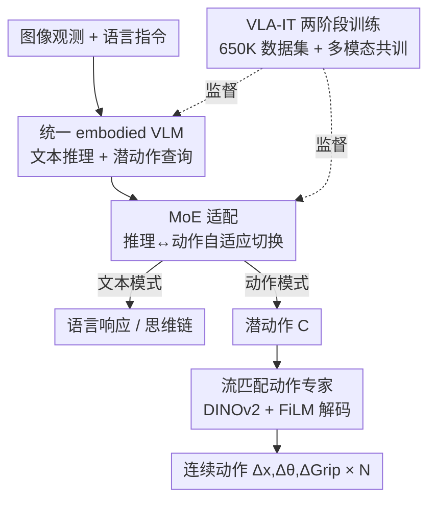

# Vision-Language-Action Instruction Tuning: From Understanding to Manipulation

**会议**: ICLR 2026  
**OpenReview**: [https://openreview.net/forum?id=tsxwloasw5](https://openreview.net/forum?id=tsxwloasw5)  
**代码**: 有（见项目主页）  
**领域**: 机器人 / 具身智能 / VLA  
**关键词**: 视觉-语言-动作模型, 指令微调, 混合专家, 潜动作, 流匹配

## 一句话总结
InstructVLA 提出"视觉-语言-动作指令微调（VLA-IT）"范式，用一个 VLM 同时承担多模态推理与潜动作规划、再交给流匹配动作专家解码动作，并通过混合专家（MoE）适配在动作训练中保住 VLM 的多模态能力，让推理直接反哺操作——在 SimplerEnv 上比 SpatialVLA 高 33%，在新基准 SimplerEnv-Instruct 上比微调版 OpenVLA 高 96%。

## 研究背景与动机

**领域现状**：当前 VLA 模型大多从预训练的视觉-语言模型（VLM）初始化，再在具身数据上微调以获得可泛化的操作能力。主流路线有两条：一是像 RT-2、Magma 那样把视觉-语言数据和操作数据放在一起做自回归共训练；二是像 ECoT、Emma-X 那样把思维链（CoT）推理嵌进操作数据集里去迁移 VLM 的能力。

**现有痛点**：第一条路线往往忽略复杂的具身推理，而且作者的消融显示通用 VLM 语料在具身场景里存在领域差距；第二条路线依赖动作预训练的架构和结构化推理格式（子任务、grounding 等），表达力受限，会发生**灾难性遗忘**，即便额外微调也展示不出通用多模态能力。两条路共同的问题是：学会操作技能往往要以牺牲 VLM 的多模态推理为代价。

**核心矛盾**：动作训练与多模态推理之间存在任务干扰——直接把视觉、语言、动作三者一起优化会导致训练不稳、收敛慢，而单独偏向动作又会侵蚀掉 VLM 原本的语义理解能力。此外还有数据稀缺（缺少带丰富多模态监督的操作数据）和方法缺口（缺少把推理转成动作的有效机制）。

**本文目标**：在不侵蚀 VLM 多模态推理的前提下学会操作技能，同时让这种推理反过来增强操作；并为这个方向补上数据与评测两块短板。

**切入角度**：把"语言条件下的动作生成"看作**指令跟随的一个有机组成部分**，而不是一个独立的下游任务——既然 VLM 擅长指令跟随，那就让动作生成沿着同一条思维链长出来。

**核心 idea**：用一个统一的 embodied VLM 同时输出文本推理和潜动作（latent action），靠 MoE 适配在"推理模式"和"动作模式"之间自适应切换，再用一个轻量流匹配专家把潜动作解码成低层控制，从而把低层控制学习与 VLM 主干解耦、保住其多模态能力。

## 方法详解

### 整体框架

InstructVLA 要解决的是"如何让一个模型既会推理又会操作，且两者互不伤害还互相增益"。整体上它是一个单 VLM 驱动的统一架构：输入是图像观测 + 语言指令，模型先由 VLM（基于紧凑的 Eagle2-2B 主干）做自回归文本推理保住语言理解，再用 $N$ 个可学习的动作查询 $Q \in \mathbb{R}^{N\times D}$ 去注意 VLM 的隐状态、抽出与任务相关的潜动作 $C \in \mathbb{R}^{N\times D}$；最后一个流匹配动作专家以 DINOv2 视觉特征、潜动作、带噪动作嵌入和可选本体感受为条件，把潜动作解码成连续动作 $(\Delta x, \Delta\theta, \Delta\mathrm{Grip})$。整个生成分三步：① VLM 异步自回归推理；② 潜动作生成；③ 动作解码。其中 MoE 适配是让 VLM 在"推理"和"潜动作预测"两种模式间自适应切换的关键开关。训练采取两阶段配方：先做动作预训练得到 "Expert"，再做 VLA-IT 指令微调得到 "Generalist"。

### 关键设计

**1. 统一 embodied VLM 与潜动作查询：把动作长在指令跟随的思维链上**

针对"动作训练侵蚀多模态推理"这个核心矛盾，作者没有给动作单开一套表示，而是让同一个 VLM 既产生文本输出（保住语言理解和多模态推理），又通过 $N$ 个可学习动作查询 $Q$ 注意 VLM 隐状态、抽出潜动作 $C$。这相当于在 VLM 之上挂了一个"可学习接口"：低层控制的学习被搬到潜动作和动作专家那一侧，VLM 主干本身不必为了拟合机器人动作而改写权重，从而把低层控制学习与 VLM 解耦、保留其多模态能力。VLM 端用语言输出的交叉熵 $\mathcal{L}_{LM}$ 监督。这样动作生成就成了指令跟随链条里的一环，而不是一个会和推理抢容量的对立任务。

**2. MoE 适配：用 LoRA 专家 + 标量门控在推理与动作间无缝切换**

一个统一模型最难的是在"该说话时说话、该动手时动手"之间平滑切换。作者用 MoE 设计来做这件事：把若干 LoRA 模块当作 LLM 主干内部的专家（一个 action LoRA、一个 language LoRA），既保留预训练能力又保证推理高效；再用一个标量头（scalar head）通过对隐状态分类来预测每个专家的门控系数 $\lambda_i$，自适应地混合它们的输出。$K$ 个专家的隐状态合成为

$$h = W_0 x + \sum_{i=0}^{K} B_i A_i x \cdot \alpha_i \cdot \lambda_i$$

其中 $W_0$ 是原始权重，$x$ 是输入，$A_i \in \mathbb{R}^{r\times d}$、$B_i \in \mathbb{R}^{d\times r}$ 是 LoRA 参数，$\alpha_i$ 是 LoRA 缩放因子。门控系数随输入上下文和推理模式动态重加权，使模型能按情境在文本推理和语言引导的潜动作之间自动切换——消融显示去掉 MoE 虽能保住多模态性能但会显著拖累操作能力，正是这个开关让两种能力共存。

**3. 流匹配动作专家：DINOv2 + FiLM 把高层意图落到精细操作**

VLM 主干给出的是通用语义理解，但精细操作需要更细粒度的感知。作者把动作专家设计成一个独立的轻量模块（12 层 transformer、隐藏维 768），以 DINOv2 视觉编码器的图像特征、潜动作、带噪动作嵌入及可选本体感受为输入，用块级因果注意力（block-wise causal attention，单个输入内部非因果、输入类型之间因果）融合，并用流匹配目标 $\mathcal{L}_{FM}$ 监督。其中 DINOv2 编码器再用 FiLM 做特征级线性调制，让视觉特征被潜动作"调向"到空间与上下文相关的区域。消融非常说明问题：去掉 DINOv2 编码器整体掉 50.0%，加上 FiLM 再涨 15.3%——可见把丰富感知放进紧凑的动作专家、而非塞回 VLM，是把推理意图高效转成动作的关键。

**4. VLA-IT 两阶段训练 + 650K 指令数据集：分两步把推理喂进操作**

直接共训视觉、语言、动作会不稳定、收敛慢，作者拆成两阶段。**阶段一·动作预训练**：用异构操作数据训练，模型同时预测动作和"语言运动"（language motion，对低层动作的文字描述，用交叉熵监督），总损失为 $\mathcal{L} = \mathcal{L}_{LM} + \mathcal{L}_{FM}$；此阶段只训练潜动作嵌入和 LLM 主干上的 action LoRA（约 650M 参数），得到 "Expert"。**阶段二·VLA-IT 指令微调**：新增 language LoRA 和标量头，与阶段一的 action LoRA 一起构成 MoE 适配，这是阶段二唯一可训练的部分（约 220M 参数），在多模态数据、操作数据和精选的 650K VLA-IT 语料上交替共训，得到 "Generalist"。这个 650K 数据集用 GPT-4o 配三帧关键帧标注，分四类——场景描述、问答（具身场景理解）、指令改写、上下文创建（指令理解与潜动作规划）；之所以要自建而非直接用 GPT-4o 当解释器，是因为即便 SOTA VLM 在具身任务里也会出错，作者强调真值指令对标注准确性至关重要。训练用 1:7 的多模态-动作比例（是 ECoT/ChatVLA 1:3 的两倍），以更小代价维持多模态能力。

### 损失函数 / 训练策略
- 语言端：交叉熵 $\mathcal{L}_{LM}$ 监督文本输出与"语言运动"描述。
- 动作端：流匹配目标 $\mathcal{L}_{FM}$，并按 Black et al. 用 $\beta$ 分布在更噪的时间步上加权以提升精度。
- 阶段一总损失为两者直接相加 $\mathcal{L} = \mathcal{L}_{LM} + \mathcal{L}_{FM}$；阶段二只训 MoE 适配（language LoRA + 标量头 + action LoRA）。
- 推理加速：文本响应贪心解码到首个动作查询 token 出现，其余动作查询在 VLM 一次前向里并行解码；并缓存语言响应与潜动作（利用其时间稳定性）以减少 VLM 前向次数。

## 实验关键数据

### 主实验

操作基准（SimplerEnv 与 SimplerEnv-Instruct，成功率%，三随机种子平均）：

| 模型 | SimplerEnv 平均 | SimplerEnv-Instruct 平均 |
|------|-----------------|--------------------------|
| OpenVLA-7B | 27.2 | 14.2 |
| SpatialVLA-3B | 45.9 | 16.5 |
| π0-3B (S.) | 41.7 | 12.0 |
| OpenVLA (FT&GPT) | — | 35.6 |
| **InstructVLA-Expert (S.)** | **61.2** | 20.7 |
| **InstructVLA-Generalist (S.)** | 54.9 | **46.9** |

- Expert 在 SimplerEnv 上比 SpatialVLA 相对高 **33.3%**；Generalist 在 SimplerEnv-Instruct 上比最强基线（OpenVLA + GPT-4o）相对高 **31.7%**、比微调版 OpenVLA 高约 96%。

多模态理解（部分基准，#Params 指 LLM 主干大小）：

| 模型 | #Params | MMMU | MMStar | TextVQA | AI2D |
|------|---------|------|--------|---------|------|
| Eagle2（基座） | 1.5B | 43.1 | 56.4 | 79.1 | 79.3 |
| OpenVLA (FT) | 7B | 26.0 | 28.2 | 2.5 | 35.8 |
| ECoT | 7B | 16.2 | 19.1 | 0.0 | 0.0 |
| Magma | 8B | 38.8 | 41.3 | 66.5 | 66.1 |
| **InstructVLA-Generalist** | 1.5B | **44.2** | 56.2 | 77.7 | 79.1 |

- InstructVLA 的多模态成绩几乎与其基座 Eagle2 持平，而 OpenVLA(FT)、ECoT 在动作训练后多模态能力大面积崩塌，印证了"保住 VLM 能力"这一核心主张。

### 消融实验

| 配置 | WidowX | Google | 平均 | 说明 |
|------|--------|--------|------|------|
| **InstructVLA** | 29.1 | 64.8 | **52.9** | 完整动作专家 |
| w/o Lang. | 15.3 | 65.0 | 48.4 | 去掉"语言运动"监督，掉 9.3% |
| w/o FiLM | 25.0 | 56.3 | 45.9 | 仅用 DINO 不调制，掉 15.3% |
| w/o DINO | 4.2 | 32.4 | 23.0 | 动作专家无视觉输入，掉 50.0% |

| 训练/推理策略 | 关键指标 | 说明 |
|----------------|----------|------|
| FFT (OpenVLA-OFT 全微调) | 偏低 | 无 MoE、无多阶段，操作与理解都次优 |
| AR (Magma 自回归共训) | 受限 | 能共训但性能有限 |
| InstructVLA-MoE | 保住多模态、操作略弱 | 去掉 MoE 设计的对照 |
| Generalist w/o Think | 已超 OpenVLA/Magma | 即便不显式推理也更强 |
| Generalist w/ Think | +36.1% | 开启显式文本推理后再涨 |

### 关键发现
- **DINOv2 感知是动作专家的命门**：去掉它整体掉一半，说明 VLM 的通用视觉理解不足以支撑精细操作，必须给动作专家补细粒度感知，而 FiLM 调制进一步把视觉特征对齐到潜动作。
- **显式"思考"直接增益操作**：开启 thinking 比直接执行涨 36.1%，甚至超过把 Expert 外接 GPT-4o 当 system-2 解释器——证明推理与动作端到端耦合优于外挂大模型。
- **情境推理任务最吃数据规模与多模态多样性**：situated reasoning 随 VLA-IT 标注规模增长收益最大；加入 QA 与场景描述标注使泛化提升 10.8%。而微调 OpenVLA 因灾难性遗忘，在情境推理上几乎不涨。
- **冻结动作专家也够用**：阶段二只微调 VLM、冻结动作专家即可达到与联合微调相当的效果，大幅减少可训练参数。

## 亮点与洞察
- **把动作当成指令跟随的一环**：不再把操作看作独立下游任务，而是让潜动作沿着 VLM 的思维链长出来，这个视角让推理与动作天然共享一条链路、互相增益。
- **MoE 当"模式开关"而非"容量扩展"**：用 LoRA 专家 + 标量门控在推理与动作间切换，是个很可复用的 trick——任何需要"一个模型两种行为模式"的统一架构都可借鉴这种按隐状态分类来门控的做法。
- **解耦低层控制是保住多模态的关键**：把动作学习压在潜动作 + 轻量专家一侧、不动 VLM 主干，是它能在动作训练后仍保持基座级多模态成绩的根因；这对所有"在基础模型上加新模态/技能又怕遗忘"的场景都有启发。
- **自建 650K 指令数据 + SimplerEnv-Instruct 基准**：补上了"带丰富多模态监督的操作数据"和"评测指令泛化"两块公开短板，且只用约 SimplerEnv 三分之一的规模（80 任务 1.1K trial）保持评测可负担。

## 局限与展望
- 评测以 SimplerEnv 系真实到仿真（real-to-sim）为主，真实机器人实验虽有但规模有限（WidowX-250 零样本 + Franka 少样本），更大规模真机部署的鲁棒性仍待验证。
- 650K VLA-IT 标注依赖 GPT-4o 自动生成，作者也承认即便 SOTA VLM 在具身任务上仍会出错，标注噪声对最终能力的影响边界没有充分刻画。
- 方法建立在 Eagle2-2B 这类紧凑 VLM 上，是否随更大 VLM 主干进一步放大"推理反哺操作"的收益、以及 MoE 专家数扩展的边际效应，文中未深入。
- 潜动作查询数 $N$、1:7 多模态-动作训练比例等关键超参的敏感性可以再系统化分析。

## 相关工作与启发
- **vs RT-2 / Magma（自回归共训）**：他们把视觉-语言与操作数据放一起自回归共训，能部分保住多模态但忽略复杂具身推理、操作上限受限；本文用 MoE 适配 + 两阶段训练显式区分两种模式，在 SimplerEnv 上比 Magma 相对高 12.5%。
- **vs ECoT / Emma-X（CoT 嵌入操作数据）**：他们把结构化思维链塞进操作数据集，依赖动作预训练架构和固定推理格式，仍遭灾难性遗忘、缺多模态问答能力；本文把动作当指令跟随的一环、解耦低层控制，既保住多模态又让推理可泛化。
- **vs π0 / GR00T（流匹配 VLA）**：它们用连续流匹配生成动作、操作性能强，但通常不整合自回归文本推理；本文把自回归语言生成与流匹配动作生成统一在一个模型里，证明语言与动作可高效共训。
- **vs OpenVLA + GPT-4o（外挂 system-2）**：用外部大模型改写指令受限于 GPT-4o 在具身场景的指令解释误差；本文端到端的内生推理更准，且开启 thinking 后反超这种外挂方案。

## 评分
- 新颖性: ⭐⭐⭐⭐⭐ 把动作生成纳入指令跟随、用 MoE 在推理/动作间切换并解耦低层控制，思路清晰且自洽。
- 实验充分度: ⭐⭐⭐⭐⭐ 覆盖多模态、SimplerEnv、自建基准与真机，消融把每个设计的贡献都拆得很清楚。
- 写作质量: ⭐⭐⭐⭐ 论证链条完整、图表丰富；部分组件（MoE 门控、缓存策略）细节散在附录。
- 价值: ⭐⭐⭐⭐⭐ 给"推理增强操作且不遗忘"提供了可复现的数据+基准+方法范式，对具身智能方向参考价值高。

<!-- RELATED:START -->

## 相关论文

- [\[ICLR 2026\] PixelVLA: Advancing Pixel-level Understanding in Vision-Language-Action Model](pixelvla_advancing_pixel-level_understanding_in_vision-language-action_model.md)
- [\[ICLR 2026\] Vlaser: Vision-Language-Action Model with Synergistic Embodied Reasoning](vlaser_vision-language-action_model_with_synergistic_embodied_reasoning.md)
- [\[CVPR 2026\] Test-Time Perturbation Tuning with Delayed Feedback for Vision-Language-Action Models](../../CVPR2026/robotics/test-time_perturbation_tuning_with_delayed_feedback_for_vision-language-action_m.md)
- [\[ICLR 2026\] Action-aware Dynamic Pruning for Efficient Vision-Language-Action Manipulation](action-aware_dynamic_pruning_for_efficient_vision-language-action_manipulation.md)
- [\[ICLR 2026\] EVLP: Learning Unified Embodied Vision-Language Planner with Reinforced Supervised Fine-Tuning](evlp_learning_unified_embodied_vision-language_planner_with_reinforced_supervise.md)

<!-- RELATED:END -->
