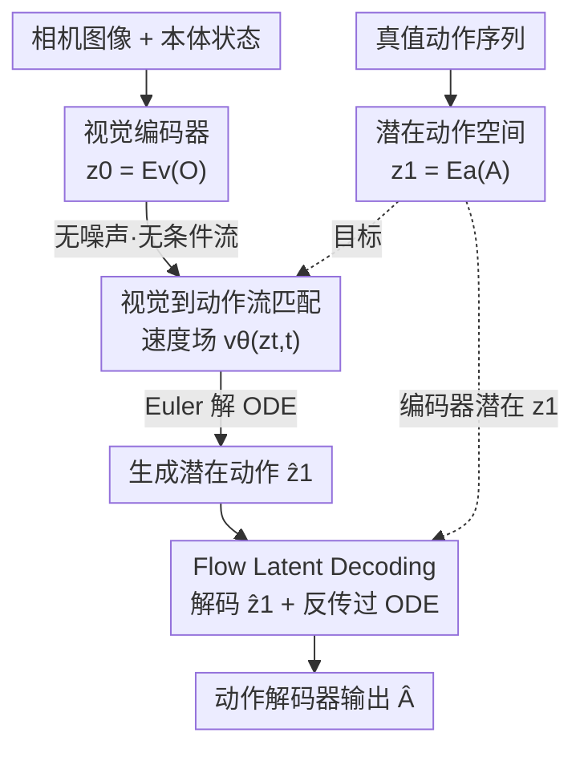

# VITA: Vision-to-Action Flow Matching Policy

**会议**: ICLR 2026  
**OpenReview**: [https://openreview.net/forum?id=BTe5VLBjPg](https://openreview.net/forum?id=BTe5VLBjPg)  
**代码**: 项目页 VITA（论文标注，未给出仓库链接）  
**领域**: 机器人 / 具身智能  
**关键词**: 流匹配、视觉运动策略、模仿学习、潜在动作、推理效率

## 一句话总结
VITA 把流匹配策略的源分布从高斯噪声换成视觉表征本身，让流"从视觉直接流向动作"，从而彻底去掉每一步去噪都要做的视觉 conditioning，在 ALOHA / Robomimic 等 14 个任务上推理快 1.5×–2×、显存省 18.6%–28.7%，成功率还能持平甚至超过 SOTA。

## 研究背景与动机

**领域现状**：扩散策略（Diffusion Policy）和流匹配策略（Flow Matching Policy）已经成为视觉运动控制的主流生成式做法——它们从一个标准噪声分布（通常是高斯）出发，通过迭代去噪一步步把噪声"雕刻"成动作序列。

**现有痛点**：因为源分布是与任务无关的纯噪声，模型必须在**每一个去噪步**反复把视觉观测注入进去，否则生成出来的动作和当前画面无关。这种注入靠的是 conditioning 模块：cross-attention 带来二次方的时间/空间复杂度；AdaLN、FiLM 虽然避开了二次方，却要额外的调制网络在每层、每步生成 feature-wise 参数。结果就是推理慢、显存大、网络结构复杂。

**核心矛盾**：实时机器人控制对延迟极其敏感（Pi-0.5 跑 50 Hz、Helix 高达 200 Hz），而"噪声源 + 反复 conditioning"这套范式恰恰把开销堆在了最不该堆的推理热路径上。问题的根子在于：**源分布里没有任何视觉信息，所以视觉只能靠 conditioning 一遍遍补**。

**本文目标**：去掉 conditioning 这个开销大户，同时不牺牲（甚至提升）动作精度。

**切入角度**：流匹配理论上对源分布**没有任何约束**——不一定非得是高斯。那么如果直接把视觉的潜在表征当作流的起点呢？源头本身就"视觉接地"了，流过程中自然不再需要重复注入视觉。

**核心 idea**：用"视觉潜在 → 动作潜在"的无噪声、无条件流匹配，替代"高斯噪声 → 动作 + 每步 conditioning"的传统范式。

## 方法详解

### 整体框架

VITA 要学的是策略 $\pi(A|O)$：把观测 $O$（原始图像 $I$，可选本体状态 $S$）映射成未来动作序列 $A \in \mathbb{R}^{T_{pred} \times D_{action}}$（采用 action chunking，一次预测一段）。它的与众不同之处在于流的**起点**：传统方法 $z_0 \sim \mathcal{N}(0, I)$，而 VITA 把视觉编码器输出的视觉潜在 $z_0 = E_v(O)$ 直接当成流的源，让速度场 $v_\theta(z_t, t)$ 不再带条件——这就是"无噪声、无条件"。

但这里有个硬约束：流匹配要求源和目标**维度必须相同**。视觉潜在动辄 512 维甚至更高，动作维度却低到 PushT 的 2 维、ThreadNeedle 的 21 维。所以 VITA 必须先把动作"抬"到和视觉同维的潜在空间。整套架构由三个部件组成：**视觉编码器** $E_v$ 给出源潜在 $z_0$；**动作自编码器**（编码器 $E_a$ 把真值动作压成目标潜在 $z_1 = E_a(A)$，解码器 $D_a$ 再把潜在还原成动作）提供流匹配的目标并负责落地；**流匹配网络** $v_\theta$ 学从 $z_0$ 到 $z_1$ 的速度场。

推理时：当前观测编码成 $z_0$ → Euler 解 ODE 从 $t=0$ 积分到 $t=1$ 得到生成潜在动作 $\hat{z}_1$ → 解码器输出最终动作 $\hat{A} = D_a(\hat{z}_1)$。训练时多出一条关键回路——**Flow Latent Decoding（FLD）**：不是只让解码器去还原编码器给的 $z_1$，而是强迫它去还原**ODE 真实生成的** $\hat{z}_1$，并把重建误差沿着 ODE 求解步一路反传回 $v_\theta$ 和 $E_v$，防止潜在动作空间塌缩。

### 关键设计

**1. 无噪声无条件的视觉到动作流：把视觉表征本身当成流的源**

传统流匹配从高斯噪声出发，源里没有任何视觉信息，只能学一个**有条件**的速度场 $v_\theta(z_t, t \mid O)$，每个去噪步都得靠 cross-attention / AdaLN / FiLM 把观测 $O$ 注入进去——这正是开销的来源。VITA 利用"流匹配对源分布无约束"这一理论性质，直接把视觉潜在 $z_0 = E_v(O_{curr})$ 当作流的起点。因为源头已经"视觉接地"，速度场退化成无条件的 $v_\theta(z_t, t)$，流过程中**一次视觉注入都不需要**。

这一步带来的结构红利很实在：在向量型视觉特征（ResNet 全局平均池化后的向量）下，流网络从"处理 $T_{pred} \times D_{action}$ 噪声块并融合视觉"退化成一个纯粹的**向量到向量映射**，于是可以用最轻量的 MLP——VITA 是已知第一个仅用 MLP 就能搞定 ALOHA 双臂操作这种高难任务的流匹配策略；在网格型特征（如 $9 \times 512$）下则用 transformer，但同样砍掉了 cross-attention。论文还给出一个直觉证据：由于端到端联合优化，视觉与动作的潜在流形被"协同进化"得高度对齐，**甚至不做任何 ODE 积分、直接解码视觉潜在就能得到粗略动作轨迹**，说明 VITA 学到的是一种以动作为中心的视觉表征——这也解释了为何轻量 MLP 足够，而从无结构高斯出发的 MLP-only FM 学不起来。

**2. 潜在动作空间：用动作自编码器把低维动作"抬"到与视觉同维**

流匹配要求源、目标同维，但动作维度远低于视觉。最朴素的几种做法都不行：把视觉降采样到动作维会严重丢信息；把动作零填充上采样得到稀疏无结构的目标，反而拖累流匹配训练；像图像潜在扩散那样**预训练后冻结**一个动作 AE 也失败——因为动作数据稀疏有限，诱导出的潜在空间本身就不可靠，一旦冻结就再也纠正不了。

VITA 的解法是引入一个**与流匹配联合训练**的动作自编码器：编码器 $E_a$ 把真值动作块上采样成与视觉同维的目标潜在 $z_1 = E_a(A)$，作为流匹配的目标分布；解码器 $D_a$ 负责把潜在还原回动作。自编码器损失用 L1 重建 $L_{AE} = \|A - D_a(E_a(A))\|_1$，这样得到的 $z_1$ 是一个**结构化、重建偏差小、局部条件良好**的目标潜在空间。"结构化目标"这一点很关键——它既让流匹配有个干净的靶子，又为后面 FLD 与 FLC 的等价性提供了理论前提。

**3. Flow Latent Decoding：沿 ODE 反传重建误差，根治潜在空间塌缩**

联合训练动作 AE 和流匹配仍可能失败，论文把根因定位为**训练-推理不一致导致的潜在动作空间塌缩**。具体来说：训练时解码器看到的是编码器给的 $z_1$，而推理时它要解码的是 ODE 解出来的 $\hat{z}_1$；$\hat{z}_1$ 只是 $z_1$ 的近似、二者并不总对齐，于是解码器面对 $\hat{z}_1$ 时可能映不出有意义的动作。

FLD 的做法是在**训练时就让解码器从 ODE 生成的 $\hat{z}_1$ 解码**，损失定义为 $L_{FLD} = \|D_a(\hat{z}_1) - A\|$，其中 $\hat{z}_1$ 由训练中用 Euler solver 解流 ODE 得到。梯度会穿过解码器、再穿过 ODE 求解步，一路反传进 $v_\theta$ 和 $E_v$——相当于用真值动作把"潜在生成过程"锚定住，直接在动作空间度量误差，从而抹平编码器潜在与 ODE 潜在之间的鸿沟。论文还给出一个极简的代理目标 **Flow Latent Consistency（FLC）**：$L_{FLC} = \|\hat{z}_1 - z_1\|$，不经过解码、直接在潜在空间对齐。理论上（解码器局部 $C^1$、Jacobian 奇异值有界的温和假设下）FLD 与 FLC 提供**局部等价**的训练信号，最小值都收敛到 $\{z_1\}$ 附近半径 $\varepsilon_{AE}/m$ 内；实践中 FLC 也能防塌缩但收敛略慢，因为 FLD 用真值动作直接锚定、信号更强。消融显示 $\lambda_{FLD}=0$ 时模型彻底学不会（图 6），二者结合效果最好。

### 损失函数 / 训练策略

总目标是三项加权和：

$$L_{VITA} = \lambda_{FM} L_{FM} + \lambda_{FLD} L_{FLD} + \lambda_{AE} L_{AE}$$

其中 $L_{FM} = \mathbb{E}_{t, z_0, z_1}[\|v_\theta(z_t, t) - (z_1 - z_0)\|^2]$ 是标准流匹配损失（线性插值路径 $z_t = (1-t)z_0 + t z_1$，监督速度场 $z_1 - z_0$），$L_{AE}$ 是动作重建 L1 损失，$L_{FLD}$ 是上面的 ODE 反传重建损失。流匹配器采用基于最优传输的 OT-CFM，Euler solver 用 6 个时间步；视觉编码器为 ResNet-18；动作块长度 16、执行前 8 步；batch size 128。值得一提的是 VITA / FM 收敛远快于 DP / ACT（流匹配方法的已知优势），所以训练步数上 VITA/FM 只需 25K–50K，而 DP 要 100K、ACT 要 100K–200K。

## 实验关键数据

在 ALOHA / AV-ALOHA / Robomimic / PushT / RLBench 共 **9 个仿真 + 5 个真实**任务上评测，涵盖单臂与双臂、最高 21-DoF 动作和主动视觉。延迟/显存在单张 RTX 4090 上测量。

### 主实验

效率对比（每个 action chunk，batch size 1）：

| 视觉特征 | 方法 | 架构 | Conditioning | 参数量 | 延迟(ms) | 显存(MiB) |
|--------|------|------|-------------|-------|---------|----------|
| 向量 | **VITA** | MLP | 无 | 31.09M | **0.2215** | **333.86** |
| 向量 | FM | Transformer | AdaLN | 31.16M | 0.3307 | 410.38 |
| 向量 | FM | U-Net | FiLM | 84.05M | 0.3650 | 818.79 |
| 向量 | DDPM | U-Net | FiLM | 81.82M | 2.5985 | 801.47 |
| 网格 | **VITA** | Transformer | 无 | 31.80M | **0.2502** | **377.55** |
| 网格 | FM | Transformer | Cross-Attn | 29.06M | 0.5102 | 529.16 |

向量设置下 VITA 比最强 FM 基线快 1.5×、显存省 18.6%；网格设置下快 2×、显存省 28.7%。

仿真成功率（3 seeds 均值±标准差，节选）：

| 任务 | VITA | FM | DP | ACT |
|------|------|----|----|-----|
| ThreadNeedle | **91.33** | 90 | 59.33 | 44.67 |
| HookPackage | **86** | 82 | 37.33 | 32 |
| PushT | **88** | 83.33 | 74.67 | 28 |
| Square | **95.33** | 87.33 | 84 | 72 |
| CloseBox | **95.33** | 85.33 | 85.33 | 72 |
| Can | 100 | 100 | 95.33 | 88.67 |

VITA 在大多数任务上持平或超过最强的 transformer-based FM（AdaLN），对 DP / ACT 优势明显，尤其在高精度多阶段任务（穿针、挂包）上拉开差距。真实单臂 ALOHA 三任务（PickBall / StoreDrawer / ToothBrush 分子任务）上 VITA 也整体领先或持平。

### 消融实验

| 配置 | 现象 | 说明 |
|------|------|------|
| w/o FLD or FLC ($\lambda_{FLD}=0$) | 成功率≈0，彻底学不会 | 潜在动作空间塌缩，$\hat{z}_1$ 解不出有意义动作 |
| 仅 FLC | 能防塌缩，但收敛略慢 | 潜在空间对齐，信号弱于直接锚真值动作 |
| 仅 FLD | 成功学会策略 | 直接在动作空间用真值锚定 ODE 生成 |
| FLD + FLC | 最佳 | 原始空间与潜在空间双重学习信号 |

### 关键发现

- **FLD 是命门**：去掉它整个框架直接失效（成功率归零），说明"训练-推理潜在不一致"在动作这种稀疏数据上是致命问题，而沿 ODE 反传真值重建是有效解法。
- **效率优势在两种视觉特征下都成立**：向量特征靠 MLP 化拿下延迟/显存双降，网格特征靠去掉 cross-attention 拿下 2× 加速，证明红利来自"去 conditioning"这一范式本身而非某种特定架构。
- **视觉潜在已编码粗动作语义**：不积分直接解码 $z_0$ 就能得到初步轨迹，这是 VITA 视觉-动作流形对齐的直接证据，也解释了为何 MLP-only 够用而 MLP-only FM 不行。

## 亮点与洞察
- **用流匹配的"源无约束"性质做策略学习**：把视觉表征直接当流的起点，是一个理论上早就允许、却没人在策略学习里这样用的巧妙切口——一刀砍掉所有 conditioning 开销。
- **FLD：让梯度穿过 ODE 求解器**。把推理时真正会遇到的 $\hat{z}_1$ 拉进训练回路并反传，是解决训练-推理 gap 的通用思路，可迁移到任何"潜在空间联合训练 + ODE 生成"的场景（如潜在扩散在小数据域的微调）。
- **FLD↔FLC 的局部等价定理**给了实现上的灵活性：算力紧张时可用不经解码的 FLC 近似，理论保证二者收敛到同一目标。

## 局限与展望
- 动作自编码器与流匹配**必须联合端到端训练**，无法像图像潜在扩散那样复用预训练冻结潜在空间，这意味着每个任务/数据域都要从头训一套潜在动作空间，迁移性受限。
- 实验集中在 ALOHA / Robomimic 等模仿学习场景，数据规模（每任务 50–200 demo）偏小；在大规模、多任务、跨本体的通用机器人策略上能否保持效率与精度优势尚待验证。
- "视觉潜在即粗动作"的对齐依赖任务内视觉-动作强相关；当观测中含大量与动作无关的干扰（强视觉随机化、长时序规划）时，把视觉直接当源是否仍稳定，论文未充分探讨。

## 相关工作与启发
- **vs 传统流匹配/扩散策略（DP、FM with AdaLN/FiLM/Cross-Attn）**：它们从高斯噪声出发、每步 conditioning 注入视觉；VITA 从视觉潜在出发、无条件速度场，核心区别是"视觉接地的源" vs "无信息的噪声源"，由此换来 1.5×–2× 加速和显存下降。
- **vs ACT（CVAE 行为克隆）**：ACT 用条件 VAE 直接回归动作；VITA 是生成式流匹配 + 潜在动作空间，在高精度多阶段任务上成功率显著更高。
- **vs 图像潜在扩散（Stable Diffusion 式预训练冻结潜在）**：图像域数据充足可冻结潜在；动作域稀疏有限，VITA 必须端到端联合训练并用 FLD 防塌缩——这是把潜在生成范式搬到小数据模态时的关键改动。

## 评分
- 新颖性: ⭐⭐⭐⭐⭐ 把"流匹配源分布无约束"用到策略学习、彻底去 conditioning，是清晰且少见的范式切口。
- 实验充分度: ⭐⭐⭐⭐ 14 个任务覆盖仿真+真实、单臂+双臂，效率与成功率双指标，FLD 消融到位；但数据规模偏小、缺大规模通用性验证。
- 写作质量: ⭐⭐⭐⭐⭐ 动机推导清晰，FLD↔FLC 理论与直觉证据（不积分即可解码）都讲得很透。
- 价值: ⭐⭐⭐⭐⭐ 实时机器人控制对延迟极敏感，去 conditioning 的加速对部署有直接价值。

<!-- RELATED:START -->

## 相关论文

- [\[ICLR 2026\] Translating Flow to Policy via Hindsight Online Imitation](translating_flow_to_policy_via_hindsight_online_imitation.md)
- [\[CVPR 2026\] GeniNav: Generative Model Driven Image-Goal Navigation via Imagination-Guided Consistency Flow Matching](../../CVPR2026/robotics/geninav_generative_model_driven_image-goal_navigation_via_imagination-guided_con.md)
- [\[ICLR 2026\] WMPO: World Model-based Policy Optimization for Vision-Language-Action Models](wmpo_world_model-based_policy_optimization_for_vision-language-action_models.md)
- [\[ICLR 2026\] VITA: Zero-Shot Value Functions via Test-Time Adaptation of Vision–Language Models](vita_zero-shot_value_functions_via_test-time_adaptation_of_visionlanguage_models.md)
- [\[ICLR 2026\] HAMLET: Switch Your Vision-Language-Action Model into a History-Aware Policy](hamlet_switch_your_vision-language-action_model_into_a_history-aware_policy.md)

<!-- RELATED:END -->
