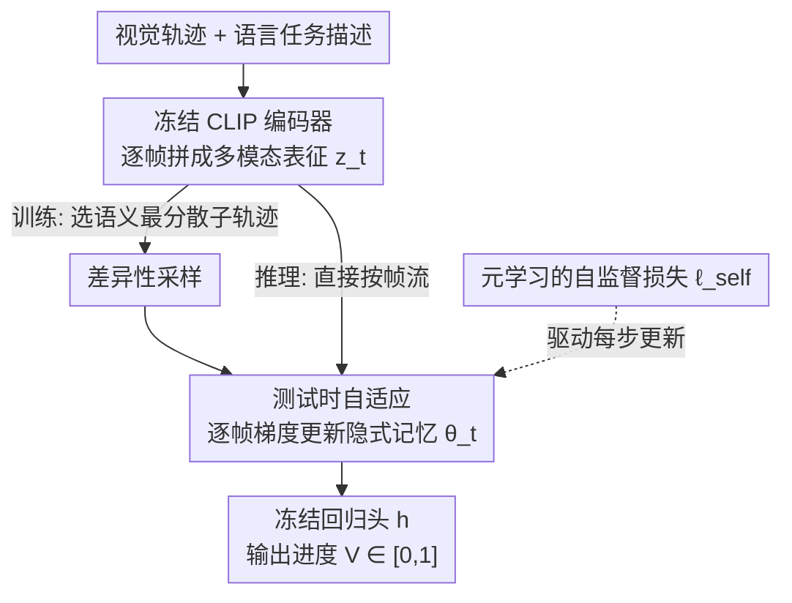

# VITA: Zero-Shot Value Functions via Test-Time Adaptation of Vision–Language Models

**会议**: ICLR 2026  
**OpenReview**: [https://openreview.net/forum?id=V35oo1SVGH](https://openreview.net/forum?id=V35oo1SVGH)  
**论文**: [Project Website](https://chziakas.github.io/vita/)  
**代码**: 见项目主页  
**领域**: 机器人 / 强化学习 / 多模态VLM  
**关键词**: 零样本价值函数, 测试时自适应, 元学习, 奖励塑形, 机器人操作

## 一句话总结
VITA 把冻结的对比式 VLM（CLIP）当作目标条件价值函数的底座，在推理时对一个轻量自适应模块按帧做梯度更新——更新规则本身是元学习出来的自监督损失，从而把轨迹历史隐式编码进参数里，让一个只在单一环境训练过的价值函数零样本泛化到全新任务、环境和机器人本体，并超过基于自回归 VLM 的 SOTA 方法 GVL。

## 研究背景与动机
**领域现状**：从大规模视频里无监督地学一个「通用的目标条件价值函数」是机器人学习的一条主线——给定视觉观测 $o_t$ 和自然语言任务描述 $g$，预测当前完成了多少进度 $V(o_t;g)\in[0,1]$，专家轨迹里进度通常用归一化时间步 $t/T$ 当监督。拿到这样的价值函数后，可以零样本地为强化学习/模仿学习做奖励塑形。

**现有痛点**：现有把 VLM 当价值函数的两条路都有硬伤。对比式 VLM（如 CLIP）只算每帧和任务描述的相似度，**没有时序建模**，无法区分视觉上很像、但处于任务不同阶段的状态（叠衣服 vs. 拆开衣服）；自回归式 VLM（如 GVL 用 Gemini）把整条轨迹塞进 prompt 里能引入时序上下文，但因为预训练数据是按时间顺序排的，**天生偏向预测单调递增的进度**，GVL 靠推理时打乱帧序来缓解，可这又把时序顺序整个丢掉了。

**核心矛盾**：两类 VLM 都依赖**冻结的预训练表征**做零样本预测，而这种表征既限制了泛化能力，也限制了时序推理能力。想强行解决，过去只能靠大规模预训练、领域微调或专家示范——又把「零样本」这个前提破坏了。

**本文目标**：在不做大规模预训练、不要任务专属示范的前提下，同时增强价值函数的**泛化能力**和**时序推理能力**。

**切入角度**：作者借用测试时训练（Test-Time Training, TTT）的思路——把推理当成一个自监督学习任务，逐帧用梯度步更新一个自适应模块。关键观察是：TTT 把历史**编码进参数**（而非隐藏状态或 KV 缓存）里，这些参数就成了一种隐式记忆，天然保留时序顺序；再配合 Finn 等人的梯度元学习，自监督任务本身可以被「学」出来，专门服务于下游价值估计。

**核心 idea**：用一个元学习出来的自监督损失，在推理时逐帧更新轻量自适应模块，让 VLM 表征在线适配每条测试轨迹的语义和时序上下文，把「时序历史」沉淀进参数当隐式记忆。

## 方法详解

### 整体框架
VITA 的价值函数估计器由三块组成：一个**冻结的对比式 VLM 编码器**（CLIP）把视觉轨迹和任务描述编码成逐帧的联合多模态表征 $z_t=[\phi_v(o_t);\phi_g(g)]\in\mathbb{R}^{2d}$；一个**测试时自适应模块** $f_{\text{adapt}}$，在推理时沿轨迹逐帧被更新；一个**回归头** $h$（两层 MLP）输出最终进度。整条流程的核心转折是：CLIP 和回归头都是冻结的，唯一在推理时变化的是 $f_{\text{adapt}}$ 的参数——它每读一帧就做一次梯度更新，于是「看过的历史」被一步步写进参数里。

训练侧，价值函数估计器用梯度元学习训练：先在轨迹上做差异性采样选出语义最分散的子轨迹，再让自适应模块在这些子轨迹上逐帧自适应，同时反向传播穿过这些自适应更新去优化「让自适应之后的监督预测损失更小」这一目标。推理侧不需要任何任务专属示范，直接把测试轨迹喂进来逐帧自适应即可得到零样本进度估计。

### 关键设计

**1. 测试时自适应：把轨迹历史编码进参数当隐式记忆**

这一设计直接解决对比式 VLM「没有时序」、自回归 VLM「丢时序顺序」的痛点。在推理时，对每一帧 $t$，自适应模块 $f_{\text{adapt}}$ 都会在一个自监督损失 $\ell_{\text{self}}$ 上做一步梯度更新：

$$\theta_t = \theta_{t-1} - \eta\nabla_\theta\,\ell_{\text{self}}(z_t;\theta_{t-1})$$

注意更新是**增量、不重置**的——$\theta_t$ 从 $\theta_{t-1}$ 接着走，所以读到第 $t$ 帧时，参数里已经累积了前面 $t-1$ 帧的信息。这与标准序列模型把历史存在隐藏状态（RNN）或 KV 缓存（Transformer）里不同：VITA 把历史存进**参数**本身，参数就成了一种隐式记忆，既携带累积的时序上下文又保留时序顺序。论文在消融里证明这种「逐帧增量、不重置」比轨迹级一次性更新（打散了帧序）、无记忆每帧重置、以及显式滑窗记忆都更好。最终价值由 $V(z_t;g)=h\big(f_{\text{adapt}}(P_Q z_t;\theta_t)\big)$ 给出，其中 $P_Q$ 是元学习出来的线性投影、$h$ 在推理时冻结。

**2. 元学习的自监督损失：让每一步更新真的提升价值估计**

光有「在推理时更新」还不够——更新的方向得对，否则越更新越糟。VITA 的做法是把自监督损失本身**元学习**出来，让它服务于价值估计。这个自监督损失是一个重构目标，靠两个可学习的线性投影 $P_K$（生成一个扰动视图）和 $P_V$（生成重构目标）参数化：

$$\ell_{\text{self}}(z_t;\theta_{t-1},P_K,P_V) = \big\|\,f_{\text{adapt}}(P_K z_t;\theta_{t-1}) - P_V z_t\,\big\|^2$$

训练时遵循 Finn 等人的梯度元学习范式：先用 $\ell_{\text{self}}$ 在线更新 $f_{\text{adapt}}$，再**反向传播穿过这次更新**，用监督预测损失 $\ell_{\text{pred}}$（预测进度与真值 $y_t=t/T$ 的均方误差）去优化 $f_{\text{adapt}}$ 的初始化 $\theta_0$、三个投影 $P_K,P_V,P_Q$ 以及回归头 $h$。总损失把 $\ell_{\text{pred}}$ 和 $\ell_{\text{self}}$ 用标量 $\lambda$ 加权（实验取 $\lambda_{\text{self}}=0.5$）。换句话说，自监督任务不是先验定死的，而是被训练成「做完这一步测试时更新后，价值估计会更准」——这正是 VITA 区别于普通 TTT 的地方。

**3. 差异性采样：抑制捷径学习，逼模型靠语义线索**

专家视频里相邻帧高度冗余，价值函数很容易偷懒去拟合「频繁出现的后期视觉模式」这种捷径，而不是真去理解语义进度。VITA 在构造训练 mini-batch 时，从每条轨迹里挑出**视觉上最分散**的子轨迹来提高批内方差，相当于一种偏向语义多样性的重要性采样。形式上，用大小 $w_{tr}$、步长 $s$ 的滑窗得到候选集 $W$，想选一个大小为 $k$ 的子集 $W'$ 最大化两两差异 $\sum\|w_i-w_j\|_2^2$；这个组合优化不可解，于是用一个打分启发式近似——给每个窗口算它与所有其他窗口的总差异 $s(w)=\sum_{v\in W}\|w-v\|_2^2$，再选分数最高的 $k$ 个窗口，复杂度降到多项式级，开销相对训练可忽略。消融显示它在区分专家/非专家轨迹上明显优于全轨迹采样和随机采样。

### 损失函数 / 训练策略
训练目标 = 监督预测损失 $\ell_{\text{pred}}$（MSE，进度回归）+ 自监督损失 $\ell_{\text{self}}$，权重 $\lambda_{\text{self}}=0.5$；通过梯度元学习优化 $\theta_0,P_K,P_V,P_Q,h$。骨干用冻结的 OpenCLIP ViT-B/32。差异性采样超参：窗口 $w_{tr}=8$、子轨迹数 $k=8$、步长 $s=1$。测试时只走一步梯度（$t_{ep}=1$），学习率 $\eta=0.1$，自适应开销极小、不影响实时性。

## 实验关键数据

### 主实验
在 BridgeData V2 上只用 ToyKitchen 环境、单一本体（WidowX 250）的 2,986 条 pick-and-place 专家轨迹训练（不含折叠/清扫/堆叠），然后零样本评测分布偏移下的泛化。指标 VOC（Value Order Correlation）= 预测进度与帧时间索引之间的 Spearman 秩相关。

| 偏移类型 | 数据集 | GVL-0S | GVL-1S | CLIP-GRU | VITA |
|--------|--------|--------|--------|----------|------|
| 同分布 | tk_pnp | 0.269 | 0.252 | 0.773 | **0.782** |
| 环境偏移 | lm_pnp | 0.305 | 0.272 | 0.676 | **0.725** |
| 环境偏移 | td_fold | 0.326 | 0.318 | 0.674 | **0.709** |
| 环境偏移（长程） | ms_sweep | 0.158 | 0.150 | 0.434 | **0.490** |
| 本体偏移 | dt_tk_pnp | 0.258 | 0.211 | **0.856** | 0.820 |
| 本体偏移 | dt_tk_stack | 0.254 | 0.277 | 0.667 | **0.708** |
| 双重偏移 | dt_ft_stack | 0.212 | 0.249 | 0.674 | **0.698** |

VITA 和 CLIP-GRU 都大幅碾压 GVL（自回归 VLM），说明保留时序顺序对进度估计至关重要；VITA 在 10 个评测集里 6 个超过 CLIP-GRU。GVL 在折叠类任务上还行、但在堆叠和 pick-and-place 上明显掉，暴露了自回归 VLM 的折叠偏置；VITA 则在所有任务类型和偏移下都稳定。

奖励塑形迁移到仿真 Meta-World MT10（用 IQL 做离线 RL），指标 IQM（10 个种子的四分位均值）：

| 方法 | MT10 IQM | 95% CI |
|------|----------|--------|
| CLIP-FT | 0.785 | [0.759, 0.809] |
| CLIP-GRU | 0.777 | [0.734, 0.814] |
| META-WL（仿真模糊逻辑稠密奖励） | 0.779 | [0.750, 0.804] |
| **VITA** | **0.815** | [0.785, 0.838] |

VITA 在真实机器人数据上训练、零样本迁到仿真做奖励塑形，居然超过了仿真自带的模糊逻辑稠密奖励 META-WL（0.815 vs 0.779）。

### 消融实验

| 配置 | 关键结论 | 说明 |
|------|---------|------|
| 差异性采样（完整） | 区分专家/非专家最好 | BinVOC 上 VITA=1.00（完美），与 GVL-0S/1S 并列 |
| w/ 全轨迹采样 | 退化 | 过拟合到全局时序捷径 |
| w/ 随机采样 | 次优 | 有多样性但缺语义多样性 |
| VITA（逐帧增量记忆） | 最优 | 隐式记忆累积时序上下文 |
| TTT-TR（轨迹级一次更新） | 掉点 | 对全轨迹批量平均，丢失帧序 |
| TTT-RS（每帧重置无记忆） | 掉点 | 不携带任何历史 |
| TTT-EX（每帧重置+局部窗口） | 掉点 | 显式滑窗记忆不如隐式累积 |

### 关键发现
- **隐式记忆 > 显式记忆/隐藏状态**：VITA 在专家/非专家区分（BinVOC）和离线 RL 上都超过 CLIP-GRU，说明把时序历史塞进序列更新的参数里，比塞进 RNN 隐藏状态更不容易过拟合到时序捷径。
- **逐帧不重置是关键**：温度记忆消融里，只有「增量、不重置」的 VITA 全面胜出；只要重置或批量更新，时序顺序信息就被破坏。
- **长程任务收益更大**：在长程清扫 ms_sweep 上除 CLIP-FT 外所有方法都掉，但 VITA 仍拿最高 VOC，说明测试时自适应在长程任务上比 RNN 隐藏状态更扛得住。
- **本体迁移惊喜**：在 dt_tk_pnp（换本体、同环境同任务）上 VITA 和 CLIP-GRU 都超过了同分布表现，说明学到的时序上下文能跨机器人本体迁移。

## 亮点与洞察
- **把推理变成「在线学习」**：VITA 最妙的是不把价值函数当成静态前向网络，而是让它在每条测试轨迹上现学现卖——参数就是记忆，读一帧更一步。这种「推理即适配」思路可迁到任何需要时序上下文又想保持零样本的预测任务。
- **元学习自监督任务**：不预设自监督代理任务，而是反向传播穿过测试时更新去「学」一个对下游有用的自监督损失，避免了 TTT 里「自监督目标和真目标错位」的常见坑。
- **冻结骨干 + 轻量适配**：CLIP 和回归头全程冻结，只更新一个轻量模块，开销可忽略、且方法与具体 VLM 编码器无关，理论上能给任意预训练多模态表征「加挂」时序推理能力。
- **真实→仿真奖励迁移**：在真实机器人数据上学的价值函数，零样本去给仿真 RL 当稠密奖励还赢过仿真原生奖励，这条「价值函数即可迁移奖励」的证据很有说服力。

## 局限与展望
- 作者承认：在执行变异性极高或时长很长的场景里，测试时自适应仍可能失效。
- 每一帧都更新价值函数估计器在部署时**可能不安全**，限制了实时闭环控制的适用性；作者把实时闭环控制和复杂 RL 环境列为未来工作。
- 差异性采样抑制捷径学习只有实证，缺**理论分析**说明多样性采样为何/如何影响捷径学习。
- 自己观察：评测全在机器人操作域，VOC/BinVOC 等指标衡量的是「进度排序」而非绝对值精度，不同任务难度的 VOC 数值不宜直接横比大小；且训练只用 pick-and-place 单一本体，泛化结论建立在 CLIP 表征本身够通用的前提上。

## 相关工作与启发
- **vs GVL（自回归 VLM SOTA）**：GVL 用 Gemini 把整条轨迹塞 prompt，靠推理时打乱帧序缓解单调偏置——代价是丢掉时序顺序，且推理成本高到无法在 RL 里大规模用。VITA 反其道而行，**保留**时序顺序、靠测试时自适应捕捉时序上下文，既避免捷径又开销极小。
- **vs CLIP-GRU（显式时序记忆）**：两者都建模时序，但 CLIP-GRU 把历史存隐藏状态、更易过拟合时序捷径；VITA 用参数级隐式记忆，在区分专家/非专家和离线 RL 上更稳。
- **vs RoboCLIP / 大规模预训练价值函数**：这些要么需要示范、要么靠堆数据规模换泛化；VITA 不要任务专属示范、不要大规模多模态预训练，只在推理时在线适配，是更轻、更「零样本」的路线。
- **vs 普通 TTT（Sun et al.）**：普通 TTT 用全轨迹采样、自监督任务也更通用；VITA 用差异性采样抑制捷径，并把自监督任务元学习成专门提升价值估计。

## 评分
- 新颖性: ⭐⭐⭐⭐⭐ 把测试时训练的「参数即记忆」用到零样本价值函数上，并元学习自监督损失，角度新且自洽
- 实验充分度: ⭐⭐⭐⭐ 覆盖任务/环境/本体三类偏移 + 专家区分 + 离线 RL 迁移，消融到位；但限于操作域、无真实闭环控制验证
- 写作质量: ⭐⭐⭐⭐⭐ 动机推导清晰，TTT 背景交代充分，公式与消融逻辑环环相扣
- 价值: ⭐⭐⭐⭐ 提供了一条轻量、零样本、可迁移奖励的价值函数路线，对机器人 RL 奖励塑形有直接价值

<!-- RELATED:START -->

## 相关论文

- [\[ICLR 2026\] Verifier-Free Test-Time Sampling for Vision-Language-Action Models](verifier-free_test-time_sampling_for_vision-language-action_models.md)
- [\[CVPR 2026\] Test-Time Perturbation Tuning with Delayed Feedback for Vision-Language-Action Models](../../CVPR2026/robotics/test-time_perturbation_tuning_with_delayed_feedback_for_vision-language-action_m.md)
- [\[ICML 2026\] Test-Time Training for Visual Foresight Vision-Language-Action Models](../../ICML2026/robotics/test-time_training_for_visual_foresight_vision-language-action_models.md)
- [\[ICLR 2026\] Test-Time Mixture of World Models for Embodied Agents in Dynamic Environments](test-time_mixture_of_world_models_for_embodied_agents_in_dynamic_environments.md)
- [\[ICLR 2026\] VITA: Vision-to-Action Flow Matching Policy](vita_vision-to-action_flow_matching_policy.md)

<!-- RELATED:END -->
