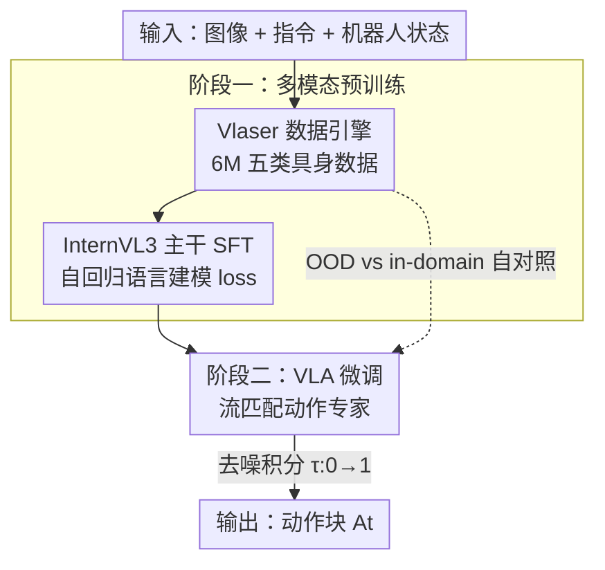

# Vlaser: Vision-Language-Action Model with Synergistic Embodied Reasoning

**会议**: ICLR 2026  
**OpenReview**: [https://openreview.net/forum?id=8xTDnj39Ti](https://openreview.net/forum?id=8xTDnj39Ti)  
**代码**: https://github.com/OpenGVLab/Vlaser/ (有)  
**领域**: 具身智能 / 机器人 / 多模态VLM  
**关键词**: 具身推理, 视觉-语言-动作模型, 数据引擎, 流匹配, 域偏移

## 一句话总结
本文构建了具身视觉-语言模型 Vlaser（基于 InternVL3，2B/8B 两档），用自建的 600 万规模 Vlaser-6M 数据集把"高层具身推理"与"底层机器人控制"拼到同一个底座里，并系统地回答了一个被长期忽略的问题——**到底哪类预训练数据对下游 VLA 策略学习最有用**，结论是"在线推理 benchmark 涨分不等于下游操作涨分，真正管用的是与机器人本体同观测域的 in-domain 数据"。

## 研究背景与动机
**领域现状**：具身智能社区有两条平行的研究线。一条是用视觉-语言模型（VLM）增强具身**推理**能力——grounding（定位物体）、planning（任务拆解）、spatial reasoning（空间理解）；另一条是把 VLM 扩成视觉-语言-动作模型（VLA），接上动作头做端到端机器人控制。两条线各自都很热闹，但中间是断的。

**现有痛点**：上游 VLM 推理和下游 VLA 策略学习之间存在一道"几乎没人正面研究"的鸿沟。大家默认"VLM 推理越强、当它的初始化拿去微调 VLA 就越好"，但这个假设从没被系统验证过。同时，到底哪一类多模态数据流（QA / grounding / spatial / planning）对下游控制最关键，也"poorly understood"。

**核心矛盾**：互联网规模的预训练数据和机器人专用的策略学习数据之间存在**域偏移（domain shift）**。在公开 benchmark 上测出来的推理能力，是在网络图片域里测的；而真正干活的机器人面对的是 WidowX、Google Robot 这种特定本体的观测域。在前者上涨分，不一定能迁移到后者的闭环成功率上。

**本文目标**：① 造一个推理能力足够强的具身 VLM 底座；② 在这个底座上系统拆解"VLM→VLA"的迁移，搞清楚哪类数据真正有用。

**切入角度**：与其盲目堆"看起来很难"的 OOD 推理数据，不如直接在机器人交互数据（如 Open X-Embodiment、仿真平台）上标注 **in-domain** 数据，让 VLM 在和下游同一个观测域里学推理。作者赌的是"观测域对齐"比"推理 benchmark 分数"更能决定下游表现。

**核心 idea**：用一个统一的数据引擎（Vlaser-6M）把具身推理与动作控制接到同一个 VLM 上，并通过严格的自对照消融证明——**消除观测域偏移的 in-domain 数据**，才是加速 VLA 收敛、提升成功率的关键，而非 OOD 推理 benchmark 上的高分。

## 方法详解

### 整体框架
Vlaser 由两个组件、两个训练阶段构成。组件上：一个标准的 VLM 主干（InternVL3，视觉端 InternViT + 语言端 Qwen2.5-1.5B/7B，对应 2B/8B 两档）负责感知与推理；一个**动作专家（action expert）**负责底层控制。训练上：阶段一是**多模态预训练**，用 Vlaser-6M 数据集做有监督微调（SFT），把 grounding/planning/spatial 等具身推理能力灌进 VLM；阶段二是**VLA 微调**，冻结/复用 VLM 主干、只额外训练动作专家，用流匹配（flow matching）从单帧观测里生成未来动作序列。

整条管线的关键不在于网络结构有多新（动作专家基本沿用 π0 的设计），而在于喂进去的数据——Vlaser 数据引擎把公开数据集系统地"整理、重组、标注"成五大类，其中专门切出一块"in-domain 仿真数据"，正是用来验证作者关于域偏移假设的实验抓手。

### 关键设计

**1. Vlaser 数据引擎：用五类具身数据系统性地"喂"出推理能力**

痛点是现有具身 VLM 的数据各自为政，难以同时覆盖 grounding、QA、空间、规划。本文不发明新标注，而是把互联网公开数据集系统地 curate/重组/标注成一个 600 万规模、五大模态的统一数据集 Vlaser-6M：① **具身 grounding（1.8M）**——bounding box 和中心点两种格式，坐标统一归一化到 $[0,1000]$ 做到分辨率无关，源自 RoboPoint、ShareRobot、Pixmo-Points 等，还从 SA-1B 的分割 mask 额外合成 30 万点/框标注以增强开放词汇泛化；② **通用 + 空间推理（1.2M RoboVQA + 0.5M 空间）**——聚合 RoboVQA、Robo2VLM 等，并从 ScanNet/ARKitScenes 等 3D 场景手标 10 万空间样本；③ **规划（0.4M）**——语言规划 + 多模态规划，含 Habitat 里基于 LLaRP 生成的规划轨迹、以及 EgoPlan-IT/EgoCOT 这类第一视角视频；④ **in-domain 仿真数据（2.0M）**——这是后面消融的灵魂，专门从 SimplerEnv（Google Robot + WidowX）和 RoboTwin（双臂 Aloha-AgileX）里生成与下游本体同观测域的 QA/grounding/spatial/planning 对。正是这种"既广又有同域锚点"的数据组织，让 Vlaser 在 12 个推理 benchmark 上全面刷分，也为验证域偏移假设备好了对照组。

**2. 流匹配动作专家：把底层控制接到 VLM 上，且与语言共享注意力**

痛点是绝大多数增强具身常识的 MLLM 并不会真正"动手"。Vlaser 沿用 π0 思路，给 VLM 加一个动作专家模块——它类似一个两元素的 MoE：原有参数处理图文输入，另一套独立权重专门处理机器人特有的（动作、状态）token，二者在语言模型里**共享自注意力**。机器人状态编码为 state token、加噪动作编码为 action token，一起送进动作专家，VLA 流采用非因果注意力。动作生成用流匹配：动作块 $A_t=[a_t,\dots,a_{t+H-1}]$，加噪得 $A^\tau_t=\tau A_t+(1-\tau)\epsilon$，网络 $v_\theta$ 去匹配去噪向量场 $u(A^\tau_t|A_t)=\epsilon-A_t$，训练目标为

$$\mathcal{L}_{vla}=\mathbb{E}_{p(A_t|o_t)}\left\|v_\theta(A^\tau_t,o_t)-u(A^\tau_t|A_t)\right\|^2$$

推理时从随机噪声 $A^0_t\sim\mathcal{N}(0,I)$ 出发，按 $A^{\tau+\delta}_t=A^\tau_t+\delta\, v_\theta(A^\tau_t,o_t)$ 积分。实验里取动作 horizon $H=4$、步长 $\delta=0.1$（即 10 步积分）以兼顾推理效率。这样底座既能"说"又能"做"，且控制头复用了 VLM 的多模态表征。

**3. 两阶段训练 + OOD/in-domain 自对照：把"哪类数据有用"做成可测的消融**

痛点是"VLM 推理强 → VLA 表现好"这个默认假设从没被证伪过。Vlaser 把训练拆成两阶段：阶段一用自回归语言建模 loss 做 VLM 预训练，

$$\mathcal{L}_{lm}=-\log p\big(t_N\mid F_v(x;\theta_v),\,F_t(y),\,t_{0:N-1};\Theta\big)$$

其中 $F_v$ 是 ViT+MLP、$F_t$ 是文本 tokenizer、$\Theta$ 是 LLM 参数；阶段二只训动作专家。真正的巧思在于把数据切成可对照的若干变体：**Vlaser-OOD** 只用 Vlaser-6M 里的"域外"推理数据（即 benchmark 那批），**Vlaser-QA / -Spatial / -Grounding** 分别只加一类 in-domain 仿真数据，**Vlaser-All** 三类全加。用同样的架构、同样的尺寸、只换初始化数据，就能干净地隔离出"是 OOD 推理涨分有用，还是 in-domain 观测域对齐有用"。这套设计让本文的核心结论（见实验）站得住脚，而不是又一个"我们的模型分更高"。

### 损失函数 / 训练策略
阶段一 VLM 预训练用语言建模损失 $\mathcal{L}_{lm}$（式见上）；阶段二 VLA 微调用流匹配损失 $\mathcal{L}_{vla}$，仅优化动作专家。推理超参：$H=4$，积分步长 $\delta=0.1$（10 步）。

## 实验关键数据

### 主实验

**具身推理 benchmark（12 个，归一化平均分 Avg）**：

| 模型 | 规模 | Avg | 关键亮点 |
|------|------|-----|----------|
| GPT-4o | 闭源 | 34.2 | 闭源大模型 |
| Gemini-2.5-Pro | 闭源 | 44.4 | 闭源最强 |
| InternVL3-2B（base） | 2B | 15.2 | Vlaser-2B 起点 |
| RoboBrain2.0-3B | 3B | 35.3 | 同档具身 SOTA |
| **Vlaser-2B** | 2B | **45.3** | 超过 Gemini-2.5-Pro |
| InternVL3-8B（base） | 8B | 22.3 | Vlaser-8B 起点 |
| RoboBrain2.0-7B | 7B | 37.0 | 同档具身 SOTA |
| **Vlaser-8B** | 8B | **51.3** | 比同档具身 SOTA 高约 +10% |

2B 从 15.2→45.3、8B 从 22.3→51.3，Vlaser-6M 把基座推理能力近乎"翻三倍/翻倍"，grounding 与仿真评测涨幅最猛。有趣的是 Vlaser-2B 在需要直接短答案的点定位任务上反超 8B，而 8B 在多步规划、闭环仿真这类吃 CoT 的复杂任务上更强。

**WidowX 闭环操作（SimplerEnv，平均成功率）**：

| 模型 | 规模 | Avg |
|------|------|-----|
| π0 | 3B | 54.9% |
| SpatialVLA | 4B | 42.7% |
| InternVL3-2B | 2B | 41.8% |
| Vlaser-OOD | 2B | 43.2% |
| Vlaser-QA | 2B | 62.6% |
| Vlaser-Grounding | 2B | 62.0% |
| **Vlaser-All** | 2B | **65.1%** |

Google Robot 任务上 Vlaser-All 2B 也拿到 Visual Matching 76.2% / Variant Aggregation 59.0%；RoboTwin 双臂 12 任务平均 67.5%（vs base InternVL3-2B 的 55.8%、RDT-1B 的 36.8%）。

### 消融实验

| 配置 | WidowX Avg | 说明 |
|------|-----------|------|
| InternVL3-2B（base） | 41.8% | 原始基座 |
| Vlaser-OOD | 43.2% | 只加 OOD 推理数据，几乎不涨 |
| Vlaser-QA | 62.6% | 加 in-domain QA |
| Vlaser-Spatial | 60.8% | 加 in-domain 空间 |
| Vlaser-Grounding | 62.0% | 加 in-domain grounding |
| Vlaser-All | 65.1% | 三类全加，最优 |

动作预测/执行长度与采样步数的敏感性（WidowX）：把 predict/execute length 从 4/4 砍到 4/2 会显著掉点（如 Vlaser-QA 从 62.6%→51.1%），而采样步数从 10 加到 20 收益甚微（62.6%→63.3%），印证了推理时用 10 步积分的选择。

### 关键发现
- **核心反直觉结论**：OOD 推理 benchmark 涨分 ≠ 下游控制涨分。Vlaser-OOD（推理分高）在 WidowX 上仅 43.2%，和 base 的 41.8% 几乎没差；而任意一类 in-domain 数据都能把成功率推到 60% 上下。**真正起作用的是消除视觉观测域偏移**，而非抽象推理能力。
- **in-domain 数据可叠加**：QA、grounding、spatial 三类各自都涨，全加（Vlaser-All）还能再涨，说明多样化的同域多模态预训练有正向叠加效应。
- **尺寸要按任务选**：短答案点定位小模型够用甚至更好，多步规划/闭环控制吃 CoT 的任务大模型更稳。

## 亮点与洞察
- **把"数据有没有用"做成可证伪的实验**：OOD vs in-domain 的自对照设计，干净地把"观测域对齐"从"推理能力强"里剥离出来，得到一个对整个具身社区有指导意义的负结论——别只盯着 benchmark 刷分。这种"诚实地证伪默认假设"比再多一个 SOTA 数字更有价值。
- **小模型反超大模型/闭源的现象**：Vlaser-2B（45.3）在具身推理平均分上超过 Gemini-2.5-Pro（44.4），说明在具身这个垂直域里，对症的数据工程比单纯堆参数更划算。
- **可迁移的思路**：任何"上游预训练→下游微调"的迁移任务，都值得问一句"我涨的那个上游指标，和下游真正在意的观测域对得上吗"。这个"观测域对齐 > 抽象能力分数"的视角可以直接搬到导航、自动驾驶等其他具身子领域。

## 局限与展望
- 作者坦言核心矛盾仍未根治——基础模型和真实机器人本体之间的域差距亟需缩小，当前只是用 in-domain 仿真数据"绕过"而非"消除"了它；如何让公开推理 benchmark 真正反映闭环真机表现，仍是开放问题。
- 闭环评测主要在 SimplerEnv/RoboTwin 仿真上做（号称 real-to-sim 相关性强），但论文正文没有大规模真机闭环数字，sim-to-real 的最后一公里仍需更多验证。
- 动作专家基本沿用 π0 设计，方法论创新集中在数据引擎与实验洞察侧；网络结构本身的贡献有限。
- in-domain 数据靠仿真平台生成，覆盖的本体（WidowX/Google Robot/Aloha-AgileX）仍有限，换全新本体时是否还需重新造同域数据，文中未充分讨论。

## 相关工作与启发
- **vs π0 / OpenVLA / SpatialVLA**：它们聚焦于"怎么把 VLM 接成更强的 VLA 控制器"，Vlaser 复用了 π0 的流匹配动作专家，但把研究重心从"控制头怎么设计"转到"上游喂什么数据最有用"，并给出 in-domain > OOD 的明确结论。
- **vs RoboBrain2.0 / Embodied-R1**：同为具身专用 VLM，它们主打推理 benchmark 上的高分，Vlaser 不仅在同档把它们整体超出约 +10%，更进一步指出"这些 benchmark 分数和闭环控制不正相关"，等于对这类工作的评测范式提出了质疑。
- **vs 用 web 数据 co-training 的 VLA（如 π0、Driess et al.）**：它们证明了 web 数据有助泛化，但没说清"哪种数据流最关键"；Vlaser 的自对照消融正好补上这块拼图，给出"同观测域 in-domain 数据"这个更具操作性的答案。

## 评分
- 新颖性: ⭐⭐⭐⭐ 方法结构沿用现有 VLA 范式，但"in-domain > OOD"的系统性证伪洞察和大规模数据引擎是实打实的新贡献。
- 实验充分度: ⭐⭐⭐⭐⭐ 12 个推理 benchmark + 三个仿真平台（WidowX/Google Robot/RoboTwin）+ 细致的 OOD/in-domain 自对照与超参消融，证据链完整。
- 写作质量: ⭐⭐⭐⭐ 动机与结论清晰，核心反直觉发现表达到位；个别处英文表述略粗糙。
- 价值: ⭐⭐⭐⭐⭐ 开源模型+6M 数据集+训练评测代码全放出，且给社区一个可指导数据构建的负结论，实用价值高。

<!-- RELATED:START -->

## 相关论文

- [\[ICLR 2026\] On Robustness of Vision-Language-Action Model against Multi-Modal Perturbations](on_robustness_of_vision-language-action_model_against_multi-modal_perturbations.md)
- [\[ICLR 2026\] PixelVLA: Advancing Pixel-level Understanding in Vision-Language-Action Model](pixelvla_advancing_pixel-level_understanding_in_vision-language-action_model.md)
- [\[ICLR 2026\] Vision-Language-Action Instruction Tuning: From Understanding to Manipulation](vision-language-action_instruction_tuning_from_understanding_to_manipulation.md)
- [\[ICLR 2026\] UniVLA: Unified Vision-Language-Action Model](unified_vision-language-action_model.md)
- [\[CVPR 2026\] SemanticVLA: Towards Semantic Reasoning over Action Memorization via Synergistic Explicit Trace and Latent Action Planning](../../CVPR2026/robotics/semanticvla_towards_semantic_reasoning_over_action_memorization_via_synergistic_.md)

<!-- RELATED:END -->
