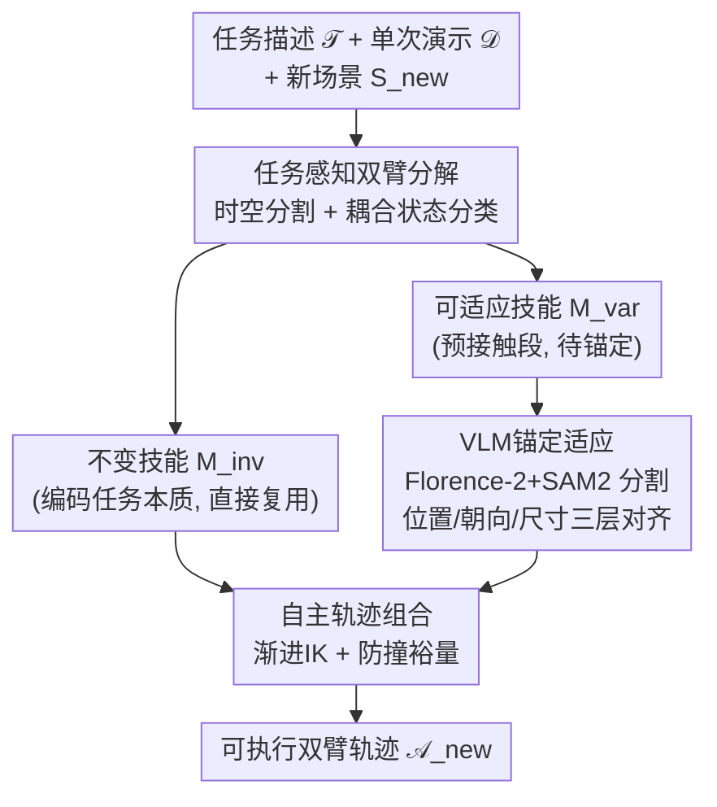

# VLBiMan: Vision-Language Anchored One-Shot Demonstration Enables Generalizable Bimanual Robotic Manipulation

**会议**: ICLR 2026  
**arXiv**: [2509.21723](https://arxiv.org/abs/2509.21723)  
**代码**: [项目页面](https://hnuzhy.github.io/projects/VLBiMan)  
**领域**: 机器人操作/双臂操作  
**关键词**: 双臂操作, 单次演示, VLM锚定, 技能分解, 跨具身迁移

## 一句话总结

提出VLBiMan框架，通过任务感知双臂分解将单次演示拆分为不变/可适应原子技能，利用VLM视觉-语言锚定在新场景中适应物体位置和实例变化，结合运动学感知的轨迹组合实现双臂协调——在10个复杂双臂任务上以1次演示达到85.3%成功率远超需上百次演示的模仿学习基线。

## 研究背景与动机

**领域现状**：双臂机器人操作是具身智能的核心挑战。当前主流方案VLA模型（ALOHA、π0、RDT-1B）通过大规模遥操作演示训练"端到端"策略，在长程任务上展现了impressive性能。

**现有痛点**：
- VLA模型需要数百/数千次遥操作演示→双臂遥操作比单臂更困难（14维动作空间），数据收集代价极高
- 适配新物体或新任务通常需要重新收集演示+重新训练→不可扩展到开放世界
- 零样本方法（如ReKep）依赖LLM做任务分解和prompt engineering→脆弱且不可靠
- 单次模仿学习已有单臂探索→但双臂的同步/异步协调复杂度更高

**核心矛盾**：要用最少的演示实现最广泛的泛化——需要找到操作任务中"什么是不变的"和"什么是需要适应的"→而双臂任务的协调约束使这种分离更难。

**本文目标**：如何从单次人类演示中提取可复用的双臂操作技能，并在新场景（新位置、新物体实例、新机器人平台）中泛化？

**切入角度**：**"What matters more than How"**——不模仿执行的精确姿态，而是捕捉和重现物体间的相对空间关系。例如倒水任务中，关键是杯子和瓶子的相对位置而非手臂的具体运动。

**核心 idea**：将演示分解为"不变子技能"（可直接复用）和"可适应子技能"（VLM锚定后重新合成），实现1次演示→N次泛化。

## 方法详解

### 整体框架

给定任务描述 $\mathcal{T}$ 和单次演示 $\mathcal{D} = \{(\mathcal{O}_t, \mathcal{A}_t)\}_{t=1}^T$，VLBiMan要学的是映射 $\mathcal{F}_{\text{VLBiMan}}: (\mathcal{T}, \mathcal{D}, \mathcal{S}_{\text{new}}) \mapsto \{\widetilde{\mathcal{A}}_t^{\text{new}}\}_{t=1}^{T'}$，把这条演示迁移到新场景 $\mathcal{S}_{\text{new}}$ 上重新生成双臂轨迹。整个流程分三步走：先做**任务感知双臂分解**，把演示切成"不变"与"可适应"两类原子技能；再做**VLM锚定适应**，用视觉-语言模型在新场景里分割并定位物体，几何对齐那些可适应技能；最后做**自主轨迹组合**，用运动学求解把两类技能拼成一条可执行的双臂轨迹。三步对应论文的三个核心组件，下面逐个展开。

### 关键设计

**1. 任务感知双臂分解：把"任务本质"和"场景依赖"拆开**

单次演示之所以难泛化，是因为它把"怎样稳定倒水"这类与场景无关的本质动作，和"手伸到瓶子那个位置"这类完全依赖布局的动作混在一条轨迹里。VLBiMan先做时空分割：根据运动动态（速度不连续、加速度尖峰）和夹爪开/关的状态切换检测关键姿态，把演示切成时间段 $\tau_i = [t_i, t_{i+1}]$，每段对应一个运动原语 $\mathcal{M}_i$。再用物体-机器人耦合状态给每段分类——定义绑定指示器 $\text{bind}(o, r, t)$，若整段都满足 $\forall t \in \tau_i, \text{bind}(o_k, r, t) = 1$ 且 $\text{geometry}(o_k) \approx \text{geometry}(o_k^{\text{demo}})$（物体被稳固抓住、几何与演示一致），就标为**不变技能** $\mathcal{M}_i^{\text{inv}}$，可直接复用；否则是预接触阶段的**可适应技能** $\mathcal{M}_j^{\text{var}}$，要随新物体位置调整。演示由此分解为 $\mathcal{D} \Rightarrow \{\mathcal{M}_i^{\text{inv}}\}_{i=1}^{N_{\text{inv}}} \cup \{\mathcal{M}_j^{\text{var}}\}_{j=1}^{N_{\text{var}}}$。这样大部分编码任务本质的不变技能原封不动复用，需要适应的只剩几段依赖几何信息的预接触动作，泛化的难度被压到最小。

**2. VLM锚定适应：让VLM做擅长的分割定位，而不是不可靠的任务规划**

适应可适应技能的前提是定位新场景中的物体，但CAD模型和6D位姿估计既笨重又脆弱。VLBiMan改用VLM从任务描述 $\mathcal{T}$ 提取物体类别提示词，喂给 Florence-2 + SAM2 直接拿到高质量2D语义掩码 $\mathbf{M}_k^{\text{2D}}$，不依赖任何模型先验。拿到掩码后做三层几何对齐：位置上计算新旧代表点（掩码质心或平面接触点）的3D位移 $\Delta\mathbf{x} = \mathbf{p}^{\text{new}} - \mathbf{p}^{\text{demo}}$；朝向上对笔、勺子这类方向敏感物体，从2D掩码的二阶图像矩提取主轴，算相对旋转 $\Delta\theta = \angle(\mathbf{v}^{\text{new}}, \mathbf{v}^{\text{demo}})$；尺寸上对不同大小的同类物体，用点云的z-extent估计高度差 $\Delta h_k$ 来校正垂直放置动作。这里的关键取舍是只让VLM做"锚定"（分割+定位）而不做"规划"（任务分解）——VLM的分割能力已经对光照和干扰足够鲁棒，而把任务分解交给LLM prompt仍然脆弱，能力和角色的匹配才让这一环稳定。

**3. 自主轨迹组合：在拼接处补上运动学可行性和防撞裕量**

不变技能和适应后的可适应技能拼起来时，预接触段的目标姿态变了，直接套用可能无解或撞到物体。VLBiMan对初始抓握运动做渐进IK优化：用样条插值把目标姿态从起点逐步推到终点，逐帧求逆运动学 $\mathbf{q}^{(n+1)} = \text{IK}(\mathbf{T}_g^{(n)})$，其中 $\mathbf{T}_g^{(n)} = \text{SplineInterp}(\mathbf{T}_{\text{start}}, \mathbf{T}_{\text{goal}}, n)$，避免一步跳到目标导致IK失败。同时在抓取逼近阶段沿基座方向和垂直方向加安全裕量 $\tilde{\mathbf{x}}^{\text{goal}} = \mathbf{x}^{\text{goal}} + \delta_{\text{base}}\mathbf{u}_\| + \delta_z\mathbf{u}_z$，确保新布局下不会提前碰撞。组合后的轨迹再经一次物理回放验证才执行。

## 实验关键数据

### 主实验：6个基本双臂任务成功率（25次试验/任务）

| 方法 | plugpen | inserting | unscrew | pouring | pressing | reorient | 平均(同物体) | 平均(新实例) |
|------|:---:|:---:|:---:|:---:|:---:|:---:|:---:|:---:|
| Mechanisms | 11/25 | 9/25 | 5/25 | 5/25 | 7/25 | 3/25 | 26.7% | 12.7% |
| MAGIC | 16/25 | 15/25 | 10/25 | 10/25 | 9/25 | 7/25 | 44.7% | 27.3% |
| ReKep | 14/25 | 11/25 | 10/25 | 12/25 | 10/25 | 8/25 | 43.3% | 29.3% |
| ReKep+ | 19/25 | 18/25 | 13/25 | 17/25 | 17/25 | 11/25 | 63.3% | 42.7% |
| **VLBiMan** | **25/25** | **23/25** | **20/25** | **21/25** | **20/25** | **19/25** | **85.3%** | **78.0%** |

### 消融实验（新实例+干扰条件下的平均成功率）

| VLMs类型 | 初始抓握 | IK优化 | 碰撞避免 | 平均SR |
|------|:---:|:---:|:---:|:---:|
| SAM+DINOv2 | ours | ✓ | ✓ | 35.8% |
| ours | AnyGrasp | ✓ | ✓ | 31.7% |
| ours | ours | ✗ | ✓ | 29.2% |
| ours | ours | ✓ | ✗ | 34.2% |
| **ours** | **ours** | **✓** | **✓** | **59.2%** |

### 长程任务：4个多阶段任务（无干扰）

| 方法 | reorient+unscrew | unscrew+pouring | tool-use scoop | tool-use funnel | 平均(同) | 平均(新) |
|------|:---:|:---:|:---:|:---:|:---:|:---:|
| ReKep+ | 11/25 | 10/25 | 7/25 | 6/25 | 34.0% | 19.0% |
| **VLBiMan** | **15/25** | **15/25** | **12/25** | **10/25** | **52.0%** | **41.0%** |

### 关键发现

- VLBiMan以1次演示达到85.3%成功率→远超需要50-100+次演示的模仿学习方法
- plugpen任务达到25/25完美成功率→不变/可适应分离+VLM锚定在精细协调任务上极为有效
- 新实例泛化（78.0%）仅比同物体（85.3%）低7.3个百分点→VLM锚定的类别级适应能力强
- ReKep+（注入oracle初始抓握）达63.3%但仍大幅落后→VLBiMan的优势不仅在感知端还在技能复用策略上
- 跨具身体迁移到类人双臂机器人成功→技能表示足够抽象，不绑定特定硬件

## 亮点与洞察

- **"1次 vs 100次+"的效率革命**：数据需求降低100x→对双臂操作尤其重要（双臂遥操作难度和成本是单臂的2-3倍）
- **VLM作为"锚定"而非"规划"的角色设计**：让VLM做分割和定位（它擅长的）→不让VLM做任务分解和规划（它不可靠的）→正确的能力-角色匹配
- **不变/可适应的通用分离原则**：这种分离不限于双臂→可推广到任何操作任务→启发通用技能复用框架
- **"What > How"的操作哲学**：抓住任务本质（物体间相对关系）而非表面（精确轨迹）→低维本质使1次演示足够

## 局限与展望

- 仅处理刚性物体→可变形物体（布料、绳索）需要完全不同的表示和控制方式
- 缺乏运行时异常检测和恢复机制→对滑移或遮挡敏感
- 固定基座双臂平台限制了可达空间→无力/触觉传感→未来可扩展到移动基座+力触觉
- 技能分解和锚点选择仍需human-in-the-loop→距离全自动系统还有距离

## 相关工作与启发

- **vs ALOHA/π0 (端到端VLA)**：需要大量演示+重训练→VLBiMan仅需1次+无重训→效率差距>100x，但VLA在极端多样性场景中可能更鲁棒
- **vs ReKep (零样本)**：不需要演示但依赖LLM prompt+VFM关键点→脆弱不稳定；VLBiMan用1次演示获得任务结构→比零样本更可靠
- **vs Mechanisms/MAGIC (单臂one-shot)**：直接适配到双臂效果差（26.7%/44.7%）→双臂协调是独特挑战，需要专门的分解和同步机制
- **启发**：可否将VLBiMan的分解-适应-组合pipeline与VLA的泛化能力结合→用少量演示做结构化初始化，再用数据驱动微调补充泛化？

## 评分

⭐⭐⭐⭐⭐ (5/5)

综合评价：1次演示达85.3%→在双臂操作效率和泛化性之间取得了突破性平衡，不变/可适应分离的设计原则具有方法论层面的启发价值，10个真机任务+跨具身体验证了实用性——是双臂操作领域的标杆工作。

<!-- RELATED:START -->

## 相关论文

- [\[ICLR 2026\] TwinVLA: Data-Efficient Bimanual Manipulation with Twin Single-Arm Vision-Language-Action Models](twinvla_data-efficient_bimanual_manipulation_with_twin_single-arm_vision-languag.md)
- [\[AAAI 2026\] ManiLong-Shot: Interaction-Aware One-Shot Imitation Learning for Long-Horizon Manipulation](../../AAAI2026/robotics/manilong-shot_interaction-aware_one-shot_imitation_learning_for_long-horizon_man.md)
- [\[ICLR 2026\] One Demo Is All It Takes: Planning Domain Derivation with LLMs from A Single Demonstration](one_demo_is_all_it_takes_planning_domain_derivation_with_llms_from_a_single_demo.md)
- [\[ICLR 2026\] MemoryVLA: Perceptual-Cognitive Memory in Vision-Language-Action Models for Robotic Manipulation](memoryvla_perceptual-cognitive_memory_in_vision-language-action_models_for_robot.md)
- [\[ICLR 2026\] VITA: Zero-Shot Value Functions via Test-Time Adaptation of Vision–Language Models](vita_zero-shot_value_functions_via_test-time_adaptation_of_visionlanguage_models.md)

<!-- RELATED:END -->
