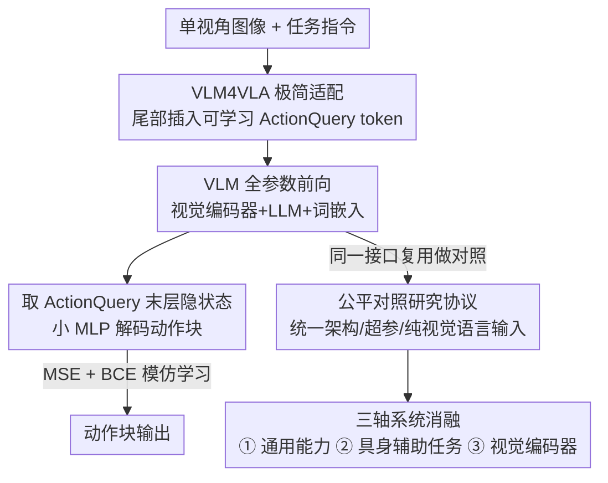

# VLM4VLA: Revisiting Vision-Language-Models in Vision-Language-Action Models

**会议**: ICLR 2026  
**OpenReview**: [https://openreview.net/forum?id=tc2UsBeODW](https://openreview.net/forum?id=tc2UsBeODW)  
**项目页**: [https://cladernyjorn.github.io/VLM4VLA.github.io](https://cladernyjorn.github.io/VLM4VLA.github.io)  
**领域**: 机器人 / 具身智能 / 多模态VLM  
**关键词**: VLA、VLM 主干、具身控制、视觉编码器、实证研究

## 一句话总结
本文搭了一个只加 <1% 参数的极简适配 pipeline（VLM4VLA），把 17 个通用 VLM 公平地转成 VLA 策略，系统研究"VLM 强不强是否决定 VLA 好不好"，结论是：VLM 预训练是必要前提，但通用能力、甚至具身专项能力都难以预测下游控制表现，真正的瓶颈在视觉编码器。

## 研究背景与动机
**领域现状**：VLA（Vision-Language-Action）模型把预训练的大型 VLM 当策略主干，借其视觉-语言知识来提升机器人策略的泛化能力，已成为具身智能的主流路线。代表工作如 RT-2、OpenVLA 把动作离散成 language token，后续工作转向用 policy head 解码连续动作，逐渐演化成"VLM + 动作专家"的层级结构。

**现有痛点**：绝大多数 VLA 工作都在卷更复杂的策略网络（更高级的架构、额外训练范式、更精巧的动作解码），却几乎没人系统回答一个最根本的问题——**底层 VLM 的选择和具体能力，到底如何影响 VLA 策略的表现？** 唯一沾边的 RoboVLMs 比较过几个早期 VLM 主干，但各自实现不一致，无法做公平比较。

**核心矛盾**：社区默认"VLM 越强、VLA 越好"，并据此不断给 VLM 灌具身任务、堆视觉能力。但这个假设从没被干净地验证过——因为不同 VLA 工作的策略头、训练范式、输入模态全都不一样，VLM 主干的贡献被各种无关变量污染了，根本分不清提升来自更好的 VLM 还是更花哨的策略设计。

**本文目标**：建立一个把"VLM 主干"这一变量隔离出来的公平测试接口，然后沿三个维度回答：通用能力、具身专项能力、视觉编码器，各自如何转化为下游控制表现。

**切入角度**：作者认为唯有把策略头做到"最简且统一"，并剥掉本体感觉（proprioception）等会让模型绕过 VLM 直接学动作的捷径，才能纯粹测出 VLM 的内在能力。于是反其道而行——不卷策略网络，而是卷"最不干扰 VLM 的适配方式"。

**核心 idea**：用一个仅引入 <1% 新参数、MLP 解码、MSE 监督的极简适配 pipeline（VLM4VLA）作为统一接口，在三个 benchmark 上对照 17 个 VLM，把"VLM 能力 → VLA 表现"的映射关系实证地测一遍。

## 方法详解

### 整体框架
本文的"方法"由两部分组成：一个**极简适配网络**（把任意 VLM 变成 VLA）和一套**三轴对照研究协议**（用这个网络做公平消融）。网络侧的做法极其克制：在 VLM 的输入序列尾部插入一个可学习的 `<ActionQuery>` token，让 VLM 正常前向，取该 token 的末层隐状态，再用一个小 MLP 解码成动作块（action chunk），全程只新增 <1% 可训练参数。整个 VLM（视觉编码器 + LLM + 词嵌入）连同 MLP 一起全参数微调，训练用最大似然模仿学习（MSE + BCE），刻意避开扩散/流匹配损失。

有了这个统一接口，研究侧就沿三条轴线做对照：① 换不同 VLM 主干测通用能力；② 给同一 VLM（Qwen2.5-VL）灌不同具身辅助任务后再转 VLA；③ 冻结 vs 微调视觉编码器。再加一条 from-scratch 随机初始化下界。

### 关键设计

**1. VLM4VLA 极简适配 pipeline：用 <1% 新参数把任意 VLM 变成 VLA，且不引入额外干扰变量**

要公平比较 VLM 主干，就必须让"策略头"这一部分尽量不贡献能力。作者的做法是只新增一个可学习的 `<ActionQuery>` token 和一个小 MLP head。输入序列按各 VLM 原生指令格式拼成 `[...<text>...<text><ActionQuery>]`，VLM 前向后取 `<ActionQuery>` 的末层隐状态，MLP 解码成动作块：

$$\text{action} = \text{MLP}\big(\text{VLM}([\langle img\rangle\ldots\langle text\rangle\ldots\langle ActionQuery\rangle])\big)$$

关键在于刻意**避开扩散损失和流匹配损失**：作者的初步实验发现这两类损失在推理时引入显著随机性，需要更多 rollout 才能准确评估，且训练后期不同 checkpoint 间性能波动大，不利于公平比较。于是改用最大似然模仿学习——末端执行器的相对位置 $a_{pos}$ 用 MSE 优化、离散开合状态 $a_{end}$ 用 BCE 优化：

$$L = \frac{1}{|B|}\sum_B \big(\lVert a_{pos}-\hat a_{pos}\rVert_2^2 + \text{BCE}(a_{end},\hat a_{end})\big)$$

尽管简单，VLM4VLA 在 Calvin 等 benchmark 上竟能与 pi0 的流匹配动作专家这类复杂设计打成平手，说明它确实是个干净又够强的测试底座。

**2. 隔离 VLM 内在能力的公平协议：统一架构、统一超参、纯视觉语言输入**

光有极简网络还不够，对照实验本身必须可复现。作者对全部 17 个 VLM 用**完全一致**的模型配置与训练/测试设置：统一把图像标准化到 $224\times224$、只用单视角当前帧、**不输入本体感觉状态**（避免模型绕过 VLM 直接从 state 学动作）、做学习率扫描后选一组统一超参保证所有模型收敛。这样一来，下游表现的差异就只能归因于 VLM 主干本身，而非策略头或额外模态。这条协议是整篇研究结论可信的前提——也是它区别于 RoboVLMs 等"实现各异、无法横比"工作的核心。

**3. 三轴对照研究设计：通用能力 / 具身辅助任务 / 视觉编码器，外加 from-scratch 下界**

在统一接口之上，作者把"VLM 能力如何转化为控制力"拆成三条可独立操纵的轴。**通用能力轴**：选 7 个开源 VLM（Paligemma 系列、QwenVL 系列、InternVL3.5、Kosmos-2，1B–10B），直接转 VLA 测通用 VQA 能力与控制表现的相关性。**具身辅助任务轴**：固定 Qwen2.5-VL 主干，先用 7 类具身 SFT 任务（Robopoint 指点、Vica-332k 空间理解、Robo2vlm 动作 VQA、Robobrain2、Omni-Generation 深度/分割生成、VQA-Mix 等）微调，再转 VLA，看专项能力提升能否传导到控制。**视觉编码器轴**：对三个 VLM 比较冻结 vs 微调视觉编码器。最后用随机初始化 from-scratch 作下界，确认泛化究竟来自架构还是 VLM 预训练。三条轴共用同一个 VLM4VLA 接口，结论才能彼此对照、形成完整图景。

### 损失函数 / 训练策略
训练目标即设计 1 中的 $L = \text{MSE}(a_{pos}) + \text{BCE}(a_{end})$ 模仿学习损失。所有参数（视觉编码器、词嵌入、LLM、MLP head）全部参与微调——作者明确指出冻结任何部分都会带来显著性能退化。各环境分别训练：Calvin ABC-D 训 30k 步，SimplerEnv-Bridge 与 Libero-Long 各训 50k 步。测试时分别尝试执行完整动作块、半块、单步，报告最优结果。

## 实验关键数据

### 主实验
在 Calvin ABC-D（报告平均完成任务数，满分 5）上，QwenVL/InternVL 系列明显领先，Qwen2.5VL-7B 达 4.057，逼近 SOTA 专家 VLA；而基于 Paligemma-1 的 pi0 表现和裸 Paligemma-1 几乎一样，说明其动作专家被 VLM 主干能力卡住、没带来增益。

| 模型（VLM 主干） | 参数量 | Calvin ABC-D↑ | Simpler-Bridge↑ | Libero-10↑ |
|------|------|------|------|------|
| OpenVLA*（Llama-2，离散动作） | 7.7B | 2.548 | 4.2 | 53.7 |
| pi0*（Paligemma-1，流匹配） | 3.1B | 3.509 | 60.4 | 46.0 |
| Qwen2.5VL-7B（VLM4VLA） | 8.3B | **4.057** | 46.9 | 45.0 |
| InternVL3.5-4B（VLM4VLA） | 4.7B | 3.977 | 57.3 | 62.8 |
| Paligemma-2（VLM4VLA） | 3.0B | 3.406 | 57.3 | 46.2 |
| **KosMos-2**（VLM4VLA，最小） | 1.7B | 3.096 | **60.4** | 55.0 |

> 反直觉点：**最小的 KosMos-2 在 Simpler-Bridge 上拿了最高成功率（60.4）**，在 Libero-10 上也优于多数大模型。线性回归显示，VLM 的通用 VQA 能力只在 Calvin 上与 VLA 表现高相关，在 Simpler/Libero 上几乎不相关——通用能力是控制表现的差预测器。

### 消融实验
**视觉编码器冻结**（设计 3 视觉轴）的影响最为剧烈，是全文最强信号：

| 配置 | Calvin ABC-D↑ | Simpler-Bridge↑ |
|------|------|------|
| Qwen2.5VL-3B（全微调） | 3.856 | 48.00 |
| + 冻结视觉编码器 | 2.855 (**-1.001**) | 23.95 (**-24.05**) |
| Qwen2.5VL-7B（全微调） | 4.057 | 46.75 |
| + 冻结视觉编码器 | 2.823 (**-1.234**) | 25.50 (-21.25) |
| Paligemma-1（全微调） | 3.506 | 55.25 |
| + 冻结视觉编码器 | 0.495 (**-3.011**) | 13.25 (**-42.00**) |

> 注意：冻结视觉编码器后的 Qwen2.5VL-7B（可训 7.6B）不仅远逊于全微调版本，甚至明显输给全微调的 Qwen2.5VL-3B（3.8B）——说明微调视觉模块比单纯堆 LLM 参数更关键。

**from-scratch 下界**（设计 3）证实预训练不可或缺：Qwen2.5VL-3B 从零训只剩 Calvin 1.381（-2.475）、Simpler 15.75（-32.25）；Paligemma-1 从零训 Simpler 仅 14.50（-40.75）。

**具身辅助任务**（设计 3 中间轴）则几乎全军覆没：7 类 SFT 任务微调后的 VLM 转 VLA，**整体都不如原始 baseline**，多数轻微退化且方差明显增大。Qwen2.5VL-3B 上 Vica-332k 相对最好（数据覆盖广、不易过拟合单一能力），Qwen2.5VL-7B 上 VQA-Mix 退化最小（接近 baseline，说明通用 VQA 数据在具身微调中很关键）；而 Omni-Generation（深度/分割生成）和 Robobrain2 都没带来好处。

### 关键发现
- **视觉编码器是头号瓶颈**：冻结它会让性能断崖式下跌（Paligemma-1 Simpler 直接掉 42 个点），其影响大于在 LLM 端增加可训参数。作者推测 VLM 预训练的视觉编码器与具身场景的视觉域没对齐。
- **通用能力是差预测器**：Kosmos-2（最小）多场景反超 Qwen-2.5VL/Paligemma，VQA 强 ≠ 控制强。标准 VLM 能力对有效具身控制是"必要但不充分"。
- **具身专项微调不传导**：刻意提升 VLM 的指点、空间理解、深度估计等具身技能，并不保证下游控制变好，反而常增大方差——这直接挑战了"给 VLM 灌具身任务就能造更好 VLA 主干"的社区共识。

## 亮点与洞察
- **"做减法"的实验哲学**：与其卷更复杂的策略头，作者反向把策略头压到 <1% 参数、剥掉本体感觉，才得到一个能干净隔离 VLM 变量的测试接口。这种"为了公平而极简"的思路本身就值得借鉴。
- **三个反直觉结论环环相扣**：通用能力不预测 → 具身专项也不传导 → 真正瓶颈是视觉编码器。三条轴线指向同一个判断：当前 VLM 预训练目标和具身动作规划的需求之间存在持续的域鸿沟。
- **可迁移 trick**：用一个可学习 query token 抽取主干知识 + 小 MLP 解码，是把任意预训练大模型快速适配到新任务（且不污染主干能力对照）的轻量范式，可用于其他"想公平比较不同主干"的研究。
- **对视觉编码器注入控制相关监督**即便后续冻结也能带来一致收益（摘要提及），把瓶颈精准定位到了视觉端的域适配。

## 局限与展望
- **没有真机实验**（作者承认）：出于可复现性、测试效率与公平性考虑，全程仿真（Calvin/SimplerEnv/Libero），结论能否迁移到物理机器人未验证，也导致他人无法在真机上直接对标本文。
- **策略头极简的双刃剑**：MLP + 单视角 + 无本体感觉虽利于公平比较，但也意味着这些结论是在"刻意削弱策略侧"的设定下得到的；在更强策略头或多视角/多模态下，VLM 能力与控制表现的关系是否改变，仍未知。
- **机制未解释**：作者明说"驱动这道鸿沟的机制仍是开放问题"——只定位了视觉编码器是瓶颈，但没给出该如何改造 VLM 预训练目标的方案。
- **改进思路**：把控制相关监督直接注入视觉编码器的预训练（而非下游微调），或设计面向具身动作规划的视觉预训练目标，是本文指向的明确方向。

## 相关工作与启发
- **vs RoboVLMs**: 同样想比较 VLM 主干对 VLA 的影响，但 RoboVLMs 各实现不一致、无法横比；本文用统一极简接口 + 统一超参把这件事做公平，结论才可信。
- **vs pi0 / OpenVLA 等专家 VLA**: 它们卷流匹配动作专家或离散动作解码，本文证明极简 MLP head 就能打平 pi0，说明很多策略侧的复杂度被 VLM 主干能力上限卡住、增益有限。
- **vs Robobrain2 / Robo2vlm 等具身 VQA 路线**: 这些工作假设"给 VLM 灌具身任务→更好的 VLA 主干"，本文实证发现这条传导链在端到端控制上并不成立，给该方向泼了一盆冷水。

## 评分
- 新颖性: ⭐⭐⭐⭐ 不是新方法而是新视角，但把"VLM→VLA"这个被忽视的根本问题首次干净地系统化测量。
- 实验充分度: ⭐⭐⭐⭐⭐ 17 个 VLM × 3 benchmark × 三轴消融 + from-scratch 下界，覆盖全面、对照严谨。
- 写作质量: ⭐⭐⭐⭐ 问题动机清晰、结论反直觉且层层递进；图表略多但主线明确。
- 价值: ⭐⭐⭐⭐⭐ 精准定位视觉编码器瓶颈并挑战"VLM 越强 VLA 越好"的共识，对整个 VLA 社区有方向性指导。

<!-- RELATED:START -->

## 相关论文

- [\[ICLR 2026\] Verifier-Free Test-Time Sampling for Vision-Language-Action Models](verifier-free_test-time_sampling_for_vision-language-action_models.md)
- [\[ICLR 2026\] WMPO: World Model-based Policy Optimization for Vision-Language-Action Models](wmpo_world_model-based_policy_optimization_for_vision-language-action_models.md)
- [\[ICLR 2026\] Hybrid Training for Vision-Language-Action Models](hybrid_training_for_vision-language-action_models.md)
- [\[ICLR 2026\] MemoryVLA: Perceptual-Cognitive Memory in Vision-Language-Action Models for Robotic Manipulation](memoryvla_perceptual-cognitive_memory_in_vision-language-action_models_for_robot.md)
- [\[ICLR 2026\] TwinVLA: Data-Efficient Bimanual Manipulation with Twin Single-Arm Vision-Language-Action Models](twinvla_data-efficient_bimanual_manipulation_with_twin_single-arm_vision-languag.md)

<!-- RELATED:END -->
