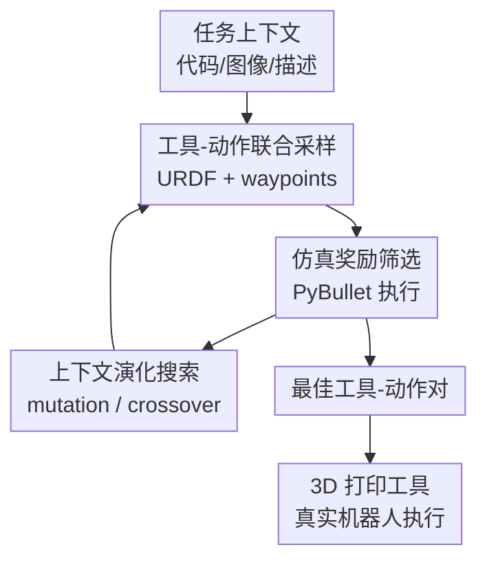

# VLMgineer: Vision-Language Models as Robotic Toolsmiths

**会议**: ICLR 2026  
**OpenReview**: [https://openreview.net/forum?id=nESyz4PvJL](https://openreview.net/forum?id=nESyz4PvJL)  
**论文**: [Project Website](https://vlmgineer.github.io/)  
**代码**: 将发布  
**领域**: 机器人 / VLM 工具设计  
**关键词**: 机器人工具设计、VLM、演化搜索、工具-动作共设计、sim-to-real  

## 一句话总结
VLMgineer 把 VLM 的视觉-语言理解、代码生成和常识先验放进演化搜索循环中，自动为机器人任务共同设计 URDF 工具和离散动作轨迹，在 12 个工具使用任务、演化消融和真实 Franka 机器人验证中都显示出比人类提示、普通采样和现成工具更强的任务完成能力。

## 研究背景与动机
**领域现状**：机器人工具使用研究通常默认工具已经存在，重点放在学习抓取、轨迹、动力学模型或 affordance 上；另一类形态-控制协同优化会设计 gripper、末端执行器或软体机器人形态，但往往需要人工先定义参数化设计空间、任务模板或可优化的几何变量。

**现有痛点**：这两条路线都把“工具长什么样”这件事限制得很死。工具使用方法如果只会在环境里选现有工具，就无法处理“没有合适工具”的任务；形态优化方法如果要人先写好参数化模板，就很难迁移到新的日常场景。更具体地说，机器人面对远处杯糕、桌面散落小球、柜架高处物体这类任务时，难点不一定在高精度控制，而在于有没有一个能把物理交互变简单的工具。

**核心矛盾**：工具几何和动作策略是耦合的。一个弯曲推杆可以让冰球只需沿单轴轻推，一个带侧挡板的铲斗可以让小球不再四散；反过来，如果工具只是普通直杆，控制策略就必须更细、更准、更脆弱。已有工作常把工具设计和动作优化拆开做，或者只优化人工给定模板里的少数参数，难以在开放形状空间里找到这种“用几何替控制省力”的方案。

**本文目标**：作者想验证一个更激进的问题：现有 VLM 是否已经拥有足够的物理常识、视觉理解、代码生成和创造性，能够从环境代码、环境图像和任务描述出发，自动发明机器人可用的工具，并同时给出使用该工具的动作序列。

**切入角度**：VLM 不是直接被当成一次性设计器，而是被放进类似遗传算法的循环里。初始种群由 VLM 生成，候选工具-动作对在 PyBullet 中按任务 reward 评估，表现好的设计再作为上下文，让 VLM 做 mutation 和 crossover。这样既保留 VLM 的开放式生成能力，又用物理仿真 reward 把想象力拉回任务效果。

**核心 idea**：用 VLM 生成 URDF 工具和末端执行器 waypoint，再用仿真 reward 驱动的演化搜索反复筛选、变异和交叉，把机器人任务中的困难从复杂控制转移到更聪明的工具几何上。

## 方法详解
### 整体框架
VLMgineer 的输入不是人工设计模板，而是未修改的环境源码、环境截图、环境文字描述和任务说明。系统让 VLM 一次生成成对的工具设计与动作计划：工具用 URDF 模块表示，动作是末端执行器的离散 waypoint 序列；每个候选在 PyBullet 里执行后，用任务专属归一化 reward 评价，再把 top-k 高分候选作为下一轮演化上下文。

整个流程可以看成“VLM 提出开放设计，仿真给出物理反馈，VLM 再根据精英样本演化”的闭环。论文的关键不只是让 VLM 画一个工具，而是让它在同一个候选里同时说明工具几何和使用动作，并让几何-动作组合共同接受任务 reward 的选择压力。

算法上，VLMgineer 在每个演化周期采样 $K$ 个候选设计 $D_1,\dots,D_K$，用任务 reward 函数 $F$ 得到 $s_i=F(D_i)$，保留得分最高且超过阈值的候选，再把这些精英候选拼入 evolution prompt。最终返回所有轮次中 $F(D)$ 最高的工具-动作对。

### 关键设计
**1. 工具-动作联合采样：让 VLM 同时决定“做什么工具”和“怎么挥动它”**

很多机器人形态优化工作先定工具或形态，再让控制器适配；VLMgineer 反过来强调工具和动作要在同一次 VLM 推理里成对生成。具体做法是让每个 design agent 生成 $n_{tool}$ 个工具，并为每个工具生成 $n_{action}$ 组动作，因此一轮查询会得到 $n_{agent}\times n_{tool}\times n_{action}$ 个工具-动作候选。这里的动作不是复杂闭环策略，而是末端执行器 waypoint：不使用夹爪时是 $N\times 6$ 的位置和欧拉角，使用夹爪时是 $N\times 7$，额外包含二值开合命令。

这个设计的价值在于把“工具形状”和“动作可行性”放在同一个语义空间里搜索。比如一个带护栏的铲斗天然对应“从底部推入、抬起、保持侧向约束”的动作；一个长弯杆天然对应“沿一条轴小幅推击”的动作。如果先独立生成工具，再额外训练策略，搜索会慢得多，也容易出现工具看起来合理但动作无法发挥几何优势的情况。作者有意使用离散 waypoint，是为了验证聪明工具能降低控制复杂度，而不是靠更复杂的策略把问题硬解掉。

**2. URDF 工具表示：用结构化代码约束开放形状空间**

工具需要足够开放，才能让 VLM 发明非常规几何；但也必须能直接进仿真、能挂到 Franka 末端、能被后续打印或至少近似制造。论文因此选择 URDF 作为工具表示，并进一步把工具限制为由 3D 长方体组件组成的刚性模块。对 VLM 来说，URDF 类似代码块，适合它生成、修改和组合；对仿真来说，URDF 可以直接合入机器人模型，并挂到 `panda_virtual`、`panda_leftfinger` 或 `panda_rightfinger` 等链接上。

这个选择牺牲了一部分几何表达能力，却换来了很强的工程闭环：VLM 输出不是自然语言草图，而是可执行、可评估、可插入机器人模型的结构化设计。论文还要求组件直接连接、质量很轻、可附着到指定末端链接，这些约束让生成工具更容易通过逆运动学和碰撞仿真，也减少了“文字上漂亮、物理上没法用”的候选。

**3. 仿真奖励筛选：用任务进度把 VLM 创造力接到物理效果上**

VLM 的开放生成很容易产生看似聪明但物理无效的设计，所以 VLMgineer 不让模型自己判断好坏，而是把每个工具-动作对放进 PyBullet 任务环境里执行。每个 ROBOTOOLBENCH 任务都有一个归一化 reward $R:S\rightarrow r\in[0,1]$，衡量当前环境状态 $S$ 离任务目标有多近：例如 BringCube 看方块离目标区的距离改善，GatherSpheres 看小球被收集并抬高的程度，ScoreGoal 看冰球进入球门或接近球门的程度。

这种 reward 不是为了训练一个 RL policy，而是为了做黑盒选择。系统只需要知道哪些候选在真实动力学近似下更有效，再把 top-k 且超过 `rewardsave` 阈值的样本保存下来。由于评估是按工具-动作对进行的，高分候选同时包含“几何为什么好”和“动作怎样用它”的信息，后续演化 prompt 能基于完整样本继续改。

**4. 上下文演化搜索：用 mutation 和 crossover 放大 VLM 的物理创造力**

论文最关键的经验结论是：单次 VLM 采样并不够，单样本贪心 refinement 也容易卡在坏初始解。VLMgineer 借鉴遗传算法，把上一轮精英工具作为上下文，要求 VLM 对它们做两类操作：mutation 改变一个组件的尺寸、位置、朝向，或增加、删除、替换一个组件；crossover 则从两个已有工具中组合组件，形成新工具。

这一步不是手写几何变异算子，而是“in-context”地让 VLM 根据精英样本和任务语义提出自由形式的变异。比如 GatherSpheres 中，演化会把开放铲斗改成带侧向护栏和顶部挡条的结构，减少小球弹出；MoveBall 中，开放推杆会被加上包覆边缘，提高对球的侧向控制。也就是说，reward 负责选择方向，VLM 负责提出语义上合理的几何修改，二者共同把初始灵感推进到更稳的物理设计。

### 一个完整示例
以 GatherSpheres 为例，任务中有一个三面开口容器和许多紫色小球，目标是把尽可能多的小球收集并抬到高度阈值以上。VLMgineer 首先读取环境代码和截图，知道小球位置、容器几何、机器人可达范围以及 reward 关注“抬高小球”。初始设计可能包括一个宽铲、一个带前沿的托盘、一个栅栏式收集器等，每个工具又配多组 waypoint，例如从容器底部切入、沿桌面扫入、向上抬升。

这些候选进入 PyBullet 后，reward 会惩罚那些只推散小球、铲斗太浅或抬升时漏球的方案。高分方案被保留下来，再进入 evolution prompt。下一轮 VLM 看到精英样本后，可能只改一个组件：给铲斗加侧挡板，或在上方加一条横梁，防止小球在抬升时越过边缘。经过几轮后，工具不一定像常见家用工具，却很适合这个 reward：它把控制难点从“精确抓每个球”变成“用几何包住一片球并整体抬起”。

同样的模式也出现在 ScoreGoal 和 BringCube。ScoreGoal 中，系统会偏向长而弯的击打结构，让机器人用短路径把 puck 推入目标，而不是用直杆做高精度控球；BringCube 中，笼状或侧向约束结构能比简单棍子更可靠地锁住方块，使拖回动作对误差更鲁棒。

### 损失函数 / 训练策略
VLMgineer 没有训练新模型，也没有用反向传播优化工具参数。它的“优化目标”就是任务环境中的归一化 reward，候选设计 $D$ 的分数为 $F(D)$，最终选择 $D^*=\arg\max_D F(D)$。每轮先采样，再仿真评估，再选择 top-k 和超过 `rewardsave` 阈值的 winner set，随后把 winner set 放进下一轮 prompt 中引导 mutation 和 crossover。

基准实验使用 Gemini-2.5-pro-preview-03-25。不同任务的超参略有变化：多数任务使用 20 个并行 agent、每个 agent 生成 10 个工具、每个工具 10 组动作、演化 3 轮；LiftBox 和 TurkeyLegs 等更难任务提高了工具或动作采样数，TurkeyLegs 演化 4 轮。仿真评估用 PyBullet，论文报告单个任务的一次 VLMgineer 运行平均约 30 分钟。

## 实验关键数据
### 主实验
论文构建了 ROBOTOOLBENCH，包含 12 个需要工具创造或工具使用的机器人任务：BringCube、CleanTable、DislodgeCube、ElevatePlate、GatherSpheres、HighObject、LiftBox、MoveBall、OneBook、ScoreGoal、SnatchCookie 和 TurkeyLegs。实验比较了默认 Franka gripper、人类用自然语言指定工具后让 VLM 生成 URDF 和动作、RLBench 原始工具，以及完整 VLMgineer。

| 对比对象 | 评估范围 | 论文报告的结论 | 关键含义 |
|----------|----------|----------------|----------|
| Franka Gripper | 12 个任务 | 多数任务失败或 reward 很低 | 这些任务确实需要改变末端工具，而不是只靠原始夹爪 |
| Human Prompts | 3 类人类提示：机器人专家、LLM 专家、普通用户 | VLMgineer 在所有任务上都优于人类提示，平均归一化提升 64.7% | 人类能描述合理工具，但一次性规格说明不如仿真驱动演化稳定 |
| RLBench Tools | 4 个改编自 RLBench 的工具任务 | VLMgineer 平均归一化提升 24.3% | 常见人造工具可用，但不一定针对当前 reward 和场景最优 |
| VLMgineer | 12 个 ROBOTOOLBENCH 任务 | 平均 reward 和最佳 reward 都更稳定 | 工具几何与动作共同演化能降低控制难度 |

在定性案例里，VLMgineer 的工具往往不是“像不像人类工具”，而是“是否把当前物理交互变简单”。BringCube 的笼状结构提供横向约束，ScoreGoal 的长弯形工具减少控球路径复杂度，GatherSpheres 的铲斗加侧挡和上方结构能减少小球弹出。这些现象和论文的主张一致：更聪明的工具能把策略从复杂闭环控制变成更直观的几段运动。

### 消融实验
| 配置 | 任务 / 指标 | 结果 | 说明 |
|------|-------------|------|------|
| VLMgineer 演化搜索 | ElevatePlate / RetrieveHigh / CleanTable 平均 reward | 0.938 | 4 轮、共 8000 个样本预算，显著优于同预算普通采样 |
| VLM Sampling Baseline | 同上 | 0.428 | 只扩大采样、不做演化，平均低 119.2% 的相对提升幅度 |
| w/o image feedback | ElevatePlate / GatherSpheres / MoveBall 平均 reward | 0.55 | 只用 scalar reward 反馈作为演化信号 |
| w. image feedback | 同上 | 0.52 | 加最后一帧图像反馈反而平均下降 5.4%，说明细粒度物理进展的图像理解会引入噪声 |
| Evolutionary | ElevatePlate / GatherSpheres / MoveBall 平均 reward | 0.55 | 群体式 mutation/crossover 搜索 |
| Iterative Refinement | 同上 | 0.28 | 单样本迭代 refinement 容易从坏初始解陷入局部最优 |

| 模型 | Average Reward | Top Reward | 说明 |
|------|----------------|------------|------|
| Gemini-2.5-pro | 0.6054 | 0.8222 | 论文主实验模型，也是跨模型对比中最强 |
| GPT-o3 | 0.3775 | 0.5436 | 明显落后于 Gemini-2.5-pro |
| Gemini-2.5-flash | 0.3393 | 0.4481 | 中等表现 |
| Gemini-2.0-flash | 0.0686 | 0.0796 | 在该工具-动作生成任务上能力不足 |

### 关键发现
- 演化搜索是核心增益来源。相同样本预算下，VLMgineer 的结构化演化明显优于 brute-force VLM sampling，说明问题不只是“多问几次模型”，而是要把高分样本作为语义上下文继续变异和组合。
- 图像反馈并不天然有用。作者尝试把每次执行的最后一帧加入下一轮 prompt，但平均 reward 小幅下降，原因可能是 VLM 对微小物理进展、碰撞结果和接触质量的视觉判断不够稳定，反而污染演化方向。
- 真实机器人验证覆盖 MoveBall、ElevatePlate、GatherSpheres 三个任务。3D 打印工具并直接执行仿真得到的动作后，平均归一化 reward 分别为 0.959、0.761、0.713，说明至少在这些静态、可复现场景中，工具和 waypoint 具有一定 sim-to-real 可迁移性。
- VLM 能力本身也很关键。Gemini-2.5-pro 明显优于 GPT-o3 和较小 Gemini 模型，暗示该任务需要强视觉理解、代码生成、空间推理和物理常识的组合，而不只是普通文本推理。

## 亮点与洞察
- 这篇论文最有意思的地方，是把 VLM 的“创造力”从语言层面落到了机器人硬件几何上。它不只是让模型描述工具，而是要求模型输出可仿真 URDF，并让工具在 reward 下接受物理检验。
- 工具-动作共设计的视角很实用。很多机器人任务失败，并不是因为控制器不会做复杂规划，而是因为末端形态不适合任务；如果工具几何能约束物体、导向接触或扩大可达范围，动作就可以简单很多。
- 演化 prompt 是一个可复用 trick。与其手写 mutation operator，不如让大模型在高分样本上下文中做语义变异，这对 CAD 草图、夹具设计、软体执行器初稿、甚至实验装置设计都可能有迁移价值。
- ROBOTOOLBENCH 的定位也很清楚：它不是普通 manipulation benchmark，而是专门衡量“能否发明工具并用工具解决任务”。这种 benchmark 可以逼迫方法真正处理形状、接触、动作和任务 reward 的耦合。
- 论文没有夸大成完全开放世界机器人。它仍然依赖环境代码、仿真 reward 和可复现的数字场景，但在这个范围内展示了一个很有启发性的自动工具发明闭环。

## 局限与展望
- 当前动作表示是离散 waypoint，适合准静态推、拉、抬、扫等任务，但很难覆盖高速动态、力控、柔顺接触或需要实时反馈的操作。未来可以把 VLMgineer 生成的工具作为先验，再 warm-start 闭环策略或 force-based controller。
- URDF 工具由长方体刚性组件组成，表达力有限。它适合验证“几何约束能帮机器人解决任务”，但还不能覆盖铰接工具、柔性工具、复杂曲面、材料选择和真实制造公差。
- 系统依赖环境源码、任务描述、图像和 reward 函数。换句话说，VLMgineer 还没有解决从真实世界自动构建数字孪生、自动定义 reward、自动判断制造可行性的整条链路。
- sim-to-real 只验证了 3 个相对容易搭建的任务，并且工具打印前需要裁剪掉与安装头重叠的部分。更动态、更杂乱、更长时序的真实场景仍需验证。
- 每个任务单独优化新工具的成本和实用性值得讨论。现实中机器人可能应该在“选择已有工具、微调已有工具、重新制造新工具”之间权衡，而不是每个任务都从零发明。
- VLM 生成工具仍可能出现初始穿模、与机器人自碰、太薄难打印、尺寸过大无法单件制造等失败模式。论文把这些作为 future work，后续需要把可制造性、结构强度和安全约束也纳入搜索。

## 相关工作与启发
- **vs 工具使用机器人学习**: 传统 tool-use 方法通常学习已有工具的 affordance、轨迹或动力学模型，假设环境里已经有可用工具。VLMgineer 处理的是更前置的问题：如果没有合适工具，机器人能否自动设计一个，并同时设计使用动作。
- **vs 形态-控制协同优化**: 以 RL、可微仿真、贝叶斯优化或演化算法做 morphology-control co-design 的方法通常需要人工定义参数空间。VLMgineer 用 VLM 直接生成结构化 URDF，把设计空间从少数连续参数扩展到更自由的组合几何。
- **vs LLM/VLM 辅助机器人设计**: RoboMorph、LASER 等工作主要面向机器人形态或 locomotion 设计，VLMgineer 聚焦日常 manipulation 中的工具和动作，并引入环境图像、源码和任务 reward 共同闭环。
- **vs Eureka / Language-to-Reward**: Eureka 用 LLM 演化 reward function，VLMgineer 借鉴“模型生成候选 + 任务反馈 + 上下文演化”的思路，但对象变成了物理工具和动作轨迹。启发是：大模型最适合提出候选和语义变异，物理世界的好坏仍应交给可执行评估。
- **对后续研究的启发**: 一个自然方向是把 VLMgineer 与真实世界重建、可制造性约束和策略学习结合起来：先由 VLMgineer 发现工具先验，再由闭环控制或模仿学习适配真实接触误差，最后在工具库中复用高价值形态。

## 评分
- 新颖性: ⭐⭐⭐⭐⭐ 把 VLM、URDF 工具生成、动作 waypoint 和演化搜索连成自动工具发明闭环，问题设定和系统组合都很新。
- 实验充分度: ⭐⭐⭐⭐☆ 12 个仿真任务、多个 baseline、演化消融、反馈消融、模型对比和 3 个真实任务验证都比较完整，但真实世界覆盖仍偏小。
- 写作质量: ⭐⭐⭐⭐☆ 主线清楚，方法和附录给出了 prompt、超参和 reward 细节；不足是部分主图数值不如表格直接，读者需要结合图和文字理解整体提升。
- 价值: ⭐⭐⭐⭐⭐ 这篇论文把“让机器人更聪明”从控制策略扩展到工具几何发明，对机器人、VLM agent、自动设计和 sim-to-real 都有很强启发。

<!-- RELATED:START -->

## 相关论文

- [\[ICLR 2026\] VLM4VLA: Revisiting Vision-Language-Models in Vision-Language-Action Models](vlm4vla_revisiting_vision-language-models_in_vision-language-action_models.md)
- [\[ICLR 2026\] MemoryVLA: Perceptual-Cognitive Memory in Vision-Language-Action Models for Robotic Manipulation](memoryvla_perceptual-cognitive_memory_in_vision-language-action_models_for_robot.md)
- [\[ICLR 2026\] Hybrid Training for Vision-Language-Action Models](hybrid_training_for_vision-language-action_models.md)
- [\[ICLR 2026\] Self-Refining Vision Language Model for Robotic Failure Detection and Reasoning](self-refining_vision_language_model_for_robotic_failure_detection_and_reasoning.md)
- [\[ICLR 2026\] WMPO: World Model-based Policy Optimization for Vision-Language-Action Models](wmpo_world_model-based_policy_optimization_for_vision-language-action_models.md)

<!-- RELATED:END -->
