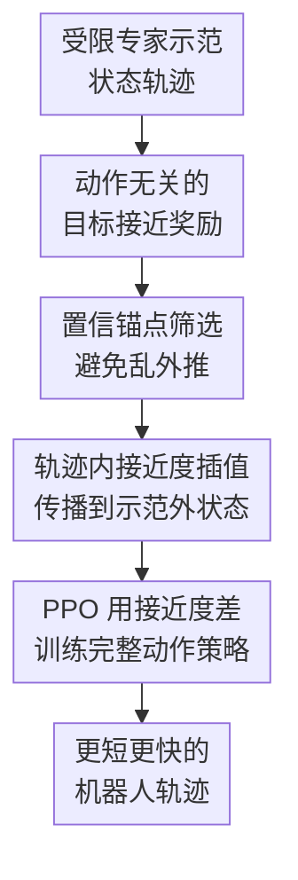

# When a Robot is More Capable than a Human: Learning from Constrained Demonstrators

**会议**: ICLR 2026  
**OpenReview**: [https://openreview.net/forum?id=BvirMuKWV1](https://openreview.net/forum?id=BvirMuKWV1)  
**论文**: [Project Page](https://sites.google.com/view/constrainedexpert)  
**代码**: supplementary material  
**领域**: 机器人模仿学习 / 受限示范学习  
**关键词**: 受限示范、模仿学习、逆强化学习、目标接近奖励、机器人操作  

## 一句话总结

这篇论文提出 Learning from Constrained Demonstrations (LfCD) 问题，并用 LfCD-GRIP 从受限人类示范中学习 state-only 的目标接近奖励，再通过置信度锚点和轨迹插值把奖励传播到示范外状态，使机器人能利用更大的动作空间走出比示范者更短、更快的轨迹。

## 研究背景与动机

**领域现状**：机器人从示范学习通常默认“专家示范”就是要模仿的目标行为。行为克隆直接拟合专家的状态到动作映射，GAIL 一类方法匹配专家的状态-动作分布，从观察学习的方法则改为匹配状态转移分布；这些方法在专家动作可执行且接近最优时很自然，因为数据本身就包含了机器人应该复现的行为模式。

**现有痛点**：真实机器人教学里，专家经常不是能力不足，而是被接口卡住。比如 6-DoF 机械臂用模式切换 joystick 遥操作时，人一次只能控制某个轴或少数几个自由度；为了安全和可控，动作幅度也会被限制。人类知道要把物体抓起来，也能在受限接口下完成任务，但轨迹会变成慢、分段、单轴移动的形式。机器人本体训练后却可能同时控制多个轴、走连续动作、用更大速度移动，如果它只照抄示范动作，就把人的接口限制也一起学进去了。

**核心矛盾**：这篇论文强调的不是“专家很差”或“示范有噪声”，而是“专家目标正确，但可用动作空间比机器人小”。形式上，专家在状态 $s$ 只能使用受限动作集合 $A_e(s) \subseteq A$，而学习到的机器人可以使用完整动作空间 $A$。因此最优机器人策略可能根本不在示范轨迹里出现：它既不能从行为克隆里直接读出来，也很难由匹配专家转移分布的方法恢复出来。

**本文目标**：作者要解决三个具体子问题。第一，奖励学习不能绑定专家动作，否则奖励会把受限动作当成“好动作”。第二，机器人在线探索会进入示范数据没覆盖的状态，必须知道哪些状态上的奖励估计可信。第三，对于这些示范外但可能通向更短路径的状态，还需要给出可泛化的任务进度信号，而不是一律惩罚为低价值。

**切入角度**：作者抓住了 goal-reaching 任务的一个结构：任务进展可以主要由“状态离目标有多近”来描述，而不必依赖具体用了哪个动作。受限示范虽然动作慢，但仍然从起点走向目标，沿轨迹的时间顺序包含了“越来越接近目标”的监督信号。只要能把这种状态级进度信号扩展到机器人自己探索到的新状态，机器人就有机会走出示范者没法演示的捷径。

**核心 idea**：用受限示范学习一个与动作无关的 goal-proximity reward，再把高置信状态作为锚点，对机器人在线轨迹中的中间状态做目标接近度插值，让奖励不再困在受限示范轨迹上。

## 方法详解

### 整体框架

LfCD-GRIP 的输入是一组受限专家状态轨迹 $D_e$，输出是一个用 PPO 等强化学习算法训练出的机器人策略 $\pi_\theta$。它先用示范轨迹的时间顺序预训练目标接近函数 $f_\phi(s)$，让越靠近终点的状态接近度越高；随后在在线训练中，机器人不断采样自己的轨迹，系统用 Monte Carlo Dropout 判断哪些状态的接近度预测可靠，再在同一条轨迹上找到高置信端点，把中间状态的接近度用时间插值补出来。策略训练时不直接模仿专家动作，而是使用相邻状态接近度差 $f_\phi(s_{t+1}) - f_\phi(s_t)$ 作为 dense reward。

方法的关键是把“示范告诉我们目标在哪里”和“示范动作本身是否值得模仿”拆开。传统 IL 会把受限 joystick 下的单轴动作学成策略；LfCD-GRIP 只从示范里抽取状态级任务进度，然后允许机器人在自己的完整动作空间里重新寻找能更快增加接近度的动作。

### 关键设计

**1. 动作无关的目标接近奖励：把人的接口限制从奖励里剥离出来**

LfCD-GRIP 的第一步是把奖励定义在状态上，而不是状态-动作对上。给定专家轨迹 $\tau = \{s_0, s_1, \ldots, s_T\}$，论文用从终点向前的指数衰减给每个专家状态打标签：越靠近终点，目标接近度越高，形如 $\delta^{T-t}$，其中 $\delta \in (0,1)$ 是时间衰减系数。接近函数 $f_\phi(s)$ 的专家监督项是让 $f_\phi(s_t)$ 拟合这个时间标签：

$$
L^e_\phi = \mathbb{E}_{s_t \sim D_e}\left(f_\phi(s_t) - \delta^{T-t}\right)^2.
$$

策略看到的奖励不是“专家在这里做了哪个动作”，而是一次转移让状态接近度增加了多少：$\hat{R}_{prox}(s_t, s_{t+1}) = f_\phi(s_{t+1}) - f_\phi(s_t)$。这让机器人可以选择任何能提高接近度的动作，包括专家因为接口限制无法同时执行的多轴动作。换句话说，示范只负责定义“往目标前进”的方向感，而不是规定“必须沿着专家那条慢轨迹走”。

**2. 置信锚点筛选：只从模型真正懂的状态开始外推**

单纯的 proximity-based IRL 有一个致命问题：为了防止奖励函数在示范外乱泛化，它通常把在线 rollout 中的所有状态都往零接近度压，即 $L^r_\phi = \mathbb{E}_{s_t \sim D_r}(f_\phi(s_t))^2$。这在普通场景里是保守的，但在 LfCD 里会直接扼杀捷径，因为机器人探索到的示范外短路径状态也会被当成“低价值”。

作者用 Monte Carlo Dropout 来估计 $f_\phi$ 对某个状态的预测不确定性：推理时保持 dropout 开启，做 $K$ 次随机前向，计算预测方差；方差越低，说明模型越有把握。论文把置信度写成负方差，核心就是 $confidence_\phi(s_t) = -Var(f_\phi(s_t))$。阈值不是手调常数，而是每轮用专家状态上的最大方差动态设定：在线状态只要方差低于这个专家阈值，就被视为和专家状态一样可靠。这样设计有两个效果：专家轨迹始终是高置信锚点，同时训练中逐渐出现的熟悉在线状态也能加入锚点集合，奖励传播范围会随学习扩大。

**3. 轨迹内接近度插值：把任务进度沿机器人自己的轨迹传播出去**

有了高置信状态后，LfCD-GRIP 并不对所有未知状态盲目预测，而是在同一条机器人 rollout 里寻找“起点和终点都高置信”的子轨迹。假设子轨迹长度为 $T_{sub}$，两端的 log-scale goal-proximity distance 分别是 $\rho_{start}$ 和 $\rho_{end}$，中间第 $t$ 个状态的目标标签用线性插值得到：

$$
\hat{f}_t = \delta^{\rho_{start} + \frac{t}{T_{sub}}(\rho_{end} - \rho_{start})}.
$$

这个设计背后的直觉很朴素：如果同一条轨迹上两个端点的任务进度都可信，那么它们之间的状态大概率也处在一段有意义的过渡里，可以给它们分配平滑变化的接近度。它不是根据空间距离硬插值，而是根据时间上的邻近关系传播进度，因此能处理机器人绕过受限示范路径时出现的新状态。相比把所有在线状态都压成零，这相当于承认“示范外不等于没用”，只要它夹在可靠锚点之间，就可以成为学习信号。

**4. 渐进式插值训练：早期保守、后期放开奖励泛化**

轨迹插值本身也有风险：训练早期模型还没学稳，如果过早相信插值标签，错误奖励可能被强化学习放大。论文加入一个随迭代衰减的 masking 概率 $p_{itr}$，初始接近 1，之后线性降到 0。对插值状态采样 mask $m_{itr} \sim Bernoulli(p_{itr})$，被 mask 的时候仍把该状态压到零，没被 mask 时才拟合插值标签：

$$
L^{conf}_\phi = \mathbb{E}_{s_t \sim D_{conf}}\left[(1-m_{itr})(f_\phi(s_t)-\hat{f}_t)^2 + m_{itr}(f_\phi(s_t))^2\right].
$$

剩余不在高置信子轨迹里的状态继续用零接近度正则 $L^{unconf}_\phi$。最终目标为 $L^{GRIP}_\phi = L^e_\phi + L^{conf}_\phi + L^{unconf}_\phi$。这个 annealing 让系统先像传统 proximity IRL 一样保守，等置信锚点和策略探索逐渐稳定后，再更多采用插值标签；附录的 no-masking 消融也说明，去掉这层渐进控制会让模型过早相信不可靠插值，导致 FetchPick-Constrained 失败。

### 一个完整示例

可以把 MiniGrid-LfCD 看成最直观的例子。专家从左上角出发，只能上下左右移动，所以它沿着上边和右边绕到右下角目标；这条路径在专家的四方向动作空间里是最短的，但对拥有八方向动作的机器人来说并不最短。

训练开始时，$f_\phi$ 只知道专家路径上越靠近终点的格子越好。机器人探索时可能走到对角线附近，这些状态不在专家数据中，传统 proximity IRL 会把它们往零奖励压，导致机器人回到专家路径。LfCD-GRIP 会先识别那些模型预测稳定的状态，例如靠近起点、终点或已经反复访问过的中间格子；当一段机器人轨迹的两个端点都高置信时，它把中间格子的接近度平滑插出来。这样，对角线方向的状态逐渐获得“确实在接近目标”的奖励，PPO 就能学到一直走 diagonal shortcut 的策略。论文结果显示，只有 LfCD-GRIP 发现了这条红色捷径，而 BC、GAIL、GAIfO、SSRR 和普通 Proximity 都停留在更长的专家式路径上。

### 损失函数 / 训练策略

训练分成 proximity model training 和 policy training 两个交替阶段。开始时先用专家监督项 $L^e_\phi$ 预训练 $f_\phi$，确保专家状态上的接近度有基本排序；每轮迭代中，当前策略 $\pi_\theta$ 采集 rollouts $D_r$，系统用 MCD 估计每个在线状态的不确定性，构造高置信子轨迹集合 $D_{conf}$，生成插值接近度标签，并用 $L^{GRIP}_\phi$ 更新 proximity network。

策略部分使用接近度差作为奖励：

$$
\hat{R}_{prox}(s_t, s_{t+1}) = f_\phi(s_{t+1}) - f_\phi(s_t).
$$

论文实验里统一用 PPO 训练策略，但框架本身不依赖 PPO，只要求 RL 算法能消费这个 dense reward。连续控制环境的动作空间被归一化到 $[-1,1]$，专家动作再按任务被裁剪到更小区间，例如 Maze2D 的专家动作限制为 $[-0.1,0.1]$，FetchPush 的严重受限版本为 $[-0.05,0.05]$，而机器人策略训练时可以使用完整动作空间。

## 实验关键数据

### 主实验

论文的主指标是平均轨迹长度，失败 episode 不提前截断，而是记为最大 horizon，因此该指标同时反映成功率和完成效率。作者比较了 BC、GAIL、GAIfO、SSRR、Proximity、Proximity-Drop 和 LfCD-GRIP，覆盖 MiniGrid、Maze2D、FetchPick、FetchPush，以及 WidowX-Pick 仿真和真实机械臂。

| 任务 / 场景 | 指标 | LfCD-GRIP | 关键对照 | 结论 |
|--------|------|------|----------|------|
| MiniGrid-LfCD | 平均轨迹长度 | 发现 diagonal shortcut，接近最短路径 | 其他方法沿专家式长路径 | 只有本文方法把奖励传播到示范外捷径 |
| Maze2D-Constrained | 平均轨迹长度 | 100 transitions | Proximity 113 transitions | 比最接近 baseline 再缩短 10%+ |
| Maze2D-Constrained | 成功率 / OOC 动作比例 | 100% / 100% | GAIL 69% / 71%，BC 12% / 69%，GAIfO 51% / 100% | 不只是动作更“出界”，而是能用出界动作成功到达目标 |
| WidowX-Pick Real Robot | 完成时间 | 12 秒 | BC 100 秒 | 真实机械臂上约 10 倍加速 |

### 消融实验

| 配置 | 关键指标 | 说明 |
|------|---------|------|
| Proximity | Maze2D-Constrained 平均长度 112 / 113 左右 | 只用目标接近奖励，在线示范外状态仍被压低，能学到进度但难以充分外推 |
| Proximity + time penalty 0.1 | Maze2D-Constrained 平均长度 119 | 简单时间惩罚没有解决奖励外推，甚至可能误导策略 |
| Proximity + time penalty 0.01 | Maze2D-Constrained 平均长度 111 | 与普通 Proximity 接近，仍不及 LfCD-GRIP 的 101 |
| Proximity + time penalty 0.001 | Maze2D-Constrained 平均长度 112 | 惩罚太小基本不起作用 |
| LfCD-GRIP w/o Masking | FetchPick-Constrained 失败 | 过早使用插值标签会把不可靠奖励传播出去 |
| LfCD-GRIP w/ Masking | FetchPick-Constrained 成功，平均长度显著更短 | 渐进式插值能稳定奖励泛化 |

### 关键发现

- LfCD-GRIP 的收益在“专家受限、机器人更强”时最明显。UnconstrainedExpert 设置下它仍有竞争力，但 ConstrainedExpert 下能系统性超过 BC、GAIL、GAIfO、SSRR 和普通 Proximity。
- OOC action ratio 的分析很关键：GAIfO 在 Maze2D-Constrained 里也能 100% 使用专家约束外动作，但成功率只有 51%；LfCD-GRIP 同样 100% 使用 OOC 动作，却达到 100% 成功。这说明问题不是“敢不敢探索示范外动作”，而是有没有能指导示范外状态的奖励。
- 约束越严重，本文方法的相对价值越高。FetchPush 的不同约束强度实验显示，当专家动作从较宽范围收紧到 $[-0.05,0.05]$ 后，BC 和 Proximity 退化更明显，而 LfCD-GRIP 仍能找到短路径。
- 真实 WidowX 实验很有说服力：mode-switching joystick 只能发离散单轴指令，BC 学到的就是慢速专家式动作；LfCD-GRIP 迁移到真实机械臂后能连续多轴运动，把单次任务从 100 秒缩到 12 秒。

## 亮点与洞察

- 把“受限但 competent 的专家”和“suboptimal / noisy 专家”区分开，是这篇论文最重要的问题定义。前者的近优策略可能不在数据里，不能靠排序或去噪从示范中找出来，只能把目标意图抽出来再让机器人重新规划行为。
- state-only reward 的选择非常贴合机器人遥操作场景。很多接口限制首先污染的是动作，而不是目标状态序列；只要任务是 goal-reaching，状态进度比动作模仿更接近真正应该学习的东西。
- MCD 置信度模块不是为了做漂亮的不确定性估计，而是为了回答一个训练中很实际的问题：哪些在线状态可以作为奖励传播的锚点。用专家状态最大方差做动态阈值，比固定阈值更少依赖任务调参。
- 轨迹内插值的思路可以迁移到更广义的“专家覆盖有偏”问题。只要示范数据只覆盖了状态空间的一部分，而机器人探索能把可信区域连起来，就可以考虑沿 rollout 传播进度奖励，而不是把所有 OOD 状态当坏状态。
- 论文没有把更短路径简单交给 time penalty，这一点值得借鉴。时间惩罚只告诉策略“少走几步”，但不知道哪些示范外状态真的朝目标前进；LfCD-GRIP 解决的是奖励可泛化性，而不是奖励里缺一个速度偏好。

## 局限与展望

- 方法强依赖 goal-reaching 结构。目标接近函数默认任务有明确终点，且进度能用状态相对终点的时间/接近关系刻画；对开放式操作、长期多阶段任务或没有清晰 terminal condition 的任务，直接套用会比较困难。
- 多任务场景还没有真正解决。论文也承认当前 proximity estimate 更像是针对单个目标或单类示范训练的信号，如果不同任务目标语义差异很大，如何共享表示和奖励仍需要新的建模。
- 插值使用的是同一条轨迹上的时间邻近，而不是显式动力学或几何距离。这样简单稳定，但在存在绕路、反复试探、临时远离目标再回来等复杂轨迹时，中间状态是否都应该线性获得进度标签可能不总成立。
- 实验主要集中在低维状态和相对清晰的导航/抓取任务。真实视觉输入、遮挡、多物体接触、失败恢复等更复杂机器人场景下，MCD 置信度和 proximity interpolation 是否足够鲁棒，还需要更大规模验证。
- 未来可以把 LfCD-GRIP 和大规模机器人 reward model 或视觉语言模型结合：前者提供在线轨迹内的保守奖励传播机制，后者提供更强的语义状态表示，可能能把“从受限示范中学会超越示范”扩展到更复杂的长程任务。

## 相关工作与启发

- **vs BC / GAIL**: BC 和 GAIL 都把专家行为分布当成学习目标，因此会继承 joystick、动作裁剪或安全限制带来的慢轨迹。LfCD-GRIP 只学习状态级目标进度，允许机器人用完整动作空间重新优化到达目标的方式。
- **vs GAIfO**: GAIfO 去掉了专家动作标签，匹配的是状态转移分布，这能缓解 action mismatch，但仍倾向复现专家经过的转移模式。LfCD-GRIP 不要求状态转移也像专家，而是奖励任何能增加目标接近度的转移。
- **vs SSRR / T-REX / D-REX 类 suboptimal demonstration 方法**: 这些方法通常假设专家和 agent 共享动作空间，数据里含有质量不同的轨迹，可以通过 ranking 或噪声等级恢复更优行为。LfCD 的关键不同是专家已经在自己的受限动作空间内尽力了，机器人最优行为可能完全没被示范出来。
- **vs Proximity-based IRL**: Proximity-based IRL 提供了动作无关的 dense reward，是本文的基础；但它为了防止 OOD 过泛化，会把在线探索状态压到低接近度。LfCD-GRIP 的贡献正是在这个基础上加入置信锚点和插值，让奖励能越过示范覆盖边界。
- **vs ReWiND / Robometer**: 这些更近期的奖励学习方法借助语言、轨迹比较或大规模机器人数据增强泛化。LfCD-GRIP 的路线更轻量，强调不依赖额外大数据，而是利用 agent 自己在线 rollout 中的高置信片段传播奖励。

## 评分

- 新颖性: ⭐⭐⭐⭐⭐ 清晰提出受限示范学习问题，并把“专家目标正确但动作空间受限”从一般 suboptimal demonstration 中单独拎出来。
- 实验充分度: ⭐⭐⭐⭐☆ 覆盖离散导航、连续导航、Fetch 操作、WidowX 仿真和真实机械臂，主结果和消融都较完整；但更复杂视觉机器人任务还偏少。
- 写作质量: ⭐⭐⭐⭐☆ 问题动机、方法结构和真实机器人例子都很清楚，公式和算法也完整；部分图中精确数值主要靠柱状图呈现，表格式结果可以更多。
- 价值: ⭐⭐⭐⭐⭐ 对机器人遥操作、从人类演示学习、sim-to-real 前的受限示范采集都很有启发，尤其适合那些机器人能力超过教学接口能力的场景。

<!-- RELATED:START -->

## 相关论文

- [\[CVPR 2026\] VLA Models Are More Generalizable Than You Think: Revisiting Physical and Spatial Modeling](../../CVPR2026/robotics/vla_models_are_more_generalizable_than_you_think_revisiting_physical_and_spatial.md)
- [\[ICLR 2026\] When would Vision-Proprioception Policies Fail in Robotic Manipulation?](when_would_vision-proprioception_policies_fail_in_robotic_manipulation.md)
- [\[ICLR 2026\] Rodrigues Network for Learning Robot Actions](rodrigues_network_for_learning_robot_actions.md)
- [\[ICLR 2026\] RAVEN: End-to-end Equivariant Robot Learning with RGB Cameras](raven_end-to-end_equivariant_robot_learning_with_rgb_cameras.md)
- [\[ICML 2025\] Action-Constrained Imitation Learning](../../ICML2025/robotics/action-constrained_imitation_learning.md)

<!-- RELATED:END -->
