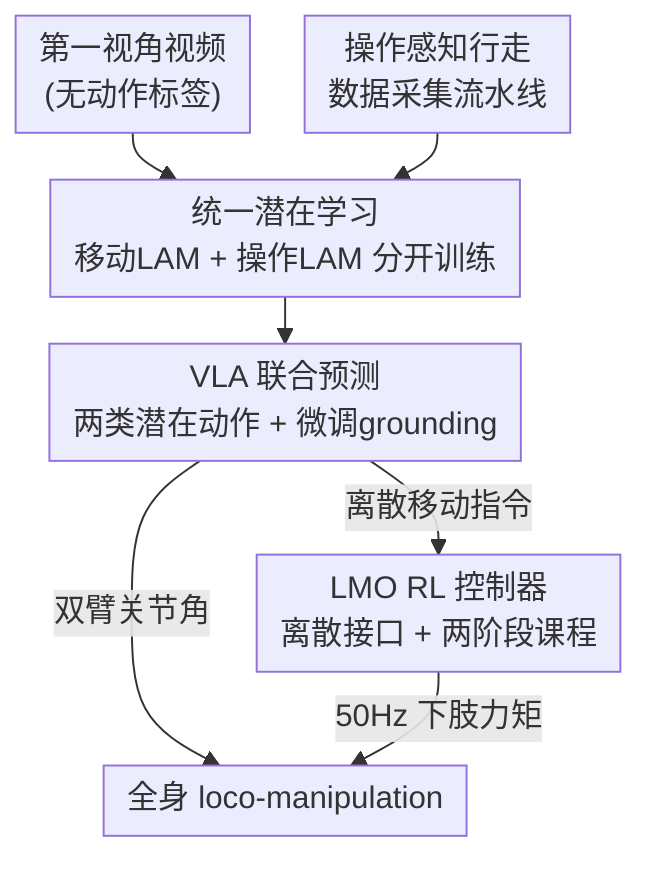

# WholeBodyVLA: Towards Unified Latent VLA for Whole-Body Loco-Manipulation Control

**会议**: ICLR 2026  
**论文**: [OpenReview / 项目页](https://opendrivelab.com/WholeBodyVLA)  
**代码**: 项目页 https://opendrivelab.com/WholeBodyVLA （未明确开源仓库）  
**领域**: 机器人 / 具身智能 / VLA  
**关键词**: 人形机器人, loco-manipulation, 潜在动作模型, VLA, 全身控制

## 一句话总结
WholeBodyVLA 让双足人形机器人第一次在大空间里端到端地完成「边走边操作」的任务：靠两个分开训练的潜在动作模型（LAM）从大量「无动作标签」的第一视角人类视频里学到行走+操作先验，再配一个专为 loco-manipulation 定制的离散指令 RL 底层控制器，在 AgiBot X2 上比之前的 baseline 平均成功率高 21.3%。

## 研究背景与动机
**领域现状**：人形机器人要做真正有用的活，必须同时具备「精确移动」和「灵巧操作」。目前的做法分两派——模块化（用高层 planner 把「导航」和「抓取」当成离散技能串起来）和端到端（直接学全身控制）。

**现有痛点**：模块化方案的技能边界很脆，机器人走完一段路常常停在一个「够不着 / 站不稳」的姿态，后续操作没法做，而且闭环反馈差、误差会累积；端到端方案理论上能联合优化，但需要海量「全身 loco-manipulation」轨迹来做模仿学习，而这种数据几乎没有——靠 MoCap 或遥操作采集贵到离谱。

**核心矛盾**：作者把根因归结为两条。其一是**数据稀缺**：桌面操作、轮式/四足导航都有大数据集，但把「人形行走」和「操作」整合在一起的数据极少，导致模型学不会「为了操作而移动」（manipulation-aware locomotion，即移动本身要为后续操作创造好前提：靠近、对正、稳住）。其二是**决策与执行错位**：现有 RL 控制器用「连续速度跟踪」目标，这套东西适合巡航，但对 loco-manipulation 需要的「精准起步/刹车/转向」反而过度复杂，训练难、控制不稳，高层 VLA 发出的指令底层执行不可靠。

**本文目标**：在不依赖大规模遥操作数据的前提下，学到丰富的 loco-manipulation 先验；同时让底层执行足够精确稳定，使高层决策能被忠实落地。

**切入角度**：人类靠「看别人做」就能学会新的走+操作技能，桌面操作领域也证明了人类示范视频很有用。视频里其实已经暴露了移动方向、末端轨迹、物体可供性、物理交互线索——这些正是 loco-manipulation 需要的，而且采集成本极低。

**核心 idea**：把「无动作标签的第一视角视频」压成离散潜在动作（latent action），用它在预训练阶段给 VLA 当监督信号；移动和操作因为视觉变化模式根本不同，用**两个分开的 LAM** 分别学；再加一个面向 loco-manipulation 的离散指令 RL 控制器兜底执行。

## 方法详解

### 整体框架
WholeBodyVLA 是一套「高层 VLA + 低层 RL 控制器」的分层系统。运行时输入是第一视角图像 + 语言指令（如「拿起箱子，转身走到小车旁，把箱子放上去」），VLM 把它编码成统一的潜在动作 token；一个轻量 action decoder（约 10 Hz）把潜在动作落地成两路具体指令——（i）双臂关节角度，（ii）一个离散的移动指令（前进/侧步/转身/下蹲高度）；移动指令再交给 LMO RL 控制器以 50 Hz 转成下肢力矩，保证稳定执行。

训练上分三步：先在大规模第一视角视频上**分别预训练**操作 LAM（用 AgiBot World 真机操作数据）和移动 LAM（用自采的「操作感知行走」视频），把帧间逆动力学压成离散码本；然后让 VLA 在混合的「人类视频 + 真机数据」上**联合预测两类潜在动作**（用 LAM 的码当伪标签）；最后接上 action decoder，在遥操作轨迹上微调，把潜在动作 grounding 成机器人可执行指令。LMO RL 控制器在仿真里单独训练、部署时固定。

### 关键设计

**1. 统一潜在学习：用两个分开的 LAM 把「无动作视频」变成 VLA 的监督信号**

痛点是遥操作数据太贵、全身数据几乎没有，而无标签视频里其实藏着 loco-manipulation 所需的全部线索。作者借鉴 Genie / UniVLA 的思路，用 VQ-VAE 架构、在 DINOv2 特征上建编码器：给定相邻两帧 $(o_t, o_{t+k})$，编码器 $E_i$ 先输出连续潜向量 $z_t = E_i(o_t, o_{t+k})$，再量化到码本里最近的码 $c_t^i = \arg\min_{c\in C_i}\lVert z_t - c\rVert_2$；解码器 $D_i$ 拿前一帧 + 量化潜在动作去重建后一帧 $\hat o_{t+k}=D_i(o_t, c_t)$，用标准 VQ-VAE 损失优化。这样就把「帧间变化」编码成了一套离散的「潜在动作词表」，完全不需要动作标签。

关键的洞察是**必须把移动和操作的 LAM 拆开训**（$i\in\{\text{mani},\text{loco}\}$）。原因有二：操作视频相机几乎不动、画面变化主要来自手臂，模型会偏向盯着手臂区域；行走视频相机持续移动、画面变化来自环境相对运动，模型被迫看整个场景——两种注意力目标冲突，混在一起训表征不稳。更要命的是在 loco-manipulation 里手臂常在视野内，行走时「手臂相对环境位置变了」其实是相机（身体）在动，但单个 LAM 会误判成手臂在动，产生歧义编码。拆开后，VLA 用交叉熵联合预测两类潜在动作 $\pi_\theta(c_t^{\text{mani}}, c_t^{\text{loco}}\mid o_t, \ell)$（$\ell$ 是语言指令），逼模型在一个统一动作空间里学会移动与操作如何配合。最后用轻量 decoder $f$ 把潜在动作 grounding 成机器人指令 $a_t = f(\hat c_t^{\text{mani}}, \hat c_t^{\text{loco}}, s_t)$，产出上肢关节角 + 一个离散移动指令。消融显示拆开比共享 LAM 略好，但「拆不拆」不是主因，「有没有移动侧预训练」才是大头。

**2. 操作感知行走数据采集流水线：让低成本视频真正对齐 loco-manipulation**

光有 LAM 还不够，移动侧需要海量「带操作意图的行走」视频，而这类数据现成的几乎没有。作者设计了一条极简的第一视角采集流水线，三个特点缺一不可：（1）**低成本高效率**——只需一个操作员戴头戴相机，单目即可，彻底绕开 MoCap 和遥操作；（2）**覆盖人形基元**——操作员要做全套动作：前进、转身、下蹲；（3）**目标导向**——行走必须是「走向潜在的操作目标」，而不是漫无目的地走，保证采到的移动数据和 loco-manipulation 学习直接对齐。正是这条「目标导向」约束，让无标签视频里的移动先验对下游真正有用——后面实验里「移动泛化」的提升主要就来自它（移动 LAM 用的就是这批数据）。

**3. LMO RL 策略：用离散指令接口替掉速度跟踪，修复决策-执行错位**

即便高层监督很丰富，机器人仍可能因为底层 RL 控制器不行而走失败。作者分析发现，很多错误（踉跄、偏航、边走边转）来自底层控制器精度/稳定性不足，而非 VLA 本身，而罪魁是现有控制器普遍用的「连续速度跟踪」目标——它对宽泛巡航够用，但对 loco-manipulation 需要的精准定位是「能力过剩」，反而难训、不稳。

LMO 把速度跟踪换成**离散指令接口**：观测只用本体感知 $O_t=[u_t,\omega_t,g_t,q_t,\dot q_t,a_{t-1}]$（不依赖特权环境信息）；每步 planner 给出指令 $u_t=[s_x,s_y,s_\psi,h^\star]\in\{-1,0,1\}^3\times\mathbb{R}$，三个三值标志分别表示前进/侧移/转向，$h^\star$ 指定站立高度。这种接口显式编码了「起/停」语义、降低轨迹方差，同时让 RL 控制器和高层 planner 都更好训。为避免三值标志带来的急加速，方向意图过一个平滑门控：$v_k^{\text{ref}}(t)=v_k^{\text{goal}}\tanh\big(\alpha(s_k-\bar s_k(t))\big)$，其中 $\bar s_k(t)\leftarrow(1-\lambda)\bar s_k(t-1)+\lambda s_k$ 是指数平滑后的标志，保证可预测的开关切换、抑制振荡。

训练用**两阶段课程**：Stage I 先学会基本步态不摔倒（每轴按 $v_k^{\text{goal}}\sim U([0,v_k^{\max}])$ 采目标速度，上肢按 HOMIE 的方式追踪重采样的姿态目标，逐步放宽关节限制施加扰动）；Stage II 专门打磨 loco-manipulation 级的精度与稳定——巡航速度固定为常数以抑制无意偏航，用方向偏差 $J_{\text{dir}}=|\text{wrap}(\psi_{\text{end}}-\psi_{\text{start}})|$ 监督精准起步/刹车/转向；操作侧从 AgiBot-World 采真实手臂运动片段注入扰动，逼腿部去补偿真实的惯性耦合而非随机噪声；对静止回合加站立惩罚 $J_{\text{stand}}=\lVert a_i^{\text{leg}}\rVert_2^2$ 防止多余腿动。

### 损失函数 / 训练策略
- **LAM 预训练**：标准 VQ-VAE 重建损失（编码器 + 码本 + 解码器）。
- **VLA 预训练**：交叉熵，联合最大化 $\pi_\theta(c_t^{\text{mani}}, c_t^{\text{loco}}\mid o_t, \ell)$，用 LAM 码当伪动作标签。
- **VLA 微调**：在 AgiBot-X2 遥操作轨迹（VR + 手柄，每任务 50 次）上微调，接上 action decoder 做 grounding。
- **LMO RL**：两阶段课程，Stage II 含 $J_{\text{dir}}$、$J_{\text{stand}}$ 及结构化手臂扰动；与速度基线分开在仿真训练，部署时固定。

## 实验关键数据

硬件为 AgiBot X2 原型（7-DoF 双臂 + Omnipicker 夹爪、6-DoF 腿、1-DoF 腰、第一视角 RealSense D435i）。三大任务：装袋（抓纸袋→侧步→下蹲放入纸箱）、装箱（下蹲抓箱→转身→放到小车）、推车（抓 50 kg 小车把手→稳定前推）。

### 主实验
每个任务拆成两个子目标，各 25 次试验（成功数/25），下表为平均成功率：

| 方法 | 装袋(抓/移蹲) | 装箱(蹲抓/起转) | 推车(抓把/前推) | 平均 |
|------|------|------|------|------|
| Modular Design | 22 / 12 | 9 / 9 | 22 / 22 | 64.0% |
| GR00T w/ LMO | 20 / 10 | 6 / 4 | 12 / 11 | 42.0% |
| OpenVLA-OFT w/ LMO | 19 / 6 | 12 / 12 | 22 / 14 | 56.7% |
| **WholeBodyVLA (ours)** | **23 / 13** | **19 / 17** | **23 / 22** | **78.0%** |

WholeBodyVLA 比最强 baseline（模块化 64.0%）高约 14 个点，论文摘要中「+21.3% / +24.0%」分别对应不同对比设置（⚠️ 具体配对以原文为准）。

### 消融实验

| 配置 | 平均成功率 | 说明 |
|------|---------|------|
| Full model | 78.0% | 完整模型 |
| w/ vel.-based RL | 54.0% | LMO 换回速度跟踪 RL，掉 24%，91.7% 的差距来自含大量移动的第二子目标 |
| w/o LAM | 39.3% | 跳过潜在预训练，掉 38.7% |
| w/ manip. LAM | 63.3% | 只在操作数据上做潜在学习，比全预训练低 14.7% |
| w/ shared LAM | 66.0% | 移动+操作共用一个 LAM，比分开略低 |

LMO 内部消融（MuJoCo，位置/朝向误差，越低越好）：

| 配置 | 前进后退 | 左右侧步 | 转向 | 站立CoM晃动 |
|------|------|------|------|------|
| LMO (ours) | 0.21 / 0.05 | 0.55 / 0.06 | 0.05 / 0.19 | 0.03 |
| w/o Eq.3(方向奖励) | 0.24 / 0.07 | 0.61 / 0.09 | 0.05 / 0.28 | 0.04 |
| w/o stage 2 | 0.27 / 0.09 | 0.72 / 0.11 | 0.20 / 0.32 | 0.05 |
| w/o stage 1 | 0.30 / 0.11 | 0.66 / 0.13 | 0.46 / 0.34 | 0.05 |

### 关键发现
- **潜在预训练贡献最大**：去掉 LAM 直接掉 38.7%，是单个最大的性能来源；其中「移动侧预训练」尤其关键（只留操作 LAM 还低 14.7%，且在「先走一段再操作」的任务上差距最大）。
- **拆 LAM 是锦上添花而非主因**：shared LAM（66.0%）只比分开略低，说明「有没有移动预训练」比「拆不拆」更重要。
- **LMO 修的是「最后一步执行」**：速度基线掉的 24% 里，91.7% 集中在含移动的第二子目标；Stage I 缺失时步态根本立不稳（转向误差 0.46 最大），Stage II 缺失时轨迹误差和下蹲晃动明显上升。
- **数据效率**：用 >50% 人类视频预训练时，只需 25 条遥操作轨迹就能追平用 <25% 视频、却要 200 条轨迹的变体——潜在预训练大幅降低对遥操作数据的依赖。

## 亮点与洞察
- **「为操作而移动」被显式建模**：核心命题 manipulation-aware locomotion 抓得很准——移动不是独立阶段，而是要为后续抓取创造好前提（靠近、对正、稳住），这正是模块化方案失败的根源。
- **拆两个 LAM 的理由很有说服力**：从「相机静 vs 动」「手臂动 vs 身体动产生相同相对位移」两个具体视觉歧义出发，解释为什么单 LAM 会编码冲突，是个可迁移到其他「移动+操作」具身场景的洞察。
- **离散指令接口是巧设计**：把速度跟踪换成三值标志 + 平滑门控，既显式化了起/停语义、降低轨迹方差，又同时让底层 RL 和高层 planner 更好训，一举两得。
- **极简采集流水线**：单人 + 头戴单目相机就能采「操作感知行走」视频，把数据成本压到接近零，是这套方法能 scale 的前提。

## 局限与展望
- 作者承认在长程、高灵巧度任务上仍有挑战；未来计划引入轻量建图 + 记忆做更长规划，并发展主动感知策略提升鲁棒性。
- 自己发现的局限：评测都在 AgiBot X2 单一平台、每子目标仅 25 次试验，统计样本偏小；摘要里「+21.3% / +24.0%」与主表 78.0% vs 64.0%（约 +14）的对应关系需对照 appendix 才能厘清（⚠️ 以原文为准）。
- LMO 控制器训练时固定、不随 VLA 联合优化，高低层之间仍是单向 grounding，潜在的协同优化空间没吃满。

## 相关工作与启发
- **vs 模块化 planner（Being-0 / R2S2 / HEAD）**: 他们用 VLM 把移动和操作排成离散技能，技能边界脆、走完常停在不可操作的姿态，还依赖云端感知有延迟；本文端到端联合优化，避免 handoff。
- **vs 人形 VLA（Humanoid-VLA / GR00T）**: 前者只管移动、后者只管操作，各偏一边；本文用统一潜在动作空间把两者整合进一个 VLA。
- **vs 潜在动作学习（Genie / LAPA / UniVLA）**: 这些证明无动作视频能给 VLA 当监督，但都面向桌面操作（相机静）；本文首次把它扩到「移动+操作」并拆成两个 LAM 处理相机运动带来的歧义。
- **vs 速度跟踪 RL 控制器（HOMIE / AMO / FALCON / ULC）**: 它们都用速度中心训练，步态零碎、teleop 轨迹不稳；LMO 用离散指令接口换来精准起停与朝向保真。

## 评分
- 新颖性: ⭐⭐⭐⭐⭐ 首次实现大空间端到端人形 loco-manipulation，统一潜在学习 + 拆 LAM + 离散指令 RL 三处都有原创洞察。
- 实验充分度: ⭐⭐⭐⭐ 真机三任务 + 多组消融 + 数据缩放 + 扩展场景都覆盖，但单平台、每子目标 25 次试验样本偏小。
- 写作质量: ⭐⭐⭐⭐ 动机推导清晰、拆 LAM 的理由讲得透；但主表与摘要百分比的对应需查附录。
- 价值: ⭐⭐⭐⭐⭐ 给「数据稀缺下的人形全身控制」提供了一条低成本、可 scale 的实用路线。

<!-- RELATED:START -->

## 相关论文

- [\[ICLR 2026\] HWC-Loco: A Hierarchical Whole-Body Control Approach to Robust Humanoid Locomotion](hwc-loco_a_hierarchical_whole-body_control_approach_to_robust_humanoid_locomotio.md)
- [\[ICLR 2026\] Hierarchical Value-Decomposed Offline Reinforcement Learning for Whole-Body Control](hierarchical_value-decomposed_offline_reinforcement_learning_for_whole-body_cont.md)
- [\[ICLR 2026\] Unified Diffusion VLA: Vision-Language-Action Model via Joint Discrete Denoising Diffusion Process](unified_diffusion_vla_vision-language-action_model_via_joint_discrete_denosing_d.md)
- [\[ICLR 2026\] From Language to Locomotion: Retargeting-free Humanoid Control via Motion Latent Guidance](from_language_to_locomotion_retargeting-free_humanoid_control_via_motion_latent_.md)
- [\[ICLR 2026\] Interleave-VLA: Enhancing Robot Manipulation with Image-Text Interleaved Instructions](interleave-vla_enhancing_robot_manipulation_with_image-text_interleaved_instruct.md)

<!-- RELATED:END -->
