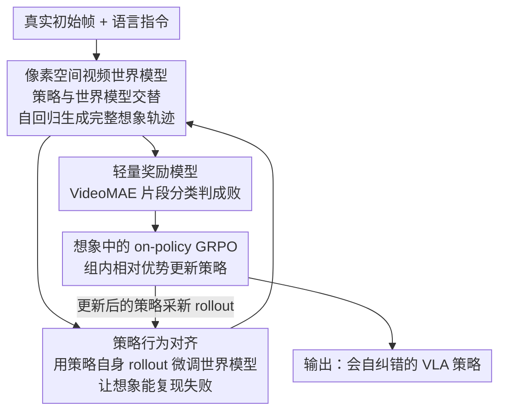

# WMPO: World Model-based Policy Optimization for Vision-Language-Action Models

**会议**: ICLR 2026  
**OpenReview**: [https://openreview.net/forum?id=qE2FyvRvuF](https://openreview.net/forum?id=qE2FyvRvuF)  
**项目页**: [https://wm-po.github.io/](https://wm-po.github.io/)  
**代码**: https://github.com/WM-PO/WMPO （有）  
**领域**: 机器人 / 具身智能 / VLA / 强化学习 / 世界模型  
**关键词**: VLA、世界模型、On-policy RL、GRPO、样本效率

## 一句话总结
WMPO 把 VLA 策略的强化学习整个搬进一个**像素空间的动作条件视频世界模型**里"做梦"，用世界模型想象出完整轨迹、轻量奖励模型判成败、再跑 on-policy GRPO，从而无需真机交互就显著提升样本效率，并涌现出自纠错行为。

## 研究背景与动机

**领域现状**：Vision-Language-Action（VLA）模型是当前通用机器人操作的主流范式，绝大多数靠**模仿学习（IL）**在大规模人类示范上微调而成（OpenVLA、π0 等）。

**现有痛点**：纯 IL 训出来的策略很"脆"——一旦进入示范里没见过的分布外状态，它会做出次优动作，误差不断累积（compounding error），最终任务彻底失败且无法恢复。说白了，IL 只会"模仿成功"，**学不会从失败中纠错**。强化学习（RL）本可以通过主动交互来补这个短板，但直接在真机上跑 RL 需要数百万次交互，代价高、不安全、又慢。

**核心矛盾**：要让 VLA 学会自我改进就得用 on-policy RL，而 on-policy RL 又要海量真机 rollout——二者在真实世界里天然冲突。现有提效路线要么靠**人工干预**（昂贵、难规模化），要么靠**仿真器**（为每个真实场景搭精确仿真器工程量爆炸）。

**核心矛盾（更深一层）**：视频生成世界模型本是 model-based RL 的天然出路，但经典世界模型多在**抽象隐空间**（RSSM 之类）里建模，这和 VLA 在 web 级真实图像上预训练得到的视觉表征**根本不匹配**——VLA 那套丰富的预训练视觉理解没法直接用在错配的隐动力学上。

**本文目标**：构造一个能完全替代真机交互的"想象训练场"，让 VLA 在里面跑真正的 on-policy RL，同时保住 VLA 的预训练知识。

**切入角度**：与其在隐空间建世界模型，不如**在像素空间**建一个动作条件的视频生成世界模型——它产出的图像和 VLA 预训练数据同分布，天然桥接策略的预训练知识。

**核心 idea**：用**像素空间视频世界模型 + 策略行为对齐 + 轻量奖励模型**搭一个自包含环境，让 VLA 完全"在想象中"跑 on-policy GRPO，把真机交互需求降到只剩少量校准用的 rollout。

## 方法详解

### 整体框架

WMPO 把问题形式化为一个 MDP $M=(S,A,P,R)$：状态 $S$ 是图像序列 + 语言指令，动作 $A$ 是长度 $K$ 的动作块（每维离散成 256 个 bin），**转移函数 $P$ 由一个参数化世界模型 $p_\phi$ 实现**——它根据过去观测和动作生成未来帧；奖励 $R$ 由一个学习得到的模型 $R_\psi$ 给出二值成败信号。优化目标就是最大化想象轨迹的累计回报 $\max_\theta \mathbb{E}_{\tau\sim\pi_\theta,p_\phi}[R_\psi(\tau)]$。

训练流程是一个三阶段循环，每轮迭代都在世界模型内部完成、完全不碰真机：

1. **想象轨迹生成**：从真实环境采到的初始帧 $I_{0:c}$ 出发，策略 $\pi_{\theta_{old}}$ 和世界模型 $p_\phi$ 交替工作——策略看最近 $m$ 帧 + 指令预测一个动作块，世界模型据此生成接下来 $K$ 帧，反复自回归直到最大长度，拼出一条完整想象轨迹 $\tau$。
2. **轨迹采样**：从同一初始状态采一组 $G$ 条想象轨迹 $\{\tau_1,\dots,\tau_G\}$，每条丢给奖励模型 $R_\psi$ 判成败，得到二值标签。
3. **策略更新**：用这组轨迹的相对优势跑 GRPO，更新策略参数 $\theta$。

### 关键设计

**1. 像素空间动作条件视频世界模型：让想象轨迹和 VLA 预训练表征同分布**

这是 WMPO 区别于经典 model-based RL 的根基。痛点在于隐空间世界模型（RSSM 等）产出的状态和 VLA 的 web 级图像预训练表征错配，VLA 的视觉先验用不上。WMPO 改在**像素空间**建模：以 OpenSora 视频扩散为骨干，但把其中的 3D VAE 换成 SDXL 的 2D VAE——后者更能保住细粒度运动细节、避免过度压缩带来的时序失真，扩散过程在 VAE 隐空间进行、最后再解码回像素喂给 VLA，从而直接复用预训练知识而非另起炉灶训一个新隐空间。

但要支撑完整长程轨迹，世界模型必须**片段级自回归**地用已生成帧作为条件继续生成，这会累积误差、长程后画质崩坏。为此引入两个稳定技巧：其一是 **noisy-frame conditioning**——训练时给条件帧 $I_{i-m:i}$ 注入对应早期扩散步（约第 50 步，1000 步为纯高斯噪声）的轻微噪声，而非保持干净，提升对不完美条件的鲁棒性，最终能稳定生成数百帧而无明显掉质；其二是 **frame-level action control**——扩展 AdaLN 块，把动作信号和扩散时间步嵌入在**帧级**注入：对每个动作 $a_i$ 用 MLP 生成调制系数（LayerNorm 输出的 scale $\gamma_1^i$、shift $\beta_1^i$，以及残差连接的 scale $\alpha_1^i$），更新规则为 $x_i = x_i + (1+\alpha_1^i)\cdot\mathrm{Block}\big(\gamma_1^i\cdot\mathrm{LayerNorm}(x_i)+\beta_1^i\big)$，确保动作和画面精确对齐、避免 action–frame misalignment。

**2. 策略行为对齐（Policy Behavior Alignment）：让世界模型能忠实复现失败**

世界模型先在 Open X-Embodiment（OXE）的百万级轨迹上预训练，获得宽广的物理动力学知识。但问题来了：OXE 和下游任务的专家示范几乎全是**成功**执行，失败场景在观测分布里严重欠采样——一个只见过成功的世界模型想象不出失败，而想象轨迹里没有失败，RL 就无从学纠错，整条想象轨迹也就不适合训练。WMPO 的解法是用**策略自己采集的真实 rollout**去微调世界模型，把它对齐到下游 (状态, 动作) 分布，并真实地捕捉失败模式。这一步是 on-policy 的关键前提：没有它，模型对失败的想象会很脆、不忠实，GRPO 就学不到有意义的纠错信号。

**3. 轻量奖励模型：用片段分类器给稀疏成败信号，避免 reward hacking**

短程预测难以定义准确奖励、还容易被钻空子（reward hacking）。WMPO 干脆生成完整轨迹后，用一个**轻量奖励模型**做基于结果的二值打分。它把轨迹切成长度 $L$ 的片段 $c_i=I_{i-L:i}$：成功轨迹的末尾片段 $c_N$ 作正样本，负样本则取自成功轨迹的中间片段以及失败轨迹的任意片段，并在 batch 内平衡正负样本数。模型用 VideoMAE 编码器 + 线性头、以二元交叉熵训练；推理时用步长 $s$ 的滑窗扫整条轨迹算每个片段的成功概率，只要任一片段超过阈值 $\tau_{thr}$（验证集选定）就判该轨迹成功。实测奖励模型在所有任务上 F1 > 0.95，可靠区分成败，避免了复杂的 reward shaping。

**4. 想象中的 on-policy GRPO：把 GRPO 的反复 rollout 优势在世界模型里兑现**

真实世界 RL 受两个瓶颈卡死：物理交互成本高、且受限于此只能退而用 off-policy 方法，而 off-policy 会带来价值估计偏差、性能不如 on-policy。WMPO 把转移交给世界模型（公式 2）后，这两点同时化解——想象中的 rollout 便宜且可规模化，于是能跑真正的 on-policy **GRPO**。具体地，从同一初始帧采一组 $G$ 条想象轨迹，用奖励模型打成败；为防梯度消失，借鉴 DAPO 的**动态采样**：若一组全成功或全失败就丢弃重采直到 batch 填满。优势按组内归一化 $\hat A_i=\big(R_i-\mathrm{mean}(\{R_i\})\big)/\mathrm{std}(\{R_i\})$，目标函数为带 clip 的比率目标

$$\mathcal{J}(\theta)=\mathbb{E}\Big[\tfrac{1}{G}\sum_{i=1}^{G}\tfrac{1}{T}\sum_{t=0}^{T}\min\big(r_{i,t}(\theta)\hat A_i,\ \mathrm{clip}(r_{i,t}(\theta),1-\epsilon_{low},1+\epsilon_{high})\hat A_i\big)\Big],$$

其中 $r_{i,t}(\theta)=\pi_\theta(a_{i,t}\mid s_{i,t})/\pi_{\theta_{old}}(a_{i,t}\mid s_{i,t})$。遵循 DAPO 移除了 KL 正则项，无需参考模型、省显存又鼓励探索新行为。值得注意的是，世界模型天然支持**从同一初始状态反复 rollout**——这在真机几乎无法实现，却正是大规模 GRPO 训练所必需的。

### 损失函数 / 训练策略
- **世界模型**：OpenSora 骨干 + SDXL 2D VAE，先在 OXE 预训练再用策略 rollout 做 behavior alignment；noisy-frame conditioning 取扩散第 50 步噪声级。
- **奖励模型**：VideoMAE 编码器 + 线性头，BCE 损失，类别平衡。
- **策略**：基座为 IL 微调过的 OpenVLA-OFT，动作块长度 $K=8$，世界模型每次给 $c=4$ 条件帧预测 $K=8$ 帧；GRPO 去 KL（DAPO 风格）+ 动态采样。

## 实验关键数据

### 主实验
在 Mimicgen 仿真的四个细粒度操作任务上，与同等真实 rollout 预算 $P$ 下的 online GRPO、offline DPO 对比（成功率 %）：

| 预算 $P$ | 方法 | Coffee | StackThree | ThreePieceAssembly | Square | 均值 |
|---|---|---|---|---|---|---|
| – | Base policy | 43.8 | 46.9 | 19.5 | 24.2 | 33.6 |
| 128 | GRPO | 38.3 | 52.3 | 17.2 | 25.0 | 33.2 |
| 128 | DPO | 43.8 | 53.9 | 23.4 | 28.1 | 37.3 |
| 128 | **WMPO** | **61.7** | **56.3** | **37.5** | **32.8** | **47.1** |
| 1280 | GRPO | 47.7 | 54.7 | 20.3 | 25.8 | 37.1 |
| 1280 | DPO | 52.3 | 57.0 | 26.7 | 33.6 | 42.4 |
| 1280 | **WMPO** | **75.0** | **64.1** | **46.1** | **45.3** | **57.6** |

仅 $P=128$ 时 WMPO 就比最强 baseline 高 **+9.8** 分；预算升到 1280 时差距扩大到 **+15.2** 分，说明它比现有方法更会"榨干"额外轨迹、随 rollout 增长稳定提升；而 GRPO 在有限更新下常掉点、DPO 因静态复用数据很快饱和。

### 泛化 / 鲁棒性实验
三种扰动场景（位置 / 背景 / 纹理偏移）下的成功率（%）：

| 方法 | Pos. Dis. | Bg. Dis. | Tex. Dis. | 均值 |
|---|---|---|---|---|
| Base policy | 14.1 | 46.1 | 10.9 | 23.7 |
| GRPO | 15.6 | 47.7 | 10.9 | 24.7 |
| DPO | 16.4 | 34.4 | 7.8 | 19.5 |
| **WMPO** | **22.3** | **50.0** | **16.4** | **29.6** |

DPO 在背景/纹理变化下大幅退化，暴露它依赖的是虚假视觉线索而非可迁移的操作技能；WMPO 在三类扰动下都最稳。

### 关键发现
- **自纠错涌现**：在 Square 任务里，base policy 与 WMPO 都因误差累积撞到木棍时，base policy 没在示范里见过碰撞、只会一直把方块顶在棍上直到超时失败；WMPO 借助海量想象轨迹学会**抬起方块、重新对齐、再插入**，最终成功——这是纯 IL 拿不到的行为。
- **更短更顺**：WMPO 成功轨迹的相对长度显著更短（图 5），因为它惩罚"卡死"行为，副产品是动作更快更平滑。
- **终身学习**：在 StackThree 上交替"采 128 条真轨迹→WMPO 优化→再采"，WMPO 持续稳定提升，而 DPO 因训练不稳无法迭代改进；且 WMPO 只用策略自采轨迹，比需要人采示范的 IL 更可规模化。
- **真机验证**：在 Cobot Mobile ALOHA 上做 5mm 间隙的"方块插棍"任务，base / DPO / WMPO 成功率分别为 53% / 60% / **70%**；世界模型甚至能从未见过的初始状态准确预测未来演化。
- **奖励模型可靠**：所有任务 F1 > 0.95，有效抑制 reward hacking。

## 亮点与洞察
- **"像素空间"是为了对齐预训练，而非单纯追画质**：作者点破隐空间世界模型和 VLA 预训练表征的错配，把"用像素空间"从画质问题上升为"桥接预训练知识"的原则——这是全文最核心的论点。
- **把 GRPO 的天然短板变成优势**：GRPO 需要从同一初始状态反复 rollout，这在真机几乎做不到，却恰好是世界模型最擅长的——方法选型和世界模型特性严丝合缝。
- **Policy Behavior Alignment 抓住了"想象失败"这个隐形难点**：世界模型只见成功就想象不出失败、RL 就学不到纠错，这一步看似简单却是 on-policy 能跑通的命门。
- **可迁移 trick**：noisy-frame conditioning 对抗自回归误差累积、frame-level AdaLN 动作注入对齐 action–frame，都是长程视频世界模型可直接复用的工程经验。

## 局限与展望
- **状态等价于图像观测的假设**：作者把机器人状态简化为图像观测，POMDP 等更复杂设定明确留给未来；同时实验里省略了本体感知和腕部相机输入。
- **依赖少量真机 rollout 做对齐**：完全免真机交互并不成立——仍需策略自采的少量轨迹（如 128 条）来对齐世界模型，初始基座也要 IL 示范。
- **奖励是二值结果信号**：稀疏的成败奖励对更长程、多阶段任务的信用分配可能不够细，阈值 $\tau_{thr}$ 也需验证集调。
- **世界模型保真度上限**：5mm 这类极精细接触动力学一旦想象失真，会直接误导策略；真机仅在单一插棍任务、30 次试验上验证，规模偏小。

## 相关工作与启发
- **vs 隐空间 model-based RL（Dreamer/RSSM 系）**：它们在抽象隐空间 rollout 高效但与 VLA 预训练错配；WMPO 在像素空间生成、解码回真实图像，让 VLA 预训练视觉知识可直接复用。
- **vs 真机/仿真 on-policy RL（PPO/GRPO 直接优化 VLA）**：它们样本效率差、且为每个真实场景搭精确仿真器工程量巨大；WMPO 把交互整个搬进学习到的世界模型，样本效率和可扩展性大幅提升。
- **vs offline RL（DPO）**：DPO 能复用数据但无法在线更新、易依赖虚假视觉线索、扰动下退化；WMPO 是真正的 on-policy，泛化与终身学习都更稳。
- **vs 人工干预式 VLA RL**：那类方法靠人给纠错信号降低探索成本，但需持续人工监督、难规模化；WMPO 只靠策略自采轨迹。

## 评分
- 新颖性: ⭐⭐⭐⭐⭐ 首次验证高保真像素空间视频世界模型可支撑可扩展的 VLA on-policy RL，并把"像素对齐预训练"讲成原则。
- 实验充分度: ⭐⭐⭐⭐ 仿真四任务 + 三类扰动 + 终身学习 + 真机都覆盖，但真机规模偏小、任务单一。
- 写作质量: ⭐⭐⭐⭐⭐ 动机层层递进，三大创新和瓶颈一一对应，图文清晰。
- 价值: ⭐⭐⭐⭐⭐ 给"无真机交互的 VLA RL"提供了可规模化范式，自纠错涌现尤其有吸引力。

<!-- RELATED:START -->

## 相关论文

- [\[CVPR 2026\] SRPO: Self-Referential Policy Optimization for Vision-Language-Action Models](../../CVPR2026/robotics/srpo_self-referential_policy_optimization_for_vision-language-action_models.md)
- [\[ICLR 2026\] UniVLA: Unified Vision-Language-Action Model](unified_vision-language-action_model.md)
- [\[ICLR 2026\] WorldGym: World Model as an Environment for Policy Evaluation](worldgym_world_model_as_an_environment_for_policy_evaluation.md)
- [\[ICLR 2026\] VLM4VLA: Revisiting Vision-Language-Models in Vision-Language-Action Models](vlm4vla_revisiting_vision-language-models_in_vision-language-action_models.md)
- [\[ICML 2026\] Dual-Stream Diffusion for World-Model Augmented Vision-Language-Action Model](../../ICML2026/robotics/dual-stream_diffusion_for_world-model_augmented_vision-language-action_model.md)

<!-- RELATED:END -->
