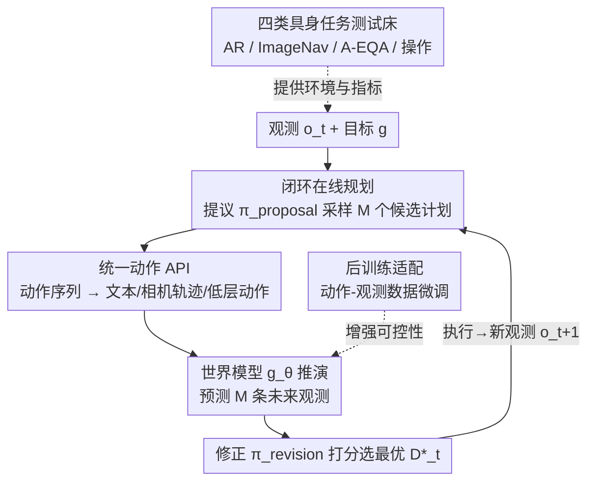

# World-In-World: World Models in a Closed-Loop World

**会议**: ICLR 2026  
**论文**: [Project Page](https://world-in-world.github.io/)  
**代码**: https://world-in-world.github.io/ (有，开放平台)  
**领域**: 机器人 / 具身智能  
**关键词**: 世界模型, 闭环评测, 在线规划, 具身智能, 后训练

## 一句话总结
这篇论文提出 World-In-World——第一个把生成式世界模型放进**闭环具身环境**里评测的开放平台，用统一的"提议-模拟-修正"在线规划策略和统一动作 API 接入各种异构世界模型，以**任务成功率而非画质**作为主指标，并发现了三个反直觉结论：画质好不等于任务成功（可控性更重要）、用动作-观测数据后训练比换更强的预训练视频生成器更有效、增加推理时计算量能显著提升闭环表现。

## 研究背景与动机
**领域现状**：视频生成、3D/4D 场景生成近年进步飞快，生成式世界模型（World Model, WM）已经能合成视觉上极其逼真的世界。给定智能体的初始观测和一个候选动作，这类模型可以预测出执行后会看到的视频，相当于一个"动作条件下的环境模拟器"，理论上能为具身智能体提供"预测式感知"来辅助决策。

**现有痛点**：但社区缺一个从**具身交互**视角评测世界模型的统一基准。现有评测套件——VBench 看视频生成质量、WorldModelBench 看视觉合理性、WorldScore 评估"图像+相机轨迹"输入的模型——几乎都是**开环（open-loop）**协议：只孤立地打量单帧/单段视频好不好看，却回答不了那个真正核心的问题——**世界模型到底能不能帮智能体把具身任务做成？**

**核心矛盾**：画质（visual quality）和具身效用（embodied utility）之间被默认是正相关的，但从没人在闭环里验证过。一个画面华丽却对低层控制响应不准的模型，可能在真实"感知-规划-控制-重规划"的回路里毫无用处。开环评测系统性地放大了画质、掩盖了可控性这个对决策真正重要的维度。

**本文目标**：(1) 搭一个能让异构世界模型公平接入的闭环评测平台；(2) 以任务成功率为主指标，重新审视"画质 vs 任务成功"的关系；(3) 刻画世界模型在具身场景下的数据/推理扩展规律。

**切入角度**：把世界模型当成预测式控制（predictive control）里的"模拟器"，包进一个真实的智能体-环境交互回路里——智能体在真正动手之前，先用世界模型"在脑内"预演若干候选动作的后果，再挑最好的执行。这正是人类心智模型（mental model）的工作方式。

**核心 idea**：用"提议-模拟-修正"的策略引导式束搜索（policy-guided beam search）作为统一闭环规划骨架，配一个把异构动作映射成各模型所需控制输入的统一动作 API，让所有世界模型在同一套协议下按**闭环任务成功率**排名——世界模型应"以闭环成功论生死，而非以完美画面论英雄"。

## 方法详解

### 整体框架
World-In-World 本质是一个**评测平台 + 一套通用规划接口**，而不是一个新的世界模型。它的运行核心是一个在每个时间步反复执行的闭环：在时间步 $t$，智能体拿到当前自我中心观测 $o_t$ 和任务目标 $g$，先用**提议策略** $\pi_{\text{proposal}}$ 采样出 $M$ 个候选动作计划；统一动作 API $\mathcal{C}$ 把每个计划翻译成目标世界模型能吃的控制输入（文本/相机轨迹/低层动作）；世界模型 $g_\theta$ 对每个候选做反事实推演（counterfactual rollout），预测出对应的未来观测 $\hat{O}_t^{(m)}$；**修正策略** $\pi_{\text{revision}}$ 给所有推演打分、选出最优决策 $D_t^\star$ 并在真实环境里执行，拿到新观测 $o_{t+1}$，再进入下一轮。这套循环可形式化为**策略引导的束搜索**：束宽就是候选数 $M$。

在这个回路之外，平台还提供了第三块：一个把预训练视频生成器**后训练**成更称职的具身世界模型的配方，以及四个标准化的闭环任务环境作为测试床。整体可以分成四个贡献组件，串成下面的管线：

### 关键设计

**1. 闭环在线规划：提议-模拟-修正的策略引导束搜索**

针对开环评测"只看一帧好不好看、不看决策成不成"的痛点，本文把世界模型嵌进一个真实的预测-控制回路。整套策略形式化为束宽为 $M$ 的束搜索，每步三个阶段：**提议**阶段，提议策略从动作空间采样 $M$ 个候选动作序列 $\hat{A}_t^{(m)} \sim \pi_{\text{proposal}}(\mathcal{A}\mid o_t, g)$，每个序列长度为规划视野 $L$；**模拟**阶段，世界模型对每个候选做反事实推演 $\hat{O}_t^{(m)} \sim g_\theta(\mathcal{O}\mid o_t, I_t^{(m)})$，预测未来 $L$ 步的观测；**修正**阶段，修正策略综合所有 (候选计划, 推演结果) 给出最优决策：

$$D_t^\star = \pi_{\text{revision}}\big(\{(\hat{A}_t^{(m)}, \hat{O}_t^{(m)})\}_{m=1}^M, o_t, g\big)$$

一个常见实例把 $\pi_{\text{revision}}$ 写成"打分-选择"算子 $S$，即 $m^\star = \arg\max_m S(\hat{A}_t^{(m)}, \hat{O}_t^{(m)}\mid o_t, g)$，$S$ 是任务相关的评分函数（估计候选计划的期望回报）。关键在于 $D_t^\star$ 不一定是动作序列——它可以是一个高层答案、一个识别结果，也可以是新合成的动作，这让该框架比经典模型预测控制（MPC，只在动作序列上优化）更通用。$\pi_{\text{proposal}}$ 和 $\pi_{\text{revision}}$ 都可灵活实例化：可以是大型视觉语言模型、扩散策略，也可以是简单的规则启发式。

**2. 统一动作 API：把异构动作翻译成各模型需要的控制输入**

不同世界模型吃的输入格式天差地别——有的要文本提示、有的要相机轨迹、有的要低层动作向量。如果不统一，根本没法在同一套协议下公平比较。统一动作 API $\mathcal{C}$ 把智能体的抽象动作序列 $A$ 映射成控制输入 $I = \mathcal{C}(A)$，支持三类控制信息：(1) **文本提示**——对图文到视频的模型，用预定义模板把每个原子动作转成短语再拼接成 $I_{\text{text}}$；(2) **相机轨迹/视点**——对吃显式视点的模型，把动作翻译成相机轨迹，例如每个平移动作让相机移动 0.2 m、每个旋转动作改变方位角 22.5°，得到序列 $\{(x_k, y_k, \phi_k)\}_{k=1}^K$；(3) **低层动作**——对吃离散/连续低层动作的模型，把动作序列映射到该模型的动作词表 $A_{\text{world}}$。这层翻译保证了智能体动作与各模型输入之间一一对应、语义一致，是"异构模型一键接入"的关键。

**3. 四类具身任务测试床：覆盖感知/导航/操作的互补能力**

光有规划骨架还不够，得有能逼出世界模型短板的任务。本文精选四个互补任务：**主动识别（AR）**——智能体在遮挡/极端视角下识别指定目标，同时尽量少走路（Habitat-Sim，551 个 episode/29 个场景，来自 Matterport3D）；**图像目标导航（ImageNav）**——给一张目标视点图，智能体要走到对应位置（144 个 episode/87 个 HM3D 场景）；**主动具身问答（A-EQA）**——主动探索 3D 环境后回答开放式问题（184 题/54 个室内场景，OpenEQA+HM3D）；**机器人操作（Manipulation）**——控制机械臂完成抓取/放置（4 个 RLBench 任务，每个 50 episode，评估 7-DoF 夹爪动作）。这四个任务分别压测感知、导航、问答推理和接触丰富的物理操作，让世界模型的能力边界（尤其是它在精细动力学上的薄弱）暴露无遗。

**4. 后训练适配：用少量动作-观测数据把视频生成器调成称职世界模型**

预训练视频生成器虽然画面漂亮，却只受文本提示驱动、缺乏对低层控制的精细响应，零样本直接用收益有限。本文提出一个后训练配方：用目标环境**同一动作空间**的动作-观测数据微调预训练模型，让它对齐到下游任务的域分布和动作空间。具体在两个模拟器上分别微调——Habitat-Sim 任务（AR/A-EQA/ImageNav）用 HM3D 训练集采集的全景动作-观测数据集，CoppeliaSim 任务（操作）用 RLBench 生成的演示。关键细节：所有用于后训练的 Habitat-Sim 数据来自**与评测场景不相交**的场景，保证评测时场景对世界模型仍是未见的，测的是泛化而非记忆。正是这一步把"画质好但不可控"的模型变成了"对低层动作可靠响应"的具身世界模型，也由此刻画出动作条件后训练的数据扩展规律。

### 一个完整示例：AR 任务里的一步决策
以主动识别为例走一遍闭环：智能体站在某个视角，目标是识别红框标出的目标物体，但当前视角被遮挡。**提议**：VLM 提议策略采样出 $M$ 个候选探索计划（如"左转后前进""右转绕到侧面"等）。**翻译**：统一动作 API 把每个计划转成 Wan2.1 需要的控制输入（动作→相机轨迹/低层动作）。**模拟**：后训练过的世界模型 Wan2.1† 对每个候选推演出未来会看到的视图——比如"绕到侧面"那条预测出能看到物体的完整轮廓。**修正**：修正策略给每条推演打分，发现"绕到侧面"最可能露出关键证据，于是 $D_t^\star$ 选它。智能体执行第一段动作，拿到新观测后重新进入提议-模拟-修正回路。靠这种"先脑内预演再行动"，Runway Gen4 把 AR 准确率从 VLM 基线的 50.27% 提到 64.79%，平均步数从 6.24 降到 4.06。

### 损失函数 / 训练策略
后训练对每个世界模型只跑一个 epoch，数据规模从 400 到 80K 实例不等（用于刻画数据扩展曲线）。训练目标、数据集构建与训练配置细节见原文附录 C/D（⚠️ 以原文为准）。规划侧的"推理时扩展"则通过调节每个 episode 的平均世界模型推理次数（即模拟的潜在未来数）实现，无需额外训练。

## 实验关键数据

### 主实验
覆盖图像类（PathDreamer、SE3DS）与视频类（SVD、LTX-Video、Hunyuan、Wan2.1/2.2、Cosmos-Predict2、NWM、Runway Gen4）世界模型，"†"表示本文后训练版本。

| 任务 | 配置 | 主指标 | 基线(无 WM) | 接入 WM 后 |
|------|------|--------|-------------|-----------|
| AR | Runway Gen4 (闭源) | 准确率↑ / 平均步数↓ | VLM 50.27% / 6.24 | **64.79% / 4.06** |
| ImageNav | Wan2.1† | 成功率↑ / SPL↑ | VLM 35.42% / 25.88 | **45.14% / 32.10** |
| A-EQA | Wan2.2†(A14B) | 答案分↑ / SPL↑ | VLM 45.7 / 29.6 | **48.4 / 31.9** |
| 操作 | SVD† | 成功率↑ / 平均轨迹↓ | VLM 44.5% / 2.52 | 46.5% / 2.38 |
| 操作 | SVD† | 成功率↑ | 3D-DP 24.0% | **44.7%** |

跨四个任务，接入世界模型几乎都能稳定提升基础提议策略的表现；但操作任务提升最小（46.5% vs 44.5%），因为接触丰富的交互和机器人运动学远比纯视角变化难以精确模拟。

### 消融实验

| 配置/变量 | 关键指标 | 说明 |
|----------|---------|------|
| 后训练数据 400→80K | AR SR 60.25%→63.34% (Wan2.1†) | 数据扩展律：数据越多越好，大模型(14B)更不易饱和 |
| 推理次数 3→11 (SVD†) | AR SR 53.36%→60.98% | 推理时扩展：每步模拟更多未来→决策更准 |
| 后训练 vs 现成 (Wan2.1) | AR 58.26%→62.61%；ImageNav 38.19%→45.14% | 后训练适配显著提升效用 |
| 全景 vs 前视输入 | AR/ImageNav 互有胜负 | 全景全局信息更丰富，但转视角有分辨率损失，未必稳赢 |
| 可控性 vs 画质 (AR) | 可控性与 SR 正相关更强 | 可控性 = 1−LPIPS(真值,预测)，比画质更能预测成功 |

### 关键发现
- **画质不等于任务成功，可控性才是关键**：图 2/图 5 显示画质（美学+图像质量分）与 SR 的相关性很弱，而可控性（动作意图与预测运动的对齐度，量化为 1−LPIPS）与 SR 正相关明显更强。对低层控制响应可靠的模型才能真正帮上决策。
- **后训练比换更强的预训练生成器更划算**：Wan2.2†(A14B) 尽管 web 视频预训练规模大得多，在 40K 后训练实例后也只追平 Wan2.1†——说明扩展动作条件后训练比升级预训练生成器对具身效用更有效。
- **推理时算力可换性能**：把每步模拟的潜在未来数从 3 增到 11，SVD† 的 AR SR 从 53.36% 升到 60.98%，呈清晰正相关。
- **操作仍是开放难题**：当前视觉世界模型擅长引导感知与导航，但对精细物理动力学、动作条件下的物体运动建模仍力不从心。

## 亮点与洞察
- **把"评测范式"本身当成贡献**：从"画质中心的开环"转向"任务成功中心的闭环"，一句"world models live and die by their closed-loop success, not flawless generated visuals"点破了整个领域的评测错位，价值不亚于一个新模型。
- **策略引导束搜索 = 比 MPC 更通用的决策骨架**：$D_t^\star$ 可以是答案/识别结果/动作，把 MPC 从"只优化动作序列"解放出来，让同一套框架横跨识别、问答、导航、操作四类异质任务。
- **统一动作 API 是工程上的关键巧思**：文本/相机轨迹/低层动作三类控制信息的适配层，让异构世界模型"一键接入"同一评测协议，这种解耦设计可直接迁移到任何需要对接多种生成式模拟器的系统。
- **首次给出具身设定下的世界模型数据扩展律**：把"数据规模 vs 任务成功率"画成曲线，并指出大模型吸收动作条件监督的容量更大，对后续"该把算力花在预训练还是后训练"有直接指导意义。

## 局限与展望
- **操作任务提升有限**：接触丰富的物理动力学和机器人运动学还无法被当前视觉世界模型精确模拟，操作 SR 仅微涨，是明确的开放难题。
- **全景输入未必划算**：全景转透视视图带来分辨率损失，全局上下文的优势被抵消，说明输入格式的设计还需精细权衡。
- **评分函数 $S$ 的设计是任务相关的**：修正策略依赖任务特定的打分函数，框架虽通用，但每个新任务仍需人工设计或训练合适的 $S$，这部分的通用化未充分展开。
- **后训练细节依赖附录**：训练目标与数据集构建的具体公式正文未给全，复现需对照附录（⚠️ 以原文为准）。

## 相关工作与启发
- **vs VBench / WorldModelBench**: 它们评视频生成质量/视觉合理性（开环、画质中心），本文评闭环任务成功率（具身效用中心），区别在于是否把模型放进真实交互回路——本文证明画质高分并不保证任务成功。
- **vs WorldScore**: WorldScore 统一评测"图像+相机轨迹"输入的模型，但仍不测生成世界是否真能增强具身推理与任务表现；本文补上了"能不能帮智能体把任务做成"这一缺失维度。
- **vs 经典 MPC**: MPC 在动作序列上做优化，本文的修正策略可输出答案/识别结果/新动作，决策空间更广，框架更通用。

## 评分
- 新颖性: ⭐⭐⭐⭐⭐ 首个闭环具身世界模型评测平台，三个反直觉结论改变领域认知
- 实验充分度: ⭐⭐⭐⭐⭐ 四任务、十余个世界模型、数据/推理双扩展律、多组消融
- 写作质量: ⭐⭐⭐⭐ 框架形式化清晰，部分训练细节下沉到附录
- 价值: ⭐⭐⭐⭐⭐ 重新定义世界模型该怎么评，对具身 AI 与生成模型社区都有方向性影响

<!-- RELATED:START -->

## 相关论文

- [\[ICLR 2026\] Empowering Multi-Robot Cooperation via Sequential World Models](empowering_multi-robot_cooperation_via_sequential_world_models.md)
- [\[ICLR 2026\] Test-Time Mixture of World Models for Embodied Agents in Dynamic Environments](test-time_mixture_of_world_models_for_embodied_agents_in_dynamic_environments.md)
- [\[ICLR 2026\] WMPO: World Model-based Policy Optimization for Vision-Language-Action Models](wmpo_world_model-based_policy_optimization_for_vision-language-action_models.md)
- [\[CVPR 2026\] Dexterous World Models](../../CVPR2026/robotics/dexterous_world_models.md)
- [\[ICLR 2026\] WorldGym: World Model as an Environment for Policy Evaluation](worldgym_world_model_as_an_environment_for_policy_evaluation.md)

<!-- RELATED:END -->
