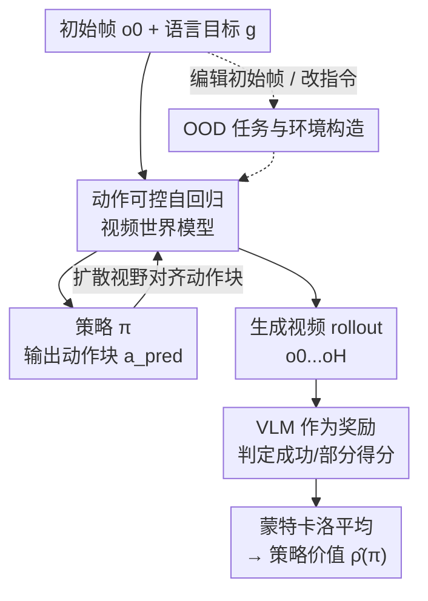

# WorldGym: World Model as an Environment for Policy Evaluation

**会议**: ICLR 2026  
**论文**: [项目页](https://world-model-eval.github.io)  
**代码**: https://world-model-eval.github.io (有)  
**领域**: 机器人 / 世界模型 / 策略评估  
**关键词**: 世界模型, 离线策略评估, VLA 策略, 动作条件视频生成, 蒙特卡洛 rollout

## 一句话总结
本文训练一个动作条件的自回归视频世界模型 WorldGym，把它当作"虚拟环境"让机器人策略在里面跑 rollout、用 VLM 打分，从而在真机部署前就估出策略成功率——实验证明世界模型里的成功率与真实世界成功率高度相关（Pearson r=0.78），且能保持不同版本/规模/训练步数策略之间的相对排名。

## 研究背景与动机
**领域现状**：机器人控制策略的评估一直是个老大难。传统做法要么是真机测试，要么是手工搭建的物理仿真器（MuJoCo、Drake 等）。

**现有痛点**：真机测试又慢又贵，还有损坏硬件的风险，一轮完整评测往往要好几天；手工仿真器则需要大量人力去建模复杂动力学，尤其是软体操作、高自由度交互这类很难硬编码的场景，导致顽固的 sim-to-real gap。

**核心矛盾**：评估需要一个"既真实又通用"的环境，但手工仿真器在真实性和通用性之间天然受限——你越想覆盖更多任务/物体，建模代价越爆炸。与此同时，基于模型的强化学习（model-based RL）虽然学过"从经验里学动力学再 rollout"，但大多局限在单任务设定，而单任务下学动力学往往比直接学策略还难，所以一直竞争不过 model-free 方法。

**本文目标**：用一个**单一**世界模型当作可交互环境，去评估**任意策略在任意任务上**的表现，且只需一张初始帧作为输入。

**切入角度**：作者抓住一个关键观察——任务和策略可以有无数个，但我们生活的物理世界只有一个、遵循同一套物理定律。所以学单个世界模型可以汇聚来自不同任务/不同环境/不同机器人形态的多样数据，反而比单任务设定更有利；而且世界模型可以直接在图像观测上训练，正好匹配真实机器人的感知模态。

**核心 idea**：训一个动作条件的自回归视频生成模型当"通用模拟器"，让策略在里面做蒙特卡洛 rollout、用 VLM 当奖励函数判断任务是否成功，以此估计策略价值。

## 方法详解

### 整体框架
WorldGym 把"离线策略评估（OPE）"重新框定为：在一个学到的世界模型 $\hat{T}(\cdot\mid o,a)$ 里做蒙特卡洛 rollout。给定初始观测 $o_0$ 和语言目标 $g$，策略 $\pi$ 与世界模型构成一个闭环：策略看当前帧 → 吐出一段动作块 $a_{\text{pred}}$ → 世界模型把每个动作渲染成新帧 → 最新帧又回灌给策略，如此往复几百步。整段生成的视频 rollout 最后交给一个 VLM（GPT-4o）判定任务是否成功，得到奖励，再对多次随机 rollout 求平均，就得到策略价值估计 $\hat{\rho}(\pi)$：

$$\hat{\rho}(\pi)=\mathbb{E}\big[\hat{R}([o_0,\dots,o_H],g)\,\big|\,a\sim\pi(o,g),\,o'\sim\hat{T}(o,a),\,o=o'\big]$$

因为整个环境只需要一张初始帧来初始化，作者还能直接编辑这张初始帧（用图像生成模型加物体/换颜色）或改语言指令，"凭空造出" OOD 任务和环境来压测策略的泛化能力。

### 关键设计

**1. 动作可控的自回归视频世界模型：让生成的每一帧都听机器人动作的话**

世界模型必须做到两点：能根据动作精确预测下一帧，又能自回归地一直滚下去。作者在帧-动作配对序列上训练一个 latent Diffusion Transformer，并用 **Diffusion Forcing** 来支持自回归逐帧生成。动作如何注入是关键——每帧的机器人动作向量先线性投影到模型维度，再**逐元素加到扩散时间步嵌入上**，然后通过 AdaLN-Zero 调制去 condition 整个模型（类比 DiT 里的类别条件）。光这样还不够"听话"：作者发现如果不强制，模型容易忽略动作信号自顾自地按视频先验生成，于是提出**整段视频随机丢弃动作（action dropout）**，再配合 classifier-free guidance，把"有动作条件 vs 无动作条件"的预测差放大，显著提升世界模型对动作输入的服从度。帧间的时序依赖则靠**因果时序注意力块**（穿插在空间注意力块之间）实现，保证生成第 $t$ 帧时只能看过去、不能偷看未来。

**2. 扩散视野长度对齐动作块大小：一个模型高效适配各种策略**

不同机器人策略一次输出的动作数量不一样（有的吐 1 步，有的吐一整块 chunk）。如果世界模型固定一次只能并行去噪 $k$ 帧，就会很别扭——动作块比 $k$ 小时浪费算力，比 $k$ 大时又吃不满并行度。得益于 Diffusion Forcing 训练 + 因果时序注意力掩码，WorldGym 可以在推理时**灵活控制一次并行去噪多少帧**，作者据此提出把扩散视野长度直接设成策略当前动作块大小 $|a_{\text{pred}}|$。这样同一个世界模型 checkpoint 就能高效服务动作块大小各异的策略，且并行度刚好匹配动作数、把硬件吃满。这与 Cosmos 等先前扩散世界模型形成对比——后者因双向注意力 + 固定上下文长度，必须每次并行去噪 16 个 latent 帧，块小则浪费、块大则并行度发挥不出来。

**3. VLM 作为奖励函数：用 GPT-4o 读视频判成败，还能给部分得分**

稀疏奖励设定下，任务成功与否本身就是个视觉-语言判断问题。作者直接用 GPT-4o 当奖励模型，把生成 rollout 的帧序列 + 语言指令一起喂进去，让它判定任务是否完成。更巧的是，当两个被比较的策略都没能端到端完成任务时，单纯的 0/1 奖励区分不出谁更好，于是作者给 VLM 指定**部分得分（partial credit）准则**——比如"谁离完成更近"——把这种以前需要人工启发式打分的环节自动化，从而在两个都失败的策略间也能拉开区分度。

**4. 单帧初始化 → 快速构造 OOD 任务与环境：把"泛化测试"变成改图/改指令**

因为整个评测环境只需一张初始帧来初始化，作者得以用极低成本创造分布外（OOD）场景，无需真机也无需重写仿真器。具体两条路：一是**编辑初始图像**——用 Nano Banana 等图像编辑模型往场景里加未见过的物体、加干扰物（distractor）、或改物体颜色/形状，再让世界模型从这张编辑后的图滚出去；二是**改语言指令**——保留初始帧但换掉目标物体或目标位置，构造 OOD 语言任务。这套设计让作者得以系统地探测现代 VLA 策略的盲点：例如发现 OpenVLA 仍难以单凭形状区分胡萝卜和橙子（只有把胡萝卜染红后才稳定抓对橙子），还会被屏幕上显示的物体图像（2D 假象）骗到、误抓笔记本电脑。

### 损失函数 / 训练策略
世界模型本质是个 latent DiT，用 Diffusion Forcing 的逐帧加噪/去噪目标训练；动作通过加到扩散时间步嵌入 + AdaLN-Zero 注入，并以一定概率整段丢弃动作以支持 classifier-free guidance。训练数据来自 Open-X Embodiment 等多任务多形态机器人数据。奖励模型不训练，直接用现成 GPT-4o。被评估的策略（RT-1-X、Octo、OpenVLA 等）以及从头训的视频策略（UniPi）和扩散策略（DexVLA）都在 Bridge V2 上训练，世界模型本身不动。

## 实验关键数据

### 主实验：世界模型成功率 vs 真实世界成功率
在 OpenVLA 的 Bridge 评测套件（17 个不在 Bridge V2 训练集中的挑战任务，每任务 10 trials）上，用真机记录的初始帧在 WorldGym 里 rollout 三个开源 VLA 策略，对比它们在世界模型里和真实世界里的成功率：

| 策略 | 真实世界成功率 | 世界模型成功率 | 差值 |
|------|--------------|--------------|------|
| RT-1-X | 18.5% | 15.5% | ~3% |
| Octo | 20.0% | 23.8% | ~3.8% |
| OpenVLA | 70.6% | 67.4% | ~3.2% |

- 逐任务相关性 Pearson **r = 0.78（p < 0.001）**；三个策略的平均成功率与真实世界平均仅差 **3.3%**，落在各策略标准误范围附近。
- 三者相对排名（OpenVLA > Octo > RT-1-X）在世界模型与真实世界中**完全一致**。

### 排名保持 / OOD 退化分析

| 评测设定 | 关键结果 | 说明 |
|---------|---------|------|
| 不同版本/规模 | Octo-Base 1.5 > Octo-Small 1.5；OpenVLA 7B(67.4%) ≫ OpenVLA v0.1 7B(27.6%) | 更大更新的模型得分更高，与真机结论一致 |
| 不同训练步数 | 视频策略(UniPi)、扩散策略(DexVLA)成功率随训练步数单调上升 | 与验证集 MSE 下降一致，可用于 checkpoint 选择 |
| OOD 干扰物（加 distractor） | RT-1-X 15.6%→7.6%（降 51%）；Octo 23.8%→4.1%（降 83%）；OpenVLA 67.4%→39.4%（降 41.5%） | OpenVLA 最鲁棒 |
| OOD 语言指令 | "Move the pot to the counter" 几乎全军覆没，仅 OpenVLA 成功 1 次 | Bridge 数据没有把物体移出水槽的轨迹 |

### 关键发现
- **世界模型成功率与真机高度相关**是核心卖点：r=0.78、平均差 3.3%，意味着可在真机评测前用不到 1 小时（单 GPU）替代原本要数天的真机测试。
- **相对排名比绝对数值更可靠**：跨版本、跨规模、跨训练步数都保住了排名，这对超参调优和 checkpoint 选择最有用。
- **OOD 探测暴露 VLA 盲点**：现代 VLA 仍难凭形状区分物体、会被 2D 假象干扰；OpenVLA 凭更强语言 backbone + 更丰富预训练数据，在 OOD 语言/图像上都最稳。

## 亮点与洞察
- **"世界只有一个"这个朴素观察**是全文立论的支点——它把 model-based RL "单任务下学动力学比学策略还难"的劣势，翻转成"多任务数据共享同一物理规律"的优势，从而让单个世界模型评估任意策略变得合理。
- **扩散视野对齐动作块**是个很实用的工程巧思：一个 checkpoint 适配所有动作块大小，避免了 Cosmos 那种固定 16 帧并行的浪费，可直接迁移到任何需要变长 rollout 的扩散世界模型。
- **只需一张初始帧 + 编辑图像/指令就能造 OOD 环境**，把"泛化性测试"的成本从"搭真机/写仿真"降到"P 个图、改句话"，这是把生成模型当评测环境最香的红利。
- **VLM 部分得分**把以前的人工启发式打分自动化，还能在两个都失败的策略间拉开区分度，是个可复用的评估 trick。

## 局限与展望
- **物体交互的真实感仍是短板**：作者坦承生成高度真实的物体交互（尤其接触、形变）依然困难，世界模型更擅长还原机器人本体运动而非精细物体动力学，所以更适合做 sanity check 而非完全替代真机。
- **奖励依赖 GPT-4o**：评测质量受 VLM 判断准确度上限制约，闭源模型也带来成本与可复现性问题（论文在附录验证 VLM 奖励准确度）。
- **绝对成功率仍有偏差**：逐任务成功率与真机有出入（靠平均和排名才稳），对需要精确绝对值的场景要谨慎。⚠️ 具体相关系数与逐任务数值以原文表格为准。
- 改进方向：提升世界模型对接触/软体交互的物理保真度、引入更强或开源的奖励模型、把 OOD 构造做成系统化的对抗性评测基准。

## 相关工作与启发
- **vs 手工仿真器（MuJoCo/Drake）**：它们靠人工建模物理、有 sim-to-real gap 且难覆盖复杂动力学；WorldGym 从真实视频数据学动力学、直接在图像观测上 rollout，省去建模人力但牺牲了部分物体交互真实感。
- **vs 单任务 model-based RL（Dreamer 等）**：它们在单任务下学动力学，吃亏于"学动力学比学策略难"；本文靠多任务多形态数据训单一世界模型，把这个劣势反转。
- **vs Cosmos 等扩散世界模型**：Cosmos 双向注意力 + 固定上下文必须并行去噪 16 帧；WorldGym 用 Diffusion Forcing + 因果注意力实现变长视野，灵活匹配动作块、更省算力。
- **vs 传统 OPE**：以往 OPE 多假设全可观、能访问真值状态，偏理论仿真设定；本文面向真实机器人系统（图像观测、高控制频率、无真值状态），更贴近落地评测需求。

## 评分
- 新颖性: ⭐⭐⭐⭐⭐ 把视频世界模型当作通用策略评测环境，并系统验证其与真机的相关性，角度新颖且实用。
- 实验充分度: ⭐⭐⭐⭐ 覆盖相关性、排名保持、跨版本/规模/训练步、OOD 图像与语言多维验证，但绝对数值偏差和物体交互真实感是已知短板。
- 写作质量: ⭐⭐⭐⭐⭐ 立论清晰（"世界只有一个"），方法与实验衔接顺畅，大量定性可视化。
- 价值: ⭐⭐⭐⭐⭐ 真机评测前的安全、可复现、低成本 sanity check 工具，对机器人策略迭代实用价值高。

<!-- RELATED:START -->

## 相关论文

- [\[ICLR 2026\] WMPO: World Model-based Policy Optimization for Vision-Language-Action Models](wmpo_world_model-based_policy_optimization_for_vision-language-action_models.md)
- [\[ICLR 2026\] World-In-World: World Models in a Closed-Loop World](world-in-world_world_models_in_a_closed-loop_world.md)
- [\[ICLR 2026\] Ctrl-World: A Controllable Generative World Model for Robot Manipulation](ctrl-world_a_controllable_generative_world_model_for_robot_manipulation.md)
- [\[ICLR 2026\] Sparse Imagination for Efficient Visual World Model Planning](sparse_imagination_for_efficient_visual_world_model_planning.md)
- [\[CVPR 2026\] Chain of World: World Model Thinking in Latent Motion (CoWVLA)](../../CVPR2026/robotics/chain_of_world_world_model_thinking_in_latent_motion.md)

<!-- RELATED:END -->
