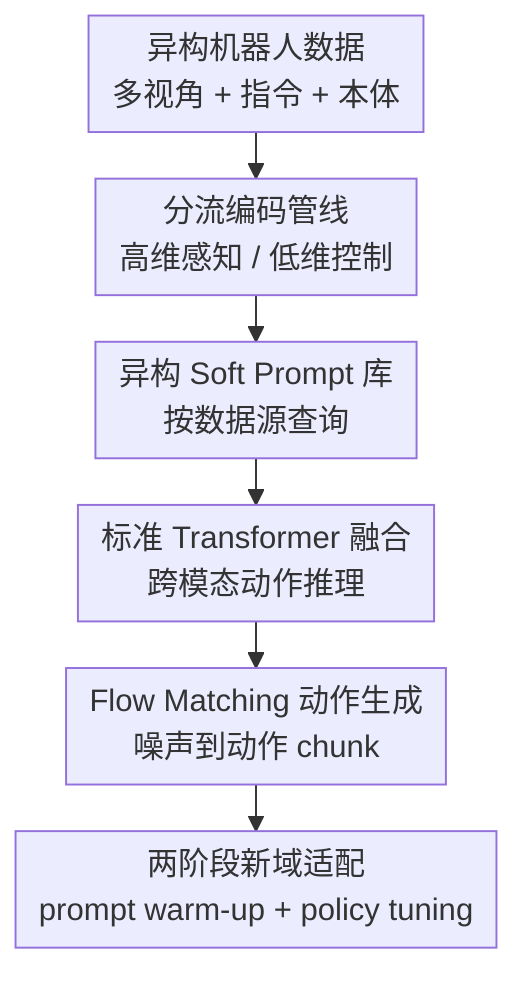

# X-VLA: Soft-Prompted Transformer as Scalable Cross-Embodiment Vision-Language-Action Model

**会议**: ICLR2026  
**OpenReview**: [https://openreview.net/forum?id=kt51kZH4aG](https://openreview.net/forum?id=kt51kZH4aG)  
**论文**: [项目主页](https://thu-air-dream.github.io/X-VLA/)  
**代码**: 待确认  
**领域**: 机器人 / 跨本体 Vision-Language-Action  
**关键词**: 跨本体机器人, VLA, soft prompt, flow matching, 机器人预训练  

## 一句话总结
X-VLA 把每个机器人数据源的硬件与采集差异编码成一组可学习 soft prompt，并配合简洁的 Transformer + flow matching 动作生成框架，在大规模异构机器人数据预训练后实现强跨本体适配。

## 研究背景与动机
**领域现状**：通用机器人策略正在从单任务模仿学习走向 Vision-Language-Action 模型：模型接收多视角图像、自然语言指令和本体状态，再输出未来一段动作。近年的 RT 系列、OpenVLA、$\pi_0$、GR00T 等工作都在尝试把 VLM 的开放词汇理解能力和机器人动作生成结合起来，让一个模型覆盖多机器人、多任务、多环境。

**现有痛点**：真正难的地方不是只把动作维度对齐。大规模机器人数据来自不同硬件平台、不同相机位置、不同控制频率、不同任务分布和不同采集规范；同一句“把物体放进容器”，在 Franka、UR5、AgileX 双臂或 WidowX 上对应的视觉视角、本体状态含义和动作尺度都不同。很多已有 VLA 主要给不同 embodiment 配不同动作头，能处理最后的动作空间差异，却没有在早期感知和推理阶段告诉模型“这批 token 来自什么机器人、什么相机、什么控制接口”。

**核心矛盾**：跨本体预训练需要共享 backbone 来沉淀通用操作知识，但异构数据又会把 backbone 拉向互相冲突的分布。若完全共享，模型会在混合数据上出现语义错位和训练不稳定；若给每个机器人分太多专属参数，又失去可扩展性，也削弱跨机器人知识迁移。

**本文目标**：作者希望找到一种低成本的异构建模方式：既能显式吸收硬件、相机和数据源差异，又不破坏预训练 VLM 的表示；既能在 7 个数据源、29 万条轨迹上稳定预训练，又能在新机器人上用少量参数快速适配。

**切入角度**：论文把“不同机器人数据源”重新看作多任务学习里的“不同任务”。在 NLP 里，soft prompt 可以用少量可学习 token 引导大模型适配特定任务；迁移到机器人后，每个数据源也可以有自己的 prompt token，用端到端训练自动学习硬件配置的隐表示，而不需要人工写一段机器人描述。

**核心 idea**：用数据源级 soft prompt 在早期多模态融合阶段注入 embodiment 信息，让共享 Transformer backbone 学到更干净的跨本体通用策略，同时把机器人特有差异留给轻量 prompt 和动作投影来吸收。

## 方法详解

### 整体框架
X-VLA 是一个基于 flow matching 的 VLA 策略模型。它输入主视角图像、可选辅助视角、语言指令、本体状态、噪声动作 chunk 和连续时间 $t$，通过各自的编码管线变成 token，再拼接对应数据源查询到的 soft prompt，最后用一叠标准 self-attention Transformer encoder 做跨模态推理并预测动作速度场。

训练分成两个阶段：第一阶段在 AGIBOT、Droid、RoboMind 等 7 个硬件/相机配置上联合预训练 backbone 与 soft prompt；第二阶段面向新机器人或新任务时先冻结 backbone 只 warm-up 新 prompt，再联合微调整个策略，或用 LoRA 这类 PEFT 只调很少参数。

### 关键设计
**1. 异构 Soft Prompt 库：把机器人差异提前注入共享推理空间**

跨本体数据的麻烦在于，差异不仅出现在动作输出端，也出现在感知和本体状态如何解释上。X-VLA 给每个数据源 $D_i$ 维护一组可学习 prompt token $p_i$，训练时根据 dataset id 查询对应 prompt，并把它们与图像、语言、本体和动作 token 一起送入 Transformer。作者将其形式化为 $p_i \approx \Phi(h_i)$：$h_i$ 是硬件配置，$\Phi$ 不是人工定义的文本模板，而是在训练中隐式学出来的 prompt 空间映射。

这个设计比“每个机器人一个动作头”更早介入推理过程，也比 language prompt 更省人工。动作头只能在最后输出时处理动作维度，无法告诉模型主视角和腕视角分别意味着什么；手写语言描述又依赖模板质量，扩展到大量机器人时维护成本高。soft prompt 则用很少参数让 backbone 在 attention 里主动感知“当前样本属于哪个硬件/采集域”，从而减少混合数据带来的表示冲突。

**2. 分流编码管线：把 VLM 擅长的语义理解和机器人细粒度观测拆开**

X-VLA 没有简单地把所有图像和语言一股脑塞进 VLM。主视角图像与语言指令进入 Florence-2-Large 这类预训练 VLM 编码器，用来承担高层视觉语言 grounding；腕部等辅助视角则用共享视觉 backbone 编码，因为这些视角变化快、噪声大，更偏向局部操作线索而不是通用语义理解。

低维部分也单独处理：本体状态 $R_t$、flow matching 中的噪声动作 chunk $A_t$ 和时间嵌入 $t$ 被拼接后经轻量线性层投到高维 token 空间。这样做的关键不是追求复杂结构，而是让不同模态先在适合自己的尺度上被整理好，再交给标准 Transformer 融合。结果是模型既保留 VLM 的视觉语言能力，又不会让本体和动作 token 在语义维度上被高维图文特征淹没。

**3. Flow Matching 动作生成：用连续去噪过程预测未来动作轨迹**

X-VLA 不直接回归单步动作，而是学习从随机噪声到专家动作 chunk 的速度场。给定专家动作序列 $A$ 和噪声 $A_0 \sim \mathcal{N}(0, I)$，训练时构造插值 $A_t=(1-t)A_0+tA$，让网络预测从 $A_t$ 指向目标动作的速度 $A-A_0$。推理时从噪声开始，通过 ODE 更新逐步得到完整动作 chunk。

这个选择和机器人控制很契合：一个动作 chunk 包含未来短时轨迹，比单步控制更能表达意图；flow matching 又比离散动作 token 化更自然地处理连续末端位姿。论文还把动作统一成 end-effector pose：三维位置、Rotate6D 绝对旋转和二值夹爪状态，位置/旋转用 MSE，夹爪用 BCE，减少不同机器人控制接口之间的标签不一致。

**4. 两阶段适配与训练配方：先让新 prompt 找到位置，再让策略专门化**

新机器人适配时，X-VLA 不是直接全量微调。它先加入一组新的 soft prompt $p_{new}$，冻结预训练 backbone，只优化 prompt，让新硬件配置在已有跨本体表示空间里找到合适入口；随后再联合优化 prompt 和策略参数，或只用 LoRA 等 PEFT 调少量参数完成专门化。

作者还加入几项看似工程但很关键的稳定化处理：soft prompt 和视觉语言模块使用更小学习率，避免破坏预训练表示；预训练动作目标不是逐帧预测所有细碎运动，而是把未来 4 秒轨迹下采样成 30 个 anchor points，用更抽象的意图监督降低人类示教噪声；采样时同时跨 domain 和轨迹打乱，避免大数据源主导训练。这些配方共同解释了为什么 soft prompt 机制能在 29 万条异构轨迹上稳定放大，而不是只在小实验里有效。

### 一个完整示例
假设预训练 batch 里同时出现三类样本：AGIBOT 的头部/腕部三视角双臂数据、Droid 的 Franka 左视角/腕视角数据，以及 RoboMind 的 UR5 顶视角数据。传统共享 VLA 会把这些样本都送进同一套 backbone，只在最后用动作头区分输出；模型需要自己从图像和本体值里猜测硬件来源，容易把“相机位置变化”和“任务语义变化”混在一起。

在 X-VLA 里，AGIBOT 样本会查询 AGIBOT prompt，Droid-Left 样本会查询 Droid-Left prompt，UR5 样本会查询 UR5 prompt。主视角和语言先形成高层任务 token，腕视角形成局部操作 token，本体与噪声动作形成控制 token；这些 token 与对应 prompt 拼接后进入 Transformer。attention 可以在一开始就看到“这是三视角双臂”或“这是单臂顶视角”的软条件，于是同一个“pick and place”指令会在不同硬件上下文中被解释成不同的可执行动作轨迹。

适配到一个未见过的 WidowX 时，模型先初始化一组 WidowX prompt，并用少量示教只训练 prompt 与动作相关头部。这个过程相当于给新硬件找一个靠近已有单臂机器人 prompt 的位置；随后再联合微调或加 LoRA。论文的 prompt 可视化显示，训练后的 prompt 会按硬件配置聚成簇，Droid 的两个 Franka 视角甚至会互相交织，说明模型学到的不是粗暴的数据源编号，而是带有 embodiment 相似性的连续表示。

### 损失函数 / 训练策略
预训练目标是 flow matching 版行为克隆。给定观测 $o$、专家动作 chunk $A$、噪声 $A_0$ 和时间 $t \sim U(0,1)$，模型学习速度场 $v_\theta(A_t,o,t)$，优化目标为：

$$
L^{FM}_{BC}(\theta)=\mathbb{E}_{t,(o,A)}\left[\left\|v_\theta(A_t,o,t)-(A-A_0)\right\|^2\right],\quad A_t=(1-t)A_0+tA.
$$

X-VLA-0.9B 使用 Florence-2-Large 作为 VLM 编码器，动作生成 backbone 是 24 层、hidden size 1024 的标准 Transformer，soft prompt 长度为 32。预训练数据包含约 290K episodes，覆盖 AGIBOT、Droid 与 RoboMind 中 7 个数据源和 5 类机器人手臂，训练 200K iterations，global batch size 1024，AdamW 学习率 $1\times10^{-4}$。预训练后，新域适配先进行 1000 iteration 的 prompt/action head warm-up，再进入 joint training；PEFT 设置下只调约 9M 参数，约为 0.9B 模型的 1%。

## 实验关键数据

### 主实验
论文的主实验覆盖 6 个仿真环境和 3 个真实机器人平台。最核心结论是：X-VLA-0.9B 参数量只有 0.9B，但在多数 benchmark 上超过更大的 3B-9B VLA，并且在跨机器人、跨任务、跨环境和灵巧操作上都保持强结果。

| Benchmark | 指标 | X-VLA-0.9B | 之前最好结果 | 主要提升 |
|--------|------|------|----------|------|
| Simpler Visual Matching (Google) | Avg success | 80.4 | 78.0 | +2.4 |
| Simpler Visual Aggregation (Google) | Avg success | 75.7 | 72.7 | +3.0 |
| Simpler WidowX | Success | 95.8 | 71.9 | +23.9 |
| LIBERO Average | Avg success | 98.1 | 97.1 | +1.0 |
| RoboTwin-2.0 Easy | Avg success | 70.0 | 46.4 | +23.6 |
| RoboTwin-2.0 Hard | Avg success | 39.0 | 16.4 | +22.6 |
| VLABench | Avg score | 51.1 | 39.7 | +11.4 |
| NAVSIM | PDMS | 87.3 | 81.7 | +5.6 |

真实机器人结果也很有说服力。WidowX 上，X-VLA 在 BridgeData-v2 风格的 5 个 pick-and-place 任务中全面超过 baseline；AgileX 双臂 cloth folding 中，用 1200 条 Soft-FOLD 轨迹适配后，接近 100% 成功率、约 33 次折叠/小时；AIRBOT 这个预训练未见过的机器人上，PEFT 也能在少量 cloth-pick 示教下完成快速适配。

| 真实/低成本适配设置 | 可调参数 | X-VLA 结果 | 对比对象 | 说明 |
|------|---------|---------|------|------|
| LIBERO PEFT | 9M | 93% 左右平均成功率 | $\pi_0$ 全量/大模型约 94% | 只调约 1% 参数接近 3B 模型 |
| Simpler-WidowX PEFT | 9M | 54.2 | $\pi_0$ 55.7 | 300 倍更少可调参数下接近 |
| AIRBOT cloth-pick | 少量 PEFT 参数 | 可在未见机器人上适配 | 无预训练专门版本 | 验证新 embodiment 迁移 |
| AgileX cloth folding | 全策略适配 | 近 100% 成功率，33 folds/hour | ACT、$\pi_0$ finetune | 显示灵巧双臂任务收益 |

### 消融实验
组件消融给出了清楚的因果链：朴素异构预训练会让适配变差，而动作对齐、编码管线和 soft prompt 是把预训练收益释放出来的关键。

| 配置 | 预训练验证误差 | 适配成功率 | 说明 |
|------|---------|------|------|
| Baseline w/o PT | - | 4.1 | 只靠基础模型，几乎不可用 |
| + Custom LR w/o PT | - | 39.6 | 学习率配方提升单域训练稳定性 |
| + Heterogeneous PT | 0.110 | 25.0 | 朴素混合预训练反而伤害适配 |
| + Action alignment / intention abstraction / balanced sampling | 0.077 | 50.0 | 数据处理把异构监督拉到更一致 |
| + Transformer encoder 替代 DiT | 0.071 | 47.9 | 结构更简单，但单独收益有限 |
| + Encoding pipeline | 0.053 | 64.6 | 分流编码显著提高下游适配 |
| + Soft prompt | 0.041 | 73.8 | 直接验证异构 prompt 的贡献 |
| + Scaling up | 0.032 | 89.6 | 更大模型继续降低误差、提升适配 |
| + Two-step adaptation | 0.032 | 95.8 | prompt warm-up 后再适配最强 |

作者还比较了不同 backbone。X-VLA 的标准 Transformer encoder 验证误差为 0.041，优于 DiT 的 0.077、MM-DiT 的 0.140 和 $\pi_0$-style decoder 的 0.056，说明这里的关键并不是堆更花的 action decoder，而是把输入编码和异构条件处理干净。

| 设计问题 | 对比设置 | 关键结果 | 结论 |
|------|------|------|------|
| Prompt 是否学到硬件差异 | T-SNE 可视化 7 个数据源 prompt | prompt 按硬件配置聚类，两个 Franka 视角相互交织 | soft prompt 不只是记 dataset id |
| 新机器人 prompt 来源 | random / AgiBot / UR5 / two-step adapted | UR5 prompt 早期迁移更好，two-step 最终最好 | embodiment 相似性会影响迁移 |
| 预测窗口长度 | 1s / 2s / 4s / 8s | Simpler-WidowX 成功率 0 / 8.3 / 29.16 / 27.08 | 4 秒窗口最适合抽象动作意图 |
| PEFT 可调参数 | prompt only / +linear / +LoRA / unfreeze last layer | 0 / 8.3 / 54.2 / 68.9 | prompt 很重要，但新域高性能仍需一定可调容量 |

### 关键发现
- Soft prompt 是本文最核心的增益来源：在完整编码管线基础上加入 soft prompt，预训练验证误差从 0.053 降到 0.041，下游适配成功率从 64.6 提到 73.8。
- 预训练验证误差和下游适配成功率强相关，因此作者用动作预测 $\ell_1$ error 作为 scaling proxy；模型大小、数据多样性和数据规模增加时都没有出现饱和迹象。
- 朴素异构预训练会造成负迁移，说明跨本体 VLA 的关键不是“把数据倒进模型”这么简单，而是必须建模异构来源。
- PEFT 结果说明 backbone 确实学到了 embodiment-agnostic 表示，但 prompt-only 不够，新机器人适配还需要 LoRA 或解冻部分层提供足够容量。
- 真实 cloth folding 的结果显示，X-VLA 不只是 benchmark 数字好，在长时序、非刚体、双臂灵巧操作中也能受益于大规模跨本体预训练。

## 亮点与洞察
- Soft prompt 的位置选得很巧。它不是在输出端修补动作，也不是在输入端拼一段人工描述，而是在 token 融合阶段给 Transformer 一个连续、可学习的硬件上下文，因此能同时影响视觉理解、本体解释和动作生成。
- 论文对“异构性”的拆解比较到位。很多 VLA 论文把 cross-embodiment 简化成 action space mismatch，X-VLA 明确指出相机、任务分布、控制频率和采集协议同样会让 shared backbone 混乱。
- 架构克制是一个优点。最终模型没有引入复杂 MoE 或大量 domain-specific adapter，而是用标准 Transformer encoder 作为主体；这让 scaling 行为更容易解释，也更接近未来可持续放大的基础模型路线。
- 4 秒 30 anchor points 的动作意图抽象很值得迁移。对于嘈杂人类示教，逐帧动作可能过度拟合细碎手抖和无意义微调；适度下采样能让预训练更关注“接下来要去哪里”。
- prompt 可视化提供了少见的解释性证据。Franka 两个视角 prompt 混在一起、单臂与双臂分开，说明 learned prompt 空间可能可以用于后续的最近 embodiment 检索或 few-shot prompt 初始化。

## 局限与展望
- 0.9B 和 290K episodes 仍然不是终局规模。论文显示 scaling 未饱和，但受算力和高质量机器人数据限制，没有验证更大 backbone、更强 VLM 或百万级/千万级机器人轨迹下的规律。
- 新机器人仍需要示教与适配。X-VLA 的目标是快速适配而不是真正 zero-shot 部署；即使有 prompt warm-up，面对完全新硬件时仍要收集少量轨迹并训练。
- 监督信号仍主要来自低维动作标签。作者也承认动作标签信息量有限，未来可结合 3D 空间推理、物理状态、中间子目标或自监督视频目标，让预训练学到更丰富的任务结构。
- soft prompt 按数据源查询，依赖 dataset id 或域标识。真实开放部署中，如果数据源边界不清、同一机器人配置持续变化，如何自动选择或组合 prompt 仍是问题。
- 实验虽然覆盖很广，但不同 benchmark 的任务难度、示教数量和评估协议差异很大；横向说“一个模型 beat all”时仍需注意这些设置不可完全等价。

## 相关工作与启发
- **vs $\pi_0$**: $\pi_0$ 也是 flow-based VLA，并展示了大规模通用机器人控制能力；X-VLA 的差异在于更聚焦跨本体异构预训练，用 soft prompt 和两阶段适配减少新域调参成本，PEFT 下用约 9M 可调参数接近 $\pi_0$ 的部分结果。
- **vs OpenVLA / OpenVLA-OFT**: OpenVLA 系列强调开源 VLA 和高效 fine-tuning；X-VLA 更强调 mixed-robot pretraining 中的硬件/相机/任务分布差异，证明仅靠共享 backbone 或输出头不足以稳定吸收异构数据。
- **vs HPT-style heterogeneous pretraining**: HPT-style projection 用 domain-specific projection 对齐观测表示，但容易改变预训练 VLM 特征分布；X-VLA 用 soft prompt 作为附加 token 引导 attention，较少干扰已有表示。
- **vs language prompt**: language prompt 用文本描述机器人硬件，直观但依赖人工模板；soft prompt 把这种描述变成可学习连续向量，省掉手写配置，也能捕获文本难以穷尽的相机、频率和数据分布差异。
- **对后续研究的启发**: 如果把 prompt 空间进一步和显式机器人参数结合，例如自由度、相机外参、控制频率、末端执行器类型，就可能得到可检索、可组合、可插值的 embodiment representation，为真正 plug-and-play 的机器人基础模型铺路。

## 评分
- 新颖性: ⭐⭐⭐⭐☆ 将 soft prompt 系统引入跨本体 VLA 预训练，机制简单但问题定位准确。
- 实验充分度: ⭐⭐⭐⭐⭐ 覆盖 6 个仿真 benchmark、3 个真实机器人、scaling、组件消融、prompt 分析和 PEFT，对结论支撑很强。
- 写作质量: ⭐⭐⭐⭐☆ 主线清楚，工程细节完整；少数表述如 “one model to beat them all” 需要读者结合协议差异谨慎理解。
- 价值: ⭐⭐⭐⭐⭐ 对大规模机器人数据混训非常实用，给跨本体 VLA 的异构建模提供了可扩展且容易复现的基线思路。

<!-- RELATED:START -->

## 相关论文

- [\[ICLR 2026\] Spatially Guided Training for Vision-Language-Action Model](spatially_guided_training_for_vision-language-action_model.md)
- [\[ICLR 2026\] Spatial Forcing: Implicit Spatial Representation Alignment for Vision-language-action Model](spatial_forcing_implicit_spatial_representation_alignment_for_vision-language-ac.md)
- [\[ICLR 2026\] Unified Diffusion VLA: Vision-Language-Action Model via Joint Discrete Denoising Diffusion Process](unified_diffusion_vla_vision-language-action_model_via_joint_discrete_denosing_d.md)
- [\[ICLR 2026\] UniVLA: Unified Vision-Language-Action Model](unified_vision-language-action_model.md)
- [\[ICML 2026\] Dual-Stream Diffusion for World-Model Augmented Vision-Language-Action Model](../../ICML2026/robotics/dual-stream_diffusion_for_world-model_augmented_vision-language-action_model.md)

<!-- RELATED:END -->
