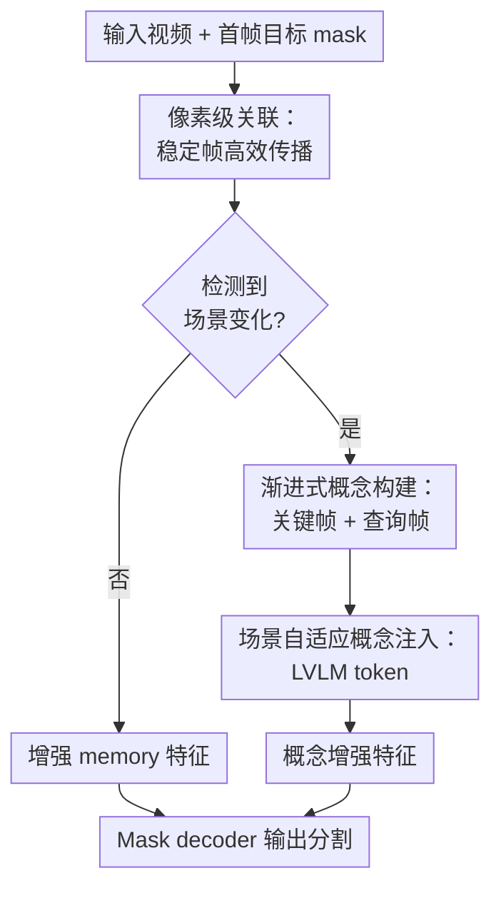

# Advancing Complex Video Object Segmentation via Progressive Concept Construction

**会议**: ICLR2026  
**OpenReview**: [https://openreview.net/forum?id=hDM3YphhVx](https://openreview.net/forum?id=hDM3YphhVx)  
**代码**: 待确认  
**领域**: 视频目标分割 / 语义分割  
**关键词**: 视频目标分割, 概念引导, LVLM, 场景切换, SeCVOS

## 一句话总结
这篇论文提出 Segment Concept（SeC），把大视觉语言模型抽取到的目标级“概念表示”按需注入 SAM 2.1 风格的视频目标分割流程，在复杂多镜头场景下显著减少外观相似干扰与目标重现失败，并构建了专门考察语义级 VOS 能力的 SeCVOS benchmark。

## 研究背景与动机
**领域现状**：半监督视频目标分割（VOS）通常给定第一帧目标 mask，然后在后续帧中持续追踪并分割同一目标。近年的主流路线以 memory-based matching 为核心：把历史帧中的目标特征存入 memory bank，查询帧通过像素级或实例级相似度匹配找回目标，再由 mask decoder 输出分割结果。SAM 2 及其长视频变体已经把这条路线推进到很强的工程水平，在 DAVIS、YouTube-VOS、SA-V 等标准 benchmark 上表现稳定。

**现有痛点**：问题在于，真实视频并不总是一个目标在连续镜头里平滑运动。电影片段、长视频编辑、监控和故事型内容经常出现切镜、遮挡、目标离场后重现、视角剧烈变化、背景人物穿着相似等情况。此时，传统 memory matching 看到的主要仍是局部纹理、颜色和形状相似度，容易把“看起来像”的干扰物当成目标，或者在目标外观变化后直接丢失。

**核心矛盾**：人类识别视频中的同一对象，并不是只靠像素外观连续性，而是会逐步构建一个目标级概念：这个人是谁、扮演什么角色、拿着什么物体、在场景里承担什么语义功能。现有 VOS 模型恰好缺少这种跨帧积累出来的高层语义概念，所以在多镜头语境中，低层 matching 越强也只能缓解局部漂移，不能真正解决“同一目标身份”判断。

**本文目标**：作者希望在不放弃 SAM 2 这类高效像素级关联能力的前提下，引入一种目标级概念表示，让模型在普通连续帧上仍然快速传播 mask，而在场景变化、目标重现、外观突变时能调用更强的语义推理来重新锁定目标。

**切入角度**：论文观察到 LVLM 已经具备较强的图像/视频语义理解能力。如果把若干关键帧和当前查询帧交给 LVLM，它有机会从多帧视觉证据中隐式总结“这个目标到底是什么”，而不必生成文字解释。于是作者把 LVLM 当成概念提取器，用一个特殊 token 的 hidden state 表示目标概念，再把它注入分割模型。

**核心 idea**：用“渐进式目标概念构建”补足 VOS 的低层外观匹配，也就是只在真正发生场景变化时调用 LVLM 形成概念引导，在稳定片段中继续使用高效的像素级关联。

## 方法详解

### 整体框架
SeC 建在 SAM 2.1-large 之上，复用其 image encoder 和 mask decoder，并在中间加入两条互补路径：一条是增强的像素级关联 memory，用来处理时间连续、外观变化不大的帧；另一条是 LVLM 概念引导模块，用来在场景切换时从关键帧中抽取目标级语义表示。在线推理时，模型先用轻量场景变化检测判断是否需要启动概念引导；如果没有变化，就走常规 memory matching；如果检测到明显变化，就把关键帧、查询帧和特殊 `<SEG>` token 送入 LVLM，取 `<SEG>` token 的隐藏状态作为目标概念向量，再通过 cross-attention 融合进查询帧特征。

整体流程可以理解成“平时靠记忆快速跟踪，关键时刻靠概念重新认人”。关键帧库会随着视频推进逐步更新，包含第一帧和最近的代表性高置信帧；概念向量也因此不是一次性固定的文本标签，而是模型在观看更多目标状态后逐步形成的对象级表征。

### 关键设计
**1. 像素级关联：保留 VOS 最可靠的连续帧传播能力**

作者没有把 VOS 完全改造成 LVLM 推理任务，因为大多数相邻帧之间仍然具有强时间连续性。在这些片段里，像素级 matching 是便宜且可靠的。SeC 沿用 SAM 2 的 memory attention 作为基础，并进一步扩展长时记忆：时间位置编码支持最多 22 帧的更宽窗口，同时借鉴 SAM2Long 的 object-aware filtering，只把非零遮挡分数、也就是目标可见的帧放入 memory。这样做的直接好处是，模型能覆盖更长时间范围，又不会让无目标帧或严重遮挡帧污染 memory bank。

这一设计解决的是“概念推理不能替代局部精细对齐”的问题。VOS 最终要输出像素级 mask，边界、局部形变、短期运动仍然需要 dense visual correspondence。SeC 的像素级关联相当于保底路径：当视频没有明显切镜时，它避免了 LVLM 频繁前向带来的成本，也保证输出仍然由细粒度视觉特征主导。

**2. 渐进式概念构建：用关键帧让 LVLM 总结目标身份而不是生成文本**

SeC 维护一个稀疏关键帧库，初始化为首帧，随后只在新帧与已有关键帧差异较大且分割结果足够可信时加入。这个条件很关键：差异大保证关键帧能覆盖目标的新视角、新场景和新外观；结果可信则避免把已经漂移的错误 mask 送进 LVLM。为了控制输入长度，关键帧库只保留首帧和一个 FIFO 的近期代表性关键帧窗口。

在概念构建时，模型把这些按时间排序的关键帧与当前查询帧输入 InternVL 2.5，并在序列末尾附加一个特殊 `<SEG>` token。和 LISA 这类用语言模型生成分割相关文本的路线不同，SeC 不让 LVLM 自回归输出解释，而是直接抽取 `<SEG>` token 的 hidden embedding 作为目标概念向量。这个向量可以被理解为“目标在多帧观察中被压缩出的身份表征”：它不只是红色衣服、圆形轮廓这类外观属性，也能编码角色、语义类别和跨镜头关系。

论文用在线/离线实验验证了“概念会逐步变完整”这一点。在线模式只能看到已处理到当前时刻的历史关键帧，SeCVOS 上 J&F 为 70.0；离线模式用整段视频最终形成的更完整概念重新分割，J&F 提升到 71.8。这说明概念表征确实受观察覆盖度影响，而不是一个无关紧要的附加 token。

**3. 场景自适应概念注入：只在语义断裂处调用 LVLM**

LVLM 概念很有用，但每帧调用显然不现实。SeC 因此设计了 scene-adaptive activation：先比较当前帧和上一帧在 HSV 颜色直方图上的 Bhattacharyya 距离，当距离超过阈值 0.35 时判定为场景变化，才启动 LVLM 概念引导。未触发时，模型直接把 memory-enhanced image features 送入 mask decoder；触发时，LVLM 产生的概念向量通过轻量 cross-attention 与当前帧空间特征融合，再与 memory-enhanced features 做逐点相加，最后由 decoder 输出 mask。

这个策略的设计点不只是“省算力”，而是把高层概念用在最需要它的时刻。相邻稳定帧中，目标身份通常不难，概念引导收益很小；一旦切镜、遮挡或重现发生，低层外观 matching 反而最容易被相似干扰物欺骗，此时注入概念先验能告诉 decoder：当前要找的是同一个语义对象，而不是最像历史纹理的区域。实验也支持这个判断：SeCVOS 上概念引导触发比例低于 10% 已经带来主要收益，继续提高触发频率的边际收益有限。

**4. SeCVOS benchmark：把“复杂语义场景”从口号变成可测任务**

作者认为现有 VOS benchmark 已经难以暴露概念级推理短板，因此构建了 Semantic Complex Scenarios Video Object Segmentation（SeCVOS）。它包含 160 个手工标注的多镜头视频，平均时长 29.36 秒，平均 4.26 个场景，目标消失率 30.2%。相比 DAVIS、YTVOS、MOSE、SA-V 和 LVOS，SeCVOS 的场景数和消失/重现频率更高，更接近视频编辑、故事理解和监控中会遇到的跨镜头目标识别。

这个 benchmark 对方法设计有反向约束：如果模型只在连续帧上做得好，在 SeCVOS 上会很快暴露问题。表 4 中，SAM 2.1 在无场景变化片段有 79.4 J&F，但多场景变化片段降到 52.4；SeC 对应为 84.2 和 67.5，提升在多场景变化上最大。这说明 SeCVOS 确实把评测重点推向了高层语义鲁棒性，而不仅是标准短视频传播精度。

### 一个完整示例
假设第一帧标注的是一名穿红金色队服的球员，后续视频先是球场近景，然后切到观众席，再切回比赛中另一个穿相似颜色衣服的人。传统 SAM 2 式 matching 会把历史 memory 中的颜色和局部纹理与当前帧比对；当相似服装干扰物出现时，模型很可能追错人，或者在原目标从新视角出现时因外观差异过大而丢失。

SeC 的处理方式是分阶段的。连续球场镜头中，模型主要走像素级关联路径，把可靠可见帧加入 memory；一旦 HSV 场景检测发现镜头切换，模型触发概念引导，把首帧、若干代表性关键帧和当前查询帧送给 LVLM，并通过 `<SEG>` token 压缩出“这名目标球员”的概念。这个概念再注入当前帧特征，使 decoder 不只是问“哪个区域像之前的红金色纹理”，而是问“哪个区域更符合前面逐步形成的目标身份”。因此，在同色干扰物和视角切换同时存在时，SeC 更有机会保持正确跟踪。

### 损失函数 / 训练策略
SeC 采用两阶段训练。第一阶段训练像素级关联 memory，用 SA-V 训练集中 SceneDetect 判定场景切换最多的 2k 个视频，每个视频随机采样 24 个打乱帧；这一阶段只更新 memory attention 模块，其余组件冻结，训练 40 个 epoch，batch size 为 64，学习率为 $5 \times 10^{-6}$。

第二阶段微调 LVLM 概念引导模块。作者使用约 190k 个来自 SA-V 的目标实例，每个实例至少有 3 个可见 mask；对每个训练样本随机选 1 到 7 个参考帧，并加入 0 到 2 个带错误标注的 distractor frames，另含一个不重叠 query frame。目标提示不是半透明 mask 覆盖，而是在目标边缘画绿色轮廓，这样既能告诉 LVLM 哪个对象是目标，又不会遮挡目标本身的视觉细节。InternVL 2.5-4B 使用 LoRA 微调，SAM 2 参数保持冻结，训练 3 个 epoch，batch size 为 64，学习率为 $4 \times 10^{-5}$。论文说明损失函数与 SAM 2 保持一致。

## 实验关键数据

### 主实验
SeCVOS 是本文最关键的主实验，因为它专门考察多场景变化下的目标身份保持能力。可以看到，所有方法在无场景变化时还比较接近，但一旦进入单场景/多场景变化，SeC 的优势迅速扩大。

| 方法 | 无场景变化 J&F | 单场景变化 J&F | 多场景变化 J&F | Overall J&F |
|------|----------------|----------------|----------------|-------------|
| XMem | 71.9 | 47.0 | 41.9 | 48.4 |
| Cutie-base | 72.5 | 53.0 | 48.3 | 52.7 |
| SAM 2.1 | 79.4 | 58.5 | 52.4 | 58.2 |
| SAMURAI | 81.8 | 60.6 | 59.3 | 62.2 |
| SAM2.1Long | 81.3 | 61.8 | 58.5 | 62.3 |
| SeC | 84.2 | 69.6 | 67.5 | 70.0 |

在标准 VOS benchmark 上，SeC 也不是只对自建数据集有效。它在 SA-V、LVOS v2、M3-VOS、MOSE v2 等多个数据集上达到或接近最佳结果，说明概念引导没有牺牲常规 VOS 能力。

| Benchmark | 指标 | SAM 2.1 | SAM2.1Long | SeC | 观察 |
|-----------|------|---------|------------|-----|------|
| SA-V val | J&F | 78.6 | 81.1 | 82.7 | SeC 领先，说明像素关联增强有效 |
| SA-V test | J&F | 79.6 | 81.2 | 81.7 | 提升较小，符合 SA-V 语义断裂较少的特点 |
| LVOS v2 val | J&F | 84.1 | 85.9 | 86.5 | 长视频场景中仍有增益 |
| MOSE v1 val | J&F | 74.5 | 75.2 | 75.3 | 与 SAM2.1Long 接近 |
| M3-VOS core | J | 64.9 | 65.5 | 67.2 | 多阶段视频上更强 |
| MOSE v2 val | J&F | 49.5 | 51.5 | 53.8 | 复杂场景中优势更明显 |

### 消融实验
模块消融显示，SeC 的收益来源并不单一。像素级关联模块在 SA-V 上贡献很大，而概念引导模块在 SeCVOS 上贡献最大，这和两类数据集的难点差异一致。

| 配置 | SA-V J&F | SeCVOS J&F | 说明 |
|------|----------|------------|------|
| SAM 2.1 baseline | 78.6 | 58.2 | 无额外像素关联与概念引导 |
| + Pixel-level Association | 82.4 | 62.2 | 强化长时 memory，普通连续场景收益明显 |
| + Pixel-level Association + Concept Guidance | 82.7 | 70.0 | 复杂多镜头场景大幅提升 |

LVLM 规模消融也很有意思：1B 到 4B 性能逐步提升，但 8B 只带来很小的额外收益，说明用于 VOS 概念引导时，并不是模型越大越划算。

| LVLM size | J&F | J | F | 说明 |
|-----------|-----|---|---|------|
| 1B | 68.4 | 68.2 | 68.7 | 已明显超过无概念引导版本 |
| 2B | 69.5 | 69.3 | 69.8 | 规模增大带来稳定增益 |
| 4B | 70.0 | 69.7 | 70.2 | 本文默认配置，性价比较好 |
| 8B | 70.3 | 70.1 | 70.7 | 增益趋于饱和 |

### 关键发现
- 概念引导的价值主要体现在真正需要语义身份判断的场景：SeCVOS 上从 62.2 提升到 70.0，而 SA-V 上只从 82.4 到 82.7，说明 LVLM 不只是普遍“加大模型”带来的涨点，而是在语义断裂处发挥作用。
- 稀疏触发已经足够。SeCVOS 上概念引导比例约 7.4% 时，SeC 达到 70.0 J&F，吞吐为 14.8 FPS；SA-V 上触发比例约 1.0%，吞吐为 18.1 FPS。相比 SAM 2 的 22.0 FPS，速度下降可控，但精度提升明显。
- 离线概念构建优于在线概念构建：无概念为 62.2，在线为 70.0，离线为 71.8。这验证了“看过更多关键帧后，目标概念更完整”的核心假设。
- SeCVOS 的难度来自多镜头语义变化，而不是单纯长视频。它平均 4.26 个 scene，30.2% disappearance rate，远高于多数标准 VOS 数据集，因此能更直接评测跨场景身份保持。

## 亮点与洞察
- SeC 最巧妙的地方是没有把 LVLM 当成文本推理器，而是当成隐式概念抽取器。这样既借用了 LVLM 的高层视觉语义能力，又避免了生成文本、解析文本、再回到 mask 的冗长链条。
- 场景自适应触发很务实。论文没有追求每帧都“智能推理”，而是承认 VOS 中大部分帧靠低层匹配就足够，把昂贵概念推理留给切镜和重现这种高风险时刻。
- SeCVOS 的贡献不只是附属数据集。它把“复杂场景 VOS 需要语义理解”这个论断变成了可量化差距：SAM 2.1 在多场景变化中明显掉点，而 SeC 的提升随场景变化数量增加而扩大。
- 这条思路可以迁移到其他视频感知任务。例如多目标跟踪、视频实例分割、长视频 referent grounding 都可能受益于“低层传播 + 高层概念按需校正”的双路径设计。

## 局限与展望
- 概念仍然依赖已观察关键帧。如果当前视角与概念构建阶段见过的视角差异极大，模型仍可能失败；论文中的 sailboat 内部视角案例就说明，有限关键帧形成的概念不能覆盖所有外观状态。
- 场景变化检测目前是 HSV 直方图 + Bhattacharyya 距离，阈值设为 0.35。这个启发式足够轻量，但对光照变化、同场景强运动、渐变转场等情况可能不够鲁棒，未来可以考虑学习式触发器或不确定性驱动触发。
- SeC 需要 fine-tune InternVL 2.5，并且训练使用约 190k 目标实例和 8 张 A800。虽然推理中触发比例低，但训练和部署门槛仍高于纯 SAM 2 变体。
- 当前方法主要处理半监督 VOS，即首帧 mask 已给定。SeCVOS 附录扩展了 Ref-SeCVOS，但 SeC 本身还没有完全转成文本 referring 设置；未来可以把概念构建和文本提示绑定起来，处理“正在奔跑的小孩”这类带时间关系的描述。
- 概念向量的可解释性仍有限。论文证明它有效，但没有系统分析 `<SEG>` hidden state 到底编码了哪些属性，后续可以用 probing 或可视化方法拆解目标身份、角色、动作和外观信息的贡献。

## 相关工作与启发
- **vs SAM 2 / SAM 2.1**: SAM 2 主要依赖图像编码器、memory attention 和 mask decoder 做高效视频 mask propagation。SeC 保留这套强基础，但在场景切换时额外注入 LVLM 概念向量，因此在多镜头和目标重现情况下更稳。
- **vs SAM2Long**: SAM2Long 通过更长 memory tree 改善长视频分割，重点仍是如何保存和检索更丰富的视觉记忆。SeC 的区别是引入目标级语义概念，不只是把 memory 拉长，而是在外观匹配失效时提供更高层的身份约束。
- **vs Cutie**: Cutie 强调 object-level memory query，比传统像素 memory 更关注对象表示。SeC 进一步把 object-level representation 推向 LVLM 概念空间，尤其适合跨镜头、跨视角和语义角色变化。
- **vs LISA / VISA / GLUS 等 LVLM 分割方法**: 这些方法通常通过语言接口或文本推理完成 reasoning segmentation。SeC 更偏 VOS 架构内部改造，不生成文字，而是把 LVLM 的 hidden state 直接变成分割引导，因此更贴近在线视频传播需求。
- **vs SAM 3 的 concept segmentation**: 论文结尾提到 SAM 3 也强调概念分割，但 SAM 3 更像系统级的 image grounding 能力扩展；SeC 更聚焦复杂视频场景，并具体改造 SAM 2 风格的视频分割路径。

## 评分
- 新颖性: ⭐⭐⭐⭐☆ 把 LVLM hidden token 当作 VOS 目标概念并按场景变化稀疏注入，思路清晰且抓住了现有 memory matching 的盲点。
- 实验充分度: ⭐⭐⭐⭐⭐ 覆盖 SeCVOS、自建 benchmark 分析、多个标准 VOS benchmark、模块消融、LVLM 规模、效率和离线概念构建验证。
- 写作质量: ⭐⭐⭐⭐☆ 主线很顺，从 failure case 到 SeC 再到 SeCVOS 的论证完整；但部分训练和触发细节放在附录，正文可解释性分析还可以更深入。
- 价值: ⭐⭐⭐⭐⭐ 对复杂视频目标分割很有启发，尤其是“低层关联负责日常帧，高层概念负责语义断裂”的设计范式，可能成为后续长视频分割和 referring VOS 的重要方向。

<!-- RELATED:START -->

## 相关论文

- [\[CVPR 2026\] Efficient Video Object Segmentation and Tracking with Recurrent Dynamic Submodel](../../CVPR2026/segmentation/efficient_video_object_segmentation_and_tracking_with_recurrent_dynamic_submodel.md)
- [\[CVPR 2026\] RMAE-ProGRess: Advancing Semantic Segmentation in Unstructured Environments](../../CVPR2026/segmentation/rmae-progress_advancing_semantic_segmentation_in_unstructured_environments.md)
- [\[CVPR 2026\] SemLayer: Semantic-aware Generative Segmentation and Layer Construction for Abstract Icons](../../CVPR2026/segmentation/semlayer_semantic-aware_generative_segmentation_and_layer_construction_for_abstr.md)
- [\[CVPR 2026\] Cross-Domain Few-Shot Segmentation via Multi-view Progressive Adaptation](../../CVPR2026/segmentation/cross-domain_few-shot_segmentation_via_multi-view_progressive_adaptation.md)
- [\[ECCV 2024\] ActionVOS: Actions as Prompts for Video Object Segmentation](../../ECCV2024/segmentation/actionvos_actions_as_prompts_for_video_object_segmentation.md)

<!-- RELATED:END -->
