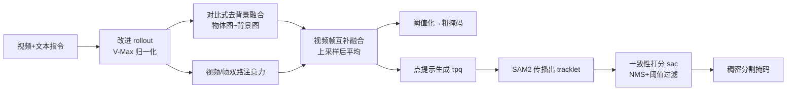

# Decomposed Attention Fusion in MLLMs for Training-free Video Reasoning Segmentation

**会议**: ICLR 2026  
**OpenReview**: [https://openreview.net/forum?id=79SSF3ppjS](https://openreview.net/forum?id=79SSF3ppjS)  
**代码**: [https://github.com/HYUNJS/DecAF](https://github.com/HYUNJS/DecAF)  
**领域**: 视频分割 / 多模态推理  
**关键词**: video reasoning segmentation, MLLM, attention rollout, training-free, SAM2, referring VOS  

## 一句话总结
把视频推理分割重构成视频问答任务，直接从 MLLM 的注意力 rollout 中抽取定位线索，再用"对比式去背景 + 视频帧互补"两种融合把噪声注意力图提纯成干净的物体掩码，最后用注意力引导 SAM2 出精细掩码——全程不训练，效果逼近训练型方法。

## 研究背景与动机
**领域现状**：多模态大模型（MLLM）在视频问答上展现出强大的时序理解和复杂推理能力，这暗示它们内部其实"知道"目标物体在哪。视频推理分割（video reasoning segmentation）要求根据需要复杂推理的文本表述（不只是外观、运动，还涉及世界知识与时序）定位并分割视频中的物体，正是检验这种隐含定位能力的任务。

**现有痛点**：当前主流做法是把 MLLM 和分割基座（SAM/SAM2）用 LoRA 等方式联合微调（LISA、VISA、VideoLISA、GLUS 等），但这需要针对模型定制训练、同时优化两个基座，算力开销大且泛化受限。唯一的训练免费路线 Loc-Head 只在图像域用空间熵挑选"定位注意力头"，强假设单物体、靠启发式压制 visual attention sink（某些区域无视指令始终拿到高分），扩展到多物体、时序视频时表现骤降。

**核心矛盾**：直接拿 MLLM 的注意力 rollout 当分割图，会同时被两类污染拖垮——一是聚合所有 head/layer 带来的弥散噪声，二是与指令无关却持续高激活的 visual attention sink。原始注意力图既不对齐物体边界，又被无关区域主导，无法直接阈值化成掩码。

**本文目标**：在完全不训练、不改模型结构的前提下，把 MLLM 注意力图提纯成可用的物体定位信号，并跨多个 MLLM 家族稳定工作。

**核心 idea**：**[把任务转成视频 QA]** 让模型回答"表述指向哪个物体"，用 rollout 抓取最后一个 token 对视觉 token 的注意力；**[分解+融合去噪]** 不靠启发式选 head，而是通过两路"对比/互补"融合系统性地抵消噪声与 sink；**[注意力引导 SAM2]** 把粗注意力图转成点提示喂给 SAM2，再用一致性打分过滤误检。

## 方法详解

### 整体框架
DecAF 是两阶段流水线。第一阶段在 MLLM 内部把任务当成视频 QA，用改进的注意力 rollout 抽出原始定位图，再经两种融合（对比式去背景 + 视频帧互补）提纯成干净的时空注意力图，直接阈值化即可得到粗掩码；第二阶段把粗注意力图转成点提示，用 SAM2 生成稠密掩码 tracklet，并以"注意力一致性分数"过滤掉落在背景上的误检 tracklet。

### 关键设计

**1. 视觉感知归一化的注意力 rollout（V-Max Rollout）：让聚合偏向真正看图像的 head。** 标准 rollout 逐层累乘 head 平均注意力并加入残差恒等项，$\hat{A}^{(l)}=(\bar{A}^{(l)}+I)/2$，$R^{(l)}=\hat{A}^{(l)}R^{(l-1)}$，但简单的 head 平均会让噪声 head 稀释物体信号。DecAF 的改法是按 head 对视觉 token 的关注强度加权：从注意力张量里取出视觉块 $A_v^{(l)}\in\mathbb{R}^{h\times N\times N_v}$，先沿视觉 token 维取最大 $m^{(l)}=\max_{j} A_v^{(l)}[:,:,j]$，再沿 token 维平均得到每个 head 的权重 $w^{(l)}\in\mathbb{R}^h$，归一化到 $\max_h w^{(l)}_h=1$ 后加权聚合 head。直觉是"越往视觉 token 投注意力的 head 越可能负责定位"，因此放大它们的话语权。消融显示 V-Max 比原始 rollout（68.4）和 Rollout-Max（72.9）在 Ref-DAVIS 上更高（75.2），且从 LLM 中间层（28 层模型的第 14 层）起始 rollout 效果最佳。

**2. 对比式物体-背景融合：用减法把 attention sink 减掉。** Visual attention sink 会让无关区域拿到极高分，单纯阈值压不下去。DecAF 用两个互补 prompt 各跑一次 rollout：物体图来自聚焦目标的 prompt "What is the main object referred to in the given expression?"，背景图来自 "Describe the background scene of the video." 由于背景 prompt 可能误把目标物体也算进背景，作者额外把识别出的类别名 $o_{name}$ 插进模板显式排除目标。两张图都 reshape 成 $(T,H_p,W_p)$ 并做高斯平滑缓解稀疏，对比图 $V_{ctr}$ 由"物体图减背景图、clamp 去负值、再 min-max 归一化"得到。背景里恒定高激活的 sink 在两个 prompt 下都出现，相减即可抵消，目标信号被凸显。消融里加上对比融合让 IVL3 在 Ref-DAVIS 的注意力掩码从 12.4 跳到 20.7、SAM 掩码从 50.8 升到 62.8。

**3. 视频-帧互补融合：用多尺度调和时序与空间。** softmax 让所有 token 分数和为 1：视频输入下注意力被摊薄到大量 token、偏稀疏但带时序上下文（物体临时消失或需要时序推理时关键），图像输入下注意力集中在少数 token、偏物体中心的细粒度但缺时序连贯。DecAF 对视频和逐帧两路跑同一 rollout 流程（帧模态沿 batch 轴处理），并做两处适配：背景 prompt 需要类别名时，聚合视频+帧两路输出用类别选择 prompt 选单一预测；min-max 归一化时帧级逐帧独立归一、视频级跨全帧全局归一。两路对齐分辨率后简单平均融合，兼得全局时序与空间精度。这套解耦 prompting 还顺带支持多尺度——帧模态可用更高分辨率（QwenVL 直接把宽高翻倍），视频低分图上采样后再融合。消融显示视频/帧单独用都不如融合（QVL2.5：65.9 / 67.4 → 75.2），多尺度再加 2.8 分。

**4. 注意力引导的 SAM2 提示与一致性过滤：把粗定位变精细掩码并杀掉误检。** 注意力图分辨率太低（patch 网格），靠它直接出的掩码轮廓很糙。DecAF 从注意力图上挑出分数高于 $\tau_{pq}$ 的视觉 token，取其中心坐标作点提示 $P=\{(t,y+o_y,x+o_x)\mid V_{t,y,x}\ge\tau_{pq}\}$ 喂给 SAM2，逐帧传播出掩码 tracklet。为减冗余，给每个掩码赋物体分 $s^{obj}_i=V_{p_i}+s^{SAM}_i$ 后做 NMS（IoU>0.7 视为重叠，留高分的）。但 SAM 常从落在墙壁等背景的点提示上出高置信误检，于是引入注意力一致性分数 $s^{ac}$：先按帧均值 $\mu_t$ 把注意力图二值化得 $M^{Attn}$，对低注意力区赋负的逐帧最大分 $\delta_t=-\max(V_{t,:,:})$ 做惩罚，最终 $s^{ac}_i=\langle\tilde{M}_i,\hat{V}\rangle/\langle M^{Attn},\hat{V}\rangle$ 衡量掩码与高注意力区跨帧的重叠度。综合分 $s^{trk}_i=\text{Avg}(V_{p_i},s^{SAM}_i,s^{ac}_i)$，保留 $\ge\tau_{trk}$ 的 tracklet 全帧传播出最终稠密掩码——天然同时支持单物体与多物体。

## 实验关键数据
覆盖三个 MLLM 家族（LLaVA-OV/InternVL3/Qwen2.5VL 等）、五个数据集（Ref-DAVIS、Ref-YTVOS、MeViS 三个 referring VOS + ReasonVOS、ReVOS 两个 reasoning VOS）。默认 Otsu 自适应阈值、rollout 从中间层起始、$\tau_{trk}=\tau_{pq}=0.8$、SAM2-hiera-large。

### 主实验表格（直接从注意力图出掩码，无 SAM，J&F）

| Method | MLLM | Ref-DAVIS | ReasonVOS | ReVOS(Overall) |
|---|---|---|---|---|
| Loc-Head | Qwen2.5VL-7B | 19.1 | 10.7 | 14.1 |
| **DecAF** | Qwen2.5VL-7B | **25.3** | **20.6** | **20.2** |
| TAM | Qwen2.5VL-7B | 3.5 | 3.7 | 4.0 |
| **DecAF** | InternVL3-8B | 20.7 | 18.4 | 16.7 |

### 主实验表格（加 SAM2 稠密掩码 vs 训练型方法，J&F）

| Method | 类型 | MLLM | Ref-DAVIS | ReasonVOS | ReVOS(Overall) |
|---|---|---|---|---|---|
| VISA | 训练型 | ChatUniVi-7B | 69.4 | - | 46.9 |
| VideoLISA | 训练型 | LLaVA-Phi-3-V | 68.8 | 47.5 | - |
| Veason-R1(RL) | 训练型 | Qwen2.5VL-7B | - | 59.9 | 61.3 |
| Loc-Head | 训练免费 | Qwen2.5VL-7B | 64.6 | 41.1 | 47.0 |
| **DecAF** | 训练免费 | Qwen2.5VL-7B | **75.2** | **63.9** | 54.2 |

DecAF 在 Ref-DAVIS 上超 VISA/VideoLISA 5.8/6.4 J&F，在 ReasonVOS 上甚至超过对同款 Qwen2.5VL 做 RL 训练的 Veason-R1，而它只用均匀采样、不带训练好的关键帧选择模块。

### 消融实验表格（Qwen2.5VL-7B SAM 掩码 J&F）

| 配置 | Ref-DAVIS | ReasonVOS |
|---|---|---|
| 仅物体注意力 | 61.9 | 58.4 |
| + 对比式去背景 | 75.2 | 63.9 |
| 仅视频注意力 | 65.9 | 58.6 |
| 仅帧注意力 | 67.4 | 58.2 |
| 视频+帧互补 | 75.2 | 63.9 |
| 去多尺度 | 72.4 | 60.5 |
| Rollout 原版 / Max / **V-Max** | 68.4 / 72.9 / **75.2** | 56.8 / 60.9 / **63.9** |

### 关键发现
- 注意力掩码本身轮廓精度（F）远低于区域相似度（J），与分割专用模型趋势相反——说明低分辨率注意力图只能给"粗定位"，但这粗信号足以引导 SAM2 出精细掩码。
- TAM 因强依赖预测词 token，在物体聚焦 prompt 下几乎无法 grounding（J&F 仅 2-4），凸显 rollout 路线的鲁棒性。
- Loc-Head 在简单 referring 数据上偶尔略高（InternVL3 的 Ref-DAVIS），但在需要复杂推理的 ReasonVOS 上大幅落后，印证启发式选 head 的泛化短板。

## 亮点与洞察
- **把分割问题"翻译"成 QA**：不去碰分割监督，而是借 MLLM 已有的视频问答能力间接拿定位线索，这种"换问题形式"的思路很巧妙。
- **用对比 prompt 做减法去 sink**：visual attention sink 是 MLLM 注意力的老大难，DecAF 不靠检测/启发式而是"同一个 sink 在物体图和背景图都在、相减即消"，简单却切中要害。
- **视频与帧注意力的互补性分析**：从 softmax 归一化约束推出"视频图稀疏带时序、帧图集中带空间"的本质差异，并据此做多尺度融合，解释清晰。
- **完全训练免费却逼近/超越训练型方法**，对算力受限场景和快速适配新 MLLM 极有价值。

## 局限与展望
- 注意力图分辨率天生很低，轮廓精度（F）受限，强依赖 SAM2 补细节；若 SAM2 失效则整体掉链子。
- 需要对每个视频跑多次 MLLM 前向（物体 prompt、背景 prompt、视频/帧两路），推理成本高于单次前向。
- 背景 prompt 需要先识别类别名再插模板，链路较长，类别识别错误会污染对比图。
- 多个阈值（$\tau_{pq}$、$\tau_{trk}$、rollout 起始层）需调，跨数据集/模型的最优值未必一致。
- 仍逊于带训练好关键帧选择的最新 SOTA（GLUS/VRS-HQ），均匀采样在长视频上可能丢关键帧。

## 相关工作与启发
- **训练型 RVOS/推理分割**：LISA、VISA、VideoLISA、GLUS、VRS-HQ、Veason-R1（RL）——靠 LoRA/全量微调把 MLLM 与 SAM 联合优化，DecAF 走完全相反的训练免费路线。
- **注意力 rollout 定位**：VL-SAM、TAM 用 rollout 在图像域定位（枚举类别），Loc-Head 选定位 head；DecAF 改进归一化并加分解融合，扩展到多物体、时序视频。
- **启发**：MLLM 的内部注意力是一座未被充分挖掘的"免费定位金矿"，"对比 prompt 做减法"这一去 sink 范式或可迁移到 grounding、检测、可解释性等其他需要从注意力提纯信号的任务。

## 评分
- 新颖性: ⭐⭐⭐⭐ 把视频推理分割重构成 QA + rollout 提纯的训练免费框架，对比/互补融合与一致性过滤组合新颖
- 实验充分度: ⭐⭐⭐⭐ 三家 MLLM × 五数据集，主实验+多组消融（融合/rollout/阈值）齐全，对比训练型与训练免费双线
- 写作质量: ⭐⭐⭐⭐ 动机推导清晰，从 sink 与 softmax 约束讲到设计动机，图示完整
- 价值: ⭐⭐⭐⭐ 训练免费却逼近/超越训练型方法，对低成本适配新 MLLM 与可解释定位有实用与启发价值

<!-- RELATED:START -->

## 相关论文

- [\[CVPR 2026\] Live Interactive Training for Video Segmentation](../../CVPR2026/segmentation/live_interactive_training_for_video_segmentation.md)
- [\[ICCV 2025\] SAM2Long: Enhancing SAM 2 for Long Video Segmentation with a Training-Free Memory Tree](../../ICCV2025/segmentation/sam2long_enhancing_sam_2_for_long_video_segmentation_with_a.md)
- [\[CVPR 2026\] ReAttnCLIP: Training-Free Open-Vocabulary Remote Sensing Image Segmentation via Re-defined Attention in CLIP](../../CVPR2026/segmentation/reattnclip_training-free_open-vocabulary_remote_sensing_image_segmentation_via_r.md)
- [\[CVPR 2025\] ResCLIP: Residual Attention for Training-free Dense Vision-language Inference](../../CVPR2025/segmentation/resclip_residual_attention_for_training-free_dense_vision-language_inference.md)
- [\[CVPR 2026\] INSID3: Training-Free In-Context Segmentation with DINOv3](../../CVPR2026/segmentation/insid3_training-free_in-context_segmentation_with_dinov3.md)

<!-- RELATED:END -->
